# 014 UML의 주요 관계

작성 기준일: 2026-05-02  
과목: `1과목 소프트웨어 설계`  
기준 PDF: `/Users/nes0903/Documents/study/정보처리기사/핵심요약집_2026_정보처리기사필기핵심요약.pdf`  
PDF 확인 위치: `2페이지`  
검색 보강: OMG UML 2.5.1 명세 페이지, OMG What is UML, UML-Diagrams 관계 설명, Visual Paradigm 관계 비교 자료, Q-Net 정보처리기사 시험 정보를 함께 확인하여 시험 중심으로 확장 정리

---

## 1. 한 줄 요약

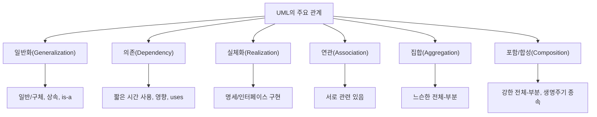

- UML의 관계는 사물(Things) 사이의 의미 있는 연결을 표현한다.
- PDF 기준 핵심 관계는 `일반화`, `의존`, `실체화`다.
- 시험에서는 PDF 핵심 3개에 더해 `연관`, `집합`, `포함`을 섞어 내는 경우가 많으므로 6개를 함께 정리하면 안정적이다.
- 가장 중요한 구분은 다음과 같다.
  - `일반화` = 상위/하위 개념, 상속, `is-a`
  - `의존` = 잠깐 사용, 변경 영향, `uses`
  - `실체화` = 인터페이스/명세를 구현
  - `연관` = 서로 관련됨
  - `집합` = 전체-부분이지만 부분이 독립 가능
  - `포함` = 전체-부분이며 부분의 생명주기가 전체에 강하게 종속

---

## 2. PDF 기준 핵심

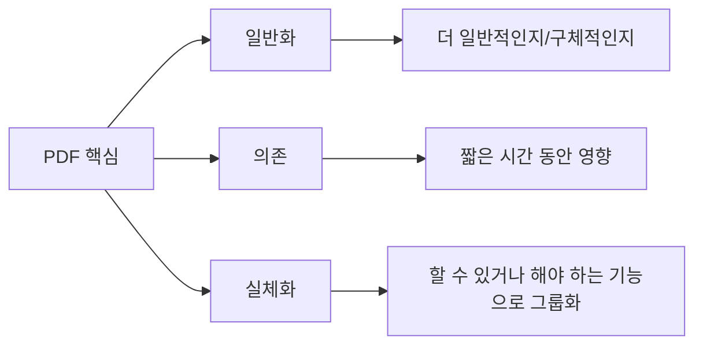

- PDF에 제시된 핵심 관계는 다음 3개다.
  - `일반화(Generalization) 관계`
    - 하나의 사물이 다른 사물에 비해 더 일반적인지 구체적인지를 표현한다.
  - `의존(Dependency) 관계`
    - 필요에 의해 서로에게 영향을 주는 짧은 시간 동안만 연관을 유지하는 관계를 표현한다.
  - `실체화(Realization) 관계`
    - 사물이 할 수 있거나 해야 하는 기능으로 서로를 그룹화할 수 있는 관계를 표현한다.

- 이 챕터의 최소 암기 목표:
  - PDF 기준 3개 관계의 정의
  - 각 관계의 대표 단서어
  - UML 표기법
  - 일반화와 실체화의 차이
  - 의존과 연관의 차이
  - 집합과 포함의 차이

- 시험에서 자주 바뀌는 표현:

| PDF 표현 | 같은 의미로 볼 수 있는 표현 |
|---|---|
| 더 일반적인지 구체적인지 | 부모-자식, 상위-하위, 상속, is-a |
| 짧은 시간 동안만 연관 | 일시적 사용, 메서드 매개변수 사용, uses |
| 해야 하는 기능으로 그룹화 | 인터페이스 구현, 명세 실현, contract 구현 |

---

## 3. UML에서 관계의 위치

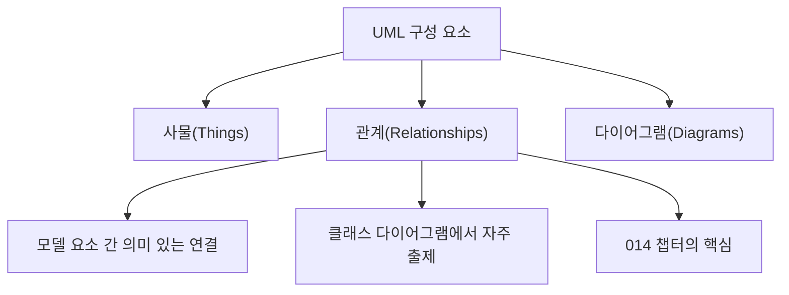

- 이전 챕터 `013 UML`에서 UML 구성 요소는 `사물`, `관계`, `다이어그램`이라고 정리했다.
- 이 챕터는 그중 `관계(Relationships)`를 다룬다.
- 관계는 클래스, 인터페이스, 패키지, 컴포넌트 같은 모델 요소가 서로 어떤 의미로 연결되는지를 표현한다.
- 관계는 UML 다이어그램 중 특히 클래스 다이어그램, 컴포넌트 다이어그램, 패키지 다이어그램에서 자주 등장한다.

- OMG UML 명세 페이지는 UML을 분산 객체 시스템의 산출물을 시각화, 명세화, 구성, 문서화하기 위한 그래픽 언어로 설명한다.
- OMG의 UML 소개는 모델링이 구현 전에 구조와 요구사항을 검토하는 데 도움을 준다고 설명한다.
- 따라서 UML 관계는 단순 선 긋기가 아니라 시스템 구조의 의미를 명확히 하는 설계 표현이다.

- 시험 포인트:
  - UML 관계는 `사물 간 연결`이다.
  - 관계 이름, 의미, 표기법, 예시를 함께 외워야 한다.
  - 보기에서 `상속`, `구현`, `일시적 사용`, `전체-부분` 단서어를 찾는다.

---

## 4. 주요 관계 전체 비교

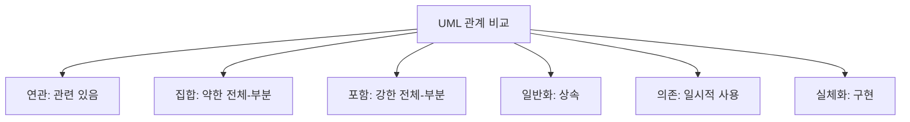

| 관계 | 영문 | 핵심 의미 | 대표 단서 | 표기 감각 |
|---|---|---|---|---|
| 연관 | Association | 두 사물이 관련되어 있음 | 알고 있음, 참조, 연결 | 실선 |
| 집합 | Aggregation | 전체-부분 관계, 부분 독립 가능 | has-a, 약한 소유 | 빈 마름모 |
| 포함 | Composition | 전체-부분 관계, 부분 생명주기 종속 | 강한 소유, part-of | 채운 마름모 |
| 일반화 | Generalization | 상위-하위 개념, 상속 | is-a, 부모-자식 | 실선 + 빈 삼각형 |
| 의존 | Dependency | 한 요소가 다른 요소를 일시적으로 사용 | uses, 영향, 짧은 관계 | 점선 화살표 |
| 실체화 | Realization | 명세나 인터페이스를 구현 | implements, contract | 점선 + 빈 삼각형 |

- 강한 암기 축:
  - `is-a` → 일반화
  - `implements` → 실체화
  - `uses` → 의존
  - `has-a` → 집합 또는 포함
  - `knows-a` → 연관

- 시험에서 PDF 핵심만 묻는다면:
  - 일반화, 의존, 실체화 3개를 우선 본다.

- 시험에서 UML 관계 전체를 묻는다면:
  - 연관, 집합, 포함까지 함께 고려한다.

---

## 5. 일반화(Generalization)

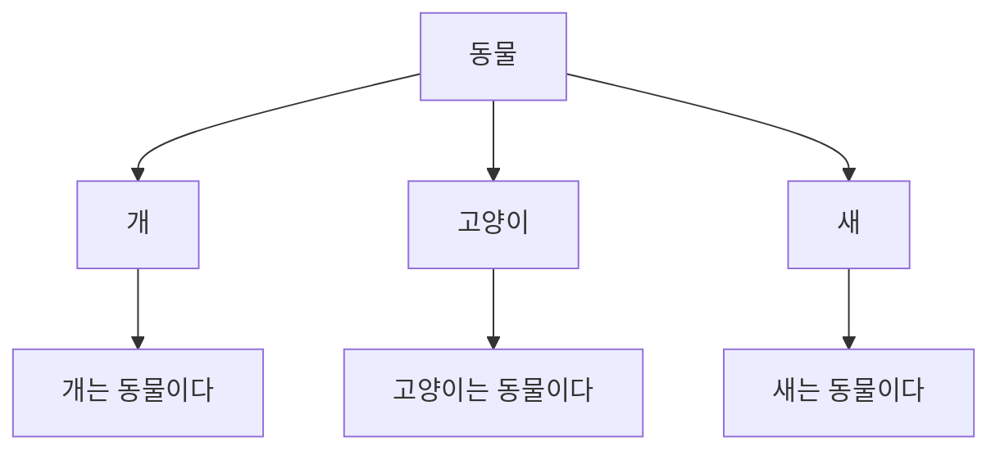

- 의미:
  - 일반화는 하나의 사물이 다른 사물보다 더 일반적인지, 더 구체적인지를 표현하는 관계다.
  - 객체지향에서는 상위 클래스와 하위 클래스의 관계, 즉 상속 관계로 이해하면 쉽다.
  - UML-Diagrams는 일반화를 더 일반적인 분류자와 더 구체적인 분류자 사이의 분류 관계로 설명한다.

- 대표 단서:
  - 상속
  - 부모-자식
  - 상위-하위
  - 일반-구체
  - superclass/subclass
  - is-a

- 예시:
  - `자동차`는 `교통수단`이다.
  - `고양이`는 `동물`이다.
  - `관리자`는 `사용자`이다.
  - `신용카드 결제`는 `결제`이다.

- 표기:
  - 하위 클래스에서 상위 클래스로 빈 삼각형 화살표를 그린다.
  - 화살표 머리는 더 일반적인 요소를 향한다.

- 시험 포인트:
  - `더 일반적/구체적`이라는 PDF 문장은 일반화다.
  - `상속`, `is-a`, `부모-자식`이 나오면 일반화다.
  - 일반화는 실체화와 둘 다 빈 삼각형을 쓰지만, 일반화는 실선이고 실체화는 점선이다.

---

## 6. 의존(Dependency)

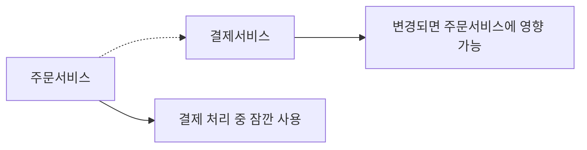

- 의미:
  - 의존은 한 모델 요소가 다른 모델 요소를 필요로 하거나 사용해서 영향을 받는 관계다.
  - PDF는 필요에 의해 서로에게 영향을 주는 짧은 시간 동안만 연관을 유지하는 관계라고 설명한다.
  - UML-Diagrams는 의존을 어떤 요소가 명세나 구현을 위해 다른 모델 요소를 필요로 하는 방향성 있는 관계로 설명한다.

- 대표 단서:
  - 일시적 사용
  - 잠깐 사용
  - 메서드 매개변수
  - 지역 변수
  - 생성
  - 호출
  - uses
  - 변경 영향

- 예시:
  - `주문서비스`가 결제할 때만 `결제서비스`를 호출한다.
  - `보고서생성기`가 생성 순간에만 `PDF라이브러리`를 사용한다.
  - `컨트롤러`가 요청 처리 중 `검색서비스`를 호출한다.

- 표기:
  - 점선 화살표로 표현한다.
  - 화살표는 의존하는 쪽에서 의존 대상 쪽으로 향한다.
  - 즉, `사용하는 쪽 -> 사용되는 쪽`으로 이해하면 쉽다.

- 연관과의 차이:
  - 연관은 비교적 지속적인 구조적 연결이다.
  - 의존은 일시적이고 약한 사용 관계다.

- 시험 포인트:
  - `짧은 시간 동안만 연관`은 의존이다.
  - `필요에 의해 영향`은 의존이다.
  - 의존은 UML 관계 중 약한 결합으로 출제되기 쉽다.

---

## 7. 실체화(Realization)

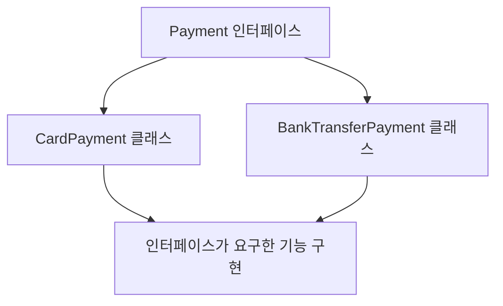

- 의미:
  - 실체화는 사물이 할 수 있거나 해야 하는 기능으로 서로를 그룹화할 수 있는 관계다.
  - 가장 대표적인 예는 인터페이스와 그 인터페이스를 구현하는 클래스의 관계다.
  - UML-Diagrams는 실체화를 명세를 나타내는 요소와 그 명세의 구현을 나타내는 요소 사이의 추상화 관계로 설명한다.

- 대표 단서:
  - 인터페이스 구현
  - 명세 구현
  - 계약 실현
  - implements
  - specification/implementation
  - 해야 하는 기능을 실제로 수행

- 예시:
  - `Payment` 인터페이스를 `CardPayment` 클래스가 구현한다.
  - `Repository` 인터페이스를 `JpaRepository` 클래스가 구현한다.
  - `Runnable` 인터페이스를 특정 작업 클래스가 구현한다.

- 표기:
  - 점선 + 빈 삼각형 화살표로 표현한다.
  - 구현 클래스에서 인터페이스나 명세 쪽으로 화살표를 그린다.

- 일반화와의 차이:
  - 일반화는 클래스 간 상속 관계다.
  - 실체화는 인터페이스/명세를 구현하는 관계다.
  - 둘 다 빈 삼각형을 쓰지만, 일반화는 실선이고 실체화는 점선이다.

- 시험 포인트:
  - `할 수 있거나 해야 하는 기능`이라는 PDF 문장은 실체화다.
  - `인터페이스 구현`, `implements`가 나오면 실체화다.

---

## 8. 연관(Association)

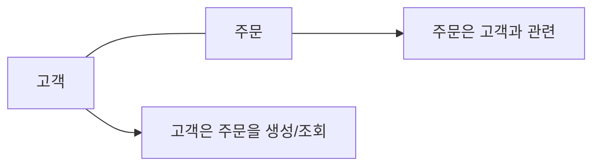

- 의미:
  - 연관은 두 사물이 서로 관련되어 있음을 표현하는 관계다.
  - 클래스 다이어그램에서 한 클래스의 객체가 다른 클래스의 객체와 연결될 수 있음을 나타낸다.
  - UML-Diagrams는 association을 분류자 인스턴스들이 서로 연결될 수 있거나 집합으로 결합될 수 있음을 보여주는 관계로 설명한다.

- 대표 단서:
  - 관련 있음
  - 알고 있음
  - 참조함
  - 연결됨
  - has reference
  - 객체 간 지속적 연결

- 예시:
  - `고객`은 `주문`을 가진다.
  - `학생`은 `강좌`를 수강한다.
  - `의사`는 `환자`를 진료한다.
  - `사용자`는 `게시글`을 작성한다.

- 표기:
  - 보통 실선으로 표현한다.
  - 방향성이 있으면 화살표를 붙일 수 있다.
  - 다중성도 함께 표현할 수 있다.

- 의존과의 차이:
  - 연관은 구조적으로 더 지속적인 관계다.
  - 의존은 필요한 순간 잠깐 사용하는 관계다.

- 시험 포인트:
  - PDF에는 직접 핵심으로 나오지 않지만 UML 관계 보기에서 자주 섞인다.
  - 단순히 두 클래스가 연결되어 있거나 서로 알고 있으면 연관을 의심한다.

---

## 9. 집합(Aggregation)

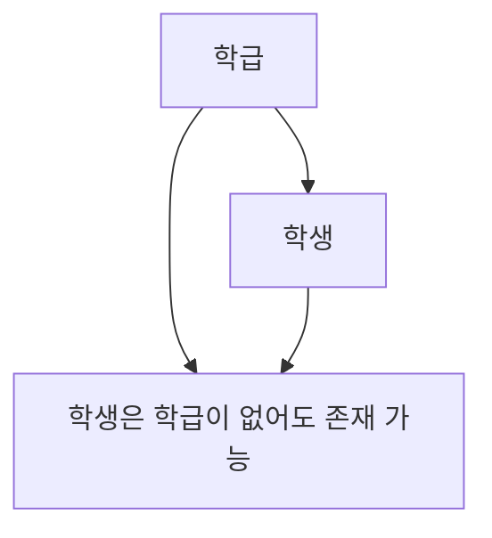

- 의미:
  - 집합은 전체와 부분의 관계를 나타내지만, 부분 객체가 전체 객체 없이도 독립적으로 존재할 수 있는 관계다.
  - Visual Paradigm은 aggregation을 parent가 없어도 child가 독립적으로 존재할 수 있는 관계로 설명한다.

- 대표 단서:
  - 전체-부분
  - 느슨한 소유
  - has-a
  - 부분 독립 가능
  - 약한 집합

- 예시:
  - `학급`과 `학생`
    - 학급이 없어져도 학생은 존재할 수 있다.
  - `팀`과 `선수`
    - 팀이 해체되어도 선수는 존재할 수 있다.
  - `도서관`과 `책`
    - 도서관이 사라져도 책은 독립적으로 존재할 수 있다.

- 표기:
  - 전체 쪽에 빈 마름모를 붙인다.
  - 빈 마름모는 약한 전체-부분 관계를 의미한다.

- 포함과의 차이:
  - 집합은 부분이 독립 가능하다.
  - 포함은 부분이 전체 생명주기에 강하게 종속된다.

- 시험 포인트:
  - `전체-부분`인데 `부분이 독립 가능`하면 집합이다.
  - 빈 마름모는 집합이다.

---

## 10. 포함/합성(Composition)

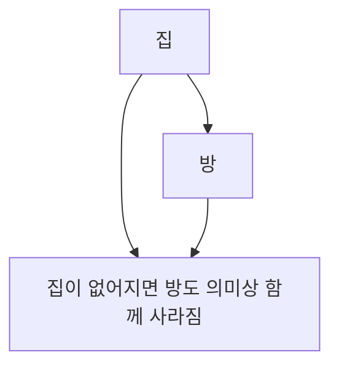

- 의미:
  - 포함 또는 합성은 전체와 부분의 관계 중 강한 소유 관계다.
  - 부분 객체의 생명주기가 전체 객체에 강하게 종속된다.
  - Visual Paradigm은 composition을 child가 parent와 독립적으로 존재할 수 없는 관계로 설명한다.

- 대표 단서:
  - 강한 전체-부분
  - 강한 소유
  - 생명주기 종속
  - part-of
  - 전체가 사라지면 부분도 함께 사라짐

- 예시:
  - `집`과 `방`
    - 방은 집과 분리되어 독립적인 객체로 보기 어렵다.
  - `주문`과 `주문항목`
    - 주문이 삭제되면 주문항목도 함께 사라지는 모델이 일반적이다.
  - `게시글`과 `댓글`
    - 모델에 따라 다르지만, 게시글 삭제 시 댓글도 삭제된다면 포함으로 볼 수 있다.

- 표기:
  - 전체 쪽에 채운 마름모를 붙인다.
  - 채운 마름모는 강한 전체-부분 관계를 의미한다.

- 집합과의 차이:
  - 집합은 부분이 독립 가능하다.
  - 포함은 부분이 전체에 강하게 종속된다.

- 시험 포인트:
  - `생명주기 종속`, `강한 포함`, `채운 마름모`가 나오면 포함이다.
  - `부분이 독립 불가`가 핵심이다.

---

## 11. 표기법 비교

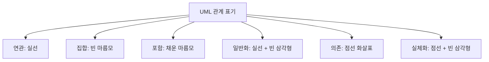

| 관계 | 표기법 | 화살표/마름모 방향 감각 |
|---|---|---|
| 연관 | 실선 | 연결된 두 요소 사이 |
| 집합 | 실선 + 빈 마름모 | 마름모는 전체 쪽 |
| 포함 | 실선 + 채운 마름모 | 마름모는 전체 쪽 |
| 일반화 | 실선 + 빈 삼각형 | 삼각형은 상위/일반 쪽 |
| 의존 | 점선 화살표 | 사용하는 쪽에서 사용되는 쪽 |
| 실체화 | 점선 + 빈 삼각형 | 구현체에서 인터페이스/명세 쪽 |

- 가장 많이 헷갈리는 표기:
  - 일반화와 실체화
    - 일반화: 실선 + 빈 삼각형
    - 실체화: 점선 + 빈 삼각형
  - 집합과 포함
    - 집합: 빈 마름모
    - 포함: 채운 마름모
  - 의존과 실체화
    - 둘 다 점선이지만 실체화는 빈 삼각형, 의존은 일반 화살표

- 시험 포인트:
  - 표기법 문제는 기호 모양을 직접 묻거나, 관계 설명과 함께 묻는다.
  - `빈 삼각형`, `점선`, `마름모` 단서어를 놓치지 않는다.

---

## 12. 관계 강도와 생명주기 관점


- UML 관계를 결합 강도와 생명주기 관점으로 보면 이해가 쉬워진다.

- 약한 관계:
  - 의존은 일시적 사용 관계다.
  - 어떤 메서드가 다른 클래스를 잠깐 사용하면 의존으로 표현하기 쉽다.

- 중간 관계:
  - 연관은 객체가 서로 구조적으로 관련되는 관계다.
  - 필드로 참조하거나 지속적으로 알고 있는 관계에 가깝다.

- 전체-부분 관계:
  - 집합은 전체-부분이지만 부분이 독립 가능하다.
  - 포함은 전체-부분이며 부분이 전체에 강하게 종속된다.

- 상속/구현 관계:
  - 일반화는 상위-하위 타입 관계다.
  - 실체화는 명세 또는 인터페이스 구현 관계다.

- 시험 포인트:
  - 관계 선택 문제는 `사용`, `관련`, `전체-부분`, `상속`, `구현` 중 무엇인지 먼저 구분한다.

---

## 13. 일반화와 실체화 비교

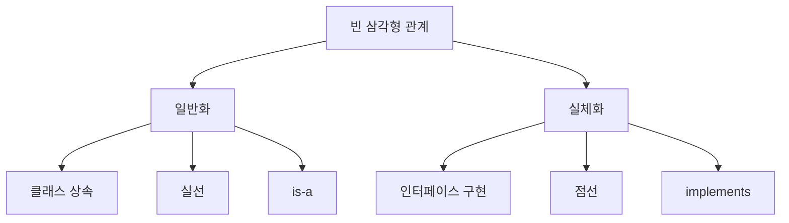

| 구분 | 일반화 | 실체화 |
|---|---|---|
| 핵심 | 상위-하위 개념 | 명세/인터페이스 구현 |
| 객체지향 대응 | 상속 | 인터페이스 구현 |
| 단서 | is-a, 부모-자식 | implements, contract |
| 표기 | 실선 + 빈 삼각형 | 점선 + 빈 삼각형 |
| 예시 | `Dog`는 `Animal`이다 | `CardPayment`가 `Payment` 인터페이스 구현 |

- 일반화 예시:
  - `AdminUser`는 `User`이다.
  - `CheckingAccount`는 `Account`이다.

- 실체화 예시:
  - `JpaUserRepository`는 `UserRepository` 인터페이스를 구현한다.
  - `EmailSender`는 `MessageSender` 인터페이스를 구현한다.

- 시험 포인트:
  - `더 일반적/구체적`이면 일반화다.
  - `해야 하는 기능`, `인터페이스`, `구현`이면 실체화다.
  - 두 관계 모두 빈 삼각형을 사용하므로 실선/점선을 구분한다.

---

## 14. 의존과 연관 비교

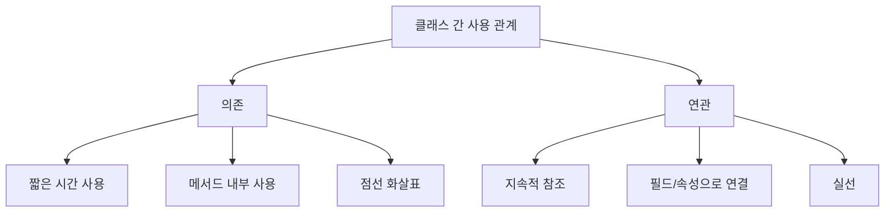

| 구분 | 의존 | 연관 |
|---|---|---|
| 관계 성격 | 일시적 사용 | 구조적 연결 |
| 지속성 | 짧음 | 비교적 지속 |
| 코드 감각 | 매개변수, 지역 변수, 임시 호출 | 필드, 멤버 변수, 참조 보관 |
| 표기 | 점선 화살표 | 실선 |
| 예시 | `ReportService`가 `PdfUtil`을 잠깐 사용 | `Customer`가 여러 `Order`와 연결 |

- 의존 예시:
  - `OrderService.cancel(orderId, NotificationSender sender)`
  - 이 경우 `OrderService`가 `NotificationSender`를 잠깐 사용할 수 있다.

- 연관 예시:
  - `Customer` 클래스가 `List<Order>`를 가진다.
  - 이 경우 고객과 주문은 비교적 지속적인 관계를 가진다.

- 시험 포인트:
  - `짧은 시간`, `일시적`, `필요에 의해 영향`은 의존이다.
  - 단순히 관련되어 있고 지속적으로 참조하면 연관이다.

---

## 15. 집합과 포함 비교

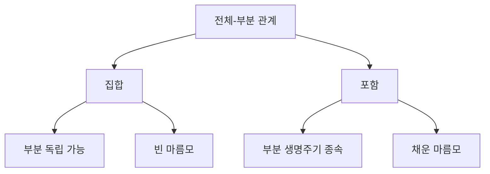

| 구분 | 집합(Aggregation) | 포함/합성(Composition) |
|---|---|---|
| 핵심 | 약한 전체-부분 | 강한 전체-부분 |
| 부분 독립성 | 부분이 독립적으로 존재 가능 | 부분이 전체에 강하게 종속 |
| 생명주기 | 별도 생명주기 가능 | 전체와 생명주기 연결 |
| 표기 | 빈 마름모 | 채운 마름모 |
| 예시 | 학급-학생, 팀-선수 | 주문-주문항목, 집-방 |

- 집합 예시:
  - `Team`과 `Player`
  - 선수가 팀을 떠나도 선수는 독립적으로 존재한다.

- 포함 예시:
  - `Order`와 `OrderItem`
  - 주문이 삭제되면 주문항목도 함께 삭제되는 모델이라면 포함이다.

- 시험 포인트:
  - `전체-부분`이라는 말만으로는 집합/포함을 확정할 수 없다.
  - 부분의 독립성과 생명주기 종속 여부를 봐야 한다.
  - 빈 마름모는 집합, 채운 마름모는 포함이다.

---

## 16. 예시: 주문 시스템 관계

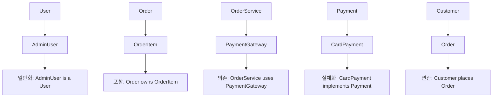

- 주문 시스템 예시:
  - `AdminUser`는 `User`의 하위 개념이다.
    - 관계: 일반화
  - `Customer`는 `Order`와 관련된다.
    - 관계: 연관
  - `Order`는 여러 `OrderItem`으로 구성되고, 주문 삭제 시 주문항목도 사라진다.
    - 관계: 포함
  - `OrderService`는 결제할 때 `PaymentGateway`를 사용한다.
    - 관계: 의존
  - `CardPayment`는 `Payment` 인터페이스를 구현한다.
    - 관계: 실체화

- 같은 도메인에서도 관계가 다르게 적용된다.
  - `Customer-Order`는 연관
  - `Order-OrderItem`은 포함
  - `OrderService-PaymentGateway`는 의존
  - `CardPayment-Payment`는 실체화

- 시험 포인트:
  - 예시 객체 이름만 보고 판단하지 말고, 관계의 의미를 봐야 한다.
  - `주문-주문항목`은 포함으로 자주 설명되지만, 도메인 정책에 따라 다를 수 있다.
  - 정보처리기사 문제에서는 지문에 주어진 단서어를 우선한다.

---

## 17. 관계 선택 기준

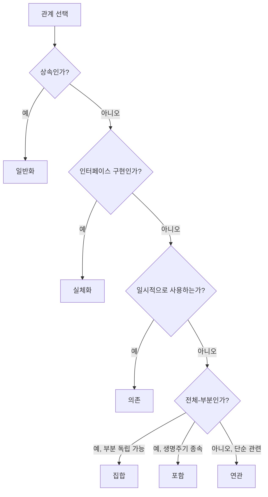

- 관계를 선택할 때는 다음 순서로 판단하면 빠르다.

- 1단계: `is-a`인가
  - 하위 클래스가 상위 클래스의 한 종류라면 일반화다.

- 2단계: `implements`인가
  - 클래스가 인터페이스나 명세를 구현한다면 실체화다.

- 3단계: `uses`인가
  - 잠깐 사용하거나 변경 영향을 받는다면 의존이다.

- 4단계: `has-a`, 전체-부분인가
  - 부분이 독립 가능하면 집합이다.
  - 부분이 생명주기상 종속되면 포함이다.

- 5단계: 단순 관련인가
  - 위에 해당하지 않고 두 클래스가 구조적으로 관련되어 있으면 연관이다.

- 시험 포인트:
  - 보기에서 `is-a`, `has-a`, `uses`, `implements` 단서를 잡으면 관계 선택이 쉬워진다.

---

## 18. 코드 감각으로 이해하기

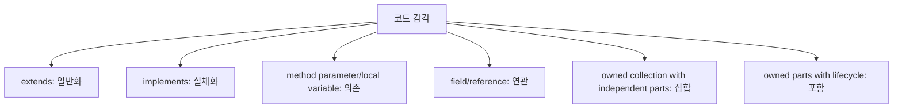

- UML은 코드와 1:1로 완전히 대응되는 것은 아니지만, 코드 감각으로 이해하면 관계 구분이 쉬워진다.

- 일반화:
  - `class Dog extends Animal`
  - `Dog`는 `Animal`의 한 종류다.

- 실체화:
  - `class CardPayment implements Payment`
  - `CardPayment`는 `Payment`가 요구한 기능을 구현한다.

- 의존:
  - 메서드 매개변수로 잠깐 받는다.
  - 지역 변수로 잠깐 사용한다.
  - 생성하거나 호출만 한다.

- 연관:
  - 클래스 필드로 다른 객체를 가진다.
  - 객체 관계가 비교적 지속된다.

- 집합:
  - 전체 객체가 부분 객체를 참조하지만 부분은 독립적으로 존재할 수 있다.

- 포함:
  - 전체 객체가 부분 객체를 강하게 소유하고, 전체가 사라지면 부분도 함께 사라지는 모델이다.

- 시험 포인트:
  - 코드를 직접 묻는 문제는 적지만, `상속`, `구현`, `사용`, `소유` 단어를 코드 감각으로 연결하면 이해가 빠르다.

---

## 19. SOLID와 의존 관계 연결

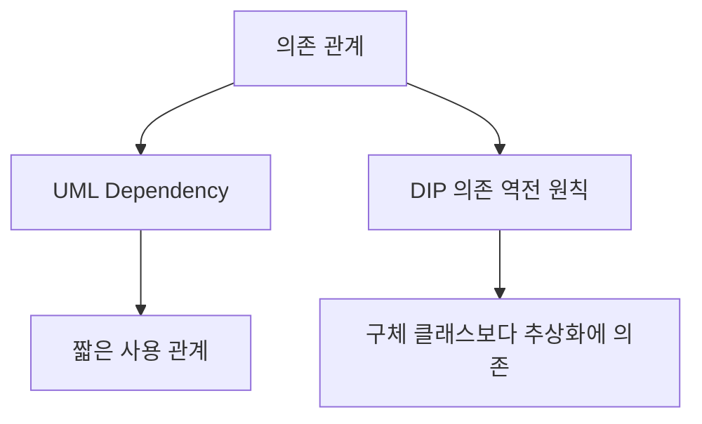

- PDF의 뒤쪽 객체지향 설계 원칙 챕터에는 `의존 역전 원칙(DIP)`이 등장한다.
- DIP는 UML의 의존 관계 자체와 같은 개념은 아니지만, 객체 간 의존을 어떻게 설계할지와 연결된다.

- UML 의존:
  - 어떤 요소가 다른 요소를 필요로 하는 관계를 표현한다.
  - 점선 화살표로 나타낸다.

- DIP:
  - 고수준 모듈이 저수준 구현체에 직접 의존하지 않고 추상화에 의존해야 한다는 설계 원칙이다.
  - 예: `OrderService`가 `CardPaymentGateway`가 아니라 `PaymentGateway` 인터페이스에 의존한다.

- 연결해서 이해:
  - UML에서 `OrderService ..> PaymentGateway`로 표현하면 추상화에 의존하는 설계를 보여줄 수 있다.
  - `PaymentGateway` 인터페이스를 `CardPaymentGateway`가 실체화하면 DIP와 실체화 관계가 함께 연결된다.

- 시험 포인트:
  - UML 의존 관계와 SOLID의 DIP는 이름이 비슷해도 문맥이 다르다.
  - UML 관계 문제에서는 `의존 관계`의 표기와 의미를 묻는다.
  - SOLID 문제에서는 `추상성이 높은 클래스와 의존`이라는 설계 원칙을 묻는다.

---

## 20. 시험에서 보는 단서어

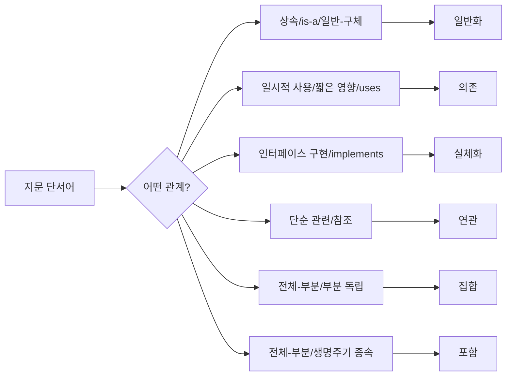

- 단서어별 빠른 매칭:

| 단서어 | 관계 |
|---|---|
| 상속, 부모-자식, 상위-하위, 일반-구체, is-a | 일반화 |
| 필요에 의해 영향, 짧은 시간, 일시적 사용, uses | 의존 |
| 인터페이스 구현, 명세 구현, implements, contract | 실체화 |
| 연결, 관련, 알고 있음, 참조 | 연관 |
| 전체-부분, 약한 소유, 부분 독립 가능 | 집합 |
| 전체-부분, 강한 소유, 생명주기 종속 | 포함 |

- PDF 기준 핵심 단서:
  - `더 일반적인지 구체적인지` → 일반화
  - `짧은 시간 동안만 연관` → 의존
  - `해야 하는 기능` → 실체화

- 표기 단서:
  - 실선 + 빈 삼각형 → 일반화
  - 점선 화살표 → 의존
  - 점선 + 빈 삼각형 → 실체화
  - 빈 마름모 → 집합
  - 채운 마름모 → 포함

---

## 21. 보기 판별 예시

```mermaid
flowchart TD
    A["보기 판별"] --> B{"단서 확인"}
    B -- "일반/구체" --> C["일반화"]
    B -- "짧은 시간 영향" --> D["의존"]
    B -- "기능 구현" --> E["실체화"]
    B -- "전체-부분" --> F["집합/포함"]
```

| 보기 | 판단 | 이유 |
|---|---|---|
| 일반화 관계는 하나의 사물이 다른 사물보다 일반적인지 구체적인지를 표현한다 | O | PDF 핵심 |
| 의존 관계는 필요에 의해 짧은 시간 동안만 연관을 유지하는 관계이다 | O | PDF 핵심 |
| 실체화 관계는 사물이 할 수 있거나 해야 하는 기능으로 그룹화할 수 있는 관계이다 | O | PDF 핵심 |
| 일반화 관계는 인터페이스를 구현하는 관계이다 | X | 인터페이스 구현은 실체화 |
| 의존 관계는 전체와 부분의 강한 생명주기 종속 관계이다 | X | 강한 전체-부분은 포함 |
| 집합 관계는 부분 객체가 독립적으로 존재할 수 있는 전체-부분 관계이다 | O | 집합의 핵심 |
| 포함 관계는 부분의 생명주기가 전체에 강하게 종속되는 관계이다 | O | 포함의 핵심 |
| 실체화는 실선 + 빈 삼각형으로 표현한다 | X | 실체화는 점선 + 빈 삼각형 |

- 문제 풀이 순서:
  1. 설명에 `상속`, `사용`, `구현`, `전체-부분` 중 무엇이 있는지 본다.
  2. 표기법이 있으면 선 종류와 화살표/마름모를 확인한다.
  3. PDF 핵심 3개와 확장 관계 3개를 구분한다.
  4. `일반화`와 `실체화`, `집합`과 `포함`, `의존`과 `연관`을 특히 조심한다.

---

## 22. 자주 나오는 함정

```mermaid
flowchart TD
    A["UML 관계 함정"] --> H1["일반화와 실체화 혼동"]
    A --> H2["의존과 연관 혼동"]
    A --> H3["집합과 포함 혼동"]
    A --> H4["표기법 선 종류 혼동"]
    A --> H5["PDF 핵심 범위와 확장 관계 혼동"]
```

- 함정 1: 일반화와 실체화 혼동
  - 일반화는 상속이다.
  - 실체화는 인터페이스나 명세의 구현이다.
  - 둘 다 빈 삼각형을 쓰지만 선 종류가 다르다.

- 함정 2: 의존과 연관 혼동
  - 의존은 짧은 시간 동안 영향을 주는 관계다.
  - 연관은 비교적 지속적인 구조적 연결이다.

- 함정 3: 집합과 포함 혼동
  - 집합은 부분이 독립 가능하다.
  - 포함은 부분이 전체에 강하게 종속된다.
  - 빈 마름모와 채운 마름모를 구분한다.

- 함정 4: 표기법 방향 혼동
  - 일반화 화살표는 상위 클래스 쪽을 향한다.
  - 실체화 화살표는 인터페이스/명세 쪽을 향한다.
  - 의존 화살표는 사용하는 쪽에서 사용되는 쪽으로 향한다.
  - 집합/포함의 마름모는 전체 쪽에 붙는다.

- 함정 5: PDF 핵심 3개만 외우고 보기에서 연관/집합/포함을 놓침
  - PDF는 일반화, 의존, 실체화를 핵심으로 제시한다.
  - 실제 UML 관계 문제는 연관, 집합, 포함을 함께 섞을 수 있다.

- 함정 6: 모든 `has-a`를 포함으로 판단
  - `has-a`는 집합이나 포함 둘 다 가능하다.
  - 부분의 독립성과 생명주기를 보고 판단해야 한다.

---

## 23. 암기 포인트

```mermaid
flowchart TD
    A["암기 프레임"] --> B["일"]
    A --> C["의"]
    A --> D["실"]
    A --> E["연"]
    A --> F["집"]
    A --> G["포"]

    B --> B1["일반화: is-a"]
    C --> C1["의존: uses"]
    D --> D1["실체화: implements"]
    E --> E1["연관: knows-a"]
    F --> F1["집합: weak has-a"]
    G --> G1["포함: strong part-of"]
```

- PDF 핵심 암기:
  - `일-의-실`
  - 일반화, 의존, 실체화

- 확장 관계까지 암기:
  - `연-집-포-일-의-실`
  - 연관, 집합, 포함, 일반화, 의존, 실체화

- 의미 암기:
  - 일반화 = 상속 = is-a
  - 의존 = 일시적 사용 = uses
  - 실체화 = 인터페이스 구현 = implements
  - 연관 = 서로 관련 = knows-a
  - 집합 = 약한 전체-부분 = weak has-a
  - 포함 = 강한 전체-부분 = strong part-of

- 표기 암기:
  - 일반화 = 실선 + 빈 삼각형
  - 의존 = 점선 화살표
  - 실체화 = 점선 + 빈 삼각형
  - 연관 = 실선
  - 집합 = 빈 마름모
  - 포함 = 채운 마름모

- 시험 직전 10초 복습:
  - 일반/구체 → 일반화
  - 짧게 영향 → 의존
  - 기능 구현 → 실체화
  - 단순 연결 → 연관
  - 부분 독립 → 집합
  - 생명주기 종속 → 포함

---

## 24. 빠른 복습

```mermaid
flowchart TD
    A["문제 풀이"] --> B{"PDF 핵심 관계인가?"}
    B -- "일반/구체" --> C["일반화"]
    B -- "짧은 시간 영향" --> D["의존"]
    B -- "기능 구현" --> E["실체화"]

    A --> F{"전체 UML 관계인가?"}
    F -- "단순 관련" --> G["연관"]
    F -- "부분 독립" --> H["집합"]
    F -- "생명주기 종속" --> I["포함"]
```

- 챕터명:
  - `014 UML의 주요 관계`

- 소속 영역:
  - `1과목 소프트웨어 설계`
  - `UML`

- 반드시 외울 PDF 핵심:
  - `일반화(Generalization)`
  - `의존(Dependency)`
  - `실체화(Realization)`

- 함께 알아두면 좋은 관계:
  - `연관(Association)`
  - `집합(Aggregation)`
  - `포함/합성(Composition)`

- 가장 중요한 해석:
  - UML 관계는 사물 간 의미 있는 연결을 표현한다.
  - 일반화는 상속이다.
  - 의존은 일시적 사용이다.
  - 실체화는 인터페이스나 명세 구현이다.
  - 집합과 포함은 전체-부분 관계지만 생명주기 종속 여부가 다르다.

- 자주 나오는 문제 유형:
  - 관계 정의를 주고 관계명을 고르는 문제
  - 관계 표기법을 묻는 문제
  - 일반화와 실체화를 구분하는 문제
  - 의존과 연관을 구분하는 문제
  - 집합과 포함을 구분하는 문제
  - UML 관계와 SOLID의 의존 역전 원칙을 문맥상 구분하는 문제

- 최종 암기 문장:
  - `UML의 주요 관계 중 일반화는 상속, 의존은 짧은 사용, 실체화는 인터페이스 구현이며, 확장해서 연관·집합·포함까지 구분하면 UML 관계 문제를 안정적으로 풀 수 있다.`

---

## 25. 참고 링크

- 기준 PDF: `/Users/nes0903/Documents/study/정보처리기사/핵심요약집_2026_정보처리기사필기핵심요약.pdf`
- [Q-Net 정보처리기사 종목 페이지](https://www.q-net.or.kr/crf005.do?id=crf00503s02&jmCd=1320&jmInfoDivCcd=B0)
- [OMG - UML Specification](https://www.omg.org/spec/UML/)
- [OMG - What is UML?](https://www.omg.org/uml/what-is-uml.htm)
- [UML-Diagrams - Generalization](https://www.uml-diagrams.org/generalization.html)
- [UML-Diagrams - Dependency](https://www.uml-diagrams.org/dependency.html)
- [UML-Diagrams - Realization](https://www.uml-diagrams.org/realization.html)
- [UML-Diagrams - Association](https://www.uml-diagrams.org/association.html)
- [Visual Paradigm - Association vs Aggregation vs Composition](https://www.visual-paradigm.com/guide/uml-unified-modeling-language/uml-aggregation-vs-composition/)
