# 015 구조적(Structural) 다이어그램의 종류

작성 기준일: 2026-05-02  
과목: `1과목 소프트웨어 설계`  
기준 PDF: `/Users/nes0903/Documents/study/정보처리기사/핵심요약집_2026_정보처리기사필기핵심요약.pdf`  
PDF 확인 위치: `2페이지`  
검색 보강: OMG UML 공식 자료, UML-Diagrams, IBM, Visual Paradigm 자료를 함께 확인하여 시험 중심으로 확장 정리

---

## 1. 한 줄 요약

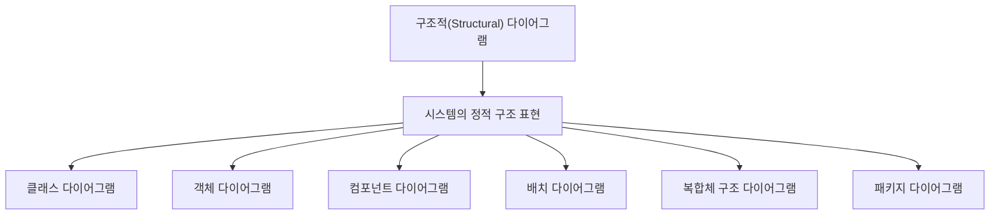

- 구조적 다이어그램은 시스템이 `무엇으로 구성되어 있는지`, 그 구성 요소들이 `어떤 관계를 맺는지`를 표현하는 UML 다이어그램이다.
- 핵심은 `정적 구조`이다.
- 시간의 흐름, 메시지 순서, 상태 변화, 업무 흐름을 주로 표현하는 행위 다이어그램과 구분한다.
- PDF 기준 구조적 다이어그램은 다음 6가지이다.
  - `클래스 다이어그램(Class Diagram)`
  - `객체 다이어그램(Object Diagram)`
  - `컴포넌트 다이어그램(Component Diagram)`
  - `배치 다이어그램(Deployment Diagram)`
  - `복합체 구조 다이어그램(Composite Structure Diagram)`
  - `패키지 다이어그램(Package Diagram)`

---

## 2. PDF 기준 핵심

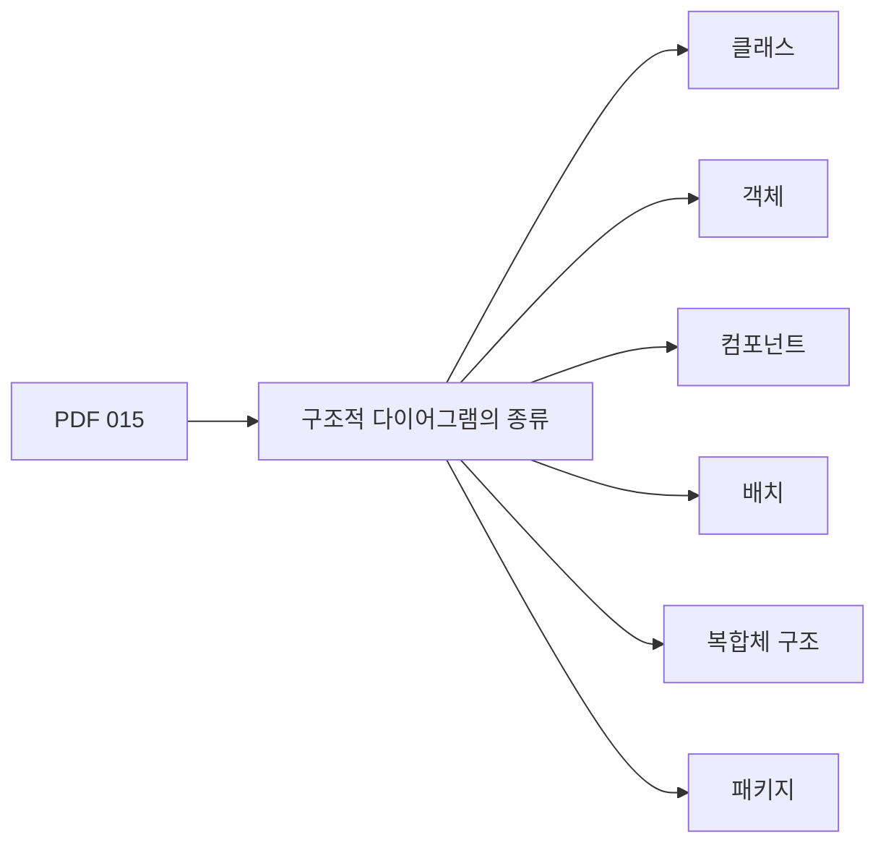

- PDF에서 직접 확인한 항목:
  - `클래스 다이어그램(Class Diagram)`
  - `객체 다이어그램(Object Diagram)`
  - `컴포넌트 다이어그램(Component Diagram)`
  - `배치 다이어그램(Deployment Diagram)`
  - `복합체 구조 다이어그램(Composite Structure Diagram)`
  - `패키지 다이어그램(Package Diagram)`

- 이 챕터의 최소 암기 골격:
  - 구조적 다이어그램은 `클래스`, `객체`, `컴포넌트`, `배치`, `복합체 구조`, `패키지`이다.
  - 시험에서는 위 6개를 행위 다이어그램과 섞어 놓고 고르게 하는 문제가 자주 나온다.
  - 구조적 다이어그램의 공통점은 `시간 흐름보다 구성 요소와 관계`를 표현한다는 점이다.

- 주의:
  - 일부 UML 2.x 자료에서는 `Profile Diagram`을 구조 다이어그램에 포함하여 설명하기도 한다.
  - 하지만 이 PDF의 015 챕터는 위 6개를 기준으로 제시한다.
  - 정보처리기사 필기 대비에서는 우선 PDF의 6개 목록을 기준으로 암기한다.

---

## 3. 구조적 다이어그램의 위치

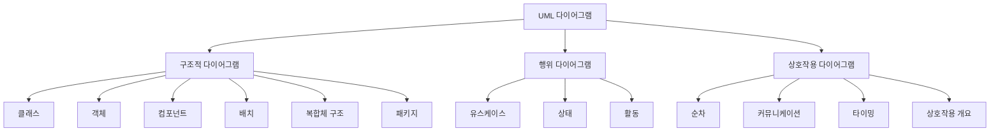

- UML은 소프트웨어 시스템을 시각화, 명세화, 문서화하기 위한 표준 모델링 언어이다.
- 구조적 다이어그램은 UML 다이어그램 중 `정적인 측면`을 나타낸다.
- 여기서 정적이라는 말은 다음을 의미한다.
  - 시스템을 이루는 요소가 무엇인지
  - 요소 간 관계가 무엇인지
  - 어떤 요소가 어떤 요소에 의존하는지
  - 어떤 요소가 어디에 배치되는지
  - 어떤 요소들이 패키지나 컴포넌트로 묶이는지

- 구조적 다이어그램이 표현하는 대표 관점:
  - `개념 구조`: 도메인 개념, 클래스, 속성, 관계
  - `인스턴스 구조`: 특정 시점의 객체와 값
  - `구현 구조`: 컴포넌트, 인터페이스, 의존성
  - `배포 구조`: 서버, 실행 환경, 배포 산출물
  - `내부 구조`: 클래스나 컴포넌트 내부의 파트, 포트, 커넥터
  - `모델 조직`: 패키지, 계층, 모듈 그룹

---

## 4. 구조적 다이어그램 전체 비교

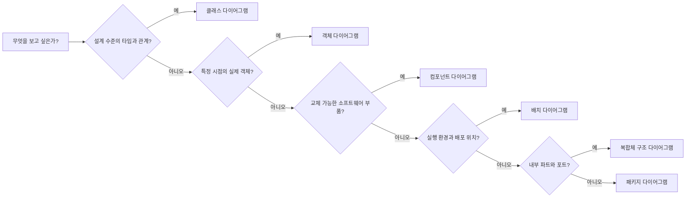

| 구분 | 핵심 대상 | 표현 관점 | 대표 키워드 | 시험 단서 |
|---|---|---|---|---|
| `클래스 다이어그램` | 클래스, 인터페이스, 속성, 연산, 관계 | 설계 구조 | 클래스, 속성, 메서드, 상속, 연관 | `정적 구조`, `클래스 간 관계` |
| `객체 다이어그램` | 객체 인스턴스, 객체 간 링크 | 특정 시점의 스냅샷 | 객체, 인스턴스, 값, 링크 | `특정 시점`, `실제 객체` |
| `컴포넌트 다이어그램` | 컴포넌트, 인터페이스, 의존성 | 구현/모듈 구조 | 컴포넌트, 제공 인터페이스, 요구 인터페이스 | `구현`, `부품`, `교체 가능` |
| `배치 다이어그램` | 노드, 장치, 실행 환경, 산출물 | 물리적 배포 구조 | 서버, 장치, 실행 환경, 아티팩트 | `배포`, `하드웨어`, `실행 환경` |
| `복합체 구조 다이어그램` | 내부 파트, 포트, 커넥터 | 내부 구성 구조 | 파트, 포트, 커넥터, 내부 구조 | `내부 구조`, `상호작용 지점` |
| `패키지 다이어그램` | 패키지, 의존 관계 | 모델 조직 구조 | 패키지, 네임스페이스, 계층 | `그룹화`, `모듈화`, `패키지 의존` |

- 빠른 판단 기준:
  - `클래스가 보이면` 클래스 다이어그램
  - `객체와 값이 보이면` 객체 다이어그램
  - `컴포넌트와 인터페이스가 보이면` 컴포넌트 다이어그램
  - `서버, 노드, 장치, 실행 환경이 보이면` 배치 다이어그램
  - `파트, 포트, 커넥터가 보이면` 복합체 구조 다이어그램
  - `패키지와 의존성이 보이면` 패키지 다이어그램

---

## 5. 클래스 다이어그램(Class Diagram)

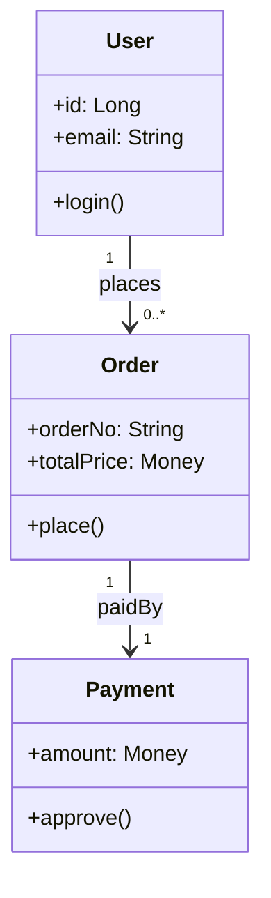

- 정의:
  - 클래스 다이어그램은 시스템을 구성하는 `클래스`, `인터페이스`, `속성`, `연산`, `관계`를 표현하는 구조적 다이어그램이다.
  - 객체지향 분석과 설계에서 가장 기본적이고 자주 쓰이는 다이어그램이다.

- 주요 구성 요소:
  - `클래스(Class)`
    - 객체를 만들기 위한 타입 또는 설계도이다.
    - 일반적으로 클래스명, 속성, 연산으로 구성한다.
  - `속성(Attribute)`
    - 클래스가 가지는 데이터나 상태이다.
    - 예: `name`, `email`, `price`
  - `연산(Operation)`
    - 클래스가 수행할 수 있는 기능이다.
    - 예: `login()`, `calculateTotal()`
  - `관계(Relationship)`
    - 클래스 사이의 연결을 표현한다.
    - 연관, 집합, 포함, 일반화, 의존, 실체화 등이 있다.

- 사용 목적:
  - 도메인 모델을 표현한다.
  - 객체지향 설계 구조를 표현한다.
  - 클래스 간 관계와 책임을 정리한다.
  - 데이터 구조와 기능 배치를 검토한다.

- 시험 포인트:
  - 클래스 다이어그램은 `정적 구조`를 표현한다.
  - `클래스 간 관계`, `속성`, `연산`이라는 단서가 나오면 클래스 다이어그램을 떠올린다.
  - 순서나 시간 흐름을 표현하는 다이어그램이 아니다.

- 헷갈리는 지점:
  - 객체 다이어그램은 클래스의 `인스턴스`를 보여준다.
  - 클래스 다이어그램은 인스턴스가 아니라 `타입 수준의 구조`를 보여준다.

---

## 6. 객체 다이어그램(Object Diagram)

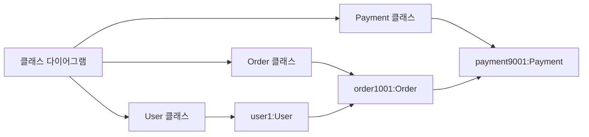

- 정의:
  - 객체 다이어그램은 특정 시점에 존재하는 `객체 인스턴스`와 객체 사이의 `링크`를 표현하는 구조적 다이어그램이다.
  - 클래스 다이어그램이 설계도라면, 객체 다이어그램은 그 설계도로 만들어진 실제 객체들의 `스냅샷`에 가깝다.

- 주요 구성 요소:
  - `객체(Object)`
    - 클래스의 인스턴스이다.
    - 예: `user1:User`, `order1001:Order`
  - `슬롯(Slot)`
    - 객체가 가진 속성 값이다.
    - 예: `email = "a@example.com"`, `status = "PAID"`
  - `링크(Link)`
    - 객체 사이의 실제 연결이다.
    - 클래스 다이어그램의 연관 관계가 인스턴스 수준에서 나타난 것이다.

- 사용 목적:
  - 특정 시점의 시스템 상태를 확인한다.
  - 복잡한 클래스 관계가 실제 객체로 어떻게 나타나는지 검증한다.
  - 예외 상황이나 테스트 시나리오의 객체 상태를 설명한다.

- 시험 포인트:
  - `특정 시점`, `객체 인스턴스`, `스냅샷`, `실제 객체`, `속성 값`이 나오면 객체 다이어그램이다.
  - 클래스 다이어그램과 비슷해 보이지만, 객체 다이어그램은 `값을 가진 인스턴스`를 표현한다.

- 예시:
  - 클래스 다이어그램:
    - `User`는 `Order`를 가진다.
  - 객체 다이어그램:
    - `user1:User`가 `order1001:Order`와 연결되어 있다.

---

## 7. 컴포넌트 다이어그램(Component Diagram)

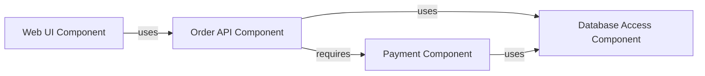

- 정의:
  - 컴포넌트 다이어그램은 소프트웨어 시스템을 구성하는 `컴포넌트`와 그 사이의 `인터페이스`, `의존 관계`를 표현하는 구조적 다이어그램이다.
  - 구현 관점에서 시스템을 교체 가능하고 재사용 가능한 부품 단위로 바라본다.

- 주요 구성 요소:
  - `컴포넌트(Component)`
    - 독립적으로 개발, 교체, 배포될 수 있는 소프트웨어 구성 단위이다.
    - 예: `주문 컴포넌트`, `결제 컴포넌트`, `인증 컴포넌트`
  - `제공 인터페이스(Provided Interface)`
    - 컴포넌트가 외부에 제공하는 기능이다.
  - `요구 인터페이스(Required Interface)`
    - 컴포넌트가 동작하기 위해 외부에서 필요로 하는 기능이다.
  - `의존 관계(Dependency)`
    - 어떤 컴포넌트가 다른 컴포넌트나 인터페이스에 의존함을 나타낸다.

- 사용 목적:
  - 시스템을 모듈 단위로 분해한다.
  - 컴포넌트 간 의존성을 파악한다.
  - 재사용 가능한 기능 단위를 설계한다.
  - 서비스 지향 구조나 컴포넌트 기반 개발 구조를 표현한다.

- 시험 포인트:
  - `컴포넌트`, `인터페이스`, `구현`, `모듈`, `부품`, `의존 관계`가 나오면 컴포넌트 다이어그램이다.
  - 물리적인 서버 배치가 아니라 소프트웨어 구현 단위의 구조를 표현한다.

- 헷갈리는 지점:
  - 컴포넌트 다이어그램은 `소프트웨어 부품 간 관계`를 본다.
  - 배치 다이어그램은 `그 부품이 어느 노드나 실행 환경에 배포되는지`를 본다.

---

## 8. 배치 다이어그램(Deployment Diagram)

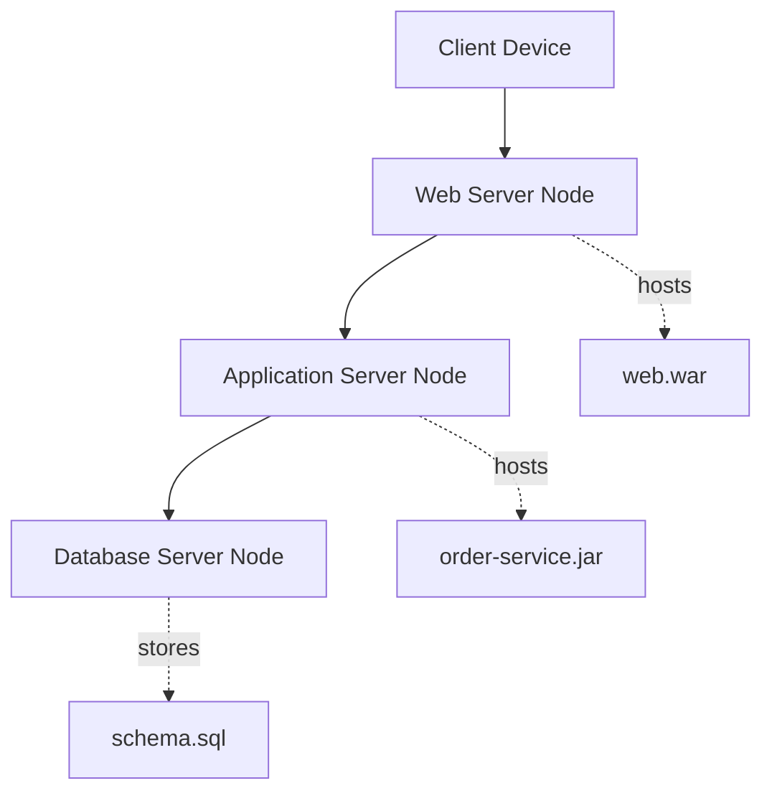

- 정의:
  - 배치 다이어그램은 소프트웨어 산출물이 어떤 `노드`, `장치`, `실행 환경`에 배치되는지를 표현하는 구조적 다이어그램이다.
  - 시스템의 물리적 또는 실행 환경 관점의 구조를 보여준다.

- 주요 구성 요소:
  - `노드(Node)`
    - 소프트웨어가 실행되는 물리적 또는 논리적 자원이다.
    - 예: 서버, 클라이언트 장치, 컨테이너 실행 환경, JVM, WAS
  - `장치 노드(Device Node)`
    - 물리적 하드웨어 자원이다.
    - 예: PC, 모바일 기기, 서버 장비
  - `실행 환경 노드(Execution Environment Node)`
    - 소프트웨어를 실행하는 환경이다.
    - 예: JVM, Node.js Runtime, Docker Container, Web Server
  - `아티팩트(Artifact)`
    - 배포 가능한 산출물이다.
    - 예: `.jar`, `.war`, `.dll`, 실행 파일, 설정 파일, 데이터베이스 스키마
  - `통신 경로(Communication Path)`
    - 노드 사이의 네트워크 연결이나 통신 관계를 표현한다.

- 사용 목적:
  - 실행 환경과 배포 구조를 설명한다.
  - 서버, 클라이언트, 데이터베이스, 네트워크 연결을 시각화한다.
  - 성능, 보안, 장애 대응, 배포 전략을 검토한다.

- 시험 포인트:
  - `노드`, `서버`, `하드웨어`, `실행 환경`, `배포`, `아티팩트`가 나오면 배치 다이어그램이다.
  - 소프트웨어 컴포넌트 자체의 관계보다 `어디에 배치되는가`가 핵심이다.

- 헷갈리는 지점:
  - 컴포넌트 다이어그램:
    - 어떤 소프트웨어 부품들이 있는가
  - 배치 다이어그램:
    - 그 소프트웨어 산출물이 어떤 서버나 실행 환경에 올라가는가

---

## 9. 복합체 구조 다이어그램(Composite Structure Diagram)

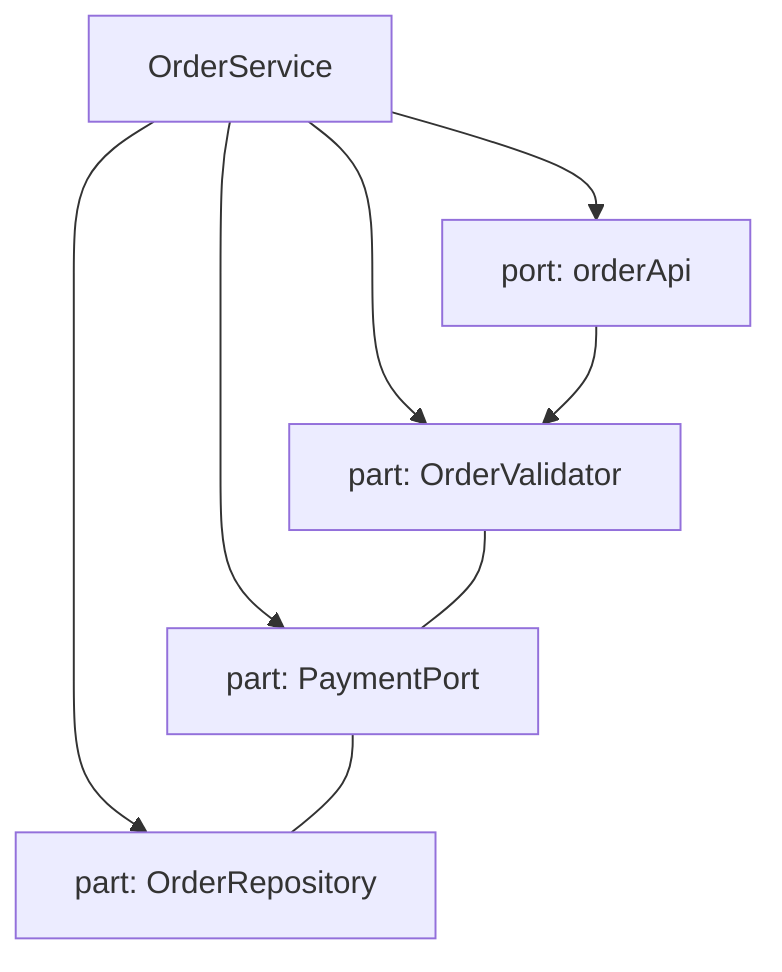

- 정의:
  - 복합체 구조 다이어그램은 클래스나 컴포넌트 같은 구조화된 분류자 내부의 `파트`, `포트`, `커넥터`를 표현하는 구조적 다이어그램이다.
  - 겉으로 보이는 클래스나 컴포넌트만 보는 것이 아니라, 내부가 어떤 부품으로 구성되고 어떻게 연결되는지를 보여준다.

- 주요 구성 요소:
  - `구조화된 분류자(Structured Classifier)`
    - 내부 구조를 가질 수 있는 클래스, 컴포넌트, 노드 등이다.
  - `파트(Part)`
    - 내부에서 특정 역할을 수행하는 구성 요소이다.
  - `포트(Port)`
    - 외부와 내부가 상호작용하는 접점이다.
  - `커넥터(Connector)`
    - 파트와 파트, 포트와 파트를 연결하는 관계이다.
  - `협력(Collaboration)`
    - 여러 요소가 함께 역할을 수행하는 구조이다.

- 사용 목적:
  - 클래스나 컴포넌트 내부 구조를 상세화한다.
  - 외부와 통신하는 접점을 명확히 한다.
  - 내부 구성 요소들의 협력 관계를 표현한다.

- 시험 포인트:
  - `내부 구조`, `파트`, `포트`, `커넥터`, `구조화된 분류자`가 나오면 복합체 구조 다이어그램이다.
  - 클래스 다이어그램보다 내부 구성과 연결을 더 자세히 보여주는 데 초점이 있다.

- 헷갈리는 지점:
  - 클래스 다이어그램은 클래스 간 관계를 중심으로 본다.
  - 복합체 구조 다이어그램은 하나의 클래스나 컴포넌트 안쪽의 구성과 연결을 본다.

---

## 10. 패키지 다이어그램(Package Diagram)

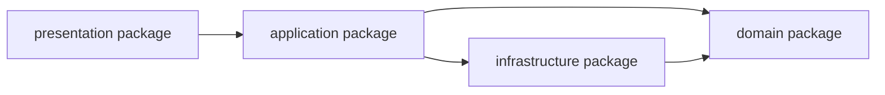

- 정의:
  - 패키지 다이어그램은 모델 요소들을 `패키지` 단위로 묶고, 패키지 사이의 `의존 관계`를 표현하는 구조적 다이어그램이다.
  - 복잡한 모델을 계층화하고 정리하기 위한 다이어그램이다.

- 주요 구성 요소:
  - `패키지(Package)`
    - 관련 있는 모델 요소를 묶는 네임스페이스이다.
    - 클래스, 인터페이스, 유스케이스, 컴포넌트 등 여러 모델 요소를 포함할 수 있다.
  - `의존 관계(Dependency)`
    - 한 패키지가 다른 패키지의 요소를 사용하는 관계이다.
  - `패키지 가져오기(Package Import)`
    - 다른 패키지의 요소를 현재 패키지에서 사용할 수 있게 하는 관계이다.
  - `패키지 병합(Package Merge)`
    - 패키지 내용을 확장하거나 결합하는 관계이다.

- 사용 목적:
  - 대규모 모델을 관리하기 쉽게 나눈다.
  - 계층형 아키텍처를 표현한다.
  - 패키지 간 의존 방향을 점검한다.
  - 순환 의존이나 잘못된 계층 의존을 찾는다.

- 시험 포인트:
  - `패키지`, `그룹화`, `네임스페이스`, `모델 요소의 묶음`, `패키지 간 의존성`이 나오면 패키지 다이어그램이다.
  - 클래스 자체의 속성과 연산을 자세히 보여주는 것이 아니라, 모델 요소를 큰 단위로 묶어 구조화한다.

- 예시:
  - `presentation` 패키지가 `application` 패키지에 의존한다.
  - `application` 패키지가 `domain` 패키지에 의존한다.
  - 이 구조를 통해 계층 간 의존 방향을 확인한다.

---

## 11. 6종 구조적 다이어그램을 한 시스템에 적용하기

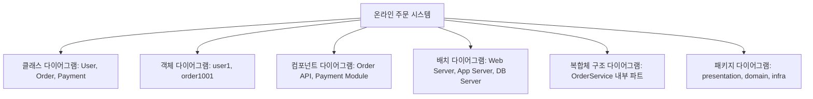

- 하나의 시스템을 여러 관점으로 모델링할 수 있다.
- 구조적 다이어그램 6종은 서로 경쟁하는 개념이 아니라, 같은 시스템을 다른 추상화 수준에서 표현하는 도구이다.

| 관점 | 질문 | 적합한 다이어그램 |
|---|---|---|
| 도메인 구조 | 어떤 클래스와 관계가 있는가? | 클래스 다이어그램 |
| 특정 상태 | 어느 시점에 어떤 객체가 존재하는가? | 객체 다이어그램 |
| 구현 단위 | 어떤 컴포넌트가 어떤 인터페이스를 사용하는가? | 컴포넌트 다이어그램 |
| 실행 환경 | 산출물이 어느 서버에 배포되는가? | 배치 다이어그램 |
| 내부 구성 | 한 컴포넌트 안이 어떤 파트로 구성되는가? | 복합체 구조 다이어그램 |
| 모델 조직 | 모델 요소를 어떤 패키지로 묶는가? | 패키지 다이어그램 |

- 실무적 이해:
  - 클래스 다이어그램은 설계자의 관점에 가깝다.
  - 객체 다이어그램은 테스트나 특정 예시 상태를 설명할 때 유용하다.
  - 컴포넌트 다이어그램은 아키텍처와 구현 모듈 경계를 설명할 때 유용하다.
  - 배치 다이어그램은 운영, 인프라, 배포 구조를 설명할 때 유용하다.
  - 복합체 구조 다이어그램은 내부 구조가 복잡한 클래스나 컴포넌트를 자세히 설명할 때 유용하다.
  - 패키지 다이어그램은 대규모 모델을 정리하고 의존 방향을 관리할 때 유용하다.

---

## 12. 구조적 다이어그램과 행위 다이어그램 비교

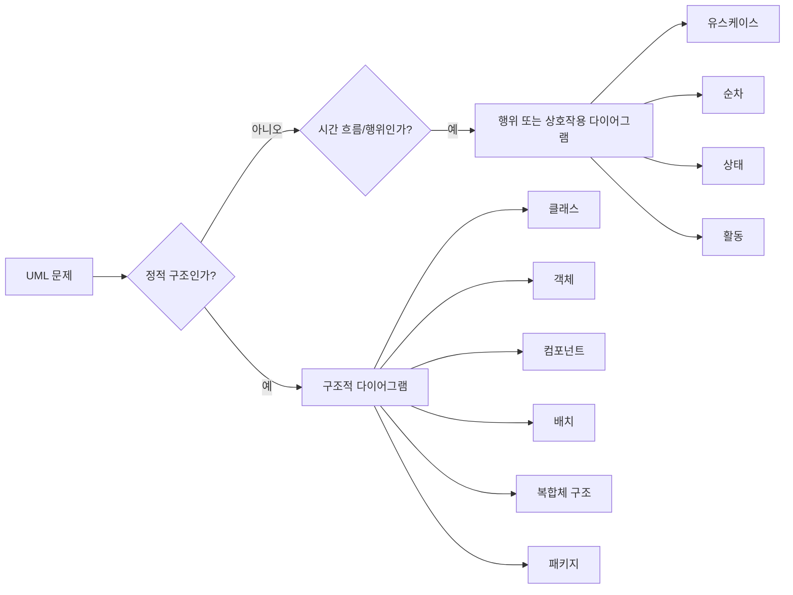

| 구분 | 구조적 다이어그램 | 행위/상호작용 다이어그램 |
|---|---|---|
| 핵심 관점 | 정적 구조 | 동적 행위 |
| 관심 대상 | 구성 요소, 관계, 배치, 그룹 | 기능, 흐름, 메시지, 상태 변화 |
| 시간 흐름 | 중심이 아님 | 중요한 단서 |
| 대표 예 | 클래스, 객체, 컴포넌트, 배치 | 유스케이스, 순차, 활동, 상태 |
| 시험 단서 | 구조, 관계, 구성, 배치 | 동작, 순서, 이벤트, 상태 변화 |

- 구조적 다이어그램 판단 질문:
  - 이 문제는 시스템이 `무엇으로 구성되는지`를 묻는가?
  - 이 문제는 요소 간 `관계`나 `배치`를 묻는가?
  - 이 문제는 클래스, 컴포넌트, 노드, 패키지 같은 구조 요소를 묻는가?

- 행위 다이어그램 판단 질문:
  - 이 문제는 기능 수행 절차를 묻는가?
  - 이 문제는 객체 간 메시지 순서를 묻는가?
  - 이 문제는 상태 변화나 업무 흐름을 묻는가?

---

## 13. 클래스 다이어그램과 객체 다이어그램 비교

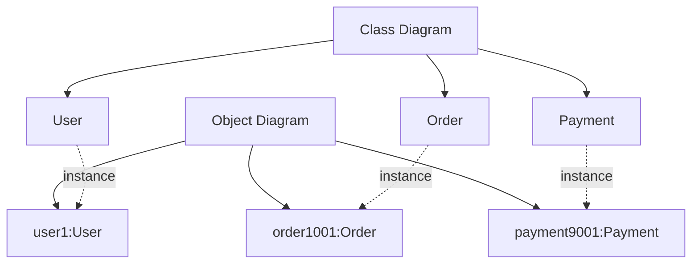

| 구분 | 클래스 다이어그램 | 객체 다이어그램 |
|---|---|---|
| 표현 수준 | 타입 수준 | 인스턴스 수준 |
| 핵심 대상 | 클래스, 속성, 연산, 관계 | 객체, 값, 링크 |
| 시간 관점 | 일반적인 설계 구조 | 특정 시점의 상태 |
| 예 | `User`, `Order` | `user1:User`, `order1001:Order` |
| 시험 단서 | 클래스 간 관계 | 객체 스냅샷 |

- 암기:
  - 클래스 다이어그램 = `설계도`
  - 객체 다이어그램 = `설계도로 만들어진 실제 객체의 한 장면`

- 출제 함정:
  - `객체`라는 단어가 나온다고 항상 객체지향 전체를 의미하는 것은 아니다.
  - 지문이 `특정 시점의 인스턴스`를 말하면 객체 다이어그램이다.
  - 지문이 `클래스 간의 정적 관계`를 말하면 클래스 다이어그램이다.

---

## 14. 컴포넌트 다이어그램과 배치 다이어그램 비교

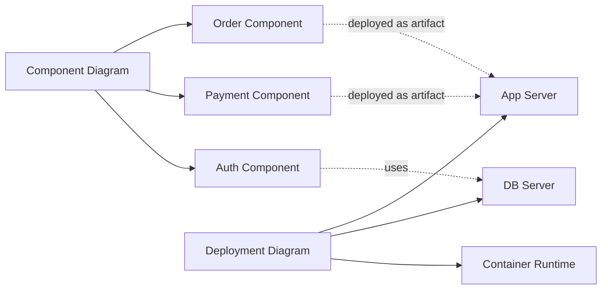

| 구분 | 컴포넌트 다이어그램 | 배치 다이어그램 |
|---|---|---|
| 관점 | 구현 모듈 구조 | 실행/배포 구조 |
| 핵심 대상 | 컴포넌트, 인터페이스, 의존성 | 노드, 장치, 실행 환경, 아티팩트 |
| 질문 | 어떤 소프트웨어 부품이 있는가? | 어디에 배포되는가? |
| 대표 단서 | 모듈, 인터페이스, 제공/요구 기능 | 서버, 하드웨어, 실행 환경, 네트워크 |
| 실무 연결 | 모듈 설계 | 인프라/운영 설계 |

- 구분 공식:
  - `소프트웨어 부품 간 관계` = 컴포넌트 다이어그램
  - `소프트웨어가 올라가는 물리/실행 환경` = 배치 다이어그램

- 출제 함정:
  - 컴포넌트가 실제로 배포될 수 있어도, 컴포넌트 다이어그램의 핵심은 배포 위치가 아니다.
  - 서버, 노드, 장치, 실행 환경이 지문의 중심이면 배치 다이어그램이다.

---

## 15. 클래스 다이어그램과 복합체 구조 다이어그램 비교

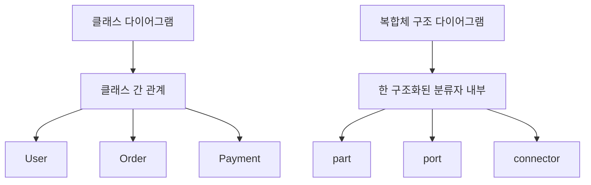

| 구분 | 클래스 다이어그램 | 복합체 구조 다이어그램 |
|---|---|---|
| 관점 | 클래스와 클래스 사이의 구조 | 클래스/컴포넌트 내부 구조 |
| 핵심 대상 | 클래스, 속성, 연산, 관계 | 파트, 포트, 커넥터 |
| 추상화 | 타입 간 관계 | 내부 구성과 상호작용 지점 |
| 시험 단서 | 클래스 간 관계 | 내부 구조, 파트, 포트 |

- 클래스 다이어그램은 바깥 구조를 넓게 본다.
- 복합체 구조 다이어그램은 하나의 구조화된 요소 내부를 깊게 본다.
- `포트`라는 단어가 나오면 복합체 구조 다이어그램일 가능성이 높다.

---

## 16. 패키지 다이어그램과 컴포넌트 다이어그램 비교

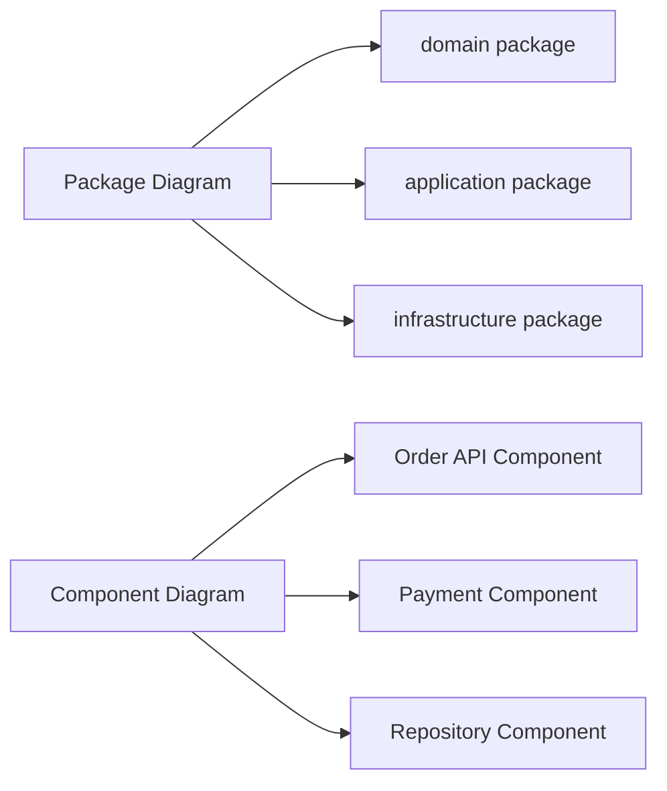

| 구분 | 패키지 다이어그램 | 컴포넌트 다이어그램 |
|---|---|---|
| 목적 | 모델 요소의 조직화 | 구현 단위의 구조화 |
| 핵심 대상 | 패키지, 패키지 의존 | 컴포넌트, 인터페이스, 컴포넌트 의존 |
| 존재 성격 | 모델 관리/네임스페이스 | 구현/실행 관점의 소프트웨어 부품 |
| 시험 단서 | 패키지, 그룹화, 네임스페이스 | 컴포넌트, 인터페이스, 모듈 |

- 패키지는 모델 요소를 묶는 조직 단위이다.
- 컴포넌트는 기능을 제공하거나 요구하는 구현 단위이다.
- 패키지 다이어그램은 큰 모델을 정리하는 데 강하고, 컴포넌트 다이어그램은 구현 모듈 구조를 보여주는 데 강하다.

---

## 17. 문제 풀이용 단서어

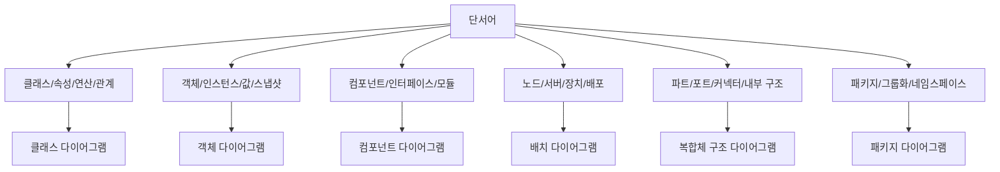

- 클래스 다이어그램 단서:
  - `클래스`
  - `속성`
  - `연산`
  - `클래스 간 관계`
  - `상속`
  - `연관`

- 객체 다이어그램 단서:
  - `객체`
  - `인스턴스`
  - `특정 시점`
  - `스냅샷`
  - `속성 값`
  - `객체 간 링크`

- 컴포넌트 다이어그램 단서:
  - `컴포넌트`
  - `인터페이스`
  - `제공 인터페이스`
  - `요구 인터페이스`
  - `모듈`
  - `구현 단위`

- 배치 다이어그램 단서:
  - `노드`
  - `장치`
  - `서버`
  - `실행 환경`
  - `아티팩트`
  - `배포`
  - `하드웨어`

- 복합체 구조 다이어그램 단서:
  - `내부 구조`
  - `파트`
  - `포트`
  - `커넥터`
  - `구조화된 분류자`
  - `협력`

- 패키지 다이어그램 단서:
  - `패키지`
  - `그룹화`
  - `네임스페이스`
  - `패키지 간 의존`
  - `모델 요소 조직화`

---

## 18. 자주 나오는 함정

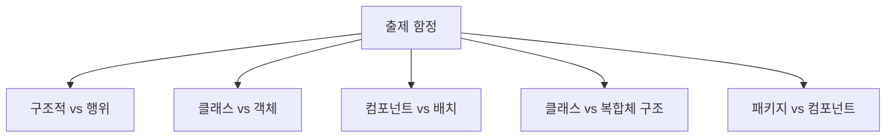

- 함정 1: 구조적 다이어그램과 행위 다이어그램을 섞는 문제
  - `순차 다이어그램`, `활동 다이어그램`, `상태 다이어그램`, `유스케이스 다이어그램`은 구조적 다이어그램이 아니다.
  - 이들은 행위 또는 상호작용 관점에 속한다.

- 함정 2: 클래스 다이어그램과 객체 다이어그램 혼동
  - 클래스 다이어그램은 `타입 수준`이다.
  - 객체 다이어그램은 `인스턴스 수준`이다.
  - `특정 시점의 객체 상태`라는 말이 있으면 객체 다이어그램이다.

- 함정 3: 컴포넌트 다이어그램과 배치 다이어그램 혼동
  - 컴포넌트 다이어그램은 `소프트웨어 부품`을 본다.
  - 배치 다이어그램은 `배포 위치와 실행 환경`을 본다.

- 함정 4: 복합체 구조 다이어그램을 클래스 다이어그램의 다른 이름으로 착각
  - 복합체 구조 다이어그램은 `내부 파트`, `포트`, `커넥터`가 핵심이다.
  - 클래스 다이어그램은 클래스 사이의 일반적인 정적 관계가 핵심이다.

- 함정 5: 패키지 다이어그램을 단순 폴더 구조로만 이해
  - 패키지 다이어그램은 단순 폴더 목록이 아니라 모델 요소의 그룹화와 의존 관계를 표현한다.
  - 특히 대규모 모델에서 계층과 의존 방향을 관리하는 데 의미가 있다.

- 함정 6: UML 버전 차이
  - 공식 UML 2.x 자료나 교육 자료에 따라 구조 다이어그램 목록에 `Profile Diagram`이 추가되어 설명될 수 있다.
  - 정보처리기사 PDF의 이 챕터에서는 6개 목록을 기준으로 학습한다.

---

## 19. 보기 판별 예시

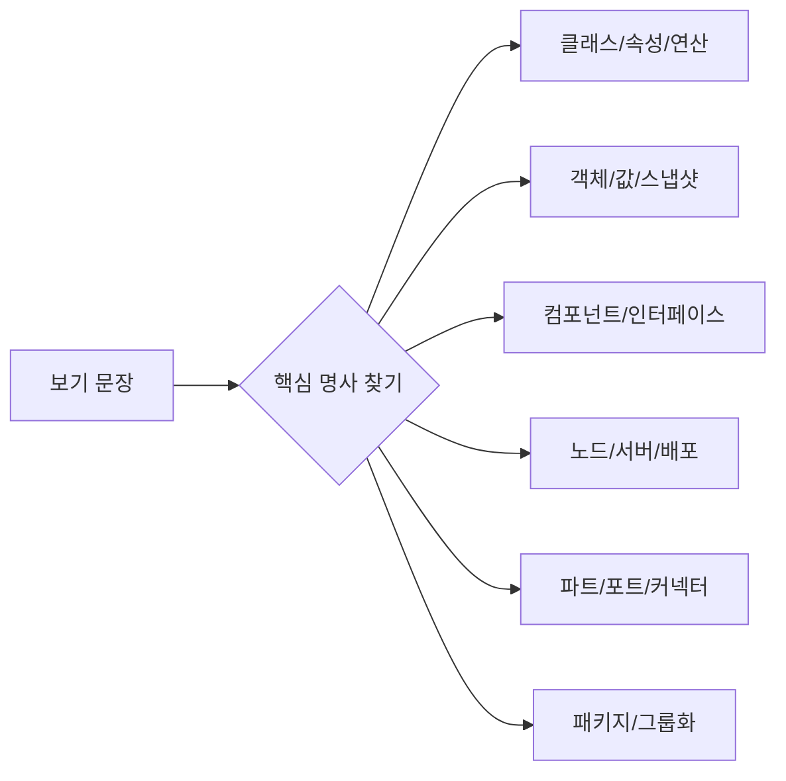

- 보기: `시스템의 클래스, 속성, 연산 및 클래스 간 관계를 표현한다.`
  - 정답: `클래스 다이어그램`
  - 이유: 클래스, 속성, 연산, 관계가 핵심 단서이다.

- 보기: `특정 시점의 객체 인스턴스와 객체 사이의 링크를 표현한다.`
  - 정답: `객체 다이어그램`
  - 이유: 특정 시점, 객체 인스턴스, 링크가 핵심 단서이다.

- 보기: `소프트웨어 컴포넌트와 제공/요구 인터페이스, 의존 관계를 표현한다.`
  - 정답: `컴포넌트 다이어그램`
  - 이유: 컴포넌트와 인터페이스가 핵심 단서이다.

- 보기: `아티팩트가 노드나 실행 환경에 어떻게 배치되는지를 표현한다.`
  - 정답: `배치 다이어그램`
  - 이유: 노드, 실행 환경, 배치, 아티팩트가 핵심 단서이다.

- 보기: `구조화된 분류자의 내부 파트, 포트, 커넥터를 표현한다.`
  - 정답: `복합체 구조 다이어그램`
  - 이유: 내부 파트, 포트, 커넥터가 핵심 단서이다.

- 보기: `모델 요소를 패키지로 그룹화하고 패키지 간 의존 관계를 표현한다.`
  - 정답: `패키지 다이어그램`
  - 이유: 패키지, 그룹화, 패키지 의존이 핵심 단서이다.

---

## 20. 암기 포인트

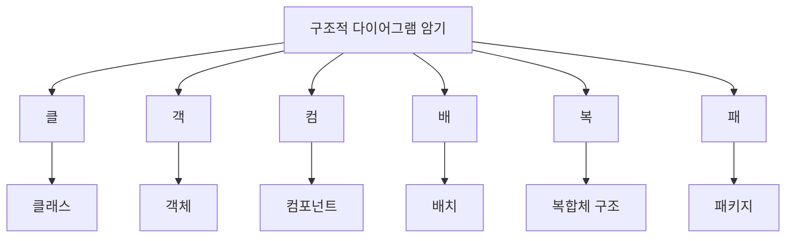

- 목록 암기:
  - `클-객-컴-배-복-패`
  - `클래스`, `객체`, `컴포넌트`, `배치`, `복합체 구조`, `패키지`

- 의미 암기:
  - `클래스`: 타입 설계 구조
  - `객체`: 특정 시점의 인스턴스 구조
  - `컴포넌트`: 구현 부품 구조
  - `배치`: 실행 환경과 배포 구조
  - `복합체 구조`: 내부 파트와 포트 구조
  - `패키지`: 모델 요소 그룹 구조

- 대조 암기:
  - `클래스 = 설계도`
  - `객체 = 설계도로 만든 실제 객체의 한 장면`
  - `컴포넌트 = 소프트웨어 부품`
  - `배치 = 부품이 올라가는 서버/환경`
  - `복합체 구조 = 내부 구성`
  - `패키지 = 묶음과 의존`

- 최종 암기 문장:
  - `구조적 다이어그램은 시스템의 정적 구조를 표현하며, 정보처리기사 PDF 기준으로 클래스·객체·컴포넌트·배치·복합체 구조·패키지 다이어그램을 묶어 외운다.`

---

## 21. 빠른 복습

```mermaid
flowchart TD
    A["빠른 복습"]
    A --> B["구조적 = 정적 구조"]
    B --> C["클래스 = 타입"]
    B --> D["객체 = 인스턴스"]
    B --> E["컴포넌트 = 구현 부품"]
    B --> F["배치 = 실행 환경"]
    B --> G["복합체 구조 = 내부 구조"]
    B --> H["패키지 = 그룹화"]
```

- 챕터명:
  - `015 구조적(Structural) 다이어그램의 종류`

- 소속 영역:
  - `UML`

- PDF 핵심 키워드:
  - `클래스 다이어그램`
  - `객체 다이어그램`
  - `컴포넌트 다이어그램`
  - `배치 다이어그램`
  - `복합체 구조 다이어그램`
  - `패키지 다이어그램`

- 가장 먼저 떠올릴 말:
  - `구조적 다이어그램은 시스템의 정적 구조, 구성 요소, 관계, 배치, 그룹화를 표현하는 UML 다이어그램이다.`

- 문제 풀이 순서:
  - 먼저 `구조`를 묻는지 `행위`를 묻는지 구분한다.
  - 구조 문제라면 단서어를 찾는다.
  - `클래스`, `객체`, `컴포넌트`, `노드`, `포트`, `패키지` 중 어떤 단서가 중심인지 판단한다.

- 자주 나오는 문제 유형:
  - 구조적 다이어그램에 속하는 것을 고르는 문제
  - 구조적 다이어그램이 아닌 것을 고르는 문제
  - 각 다이어그램의 설명과 이름을 연결하는 문제
  - 클래스/객체, 컴포넌트/배치, 클래스/복합체 구조를 구분하는 문제

---

## 22. 참고 링크

- 기준 PDF: `/Users/nes0903/Documents/study/정보처리기사/핵심요약집_2026_정보처리기사필기핵심요약.pdf`
- [Q-Net 정보처리기사 종목 페이지](https://www.q-net.or.kr/crf005.do?id=crf00503s02&jmCd=1320&jmInfoDivCcd=B0)
- [OMG - What is UML?](https://www.omg.org/uml/what-is-uml.htm)
- [OMG - Unified Modeling Language Specification](https://www.omg.org/spec/UML/)
- [UML-Diagrams - UML 2.5 Diagrams Overview](https://www.uml-diagrams.org/uml-25-diagrams.html)
- [UML-Diagrams - Class and Object Diagrams Overview](https://www.uml-diagrams.org/class-diagrams-overview.html)
- [UML-Diagrams - Component Diagrams](https://www.uml-diagrams.org/component-diagrams.html)
- [UML-Diagrams - Deployment Diagrams Overview](https://www.uml-diagrams.org/deployment-diagrams-overview.html)
- [UML-Diagrams - Composite Structure Diagrams](https://www.uml-diagrams.org/composite-structure-diagrams.html)
- [UML-Diagrams - Package Diagrams Overview](https://www.uml-diagrams.org/package-diagrams-overview.html)
- [IBM - Composite Structure Diagrams](https://www.ibm.com/docs/en/dma?topic=diagrams-composite-structure)
- [Visual Paradigm - UML Practical Guide](https://www.visual-paradigm.com/guide/uml-unified-modeling-language/uml-practical-guide/)
