# 016 행위(Behavioral) 다이어그램의 종류

작성 기준일: 2026-05-02  
과목: `1과목 소프트웨어 설계`  
기준 PDF: `/Users/nes0903/Documents/study/정보처리기사/핵심요약집_2026_정보처리기사필기핵심요약.pdf`  
PDF 확인 위치: `3페이지`  
검색 보강: OMG UML 공식 자료, UML-Diagrams, Microsoft, Visual Paradigm 자료를 함께 확인하여 시험 중심으로 확장 정리

---

## 1. 한 줄 요약

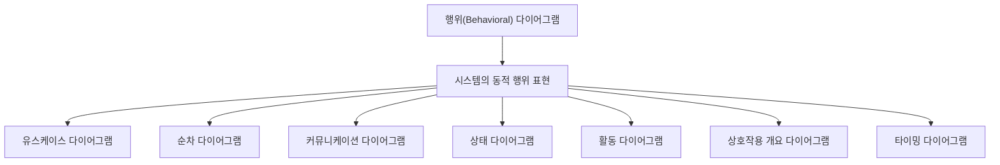

- 행위 다이어그램은 시스템이 `무엇을 하는지`, 시간이 흐르면서 객체와 기능이 `어떻게 동작하고 상호작용하는지`를 표현하는 UML 다이어그램이다.
- 핵심은 `동적 행위`이다.
- 구조적 다이어그램이 `시스템의 구성 요소와 정적 관계`를 본다면, 행위 다이어그램은 `기능 수행`, `흐름`, `메시지`, `상태 변화`, `시간 제약`을 본다.
- PDF 기준 행위 다이어그램은 다음 7가지이다.
  - `유스케이스 다이어그램(Use Case Diagram)`
  - `순차 다이어그램(Sequence Diagram)`
  - `커뮤니케이션 다이어그램(Communication Diagram)`
  - `상태 다이어그램(State Diagram)`
  - `활동 다이어그램(Activity Diagram)`
  - `상호작용 개요 다이어그램(Interaction Overview Diagram)`
  - `타이밍 다이어그램(Timing Diagram)`

---

## 2. PDF 기준 핵심

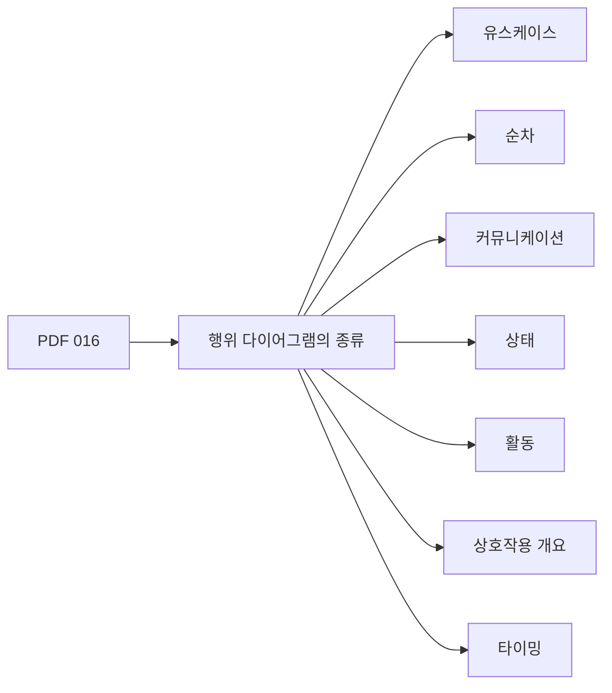

- PDF에서 직접 확인한 항목:
  - `유스케이스 다이어그램(Use Case Diagram)`
  - `순차 다이어그램(Sequence Diagram)`
  - `커뮤니케이션 다이어그램(Communication Diagram)`
  - `상태 다이어그램(State Diagram)`
  - `활동 다이어그램(Activity Diagram)`
  - `상호작용 개요 다이어그램(Interaction Overview Diagram)`
  - `타이밍 다이어그램(Timing Diagram)`

- 이 챕터의 최소 암기 골격:
  - 행위 다이어그램은 `유스케이스`, `순차`, `커뮤니케이션`, `상태`, `활동`, `상호작용 개요`, `타이밍`이다.
  - 시험에서는 위 7개를 구조적 다이어그램과 섞어 놓고 구분하게 하는 경우가 많다.
  - 특히 `순차`, `커뮤니케이션`, `상호작용 개요`, `타이밍`은 상호작용 다이어그램 계열로도 묶인다는 점을 알고 있으면 비교 문제가 쉬워진다.

- 주의:
  - UML 2.x 자료에서는 `행위 다이어그램` 아래에 `상호작용 다이어그램(Interaction Diagram)`을 두고, 그 하위에 순차·커뮤니케이션·상호작용 개요·타이밍을 설명하는 경우가 많다.
  - 일부 자료에서는 `Information Flow Diagram` 등을 함께 언급하기도 하지만, 정보처리기사 PDF 016 챕터 기준 암기 목록은 위 7개이다.

---

## 3. 행위 다이어그램의 위치

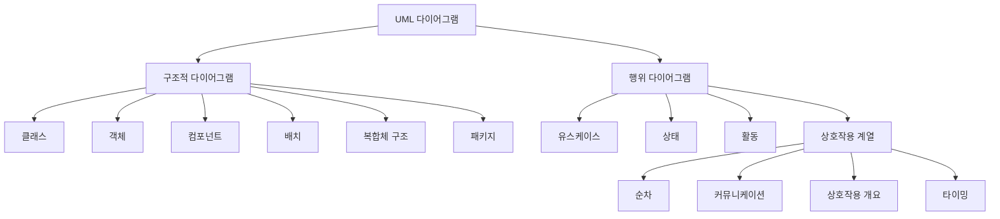

- UML은 소프트웨어 시스템을 시각화, 명세화, 문서화하기 위한 표준 모델링 언어이다.
- 행위 다이어그램은 UML 다이어그램 중 `동적인 측면`을 나타낸다.
- 여기서 동적이라는 말은 다음을 의미한다.
  - 사용자가 시스템 기능을 어떻게 사용하는지
  - 객체들이 어떤 순서로 메시지를 주고받는지
  - 객체나 시스템이 어떤 상태를 거쳐 변화하는지
  - 업무나 기능 처리가 어떤 흐름으로 진행되는지
  - 시간 조건에 따라 상태나 값이 어떻게 변하는지

- 행위 다이어그램이 표현하는 대표 관점:
  - `기능 관점`: 유스케이스 다이어그램
  - `메시지 순서 관점`: 순차 다이어그램
  - `객체 연결과 메시지 관점`: 커뮤니케이션 다이어그램
  - `상태 변화 관점`: 상태 다이어그램
  - `업무 흐름 관점`: 활동 다이어그램
  - `상호작용 흐름 요약 관점`: 상호작용 개요 다이어그램
  - `시간 제약 관점`: 타이밍 다이어그램

---

## 4. 행위 다이어그램 전체 비교

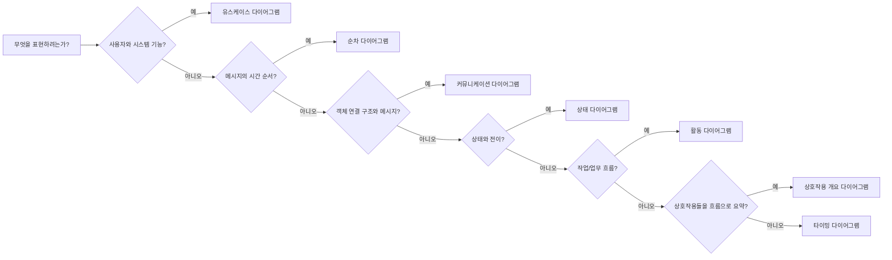

| 구분 | 핵심 대상 | 표현 관점 | 대표 키워드 | 시험 단서 |
|---|---|---|---|---|
| `유스케이스 다이어그램` | 액터, 유스케이스, 시스템 범위 | 사용자 관점 기능 | 액터, 유스케이스, 포함, 확장 | `사용자`, `시스템 기능`, `요구사항` |
| `순차 다이어그램` | 객체/생명선, 메시지 | 시간 순서 | 생명선, 메시지, 활성화, 순서 | `시간 순서`, `메시지 흐름` |
| `커뮤니케이션 다이어그램` | 객체/생명선, 링크, 번호 메시지 | 객체 연결과 메시지 | 객체 간 연결, 메시지 번호 | `객체 구조`, `메시지 번호` |
| `상태 다이어그램` | 상태, 이벤트, 전이 | 상태 변화 | 상태, 전이, 이벤트, 조건 | `상태 변화`, `생명주기` |
| `활동 다이어그램` | 활동, 액션, 제어 흐름 | 업무/처리 흐름 | 시작, 종료, 분기, 병합, 병렬 | `작업 흐름`, `제어 흐름` |
| `상호작용 개요 다이어그램` | 상호작용, 상호작용 사용 | 상호작용 흐름 요약 | 활동 다이어그램 형태, interaction use | `상호작용의 흐름`, `개요` |
| `타이밍 다이어그램` | 생명선, 시간축, 상태/조건 | 시간 제약 | 시간축, 시간 제약, 지속 시간 | `시간축`, `타이밍`, `시간 제약` |

- 빠른 판단 기준:
  - `사용자가 시스템 기능을 이용`하면 유스케이스 다이어그램
  - `메시지 순서가 중요`하면 순차 다이어그램
  - `객체 간 연결 구조와 번호가 중요`하면 커뮤니케이션 다이어그램
  - `상태와 전이`가 중요하면 상태 다이어그램
  - `업무 절차와 흐름`이 중요하면 활동 다이어그램
  - `여러 상호작용을 활동 흐름처럼 요약`하면 상호작용 개요 다이어그램
  - `시간축과 시간 제약`이 중요하면 타이밍 다이어그램

---

## 5. 유스케이스 다이어그램(Use Case Diagram)

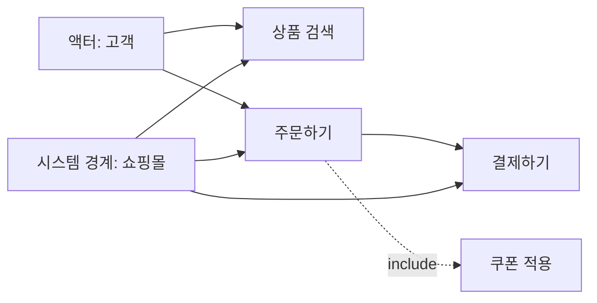

- 정의:
  - 유스케이스 다이어그램은 외부 액터가 시스템을 통해 얻고자 하는 `기능`을 사용자 관점에서 표현하는 행위 다이어그램이다.
  - 시스템이 `무엇을 제공하는가`를 표현하며, 내부 구현 방법은 중심이 아니다.

- 주요 구성 요소:
  - `액터(Actor)`
    - 시스템과 상호작용하는 외부 존재이다.
    - 사람, 외부 시스템, 장치, 조직 등이 될 수 있다.
  - `유스케이스(Use Case)`
    - 액터에게 가치 있는 결과를 제공하는 시스템 기능이다.
    - 예: 로그인, 주문하기, 결제하기, 회원 가입
  - `시스템 경계(System Boundary)`
    - 분석 대상 시스템의 범위를 나타낸다.
  - `연관(Association)`
    - 액터와 유스케이스 사이의 상호작용 관계이다.
  - `포함(Include)`
    - 공통 기능을 항상 포함하여 수행하는 관계이다.
  - `확장(Extend)`
    - 조건이 만족될 때 선택적으로 확장되는 기능 관계이다.
  - `일반화(Generalization)`
    - 액터나 유스케이스 간 일반화/특수화 관계이다.

- 사용 목적:
  - 사용자 요구사항을 기능 단위로 파악한다.
  - 시스템 범위를 명확히 한다.
  - 요구사항 분석 단계에서 사용자와 개발자 간 의사소통을 돕는다.

- 시험 포인트:
  - `액터`, `시스템 기능`, `사용자 요구사항`, `시스템 경계`가 나오면 유스케이스 다이어그램이다.
  - 내부 클래스 구조나 메시지 순서를 나타내는 다이어그램이 아니다.
  - 유스케이스는 보통 `사용자 입장에서 의미 있는 목표`로 잡는다.

- 헷갈리는 지점:
  - 유스케이스 다이어그램은 기능을 나열하지만, 상세 처리 순서를 표현하는 데 적합하지 않다.
  - 상세 처리 흐름은 활동 다이어그램이나 순차 다이어그램으로 보완할 수 있다.

---

## 6. 순차 다이어그램(Sequence Diagram)

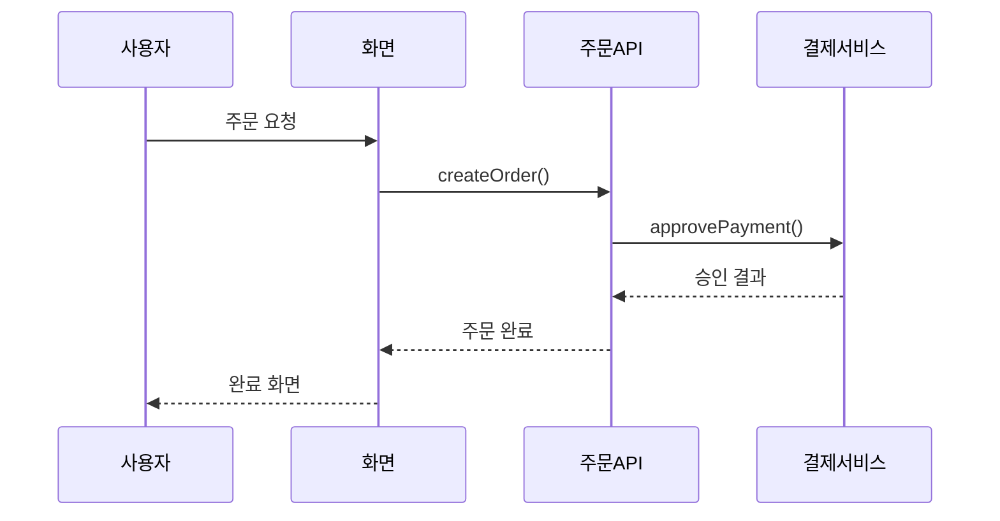

- 정의:
  - 순차 다이어그램은 객체나 컴포넌트 사이에서 주고받는 `메시지의 시간 순서`를 표현하는 상호작용 다이어그램이다.
  - 위에서 아래로 시간이 흐르며, 메시지가 어떤 순서로 전달되는지 보여준다.

- 주요 구성 요소:
  - `생명선(Lifeline)`
    - 상호작용에 참여하는 객체나 역할을 나타낸다.
  - `메시지(Message)`
    - 생명선 사이에서 전달되는 요청, 응답, 신호를 나타낸다.
  - `활성화(Activation, Execution Specification)`
    - 객체가 작업을 수행하고 있는 기간을 나타낸다.
  - `결합 단편(Combined Fragment)`
    - 조건, 반복, 병렬, 선택 흐름을 표현한다.
    - 예: `alt`, `opt`, `loop`, `par`
  - `소멸 표시(Destruction Occurrence)`
    - 객체 생명선이 종료됨을 나타낸다.

- 사용 목적:
  - 기능 수행 시 객체 간 메시지 흐름을 분석한다.
  - 시나리오 단위의 동작을 구체화한다.
  - API 호출 순서, 요청/응답 흐름, 예외 흐름을 설명한다.

- 시험 포인트:
  - `시간 순서`, `메시지 흐름`, `생명선`, `위에서 아래로`, `객체 간 상호작용`이 나오면 순차 다이어그램이다.
  - 순차 다이어그램은 객체 간 관계의 구조보다 `메시지 순서`가 핵심이다.

- 헷갈리는 지점:
  - 커뮤니케이션 다이어그램도 메시지를 표현하지만, 순차 다이어그램은 시간 순서를 더 직관적으로 보여준다.
  - 활동 다이어그램도 흐름을 표현하지만, 순차 다이어그램은 객체 사이 메시지 교환에 초점을 둔다.

---

## 7. 커뮤니케이션 다이어그램(Communication Diagram)

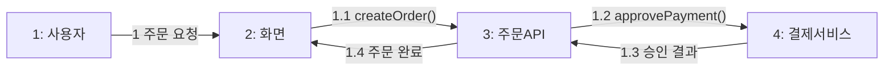

- 정의:
  - 커뮤니케이션 다이어그램은 객체나 역할 사이의 `연결 구조`와 그 연결 위에서 오가는 `메시지`를 표현하는 상호작용 다이어그램이다.
  - UML 1.x에서는 `협력 다이어그램(Collaboration Diagram)`이라고 불렸다.

- 주요 구성 요소:
  - `객체 또는 생명선(Lifeline)`
    - 상호작용에 참여하는 객체나 역할이다.
  - `링크(Link)`
    - 객체 사이의 연결 관계이다.
  - `메시지(Message)`
    - 링크 위에서 전달되는 요청이나 응답이다.
  - `순서 번호(Sequence Number)`
    - 메시지의 발생 순서를 나타낸다.
    - 예: `1`, `1.1`, `1.2`, `2`

- 사용 목적:
  - 객체 간 협력 구조를 표현한다.
  - 메시지 흐름과 객체 연결을 함께 보여준다.
  - 객체들이 어떤 구조로 연결되어 상호작용하는지 확인한다.

- 시험 포인트:
  - `객체 간 연결`, `메시지 번호`, `협력`, `Collaboration Diagram의 UML 2.x 명칭`이 나오면 커뮤니케이션 다이어그램이다.
  - 순차 다이어그램보다 시간축이 덜 강조되고, 객체 사이의 연결 구조가 더 잘 드러난다.

- 헷갈리는 지점:
  - 순차 다이어그램:
    - 생명선의 세로 시간축으로 메시지 순서를 표현한다.
  - 커뮤니케이션 다이어그램:
    - 객체 연결 구조 위에 메시지 번호를 붙여 순서를 표현한다.

---

## 8. 상태 다이어그램(State Diagram)

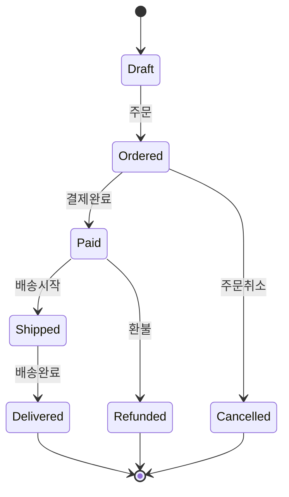

- 정의:
  - 상태 다이어그램은 객체나 시스템이 가질 수 있는 `상태`와 이벤트에 따른 `상태 전이`를 표현하는 행위 다이어그램이다.
  - 객체의 생명주기나 상태 변화가 중요한 경우에 사용한다.

- 주요 구성 요소:
  - `상태(State)`
    - 객체가 일정 시간 머무르는 조건이나 상황이다.
    - 예: 주문 전, 결제 완료, 배송 중, 배송 완료
  - `전이(Transition)`
    - 하나의 상태에서 다른 상태로 이동하는 관계이다.
  - `이벤트(Event)`
    - 전이를 발생시키는 사건이다.
    - 예: 결제 완료, 배송 시작, 취소 요청
  - `가드 조건(Guard Condition)`
    - 전이가 일어나기 위해 만족해야 하는 조건이다.
    - 예: `[재고 있음]`, `[결제 승인됨]`
  - `액션(Action)`
    - 전이와 함께 수행되는 동작이다.
  - `시작 상태/종료 상태`
    - 상태 흐름의 시작과 끝을 표현한다.

- 사용 목적:
  - 객체의 생명주기를 모델링한다.
  - 상태에 따라 가능한 이벤트와 동작을 정리한다.
  - 상태 기반 로직, 승인 흐름, 주문/회원/결제 상태를 분석한다.

- 시험 포인트:
  - `상태`, `상태 변화`, `전이`, `이벤트`, `생명주기`, `state transition`이 나오면 상태 다이어그램이다.
  - 흐름을 표현하더라도 핵심이 `작업 절차`가 아니라 `상태 변화`라면 상태 다이어그램이다.

- 헷갈리는 지점:
  - 활동 다이어그램은 작업의 흐름을 표현한다.
  - 상태 다이어그램은 객체가 어떤 상태에 있다가 어떤 이벤트로 다른 상태가 되는지를 표현한다.

---

## 9. 활동 다이어그램(Activity Diagram)

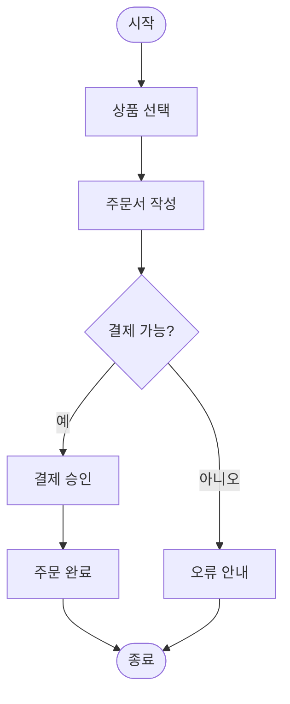

- 정의:
  - 활동 다이어그램은 업무 절차, 알고리즘, 유스케이스 내부 흐름처럼 `작업과 제어 흐름`을 표현하는 행위 다이어그램이다.
  - 흐름도와 비슷하게 시작, 처리, 분기, 병합, 병렬 처리를 표현할 수 있다.

- 주요 구성 요소:
  - `활동(Activity)`
    - 여러 액션을 포함할 수 있는 큰 동작 단위이다.
  - `액션(Action)`
    - 더 이상 나누지 않는 기본 작업 단위이다.
  - `제어 흐름(Control Flow)`
    - 작업의 실행 순서를 나타낸다.
  - `객체 흐름(Object Flow)`
    - 데이터나 객체가 작업 사이를 이동하는 흐름이다.
  - `분기/병합(Decision/Merge)`
    - 조건에 따라 흐름을 나누거나 합친다.
  - `포크/조인(Fork/Join)`
    - 병렬 흐름을 만들거나 합친다.
  - `스윔레인(Swimlane, Partition)`
    - 담당자, 부서, 시스템별 책임 구역을 나눈다.

- 사용 목적:
  - 업무 프로세스를 분석한다.
  - 유스케이스 내부 흐름을 상세화한다.
  - 조건 분기와 병렬 처리를 표현한다.
  - 알고리즘이나 절차적 흐름을 시각화한다.

- 시험 포인트:
  - `업무 흐름`, `처리 절차`, `제어 흐름`, `분기`, `병렬`, `스윔레인`이 나오면 활동 다이어그램이다.
  - 객체의 상태 변화보다 작업의 진행 순서가 핵심이다.

- 헷갈리는 지점:
  - 순차 다이어그램은 객체 간 메시지 순서가 핵심이다.
  - 활동 다이어그램은 작업 자체의 흐름과 조건 분기가 핵심이다.

---

## 10. 상호작용 개요 다이어그램(Interaction Overview Diagram)

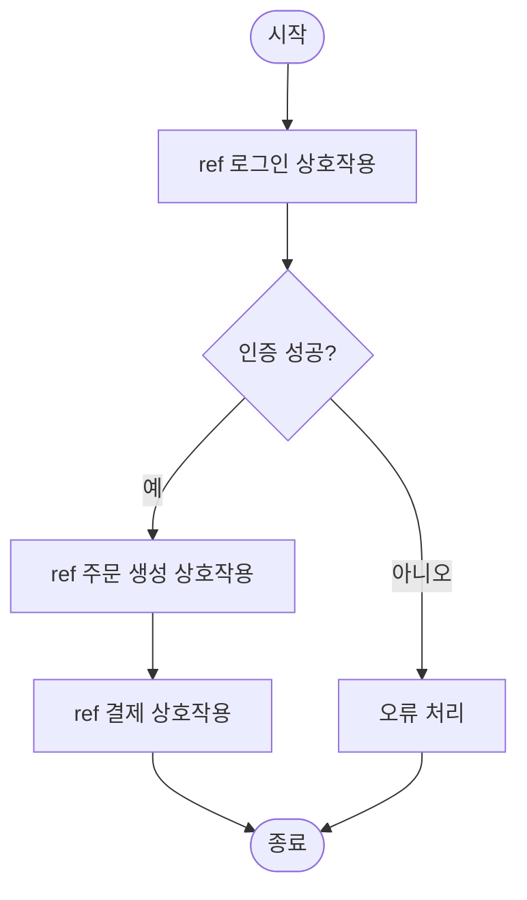

- 정의:
  - 상호작용 개요 다이어그램은 여러 상호작용을 활동 다이어그램과 비슷한 흐름으로 요약하여 표현하는 다이어그램이다.
  - 즉, `상호작용 다이어그램들을 큰 흐름으로 묶어 보는 개요도`에 가깝다.

- 주요 구성 요소:
  - `상호작용(Interaction)`
    - 메시지 교환으로 표현되는 동작 단위이다.
  - `상호작용 사용(Interaction Use)`
    - 이미 정의된 상호작용을 참조하는 요소이다.
  - `제어 노드(Control Node)`
    - 시작, 종료, 분기, 병합, 포크, 조인 등을 표현한다.
  - `활동 다이어그램 형태의 흐름`
    - 전체 제어 흐름은 활동 다이어그램과 비슷하게 표현된다.

- 사용 목적:
  - 복잡한 상호작용을 큰 흐름으로 정리한다.
  - 여러 순차 다이어그램을 하나의 시나리오 흐름으로 묶는다.
  - 상세 메시지를 모두 표시하기보다 상호작용 단위의 흐름을 보여준다.

- 시험 포인트:
  - `상호작용의 흐름`, `상호작용 사용`, `활동 다이어그램과 유사한 형태`, `개요`가 나오면 상호작용 개요 다이어그램이다.
  - 생명선과 메시지를 상세히 나열하는 순차 다이어그램과 구분한다.

- 헷갈리는 지점:
  - 활동 다이어그램:
    - 액션과 작업 흐름을 표현한다.
  - 상호작용 개요 다이어그램:
    - 액션 대신 상호작용이나 상호작용 사용을 흐름 노드로 다룬다.

---

## 11. 타이밍 다이어그램(Timing Diagram)

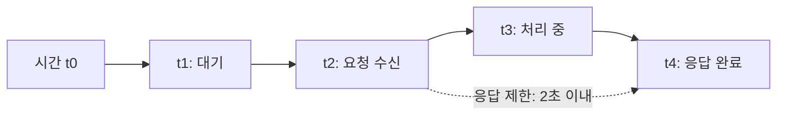

- 정의:
  - 타이밍 다이어그램은 생명선의 상태나 조건이 `시간축`을 따라 어떻게 변하는지 표현하는 상호작용 다이어그램이다.
  - 시간 제약, 지속 시간, 상태 변화 시점이 중요할 때 사용한다.

- 주요 구성 요소:
  - `생명선(Lifeline)`
    - 시간에 따라 상태나 조건이 변하는 대상이다.
  - `시간축(Time Axis)`
    - 시간의 흐름을 표현한다.
  - `상태 또는 조건(State/Condition)`
    - 특정 시간 구간 동안 유지되는 값이나 상태이다.
  - `이벤트(Event)`
    - 상태 변화나 메시지 발생 시점이다.
  - `시간 제약(Time Constraint)`
    - 특정 시점 조건이다.
  - `지속 시간 제약(Duration Constraint)`
    - 상태나 동작이 유지되어야 하는 시간 범위이다.

- 사용 목적:
  - 실시간 시스템의 시간 제약을 모델링한다.
  - 상태 변화가 언제 발생하는지 분석한다.
  - 응답 시간, 지연 시간, 타임아웃, 주기적 동작을 표현한다.

- 시험 포인트:
  - `시간축`, `시간 제약`, `지속 시간`, `조건 변화`, `실시간`이 나오면 타이밍 다이어그램이다.
  - 단순한 상태 변화가 아니라 시간 조건이 핵심이라는 점이 상태 다이어그램과의 차이이다.

- 헷갈리는 지점:
  - 상태 다이어그램은 상태와 전이 구조를 본다.
  - 타이밍 다이어그램은 상태 변화가 시간축 위에서 언제 일어나는지를 본다.

---

## 12. 행위 다이어그램과 구조적 다이어그램 비교

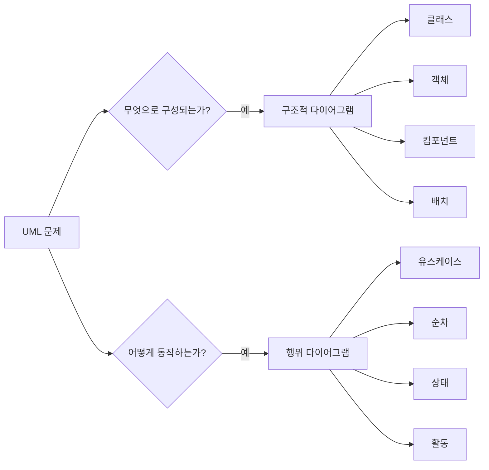

| 구분 | 구조적 다이어그램 | 행위 다이어그램 |
|---|---|---|
| 핵심 관점 | 정적 구조 | 동적 행위 |
| 주요 질문 | 무엇으로 구성되는가? | 어떻게 동작하는가? |
| 관심 대상 | 클래스, 객체, 컴포넌트, 배치, 패키지 | 기능, 메시지, 상태 변화, 활동 흐름 |
| 시간 흐름 | 중심이 아님 | 중요한 단서가 될 수 있음 |
| 대표 예 | 클래스, 객체, 컴포넌트, 배치 | 유스케이스, 순차, 상태, 활동 |

- 구조적 다이어그램 판단 질문:
  - 시스템의 구성 요소나 정적 관계를 묻는가?
  - 클래스, 컴포넌트, 노드, 패키지 같은 구조 요소가 중심인가?

- 행위 다이어그램 판단 질문:
  - 기능 수행이나 사용자 상호작용을 묻는가?
  - 메시지 순서, 상태 변화, 작업 흐름, 시간 제약이 중심인가?

- 시험 함정:
  - `객체`라는 단어가 나오더라도 메시지 순서가 핵심이면 순차 다이어그램일 수 있다.
  - `상태`라는 단어가 나오면 행위 다이어그램이지만, 단순한 데이터 속성 상태인지 상태 전이인지 문맥을 봐야 한다.

---

## 13. 상호작용 다이어그램 계열 정리

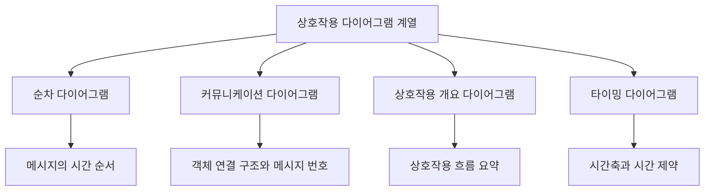

- 상호작용 다이어그램은 객체나 역할 사이에서 발생하는 `정보 교환`, 즉 메시지 중심의 동작을 표현한다.
- PDF의 행위 다이어그램 7종 중 다음 4개는 상호작용 다이어그램 계열로 이해하면 좋다.
  - `순차 다이어그램`
  - `커뮤니케이션 다이어그램`
  - `상호작용 개요 다이어그램`
  - `타이밍 다이어그램`

| 구분 | 핵심 초점 | 시간 표현 |
|---|---|---|
| `순차 다이어그램` | 메시지 교환 순서 | 위에서 아래로 직관적 |
| `커뮤니케이션 다이어그램` | 객체 연결 구조와 메시지 번호 | 번호로 표현 |
| `상호작용 개요 다이어그램` | 여러 상호작용의 제어 흐름 | 활동 흐름처럼 표현 |
| `타이밍 다이어그램` | 상태/조건 변화와 시간 제약 | 명시적 시간축 |

- 암기:
  - 상호작용 계열 = `순-커-상개-타`
  - `순차`는 시간 순서
  - `커뮤니케이션`은 연결 구조
  - `상호작용 개요`는 상호작용 흐름 요약
  - `타이밍`은 시간축

---

## 14. 순차 다이어그램과 커뮤니케이션 다이어그램 비교

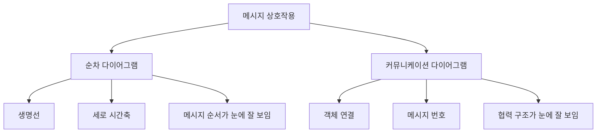

| 구분 | 순차 다이어그램 | 커뮤니케이션 다이어그램 |
|---|---|---|
| 핵심 | 시간 순서 | 객체 연결 구조 |
| 메시지 순서 | 세로 시간축으로 표현 | 번호로 표현 |
| 객체 관계 | 상대적으로 덜 강조 | 상대적으로 더 강조 |
| 구성 요소 | 생명선, 활성화, 메시지 | 객체/생명선, 링크, 메시지 번호 |
| 시험 단서 | 시간 순서, 생명선 | 협력, 연결 구조, 번호 메시지 |

- 둘 다 상호작용 다이어그램이다.
- 둘 다 객체 사이의 메시지를 표현한다.
- 차이는 `무엇을 더 강조하느냐`이다.
  - 순차 다이어그램: 메시지가 언제, 어떤 순서로 가는가
  - 커뮤니케이션 다이어그램: 어떤 객체들이 연결되어 메시지를 주고받는가

- 출제 함정:
  - 커뮤니케이션 다이어그램도 메시지 순서를 표현할 수 있다.
  - 하지만 커뮤니케이션 다이어그램은 시간축이 아니라 `메시지 번호`로 순서를 표시한다.

---

## 15. 상태 다이어그램과 활동 다이어그램 비교

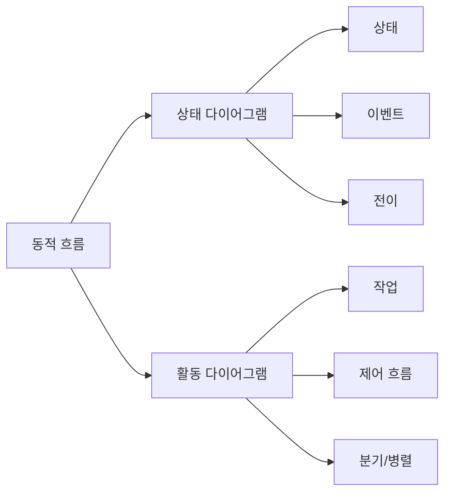

| 구분 | 상태 다이어그램 | 활동 다이어그램 |
|---|---|---|
| 핵심 | 상태 변화 | 작업 흐름 |
| 중심 명사 | 상태, 전이, 이벤트 | 활동, 액션, 제어 흐름 |
| 사용 대상 | 객체 생명주기, 상태 기반 로직 | 업무 프로세스, 알고리즘, 절차 |
| 시작/종료 | 상태 생명주기의 시작/끝 | 처리 흐름의 시작/끝 |
| 시험 단서 | 상태, 이벤트, 전이 | 활동, 분기, 병렬, 스윔레인 |

- 상태 다이어그램:
  - `주문 전 -> 결제 완료 -> 배송 중 -> 배송 완료`
  - 상태와 이벤트가 중심이다.

- 활동 다이어그램:
  - `상품 선택 -> 주문서 작성 -> 결제 -> 주문 완료`
  - 작업 순서와 분기가 중심이다.

- 구분 공식:
  - `무엇을 하는 절차인가?` = 활동 다이어그램
  - `어떤 상태에서 어떤 상태로 바뀌는가?` = 상태 다이어그램

---

## 16. 유스케이스와 활동/순차 다이어그램의 관계

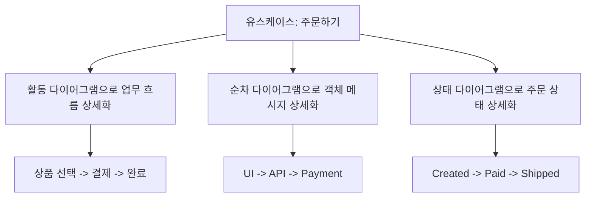

- 유스케이스 다이어그램은 사용자 관점에서 `시스템이 제공하는 기능`을 표현한다.
- 하나의 유스케이스는 더 상세한 다이어그램으로 분해할 수 있다.
  - 활동 다이어그램:
    - 유스케이스 내부의 업무 절차를 표현한다.
  - 순차 다이어그램:
    - 유스케이스를 수행할 때 객체나 컴포넌트가 주고받는 메시지를 표현한다.
  - 상태 다이어그램:
    - 유스케이스 수행으로 인해 특정 객체의 상태가 어떻게 변하는지 표현한다.

- 예:
  - 유스케이스: `주문하기`
  - 활동 흐름: `장바구니 확인 -> 배송지 입력 -> 결제 -> 주문 완료`
  - 순차 흐름: `화면 -> 주문 API -> 결제 서비스 -> 주문 저장소`
  - 상태 변화: `주문 생성 -> 결제 완료 -> 배송 준비 -> 배송 완료`

- 시험 포인트:
  - 유스케이스는 요구사항 분석과 관련이 깊다.
  - 하지만 유스케이스 다이어그램만으로 내부 처리 순서나 객체 메시지를 모두 표현하지는 않는다.

---

## 17. 문제 풀이용 단서어

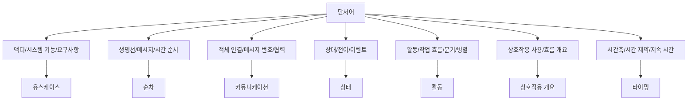

- 유스케이스 다이어그램 단서:
  - `액터`
  - `유스케이스`
  - `사용자`
  - `외부 시스템`
  - `시스템 기능`
  - `요구사항`
  - `포함`, `확장`

- 순차 다이어그램 단서:
  - `생명선`
  - `메시지`
  - `시간 순서`
  - `위에서 아래`
  - `활성화`
  - `객체 간 메시지 교환`

- 커뮤니케이션 다이어그램 단서:
  - `객체 간 연결`
  - `메시지 번호`
  - `협력`
  - `Collaboration Diagram`
  - `객체 구조 중심`

- 상태 다이어그램 단서:
  - `상태`
  - `전이`
  - `이벤트`
  - `가드 조건`
  - `생명주기`
  - `상태 변화`

- 활동 다이어그램 단서:
  - `활동`
  - `액션`
  - `작업 흐름`
  - `제어 흐름`
  - `분기`
  - `병렬`
  - `스윔레인`

- 상호작용 개요 다이어그램 단서:
  - `상호작용 개요`
  - `상호작용 사용`
  - `상호작용의 제어 흐름`
  - `활동 다이어그램과 유사`

- 타이밍 다이어그램 단서:
  - `시간축`
  - `시간 제약`
  - `지속 시간`
  - `타이밍`
  - `실시간`
  - `상태/조건의 시간 변화`

---

## 18. 보기 판별 예시

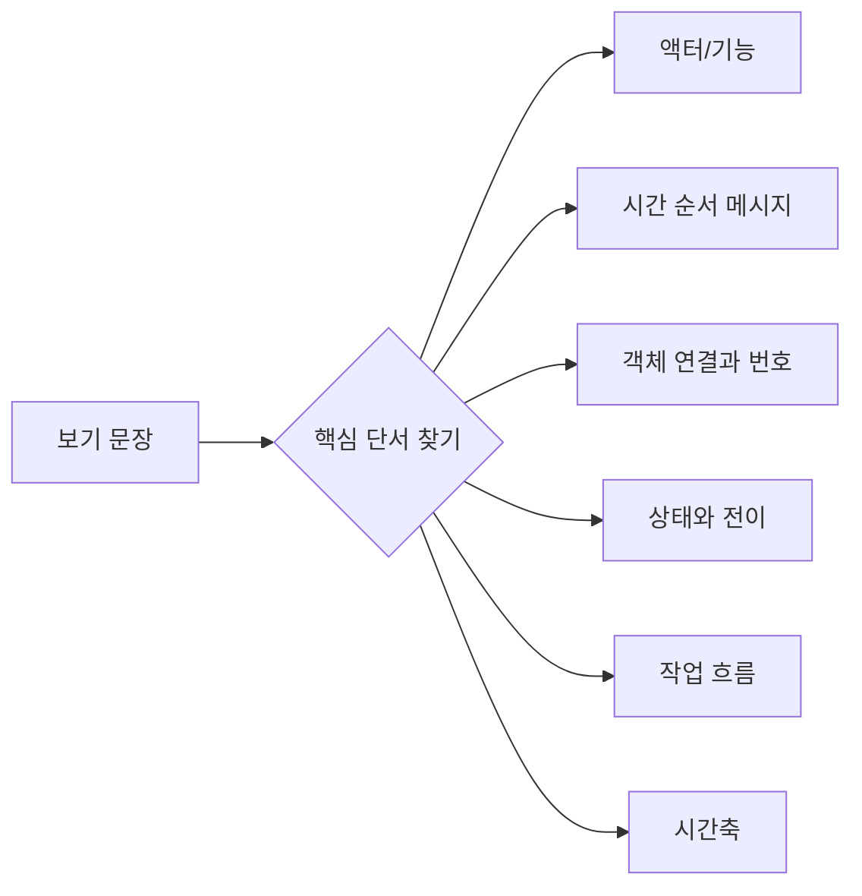

- 보기: `시스템과 상호작용하는 외부 액터와 시스템이 제공하는 기능을 표현한다.`
  - 정답: `유스케이스 다이어그램`
  - 이유: 액터와 시스템 기능이 핵심 단서이다.

- 보기: `객체 간 메시지 교환을 시간 순서에 따라 표현한다.`
  - 정답: `순차 다이어그램`
  - 이유: 메시지 교환과 시간 순서가 핵심 단서이다.

- 보기: `객체 사이의 연결 구조와 메시지 번호를 통해 상호작용을 표현한다.`
  - 정답: `커뮤니케이션 다이어그램`
  - 이유: 객체 연결 구조와 메시지 번호가 핵심 단서이다.

- 보기: `객체가 가질 수 있는 상태와 이벤트에 따른 상태 전이를 표현한다.`
  - 정답: `상태 다이어그램`
  - 이유: 상태, 이벤트, 전이가 핵심 단서이다.

- 보기: `업무 처리 과정의 제어 흐름, 분기, 병렬 처리를 표현한다.`
  - 정답: `활동 다이어그램`
  - 이유: 업무 처리 과정과 제어 흐름이 핵심 단서이다.

- 보기: `여러 상호작용을 활동 다이어그램 형태의 흐름으로 요약한다.`
  - 정답: `상호작용 개요 다이어그램`
  - 이유: 상호작용의 흐름 개요가 핵심 단서이다.

- 보기: `생명선의 상태나 조건이 시간축을 따라 어떻게 변하는지 표현한다.`
  - 정답: `타이밍 다이어그램`
  - 이유: 시간축과 상태/조건 변화가 핵심 단서이다.

---

## 19. 자주 나오는 함정

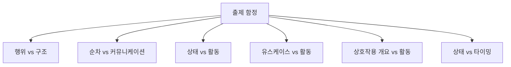

- 함정 1: 행위 다이어그램과 구조적 다이어그램을 섞는 문제
  - `클래스`, `객체`, `컴포넌트`, `배치`, `패키지`는 구조적 다이어그램이다.
  - `유스케이스`, `순차`, `상태`, `활동`은 행위 다이어그램이다.

- 함정 2: 순차 다이어그램과 커뮤니케이션 다이어그램 혼동
  - 순차 다이어그램은 메시지의 `시간 순서`를 생명선과 함께 표현한다.
  - 커뮤니케이션 다이어그램은 객체 간 `연결 구조`와 `번호가 붙은 메시지`를 강조한다.

- 함정 3: 상태 다이어그램과 활동 다이어그램 혼동
  - 상태 다이어그램은 상태와 전이 중심이다.
  - 활동 다이어그램은 작업 흐름과 제어 흐름 중심이다.

- 함정 4: 유스케이스 다이어그램을 처리 순서도로 착각
  - 유스케이스 다이어그램은 기능 목록과 액터 관계를 보여준다.
  - 세부 처리 순서는 활동 다이어그램이나 순차 다이어그램으로 표현하는 것이 적합하다.

- 함정 5: 상호작용 개요 다이어그램과 활동 다이어그램 혼동
  - 상호작용 개요 다이어그램은 활동 다이어그램처럼 보일 수 있다.
  - 하지만 노드의 중심이 일반 액션이 아니라 `상호작용` 또는 `상호작용 사용`이다.

- 함정 6: 상태 다이어그램과 타이밍 다이어그램 혼동
  - 상태 다이어그램은 상태 간 전이 구조가 핵심이다.
  - 타이밍 다이어그램은 시간축과 시간 제약이 핵심이다.

- 함정 7: UML 버전과 자료별 분류 차이
  - 유스케이스 다이어그램은 UML 버전이나 설명 자료에 따라 구조적 성격이 언급되기도 한다.
  - 정보처리기사 PDF 016에서는 행위 다이어그램 목록에 포함되어 있으므로 시험 대비에서는 행위 다이어그램으로 암기한다.

---

## 20. 암기 포인트

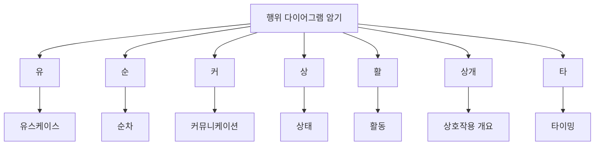

- 목록 암기:
  - `유-순-커-상-활-상개-타`
  - `유스케이스`, `순차`, `커뮤니케이션`, `상태`, `활동`, `상호작용 개요`, `타이밍`

- 의미 암기:
  - `유스케이스`: 사용자 관점의 시스템 기능
  - `순차`: 메시지의 시간 순서
  - `커뮤니케이션`: 객체 연결 구조와 번호 메시지
  - `상태`: 상태와 전이
  - `활동`: 작업과 제어 흐름
  - `상호작용 개요`: 상호작용 흐름의 요약
  - `타이밍`: 시간축과 시간 제약

- 대조 암기:
  - `구조적 = 무엇으로 구성되는가`
  - `행위 = 어떻게 동작하는가`
  - `순차 = 순서`
  - `커뮤니케이션 = 연결`
  - `상태 = 상태 변화`
  - `활동 = 작업 흐름`
  - `타이밍 = 시간축`

- 최종 암기 문장:
  - `행위 다이어그램은 시스템의 동적 행위를 표현하며, 정보처리기사 PDF 기준으로 유스케이스·순차·커뮤니케이션·상태·활동·상호작용 개요·타이밍 다이어그램을 묶어 외운다.`

---

## 21. 빠른 복습

```mermaid
flowchart TD
    A["빠른 복습"]
    A --> B["행위 = 동적 행위"]
    B --> C["유스케이스 = 사용자 기능"]
    B --> D["순차 = 메시지 순서"]
    B --> E["커뮤니케이션 = 객체 연결"]
    B --> F["상태 = 상태 전이"]
    B --> G["활동 = 업무 흐름"]
    B --> H["상호작용 개요 = 상호작용 흐름 요약"]
    B --> I["타이밍 = 시간 제약"]
```

- 챕터명:
  - `016 행위(Behavioral) 다이어그램의 종류`

- 소속 영역:
  - `UML`

- PDF 핵심 키워드:
  - `유스케이스 다이어그램`
  - `순차 다이어그램`
  - `커뮤니케이션 다이어그램`
  - `상태 다이어그램`
  - `활동 다이어그램`
  - `상호작용 개요 다이어그램`
  - `타이밍 다이어그램`

- 가장 먼저 떠올릴 말:
  - `행위 다이어그램은 시스템의 기능 수행, 메시지 흐름, 상태 변화, 작업 흐름, 시간 제약 같은 동적 행위를 표현하는 UML 다이어그램이다.`

- 문제 풀이 순서:
  - 먼저 `구조`를 묻는지 `행위`를 묻는지 구분한다.
  - 행위 문제라면 지문에서 단서어를 찾는다.
  - `액터`, `메시지 순서`, `객체 연결`, `상태 전이`, `작업 흐름`, `상호작용 개요`, `시간축` 중 무엇이 중심인지 판단한다.

- 자주 나오는 문제 유형:
  - 행위 다이어그램에 속하는 것을 고르는 문제
  - 행위 다이어그램이 아닌 것을 고르는 문제
  - 각 다이어그램의 설명과 이름을 연결하는 문제
  - 순차/커뮤니케이션, 상태/활동, 상태/타이밍을 구분하는 문제

---

## 22. 참고 링크

- 기준 PDF: `/Users/nes0903/Documents/study/정보처리기사/핵심요약집_2026_정보처리기사필기핵심요약.pdf`
- [Q-Net 정보처리기사 종목 페이지](https://www.q-net.or.kr/crf005.do?id=crf00503s02&jmCd=1320&jmInfoDivCcd=B0)
- [OMG - What is UML?](https://www.omg.org/uml/what-is-uml.htm)
- [OMG - Unified Modeling Language Specification](https://www.omg.org/spec/UML/)
- [UML-Diagrams - UML 2.5 Diagrams Overview](https://www.uml-diagrams.org/uml-25-diagrams.html)
- [UML-Diagrams - Use Case Diagrams](https://www.uml-diagrams.org/use-case-diagrams.html/)
- [UML-Diagrams - Sequence Diagrams](https://www.uml-diagrams.org/sequence-diagrams.html/sequence-diagrams.html)
- [UML-Diagrams - Communication Diagrams](https://www.uml-diagrams.org/communication-diagrams.html/1000)
- [UML-Diagrams - State Machine Diagrams](https://www.uml-diagrams.org/state-machine-diagrams.html)
- [UML-Diagrams - Activity Diagrams](https://www.uml-diagrams.org/activity-diagrams.html)
- [UML-Diagrams - Interaction Overview Diagrams](https://www.uml-diagrams.org/interaction-overview-diagrams.html)
- [UML-Diagrams - Timing Diagrams](https://www.uml-diagrams.org/timing-diagrams.html)
- [Microsoft - Guide to UML Diagramming and Database Modeling](https://www.microsoft.com/en-us/microsoft-365/business-insights-ideas/resources/guide-to-uml-diagramming-and-database-modeling)
- [Visual Paradigm - UML Practical Guide](https://www.visual-paradigm.com/guide/uml-unified-modeling-language/uml-practica)
