# 017 스테레오 타입

작성 기준일: 2026-05-03  
과목: `1과목 소프트웨어 설계`  
기준 PDF: `/Users/nes0903/Documents/study/정보처리기사/핵심요약집_2026_정보처리기사필기핵심요약.pdf`  
PDF 확인 위치: `3페이지`  
검색 보강: OMG UML 공식 자료, UML-Diagrams, Visual Paradigm 자료를 함께 확인하여 시험 중심으로 확장 정리

---

## 1. 한 줄 요약

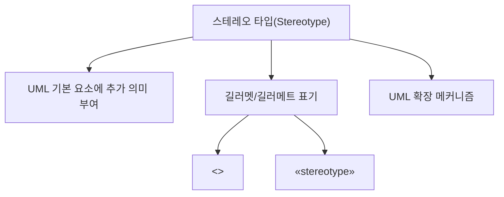

- 스테레오 타입은 UML의 기본 모델 요소에 `추가적인 의미`, `역할`, `분류`, `도메인 특성`을 부여하기 위한 UML 확장 표현이다.
- PDF 핵심은 다음 2가지이다.
  - UML에서 기본 기능 외에 추가적인 기능을 표현하기 위해 사용한다.
  - 길러멧이라고 부르는 겹화살괄호 `<< >>` 사이에 표현할 형태를 기술한다.
- 시험에서는 `스테레오 타입 = << >> 표기 = UML 요소에 추가 의미 부여`로 빠르게 연결해야 한다.
- 엄밀한 UML 표준 표기는 `« »` 형태의 guillemets이지만, 시험과 일반 교재에서는 ASCII 대체 표기인 `<< >>`가 자주 쓰인다.

---

## 2. PDF 기준 핵심

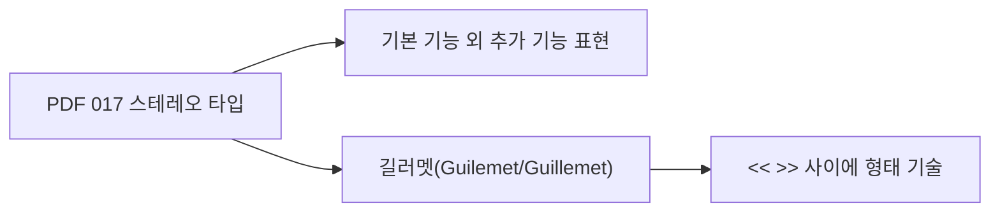

- PDF에서 직접 확인한 내용:
  - `UML에서 표현하는 기본 기능 외에 추가적인 기능을 표현하기 위해 사용한다.`
  - `길러멧(Guilemet)이라고 부르는 겹화살괄호(<< >>) 사이에 표현할 형태를 기술한다.`

- 이 챕터의 최소 암기 골격:
  - 스테레오 타입은 UML의 `확장 표현`이다.
  - 표기법은 `<<이름>>`이다.
  - 역할은 UML 기본 요소에 `추가 의미`를 붙이는 것이다.

- 용어 주의:
  - PDF에는 `Guilemet`으로 표기되어 있지만, 일반 영어 표기는 보통 `Guillemet` 또는 복수형 `Guillemets`이다.
  - 정보처리기사 시험 대비에서는 한글 표현인 `길러멧`과 `겹화살괄호(<< >>)`를 우선 기억하면 된다.

---

## 3. 스테레오 타입의 위치

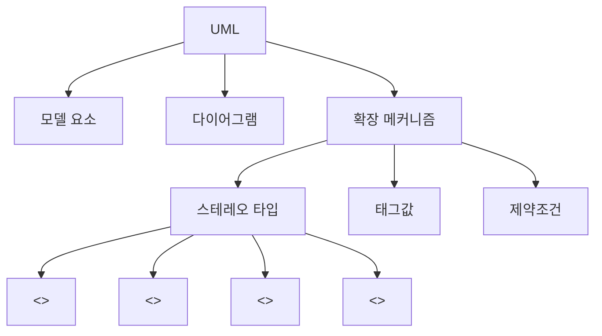

- UML은 소프트웨어 시스템을 시각화, 명세화, 문서화하기 위한 표준 모델링 언어이다.
- 스테레오 타입은 새로운 UML 다이어그램 종류가 아니다.
- 스테레오 타입은 클래스, 컴포넌트, 노드, 관계 같은 기존 UML 요소에 추가적인 의미를 부여하는 `확장 메커니즘`이다.
- UML 확장 메커니즘은 보통 다음과 함께 설명된다.
  - `스테레오 타입(Stereotype)`
  - `태그값(Tagged Value)`
  - `제약조건(Constraint)`

- 핵심 위치:
  - 다이어그램 자체 = UML 요소와 관계를 시각화한 그림
  - 관계 = 요소 사이의 연결 의미
  - 스테레오 타입 = 기존 요소나 관계에 붙이는 추가 의미

---

## 4. 스테레오 타입이 필요한 이유

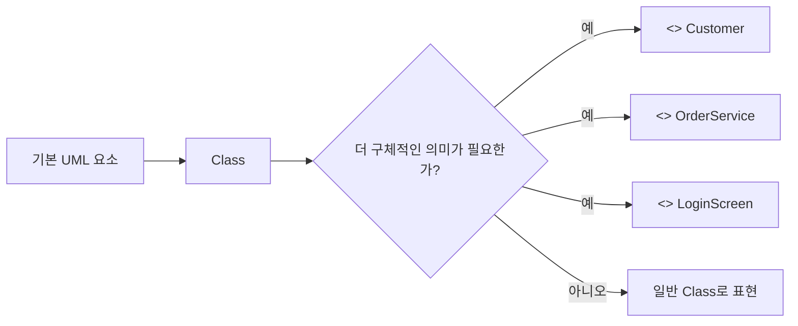

- UML의 기본 요소만으로도 많은 구조와 행위를 표현할 수 있다.
- 하지만 실무나 특정 도메인에서는 같은 UML 요소라도 의미를 더 구체적으로 구분해야 한다.
- 예:
  - `Customer` 클래스가 단순 클래스인지, 데이터 중심의 엔티티인지 구분하고 싶다.
  - `LoginScreen` 클래스가 화면/경계 객체인지 구분하고 싶다.
  - `OrderService` 클래스가 흐름을 제어하는 제어 객체인지 구분하고 싶다.
  - 어떤 컴포넌트가 서비스인지, 저장소인지, 외부 시스템 어댑터인지 구분하고 싶다.

- 스테레오 타입을 사용하면 다음이 가능하다.
  - UML 기본 요소의 의미를 도메인에 맞게 확장한다.
  - 모델 요소의 역할을 한눈에 드러낸다.
  - 팀 내 모델링 규칙을 통일한다.
  - 코드 생성, 문서화, 설계 검토에 필요한 추가 정보를 표현한다.

- 시험 포인트:
  - `기본 기능 외 추가 기능`
  - `추가 의미`
  - `확장`
  - `<< >>`
  - 위 단어가 나오면 스테레오 타입을 떠올린다.

---

## 5. 표기법

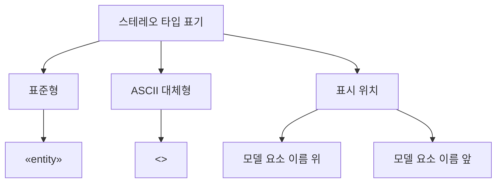

- 기본 표기:
  - `<<스테레오타입명>>`
  - 예: `<<interface>>`, `<<entity>>`, `<<control>>`, `<<boundary>>`

- 엄밀한 UML 표준 표기:
  - `«스테레오타입명»`
  - 예: `«interface»`, `«entity»`

- 시험/교재에서 자주 쓰는 표기:
  - `<<interface>>`
  - `<<include>>`
  - `<<extend>>`
  - `<<entity>>`
  - `<<boundary>>`
  - `<<control>>`

- 표시 위치:
  - 모델 요소 이름 위에 표시할 수 있다.
  - 모델 요소 이름 앞에 표시할 수 있다.
  - 관계선 위의 라벨처럼 표시할 수 있다.

- 예시:
  - `<<entity>> Customer`
  - `<<control>> OrderController`
  - `<<boundary>> LoginPage`
  - `<<interface>> PaymentGateway`

- 주의:
  - `<< >>` 안에는 임의의 설명문을 길게 쓰기보다, 모델링 규칙상 의미 있는 짧은 분류명을 쓴다.
  - 표기만 붙였다고 자동으로 코드가 생성되는 것은 아니다.
  - 의미는 팀의 모델링 규칙, UML 프로파일, 도구 설정에 따라 달라질 수 있다.

---

## 6. UML 확장 메커니즘 3가지

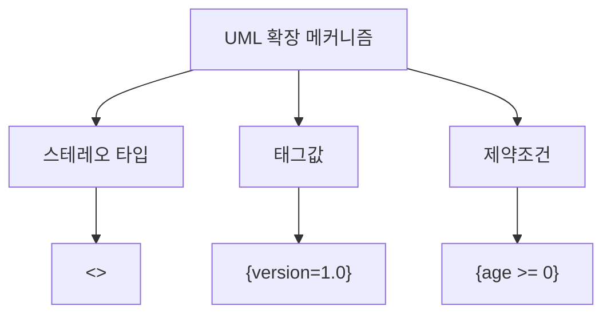

| 구분 | 표기 | 역할 | 예시 |
|---|---|---|---|
| `스테레오 타입` | `<<이름>>` | 기존 UML 요소에 추가 의미/분류 부여 | `<<entity>> Customer` |
| `태그값` | `{이름=값}` | 모델 요소에 메타데이터 부여 | `{author="Kim"}` |
| `제약조건` | `{조건식}` | 모델 요소가 만족해야 하는 규칙 표현 | `{balance >= 0}` |

- 스테레오 타입:
  - UML 요소의 종류나 역할을 확장한다.
  - 예: 이 클래스는 엔티티다, 이 클래스는 제어 객체다.

- 태그값:
  - 모델 요소에 추가 속성 정보를 붙인다.
  - 예: 버전, 작성자, 상태, 코드 생성 옵션

- 제약조건:
  - 모델 요소가 지켜야 할 규칙을 나타낸다.
  - 예: 잔액은 0 이상이어야 한다.

- 시험에서 헷갈리는 부분:
  - `<< >>`는 스테레오 타입이다.
  - `{key=value}`는 태그값이다.
  - `{조건}`은 제약조건이다.
  - 셋 모두 UML을 확장하거나 보완하지만 표기와 목적이 다르다.

---

## 7. 프로파일(Profile)과 스테레오 타입

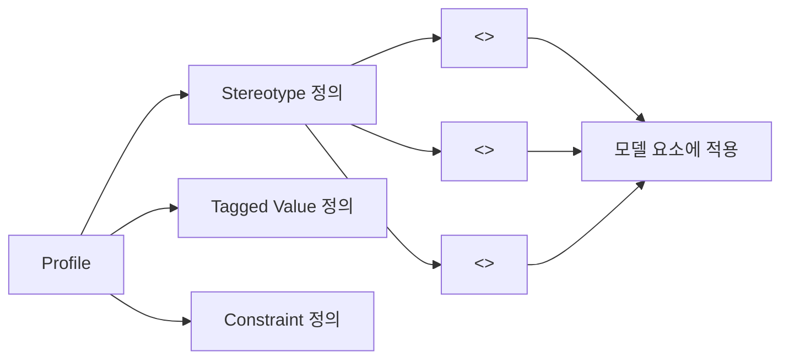

- UML 프로파일은 특정 도메인, 플랫폼, 개발 방법론에 맞게 UML을 조정하는 확장 묶음이다.
- 프로파일 안에서 스테레오 타입, 태그값, 제약조건을 정의할 수 있다.
- 예:
  - 웹 애플리케이션 프로파일
  - 임베디드 시스템 프로파일
  - Java 프로파일
  - 실시간 시스템 프로파일
  - 아키텍처 계층 프로파일

- 프로파일과 스테레오 타입의 관계:
  - 프로파일은 확장 규칙의 묶음이다.
  - 스테레오 타입은 그 묶음 안에서 정의되는 대표적인 확장 요소이다.
  - 스테레오 타입은 기존 UML 메타클래스를 확장한다.

- 시험 대비 관점:
  - 정보처리기사 기본 문제에서는 프로파일 세부 문법까지 깊게 묻기보다는, `스테레오 타입이 UML 확장 메커니즘`이라는 점이 더 중요하다.
  - 하지만 심화 이해를 위해서는 `프로파일이 스테레오 타입을 정의하는 그릇`이라는 정도로 이해하면 좋다.

---

## 8. 클래스 다이어그램에서의 스테레오 타입

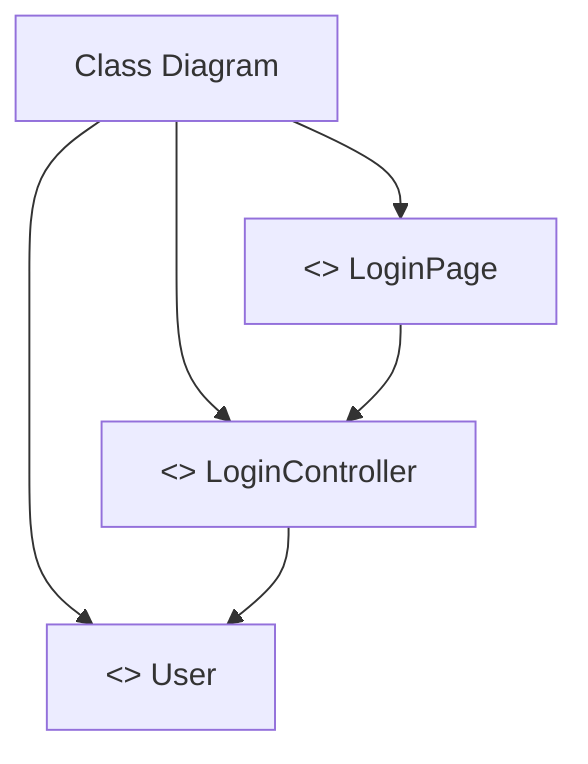

- 클래스 다이어그램에서는 클래스나 인터페이스의 성격을 구분하기 위해 스테레오 타입을 자주 사용한다.

- 대표 예시:
  - `<<boundary>>`
    - 사용자나 외부 시스템과 맞닿는 경계 객체를 의미한다.
    - 예: 화면, API 엔드포인트, 외부 인터페이스
  - `<<control>>`
    - 흐름을 제어하거나 업무 절차를 조정하는 객체를 의미한다.
    - 예: 컨트롤러, 서비스, 유스케이스 핸들러
  - `<<entity>>`
    - 도메인 데이터나 영속적인 정보를 표현하는 객체를 의미한다.
    - 예: 회원, 주문, 상품
  - `<<interface>>`
    - 인터페이스임을 명시한다.
    - 예: `PaymentGateway`, `Repository`

- 시험 포인트:
  - `<<interface>>`는 클래스 다이어그램에서 인터페이스 표기에 자주 나온다.
  - `<<entity>>`, `<<control>>`, `<<boundary>>`는 객체 책임을 구분하는 예시로 이해하면 좋다.
  - 스테레오 타입은 클래스의 속성이나 연산 자체가 아니라 클래스의 `역할`을 설명한다.

- 예:
  - `LoginPage`는 사용자와 상호작용하므로 `<<boundary>>`
  - `LoginController`는 로그인 흐름을 제어하므로 `<<control>>`
  - `User`는 사용자 정보를 담는 도메인 객체이므로 `<<entity>>`

---

## 9. 유스케이스 다이어그램에서의 스테레오 타입

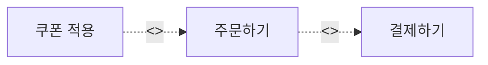

- 유스케이스 다이어그램에서는 `<<include>>`, `<<extend>>` 표기가 자주 나온다.
- 정보처리기사 시험에서는 이 표기를 스테레오 타입 문맥에서 함께 묻는 경우가 있다.

- `<<include>>`
  - 공통 기능을 반드시 포함해서 수행하는 관계이다.
  - 기본 유스케이스가 포함 유스케이스의 동작을 필수로 사용한다.
  - 예:
    - `주문하기`는 `결제하기`를 포함한다.
    - `현금 인출`은 `사용자 인증`을 포함한다.

- `<<extend>>`
  - 특정 조건에서 선택적으로 확장되는 관계이다.
  - 기본 유스케이스는 확장 유스케이스 없이도 의미가 있다.
  - 예:
    - `쿠폰 적용`은 조건에 따라 `주문하기`를 확장한다.
    - `도움말 보기`는 선택적으로 `회원가입`을 확장한다.

- 엄밀한 설명:
  - UML에서는 `include`, `extend`가 유스케이스 관계의 키워드로도 설명된다.
  - 하지만 표기상 `<<include>>`, `<<extend>>`처럼 길러멧을 쓰기 때문에 정보처리기사 학습에서는 스테레오 타입 표기 예시로 함께 정리하는 것이 실전적이다.

- 시험 포인트:
  - `<<include>>` = 필수 포함, 공통 기능 재사용
  - `<<extend>>` = 선택/조건부 확장
  - 둘 다 점선 화살표와 함께 자주 나온다.

---

## 10. 컴포넌트/배치 다이어그램에서의 스테레오 타입

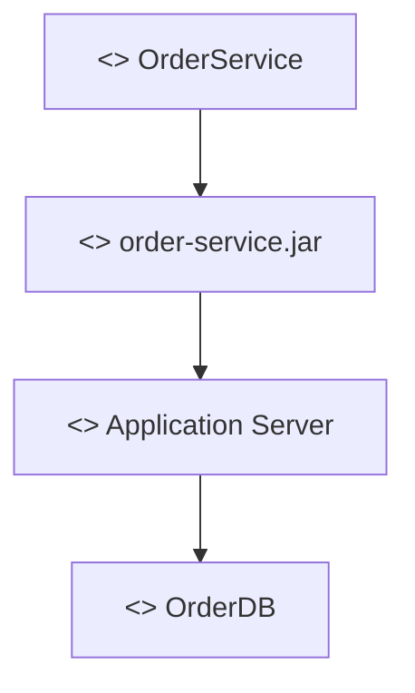

- 스테레오 타입은 클래스 다이어그램에만 쓰이는 것이 아니다.
- 컴포넌트 다이어그램, 배치 다이어그램, 패키지 다이어그램 등 다양한 UML 요소에 적용될 수 있다.

- 예시:
  - `<<component>>`
    - 소프트웨어 컴포넌트임을 강조한다.
  - `<<artifact>>`
    - 배포 가능한 산출물임을 나타낸다.
  - `<<node>>`
    - 실행 환경 또는 배포 노드 성격을 나타낸다.
  - `<<database>>`
    - 데이터베이스 저장소 성격을 나타낸다.
  - `<<service>>`
    - 서비스 컴포넌트 또는 서비스 역할을 나타낸다.

- 시험 대비:
  - 어떤 다이어그램에서 쓰였는지보다 `기존 요소에 추가 의미를 붙였다`는 점이 핵심이다.
  - `<< >>` 표기가 보이면 먼저 스테레오 타입 또는 UML 키워드 표기인지 의심한다.

---

## 11. 스테레오 타입과 키워드 표기 구분

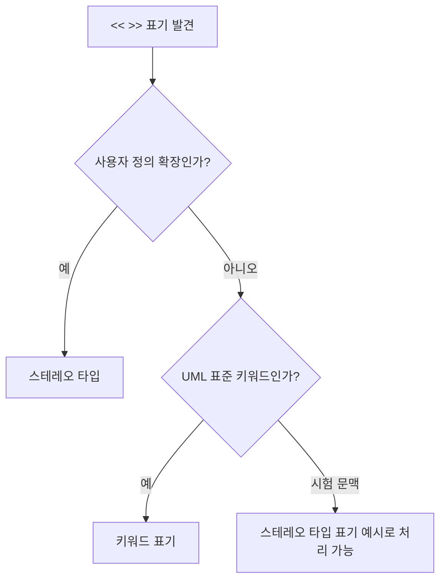

- `<< >>` 안에 들어간 모든 단어가 항상 사용자 정의 스테레오 타입인 것은 아니다.
- UML에서는 표준 키워드도 guillemets 형태로 표현할 수 있다.
- 예:
  - `<<include>>`
  - `<<extend>>`
  - `<<interface>>`

- 시험 대비에서는 다음처럼 정리한다.
  - 문제에서 `길러멧`, `겹화살괄호`, `기본 기능 외 추가 기능`을 묻는다면 스테레오 타입이다.
  - 문제에서 유스케이스 관계를 묻는다면 `include`와 `extend`의 의미와 방향이 중요하다.
  - 문제에서 UML 표준 문법의 엄밀성을 묻는 경우는 드물지만, `<< >>`는 넓게 UML의 확장/키워드 표기라고 이해하면 안전하다.

- 실전 판단:
  - `<<entity>> Customer`처럼 모델 요소의 역할을 붙이는 경우는 스테레오 타입으로 보면 된다.
  - `A -- <<include>> --> B`처럼 유스케이스 관계선에 붙은 경우는 include 관계의 키워드로 보면 된다.

---

## 12. 스테레오 타입과 관계의 차이

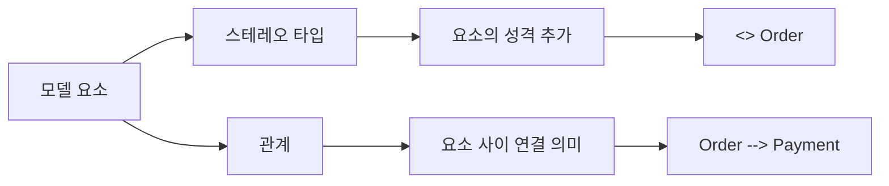

| 구분 | 스테레오 타입 | 관계 |
|---|---|---|
| 목적 | 모델 요소에 추가 의미 부여 | 모델 요소 사이의 연결 표현 |
| 표기 | `<<이름>>` | 실선, 점선, 화살표, 마름모 등 |
| 적용 대상 | 클래스, 컴포넌트, 노드, 관계 등 | 두 개 이상의 모델 요소 사이 |
| 예 | `<<entity>> Customer` | 일반화, 의존, 연관, 포함 |

- 스테레오 타입은 요소 자체의 역할이나 의미를 설명한다.
- 관계는 요소 사이가 어떻게 연결되어 있는지를 설명한다.
- 예:
  - `<<entity>> Order`
    - Order가 엔티티라는 의미를 추가한다.
  - `Order --> Payment`
    - Order가 Payment와 연결되어 있다는 관계를 표현한다.

- 시험 함정:
  - `<<include>>`, `<<extend>>`는 관계선 위에 붙기 때문에 관계와 스테레오 타입 표기가 섞여 보인다.
  - 문제에서 묻는 것이 표기법인지, 관계 의미인지 먼저 구분해야 한다.

---

## 13. 스테레오 타입과 태그값 비교

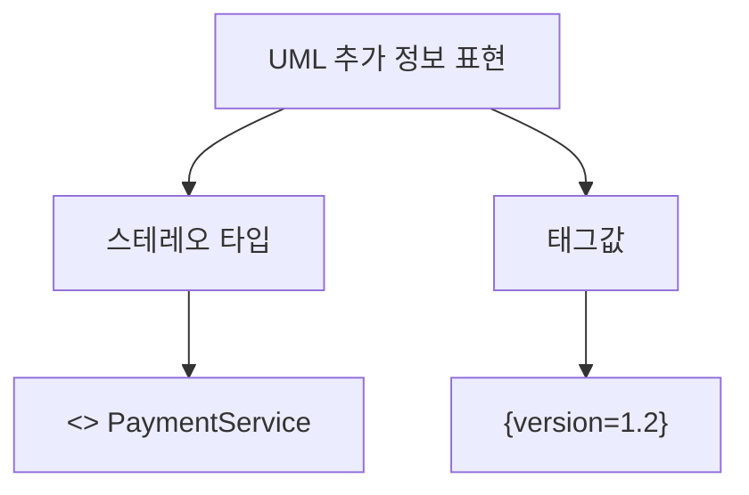

| 구분 | 스테레오 타입 | 태그값 |
|---|---|---|
| 표기 | `<<이름>>` | `{이름=값}` |
| 역할 | 모델 요소의 종류/역할 확장 | 모델 요소의 메타데이터 부여 |
| 예 | `<<service>> PaymentService` | `{version=1.2}` |
| 질문 단서 | 추가 기능, 확장 분류, 길러멧 | 속성값, 메타데이터, key-value |

- 스테레오 타입:
  - 모델 요소가 어떤 성격인지 분류한다.
  - 예: 이 클래스는 서비스이다.

- 태그값:
  - 모델 요소에 부가 정보를 붙인다.
  - 예: 이 컴포넌트의 버전은 1.2이다.

- 예:
  - `<<component>> PaymentModule {version=1.2}`
  - `<<component>>`는 스테레오 타입이다.
  - `{version=1.2}`는 태그값이다.

- 시험 포인트:
  - `<< >>`와 `{ }`를 구분한다.
  - 태그값은 보통 `이름=값` 형태이다.

---

## 14. 스테레오 타입과 제약조건 비교

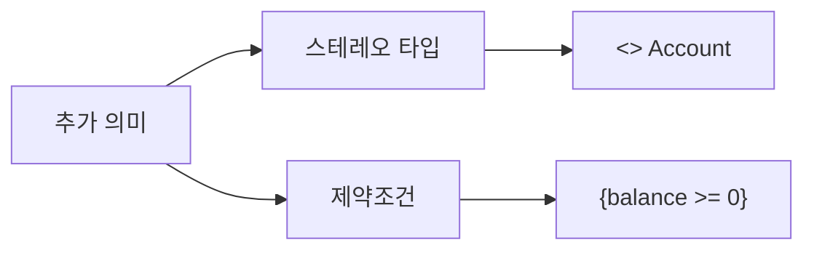

| 구분 | 스테레오 타입 | 제약조건 |
|---|---|---|
| 표기 | `<<이름>>` | `{조건}` |
| 역할 | 요소의 의미/역할 확장 | 요소가 만족해야 할 규칙 |
| 예 | `<<entity>> Account` | `{balance >= 0}` |
| 성격 | 분류/표식 | 규칙/조건 |

- 스테레오 타입은 `무엇으로 볼 것인가`를 나타낸다.
- 제약조건은 `어떤 규칙을 만족해야 하는가`를 나타낸다.

- 예:
  - `<<entity>> Account`
    - Account를 엔티티로 분류한다.
  - `{balance >= 0}`
    - Account의 balance는 0 이상이어야 한다는 규칙이다.

- 시험 포인트:
  - `제약조건`은 중괄호 `{}`로 표현되는 경우가 많다.
  - `스테레오 타입`은 길러멧 `<< >>`로 표현된다.

---

## 15. 대표 스테레오 타입 예시

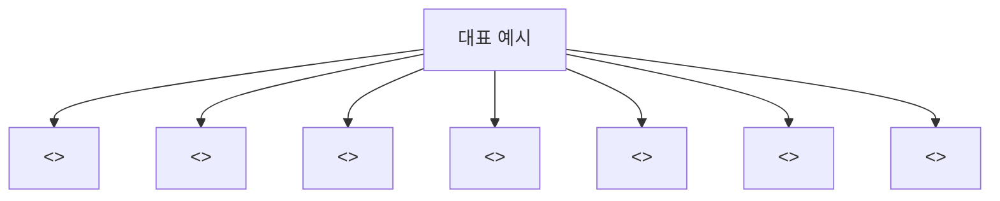

| 표기 | 주로 쓰이는 맥락 | 의미 |
|---|---|---|
| `<<interface>>` | 클래스 다이어그램 | 인터페이스 |
| `<<entity>>` | 분석/설계 클래스 | 데이터 중심 객체, 도메인 객체 |
| `<<control>>` | 분석/설계 클래스 | 흐름 제어 객체 |
| `<<boundary>>` | 분석/설계 클래스 | 외부와 맞닿는 경계 객체 |
| `<<include>>` | 유스케이스 관계 | 필수 포함 관계 |
| `<<extend>>` | 유스케이스 관계 | 조건부/선택 확장 관계 |
| `<<service>>` | 컴포넌트/클래스 | 서비스 역할 |
| `<<repository>>` | 클래스/컴포넌트 | 저장소 역할 |
| `<<artifact>>` | 배치/컴포넌트 | 배포 산출물 |

- 시험에서 꼭 잡을 예시:
  - `<<include>>`
  - `<<extend>>`
  - `<<interface>>`

- 설계 이해를 위해 알아두면 좋은 예시:
  - `<<entity>>`
  - `<<control>>`
  - `<<boundary>>`

- 주의:
  - 모든 프로젝트에서 같은 스테레오 타입을 쓰는 것은 아니다.
  - 팀이나 도구가 정의한 UML 프로파일에 따라 스테레오 타입 목록이 달라질 수 있다.
  - 시험에서는 표기법과 개념을 중심으로 판단한다.

---

## 16. 보기 판별 예시

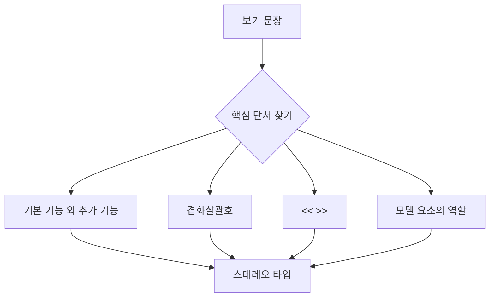

- 보기: `UML에서 기본 기능 외에 추가적인 기능을 표현하기 위해 사용한다.`
  - 정답: `스테레오 타입`
  - 이유: PDF의 핵심 문장과 동일하다.

- 보기: `길러멧이라고 부르는 겹화살괄호 사이에 표현할 형태를 기술한다.`
  - 정답: `스테레오 타입`
  - 이유: `<< >>` 표기법이 핵심 단서이다.

- 보기: `모델 요소에 {author="Kim"}처럼 메타데이터를 붙인다.`
  - 정답: `태그값`
  - 이유: `{이름=값}` 형태는 태그값이다.

- 보기: `모델 요소가 만족해야 하는 조건을 {balance >= 0}처럼 표현한다.`
  - 정답: `제약조건`
  - 이유: 규칙이나 조건을 중괄호로 표현한다.

- 보기: `클래스 Customer 앞에 <<entity>>를 붙여 도메인 객체임을 나타낸다.`
  - 정답: `스테레오 타입`
  - 이유: 클래스에 추가 역할을 부여한다.

- 보기: `유스케이스 사이의 공통 기능을 반드시 포함함을 <<include>>로 표현한다.`
  - 정답: 유스케이스의 `포함 관계`
  - 함께 볼 점: `<<include>>`는 길러멧 표기 예시로도 자주 등장한다.

---

## 17. 자주 나오는 함정

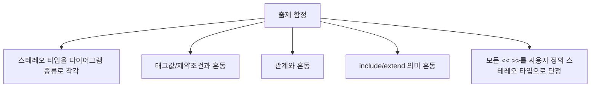

- 함정 1: 스테레오 타입을 다이어그램 종류로 착각
  - 스테레오 타입은 클래스 다이어그램, 유스케이스 다이어그램 같은 다이어그램 종류가 아니다.
  - UML 요소에 추가 의미를 부여하는 표기이다.

- 함정 2: 태그값과 혼동
  - 스테레오 타입은 `<< >>`.
  - 태그값은 `{key=value}`.

- 함정 3: 제약조건과 혼동
  - 제약조건은 `{조건}`.
  - 스테레오 타입은 `{}`가 아니라 `<< >>`.

- 함정 4: 관계와 혼동
  - 일반화, 연관, 의존 등은 관계이다.
  - 스테레오 타입은 요소나 관계에 의미를 더하는 표기이다.

- 함정 5: include와 extend 의미 혼동
  - `<<include>>`는 필수 포함이다.
  - `<<extend>>`는 조건부 확장이다.

- 함정 6: 모든 `<< >>`를 사용자 정의 스테레오 타입으로 단정
  - UML에서는 표준 키워드도 guillemets로 표시될 수 있다.
  - 시험에서는 대부분 `<< >>`와 스테레오 타입을 연결해서 묻지만, 유스케이스 관계 문제에서는 관계 의미를 함께 봐야 한다.

---

## 18. 스테레오 타입 읽는 순서

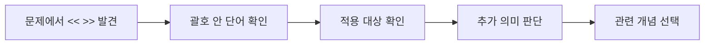

- 1단계: `<< >>`가 있는지 확인한다.
  - 있으면 스테레오 타입 또는 UML 키워드 표기일 가능성이 높다.

- 2단계: 괄호 안 단어를 확인한다.
  - `interface`, `entity`, `control`, `boundary`이면 역할 분류이다.
  - `include`, `extend`이면 유스케이스 관계 의미도 함께 판단한다.

- 3단계: 어디에 붙었는지 확인한다.
  - 클래스 이름 위/앞이면 클래스의 역할이다.
  - 관계선 위라면 관계의 종류나 의미이다.
  - 컴포넌트나 노드에 붙었다면 구현/배포 요소의 역할이다.

- 4단계: 표기 목적을 판단한다.
  - 추가 의미 부여인가?
  - 메타데이터인가?
  - 조건 제약인가?
  - 관계 의미인가?

- 5단계: 정답을 고른다.
  - `기본 기능 외 추가 의미`와 `<< >>`가 핵심이면 스테레오 타입이다.

---

## 19. 암기 포인트

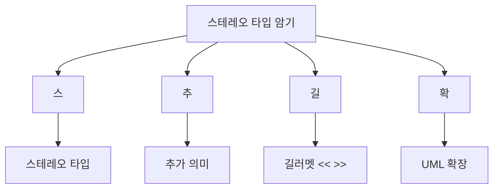

- 핵심 암기:
  - `스테레오 타입 = UML 기본 요소에 추가 의미를 붙이는 확장 표기`
  - `표기 = << >>`
  - `괄호 이름 = 길러멧/겹화살괄호`

- 비교 암기:
  - `<< >>` = 스테레오 타입
  - `{key=value}` = 태그값
  - `{조건}` = 제약조건
  - `선/화살표/마름모` = 관계 표기

- 예시 암기:
  - `<<interface>>` = 인터페이스
  - `<<entity>>` = 엔티티
  - `<<control>>` = 제어 객체
  - `<<boundary>>` = 경계 객체
  - `<<include>>` = 필수 포함
  - `<<extend>>` = 선택/조건부 확장

- 최종 암기 문장:
  - `스테레오 타입은 UML 기본 요소에 추가 의미를 부여하기 위한 확장 메커니즘이며, 길러멧이라고 부르는 겹화살괄호 << >> 사이에 표현할 형태를 기술한다.`

---

## 20. 빠른 복습

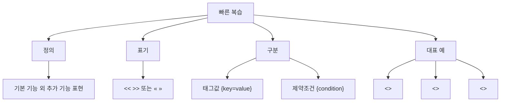

- 챕터명:
  - `017 스테레오 타입`

- 소속 영역:
  - `UML`

- PDF 핵심 키워드:
  - `기본 기능 외에 추가적인 기능`
  - `길러멧`
  - `겹화살괄호`
  - `<< >>`

- 가장 먼저 떠올릴 말:
  - `스테레오 타입은 UML 요소에 추가 의미를 부여하는 << >> 표기이다.`

- 자주 나오는 문제 유형:
  - 정의를 주고 스테레오 타입을 고르는 문제
  - `<< >>` 표기의 이름을 묻는 문제
  - 태그값, 제약조건과 구분하는 문제
  - `<<include>>`, `<<extend>>`의 의미를 함께 묻는 문제
  - 스테레오 타입을 다이어그램 종류나 관계 자체와 혼동시키는 문제

---

## 21. 참고 링크

- 기준 PDF: `/Users/nes0903/Documents/study/정보처리기사/핵심요약집_2026_정보처리기사필기핵심요약.pdf`
- [Q-Net 정보처리기사 종목 페이지](https://www.q-net.or.kr/crf005.do?id=crf00503s02&jmCd=1320&jmInfoDivCcd=B0)
- [OMG - Unified Modeling Language Specification](https://www.omg.org/spec/UML/)
- [OMG - What is UML?](https://www.omg.org/uml/what-is-uml.htm)
- [UML-Diagrams - UML Stereotype](https://www.uml-diagrams.org/stereotype.html)
- [UML-Diagrams - Profile Diagrams](https://www.uml-diagrams.org/profile-diagrams.html)
- [UML-Diagrams - Use Case Include](https://www.uml-diagrams.org/use-case-include.html)
- [UML-Diagrams - Use Case Extend](https://www.uml-diagrams.org/use-case-extend.html)
- [Visual Paradigm - UML Extensibility Mechanism](https://www.visual-paradigm.com/guide/uml-unified-modeling-language/uml-extexsibility-mechanism/)

<!-- study-links:start -->
## 관련 문서

- `유스케이스 다이어그램`: [[정보처리기사/1과목 소프트웨어 설계/018 유스케이스 다이어그램 - 액터(Actor)/018 유스케이스 다이어그램 - 액터(Actor)|018 유스케이스 다이어그램 - 액터(Actor)]]
- `흐름 제어`: [[정보처리기사/5과목 정보시스템 구축 관리/267 흐름 제어 - 정지-대기(Stop-and-Wait)/267 흐름 제어 - 정지-대기(Stop-and-Wait)|267 흐름 제어 - 정지-대기(Stop-and-Wait)]]
- `uml`: [[정보처리기사/1과목 소프트웨어 설계/013 UML/013 UML|013 UML]]
<!-- study-links:end -->
