# 018 유스케이스 다이어그램 - 액터(Actor)

작성 기준일: 2026-05-03  
과목: `1과목 소프트웨어 설계`  
기준 PDF: `/Users/nes0903/Documents/study/정보처리기사/핵심요약집_2026_정보처리기사필기핵심요약.pdf`  
PDF 확인 위치: `3페이지`  
검색 보강: OMG UML 공식 자료, UML-Diagrams, IBM, Microsoft, Sparx Systems, Visual Paradigm 자료를 함께 확인하여 시험 중심으로 확장 정리

---

## 1. 한 줄 요약

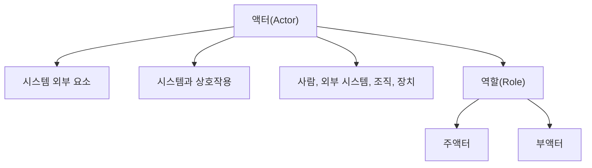

- 액터는 유스케이스 다이어그램에서 시스템과 상호작용하는 `시스템 외부의 역할`이다.
- 액터는 반드시 사람이 아니다.
- 사람, 외부 시스템, 조직, 기관, 장치, 시간 이벤트 등이 액터가 될 수 있다.
- PDF 기준 핵심은 다음 3가지이다.
  - 액터는 시스템과 상호작용을 하는 모든 외부 요소이다.
  - 사람이나 외부 시스템을 의미한다.
  - 주액터는 시스템 사용으로 이득을 얻는 대상이고, 부액터는 주액터의 목적 달성을 위해 시스템에 서비스를 제공하는 외부 시스템이다.

---

## 2. PDF 기준 핵심

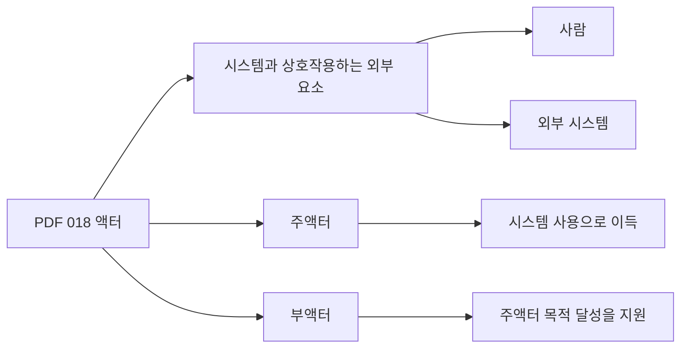

- PDF에서 직접 확인한 내용:
  - `시스템과 상호작용을 하는 모든 외부 요소로, 사람이나 외부 시스템을 의미한다.`
  - `주액터: 시스템을 사용함으로써 이득을 얻는 대상으로, 주로 사람이 해당함`
  - `부액터: 주액터의 목적 달성을 위해 시스템에 서비스를 제공하는 외부 시스템으로, 조직이나 기관 등이 될 수 있음`

- 이 챕터의 최소 암기 골격:
  - 액터는 `시스템 밖`에 있다.
  - 액터는 시스템과 `상호작용`한다.
  - 액터는 `사람`일 수도 있고 `외부 시스템`일 수도 있다.
  - 주액터는 `목적/이득`을 얻는다.
  - 부액터는 주액터의 목적 달성을 위해 `서비스를 제공`한다.

- 시험에서 가장 먼저 볼 단서:
  - `외부 요소`
  - `상호작용`
  - `사람 또는 외부 시스템`
  - `시스템 사용으로 이득`
  - `서비스를 제공하는 외부 시스템`

---

## 3. 유스케이스 다이어그램에서 액터의 위치

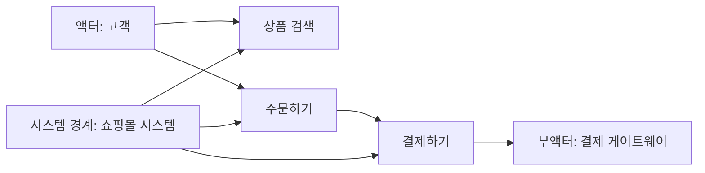

- 유스케이스 다이어그램은 사용자 관점에서 시스템이 제공하는 기능과 외부 참여자를 표현한다.
- 일반적인 배치:
  - `액터`는 시스템 경계 밖에 둔다.
  - `유스케이스`는 시스템 경계 안에 둔다.
  - 액터와 유스케이스는 선으로 연결하여 상호작용을 나타낸다.

- 액터가 시스템 경계 밖에 있어야 하는 이유:
  - 액터는 분석 대상 시스템의 내부 구성요소가 아니다.
  - 액터는 시스템에 입력을 주거나, 시스템으로부터 결과를 받거나, 시스템에 서비스를 제공한다.
  - 시스템 내부 클래스, 모듈, DB 테이블, 함수는 보통 액터가 아니다.

- 시스템 경계가 중요한 이유:
  - 같은 대상도 무엇을 시스템으로 보느냐에 따라 액터 여부가 달라질 수 있다.
  - 예를 들어 `직원`은 회사 전체 업무 모델에서는 내부 구성원일 수 있지만, `사내 ERP 시스템`을 분석할 때는 ERP를 사용하는 외부 역할이므로 액터가 될 수 있다.

---

## 4. 액터는 사람이 아니라 역할이다

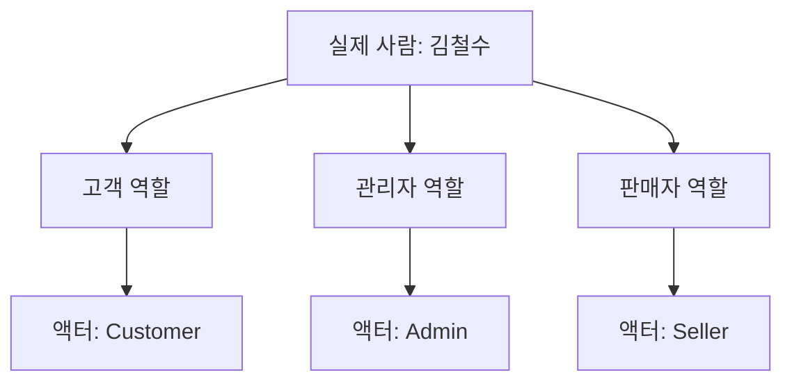

- UML에서 액터는 특정 개인이 아니라 `역할(Role)`이다.
- 한 사람이 여러 액터 역할을 할 수 있다.
  - 예: 한 사람이 고객이면서 관리자일 수 있다.
- 하나의 액터 역할을 여러 사람이 수행할 수 있다.
  - 예: `고객` 액터는 수많은 고객이 수행할 수 있는 역할이다.

- 예시:
  - `홍길동`은 액터명이 아니다.
  - `고객`, `관리자`, `결제 승인 시스템`, `택배사 시스템`은 액터명이 될 수 있다.

- 좋은 액터 이름:
  - `고객`
  - `관리자`
  - `회원`
  - `비회원`
  - `결제 게이트웨이`
  - `인증 서버`
  - `택배사 시스템`

- 나쁜 액터 이름:
  - `홍길동`
  - `김대리`
  - `사용자1`
  - `시스템 내부 로직`
  - `주문 테이블`

- 시험 포인트:
  - 액터는 개별 인물이 아니라 역할이다.
  - 액터는 시스템 내부 객체가 아니라 시스템 외부에서 상호작용하는 존재이다.

---

## 5. 액터가 될 수 있는 대상

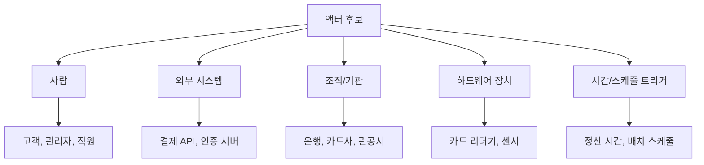

- 사람:
  - 고객
  - 관리자
  - 상담원
  - 판매자
  - 회원
  - 비회원

- 외부 시스템:
  - 결제 게이트웨이
  - 본인 인증 서버
  - 배송 추적 시스템
  - 외부 회계 시스템
  - 이메일 발송 서비스

- 조직/기관:
  - 카드사
  - 은행
  - 택배사
  - 공공기관
  - 제휴사

- 하드웨어 장치:
  - 바코드 스캐너
  - 카드 리더기
  - 센서
  - 키오스크 장치
  - 프린터

- 시간 또는 이벤트 트리거:
  - 매일 자정 정산
  - 월말 보고서 생성
  - 예약 시간 도래
  - 배치 스케줄러

- 시험에서 중요한 문장:
  - 액터는 `사람만`이 아니다.
  - 외부 시스템, 외부 장치, 기관도 시스템과 상호작용하면 액터가 될 수 있다.

---

## 6. 주액터(Primary Actor)

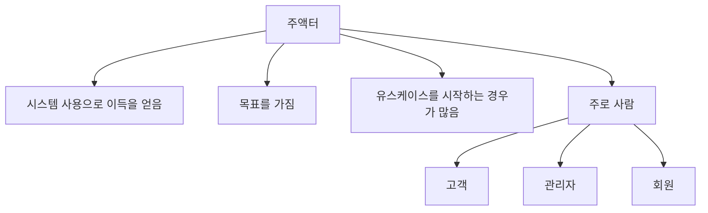

- 정의:
  - 주액터는 시스템을 사용함으로써 목적을 달성하거나 이득을 얻는 대상이다.
  - PDF에서는 주로 사람이 해당한다고 정리한다.

- 특징:
  - 유스케이스의 목표를 가진다.
  - 시스템에 기능 수행을 요청한다.
  - 유스케이스의 결과로 가치나 이득을 얻는다.
  - 유스케이스를 직접 시작하는 경우가 많다.

- 예시:
  - 쇼핑몰에서 `고객`은 `상품 주문하기`의 주액터이다.
  - 은행 ATM에서 `고객`은 `현금 인출하기`의 주액터이다.
  - 관리자 시스템에서 `관리자`는 `회원 권한 변경하기`의 주액터이다.
  - 수강 신청 시스템에서 `학생`은 `수강 신청하기`의 주액터이다.

- 주의:
  - 주액터가 항상 사람인 것은 아니다.
  - 외부 시스템이 특정 목표를 가지고 대상 시스템의 서비스를 요청한다면 주액터가 될 수 있다.
  - 다만 정보처리기사 PDF 기준으로는 `주로 사람`이라고 기억하면 된다.

- 시험 포인트:
  - `시스템 사용으로 이득을 얻는다`
  - `목적을 가진다`
  - `유스케이스의 주된 수혜자`
  - 위 단서가 나오면 주액터이다.

---

## 7. 부액터(Secondary/Supporting Actor)

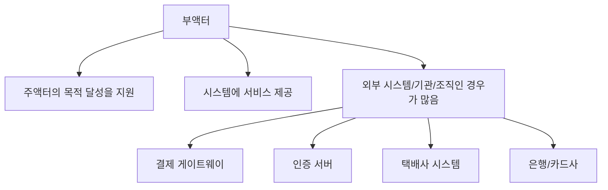

- 정의:
  - 부액터는 주액터의 목적 달성을 위해 시스템에 서비스를 제공하는 외부 대상이다.
  - PDF에서는 외부 시스템, 조직, 기관 등이 될 수 있다고 정리한다.

- 특징:
  - 주액터의 목표를 직접 달성하기보다 시스템을 돕는다.
  - 시스템이 부액터에게 정보를 요청하거나, 부액터가 시스템에 필요한 서비스를 제공한다.
  - 결제, 인증, 배송, 알림, 외부 조회처럼 보조적인 외부 연동 역할을 맡는 경우가 많다.

- 예시:
  - `주문하기` 유스케이스에서 결제 승인 서비스를 제공하는 `결제 게이트웨이`
  - `로그인하기` 유스케이스에서 인증 정보를 검증하는 `인증 서버`
  - `배송 조회하기` 유스케이스에서 배송 상태를 제공하는 `택배사 시스템`
  - `계좌 이체하기` 유스케이스에서 은행망 서비스를 제공하는 `은행 시스템`

- 주의:
  - 부액터는 중요도가 낮다는 뜻이 아니다.
  - 부액터가 없으면 유스케이스가 수행되지 못할 수도 있다.
  - `부`라는 말은 주액터의 목표 달성을 지원한다는 역할상의 구분이다.

- 시험 포인트:
  - `서비스를 제공하는 외부 시스템`
  - `주액터의 목적 달성을 지원`
  - `조직이나 기관`
  - 위 단서가 나오면 부액터이다.

---

## 8. 주액터와 부액터 비교

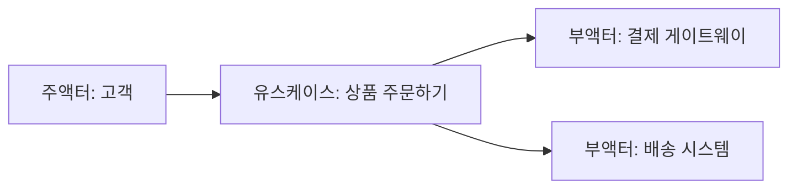

| 구분 | 주액터 | 부액터 |
|---|---|---|
| 핵심 역할 | 시스템 사용으로 목적/이득 달성 | 주액터 목적 달성을 지원 |
| 주된 위치 | 시스템 외부 | 시스템 외부 |
| 대표 대상 | 사람인 경우가 많음 | 외부 시스템, 조직, 기관인 경우가 많음 |
| 유스케이스 관계 | 목표를 가지고 사용 | 필요한 서비스나 정보를 제공 |
| 시험 단서 | 이득, 목표, 사용 | 지원, 서비스 제공, 외부 시스템 |

- 구분 공식:
  - `누가 이 유스케이스로 이득을 얻는가?` = 주액터
  - `누가 이 유스케이스 수행을 위해 외부 서비스를 제공하는가?` = 부액터

- 예시:
  - `회원가입`
    - 주액터: 가입하려는 사용자
    - 부액터: 본인 인증 서비스, 이메일 인증 서비스
  - `상품 주문`
    - 주액터: 고객
    - 부액터: 결제 게이트웨이, 배송사 시스템
  - `급여 이체`
    - 주액터: 인사 담당자 또는 회사
    - 부액터: 은행 시스템

- 심화 주의:
  - 주액터/부액터는 유스케이스별로 판단한다.
  - 같은 외부 대상도 어떤 유스케이스에서는 주액터이고, 다른 유스케이스에서는 부액터가 될 수 있다.

---

## 9. 시스템 경계와 액터 판단

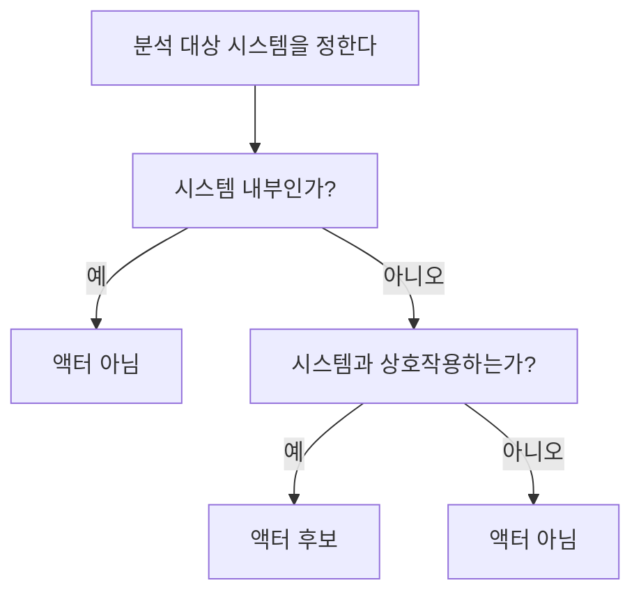

- 액터 판단에서 가장 중요한 기준은 `시스템 경계`이다.
- 먼저 무엇을 시스템으로 볼지 정해야 한다.
- 그다음 후보가 시스템 내부인지 외부인지 판단한다.

- 액터가 되는 경우:
  - 시스템 밖에 있다.
  - 시스템과 직접 상호작용한다.
  - 시스템에 입력을 주거나 결과를 받는다.
  - 시스템에 외부 서비스를 제공한다.
  - 시스템의 기능 수행에 참여한다.

- 액터가 아닌 경우:
  - 시스템 내부 모듈이다.
  - 시스템 내부 클래스이다.
  - 데이터베이스 테이블이다.
  - 단순 데이터 항목이다.
  - 직접 상호작용하지 않는 외부 환경 요소이다.

- 예시:
  - `쇼핑몰 시스템`을 분석할 때:
    - 고객: 액터
    - 관리자: 액터
    - 결제 게이트웨이: 액터
    - 주문 서비스 클래스: 액터 아님
    - 주문 테이블: 액터 아님

- 시험 포인트:
  - 시스템 내부 구성요소를 액터로 보면 틀린다.
  - 외부에 있어도 시스템과 직접 상호작용하지 않으면 액터가 아닐 수 있다.

---

## 10. 액터 표기법

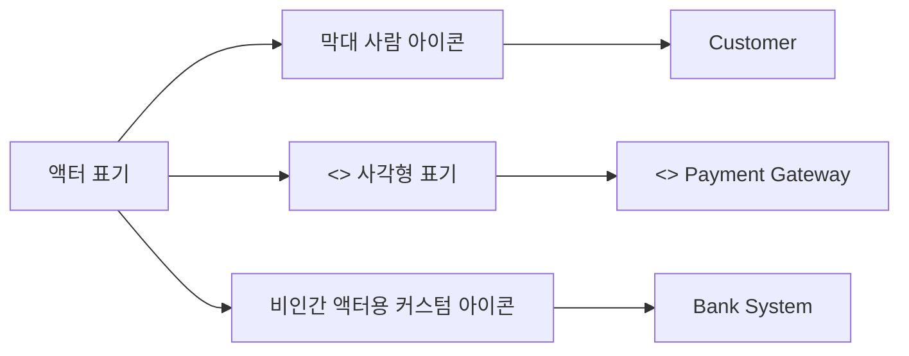

- 기본 표기:
  - 막대 사람 모양의 아이콘을 사용한다.
  - 이름은 아이콘 아래나 위에 쓴다.

- 대체 표기:
  - 사각형에 `<<actor>>` 스테레오 타입을 붙여 표현할 수 있다.
  - 외부 시스템, 장치, 기관 등을 표현할 때 사용하기도 한다.

- 비인간 액터 표기:
  - 원칙적으로 비인간 액터도 막대 사람 아이콘으로 표현할 수 있다.
  - 도구나 팀 규칙에 따라 시스템 아이콘, 장치 아이콘, 사각형 표기를 사용할 수 있다.

- 이름 작성 원칙:
  - 액터 이름은 역할을 나타내는 명사형으로 쓴다.
  - 특정 개인 이름보다 역할명이 적절하다.
  - 예:
    - `Customer`
    - `Admin`
    - `Payment Gateway`
    - `Authentication Server`

- 시험 포인트:
  - 액터는 보통 막대 사람 모양으로 표현한다.
  - 사람이 아닌 외부 시스템도 액터가 될 수 있으므로, 막대 사람 모양이 반드시 사람만 뜻한다고 해석하면 안 된다.

---

## 11. 액터와 유스케이스의 관계

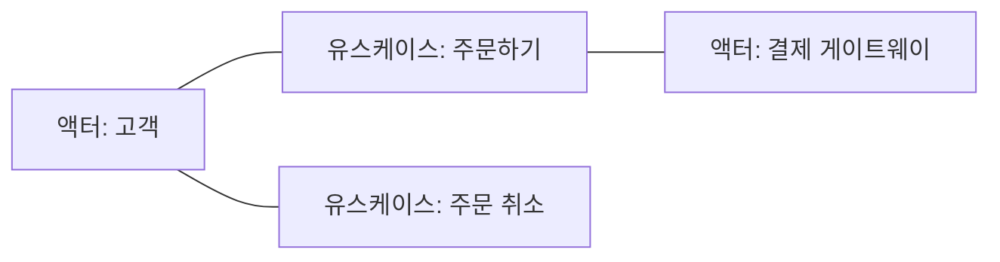

- 액터와 유스케이스는 보통 `연관(Association)`으로 연결한다.
- 이 선은 액터가 해당 유스케이스에 참여하거나, 시스템과 통신한다는 의미이다.
- 유스케이스 다이어그램은 상세 처리 순서가 아니라 `누가 어떤 기능과 관련되는지`를 보여준다.

- 관계 해석:
  - 액터가 유스케이스를 시작할 수 있다.
  - 액터가 유스케이스 수행에 참여한다.
  - 액터가 입력을 제공한다.
  - 액터가 결과를 받는다.
  - 외부 시스템 액터가 필요한 서비스를 제공한다.

- 주의:
  - 액터와 유스케이스 사이의 선은 데이터 흐름도를 의미하지 않는다.
  - 유스케이스 다이어그램은 메시지 순서나 실행 순서를 표현하지 않는다.
  - 실행 순서는 순차 다이어그램이나 활동 다이어그램으로 상세화한다.

- 시험 포인트:
  - 액터와 유스케이스의 연결은 상호작용/참여를 의미한다.
  - 유스케이스 다이어그램 자체는 기능의 실행 순서를 보여주는 다이어그램이 아니다.

---

## 12. 액터 일반화(Generalization)

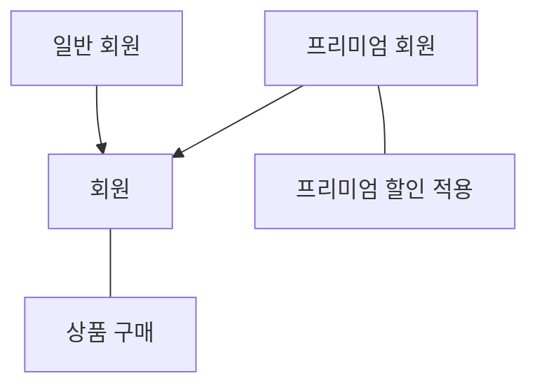

- 액터 사이에도 일반화 관계를 표현할 수 있다.
- 일반화는 공통 역할을 상위 액터로 묶고, 특수한 역할을 하위 액터로 표현하는 방식이다.

- 예:
  - `회원`
    - 일반 회원
    - 프리미엄 회원
  - `사용자`
    - 고객
    - 관리자
  - `직원`
    - 상담원
    - 매니저

- 의미:
  - 하위 액터는 상위 액터의 유스케이스 관계를 물려받을 수 있다.
  - 하위 액터는 추가 유스케이스를 가질 수 있다.

- 예시 해석:
  - `일반 회원`과 `프리미엄 회원`은 모두 `회원`의 기능을 사용할 수 있다.
  - `프리미엄 회원`만 `프리미엄 할인 적용` 기능과 연결될 수 있다.

- 시험 포인트:
  - 일반화는 액터에도 적용될 수 있다.
  - 공통 역할과 특수 역할을 구분할 때 사용한다.
  - 상위 액터는 더 일반적인 역할, 하위 액터는 더 구체적인 역할이다.

---

## 13. 액터 식별 방법

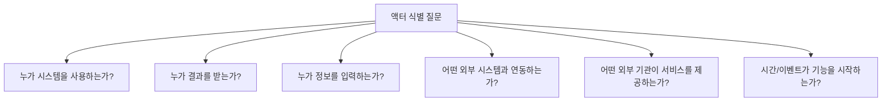

- 액터를 찾을 때 던질 질문:
  - 누가 이 시스템을 사용하는가?
  - 누가 이 시스템의 기능으로 이득을 얻는가?
  - 누가 시스템에 정보를 입력하는가?
  - 누가 시스템으로부터 결과를 받는가?
  - 어떤 외부 시스템이 이 시스템과 데이터를 주고받는가?
  - 어떤 외부 기관이나 조직이 서비스를 제공하는가?
  - 어떤 장치가 시스템에 신호나 데이터를 제공하는가?
  - 특정 시간이나 이벤트가 기능을 시작하는가?

- 액터 후보 검토 기준:
  - 시스템 외부에 있는가?
  - 시스템과 직접 상호작용하는가?
  - 유스케이스의 목표나 결과와 관련이 있는가?
  - 역할명으로 표현할 수 있는가?
  - 특정 개인이나 내부 구현 요소가 아닌가?

- 실무 예시:
  - 쇼핑몰 시스템:
    - 고객
    - 관리자
    - 결제 게이트웨이
    - 택배사 시스템
    - 이메일 발송 서비스

- 시험 포인트:
  - 액터 식별은 요구사항 분석과 연결된다.
  - 액터를 잘못 잡으면 유스케이스 범위도 흔들린다.

---

## 14. 액터와 사용자(User)의 차이

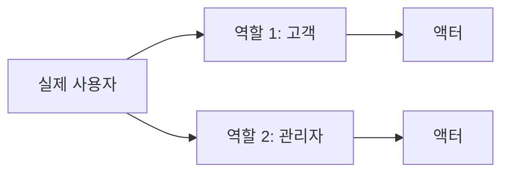

| 구분 | 사용자(User) | 액터(Actor) |
|---|---|---|
| 의미 | 실제 사람 또는 시스템 사용자 | 시스템과 상호작용하는 역할 |
| 수준 | 물리적/현실 대상 | 모델링 관점의 추상화 |
| 예 | 김철수, 이영희 | 고객, 관리자 |
| 관계 | 한 사용자가 여러 역할 가능 | 하나의 역할을 여러 사용자가 수행 가능 |

- 사용자와 액터는 비슷해 보이지만 정확히 같지 않다.
- 액터는 `역할`이므로 실제 사용자를 추상화한 개념이다.

- 예:
  - 김철수가 쇼핑몰에서 상품을 사면 `고객` 액터 역할이다.
  - 김철수가 쇼핑몰 관리자 페이지에서 상품을 등록하면 `관리자` 액터 역할이다.
  - 같은 사람이지만 시스템과 상호작용하는 역할이 다르므로 액터가 달라진다.

- 시험 포인트:
  - 액터는 특정 개인이 아니다.
  - 액터는 시스템과 상호작용하는 역할이다.

---

## 15. 액터와 시스템 내부 요소의 차이

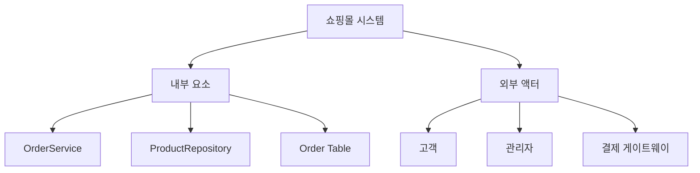

| 구분 | 액터 | 시스템 내부 요소 |
|---|---|---|
| 위치 | 시스템 외부 | 시스템 내부 |
| 역할 | 시스템과 상호작용 | 시스템 기능을 구현 |
| 예 | 고객, 관리자, 결제 시스템 | 클래스, 모듈, DB, 함수 |
| 유스케이스 다이어그램 위치 | 시스템 경계 밖 | 보통 표현하지 않음 |

- 액터는 시스템을 사용하는 외부 역할이다.
- 시스템 내부 요소는 기능을 구현하는 구성요소이다.

- 액터가 아닌 예:
  - `LoginController`
  - `OrderService`
  - `UserRepository`
  - `회원 테이블`
  - `결제 처리 함수`

- 액터가 될 수 있는 예:
  - `회원`
  - `관리자`
  - `외부 결제 시스템`
  - `은행 시스템`
  - `본인 인증 서비스`

- 시험 함정:
  - 유스케이스 다이어그램은 시스템 내부 설계도를 그리는 다이어그램이 아니다.
  - 내부 클래스나 DB를 액터로 고르는 보기는 틀릴 가능성이 높다.

---

## 16. 액터와 외부 시스템 예시

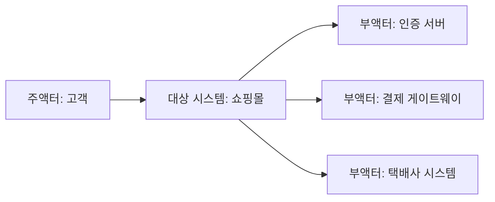

- 외부 시스템이 액터가 되는 전형적인 상황:
  - 인증 서버가 로그인 검증 서비스를 제공한다.
  - 결제 게이트웨이가 결제 승인 서비스를 제공한다.
  - 택배사 시스템이 배송 상태 정보를 제공한다.
  - 은행 시스템이 계좌 이체 결과를 제공한다.
  - 공공기관 시스템이 본인 확인 정보를 제공한다.

- 외부 시스템 액터의 특징:
  - 대상 시스템 밖에 있다.
  - 대상 시스템과 직접 데이터를 주고받는다.
  - 유스케이스 수행에 필요한 서비스를 제공하거나 결과를 받는다.

- 예시 해석:
  - 고객은 주문을 완료하고 싶으므로 주액터이다.
  - 결제 게이트웨이는 주문 완료를 돕는 결제 승인 서비스를 제공하므로 부액터이다.
  - 택배사 시스템은 배송 정보를 제공하므로 부액터이다.

- 시험 포인트:
  - 외부 시스템도 액터가 될 수 있다.
  - 외부 시스템은 주로 부액터로 등장하지만, 항상 부액터인 것은 아니다.

---

## 17. 유스케이스 다이어그램에서 액터가 하는 일

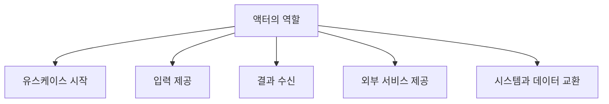

- 액터는 유스케이스와 관련하여 다음 역할을 할 수 있다.
  - 유스케이스를 시작한다.
  - 시스템에 입력을 제공한다.
  - 시스템의 결과를 받는다.
  - 시스템에 외부 서비스를 제공한다.
  - 시스템과 데이터를 교환한다.
  - 시스템의 특정 기능 수행에 참여한다.

- 주액터의 전형적 역할:
  - 목표를 가지고 시스템을 사용한다.
  - 유스케이스의 결과로 이득을 얻는다.

- 부액터의 전형적 역할:
  - 시스템이 요청하는 서비스를 제공한다.
  - 유스케이스 수행 중 필요한 정보를 제공한다.
  - 외부 검증, 승인, 조회, 전달을 담당한다.

- 주의:
  - 액터가 항상 유스케이스를 직접 시작하는 것은 아니다.
  - 부액터는 시스템에 의해 호출되거나 요청받는 경우가 많다.

---

## 18. 유스케이스, 액터, 시스템 경계의 관계

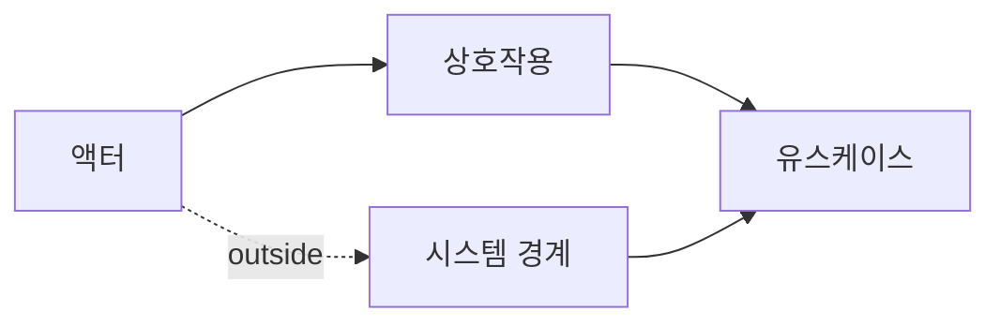

| 요소 | 의미 | 위치 |
|---|---|---|
| `액터` | 시스템과 상호작용하는 외부 역할 | 시스템 경계 밖 |
| `유스케이스` | 시스템이 제공하는 기능/서비스 | 시스템 경계 안 |
| `시스템 경계` | 분석 대상 시스템의 범위 | 액터와 유스케이스 구분 |
| `연관` | 액터와 유스케이스의 상호작용 | 둘 사이 연결 |

- 유스케이스 다이어그램의 핵심 질문:
  - 누가 시스템을 사용하는가?
  - 시스템은 그 액터에게 어떤 기능을 제공하는가?
  - 어떤 외부 시스템이 대상 시스템과 상호작용하는가?
  - 시스템 범위 안과 밖은 어디인가?

- 시험 포인트:
  - 유스케이스는 시스템 내부에 표현한다.
  - 액터는 시스템 외부에 표현한다.
  - 액터와 유스케이스를 선으로 연결한다.
  - 유스케이스 다이어그램은 처리 순서를 나타내지 않는다.

---

## 19. 예시: ATM 시스템

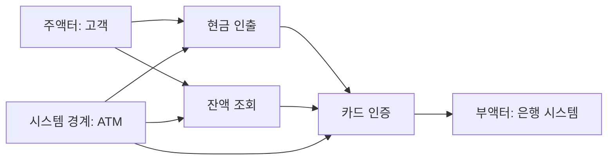

- ATM 시스템에서 액터를 구분하면 다음과 같다.
  - 주액터:
    - 고객
  - 부액터:
    - 은행 시스템
    - 카드 인증 시스템

- 고객이 주액터인 이유:
  - ATM을 사용해서 현금 인출, 잔액 조회 등 목적을 달성한다.
  - 시스템 사용으로 직접적인 이득을 얻는다.

- 은행 시스템이 부액터인 이유:
  - ATM이 현금 인출이나 잔액 조회를 처리하려면 계좌 정보와 인증 결과가 필요하다.
  - 은행 시스템은 ATM에 외부 서비스를 제공한다.

- 액터가 아닌 대상:
  - ATM 내부 화면 모듈
  - 현금 배출 제어 클래스
  - 거래 로그 테이블
  - PIN 검증 함수

---

## 20. 예시: 쇼핑몰 시스템

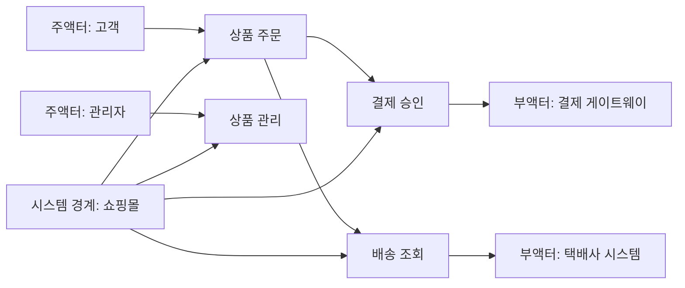

- 쇼핑몰 시스템에서 액터를 구분하면 다음과 같다.
  - 주액터:
    - 고객
    - 관리자
  - 부액터:
    - 결제 게이트웨이
    - 택배사 시스템
    - 이메일 발송 서비스

- 고객이 주액터인 이유:
  - 상품을 검색하고 주문하여 이득을 얻는다.

- 관리자가 주액터인 이유:
  - 상품 등록, 재고 관리, 주문 관리 등의 목표를 달성한다.

- 결제 게이트웨이가 부액터인 이유:
  - 주문 유스케이스 수행 중 결제 승인 서비스를 제공한다.

- 택배사 시스템이 부액터인 이유:
  - 배송 상태 조회나 배송 요청 처리에 필요한 외부 서비스를 제공한다.

- 시험 포인트:
  - 관리자도 시스템을 사용하는 외부 역할이면 액터이다.
  - 외부 연동 시스템도 액터이다.
  - 쇼핑몰 내부 `OrderService`는 액터가 아니다.

---

## 21. 보기 판별 예시

```mermaid
flowchart TD
    A["보기 문장"]
    A --> B{"핵심 단서 찾기"}
    B --> C["외부 요소"]
    B --> D["상호작용"]
    B --> E["사람/외부 시스템"]
    B --> F["이득"]
    B --> G["서비스 제공"]

    C --> H["액터"]
    D --> H
    E --> H
    F --> I["주액터"]
    G --> J["부액터"]
```

- 보기: `시스템과 상호작용을 하는 모든 외부 요소이다.`
  - 정답: `액터`
  - 이유: PDF 핵심 정의이다.

- 보기: `시스템을 사용함으로써 이득을 얻는 대상이다.`
  - 정답: `주액터`
  - 이유: 목적/이득을 얻는 대상이다.

- 보기: `주액터의 목적 달성을 위해 시스템에 서비스를 제공하는 외부 시스템이다.`
  - 정답: `부액터`
  - 이유: 서비스 제공과 지원이 핵심 단서이다.

- 보기: `액터는 반드시 사람이어야 한다.`
  - 정답: `틀림`
  - 이유: 외부 시스템, 조직, 장치도 액터가 될 수 있다.

- 보기: `액터는 시스템 내부 모듈을 표현한다.`
  - 정답: `틀림`
  - 이유: 액터는 시스템 외부 요소이다.

- 보기: `한 사용자가 여러 액터 역할을 할 수 있다.`
  - 정답: `맞음`
  - 이유: 액터는 실제 사람이 아니라 역할이기 때문이다.

---

## 22. 자주 나오는 함정

```mermaid
flowchart TD
    A["출제 함정"]
    A --> B["액터는 반드시 사람"]
    A --> C["시스템 내부 요소를 액터로 착각"]
    A --> D["주액터/부액터 혼동"]
    A --> E["사용자와 액터를 동일시"]
    A --> F["유스케이스 다이어그램을 순서도로 착각"]
    A --> G["시스템 경계 무시"]
```

- 함정 1: 액터는 반드시 사람이라는 설명
  - 틀린 설명이다.
  - 액터는 사람, 외부 시스템, 조직, 장치 등이 될 수 있다.

- 함정 2: 시스템 내부 모듈을 액터로 보는 설명
  - 틀린 설명이다.
  - 액터는 시스템 외부 요소이다.

- 함정 3: 주액터와 부액터 혼동
  - 주액터는 이득을 얻는다.
  - 부액터는 외부 서비스를 제공한다.

- 함정 4: 사용자와 액터를 완전히 같은 개념으로 보는 설명
  - 부정확하다.
  - 액터는 실제 사용자 자체가 아니라 사용자가 수행하는 역할이다.

- 함정 5: 유스케이스 다이어그램에서 실행 순서를 읽으려는 설명
  - 유스케이스 다이어그램은 기능과 참여자를 보여준다.
  - 실행 순서는 순차 다이어그램이나 활동 다이어그램에서 표현한다.

- 함정 6: 시스템 경계를 보지 않고 액터를 판단
  - 같은 대상도 분석 대상 시스템이 무엇인지에 따라 액터 여부가 달라진다.
  - 항상 시스템 경계를 먼저 확인해야 한다.

---

## 23. 암기 포인트

```mermaid
flowchart TD
    A["액터 암기"]
    A --> B["밖"]
    A --> C["상호작용"]
    A --> D["역할"]
    A --> E["주액터"]
    A --> F["부액터"]

    B --> B1["시스템 외부"]
    C --> C1["입력/출력/서비스"]
    D --> D1["사람 자체가 아니라 역할"]
    E --> E1["이득"]
    F --> F1["지원"]
```

- 핵심 암기:
  - `액터 = 시스템 밖에서 시스템과 상호작용하는 역할`
  - `주액터 = 시스템 사용으로 이득을 얻는 대상`
  - `부액터 = 주액터 목적 달성을 위해 서비스를 제공하는 외부 대상`

- 비교 암기:
  - `사람만 액터`는 틀림
  - `외부 시스템도 액터`는 맞음
  - `시스템 내부 모듈도 액터`는 틀림
  - `액터는 역할`은 맞음

- 단서어 암기:
  - 액터:
    - 외부 요소
    - 상호작용
    - 사람 또는 외부 시스템
  - 주액터:
    - 이득
    - 목적
    - 사용
  - 부액터:
    - 지원
    - 서비스 제공
    - 외부 시스템/조직/기관

- 최종 암기 문장:
  - `액터는 시스템과 상호작용하는 외부 역할이며, 주액터는 시스템 사용으로 이득을 얻고 부액터는 주액터의 목적 달성을 위해 외부 서비스를 제공한다.`

---

## 24. 빠른 복습

```mermaid
flowchart TD
    A["빠른 복습"]
    A --> B["액터"]
    B --> B1["시스템 밖"]
    B --> B2["상호작용"]
    B --> B3["역할"]
    B --> B4["사람/외부 시스템"]
    A --> C["주액터"]
    C --> C1["이득"]
    A --> D["부액터"]
    D --> D1["서비스 제공"]
```

- 챕터명:
  - `018 유스케이스 다이어그램 - 액터(Actor)`

- 소속 영역:
  - `UML`

- PDF 핵심 키워드:
  - `시스템과 상호작용`
  - `외부 요소`
  - `사람이나 외부 시스템`
  - `주액터`
  - `부액터`

- 가장 먼저 떠올릴 말:
  - `액터는 시스템 밖에서 시스템과 상호작용하는 역할이다.`

- 문제 풀이 순서:
  - 먼저 분석 대상 시스템의 경계를 확인한다.
  - 후보가 시스템 외부인지 확인한다.
  - 후보가 시스템과 직접 상호작용하는지 확인한다.
  - 목표/이득을 얻으면 주액터로 본다.
  - 외부 서비스를 제공하면 부액터로 본다.

- 자주 나오는 문제 유형:
  - 액터의 정의를 묻는 문제
  - 액터가 될 수 없는 대상을 고르는 문제
  - 주액터와 부액터를 구분하는 문제
  - 사람 외 외부 시스템도 액터가 될 수 있는지 묻는 문제
  - 시스템 내부 요소를 액터로 잘못 제시하는 문제

---

## 25. 참고 링크

- 기준 PDF: `/Users/nes0903/Documents/study/정보처리기사/핵심요약집_2026_정보처리기사필기핵심요약.pdf`
- [Q-Net 정보처리기사 종목 페이지](https://www.q-net.or.kr/crf005.do?id=crf00503s02&jmCd=1320&jmInfoDivCcd=B0)
- [OMG - Unified Modeling Language Specification](https://www.omg.org/spec/UML/)
- [OMG - What is UML?](https://www.omg.org/uml/what-is-uml.htm)
- [UML-Diagrams - Use Case Diagrams](https://www.uml-diagrams.org/use-case-diagrams.html/)
- [UML-Diagrams - Use Case Reference](https://www.uml-diagrams.org/use-case-reference.html)
- [UML-Diagrams - How to Draw Use Case Diagrams](https://www.uml-diagrams.org/use-case-diagrams-how-to.html)
- [IBM - Actors in Modeling Diagrams](https://www.ibm.com/docs/en/dma?topic=diagrams-actors)
- [Microsoft - Create a UML Use Case Diagram](https://support.microsoft.com/en-gb/office/create-a-uml-use-case-diagram-92cc948d-fc74-466c-9457-e82d62ee1298)
- [Sparx Systems - UML 2 Use Case Diagram](https://sparxsystems.org/resources/tutorials/uml2/use-case-diagram.html)
- [Sparx Systems - Actor](https://sparxsystems.com/enterprise_architect_user_guide/16.1/modeling_languages/actor.html)
- [Visual Paradigm - What is Use Case Diagram?](https://www.visual-paradigm.com/guide/uml-unified-modeling-language/what-is-use-case-diagram/)
- [Visual Paradigm - External System as Actor](https://online.visual-paradigm.com/diagrams/templates/use-case-diagram/use-case-diagram-example-external-system-as-actor)

<!-- study-links:start -->
## 관련 문서

- `요구사항 분석`: [[정보처리기사/1과목 소프트웨어 설계/009 요구사항 분석/009 요구사항 분석|009 요구사항 분석]]
- `스테레오 타입`: [[정보처리기사/1과목 소프트웨어 설계/017 스테레오 타입/017 스테레오 타입|017 스테레오 타입]]
- `uml`: [[정보처리기사/1과목 소프트웨어 설계/013 UML/013 UML|013 UML]]
- `트리거`: [[정보처리기사/3과목 데이터베이스 구축/158 트리거(Trigger)/158 트리거(Trigger)|158 트리거(Trigger)]]
- `물리적`: [[정보처리기사/5과목 정보시스템 구축 관리/320 관리적 물리적 기술적 보안/320 관리적 물리적 기술적 보안|320 관리적/물리적/기술적 보안]]
<!-- study-links:end -->
