# 019 순차(Sequence) 다이어그램의 구성 요소

작성 기준일: 2026-05-03  
과목: `1과목 소프트웨어 설계`  
기준 PDF: `/Users/nes0903/Documents/study/정보처리기사/핵심요약집_2026_정보처리기사필기핵심요약.pdf`  
PDF 확인 위치: `3페이지`  
검색 보강: OMG UML 공식 자료, UML-Diagrams, IBM, Microsoft, Sparx Systems 자료를 함께 확인하여 시험 중심으로 확장 정리

---

## 1. 한 줄 요약

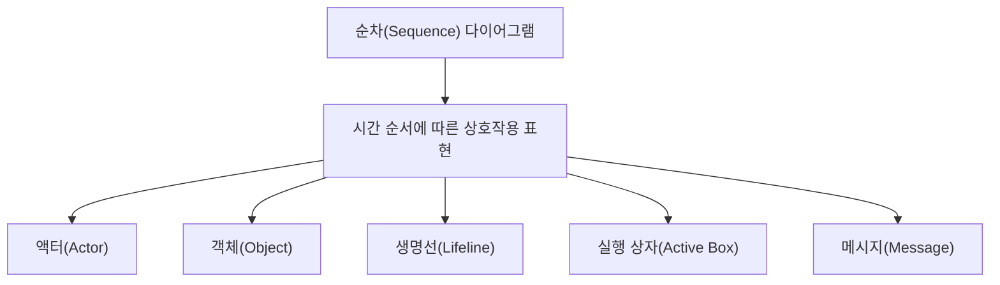

- 순차 다이어그램은 시스템이나 객체들이 `시간 순서`에 따라 주고받는 메시지를 표현하는 UML 상호작용 다이어그램이다.
- PDF 기준 구성 요소는 `액터`, `객체`, `생명선`, `실행 상자`, `메시지` 5가지이다.
- 핵심은 `누가`, `어떤 객체에게`, `어떤 순서로`, `어떤 메시지를 보내는가`이다.
- 시험에서는 구성 요소 이름을 묻거나, 생명선·실행 상자·메시지를 서로 헷갈리게 내는 경우가 많다.

---

## 2. PDF 기준 핵심

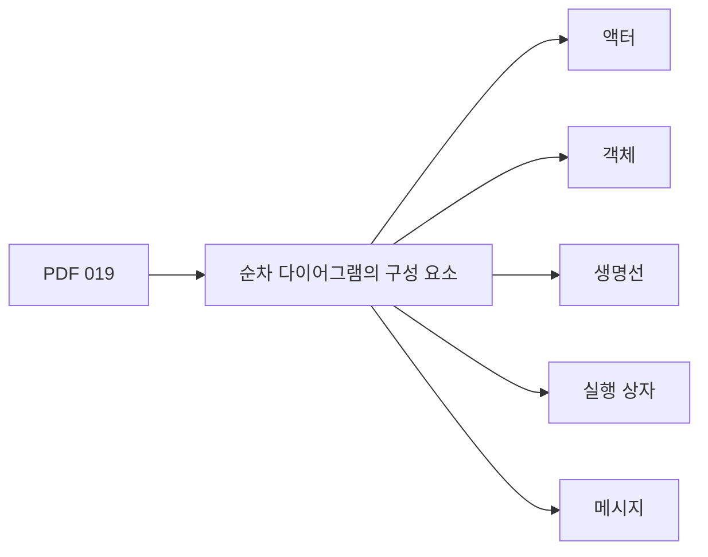

- PDF에서 직접 확인한 구성 요소:
  - `액터(Actor)`
  - `객체(Object)`
  - `생명선(Lifeline)`
  - `실행 상자(Active Box)`
  - `메시지(Message)`

- 이 챕터의 최소 암기 골격:
  - 순차 다이어그램은 `시간 순서`가 핵심이다.
  - 구성 요소는 `액-객-생-실-메`로 외운다.
  - 액터와 객체는 상단 참여자이다.
  - 생명선은 참여자의 존재 기간이다.
  - 실행 상자는 참여자가 동작을 수행하는 구간이다.
  - 메시지는 참여자 사이의 요청, 응답, 신호이다.

- 인접 PDF 문맥:
  - 018 챕터는 유스케이스 다이어그램의 액터를 설명한다.
  - 019 챕터는 순차 다이어그램 구성 요소를 설명한다.
  - 031 챕터에는 메시지의 의미가 별도로 나온다.
  - 따라서 019에서는 메시지를 `순차 다이어그램 안에서 객체 간 상호작용을 표현하는 수단`으로 이해하면 된다.

---

## 3. 순차 다이어그램의 위치

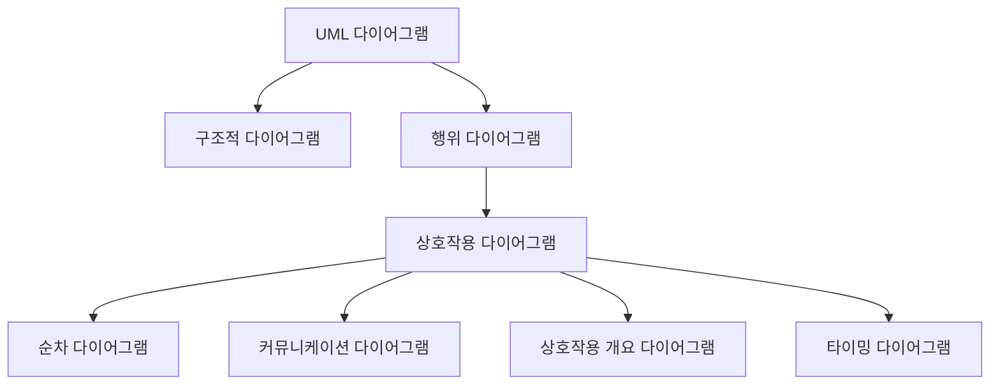

- 순차 다이어그램은 UML의 `행위 다이어그램` 중에서도 `상호작용 다이어그램`에 속한다.
- 상호작용 다이어그램은 객체나 역할 사이에서 일어나는 메시지 교환을 표현한다.
- 순차 다이어그램은 그중에서도 `시간 순서`를 가장 직접적으로 보여준다.

- 주요 특징:
  - 참여자는 가로 방향으로 배치한다.
  - 시간은 위에서 아래로 흐른다.
  - 메시지는 참여자 사이의 화살표로 표시한다.
  - 생명선은 참여자가 상호작용 동안 존재함을 나타낸다.
  - 실행 상자는 참여자가 작업을 수행 중인 구간을 나타낸다.

- 시험 단서:
  - `시간 순서`
  - `메시지 교환`
  - `생명선`
  - `객체 간 상호작용`
  - `위에서 아래로 시간 흐름`

---

## 4. 전체 구조 예시

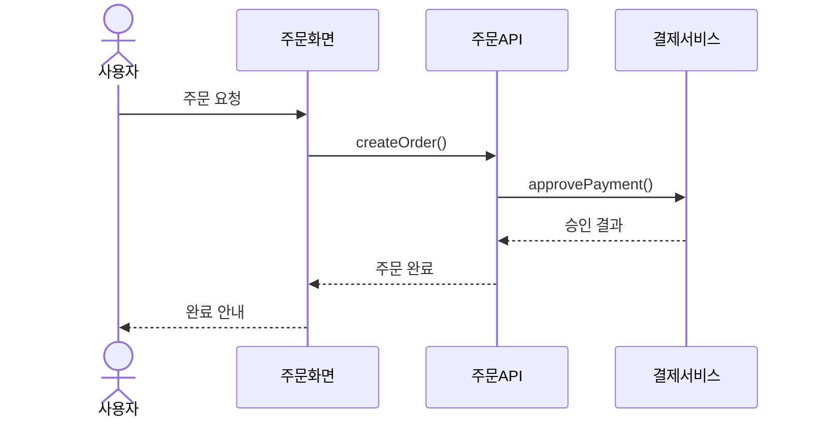

- 위 예시는 순차 다이어그램의 기본 구조를 보여준다.
- `사용자`는 액터이다.
- `주문화면`, `주문API`, `결제서비스`는 객체 또는 참여자이다.
- 각 참여자 아래로 내려가는 세로선은 생명선이다.
- 메시지 화살표는 상호작용의 순서를 나타낸다.
- 응답 메시지는 점선 화살표로 표현하는 경우가 많다.

- 읽는 방법:
  - 왼쪽에서 오른쪽을 먼저 보는 것이 아니라, 위에서 아래로 메시지 순서를 읽는다.
  - 가장 위의 메시지가 먼저 발생하고, 아래로 내려갈수록 나중에 발생한다.
  - 메시지의 가로 위치는 어느 참여자끼리 통신하는지를 나타낸다.

- 시험 포인트:
  - 순차 다이어그램은 절차 흐름도처럼 보일 수 있지만, 핵심은 `객체 간 메시지 교환 순서`이다.
  - 업무 단계 자체를 표현하는 활동 다이어그램과 구분해야 한다.

---

## 5. 구성 요소 전체 비교

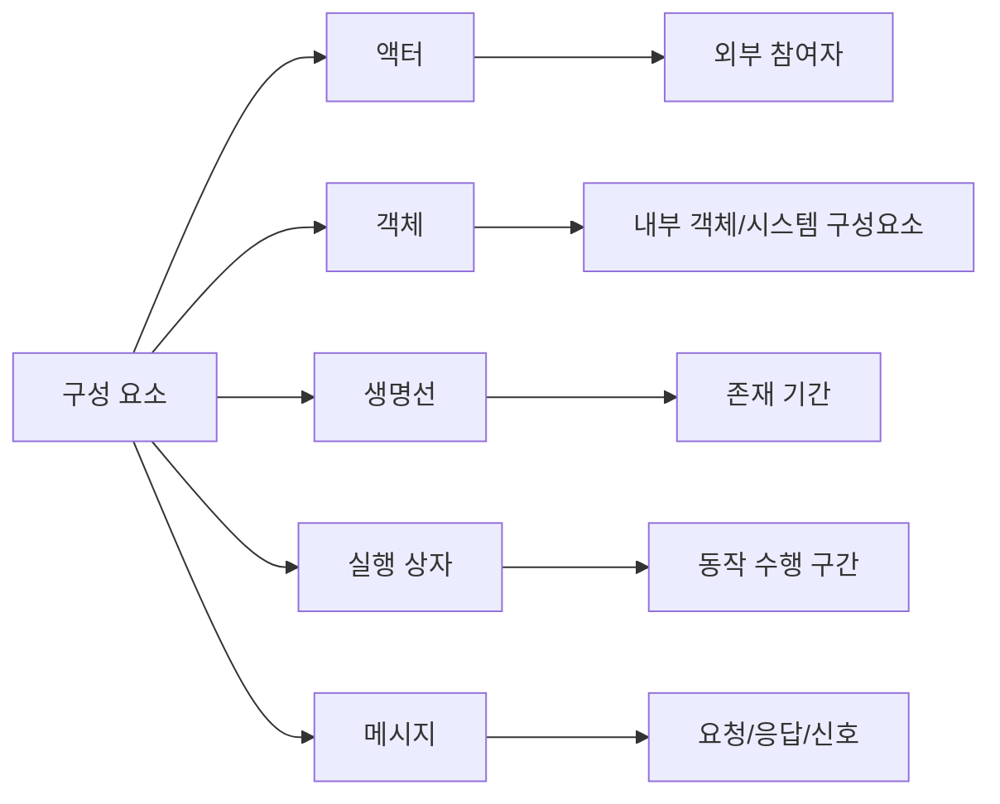

| 구성 요소 | 핵심 의미 | 표기 | 시험 단서 |
|---|---|---|---|
| `액터` | 시스템 외부에서 상호작용하는 역할 | 사람 모양 또는 참여자 | 사용자, 외부 시스템 |
| `객체` | 상호작용에 참여하는 내부 객체/컴포넌트 | 상단 사각형 | 객체, 인스턴스, 시스템 구성요소 |
| `생명선` | 참여자가 존재하는 시간 | 세로 점선 | 존재 시간, 시간 흐름 |
| `실행 상자` | 객체가 동작을 수행하는 기간 | 생명선 위의 얇은 직사각형 | 활성화, 수행 중, 제어 초점 |
| `메시지` | 참여자 사이의 통신 | 화살표 | 호출, 응답, 신호, 요청 |

- 빠른 판단:
  - `외부 사용자`가 보이면 액터
  - `상호작용 참여 객체`가 보이면 객체
  - `세로 점선`이 보이면 생명선
  - `생명선 위 얇은 직사각형`이 보이면 실행 상자
  - `가로 화살표`가 보이면 메시지

---

## 6. 액터(Actor)

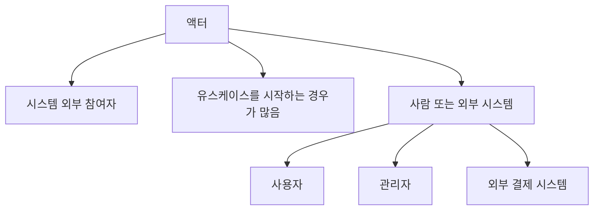

- 정의:
  - 액터는 순차 다이어그램에서 상호작용을 시작하거나 참여하는 시스템 외부 역할이다.
  - 유스케이스 시나리오를 순차 다이어그램으로 상세화할 때 자주 등장한다.

- 특징:
  - 시스템 내부 객체가 아니다.
  - 사람일 수도 있고 외부 시스템일 수도 있다.
  - 보통 다이어그램 왼쪽에 배치하여 사용자의 요청으로 시작되는 흐름을 표현한다.
  - 액터도 생명선을 가질 수 있다.

- 예:
  - 고객
  - 관리자
  - 회원
  - 비회원
  - 외부 결제 시스템
  - 인증 서버

- 시험 포인트:
  - 액터는 시스템과 상호작용하는 외부 요소이다.
  - 순차 다이어그램에서는 액터가 메시지의 시작점이 될 수 있다.
  - 액터는 유스케이스 다이어그램에서만 쓰이는 개념이 아니라, 순차 다이어그램에서도 참여자로 표현될 수 있다.

---

## 7. 객체(Object)

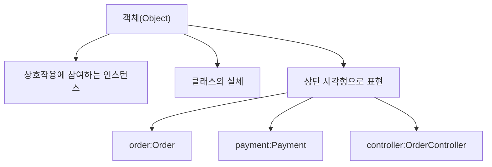

- 정의:
  - 객체는 순차 다이어그램에서 메시지를 주고받는 내부 참여자이다.
  - 객체지향 관점에서는 클래스의 인스턴스이며, 특정 시나리오 수행 중 역할을 가진다.

- 표기:
  - 보통 상단의 사각형 안에 이름을 쓴다.
  - 자주 쓰는 형식:
    - `객체명:클래스명`
    - `:클래스명`
    - `객체명`
  - 예:
    - `order:Order`
    - `:PaymentService`
    - `controller:OrderController`

- 객체의 역할:
  - 메시지를 받는다.
  - 메시지에 따라 동작을 수행한다.
  - 다른 객체에게 메시지를 보낸다.
  - 필요한 경우 결과를 반환한다.

- 시험 포인트:
  - 객체는 순차 다이어그램 상단에 배치되는 참여자이다.
  - 객체는 클래스 다이어그램의 클래스와 연결해서 생각할 수 있지만, 순차 다이어그램에서는 특정 시나리오의 참여자로 본다.
  - 액터는 시스템 외부 역할이고, 객체는 주로 시스템 내부의 상호작용 참여자이다.

---

## 8. 생명선(Lifeline)

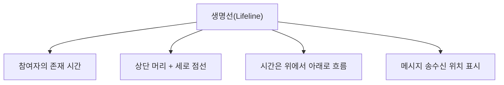

- 정의:
  - 생명선은 순차 다이어그램에서 객체나 액터가 상호작용 동안 존재하는 시간을 나타내는 세로선이다.
  - UML 자료에서는 참여자 머리 부분의 사각형과 그 아래로 내려가는 세로 점선을 함께 생명선으로 설명한다.

- 표기:
  - 상단에는 액터나 객체 이름이 위치한다.
  - 아래로 세로 점선이 이어진다.
  - 시간은 위에서 아래 방향으로 흐른다.

- 의미:
  - 특정 참여자가 상호작용에 참여하는 기간을 나타낸다.
  - 메시지는 생명선 위의 특정 지점에서 송신되거나 수신된다.
  - 객체가 생성되면 생명선이 중간부터 시작할 수 있다.
  - 객체가 소멸되면 생명선 끝에 `X`가 표시될 수 있다.

- 시험 포인트:
  - `객체가 존재하는 시간`
  - `세로 점선`
  - `시간 흐름`
  - 위 단서가 나오면 생명선이다.

- 헷갈리는 지점:
  - 생명선은 객체가 `존재하는 기간`이다.
  - 실행 상자는 객체가 `실제로 작업을 수행하는 기간`이다.

---

## 9. 실행 상자(Active Box)

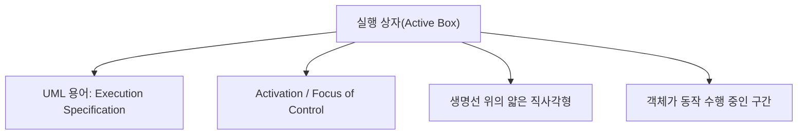

- 정의:
  - 실행 상자는 객체나 참여자가 메시지를 받아 동작을 수행하고 있는 기간을 나타내는 표시이다.
  - UML에서는 `Execution Specification`이라고 하며, 실무 자료에서는 `Activation`, `Activation Bar`, `Focus of Control`이라고도 한다.

- 표기:
  - 생명선 위에 얇은 세로 직사각형으로 표시한다.
  - 메시지를 받아 작업을 시작하면 실행 상자가 시작된다.
  - 작업이 끝나거나 응답을 반환하면 실행 상자가 끝난다.

- 의미:
  - 객체가 연산을 실행 중이다.
  - 객체가 내부 처리를 수행 중이다.
  - 객체가 다른 객체에게 메시지를 보내고 응답을 기다리는 중일 수도 있다.

- 중첩 실행 상자:
  - 객체가 자기 자신에게 메시지를 보내는 경우 중첩 실행 상자가 나타날 수 있다.
  - 재귀 호출이나 내부 메서드 호출을 표현할 때 사용한다.

- 시험 포인트:
  - `실행 상자 = 객체가 실제로 수행 중인 시간`
  - `Active Box = Activation = Execution Specification`
  - `생명선 위의 얇은 직사각형`

---

## 10. 메시지(Message)

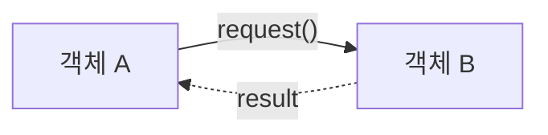

- 정의:
  - 메시지는 액터나 객체 사이에서 전달되는 요청, 응답, 신호, 호출을 나타낸다.
  - PDF의 인접 메시지 챕터 관점에서는 객체에게 어떤 행위를 하도록 지시하는 명령 또는 요구로 이해할 수 있다.

- 표기:
  - 생명선 사이의 가로 화살표로 표현한다.
  - 메시지 이름은 화살표 위나 옆에 적는다.
  - 예:
    - `login(id, pw)`
    - `createOrder()`
    - `approvePayment()`
    - `result`

- 메시지의 역할:
  - 객체에게 연산 수행을 요청한다.
  - 신호나 이벤트를 전달한다.
  - 처리 결과를 반환한다.
  - 새 객체를 생성하거나 객체를 소멸시킬 수 있다.

- 시험 포인트:
  - `객체 간 요청/응답`
  - `상호작용 수단`
  - `행위를 지시하는 명령 또는 요구`
  - `화살표`
  - 위 단서가 나오면 메시지이다.

---

## 11. 메시지 종류

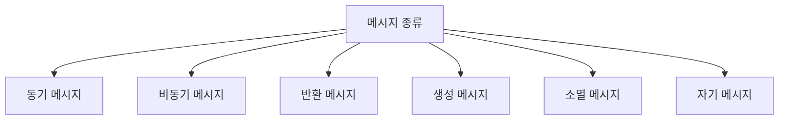

| 메시지 종류 | 의미 | 대표 표기/단서 |
|---|---|---|
| `동기 메시지` | 호출자가 응답을 기다리는 호출 | 실선, 채워진 화살표 머리 |
| `비동기 메시지` | 호출자가 응답을 기다리지 않는 신호/호출 | 실선, 열린 화살표 머리 |
| `반환 메시지` | 호출 결과를 돌려줌 | 점선 화살표 |
| `생성 메시지` | 새 객체를 생성 | 객체 생명선 시작점으로 향함 |
| `소멸 메시지` | 객체를 종료/소멸 | 생명선 끝의 X |
| `자기 메시지` | 자기 자신의 연산 호출 | 같은 생명선으로 돌아오는 화살표 |

- 동기 메시지:
  - 호출한 객체가 응답을 기다린다.
  - 일반적인 메서드 호출에 가깝다.

- 비동기 메시지:
  - 호출한 객체가 응답을 기다리지 않고 다음 처리를 계속한다.
  - 이벤트, 알림, 신호 전달에 가깝다.

- 반환 메시지:
  - 처리 결과를 호출자에게 돌려준다.
  - 보통 점선 화살표로 표현한다.

- 생성 메시지:
  - 새 객체를 생성한다.
  - 생성되는 객체의 생명선이 메시지를 받은 지점부터 시작될 수 있다.

- 소멸 메시지:
  - 객체의 생명주기가 끝남을 나타낸다.
  - 생명선 끝에 `X`를 표시한다.

- 시험 포인트:
  - 정보처리기사 기본 PDF에는 메시지 종류까지 깊게 나오지 않더라도, 순차 다이어그램 이해 문제에서 동기/비동기/반환 메시지가 함께 출제될 수 있다.

---

## 12. 시간 흐름 읽는 법

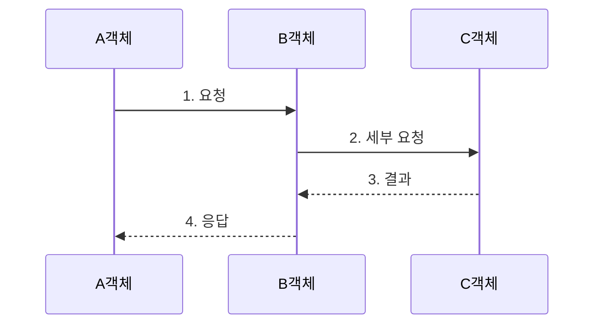

- 순차 다이어그램은 위에서 아래로 읽는다.
- 메시지가 위에 있을수록 먼저 발생한다.
- 아래에 있을수록 나중에 발생한다.
- 가로 방향은 참여자의 위치를 의미한다.
- 세로 방향은 시간 순서를 의미한다.

- 읽기 순서:
  - 1단계: 참여자를 확인한다.
  - 2단계: 가장 위의 메시지부터 읽는다.
  - 3단계: 메시지 송신자와 수신자를 확인한다.
  - 4단계: 동기/비동기/반환 메시지를 구분한다.
  - 5단계: 실행 상자가 어느 구간에 있는지 확인한다.

- 시험 포인트:
  - 순차 다이어그램은 `위에서 아래로 시간 흐름`이다.
  - 메시지의 번호가 없어도 위치로 순서를 판단할 수 있다.
  - 커뮤니케이션 다이어그램은 메시지 번호로 순서를 표현하는 경우가 많다.

---

## 13. 생명선과 실행 상자 비교

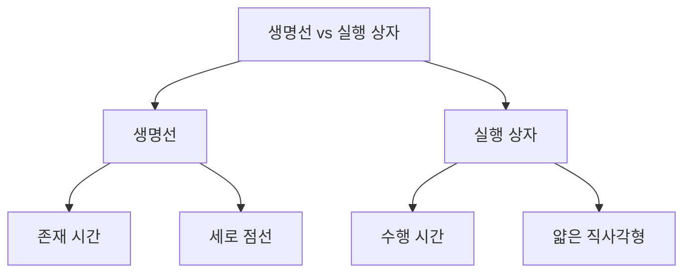

| 구분 | 생명선 | 실행 상자 |
|---|---|---|
| 의미 | 참여자가 존재하는 기간 | 참여자가 작업을 수행하는 기간 |
| 표기 | 세로 점선 | 생명선 위 얇은 직사각형 |
| 범위 | 상호작용 전체 또는 일부 | 메시지 처리 중인 구간 |
| 핵심 단서 | 존재 시간, 객체 수명 | 활성화, 실행, 수행 중 |

- 생명선:
  - 객체가 다이어그램에서 존재하는 전체 시간 흐름이다.
  - 메시지를 주고받는 위치가 생명선 위에 표시된다.

- 실행 상자:
  - 객체가 실제로 작업을 수행하거나 응답을 기다리는 구간이다.
  - 생명선 전체가 항상 실행 중이라는 뜻은 아니다.

- 시험 함정:
  - 생명선을 `객체가 실행 중인 시간`이라고 하면 부정확하다.
  - 실행 상자를 `객체가 존재하는 시간`이라고 하면 부정확하다.

---

## 14. 액터와 객체 비교

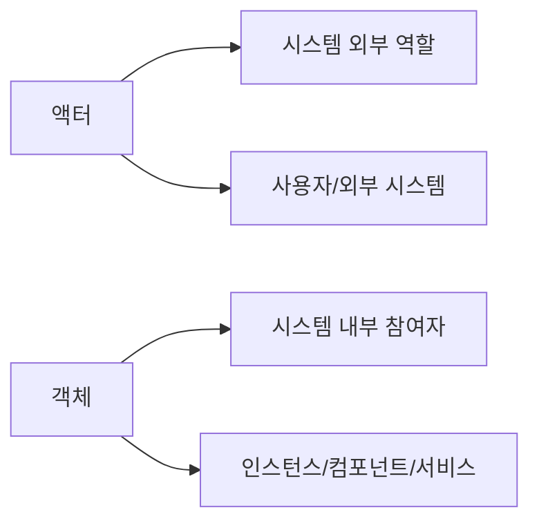

| 구분 | 액터 | 객체 |
|---|---|---|
| 위치 | 시스템 외부 | 주로 시스템 내부 |
| 의미 | 시스템과 상호작용하는 역할 | 메시지를 주고받는 참여 객체 |
| 예 | 고객, 관리자, 외부 결제 시스템 | OrderController, PaymentService |
| 표기 | 사람 모양 또는 actor 참여자 | 사각형 참여자 |

- 액터는 시스템을 사용하는 외부 역할이다.
- 객체는 시스템 내부에서 동작을 수행하는 참여자이다.
- 순차 다이어그램에서는 액터와 객체가 모두 생명선을 가질 수 있다.

- 예:
  - 고객이 주문 요청을 한다.
  - 주문 화면이 주문 API를 호출한다.
  - 주문 API가 결제 서비스를 호출한다.

- 시험 포인트:
  - 액터와 객체 모두 순차 다이어그램의 참여자가 될 수 있다.
  - 액터는 외부 역할, 객체는 내부 상호작용 참여자로 구분한다.

---

## 15. 메시지와 객체 연산의 관계

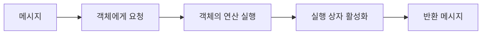

- 순차 다이어그램의 메시지는 객체지향 설계에서 객체의 연산과 연결해서 이해할 수 있다.
- 예:
  - `OrderController -> OrderService: createOrder()`
  - 이 메시지는 `OrderService` 객체의 `createOrder()` 연산 호출로 해석할 수 있다.

- 메시지와 연산의 연결:
  - 메시지 이름은 메서드/연산 이름처럼 작성될 수 있다.
  - 메시지를 받은 객체는 해당 동작을 수행한다.
  - 수행 중인 구간이 실행 상자로 표시될 수 있다.
  - 결과가 있으면 반환 메시지로 표현할 수 있다.

- 시험 포인트:
  - 메시지는 객체 간 상호작용을 표현하는 수단이다.
  - 메시지가 반드시 코드의 실제 메서드와 1:1로 대응해야 하는 것은 아니지만, 설계 관점에서는 메서드 호출로 해석되는 경우가 많다.

---

## 16. 순차 다이어그램과 커뮤니케이션 다이어그램 비교

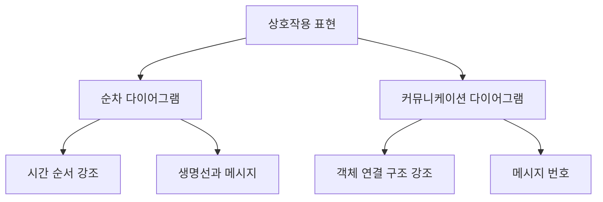

| 구분 | 순차 다이어그램 | 커뮤니케이션 다이어그램 |
|---|---|---|
| 핵심 | 메시지의 시간 순서 | 객체 간 연결 구조 |
| 시간 표현 | 위에서 아래로 | 메시지 번호로 표현 |
| 주요 구성 | 생명선, 실행 상자, 메시지 | 객체, 링크, 번호 메시지 |
| 보기 좋은 것 | 호출 순서, 시나리오 흐름 | 협력 구조, 객체 관계 |

- 둘 다 상호작용 다이어그램이다.
- 둘 다 객체 간 메시지를 표현한다.
- 차이는 강조점이다.

- 구분 공식:
  - `시간 순서가 핵심`이면 순차 다이어그램
  - `객체 연결과 협력 구조가 핵심`이면 커뮤니케이션 다이어그램

- 시험 함정:
  - 커뮤니케이션 다이어그램도 메시지 순서를 표현할 수 있다.
  - 하지만 순차 다이어그램은 세로 시간축으로 순서를 직접 보여준다.

---

## 17. 순차 다이어그램과 활동 다이어그램 비교

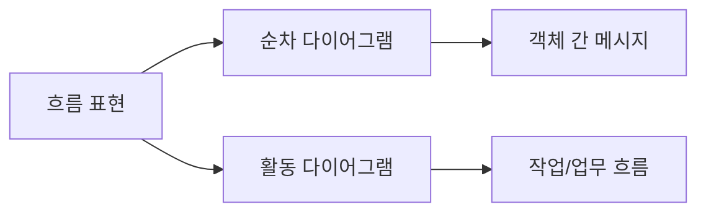

| 구분 | 순차 다이어그램 | 활동 다이어그램 |
|---|---|---|
| 핵심 관점 | 객체 간 메시지 순서 | 작업과 제어 흐름 |
| 중심 요소 | 액터, 객체, 생명선, 메시지 | 활동, 액션, 분기, 병렬 |
| 시간 흐름 | 메시지 교환 순서 | 업무 절차 흐름 |
| 적합한 질문 | 누가 누구를 어떤 순서로 호출하는가? | 어떤 절차로 업무가 진행되는가? |

- 순차 다이어그램:
  - 객체와 객체 사이의 호출 순서를 보여준다.
  - API 호출, 서비스 호출, 응답 흐름을 설명하기 좋다.

- 활동 다이어그램:
  - 업무 절차, 조건 분기, 병렬 작업을 보여준다.
  - 업무 프로세스나 알고리즘 흐름을 설명하기 좋다.

- 시험 포인트:
  - `메시지`, `생명선`, `객체 간 상호작용`이면 순차 다이어그램이다.
  - `활동`, `제어 흐름`, `분기`, `스윔레인`이면 활동 다이어그램이다.

---

## 18. 결합 단편(Combined Fragment) 심화

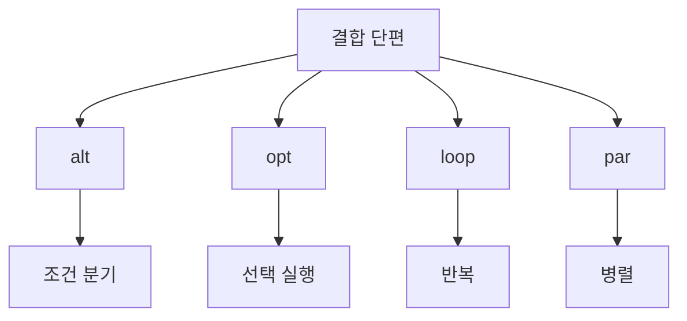

- PDF 019의 최소 구성 요소에는 결합 단편이 직접 나오지 않는다.
- 하지만 UML 순차 다이어그램의 실제 표기에서는 조건, 반복, 병렬 흐름을 표현하기 위해 결합 단편을 사용한다.

- 대표 연산자:
  - `alt`
    - if/else처럼 대안 흐름을 표현한다.
  - `opt`
    - 조건이 맞으면 실행하고 아니면 실행하지 않는 선택 흐름이다.
  - `loop`
    - 반복 흐름을 표현한다.
  - `par`
    - 병렬 흐름을 표현한다.
  - `ref`
    - 다른 상호작용을 참조한다.

- 시험 대비:
  - 정보처리기사 기본 암기에서는 `액-객-생-실-메`가 우선이다.
  - 심화 문제나 UML 해석 문제에서 `alt`, `opt`, `loop`가 나오면 순차 다이어그램의 조건/반복 표현으로 이해한다.

---

## 19. 객체 생성과 소멸

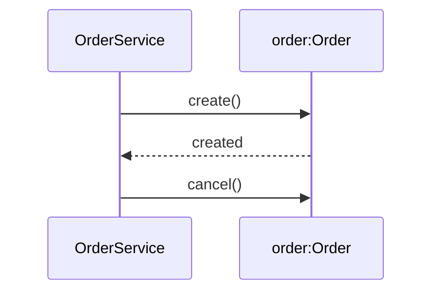

- 순차 다이어그램에서는 객체가 상호작용 중간에 생성되거나 소멸될 수 있다.

- 생성:
  - 생성 메시지가 객체의 머리 부분으로 향한다.
  - 생성된 객체의 생명선은 그 시점부터 시작된다.
  - 예:
    - `create()`
    - `new Order()`

- 소멸:
  - 객체가 더 이상 참여하지 않음을 나타낸다.
  - 생명선 끝에 `X`로 표현하는 경우가 많다.
  - 예:
    - `destroy`
    - `delete`
    - 세션 종료

- 시험 포인트:
  - 생명선은 항상 맨 위에서 시작해야 하는 것이 아니다.
  - 객체가 중간에 생성되면 생명선도 중간부터 시작할 수 있다.
  - 객체가 소멸되면 생명선 끝에 X가 표시될 수 있다.

---

## 20. 예시: 로그인 시나리오

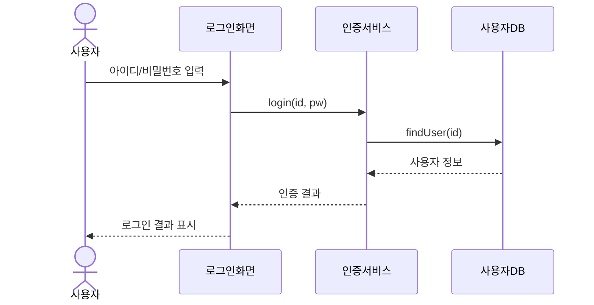

- 구성 요소 분석:
  - 액터:
    - 사용자
  - 객체:
    - 로그인화면
    - 인증서비스
    - 사용자DB
  - 생명선:
    - 각 참여자 아래의 세로 시간선
  - 실행 상자:
    - 로그인 처리, DB 조회, 인증 판단이 수행되는 구간
  - 메시지:
    - `login(id, pw)`
    - `findUser(id)`
    - `사용자 정보`
    - `인증 결과`

- 읽는 순서:
  - 사용자가 로그인 화면에 값을 입력한다.
  - 로그인 화면이 인증서비스에 로그인을 요청한다.
  - 인증서비스가 사용자DB에서 사용자를 조회한다.
  - DB가 사용자 정보를 반환한다.
  - 인증서비스가 인증 결과를 반환한다.
  - 화면이 사용자에게 결과를 표시한다.

- 시험 포인트:
  - 사용자는 액터이다.
  - 로그인화면, 인증서비스, 사용자DB는 객체 또는 참여자이다.
  - 메시지의 순서는 위에서 아래로 읽는다.

---

## 21. 예시: 주문/결제 시나리오

```mermaid
sequenceDiagram
    actor Customer as 고객
    participant UI as 주문화면
    participant Order as 주문서비스
    participant Pay as 결제게이트웨이
    participant Repo as 주문저장소

    Customer->>UI: 주문 요청
    UI->>Order: createOrder(cart)
    Order->>Pay: approve(amount)
    Pay-->>Order: 승인 결과
    Order->>Repo: save(order)
    Repo-->>Order: 저장 완료
    Order-->>UI: 주문 완료
    UI-->>Customer: 완료 안내
```

- 구성 요소 분석:
  - 액터:
    - 고객
  - 객체:
    - 주문화면
    - 주문서비스
    - 결제게이트웨이
    - 주문저장소
  - 메시지:
    - `createOrder(cart)`
    - `approve(amount)`
    - `save(order)`
  - 반환 메시지:
    - 승인 결과
    - 저장 완료
    - 주문 완료

- 해석:
  - 고객이 주문을 요청한다.
  - 주문화면이 주문서비스를 호출한다.
  - 주문서비스가 결제게이트웨이에 결제 승인을 요청한다.
  - 결제 승인 후 주문저장소에 주문을 저장한다.
  - 결과를 화면과 고객에게 반환한다.

- 시험 포인트:
  - 외부 결제 시스템도 순차 다이어그램의 참여자가 될 수 있다.
  - 결제게이트웨이는 유스케이스 관점에서는 부액터, 순차 다이어그램 관점에서는 메시지를 주고받는 참여자이다.

---

## 22. 문제 풀이용 단서어

```mermaid
flowchart TD
    A["단서어"]
    A --> B["외부 사용자/외부 시스템"]
    B --> B1["액터"]
    A --> C["상호작용 참여 인스턴스"]
    C --> C1["객체"]
    A --> D["세로 점선/존재 시간"]
    D --> D1["생명선"]
    A --> E["동작 수행 구간/얇은 직사각형"]
    E --> E1["실행 상자"]
    A --> F["요청/응답/화살표"]
    F --> F1["메시지"]
```

- 액터 단서:
  - 외부 사용자
  - 외부 시스템
  - 시스템과 상호작용하는 역할
  - 유스케이스를 시작하는 주체

- 객체 단서:
  - 상호작용 참여 객체
  - 클래스의 인스턴스
  - 메시지를 송수신하는 내부 구성요소

- 생명선 단서:
  - 세로 점선
  - 존재 시간
  - 객체의 수명
  - 시간 흐름

- 실행 상자 단서:
  - 활성화
  - 실행 중
  - 수행 기간
  - 제어 초점
  - 생명선 위 직사각형

- 메시지 단서:
  - 요청
  - 응답
  - 호출
  - 신호
  - 화살표
  - 객체 간 상호작용

---

## 23. 보기 판별 예시

```mermaid
flowchart LR
    A["보기 문장"]
    A --> B{"핵심 단서"}
    B --> C["외부 역할"]
    B --> D["인스턴스"]
    B --> E["세로 점선"]
    B --> F["얇은 직사각형"]
    B --> G["화살표"]
```

- 보기: `시스템 외부에서 상호작용을 시작하거나 참여하는 사용자 또는 외부 시스템이다.`
  - 정답: `액터`
  - 이유: 외부 역할이 핵심 단서이다.

- 보기: `순차 다이어그램에서 메시지를 주고받는 클래스의 인스턴스이다.`
  - 정답: `객체`
  - 이유: 인스턴스와 메시지 송수신이 핵심 단서이다.

- 보기: `객체가 상호작용 동안 존재함을 나타내는 세로 점선이다.`
  - 정답: `생명선`
  - 이유: 존재 시간과 세로 점선이 핵심 단서이다.

- 보기: `객체가 어떤 동작을 수행하고 있는 기간을 생명선 위의 직사각형으로 나타낸다.`
  - 정답: `실행 상자`
  - 이유: 수행 기간과 직사각형이 핵심 단서이다.

- 보기: `객체에게 어떤 행위를 하도록 지시하는 명령 또는 요구이다.`
  - 정답: `메시지`
  - 이유: 요청, 명령, 요구, 상호작용 수단이 핵심 단서이다.

- 보기: `순차 다이어그램은 객체 간 메시지 흐름을 시간 순서로 표현한다.`
  - 정답: `맞음`
  - 이유: 순차 다이어그램의 핵심 정의이다.

---

## 24. 자주 나오는 함정

```mermaid
flowchart TD
    A["출제 함정"]
    A --> B["생명선과 실행 상자 혼동"]
    A --> C["순차와 활동 혼동"]
    A --> D["순차와 커뮤니케이션 혼동"]
    A --> E["액터는 유스케이스에만 나온다고 착각"]
    A --> F["메시지를 데이터 흐름으로만 해석"]
```

- 함정 1: 생명선과 실행 상자 혼동
  - 생명선은 존재 시간이다.
  - 실행 상자는 동작 수행 시간이다.

- 함정 2: 순차 다이어그램과 활동 다이어그램 혼동
  - 순차 다이어그램은 객체 간 메시지 순서이다.
  - 활동 다이어그램은 업무나 작업 흐름이다.

- 함정 3: 순차 다이어그램과 커뮤니케이션 다이어그램 혼동
  - 순차 다이어그램은 시간 순서를 강조한다.
  - 커뮤니케이션 다이어그램은 객체 연결 구조를 강조한다.

- 함정 4: 액터는 유스케이스 다이어그램에만 등장한다고 생각
  - 액터는 순차 다이어그램에서도 참여자로 표현될 수 있다.
  - 특히 유스케이스 시나리오를 상세화할 때 액터가 왼쪽에 자주 나온다.

- 함정 5: 메시지를 단순 데이터 흐름으로만 해석
  - 메시지는 데이터 전달만이 아니라 호출, 요청, 신호, 응답을 포함한다.
  - 객체에게 행위를 지시하는 상호작용 수단이다.

- 함정 6: 순차 다이어그램이 복잡한 절차 로직을 모두 표현한다고 생각
  - 순차 다이어그램은 메시지 교환 순서에 강하다.
  - 복잡한 분기, 병렬 업무 절차는 활동 다이어그램이 더 적합할 수 있다.

---

## 25. 암기 포인트

```mermaid
flowchart TD
    A["순차 다이어그램 구성 요소 암기"]
    A --> B["액"]
    A --> C["객"]
    A --> D["생"]
    A --> E["실"]
    A --> F["메"]

    B --> B1["액터"]
    C --> C1["객체"]
    D --> D1["생명선"]
    E --> E1["실행 상자"]
    F --> F1["메시지"]
```

- 구성 요소 암기:
  - `액-객-생-실-메`
  - `액터`, `객체`, `생명선`, `실행 상자`, `메시지`

- 의미 암기:
  - `액터`: 외부 참여자
  - `객체`: 내부 참여 객체
  - `생명선`: 존재 시간
  - `실행 상자`: 수행 시간
  - `메시지`: 요청/응답/신호

- 핵심 문장:
  - `순차 다이어그램은 객체들이 시간 순서에 따라 주고받는 메시지를 표현한다.`

- 비교 암기:
  - 생명선 = 존재
  - 실행 상자 = 실행
  - 메시지 = 상호작용
  - 순차 = 시간 순서
  - 커뮤니케이션 = 연결 구조
  - 활동 = 업무 흐름

- 최종 암기 문장:
  - `순차 다이어그램의 구성 요소는 액터·객체·생명선·실행 상자·메시지이며, 위에서 아래로 흐르는 시간 순서에 따라 객체 간 메시지 교환을 표현한다.`

---

## 26. 빠른 복습

```mermaid
flowchart TD
    A["빠른 복습"]
    A --> B["순차 = 시간 순서"]
    B --> C["액터 = 외부 역할"]
    B --> D["객체 = 참여 인스턴스"]
    B --> E["생명선 = 존재 시간"]
    B --> F["실행 상자 = 수행 시간"]
    B --> G["메시지 = 요청/응답"]
```

- 챕터명:
  - `019 순차(Sequence) 다이어그램의 구성 요소`

- 소속 영역:
  - `UML`

- PDF 핵심 키워드:
  - `액터(Actor)`
  - `객체(Object)`
  - `생명선(Lifeline)`
  - `실행 상자(Active Box)`
  - `메시지(Message)`

- 가장 먼저 떠올릴 말:
  - `순차 다이어그램은 객체들이 시간 순서에 따라 주고받는 메시지를 표현한다.`

- 문제 풀이 순서:
  - 먼저 순차 다이어그램인지 확인한다.
  - 위에서 아래로 시간 흐름을 읽는다.
  - 액터와 객체를 구분한다.
  - 생명선과 실행 상자를 구분한다.
  - 메시지의 방향과 종류를 확인한다.

- 자주 나오는 문제 유형:
  - 순차 다이어그램 구성 요소를 고르는 문제
  - 생명선과 실행 상자를 구분하는 문제
  - 메시지의 의미를 묻는 문제
  - 순차 다이어그램과 커뮤니케이션 다이어그램을 구분하는 문제
  - 순차 다이어그램과 활동 다이어그램을 구분하는 문제

---

## 27. 참고 링크

- 기준 PDF: `/Users/nes0903/Documents/study/정보처리기사/핵심요약집_2026_정보처리기사필기핵심요약.pdf`
- [Q-Net 정보처리기사 종목 페이지](https://www.q-net.or.kr/crf005.do?id=crf00503s02&jmCd=1320&jmInfoDivCcd=B0)
- [OMG - Unified Modeling Language Specification](https://www.omg.org/spec/UML/)
- [OMG - What is UML?](https://www.omg.org/uml/what-is-uml.htm)
- [UML-Diagrams - Sequence Diagrams](https://www.uml-diagrams.org/sequence-diagrams.html/sequence-diagrams.html)
- [UML-Diagrams - Sequence Diagrams Reference](https://www.uml-diagrams.org/sequence-diagrams-reference.html)
- [UML-Diagrams - Combined Fragment](https://www.uml-diagrams.org/sequence-diagrams-combined-fragment.html)
- [IBM - Lifelines in UML Diagrams](https://www.ibm.com/docs/en/radfws/10.0.0?topic=diagrams-lifelines-in-uml)
- [IBM - Activations](https://www.ibm.com/docs/en/devops-test-embedded/9.0.0?topic=reports-activations)
- [Microsoft - Create a UML Sequence Diagram](https://support.microsoft.com/en-us/office/create-a-uml-sequence-diagram-c61c371b-b150-4958-b128-902000133b26)
- [Sparx Systems - Sequence Diagram](https://sparxsystems.com/resources/tutorials/uml2/sequence-diagram.html)
