# 020 사용자 인터페이스의 특징

작성 기준일: 2026-05-03  
과목: `1과목 소프트웨어 설계`  
기준 PDF: `/Users/nes0903/Documents/study/정보처리기사/핵심요약집_2026_정보처리기사필기핵심요약.pdf`  
PDF 확인 위치: `3페이지`  
검색 보강: ISO 9241-210, NIST HCD, W3C WAI/WCAG, Nielsen Norman Group 자료를 함께 확인하여 시험 중심으로 확장 정리

---

## 1. 한 줄 요약

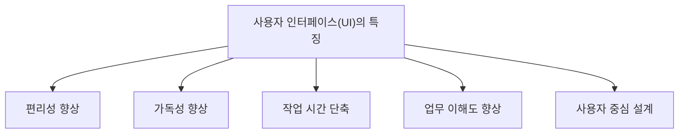

- 사용자 인터페이스는 사용자가 시스템과 상호작용하는 접점이며, 좋은 UI는 사용자가 목적을 쉽고 빠르고 정확하게 달성하도록 돕는다.
- PDF 기준 핵심 특징은 다음 4가지이다.
  - 사용자의 편리성과 가독성을 높여준다.
  - 작업 시간을 단축시킨다.
  - 업무에 대한 이해도를 높여준다.
  - 사용자 중심으로 설계되어 있다.
- 시험에서는 `예쁜 화면`이 아니라 `사용자의 목적 달성`, `업무 효율`, `이해 용이성`, `사용자 중심` 관점으로 판단해야 한다.

---

## 2. PDF 기준 핵심

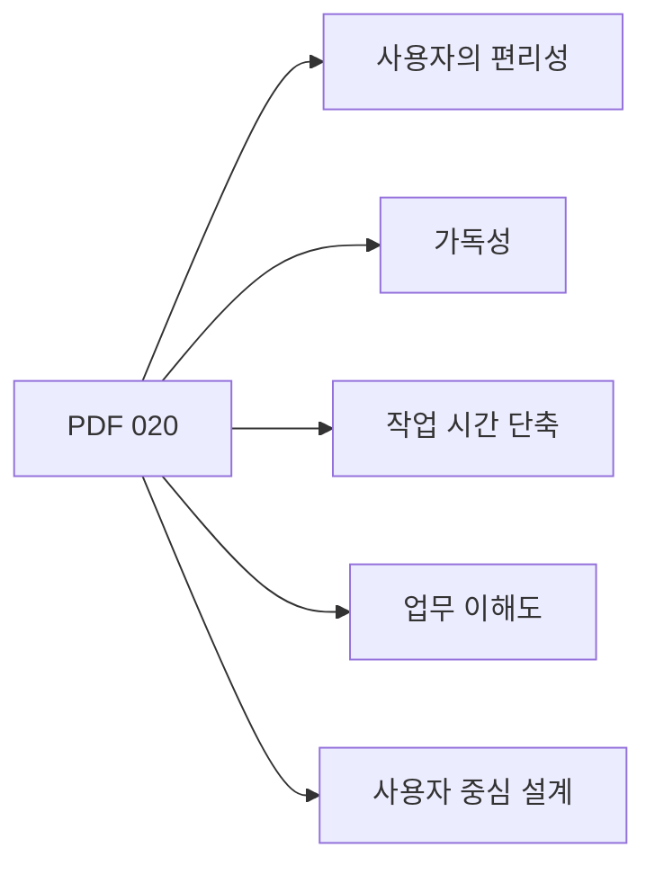

- PDF에서 직접 확인한 내용:
  - `사용자의 편리성과 가독성을 높여준다.`
  - `작업 시간을 단축시킨다.`
  - `업무에 대한 이해도를 높여준다.`
  - `사용자 중심으로 설계되어 있다.`

- 이 챕터의 최소 암기 골격:
  - UI는 사용자의 `편리성`을 높인다.
  - UI는 화면과 정보의 `가독성`을 높인다.
  - UI는 사용자가 일을 끝내는 `작업 시간`을 줄인다.
  - UI는 시스템과 업무에 대한 `이해도`를 높인다.
  - UI는 개발자나 시스템 내부 구조보다 `사용자 중심`으로 설계된다.

- 암기 키워드:
  - `편-가-시-업-사용자중심`
  - 편리성, 가독성, 시간 단축, 업무 이해도, 사용자 중심

---

## 3. 사용자 인터페이스의 위치

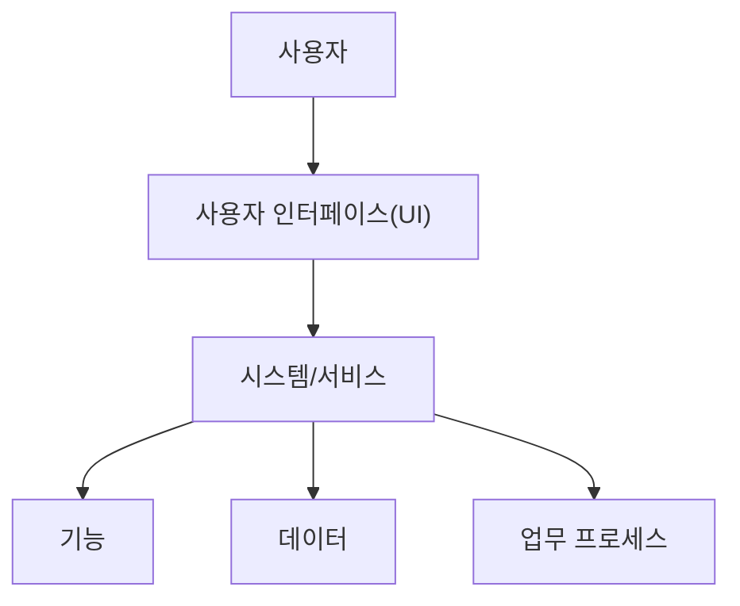

- 사용자 인터페이스는 사용자와 시스템 사이의 접점이다.
- 사용자는 UI를 통해 시스템에 명령을 내리고, 시스템의 결과를 확인한다.
- UI는 사용자의 목표와 시스템 기능을 연결하는 통로이다.

- UI가 포함하는 요소:
  - 화면 배치
  - 메뉴
  - 버튼
  - 입력 폼
  - 아이콘
  - 알림
  - 오류 메시지
  - 검색/필터
  - 키보드 명령
  - 음성/제스처 입력

- UI가 중요한 이유:
  - 사용자는 시스템 내부 구조를 직접 보지 않는다.
  - 사용자는 UI를 통해 시스템의 품질을 체감한다.
  - 기능이 좋아도 UI가 복잡하면 사용성이 낮아진다.
  - UI가 명확하면 사용자는 더 빠르고 정확하게 업무를 수행한다.

---

## 4. 특징 1: 편리성 향상

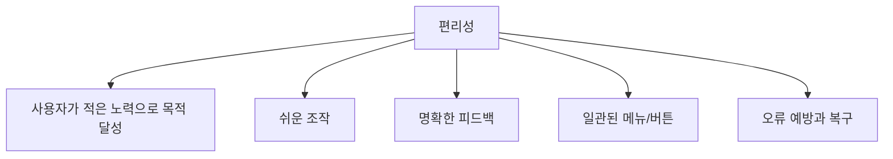

- 편리성은 사용자가 시스템을 사용할 때 느끼는 조작의 쉬움과 부담의 적음을 의미한다.
- 좋은 UI는 사용자가 복잡한 내부 구조를 몰라도 목표를 달성할 수 있게 한다.

- 편리성을 높이는 요소:
  - 자주 쓰는 기능을 쉽게 찾을 수 있다.
  - 버튼과 메뉴의 의미가 명확하다.
  - 입력해야 할 정보가 과도하지 않다.
  - 현재 진행 상태를 알려준다.
  - 실수했을 때 되돌릴 수 있다.
  - 오류 메시지가 이해하기 쉽다.
  - 초보자와 숙련자 모두 사용할 수 있다.

- 예:
  - 자동 완성으로 검색어 입력을 줄인다.
  - 최근 사용 항목을 보여준다.
  - 필수 입력값을 명확히 표시한다.
  - 저장 완료 여부를 알림으로 알려준다.
  - 삭제 전 확인 대화상자를 제공한다.

- 시험 포인트:
  - UI는 사용자의 편리성을 높인다.
  - 편리성은 단순히 기능 수가 많다는 뜻이 아니다.
  - 기능이 많아도 찾기 어렵고 조작이 복잡하면 편리성이 낮다.

---

## 5. 특징 2: 가독성 향상

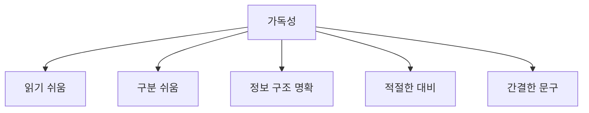

- 가독성은 사용자가 화면의 정보를 쉽게 읽고 이해할 수 있는 정도이다.
- UI에서 가독성은 글자 크기만의 문제가 아니라 정보 배치, 대비, 문장, 아이콘, 여백, 계층 구조까지 포함한다.

- 가독성을 높이는 요소:
  - 제목과 본문이 시각적으로 구분된다.
  - 중요한 정보가 눈에 잘 띈다.
  - 글자 크기와 줄 간격이 적절하다.
  - 색상 대비가 충분하다.
  - 용어가 사용자에게 익숙하다.
  - 긴 설명보다 짧고 명확한 문구를 사용한다.
  - 관련 정보끼리 묶여 있다.

- 예:
  - 오류 메시지를 `오류 코드 500`만 표시하지 않고 원인과 조치 방법을 함께 안내한다.
  - 필수 입력 항목을 명확히 표시한다.
  - 표의 열 제목을 고정해 많은 데이터를 읽기 쉽게 한다.
  - 버튼 문구를 `확인`보다 `주문 완료`처럼 구체적으로 쓴다.

- 시험 포인트:
  - UI는 사용자의 가독성을 높인다.
  - 가독성은 업무 이해도와 연결된다.
  - 가독성이 낮으면 작업 시간이 늘어나고 오류가 증가할 수 있다.

---

## 6. 특징 3: 작업 시간 단축

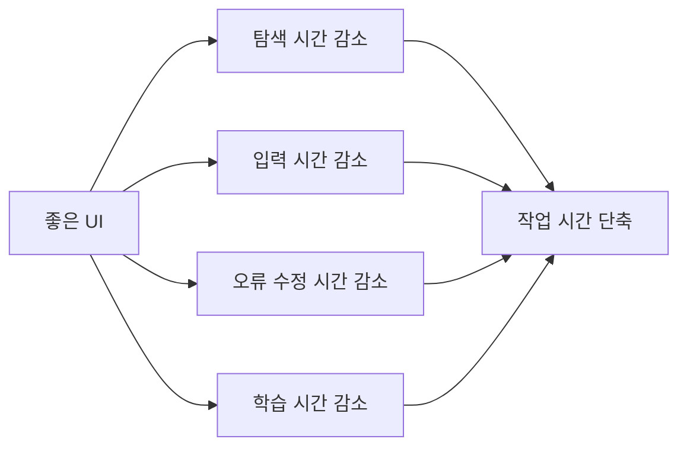

- UI는 사용자가 목표를 달성하는 데 필요한 시간을 줄일 수 있다.
- 작업 시간 단축은 사용성의 `효율성`과 밀접하다.

- 작업 시간을 줄이는 방법:
  - 자주 쓰는 기능을 쉽게 접근하게 한다.
  - 불필요한 입력 단계를 줄인다.
  - 기본값을 적절히 제공한다.
  - 자동 완성, 자동 저장, 추천 검색어를 제공한다.
  - 오류를 사전에 방지한다.
  - 반복 작업을 단축하는 단축키나 일괄 처리 기능을 제공한다.
  - 사용자가 다음에 무엇을 해야 하는지 명확히 알려준다.

- 예:
  - 배송지는 이전 주소를 기본값으로 제공한다.
  - 검색 필터를 저장할 수 있게 한다.
  - 관리자 화면에서 여러 항목을 한 번에 수정할 수 있게 한다.
  - 긴 양식을 단계별로 나누고 진행 상태를 표시한다.

- 시험 포인트:
  - 작업 시간 단축은 UI의 대표적인 특징이다.
  - 단축키나 자동화만 작업 시간 단축이 아니다.
  - 명확한 화면 구조, 오류 예방, 쉬운 탐색도 작업 시간 단축에 기여한다.

---

## 7. 특징 4: 업무 이해도 향상

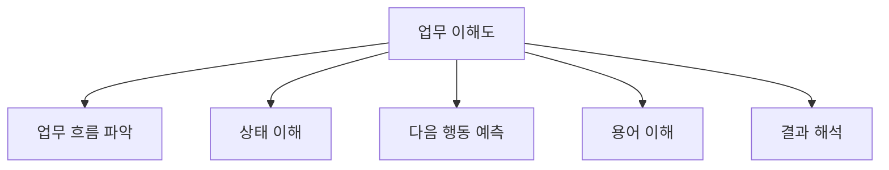

- UI는 사용자가 시스템을 통해 수행하는 업무를 더 잘 이해하게 도와준다.
- 사용자는 UI를 보며 현재 상태, 가능한 행동, 필요한 입력, 결과의 의미를 파악한다.

- 업무 이해도를 높이는 요소:
  - 업무 단계가 순서대로 배치되어 있다.
  - 현재 상태와 진행률이 표시된다.
  - 업무 용어가 사용자에게 익숙하다.
  - 도움말이나 설명이 필요한 위치에 제공된다.
  - 결과 화면이 원인과 결과를 분명하게 보여준다.
  - 오류가 발생했을 때 사용자가 무엇을 해야 하는지 알려준다.

- 예:
  - 주문 상태를 `결제 대기 -> 결제 완료 -> 배송 준비 -> 배송 중 -> 배송 완료`로 표시한다.
  - 승인 업무에서 현재 결재자가 누구인지 보여준다.
  - 데이터 입력 폼에서 예시 값을 보여준다.
  - 복잡한 업무 화면을 탭이나 단계로 나눈다.

- 시험 포인트:
  - UI는 업무 이해도를 높인다.
  - 업무 이해도는 단순한 화면 예쁨이 아니라 사용자가 업무를 정확히 이해하고 수행하는 능력과 관련된다.

---

## 8. 특징 5: 사용자 중심 설계

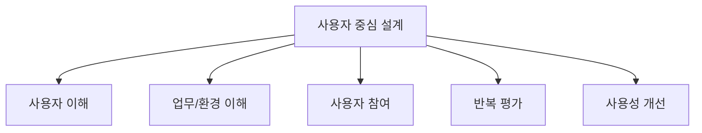

- 사용자 중심 설계는 시스템 내부 구조나 개발자 관점보다 사용자의 목표, 능력, 상황, 제약을 기준으로 설계하는 접근이다.
- ISO 9241-210과 NIST HCD 자료는 인간중심 설계가 사용자의 요구, 작업, 환경을 이해하고 사용성·효율성·만족도 등을 높이는 데 초점을 둔다고 설명한다.

- 사용자 중심 설계의 핵심:
  - 사용자가 누구인지 이해한다.
  - 사용자가 어떤 업무를 수행하는지 이해한다.
  - 사용자가 어떤 환경에서 시스템을 사용하는지 이해한다.
  - 설계와 개발 과정에서 사용자의 피드백을 반영한다.
  - 평가 결과를 바탕으로 반복 개선한다.

- 예:
  - 고령 사용자를 위한 큰 글자와 명확한 버튼
  - 현장 작업자를 위한 장갑 낀 상태에서도 누르기 쉬운 버튼
  - 업무 담당자가 자주 쓰는 기능을 첫 화면에 배치
  - 장애 사용자를 위한 키보드 조작과 스크린 리더 지원

- 시험 포인트:
  - UI는 사용자 중심으로 설계되어야 한다.
  - 사용자 중심은 개발자 편의나 시스템 내부 구조 중심과 반대되는 관점이다.
  - 사용자 중심 설계는 편리성, 가독성, 작업 시간 단축, 업무 이해도 향상과 모두 연결된다.

---

## 9. UI와 사용성(Usability)

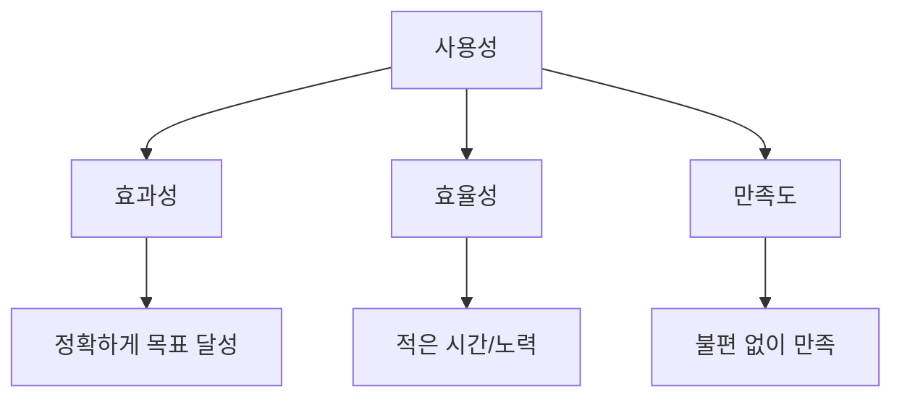

- 사용성은 사용자가 특정 맥락에서 목표를 효과적이고 효율적이며 만족스럽게 달성할 수 있는 정도로 설명된다.
- 정보처리기사의 UI 특징은 사용성 개념과 연결해서 이해하면 쉽다.

| 사용성 관점 | UI 특징과의 연결 |
|---|---|
| `효과성` | 사용자의 목적을 정확히 달성하게 함 |
| `효율성` | 작업 시간을 단축하고 노력 비용을 줄임 |
| `만족도` | 편리하고 예측 가능한 사용 경험 제공 |
| `이해 용이성` | 가독성과 업무 이해도 향상 |

- 예:
  - 효과성:
    - 사용자가 원하는 정보를 정확히 찾는다.
  - 효율성:
    - 몇 번의 클릭 안에 작업을 완료한다.
  - 만족도:
    - 사용자가 불필요한 혼란이나 스트레스 없이 작업한다.

- 시험 포인트:
  - UI 특징을 사용성 관점으로 바꿔 표현해도 같은 의미일 수 있다.
  - `정확성`, `효율`, `만족`, `이해`가 나오면 UI의 좋은 특징으로 볼 수 있다.

---

## 10. UI와 접근성(Accessibility)

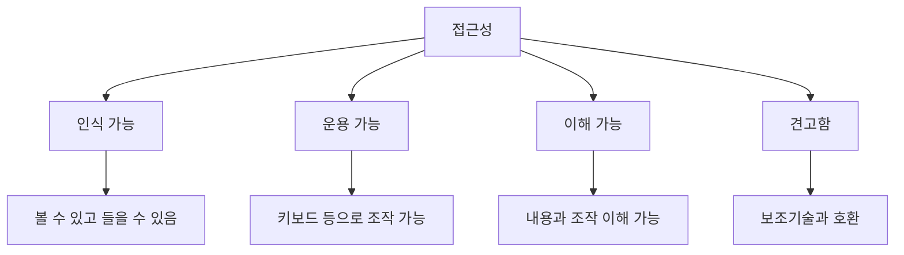

- 접근성은 장애, 환경, 기기 제약이 있어도 사용자가 시스템을 이용할 수 있게 하는 성질이다.
- W3C 접근성 원칙은 대체로 다음 4가지로 정리된다.
  - `인식 가능(Perceivable)`
  - `운용 가능(Operable)`
  - `이해 가능(Understandable)`
  - `견고함(Robust)`

- UI 특징과 접근성의 연결:
  - 가독성:
    - 충분한 대비, 적절한 글자 크기, 명확한 텍스트
  - 편리성:
    - 키보드 조작, 명확한 포커스, 쉬운 내비게이션
  - 업무 이해도:
    - 예측 가능한 화면 동작, 쉬운 문장, 오류 안내
  - 사용자 중심:
    - 다양한 사용자와 환경을 고려한 설계

- 예:
  - 이미지 버튼에 대체 텍스트 제공
  - 키보드만으로도 모든 기능 사용 가능
  - 색상만으로 상태를 구분하지 않음
  - 오류가 난 입력 항목과 수정 방법을 함께 안내

- 시험 포인트:
  - 접근성은 UI의 하위 품질 또는 관련 품질로 볼 수 있다.
  - 접근성은 장애인만을 위한 것이 아니라 다양한 환경의 모든 사용자에게 도움이 된다.

---

## 11. UI, UX, 사용성, 접근성 비교

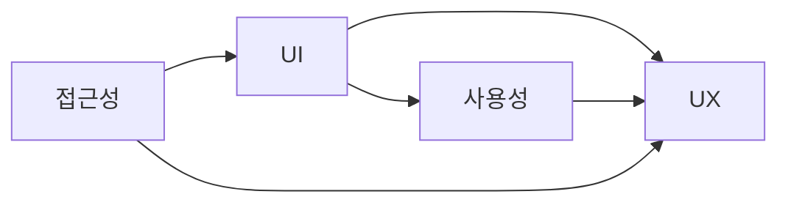

| 구분 | 핵심 의미 | 시험 단서 |
|---|---|---|
| `UI` | 사용자와 시스템의 상호작용 접점 | 화면, 메뉴, 버튼, 입력, 출력 |
| `UX` | 사용자가 제품/서비스를 사용하며 느끼는 전체 경험 | 감정, 만족, 전체 경험 |
| `사용성` | 효과적·효율적·만족스럽게 목표를 달성하는 정도 | 쉽다, 빠르다, 정확하다 |
| `접근성` | 다양한 사용자와 환경에서도 사용할 수 있는 정도 | 장애, 보조기술, 키보드, 대체 텍스트 |

- UI는 UX의 일부로 볼 수 있다.
- 좋은 UI는 좋은 UX에 기여하지만, UX는 UI보다 넓은 개념이다.
- 사용성은 UI가 얼마나 잘 쓸 수 있게 만들어졌는지 보는 기준이다.
- 접근성은 모든 사용자가 접근하고 조작할 수 있는지를 보는 기준이다.

- 시험 포인트:
  - UI = 접점
  - UX = 전체 경험
  - 사용성 = 쉽고 빠르고 정확하게 사용
  - 접근성 = 제약이 있어도 사용 가능

---

## 12. 좋은 UI의 대표 원칙

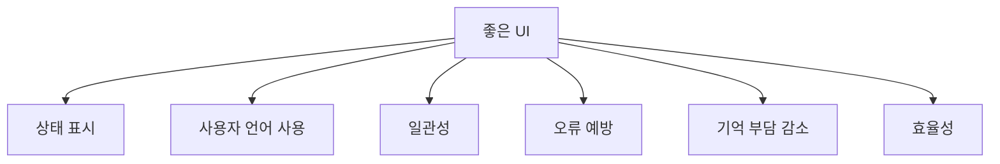

- 검색 자료와 사용성 휴리스틱을 시험 관점으로 재구성하면 좋은 UI는 다음 성질을 가진다.

- 상태 표시:
  - 시스템이 무엇을 하고 있는지 알려준다.
  - 예: 로딩, 저장 완료, 진행률

- 사용자 언어 사용:
  - 개발자 용어보다 사용자가 이해하는 업무 용어를 사용한다.
  - 예: `DB Commit Error`보다 `저장하지 못했습니다`

- 일관성:
  - 같은 기능은 같은 위치, 같은 모양, 같은 용어로 제공한다.
  - 사용자가 매번 새로 배우지 않아도 된다.

- 오류 예방:
  - 사용자가 실수하기 전에 막아준다.
  - 예: 삭제 전 확인, 입력 형식 안내

- 기억 부담 감소:
  - 사용자가 이전 화면의 정보를 외우지 않아도 되게 한다.
  - 예: 선택한 필터 표시, 장바구니 요약

- 효율성:
  - 반복 작업을 줄이고 빠르게 작업하게 한다.
  - 예: 단축키, 자동완성, 기본값

- 시험 포인트:
  - 좋은 UI는 단순히 기능이 많은 UI가 아니다.
  - 좋은 UI는 사용자의 인지 부담과 작업 부담을 줄인다.

---

## 13. 편리성과 가독성 비교

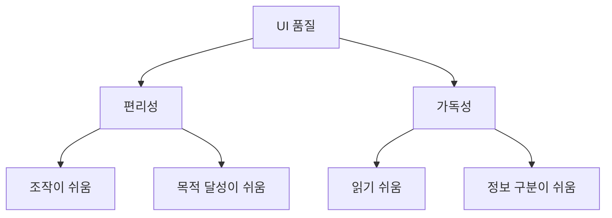

| 구분 | 편리성 | 가독성 |
|---|---|---|
| 핵심 | 조작과 사용이 쉬움 | 정보가 읽기 쉬움 |
| 주요 대상 | 메뉴, 버튼, 입력, 흐름 | 글자, 배치, 대비, 문구 |
| 효과 | 사용 부담 감소 | 이해 부담 감소 |
| 예 | 자동완성, 되돌리기, 기본값 | 큰 글자, 명확한 제목, 충분한 대비 |

- 편리성은 사용자가 기능을 수행하는 과정의 쉬움과 관련된다.
- 가독성은 사용자가 정보를 읽고 이해하는 과정의 쉬움과 관련된다.
- 둘은 함께 작동한다.
  - 가독성이 좋아야 편리성도 높아진다.
  - 편리한 기능도 문구와 배치가 읽기 어려우면 사용하기 어렵다.

- 시험 포인트:
  - 편리성은 `조작의 쉬움`
  - 가독성은 `정보 이해의 쉬움`

---

## 14. 작업 시간 단축과 업무 이해도 비교

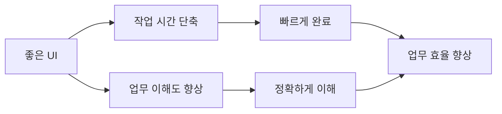

| 구분 | 작업 시간 단축 | 업무 이해도 향상 |
|---|---|---|
| 핵심 | 더 빠르게 수행 | 더 정확히 이해 |
| 주요 수단 | 단계 축소, 자동화, 단축키, 기본값 | 명확한 상태, 용어, 도움말, 흐름 |
| 효과 | 효율성 향상 | 오류 감소와 정확성 향상 |
| 예 | 일괄 처리 기능 | 주문 상태 단계 표시 |

- 작업 시간이 짧아지는 것은 UI의 효율성과 관련된다.
- 업무 이해도가 높아지는 것은 사용자의 인지적 이해와 관련된다.
- 둘은 서로 영향을 준다.
  - 업무를 이해하기 쉬우면 작업이 빨라진다.
  - 작업 흐름이 짧고 명확하면 업무 이해도도 높아진다.

- 시험 포인트:
  - `작업 시간 단축`은 UI 특징으로 맞는 설명이다.
  - `업무 이해도 향상`도 UI 특징으로 맞는 설명이다.
  - 단순히 화면을 화려하게 하는 것은 핵심 특징이 아니다.

---

## 15. 사용자 중심 설계와 개발자 중심 설계 비교

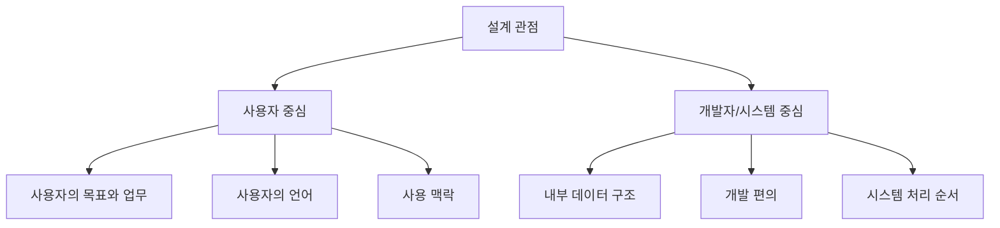

| 구분 | 사용자 중심 설계 | 개발자/시스템 중심 설계 |
|---|---|---|
| 기준 | 사용자 목표, 업무, 맥락 | 내부 구조, 구현 편의 |
| 용어 | 사용자가 아는 업무 용어 | 개발자/시스템 용어 |
| 화면 흐름 | 사용자의 업무 순서 | 시스템 처리 순서 |
| 평가 기준 | 사용자가 쉽게 목적을 달성하는가 | 기능이 구현되었는가 |

- 사용자 중심 설계:
  - 사용자가 해야 할 일을 기준으로 화면을 만든다.
  - 사용자의 언어와 업무 흐름을 반영한다.
  - 실제 사용자의 피드백을 반영한다.

- 개발자/시스템 중심 설계:
  - DB 구조나 내부 메뉴 구조가 그대로 화면에 노출된다.
  - 사용자가 시스템 내부 용어를 배워야 한다.
  - 기능은 있지만 찾기 어렵고 이해하기 어렵다.

- 시험 포인트:
  - UI는 사용자 중심으로 설계되어 있다.
  - 사용자 중심은 사용자의 편리성, 가독성, 이해도, 작업 효율을 높이는 방향이다.

---

## 16. 사용자 인터페이스와 인지 부담

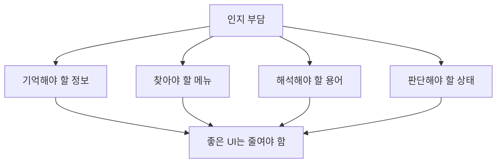

- 인지 부담은 사용자가 시스템을 사용하기 위해 머릿속으로 처리해야 하는 정보와 판단의 부담이다.
- 좋은 UI는 사용자가 기억하고 추측하고 해석해야 하는 양을 줄인다.

- 인지 부담을 낮추는 방법:
  - 필요한 정보를 화면에 보여준다.
  - 이전 선택값을 유지한다.
  - 버튼 이름을 행동 중심으로 작성한다.
  - 오류 메시지를 쉬운 말로 쓴다.
  - 메뉴 구조를 업무 기준으로 정리한다.
  - 진행 상태와 다음 단계를 표시한다.

- 예:
  - `다음`보다 `배송지 입력으로 이동`이 더 명확할 수 있다.
  - `ERR_AUTH_401`보다 `로그인이 만료되었습니다. 다시 로그인해 주세요.`가 더 이해하기 쉽다.
  - 주문 요약을 결제 화면에 함께 보여주면 사용자가 이전 화면을 기억하지 않아도 된다.

- 시험 포인트:
  - UI는 사용자가 쉽게 이해하고 사용할 수 있도록 인지 부담을 줄인다.
  - 가독성과 업무 이해도는 인지 부담 감소와 연결된다.

---

## 17. UI 특징과 비기능 요구사항 연결

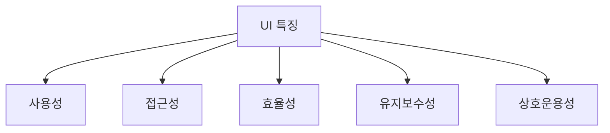

- UI 특징은 비기능 요구사항과도 연결된다.

| UI 특징 | 연결되는 품질/비기능 요구사항 |
|---|---|
| 편리성 | 사용성, 만족도 |
| 가독성 | 사용성, 접근성 |
| 작업 시간 단축 | 효율성, 생산성 |
| 업무 이해도 향상 | 정확성, 사용성 |
| 사용자 중심 설계 | 사용성, 접근성, 만족도 |

- 예:
  - 화면 응답이 느리면 편리성이 떨어진다.
  - 색상 대비가 낮으면 가독성과 접근성이 떨어진다.
  - 오류 메시지가 불명확하면 업무 이해도와 작업 효율이 떨어진다.

- 시험 포인트:
  - UI 특징은 기능 요구사항보다 비기능 품질과 더 밀접하다.
  - 하지만 UI는 시스템 기능을 사용자가 실제로 사용할 수 있게 만드는 접점이므로 기능 활용에도 직접 영향을 준다.

---

## 18. 예시: 나쁜 UI와 좋은 UI

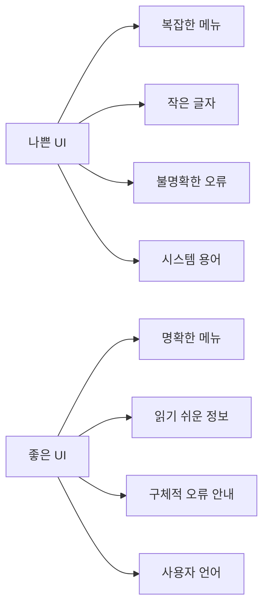

- 나쁜 UI 예:
  - 버튼명이 `처리`처럼 모호하다.
  - 오류 메시지가 `ERROR 1004`만 보여준다.
  - 필수 입력값을 제출 후에만 알려준다.
  - 비슷한 기능이 여러 메뉴에 흩어져 있다.
  - 글자와 배경 대비가 낮다.
  - 사용자가 다음 단계를 추측해야 한다.

- 좋은 UI 예:
  - 버튼명이 `주문 완료`, `임시 저장`, `결제 취소`처럼 명확하다.
  - 오류 메시지가 원인과 해결 방법을 알려준다.
  - 필수 입력값과 형식을 미리 알려준다.
  - 자주 쓰는 기능이 눈에 잘 보인다.
  - 현재 진행 단계와 완료 상태를 표시한다.
  - 사용자의 업무 용어를 사용한다.

- 시험 포인트:
  - UI는 화려함보다 사용자의 목적 달성과 업무 효율이 중요하다.
  - 보기에서 `복잡성 증가`, `작업 시간 증가`, `사용자 혼란 증가`가 나오면 좋은 UI 특징이 아니다.

---

## 19. 인접 챕터와의 연결

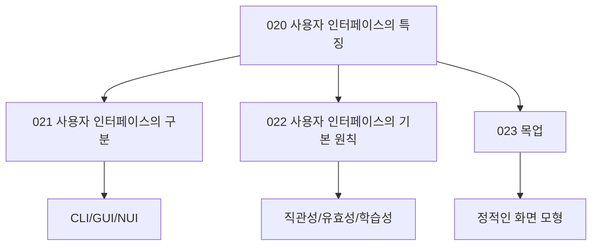

- 020 챕터:
  - UI가 왜 필요한지, 어떤 특징을 가져야 하는지 설명한다.

- 021 챕터:
  - UI의 종류를 CLI, GUI, NUI 등으로 구분한다.

- 022 챕터:
  - UI 기본 원칙인 직관성, 유효성, 학습성 등을 다룬다.

- 023 챕터:
  - 실제 구현 전 화면을 검토하는 목업을 다룬다.

- 연결해서 이해:
  - UI 특징은 `편리성`, `가독성`, `작업 시간 단축`, `업무 이해도`, `사용자 중심`이다.
  - UI 기본 원칙은 이런 특징을 달성하기 위한 설계 기준이다.
  - 목업은 UI를 미리 시각화해 사용성과 이해도를 검토하는 산출물이다.

---

## 20. 시험에서 헷갈리는 비교

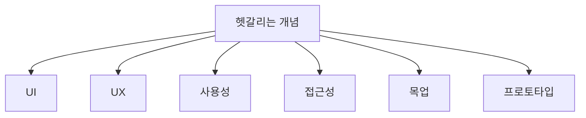

| 구분 | 핵심 |
|---|---|
| `UI` | 사용자와 시스템이 만나는 접점 |
| `UX` | 사용자가 제품/서비스를 사용하며 겪는 전체 경험 |
| `사용성` | 쉽고 빠르고 만족스럽게 사용할 수 있는 정도 |
| `접근성` | 다양한 사용자와 환경에서도 사용할 수 있는 정도 |
| `목업` | 실제 화면과 유사한 정적 모형 |
| `프로토타입` | 동작이나 흐름까지 검증할 수 있는 시제품 |

- UI와 UX:
  - UI는 접점이다.
  - UX는 전체 경험이다.

- UI와 목업:
  - UI는 실제 사용자 접점이다.
  - 목업은 UI를 구현 전에 시각적으로 검토하는 정적 모형이다.

- 사용성과 접근성:
  - 사용성은 사용하기 쉬운 정도이다.
  - 접근성은 제약이 있어도 사용할 수 있는 정도이다.
  - 접근성이 좋아지면 사용성도 함께 좋아지는 경우가 많다.

- 시험 포인트:
  - UI 특징을 묻는 문제에 UX, 목업, 프로토타입 설명을 섞을 수 있다.
  - 핵심 단서가 `사용자와 시스템의 접점`이면 UI이다.

---

## 21. 보기 판별 예시

```mermaid
flowchart LR
    A["보기 문장"]
    A --> B{"핵심 단서"}
    B --> C["편리성/가독성"]
    B --> D["시간 단축"]
    B --> E["업무 이해도"]
    B --> F["사용자 중심"]
    C --> G["UI 특징"]
    D --> G
    E --> G
    F --> G
```

- 보기: `사용자의 편리성과 가독성을 높여준다.`
  - 정답: `사용자 인터페이스의 특징`
  - 이유: PDF 핵심 문장이다.

- 보기: `작업 시간을 단축시킨다.`
  - 정답: `사용자 인터페이스의 특징`
  - 이유: UI는 효율적인 작업 수행을 돕는다.

- 보기: `업무에 대한 이해도를 높여준다.`
  - 정답: `사용자 인터페이스의 특징`
  - 이유: 명확한 UI는 업무 흐름과 상태 이해를 돕는다.

- 보기: `사용자 중심으로 설계되어 있다.`
  - 정답: `사용자 인터페이스의 특징`
  - 이유: UI는 사용자의 목표와 맥락을 기준으로 설계되어야 한다.

- 보기: `시스템 내부 데이터 구조를 그대로 노출하는 것이 좋다.`
  - 정답: `틀림`
  - 이유: UI는 사용자 중심으로 설계되어야 하며 내부 구조 중심이면 사용성이 낮아질 수 있다.

- 보기: `화려한 디자인이 많을수록 좋은 UI이다.`
  - 정답: `틀림`
  - 이유: 좋은 UI는 목적 달성, 효율성, 가독성, 이해 용이성이 핵심이다.

---

## 22. 자주 나오는 함정

```mermaid
flowchart TD
    A["출제 함정"]
    A --> B["UI를 예쁜 화면으로만 이해"]
    A --> C["사용자 중심과 개발자 중심 혼동"]
    A --> D["가독성과 접근성 분리"]
    A --> E["기능 수가 많으면 좋은 UI라고 판단"]
    A --> F["UI와 UX 완전 동일시"]
```

- 함정 1: UI를 예쁜 화면으로만 이해
  - UI는 시각적 디자인을 포함하지만, 핵심은 사용자와 시스템의 상호작용이다.
  - 사용자의 목적 달성, 편리성, 이해도, 작업 시간 단축이 더 중요하다.

- 함정 2: 사용자 중심과 개발자 중심 혼동
  - UI는 사용자 중심으로 설계되어야 한다.
  - 내부 DB 구조나 개발자 용어를 그대로 노출하면 좋지 않은 UI가 될 수 있다.

- 함정 3: 가독성과 접근성을 분리해서만 이해
  - 가독성은 접근성과도 연결된다.
  - 읽기 어려운 화면은 접근성도 낮을 가능성이 높다.

- 함정 4: 기능이 많을수록 좋은 UI라고 판단
  - 기능이 많아도 찾기 어렵고 이해하기 어려우면 좋지 않다.
  - 좋은 UI는 필요한 기능을 필요한 순간에 명확히 제공한다.

- 함정 5: UI와 UX를 완전히 동일한 개념으로 이해
  - UI는 접점이다.
  - UX는 사용자가 경험하는 전체 과정이다.

- 함정 6: 작업 시간 단축을 단순 성능 문제로만 이해
  - 성능도 중요하지만, UI 구조와 흐름이 복잡하면 사용자의 작업 시간은 늘어난다.

---

## 23. 암기 포인트

```mermaid
flowchart TD
    A["UI 특징 암기"]
    A --> B["편"]
    A --> C["가"]
    A --> D["시"]
    A --> E["업"]
    A --> F["사용자"]

    B --> B1["편리성"]
    C --> C1["가독성"]
    D --> D1["작업 시간 단축"]
    E --> E1["업무 이해도"]
    F --> F1["사용자 중심"]
```

- 핵심 암기:
  - `편-가-시-업-사용자중심`
  - 편리성
  - 가독성
  - 작업 시간 단축
  - 업무 이해도 향상
  - 사용자 중심 설계

- 의미 암기:
  - 편리성:
    - 사용하기 쉬움
  - 가독성:
    - 읽고 이해하기 쉬움
  - 작업 시간 단축:
    - 빠르게 업무 완료
  - 업무 이해도:
    - 상태, 흐름, 결과를 쉽게 이해
  - 사용자 중심:
    - 사용자의 목표와 맥락 기준으로 설계

- 비교 암기:
  - UI = 접점
  - UX = 전체 경험
  - 사용성 = 쉽고 빠르게 목적 달성
  - 접근성 = 제약이 있어도 사용 가능

- 최종 암기 문장:
  - `사용자 인터페이스는 사용자의 편리성과 가독성을 높이고, 작업 시간을 단축시키며, 업무 이해도를 향상시키는 사용자 중심의 시스템 접점이다.`

---

## 24. 빠른 복습

```mermaid
flowchart TD
    A["빠른 복습"]
    A --> B["UI = 사용자와 시스템의 접점"]
    B --> C["편리성"]
    B --> D["가독성"]
    B --> E["작업 시간 단축"]
    B --> F["업무 이해도"]
    B --> G["사용자 중심"]
```

- 챕터명:
  - `020 사용자 인터페이스의 특징`

- 소속 영역:
  - `UI`

- PDF 핵심 키워드:
  - `사용자의 편리성과 가독성`
  - `작업 시간 단축`
  - `업무 이해도`
  - `사용자 중심`

- 가장 먼저 떠올릴 말:
  - `UI는 사용자가 시스템을 쉽고 빠르고 정확하게 사용할 수 있게 하는 사용자 중심 접점이다.`

- 문제 풀이 순서:
  - 지문이 사용자와 시스템의 접점을 말하는지 확인한다.
  - 편리성, 가독성, 작업 시간, 업무 이해도, 사용자 중심 단서를 찾는다.
  - UI/UX/사용성/접근성/목업/프로토타입을 구분한다.
  - `화려함`, `내부 구조 중심`, `복잡성 증가` 같은 보기는 의심한다.

- 자주 나오는 문제 유형:
  - UI 특징으로 옳은 것을 고르는 문제
  - UI 특징이 아닌 것을 고르는 문제
  - UI와 UX를 구분하는 문제
  - UI 기본 원칙과 연결하는 문제
  - 목업/프로토타입과 섞어 구분하는 문제

---

## 25. 참고 링크

- 기준 PDF: `/Users/nes0903/Documents/study/정보처리기사/핵심요약집_2026_정보처리기사필기핵심요약.pdf`
- [Q-Net 정보처리기사 종목 페이지](https://www.q-net.or.kr/crf005.do?id=crf00503s02&jmCd=1320&jmInfoDivCcd=B0)
- [ISO 9241-210:2019 - Human-centred design for interactive systems](https://www.iso.org/standard/77520.html)
- [NIST - Human Centered Design](https://www.nist.gov/itl/iad/visualization-and-usability-group/human-factors-human-centered-design)
- [W3C WAI - Accessibility Principles](https://www.w3.org/WAI/fundamentals/accessibility-principles/)
- [W3C - Web Content Accessibility Guidelines 2.2](https://www.w3.org/TR/WCAG22/)
- [W3C - Introduction to Understanding WCAG 2.2](https://w3c.github.io/wcag/understanding/intro)
- [Nielsen Norman Group - 10 Usability Heuristics Summary PDF](https://media.nngroup.com/media/articles/attachments/Heuristic_Summary1_Letter-compressed.pdf)
- [Nielsen Norman Group - 10 Usability Heuristics](https://www.nngroup.com/articles/ten-usability-heuristics/)

<!-- study-links:start -->
## 관련 문서

- `목업`: [[정보처리기사/1과목 소프트웨어 설계/023 목업/023 목업|023 목업]]
<!-- study-links:end -->
