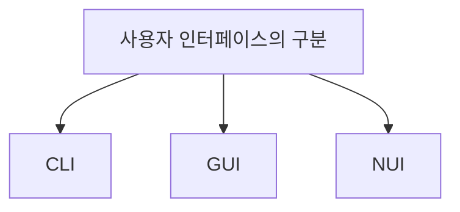

# 021 사용자 인터페이스의 구분

작성 기준일: 2026-05-02  
과목: `1과목 소프트웨어 설계`  
기준 PDF: `/Users/nes0903/Documents/study/정보처리기사/핵심요약집_2026_정보처리기사필기핵심요약.pdf`  
PDF 확인 위치: `3페이지`  
검색 보강: 공식/표준/고품질 참고 자료를 함께 확인하여 시험 중심으로 확장 정리

---

## 1. 한 줄 요약

- 사용자 인터페이스는 명령어 기반 CLI, 그래픽 기반 GUI, 말과 행동 같은 자연스러운 입력 기반 NUI로 구분된다.
- 이 챕터는 `UI` 영역에 속한다.
- 시험에서는 정의, 핵심 키워드, 비슷한 개념과의 구분을 함께 묻는 경우가 많다.

---

## 2. PDF 기준 핵심

- CLI: 명령과 출력이 텍스트 형태로 이루어지는 인터페이스
- GUI: 아이콘이나 메뉴를 마우스로 선택하여 작업을 수행하는 그래픽 환경 인터페이스
- NUI: 사용자의 말이나 행동으로 기기를 조작하는 인터페이스

- 위 항목은 PDF에서 직접 확인한 최소 암기 골격이다.
- 세부 설명은 이 골격을 기준으로 확장해서 이해하면 된다.

---

## 3. 개념 설명

- CLI는 키보드로 명령을 입력하고 텍스트 출력을 받는 방식이다.
- GUI는 창, 아이콘, 버튼, 메뉴 같은 그래픽 요소를 이용한다.
- NUI는 음성, 터치, 제스처, 시선 등 자연스러운 입력을 활용한다.
- 각 방식은 장단점이 다르며 사용 환경에 따라 적합성이 달라진다.

- UI 문제는 사용자 관점에서 편리성, 직관성, 가독성, 학습성, 목적 달성 여부를 보는 것이 핵심이다.
- 시험에서는 CLI/GUI/NUI, 직관성/유효성/학습성, 목업/프로토타입 차이를 자주 섞는다.

---

## 4. 핵심 포인트

- CLI, GUI, NUI의 영문 풀네임과 특징을 매칭해야 한다.
- 텍스트 명령은 CLI, 아이콘/메뉴는 GUI, 말/행동은 NUI다.
- NUI는 자연 사용자 인터페이스라는 이름 그대로 자연스러운 입력을 뜻한다.

- 문제를 풀 때는 먼저 지문 속 단서어를 찾고, 그 단서어가 어떤 개념을 가리키는지 연결한다.
- 정의형 문제는 표현이 조금 바뀌어도 핵심 의미가 같으면 같은 개념으로 판단한다.
- 옳고 그름 문제에서는 `항상`, `반드시`, `전혀`, `모두` 같은 극단 표현을 특히 조심한다.

---

## 5. 시험에서 헷갈리는 비교

| 구분 | 핵심 |
|---|---|
| `CLI` | Command Line Interface, 텍스트 명령 |
| `GUI` | Graphical User Interface, 그래픽 요소 |
| `NUI` | Natural User Interface, 말/행동/터치/제스처 |

- 비교 문제는 이름보다 `역할`, `목적`, `사용 시점`, `장점/단점`을 기준으로 구분하면 안정적이다.
- 같은 단어가 다른 챕터에서도 나오면 이 챕터의 문맥에서 어떤 의미로 쓰였는지 확인해야 한다.

---

## 6. 예시 또는 암기 포인트

- CLI = Command, GUI = Graphic, NUI = Natural.

- 암기는 단어만 외우기보다 `정의 -> 특징 -> 예시 -> 반대 개념` 순서로 묶는 것이 좋다.
- 시험 직전에는 이 섹션의 키워드만 빠르게 반복해도 충분히 효과가 있다.

---

## 7. 빠른 복습

- 챕터명: `021 사용자 인터페이스의 구분`
- 소속 영역: `UI`
- PDF 핵심 키워드: `CLI`, `GUI`, `NUI`
- 가장 먼저 떠올릴 말: `사용자 인터페이스는 명령어 기반 CLI, 그래픽 기반 GUI, 말과 행동 같은 자연스러운 입력 기반 NUI로 구분된다`
- 자주 나오는 문제 유형:
  - 정의를 주고 개념명을 고르는 문제
  - 특징을 섞어 놓고 옳은/틀린 설명을 고르는 문제
  - 유사 개념과 비교하여 다른 하나를 찾는 문제

---

## 8. 참고 링크

- 기준 PDF: `/Users/nes0903/Documents/study/정보처리기사/핵심요약집_2026_정보처리기사필기핵심요약.pdf`
- [Q-Net 정보처리기사 종목 페이지](https://www.q-net.or.kr/crf005.do?id=crf00503s02&jmCd=1320&jmInfoDivCcd=B0)
- [W3C WAI - Accessibility Principles](https://www.w3.org/WAI/fundamentals/accessibility-principles/)
