# 021 사용자 인터페이스의 구분

작성 기준일: 2026-05-03  
과목: `1과목 소프트웨어 설계`  
기준 PDF: `/Users/nes0903/Documents/study/정보처리기사/핵심요약집_2026_정보처리기사필기핵심요약.pdf`  
PDF 확인 위치: `3페이지`  
검색 보강: CLI/GUI/NUI 설명 자료, W3C 접근성 자료, UI/UX 참고 자료를 함께 확인하여 시험 중심으로 확장 정리

---

## 1. 한 줄 요약

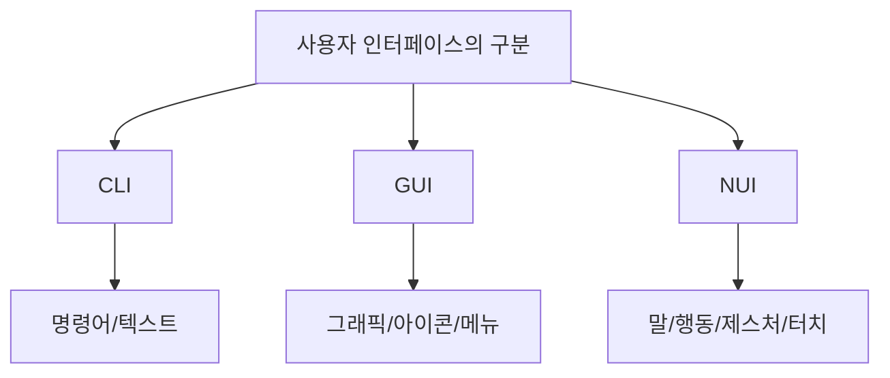

- 사용자 인터페이스는 사용자가 시스템을 조작하는 방식에 따라 `CLI`, `GUI`, `NUI`로 구분할 수 있다.
- PDF 기준 핵심은 다음 3가지이다.
  - `CLI`: 명령과 출력이 텍스트 형태로 이루어지는 인터페이스
  - `GUI`: 아이콘이나 메뉴를 마우스로 선택하여 작업을 수행하는 그래픽 환경의 인터페이스
  - `NUI`: 사용자의 말이나 행동으로 기기를 조작하는 인터페이스
- 시험에서는 `텍스트 명령 = CLI`, `아이콘/메뉴/마우스 = GUI`, `말/행동/터치/제스처 = NUI`로 빠르게 판별한다.

---

## 2. PDF 기준 핵심

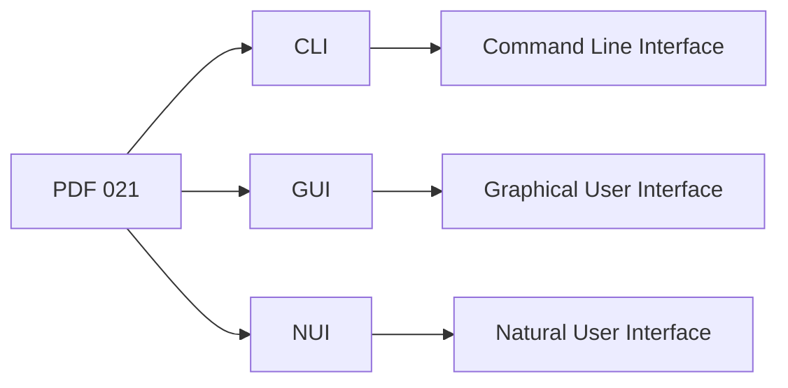

- PDF에서 직접 확인한 내용:
  - `CLI(Command Line Interface)`: 명령과 출력이 텍스트 형태로 이뤄지는 인터페이스
  - `GUI(Graphical User Interface)`: 아이콘이나 메뉴를 마우스로 선택하여 작업을 수행하는 그래픽 환경의 인터페이스
  - `NUI(Natural User Interface)`: 사용자의 말이나 행동으로 기기를 조작하는 인터페이스

- 이 챕터의 최소 암기 골격:
  - CLI = `Command` = 명령어
  - GUI = `Graphical` = 그래픽
  - NUI = `Natural` = 자연스러운 말/행동

- 시험 단서:
  - 명령어, 콘솔, 텍스트 입력, 셸 = CLI
  - 아이콘, 메뉴, 창, 버튼, 마우스 = GUI
  - 음성, 제스처, 터치, 시선, 생체 인식 = NUI

---

## 3. 사용자 인터페이스 구분의 기준

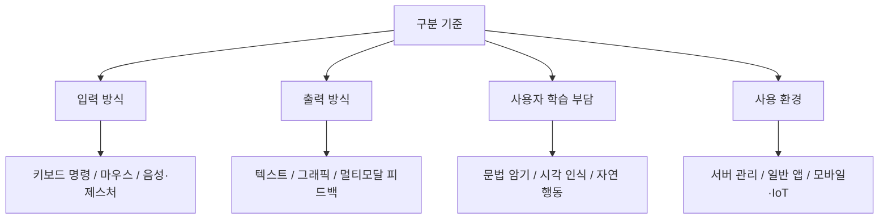

- 사용자 인터페이스는 단순히 화면 모양만으로 구분하지 않는다.
- 핵심 구분 기준은 사용자가 시스템에 `어떤 방식으로 입력하고`, 시스템이 `어떤 방식으로 반응하는지`이다.

- 주요 구분 축:
  - 입력 방식:
    - 텍스트 명령, 마우스, 터치, 음성, 제스처
  - 출력 방식:
    - 텍스트 출력, 그래픽 화면, 음성/진동/시각 피드백
  - 학습 부담:
    - 명령어 문법 암기, 아이콘 인식, 자연스러운 행동
  - 사용 환경:
    - 서버, 데스크톱, 모바일, 키오스크, 웨어러블, 스마트 스피커

- 시험 포인트:
  - CLI/GUI/NUI는 사용자의 조작 방식에 따른 구분이다.
  - 기능의 종류나 시스템의 내부 구조에 따른 구분이 아니다.

---

## 4. CLI(Command Line Interface)

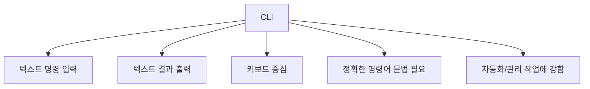

- 정의:
  - CLI는 사용자가 명령어를 텍스트로 입력하고, 시스템이 텍스트 형태로 결과를 출력하는 인터페이스이다.
  - `Command Line Interface`의 약자이다.

- 특징:
  - 키보드 입력 중심이다.
  - 명령어와 옵션을 알아야 한다.
  - 그래픽 요소가 거의 없거나 적다.
  - 작업을 스크립트로 자동화하기 좋다.
  - 서버 관리, 개발, 운영, 배치 작업에 많이 사용된다.

- 예:
  - Windows 명령 프롬프트
  - PowerShell
  - macOS Terminal
  - Linux Shell
  - `git`, `npm`, `docker`, `kubectl` 같은 명령어 도구

- 장점:
  - 반복 작업 자동화에 유리하다.
  - 빠르게 명령을 실행할 수 있다.
  - 시스템 자원을 상대적으로 적게 사용할 수 있다.
  - 원격 서버 관리에 적합하다.

- 단점:
  - 초보자에게 어렵다.
  - 명령어 문법을 기억해야 한다.
  - 오타나 옵션 실수에 취약할 수 있다.
  - 시각적 탐색이 어렵다.

- 시험 포인트:
  - `명령과 출력이 텍스트 형태`라는 단서가 나오면 CLI이다.

---

## 5. GUI(Graphical User Interface)

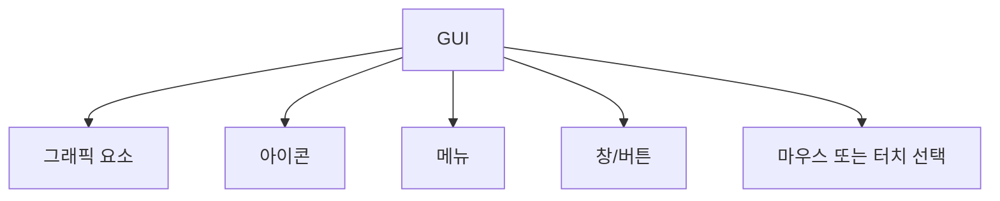

- 정의:
  - GUI는 창, 아이콘, 메뉴, 버튼 같은 그래픽 요소를 사용하여 시스템을 조작하는 인터페이스이다.
  - `Graphical User Interface`의 약자이다.

- 특징:
  - 시각적인 화면 요소를 사용한다.
  - 마우스, 터치패드, 터치스크린 등으로 조작한다.
  - 명령어를 외우지 않아도 메뉴나 버튼을 보고 기능을 선택할 수 있다.
  - 일반 사용자용 운영체제와 애플리케이션에서 널리 사용된다.

- 예:
  - Windows 바탕화면
  - macOS Finder
  - 웹 브라우저
  - 모바일 앱 화면
  - 파일 탐색기
  - 워드프로세서 메뉴와 버튼

- 장점:
  - 직관적이다.
  - 학습 부담이 CLI보다 낮은 편이다.
  - 시각적 피드백을 제공한다.
  - 복잡한 기능을 메뉴나 아이콘으로 구조화할 수 있다.

- 단점:
  - CLI보다 자동화가 불편할 수 있다.
  - 그래픽 처리로 시스템 자원을 더 사용할 수 있다.
  - 화면 구성이 복잡하면 오히려 사용성이 낮아질 수 있다.
  - 숙련자에게는 반복 작업이 느릴 수 있다.

- 시험 포인트:
  - `아이콘`, `메뉴`, `마우스`, `그래픽 환경`이 나오면 GUI이다.

---

## 6. NUI(Natural User Interface)

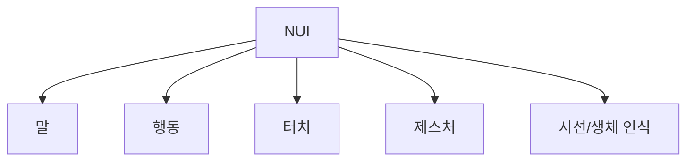

- 정의:
  - NUI는 사용자의 말, 행동, 터치, 제스처 등 자연스러운 방식으로 기기를 조작하는 인터페이스이다.
  - `Natural User Interface`의 약자이다.

- 특징:
  - 사람의 자연스러운 행동을 입력으로 사용한다.
  - 키보드나 마우스 같은 전통적 조작 장치에 덜 의존한다.
  - 센서, 카메라, 마이크, 터치스크린, 음성 인식 기술 등을 활용한다.
  - 사용자의 인지 부담과 조작 부담을 줄이는 것을 목표로 한다.

- 예:
  - 스마트폰 터치/스와이프/핀치 줌
  - 음성 비서
  - 제스처 인식 TV
  - 얼굴 인식 로그인
  - VR/AR 손동작 인터페이스
  - 키오스크 터치 입력

- 장점:
  - 직관적이고 자연스럽게 느껴질 수 있다.
  - 별도 학습 없이 사용할 수 있는 경우가 많다.
  - 접근성과 편의성을 높일 수 있다.
  - 모바일, 웨어러블, IoT 환경에 적합하다.

- 단점:
  - 인식 오류가 발생할 수 있다.
  - 주변 소음, 조명, 신체 조건, 환경의 영향을 받을 수 있다.
  - 개인정보와 보안 문제가 생길 수 있다.
  - 구현 비용과 기술 복잡도가 높을 수 있다.

- 시험 포인트:
  - `말이나 행동으로 기기를 조작`한다는 단서가 나오면 NUI이다.

---

## 7. CLI, GUI, NUI 비교

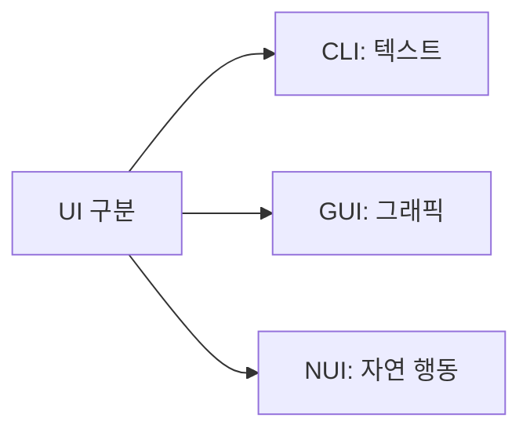

| 구분 | CLI | GUI | NUI |
|---|---|---|---|
| 풀네임 | Command Line Interface | Graphical User Interface | Natural User Interface |
| 핵심 입력 | 텍스트 명령 | 마우스/터치로 그래픽 선택 | 음성, 터치, 제스처, 시선 |
| 핵심 출력 | 텍스트 | 그래픽 화면 | 시각/음성/촉각 등 멀티모달 |
| 학습 부담 | 명령어 암기 필요 | 상대적으로 낮음 | 자연 행동 기반 |
| 강점 | 자동화, 서버 관리, 빠른 반복 작업 | 일반 사용자 친화성 | 직관적 조작, 모바일/IoT |
| 단점 | 초보자에게 어려움 | 복잡해지면 탐색 부담 | 인식 오류와 환경 영향 |
| 대표 단서 | 콘솔, 셸, 명령어 | 아이콘, 메뉴, 창 | 음성, 제스처, 터치 |

- 암기:
  - CLI = Command = 명령
  - GUI = Graphical = 그래픽
  - NUI = Natural = 자연

- 시험 포인트:
  - 세 구분은 서로 배타적으로만 존재하지 않는다.
  - 한 시스템 안에 CLI, GUI, NUI가 함께 있을 수 있다.
  - 예: 스마트폰은 GUI와 NUI 요소를 함께 가진다.

---

## 8. 사용 환경별 적합성

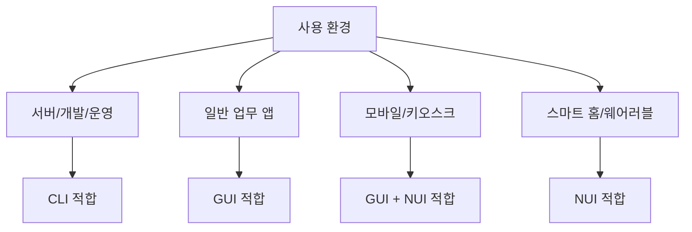

- CLI가 적합한 경우:
  - 서버 관리
  - 개발 도구 사용
  - 반복 작업 자동화
  - 원격 접속 환경
  - 로그 분석

- GUI가 적합한 경우:
  - 일반 사무 업무
  - 파일 관리
  - 문서 편집
  - 웹 서비스
  - 관리자 대시보드

- NUI가 적합한 경우:
  - 모바일 앱
  - 키오스크
  - 음성 비서
  - 웨어러블 기기
  - 차량 인터페이스
  - VR/AR 환경

- 시험 포인트:
  - 어떤 인터페이스가 무조건 우수한 것이 아니다.
  - 사용 목적, 사용자 숙련도, 환경, 작업 특성에 따라 적합한 방식이 달라진다.

---

## 9. CLI의 장단점 시험 정리

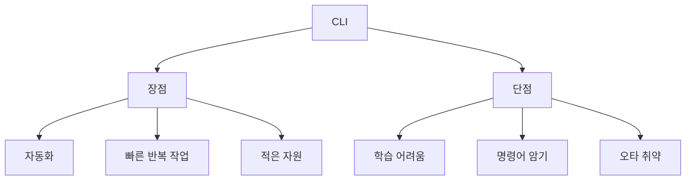

- 장점:
  - 명령어 조합으로 강력한 작업을 수행할 수 있다.
  - 스크립트를 통해 반복 작업을 자동화할 수 있다.
  - 네트워크나 원격 서버 환경에서 효율적이다.
  - 그래픽 환경이 없어도 사용할 수 있다.

- 단점:
  - 명령어와 옵션을 알아야 한다.
  - 처음 배우기 어렵다.
  - 결과가 텍스트 위주라 시각적 이해가 어려울 수 있다.
  - 실수한 명령이 큰 영향을 줄 수 있다.

- 보기 판별:
  - `명령어`, `텍스트`, `콘솔`, `셸`, `터미널`이 보이면 CLI이다.

---

## 10. GUI의 장단점 시험 정리

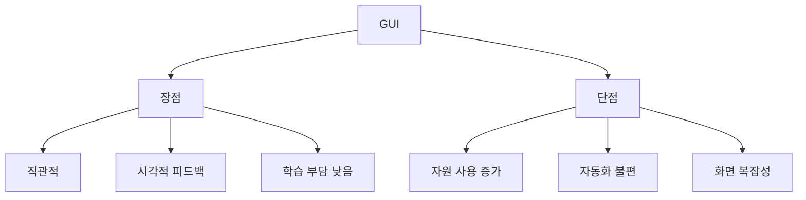

- 장점:
  - 아이콘과 메뉴를 보고 기능을 선택할 수 있다.
  - 명령어 문법을 외울 필요가 적다.
  - 결과와 상태를 시각적으로 확인할 수 있다.
  - 일반 사용자에게 친숙하다.

- 단점:
  - 그래픽 처리에 자원이 더 필요할 수 있다.
  - 반복 작업 자동화에는 CLI보다 불리할 수 있다.
  - 화면이 복잡하면 사용자가 기능을 찾기 어려울 수 있다.

- 보기 판별:
  - `아이콘`, `메뉴`, `창`, `버튼`, `마우스`, `그래픽`이 보이면 GUI이다.

---

## 11. NUI의 장단점 시험 정리

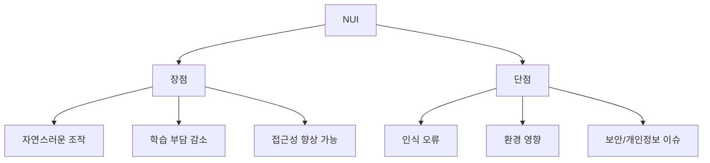

- 장점:
  - 사용자의 자연스러운 행동을 활용한다.
  - 키보드나 마우스 없이 사용할 수 있다.
  - 터치, 음성, 제스처 등 다양한 방식으로 접근할 수 있다.
  - 사용자 경험을 더 직관적으로 만들 수 있다.

- 단점:
  - 음성 인식은 소음에 영향을 받을 수 있다.
  - 제스처 인식은 조명과 카메라 성능에 영향을 받을 수 있다.
  - 생체 인식은 개인정보 보호가 중요하다.
  - 모든 사용자에게 항상 자연스럽게 느껴지는 것은 아니다.

- 보기 판별:
  - `말`, `행동`, `음성`, `터치`, `제스처`, `시선`, `생체 인식`이 보이면 NUI이다.

---

## 12. UI 구분과 접근성

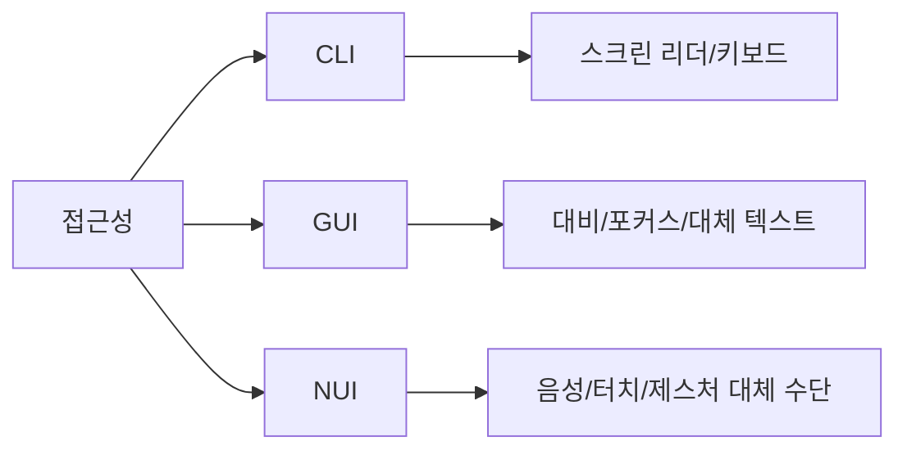

- UI 구분은 접근성과도 연결된다.
- CLI:
  - 키보드 중심이라 일부 환경에서는 강력한 접근성을 제공할 수 있다.
  - 하지만 명령어 학습 부담이 크다.
- GUI:
  - 시각적 요소가 많으므로 색상 대비, 포커스 표시, 대체 텍스트가 중요하다.
- NUI:
  - 음성, 터치, 제스처 등 다양한 입력을 제공할 수 있다.
  - 반대로 특정 입력 방식만 강제하면 접근성이 낮아질 수 있다.

- 시험 포인트:
  - NUI라고 해서 항상 모든 사용자에게 더 접근성이 좋은 것은 아니다.
  - 좋은 UI는 사용자의 상황과 제약을 고려해야 한다.

---

## 13. 복합 인터페이스

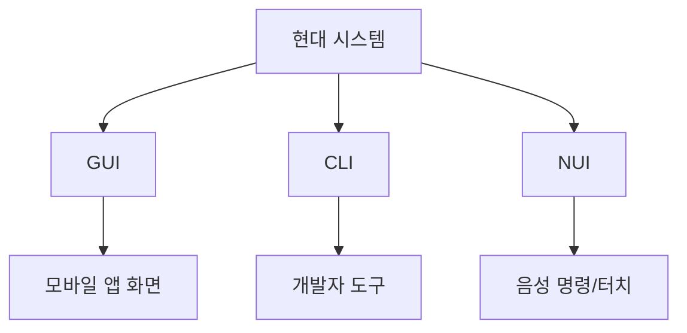

- 현대 시스템은 하나의 인터페이스 방식만 사용하지 않는 경우가 많다.
- 예:
  - Windows:
    - GUI 데스크톱
    - PowerShell CLI
    - 터치/음성 입력
  - 스마트폰:
    - 앱 GUI
    - 터치/제스처 NUI
    - 음성 비서 NUI
  - 클라우드 서비스:
    - 웹 콘솔 GUI
    - CLI 도구
    - API

- 시험 포인트:
  - CLI, GUI, NUI는 구분 개념이지만 실제 시스템에서는 함께 사용될 수 있다.
  - 문제에서는 지문의 핵심 조작 방식으로 판단한다.

---

## 14. 보기 판별 예시

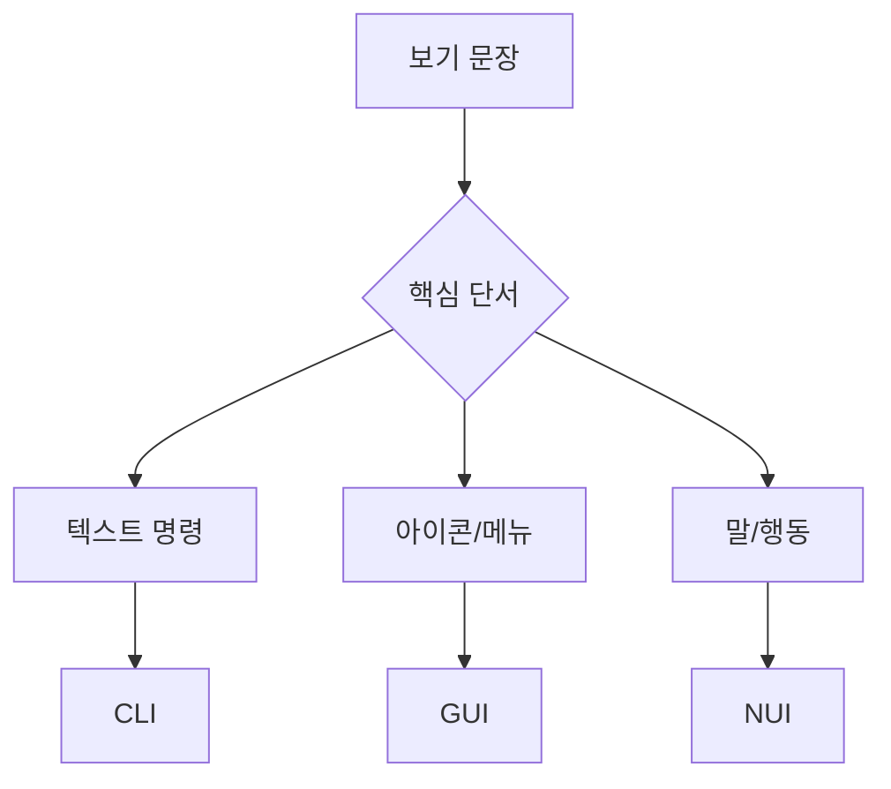

- 보기: `명령과 출력이 텍스트 형태로 이루어진다.`
  - 정답: `CLI`
  - 이유: 텍스트 명령과 텍스트 출력이 핵심이다.

- 보기: `아이콘이나 메뉴를 마우스로 선택하여 작업을 수행한다.`
  - 정답: `GUI`
  - 이유: 아이콘, 메뉴, 마우스, 그래픽 환경이 핵심이다.

- 보기: `사용자의 말이나 행동으로 기기를 조작한다.`
  - 정답: `NUI`
  - 이유: 자연스러운 말과 행동이 핵심이다.

- 보기: `서버 관리자가 셸에서 명령어를 입력해 서비스를 재시작한다.`
  - 정답: `CLI`

- 보기: `스마트폰 화면을 손가락으로 밀어 사진을 넘긴다.`
  - 정답: `NUI`

- 보기: `파일 아이콘을 더블 클릭하여 문서를 연다.`
  - 정답: `GUI`

---

## 15. 자주 나오는 함정

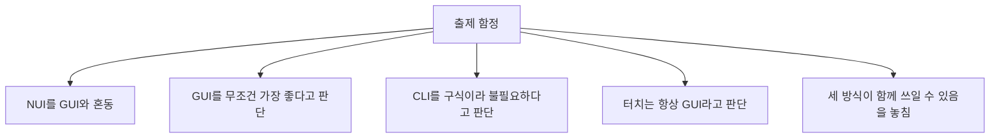

- 함정 1: NUI와 GUI 혼동
  - GUI는 그래픽 요소를 선택하는 방식이다.
  - NUI는 말, 행동, 터치, 제스처 등 자연스러운 입력을 강조한다.

- 함정 2: GUI가 항상 가장 좋다는 설명
  - 틀릴 수 있다.
  - 서버 관리나 자동화에는 CLI가 더 적합할 수 있다.

- 함정 3: CLI는 현재 사용하지 않는다는 설명
  - 틀리다.
  - 개발, 운영, 서버 관리, 자동화에서 CLI는 여전히 중요하다.

- 함정 4: 터치는 무조건 GUI라는 설명
  - 터치스크린 화면이 그래픽이면 GUI 요소도 있지만, 손가락 동작 자체는 NUI의 대표 예시로 볼 수 있다.

- 함정 5: 한 시스템은 하나의 UI 방식만 가진다는 설명
  - 틀리다.
  - 여러 UI 방식이 함께 제공될 수 있다.

---

## 16. 암기 포인트

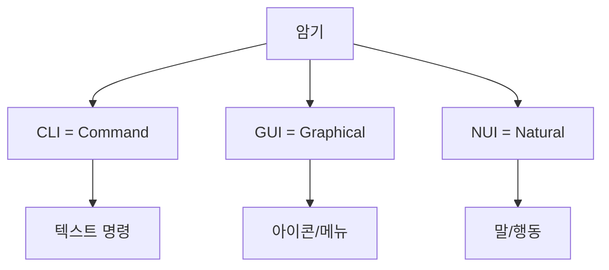

- 핵심 암기:
  - `CLI = Command = 명령어`
  - `GUI = Graphical = 그래픽`
  - `NUI = Natural = 자연스러운 입력`

- 단서어 암기:
  - CLI:
    - 명령어, 콘솔, 텍스트, 셸, 터미널
  - GUI:
    - 아이콘, 메뉴, 마우스, 버튼, 창, 그래픽
  - NUI:
    - 말, 행동, 터치, 제스처, 음성, 시선, 생체 인식

- 최종 암기 문장:
  - `사용자 인터페이스는 명령어 기반 CLI, 그래픽 기반 GUI, 자연스러운 말과 행동 기반 NUI로 구분한다.`

---

## 17. 빠른 복습

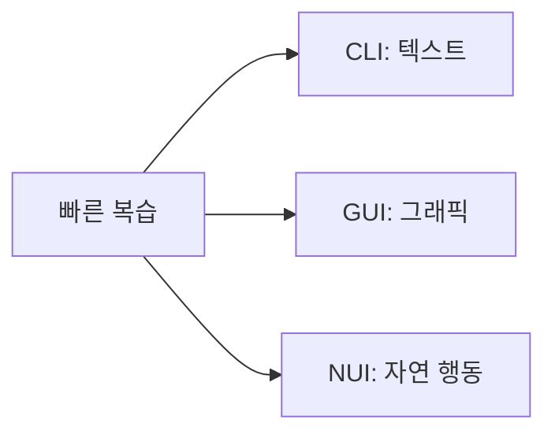

- 챕터명:
  - `021 사용자 인터페이스의 구분`

- 소속 영역:
  - `UI`

- PDF 핵심 키워드:
  - `CLI`
  - `GUI`
  - `NUI`

- 문제 풀이 순서:
  - 지문에서 입력 방식을 찾는다.
  - 텍스트 명령이면 CLI.
  - 아이콘/메뉴/마우스면 GUI.
  - 말/행동/제스처/터치면 NUI.

- 자주 나오는 문제 유형:
  - CLI/GUI/NUI의 풀네임을 묻는 문제
  - 정의와 용어를 연결하는 문제
  - 각 방식의 장단점을 묻는 문제
  - 실제 예시를 주고 UI 유형을 고르는 문제

---

## 18. 참고 링크

- 기준 PDF: `/Users/nes0903/Documents/study/정보처리기사/핵심요약집_2026_정보처리기사필기핵심요약.pdf`
- [Q-Net 정보처리기사 종목 페이지](https://www.q-net.or.kr/crf005.do?id=crf00503s02&jmCd=1320&jmInfoDivCcd=B0)
- [TechTarget - Command-line interface](https://www.techtarget.com/searchwindowsserver/definition/command-line-interface-CLI)
- [TechTarget - Natural user interface](https://www.techtarget.com/whatis/definition/natural-user-interface-NUI)
- [TechTarget - CLI, GUI and NUI explanation](https://www.techtarget.com/whatis/video/An-explanation-of-CLI-GUI-and-NUI)
- [W3C WAI - Accessibility Principles](https://www.w3.org/WAI/fundamentals/accessibility-principles/)
