# 022 사용자 인터페이스의 기본 원칙

작성 기준일: 2026-05-03  
과목: `1과목 소프트웨어 설계`  
기준 PDF: `/Users/nes0903/Documents/study/정보처리기사/핵심요약집_2026_정보처리기사필기핵심요약.pdf`  
PDF 확인 위치: `3페이지`  
검색 보강: ISO 9241-210, NIST HCD, W3C 접근성 원칙, Nielsen Norman Group 사용성 휴리스틱을 함께 확인하여 시험 중심으로 확장 정리

---

## 1. 한 줄 요약

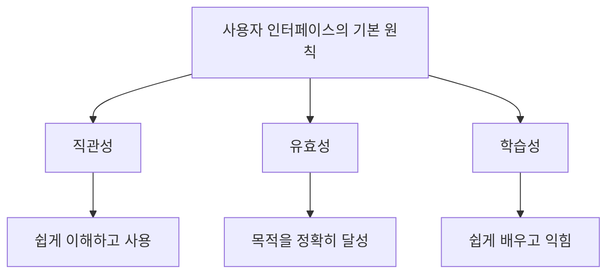

- 사용자 인터페이스의 기본 원칙은 사용자가 시스템을 `쉽게 이해하고`, `목적을 정확히 달성하며`, `빠르게 배울 수 있게` 만드는 기준이다.
- PDF 기준 핵심 원칙은 다음 3가지이다.
  - `직관성`: 누구나 쉽게 이해하고 사용할 수 있어야 한다.
  - `유효성`: 사용자의 목적을 정확하고 완벽하게 달성해야 한다.
  - `학습성`: 누구나 쉽게 배우고 익힐 수 있어야 한다.
- 시험에서는 `직관성 = 이해/사용 쉬움`, `유효성 = 목적 달성`, `학습성 = 배우기 쉬움`으로 빠르게 구분한다.

---

## 2. PDF 기준 핵심

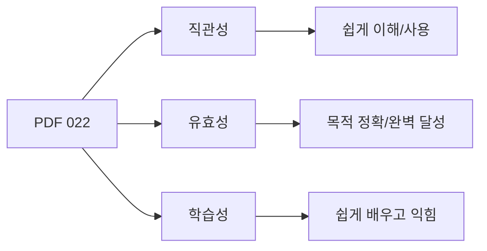

- PDF에서 직접 확인한 내용:
  - `직관성`: 누구나 쉽게 이해하고 사용할 수 있어야 한다.
  - `유효성`: 사용자의 목적을 정확하고 완벽하게 달성해야 한다.
  - `학습성`: 누구나 쉽게 배우고 익힐 수 있어야 한다.

- 이 챕터의 최소 암기 골격:
  - `직-유-학`
  - 직관성, 유효성, 학습성

- 시험 단서:
  - 처음 봐도 알기 쉽다 = 직관성
  - 목적을 정확하게 끝까지 달성한다 = 유효성
  - 누구나 쉽게 배우고 익힌다 = 학습성

- 참고:
  - 일부 정보처리기사 자료에는 `유연성`을 함께 제시하는 경우가 있다.
  - 하지만 이 PDF 022 챕터의 직접 범위는 `직관성`, `유효성`, `학습성` 3개이다.

---

## 3. 기본 원칙의 의미

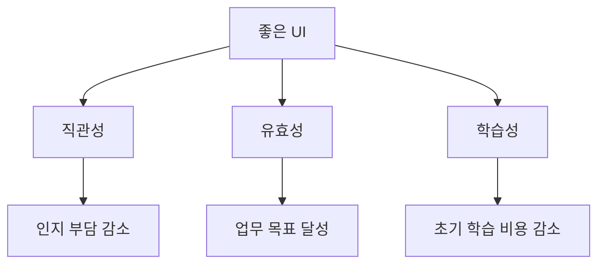

- UI 기본 원칙은 화면을 보기 좋게 만드는 기준만이 아니다.
- 사용자가 실제 업무를 수행할 때 발생하는 이해 부담, 조작 부담, 학습 부담을 줄이는 기준이다.

- 직관성:
  - 사용자가 별도 설명 없이도 기능과 흐름을 이해할 수 있게 한다.
- 유효성:
  - 사용자가 시스템을 통해 실제 목적을 정확히 달성할 수 있게 한다.
- 학습성:
  - 처음 사용하는 사용자도 빠르게 사용 방법을 익힐 수 있게 한다.

- 검색 자료와의 연결:
  - 인간중심 설계는 사용자의 요구, 업무, 환경을 이해하고 반복적으로 평가하는 것을 강조한다.
  - 사용성 휴리스틱은 상태 표시, 일관성, 오류 예방, 인지 부담 감소 등을 좋은 UI 원칙으로 본다.
  - 접근성 원칙은 사용자가 내용을 인식하고, 조작하고, 이해할 수 있어야 함을 강조한다.

---

## 4. 직관성

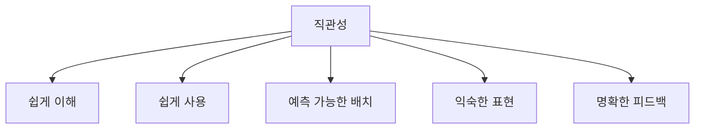

- 정의:
  - 직관성은 사용자가 별도의 긴 설명 없이도 화면의 의미와 사용 방법을 쉽게 이해하고 사용할 수 있는 성질이다.

- 직관성이 높은 UI:
  - 버튼 이름이 기능을 명확히 설명한다.
  - 메뉴 위치와 구조가 예측 가능하다.
  - 아이콘이 일반적으로 이해되는 의미와 일치한다.
  - 사용자가 현재 상태와 다음 행동을 쉽게 알 수 있다.
  - 업무 흐름이 자연스럽게 이어진다.

- 예:
  - 돋보기 아이콘은 검색을 의미한다.
  - 휴지통 아이콘은 삭제를 의미한다.
  - `저장` 버튼을 누르면 저장 완료 메시지가 표시된다.
  - 필수 입력값은 입력 전에 표시된다.

- 직관성이 낮은 UI:
  - 버튼명이 `처리`, `실행`, `확인`처럼 모호하다.
  - 같은 기능이 화면마다 다른 위치에 있다.
  - 개발자 용어가 그대로 노출된다.
  - 사용자가 다음 단계나 현재 상태를 추측해야 한다.

- 시험 포인트:
  - `누구나 쉽게 이해하고 사용할 수 있다`는 단서가 나오면 직관성이다.

---

## 5. 유효성

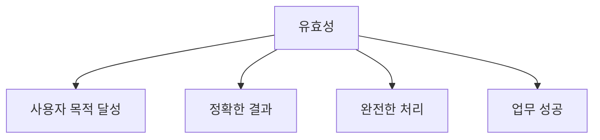

- 정의:
  - 유효성은 사용자의 목적을 정확하고 완벽하게 달성할 수 있는 성질이다.

- 유효성이 높은 UI:
  - 사용자가 원하는 작업을 끝까지 수행할 수 있다.
  - 입력, 처리, 결과가 사용자의 목표와 맞다.
  - 필요한 기능이 빠짐없이 제공된다.
  - 오류가 발생해도 복구 방법을 제공한다.
  - 결과가 정확하고 확인 가능하다.

- 예:
  - 사용자가 상품 주문을 시작하면 배송지 입력, 결제, 주문 완료까지 수행할 수 있다.
  - 회원가입 화면에서 필수 정보 입력, 본인 인증, 가입 완료를 정확히 처리한다.
  - 검색 화면이 사용자의 조건에 맞는 결과를 보여준다.

- 유효성이 낮은 UI:
  - 화면은 예쁘지만 사용자가 목표를 완료할 수 없다.
  - 필요한 입력 항목이나 기능이 빠져 있다.
  - 결과가 사용자의 의도와 다르다.
  - 오류 후 복구 경로가 없다.

- 시험 포인트:
  - `목적을 정확하고 완벽하게 달성`한다는 단서가 나오면 유효성이다.

---

## 6. 학습성

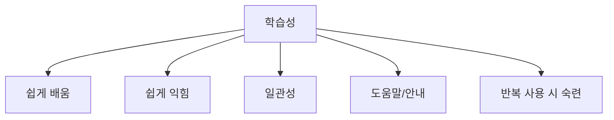

- 정의:
  - 학습성은 사용자가 시스템 사용 방법을 쉽게 배우고 익힐 수 있는 성질이다.

- 학습성이 높은 UI:
  - 메뉴와 버튼이 일관된다.
  - 초보자가 실수하기 쉬운 부분을 안내한다.
  - 필요한 곳에 도움말과 예시를 제공한다.
  - 용어가 쉽고 일관적이다.
  - 이전에 배운 조작 방식이 다른 화면에서도 통한다.

- 예:
  - 모든 화면의 저장 버튼이 같은 위치와 같은 이름을 가진다.
  - 입력 폼에 예시 값이 표시된다.
  - 처음 사용하는 기능에 간단한 온보딩을 제공한다.
  - 오류 메시지가 수정 방법까지 알려준다.

- 학습성이 낮은 UI:
  - 화면마다 조작 방식이 다르다.
  - 같은 기능을 다른 이름으로 부른다.
  - 사용자가 매번 새로 배워야 한다.
  - 도움말 없이 복잡한 절차를 요구한다.

- 시험 포인트:
  - `누구나 쉽게 배우고 익힐 수 있다`는 단서가 나오면 학습성이다.

---

## 7. 직관성, 유효성, 학습성 비교

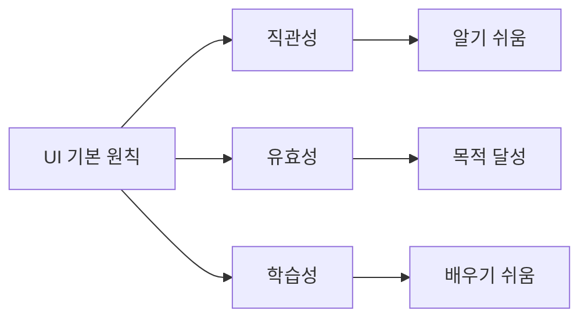

| 구분 | 핵심 질문 | 시험 단서 | 예 |
|---|---|---|---|
| `직관성` | 처음 봐도 이해하고 사용할 수 있는가? | 쉽게 이해, 쉽게 사용 | 검색 아이콘을 보고 검색 기능임을 알 수 있음 |
| `유효성` | 사용자의 목적을 정확히 달성하는가? | 목적 달성, 정확, 완벽 | 주문을 끝까지 완료할 수 있음 |
| `학습성` | 쉽게 배우고 익힐 수 있는가? | 배우기 쉬움, 익히기 쉬움 | 화면마다 조작 방식이 일관됨 |

- 구분 공식:
  - 직관성 = `바로 알 수 있음`
  - 유효성 = `목적을 달성함`
  - 학습성 = `쉽게 익힘`

- 시험 함정:
  - 직관성과 학습성은 둘 다 쉬움과 관련되지만 다르다.
  - 직관성은 처음 보고 이해하는 쉬움이다.
  - 학습성은 사용 방법을 배우고 반복 사용으로 익히는 쉬움이다.

---

## 8. 직관성과 학습성 구분

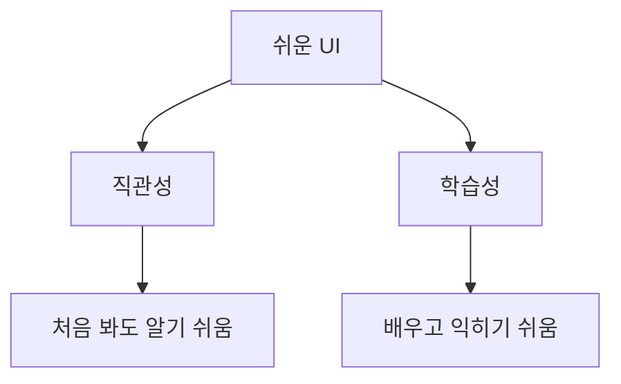

- 직관성:
  - 즉시 이해 가능성에 가깝다.
  - 사용자가 설명 없이도 무엇을 해야 할지 알 수 있다.

- 학습성:
  - 시간이 지나며 사용 방법을 쉽게 익히는 성질이다.
  - 처음에는 설명이 필요할 수 있지만, 짧은 학습으로 빠르게 능숙해질 수 있다.

- 예:
  - 직관성:
    - `삭제` 버튼이 휴지통 아이콘과 함께 표시된다.
  - 학습성:
    - 여러 화면에서 같은 단축키와 같은 버튼 위치를 제공해 금방 익숙해진다.

- 시험 포인트:
  - `쉽게 이해`는 직관성.
  - `쉽게 배우고 익힘`은 학습성.

---

## 9. 유효성과 사용성의 관계

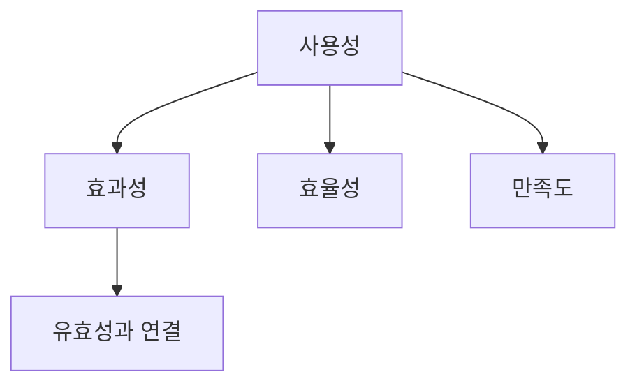

- 유효성은 사용성의 효과성 관점과 연결된다.
- 사용자가 시스템을 통해 목적을 정확히 달성해야 좋은 UI라고 할 수 있다.

- 예:
  - 검색 UI가 보기 좋아도 원하는 결과를 찾지 못하면 유효성이 낮다.
  - 결제 UI가 빠르더라도 결제가 실패하거나 잘못 청구되면 유효성이 낮다.
  - 회원가입 UI가 간단해도 필수 약관 동의와 인증을 완료하지 못하면 유효성이 낮다.

- 시험 포인트:
  - 유효성은 단순히 빠르거나 예쁜 것이 아니다.
  - 사용자의 목적을 정확하고 완벽하게 달성하는 것이 핵심이다.

---

## 10. 기본 원칙과 접근성 연결

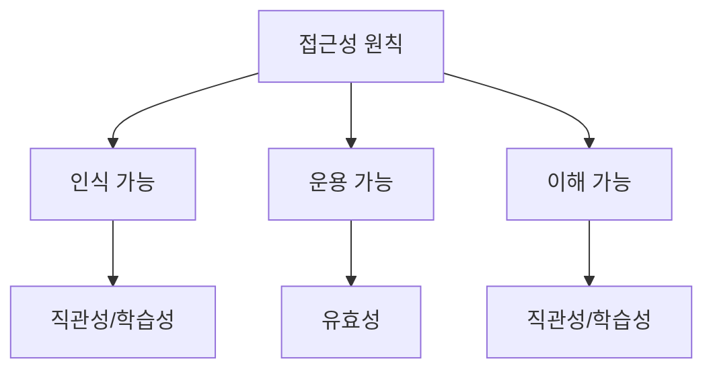

- 접근성은 다양한 사용자가 제약이 있어도 시스템을 사용할 수 있게 하는 성질이다.
- UI 기본 원칙과 접근성은 서로 연결된다.

- 직관성과 접근성:
  - 화면 내용과 조작 방법이 쉽게 이해되어야 한다.
  - 아이콘만 사용하지 않고 텍스트 설명도 제공하면 이해가 쉬워진다.

- 유효성과 접근성:
  - 키보드만 사용하는 사용자도 목적을 달성할 수 있어야 한다.
  - 스크린 리더 사용자가도 기능을 완료할 수 있어야 한다.

- 학습성과 접근성:
  - 일관된 내비게이션과 명확한 도움말은 학습 부담을 줄인다.

- 시험 포인트:
  - 접근성은 별도 챕터로 나올 수 있지만, UI 원칙과 연결해서 이해하면 보기 판별이 쉽다.

---

## 11. 기본 원칙과 Nielsen 휴리스틱 연결

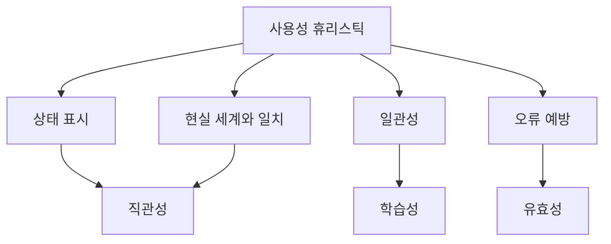

- 사용성 휴리스틱은 UI를 평가할 때 자주 쓰이는 경험적 원칙이다.
- 정보처리기사 시험에서 휴리스틱 이름을 직접 묻지 않더라도, 원칙의 의미는 UI 기본 원칙과 연결된다.

- 상태 표시:
  - 사용자가 현재 시스템 상태를 알 수 있어 직관성이 높아진다.

- 현실 세계와 일치:
  - 사용자의 언어와 업무 용어를 사용하므로 직관성이 높아진다.

- 일관성:
  - 화면마다 같은 방식으로 조작할 수 있어 학습성이 높아진다.

- 오류 예방:
  - 사용자가 목적을 실패하지 않게 도와 유효성이 높아진다.

- 시험 포인트:
  - 좋은 UI 원칙은 서로 독립적이지 않다.
  - 직관성, 유효성, 학습성은 함께 개선되는 경우가 많다.

---

## 12. 좋은 UI와 나쁜 UI 예시

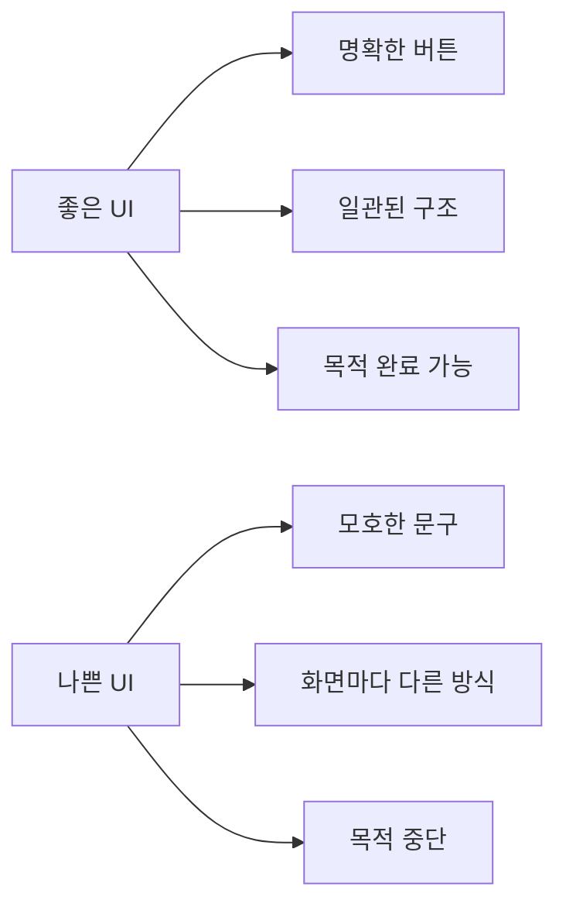

- 좋은 UI 예:
  - `주문 완료` 버튼처럼 행동이 명확하다.
  - 현재 단계와 다음 단계가 표시된다.
  - 입력 오류가 발생하면 어느 항목을 어떻게 수정할지 알려준다.
  - 모든 화면에서 저장/취소 버튼 위치가 일관된다.

- 나쁜 UI 예:
  - `처리` 버튼처럼 의미가 모호하다.
  - 저장 버튼이 화면마다 다른 위치에 있다.
  - 오류 메시지가 코드만 보여준다.
  - 필요한 기능을 찾기 위해 여러 메뉴를 헤매야 한다.
  - 사용자가 목적을 완료할 수 없는 흐름이 있다.

- 시험 포인트:
  - 화려한 디자인만으로 좋은 UI가 되는 것은 아니다.
  - 좋은 UI는 직관성, 유효성, 학습성을 만족해야 한다.

---

## 13. 인접 챕터와 연결

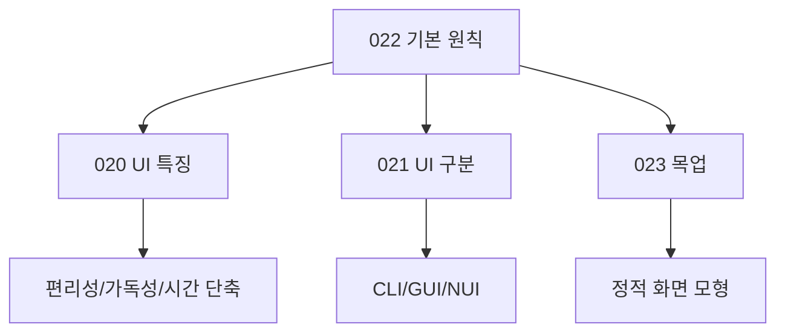

- 020 사용자 인터페이스의 특징:
  - UI가 편리성, 가독성, 작업 시간 단축, 업무 이해도를 높인다는 내용이다.

- 021 사용자 인터페이스의 구분:
  - CLI, GUI, NUI처럼 조작 방식에 따른 구분이다.

- 022 사용자 인터페이스의 기본 원칙:
  - 직관성, 유효성, 학습성처럼 좋은 UI가 지켜야 할 원칙이다.

- 023 목업:
  - UI를 실제 구현 전에 시각적으로 검토하기 위한 정적 모형이다.

- 시험 포인트:
  - 특징, 구분, 원칙, 산출물을 서로 섞어 출제할 수 있다.

---

## 14. 보기 판별 예시

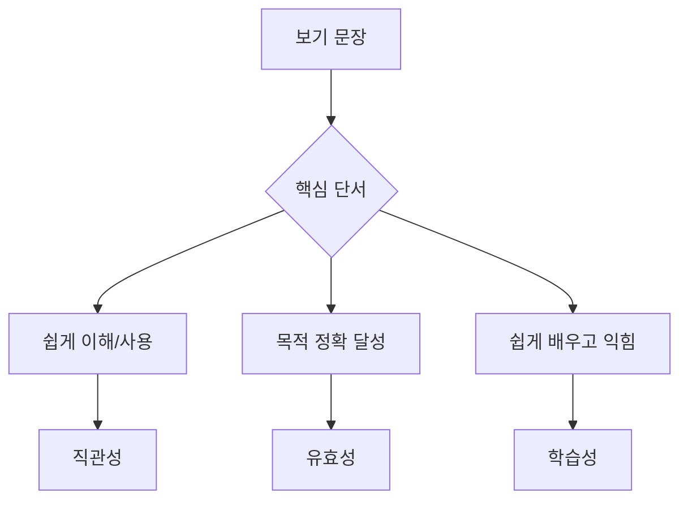

- 보기: `누구나 쉽게 이해하고 사용할 수 있어야 한다.`
  - 정답: `직관성`
  - 이유: 쉽게 이해하고 사용한다는 단서가 핵심이다.

- 보기: `사용자의 목적을 정확하고 완벽하게 달성해야 한다.`
  - 정답: `유효성`
  - 이유: 목적 달성이 핵심이다.

- 보기: `누구나 쉽게 배우고 익힐 수 있어야 한다.`
  - 정답: `학습성`
  - 이유: 배우고 익힌다는 단서가 핵심이다.

- 보기: `화면이 화려할수록 직관성이 높다.`
  - 정답: `틀림`
  - 이유: 직관성은 화려함이 아니라 이해와 사용의 쉬움이다.

- 보기: `사용자가 목표를 완료하지 못해도 화면이 빠르면 유효성이 높다.`
  - 정답: `틀림`
  - 이유: 유효성은 목적 달성이 핵심이다.

---

## 15. 자주 나오는 함정

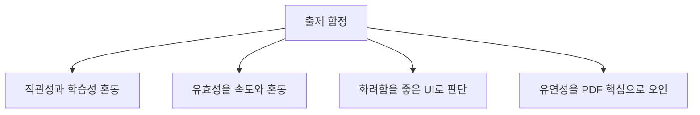

- 함정 1: 직관성과 학습성 혼동
  - 직관성은 처음 봐도 쉽게 이해하고 사용할 수 있는 성질이다.
  - 학습성은 쉽게 배우고 익힐 수 있는 성질이다.

- 함정 2: 유효성과 속도 혼동
  - 빠르더라도 목적을 달성하지 못하면 유효성이 낮다.
  - 유효성은 정확하고 완벽한 목적 달성이 핵심이다.

- 함정 3: 화려하면 좋은 UI라는 판단
  - UI 원칙은 화려함보다 사용자의 이해, 목적 달성, 학습 용이성을 중시한다.

- 함정 4: PDF 범위 밖 원칙을 핵심으로 오인
  - 일부 자료에는 유연성이 포함될 수 있다.
  - 이 PDF 022 챕터의 직접 핵심은 직관성, 유효성, 학습성이다.

---

## 16. 암기 포인트

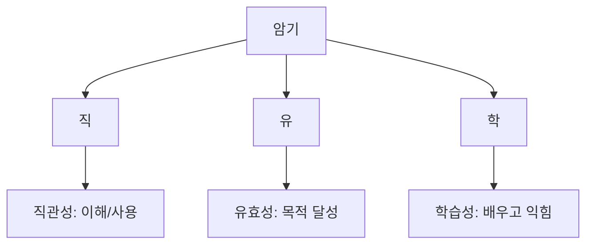

- 핵심 암기:
  - `직-유-학`
  - 직관성, 유효성, 학습성

- 단서 암기:
  - 직관성:
    - 쉽게 이해, 쉽게 사용
  - 유효성:
    - 목적 달성, 정확, 완벽
  - 학습성:
    - 쉽게 배우고 익힘

- 최종 암기 문장:
  - `사용자 인터페이스의 기본 원칙은 직관성·유효성·학습성이며, 사용자가 쉽게 이해하고 목적을 정확히 달성하며 쉽게 배울 수 있어야 한다.`

---

## 17. 빠른 복습

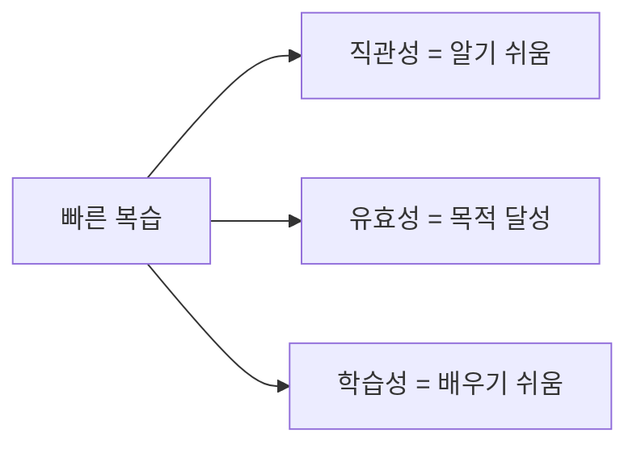

- 챕터명:
  - `022 사용자 인터페이스의 기본 원칙`

- 소속 영역:
  - `UI`

- PDF 핵심 키워드:
  - `직관성`
  - `유효성`
  - `학습성`

- 문제 풀이 순서:
  - 지문에서 `이해/사용`, `목적 달성`, `배우고 익힘` 단서를 찾는다.
  - `이해/사용`이면 직관성.
  - `목적 달성`이면 유효성.
  - `배우고 익힘`이면 학습성.

---

## 18. 참고 링크

- 기준 PDF: `/Users/nes0903/Documents/study/정보처리기사/핵심요약집_2026_정보처리기사필기핵심요약.pdf`
- [Q-Net 정보처리기사 종목 페이지](https://www.q-net.or.kr/crf005.do?id=crf00503s02&jmCd=1320&jmInfoDivCcd=B0)
- [ISO 9241-210:2019 - Human-centred design for interactive systems](https://www.iso.org/standard/77520.html)
- [NIST - Human Centered Design](https://www.nist.gov/itl/iad/visualization-and-usability-group/human-factors-human-centered-design)
- [W3C WAI - Accessibility Principles](https://www.w3.org/WAI/fundamentals/accessibility-principles/)
- [W3C - Web Content Accessibility Guidelines 2.2](https://www.w3.org/TR/WCAG22/)
- [Nielsen Norman Group - 10 Usability Heuristics](https://www.nngroup.com/articles/ten-usability-heuristics/)
