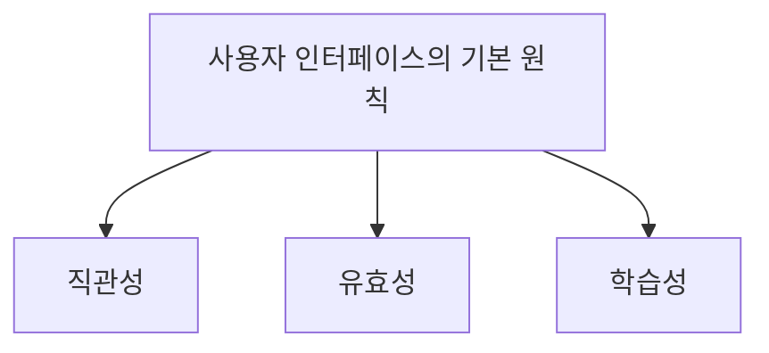

# 022 사용자 인터페이스의 기본 원칙

작성 기준일: 2026-05-02  
과목: `1과목 소프트웨어 설계`  
기준 PDF: `/Users/nes0903/Documents/study/정보처리기사/핵심요약집_2026_정보처리기사필기핵심요약.pdf`  
PDF 확인 위치: `3페이지`  
검색 보강: 공식/표준/고품질 참고 자료를 함께 확인하여 시험 중심으로 확장 정리

---

## 1. 한 줄 요약

- 사용자 인터페이스의 기본 원칙은 직관성, 유효성, 학습성으로, 사용자가 쉽게 이해하고 목적을 정확히 달성하며 쉽게 배울 수 있어야 한다는 기준이다.
- 이 챕터는 `UI` 영역에 속한다.
- 시험에서는 정의, 핵심 키워드, 비슷한 개념과의 구분을 함께 묻는 경우가 많다.

---

## 2. PDF 기준 핵심

- 직관성: 누구나 쉽게 이해하고 사용할 수 있어야 한다.
- 유효성: 사용자의 목적을 정확하고 완벽하게 달성해야 한다.
- 학습성: 누구나 쉽게 배우고 익힐 수 있어야 한다.

- 위 항목은 PDF에서 직접 확인한 최소 암기 골격이다.
- 세부 설명은 이 골격을 기준으로 확장해서 이해하면 된다.

---

## 3. 개념 설명

- 직관성은 별도 설명 없이도 사용 방법을 추측할 수 있는 정도다.
- 유효성은 사용자가 하려는 일을 실제로 끝까지 달성할 수 있는 정도다.
- 학습성은 처음 접한 사용자가 빠르게 익힐 수 있는 정도다.
- 시험 자료에 따라 유연성이 함께 제시되는 경우도 있으나 PDF 핵심은 직관성/유효성/학습성이다.

- UI 문제는 사용자 관점에서 편리성, 직관성, 가독성, 학습성, 목적 달성 여부를 보는 것이 핵심이다.
- 시험에서는 CLI/GUI/NUI, 직관성/유효성/학습성, 목업/프로토타입 차이를 자주 섞는다.

---

## 4. 핵심 포인트

- 직관성, 유효성, 학습성을 정의와 함께 외운다.
- 직관성은 이해/사용 쉬움, 유효성은 목적 달성, 학습성은 배우기 쉬움이다.
- 편의성 같은 일반어와 시험 용어를 구분한다.

- 문제를 풀 때는 먼저 지문 속 단서어를 찾고, 그 단서어가 어떤 개념을 가리키는지 연결한다.
- 정의형 문제는 표현이 조금 바뀌어도 핵심 의미가 같으면 같은 개념으로 판단한다.
- 옳고 그름 문제에서는 `항상`, `반드시`, `전혀`, `모두` 같은 극단 표현을 특히 조심한다.

---

## 5. 시험에서 헷갈리는 비교

| 구분 | 핵심 |
|---|---|
| `직관성` | 처음 봐도 알기 쉬움 |
| `유효성` | 목적을 정확히 달성 |
| `학습성` | 쉽게 배우고 익힘 |

- 비교 문제는 이름보다 `역할`, `목적`, `사용 시점`, `장점/단점`을 기준으로 구분하면 안정적이다.
- 같은 단어가 다른 챕터에서도 나오면 이 챕터의 문맥에서 어떤 의미로 쓰였는지 확인해야 한다.

---

## 6. 예시 또는 암기 포인트

- UI 기본 원칙 = `직-유-학`.

- 암기는 단어만 외우기보다 `정의 -> 특징 -> 예시 -> 반대 개념` 순서로 묶는 것이 좋다.
- 시험 직전에는 이 섹션의 키워드만 빠르게 반복해도 충분히 효과가 있다.

---

## 7. 빠른 복습

- 챕터명: `022 사용자 인터페이스의 기본 원칙`
- 소속 영역: `UI`
- PDF 핵심 키워드: `직관성`, `유효성`, `학습성`
- 가장 먼저 떠올릴 말: `사용자 인터페이스의 기본 원칙은 직관성, 유효성, 학습성으로, 사용자가 쉽게 이해하고 목적을 정확히 달성하며 쉽게 배울 수 있어야 한다는 기준이다`
- 자주 나오는 문제 유형:
  - 정의를 주고 개념명을 고르는 문제
  - 특징을 섞어 놓고 옳은/틀린 설명을 고르는 문제
  - 유사 개념과 비교하여 다른 하나를 찾는 문제

---

## 8. 참고 링크

- 기준 PDF: `/Users/nes0903/Documents/study/정보처리기사/핵심요약집_2026_정보처리기사필기핵심요약.pdf`
- [Q-Net 정보처리기사 종목 페이지](https://www.q-net.or.kr/crf005.do?id=crf00503s02&jmCd=1320&jmInfoDivCcd=B0)
- [W3C WAI - Accessibility Principles](https://www.w3.org/WAI/fundamentals/accessibility-principles/)
- [W3C - Web Content Accessibility Guidelines 2.2](https://www.w3.org/TR/WCAG22/)
