# 023 목업

작성 기준일: 2026-05-03  
과목: `1과목 소프트웨어 설계`  
기준 PDF: `/Users/nes0903/Documents/study/정보처리기사/핵심요약집_2026_정보처리기사필기핵심요약.pdf`  
PDF 확인 위치: `3페이지`  
검색 보강: UXPin, Aha!, Visual Paradigm, Mockplus 자료를 함께 확인하여 시험 중심으로 확장 정리

---

## 1. 한 줄 요약

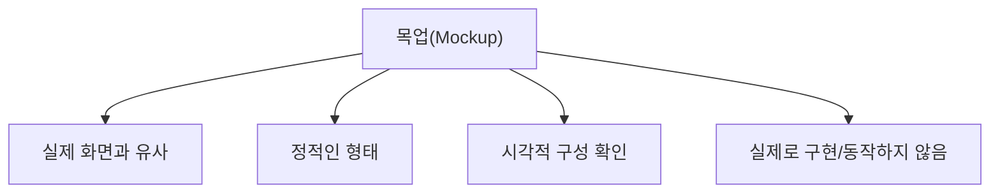

- 목업은 와이어프레임보다 실제 화면에 가깝게 만든 `정적인 UI 시각 모형`이다.
- PDF 기준 핵심은 다음 2가지이다.
  - 와이어프레임보다 좀 더 실제 화면과 유사하게 만든 정적인 형태의 모형이다.
  - 시각적으로만 구성 요소를 배치하는 것으로 실제로 구현되지는 않는다.
- 시험에서는 `목업 = 실제처럼 보이지만 동작하지 않는 정적 화면 모형`으로 기억한다.

---

## 2. PDF 기준 핵심

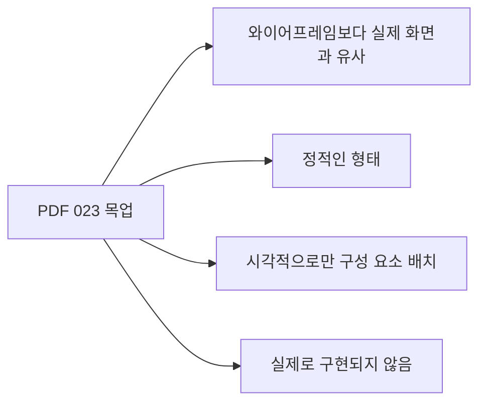

- PDF에서 직접 확인한 내용:
  - `와이어프레임보다 좀 더 실제 화면과 유사하게 만든 정적인 형태의 모형이다.`
  - `시각적으로만 구성 요소를 배치하는 것으로 실제로 구현되지는 않는다.`

- 이 챕터의 최소 암기 골격:
  - 목업은 `정적`이다.
  - 목업은 `실제 화면과 유사`하다.
  - 목업은 `시각적 배치`를 확인한다.
  - 목업은 `실제로 구현되지 않는다`.

- 시험 단서:
  - 정적 모형
  - 실제 화면과 유사
  - 시각적 구성
  - 구현되지 않음
  - 클릭/동작 없음

---

## 3. 목업의 위치

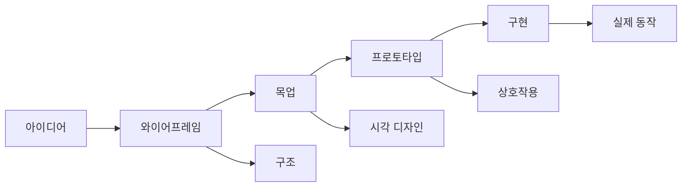

- UI 설계 산출물은 추상도와 구현 수준에 따라 구분할 수 있다.
- 목업은 와이어프레임과 프로토타입 사이에 위치하는 경우가 많다.

- 와이어프레임:
  - 화면의 구조와 배치를 빠르게 잡는다.
  - 색상, 이미지, 세부 디자인은 적거나 없다.

- 목업:
  - 실제 화면에 가까운 시각적 모습을 보여준다.
  - 색상, 글꼴, 버튼, 이미지, 여백, 아이콘 등 시각 요소가 포함된다.
  - 하지만 동작하지 않는다.

- 프로토타입:
  - 클릭, 화면 전환, 입력 흐름 같은 상호작용을 검증한다.
  - 실제 구현 전 사용자 흐름을 테스트할 수 있다.

- 시험 포인트:
  - 목업은 와이어프레임보다 실제 화면과 가깝다.
  - 목업은 프로토타입처럼 동작하지 않는다.

---

## 4. 목업의 핵심 특징

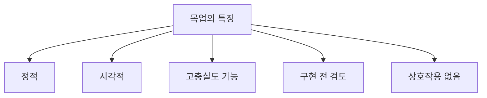

- 정적이다.
  - 화면 전환, 클릭 동작, 데이터 처리 로직이 없다.

- 시각적이다.
  - 최종 화면이 어떻게 보일지 확인한다.

- 실제 화면과 유사하다.
  - 색상, 글꼴, 이미지, 버튼 스타일, 배치가 포함될 수 있다.

- 구현 전 검토용이다.
  - 개발 전에 이해관계자와 화면 방향을 합의할 수 있다.

- 상호작용은 제한적이거나 없다.
  - 실제 기능 구현이나 동작 검증이 목적이 아니다.

- 시험 포인트:
  - `정적`, `시각적`, `실제 화면과 유사`, `실제로 구현되지 않음`이 핵심이다.

---

## 5. 와이어프레임, 목업, 프로토타입 비교

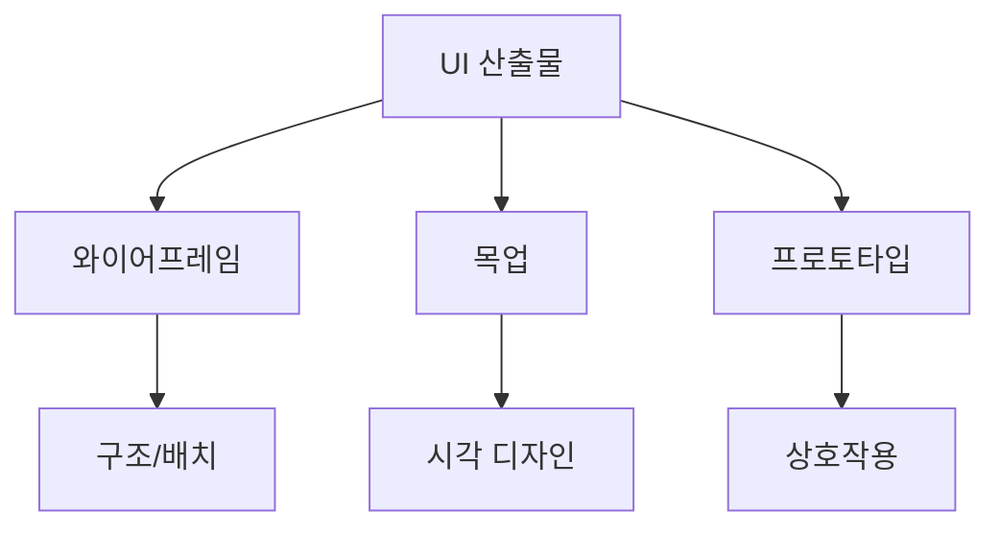

| 구분 | 와이어프레임 | 목업 | 프로토타입 |
|---|---|---|---|
| 핵심 | 화면 구조와 배치 | 실제 화면에 가까운 정적 시각 모형 | 상호작용 가능한 시제품 |
| 충실도 | 낮음 | 중간~높음 | 낮음~높음 |
| 색상/이미지 | 최소 | 포함 가능 | 포함 가능 |
| 동작 | 없음 | 없음 | 있음 |
| 목적 | 구조 합의 | 시각 디자인 검토 | 사용 흐름/상호작용 검증 |
| 시험 단서 | 뼈대, 구조 | 실제 화면 유사, 정적 | 클릭 가능, 동적, 테스트 |

- 구분 공식:
  - 와이어프레임 = `뼈대`
  - 목업 = `정적 완성 화면`
  - 프로토타입 = `동작하는 시제품`

- 시험 함정:
  - 목업은 실제처럼 보여도 실제 기능이 구현된 것은 아니다.
  - 프로토타입은 시각 완성도가 낮아도 상호작용을 검증할 수 있다.

---

## 6. 목업이 필요한 이유

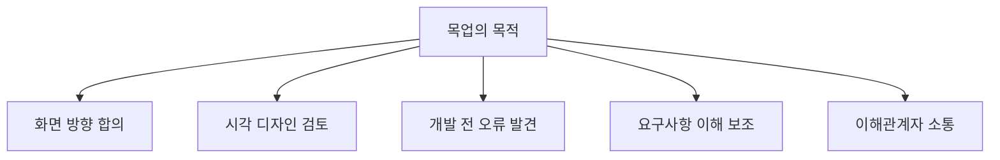

- 목업은 실제 개발 전에 화면의 모습과 배치를 검토하기 위해 사용한다.

- 목업의 장점:
  - 이해관계자가 최종 화면을 쉽게 상상할 수 있다.
  - 개발 전에 색상, 레이아웃, 문구, 구성 요소를 검토할 수 있다.
  - 요구사항이 화면에 제대로 반영되었는지 확인할 수 있다.
  - 디자이너, 개발자, 기획자 간 소통을 돕는다.
  - 구현 이후 큰 수정을 줄일 수 있다.

- 예:
  - 로그인 화면의 입력 항목과 버튼 위치를 검토한다.
  - 관리자 대시보드의 카드 배치와 표 구조를 확인한다.
  - 쇼핑몰 상품 상세 페이지의 이미지, 가격, 구매 버튼 위치를 확인한다.

- 시험 포인트:
  - 목업은 개발 전 시각적 검토와 의사소통을 위한 산출물이다.

---

## 7. 목업에 포함되는 요소

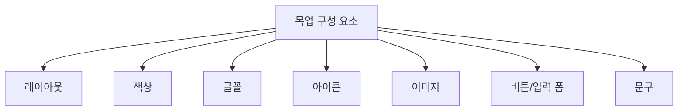

- 목업에는 실제 화면에 가까운 시각 요소가 포함된다.

- 주요 요소:
  - 화면 레이아웃
  - 버튼과 입력 폼
  - 색상
  - 글꼴
  - 아이콘
  - 이미지
  - 표, 카드, 메뉴
  - 안내 문구
  - 오류 메시지 예시

- 포함하지 않는 것:
  - 실제 데이터 처리 로직
  - 서버 연동
  - DB 저장
  - 실제 결제 처리
  - 완전한 화면 전환 로직

- 시험 포인트:
  - 목업은 시각적 구성 요소를 배치하지만 실제 구현은 아니다.

---

## 8. 목업의 충실도

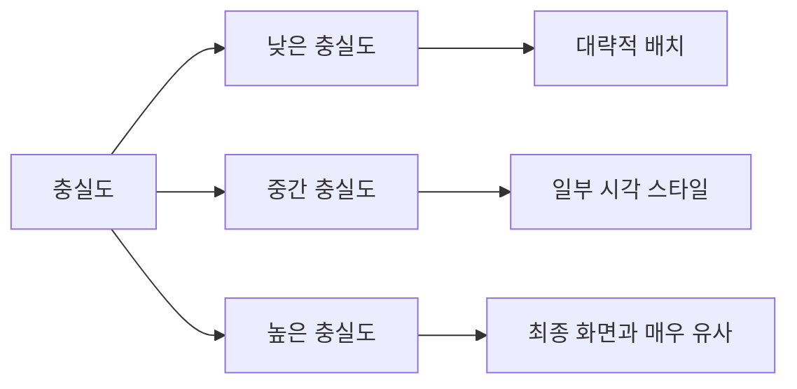

- 충실도는 산출물이 실제 제품과 얼마나 비슷한지를 의미한다.

- 낮은 충실도:
  - 화면 구조만 대략적으로 보여준다.
  - 와이어프레임에 가깝다.

- 중간 충실도:
  - 주요 레이아웃과 일부 스타일을 보여준다.

- 높은 충실도:
  - 최종 화면과 거의 유사하다.
  - 색상, 글꼴, 이미지, 간격, 버튼 스타일이 구체적이다.

- 시험 포인트:
  - 목업은 보통 와이어프레임보다 충실도가 높다.
  - 하지만 충실도가 높아도 정적이면 목업이다.

---

## 9. 목업과 구현의 차이

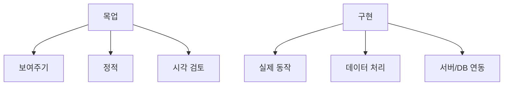

| 구분 | 목업 | 실제 구현 |
|---|---|---|
| 목적 | 화면을 시각적으로 검토 | 실제 기능 제공 |
| 동작 | 없음 | 있음 |
| 데이터 처리 | 없음 | 있음 |
| 서버 연동 | 없음 | 있음 |
| 수정 비용 | 낮음 | 상대적으로 높음 |

- 목업은 실제 화면처럼 보일 수 있지만 소프트웨어가 완성된 것은 아니다.
- 목업의 버튼은 보통 기능을 수행하지 않는다.
- 목업의 데이터는 실제 DB 데이터가 아니라 예시 데이터일 수 있다.

- 시험 포인트:
  - `실제로 구현되지는 않는다`는 PDF 문장이 핵심이다.

---

## 10. 목업과 사용자 인터페이스 원칙

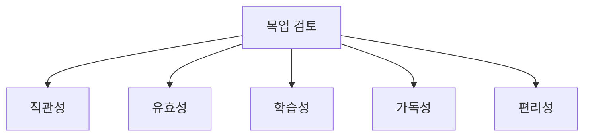

- 목업은 UI 원칙을 실제 구현 전 검토하는 데 도움이 된다.

- 검토 가능한 항목:
  - 버튼 의미가 직관적인가?
  - 사용자가 목적을 달성할 수 있는 흐름인가?
  - 초보자가 쉽게 배울 수 있는 구조인가?
  - 화면 글자와 정보가 읽기 쉬운가?
  - 자주 쓰는 기능이 편리한 위치에 있는가?

- 검토하기 어려운 항목:
  - 실제 응답 속도
  - 서버 오류 처리
  - 실제 데이터 흐름
  - 복잡한 상호작용

- 시험 포인트:
  - 목업은 UI의 시각적 구조와 이해도를 검토하는 데 적합하다.
  - 실제 동작 검증은 프로토타입이나 구현 단계가 더 적합하다.

---

## 11. 목업 제작 시점

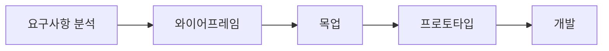

- 목업은 보통 요구사항 분석과 UI 설계 이후, 실제 개발 이전에 작성한다.
- 와이어프레임으로 구조를 정한 뒤 목업으로 시각 디자인을 구체화한다.
- 필요하면 목업 이후 프로토타입을 만들어 상호작용을 검증한다.

- 사용 시점:
  - 화면 구성 방향을 합의할 때
  - 디자인 스타일을 검토할 때
  - 이해관계자에게 결과 이미지를 보여줄 때
  - 개발자에게 UI 구현 기준을 전달할 때

- 시험 포인트:
  - 목업은 개발 이후 산출물이 아니라 구현 전 검토 산출물로 보는 것이 일반적이다.

---

## 12. 목업의 장단점

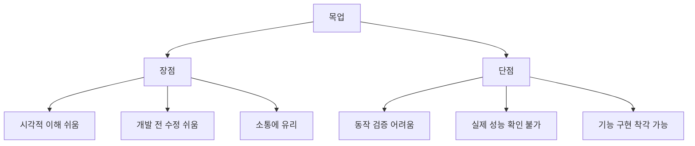

- 장점:
  - 실제 화면을 쉽게 상상할 수 있다.
  - 이해관계자 합의에 유리하다.
  - 구현 전 디자인 문제를 발견할 수 있다.
  - 개발자에게 화면 구현 기준을 제공한다.

- 단점:
  - 클릭이나 화면 전환이 실제로 동작하지 않는다.
  - 실제 사용 흐름을 완전히 검증하기 어렵다.
  - 성능, 오류 처리, 접근성 동작까지 확인하기 어렵다.
  - 이해관계자가 완성된 제품으로 착각할 수 있다.

- 시험 포인트:
  - 장점은 시각적 검토와 소통이다.
  - 한계는 실제 동작 검증이 어렵다는 점이다.

---

## 13. 목업 도구와 산출물 형태

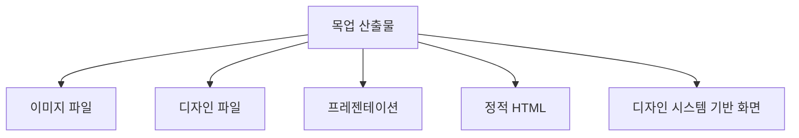

- 목업은 다양한 형태로 만들 수 있다.

- 산출물 형태:
  - 이미지 파일
  - 디자인 툴 파일
  - PDF
  - 프레젠테이션
  - 정적 HTML/CSS
  - 화면 명세서에 포함된 이미지

- 도구 예:
  - Figma
  - Sketch
  - Adobe XD
  - Balsamiq
  - PowerPoint
  - HTML/CSS 정적 시안

- 시험 포인트:
  - 어떤 도구로 만들었는지보다 `정적 화면 모형`이라는 성격이 중요하다.

---

## 14. 보기 판별 예시

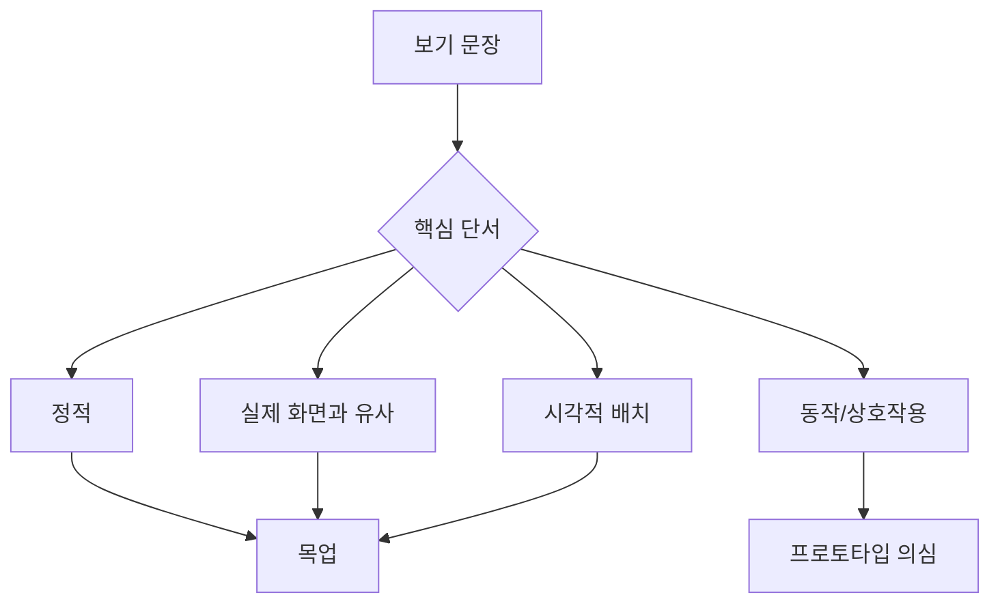

- 보기: `와이어프레임보다 좀 더 실제 화면과 유사하게 만든 정적인 형태의 모형이다.`
  - 정답: `목업`
  - 이유: PDF 핵심 문장이다.

- 보기: `시각적으로만 구성 요소를 배치하는 것으로 실제로 구현되지는 않는다.`
  - 정답: `목업`
  - 이유: 정적 시각 모형과 미구현이 핵심이다.

- 보기: `화면의 뼈대와 구조만 간단히 표현한다.`
  - 정답: `와이어프레임`
  - 이유: 구조 중심이다.

- 보기: `사용자가 버튼을 클릭하여 화면 전환 흐름을 테스트할 수 있다.`
  - 정답: `프로토타입`
  - 이유: 상호작용 검증이 핵심이다.

- 보기: `색상과 글꼴까지 포함하지만 실제 데이터 저장은 하지 않는다.`
  - 정답: `목업`
  - 이유: 시각 디자인은 포함하지만 실제 구현은 아니다.

---

## 15. 자주 나오는 함정

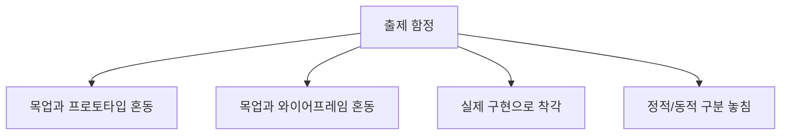

- 함정 1: 목업과 프로토타입 혼동
  - 목업은 정적이다.
  - 프로토타입은 상호작용을 검증할 수 있다.

- 함정 2: 목업과 와이어프레임 혼동
  - 와이어프레임은 구조와 배치 중심이다.
  - 목업은 실제 화면과 유사한 시각 디자인 중심이다.

- 함정 3: 목업을 실제 구현으로 착각
  - 목업은 실제로 구현되지 않는다.
  - 버튼, 입력, 데이터 처리는 실제 기능이 아니다.

- 함정 4: 충실도와 동작 여부를 혼동
  - 목업은 고충실도일 수 있지만 정적이면 목업이다.
  - 프로토타입은 저충실도라도 상호작용이 있으면 프로토타입이다.

---

## 16. 암기 포인트

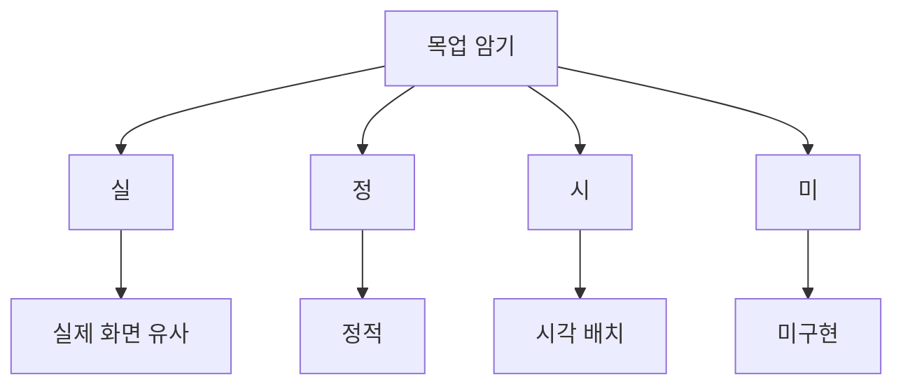

- 핵심 암기:
  - `목업 = 실제처럼 보이는 정적 화면 모형`
  - `보기는 실제처럼, 동작은 안 함`

- 비교 암기:
  - 와이어프레임 = 뼈대
  - 목업 = 정적 시각 디자인
  - 프로토타입 = 동적 상호작용

- 단서 암기:
  - 정적
  - 실제 화면 유사
  - 시각적 구성
  - 구현되지 않음
  - 동작하지 않음

- 최종 암기 문장:
  - `목업은 와이어프레임보다 실제 화면과 유사하게 만든 정적인 시각 모형이며, 실제 기능은 구현되지 않는다.`

---

## 17. 빠른 복습

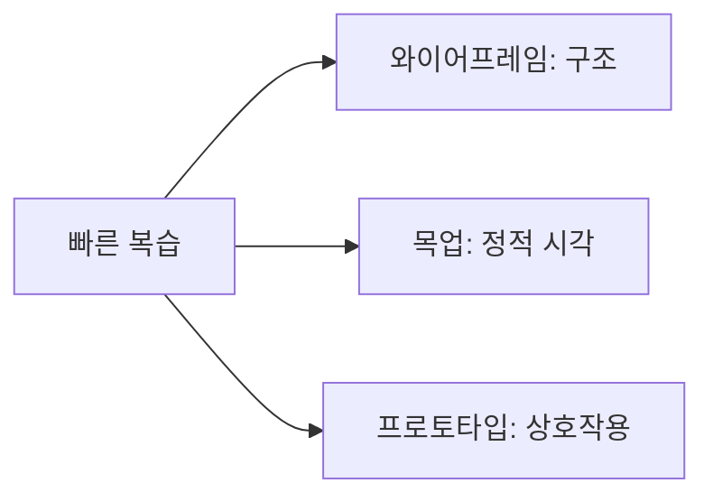

- 챕터명:
  - `023 목업`

- 소속 영역:
  - `UI`

- PDF 핵심 키워드:
  - `와이어프레임보다 실제 화면과 유사`
  - `정적인 형태`
  - `시각적으로만 구성 요소 배치`
  - `실제로 구현되지 않음`

- 문제 풀이 순서:
  - 지문에서 `정적`인지 `동적`인지 먼저 본다.
  - 실제 화면과 유사한 시각 모형이면 목업이다.
  - 구조만 있으면 와이어프레임이다.
  - 클릭/전환/상호작용이 있으면 프로토타입이다.

---

## 18. 참고 링크

- 기준 PDF: `/Users/nes0903/Documents/study/정보처리기사/핵심요약집_2026_정보처리기사필기핵심요약.pdf`
- [Q-Net 정보처리기사 종목 페이지](https://www.q-net.or.kr/crf005.do?id=crf00503s02&jmCd=1320&jmInfoDivCcd=B0)
- [UXPin - Prototype vs Wireframe vs Mockup](https://www.uxpin.com/studio/blog/prototypes-wireframes-mockup-difference/)
- [Aha! - Wireframe vs Mockup vs Prototype](https://www.aha.io/roadmapping/guide/product-management/wireframe-mockup-prototype)
- [Visual Paradigm - Wireframe vs Mockup vs Prototyping](https://www.visual-paradigm.com/guide/ux-design/wireframe-vs-storyboard-vs-wireflow-vs-mockup-vs-prototyping/)
- [Mockplus - Wireframe vs Mockup vs Prototype](https://www.mockplus.com/blog/post/what-is-a-wireframe-what-is-a-prototype)

<!-- study-links:start -->
## 관련 문서

- `요구사항 분석`: [[정보처리기사/1과목 소프트웨어 설계/009 요구사항 분석/009 요구사항 분석|009 요구사항 분석]]
- `css`: [[tailwindcss/tailwindcss|Tailwind CSS 상세 정리]]
<!-- study-links:end -->
