# 024 ISO/IEC 9126의 품질 특성

작성 기준일: 2026-05-03  
과목: `1과목 소프트웨어 설계`  
기준 PDF: `/Users/nes0903/Documents/study/정보처리기사/핵심요약집_2026_정보처리기사필기핵심요약.pdf`  
PDF 확인 위치: `4페이지`  
검색 보강: ISO/IEC 9126-1 공개 표준 정보, ISO/IEC 25010 품질 모델, ISO 25000 포털, SEI 품질 속성 자료를 함께 확인하여 시험 중심으로 확장 정리

---

## 1. 한 줄 요약

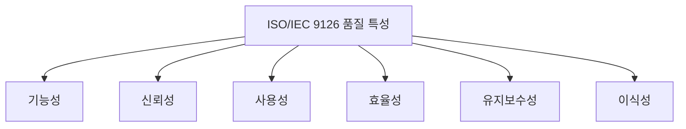

- ISO/IEC 9126은 소프트웨어 제품 품질을 평가하기 위한 품질 모델이며, 대표적으로 `기능성`, `신뢰성`, `사용성`, `효율성`, `유지보수성`, `이식성`의 6대 품질 특성으로 정리된다.
- PDF에는 특히 다음 4개가 직접 제시되어 있다.
  - 기능성
  - 신뢰성
  - 사용성
  - 이식성
- 시험 대비에서는 PDF 직접 항목 4개를 우선 암기하되, ISO/IEC 9126 전체 품질 모델의 6대 특성인 `기-신-사-효-유-이`까지 함께 외우는 것이 안전하다.

---

## 2. PDF 기준 핵심

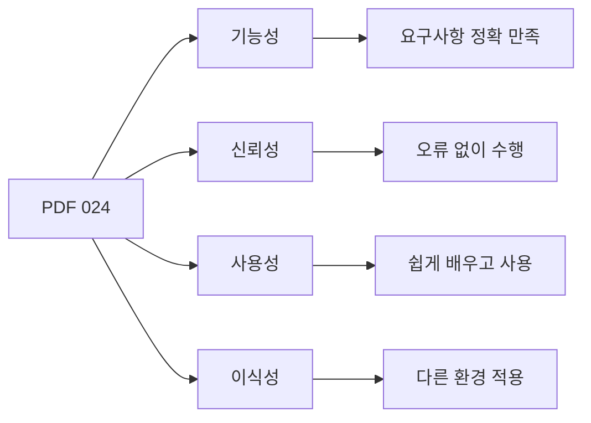

- PDF에서 직접 확인한 내용:
  - `기능성(Functionality)`: 요구사항을 정확하게 만족하는 기능을 제공하는지 여부
  - `신뢰성(Reliability)`: 요구된 기능을 오류 없이 수행할 수 있는 정도
  - `사용성(Usability)`: 사용자가 쉽게 배우고 사용할 수 있는 정도
  - `이식성(Portability)`: 다른 환경에서도 얼마나 쉽게 적용할 수 있는지 정도

- PDF에는 지면상 4개가 보이지만, ISO/IEC 9126 품질 모델의 대표 6대 특성은 다음과 같이 함께 기억한다.
  - `기능성`
  - `신뢰성`
  - `사용성`
  - `효율성`
  - `유지보수성`
  - `이식성`

- 암기:
  - `기-신-사-효-유-이`

---

## 3. ISO/IEC 9126의 위치

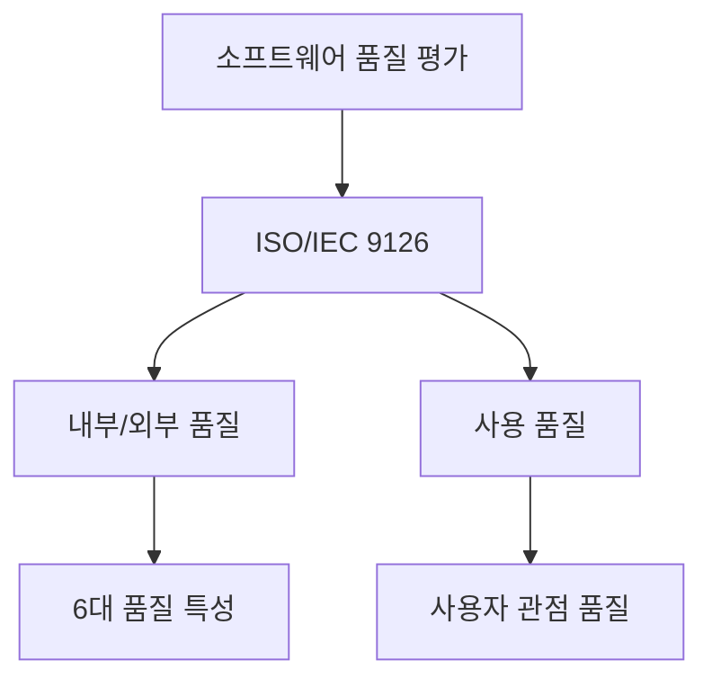

- ISO/IEC 9126은 소프트웨어 제품 품질을 체계적으로 평가하기 위한 국제 표준 계열이다.
- ISO/IEC 9126-1은 소프트웨어 제품 품질 모델을 다룬다.
- 공개 표준 정보 기준으로 ISO/IEC 9126-1은 내부 품질과 외부 품질을 6대 특성으로 분류한다.
- 이후 ISO/IEC 9126은 ISO/IEC 25010 등 SQuaRE 계열 품질 모델로 발전했다.

- 시험 대비 관점:
  - 정보처리기사에서는 여전히 ISO/IEC 9126 용어가 자주 등장한다.
  - 최신 표준의 세부 특성보다 9126의 6대 품질 특성과 정의를 우선 암기한다.

---

## 4. 6대 품질 특성 전체 비교

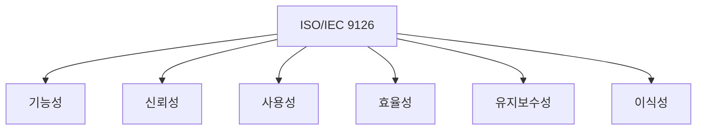

| 품질 특성 | 핵심 질문 | 시험 단서 |
|---|---|---|
| `기능성` | 필요한 기능을 제공하는가? | 요구사항 만족, 기능 제공, 정확성 |
| `신뢰성` | 오류 없이 안정적으로 동작하는가? | 장애, 고장, 복구, 오류 없음 |
| `사용성` | 사용자가 쉽게 배우고 사용할 수 있는가? | 배우기 쉬움, 조작 쉬움, 이해 쉬움 |
| `효율성` | 성능 대비 자원을 적절히 쓰는가? | 응답 시간, 처리량, 자원 사용 |
| `유지보수성` | 수정과 개선이 쉬운가? | 분석, 변경, 시험, 안정성 |
| `이식성` | 다른 환경으로 옮기기 쉬운가? | 환경 이전, 설치, 적응, 교체 |

- 구분 공식:
  - 기능성 = `해야 할 기능`
  - 신뢰성 = `오류 없이`
  - 사용성 = `쉽게 사용`
  - 효율성 = `성능/자원`
  - 유지보수성 = `수정 쉬움`
  - 이식성 = `환경 이전`

---

## 5. 기능성(Functionality)

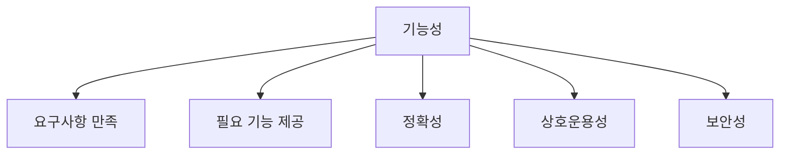

- 정의:
  - 기능성은 소프트웨어가 사용자의 명시적·묵시적 요구를 만족하는 기능을 제공하는 정도이다.
  - PDF에서는 `요구사항을 정확하게 만족하는 기능을 제공하는지 여부`라고 정리한다.

- 대표 하위 특성:
  - 적합성
  - 정확성
  - 상호운용성
  - 보안성
  - 기능성 준수성

- 예:
  - 쇼핑몰이 상품 검색, 장바구니, 결제, 주문 조회 기능을 제공한다.
  - 계산 프로그램이 요구된 계산식을 정확히 처리한다.
  - 외부 결제 시스템과 연동된다.
  - 권한 없는 사용자가 관리자 기능에 접근하지 못한다.

- 시험 포인트:
  - `요구사항 만족`, `필요 기능 제공`, `정확한 기능`이 나오면 기능성이다.

---

## 6. 신뢰성(Reliability)

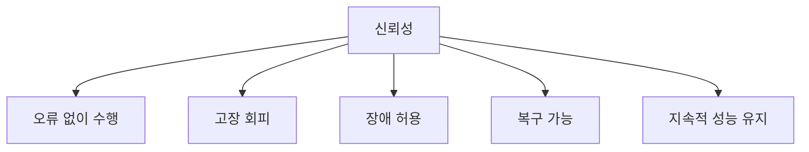

- 정의:
  - 신뢰성은 소프트웨어가 주어진 조건에서 요구된 기능을 일정 수준으로 유지하며 오류 없이 수행할 수 있는 정도이다.
  - PDF에서는 `요구된 기능을 오류 없이 수행할 수 있는 정도`라고 정리한다.

- 대표 하위 특성:
  - 성숙성
  - 결함 허용성
  - 복구성
  - 신뢰성 준수성

- 예:
  - 서비스가 장시간 중단 없이 동작한다.
  - 장애가 발생해도 자동으로 복구한다.
  - 일부 서버가 실패해도 전체 서비스가 계속된다.
  - 데이터 처리 중 오류가 발생해도 일관성을 유지한다.

- 시험 포인트:
  - `오류 없이`, `장애`, `복구`, `고장`, `지속 수행`이 나오면 신뢰성이다.

---

## 7. 사용성(Usability)

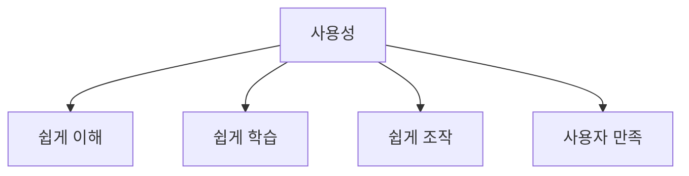

- 정의:
  - 사용성은 사용자가 소프트웨어를 쉽게 이해하고 배우며 사용할 수 있는 정도이다.
  - PDF에서는 `사용자가 쉽게 배우고 사용할 수 있는 정도`라고 정리한다.

- 대표 하위 특성:
  - 이해성
  - 학습성
  - 운용성
  - 친밀성/매력성
  - 사용성 준수성

- 예:
  - 초보자도 메뉴를 보고 기능을 쉽게 찾는다.
  - 오류 메시지가 이해하기 쉽다.
  - 화면 구조가 일관되어 빠르게 배울 수 있다.
  - 키보드와 스크린 리더로도 사용할 수 있다.

- 시험 포인트:
  - `쉽게 배우고 사용`, `사용자 친화`, `학습`, `조작`, `이해`가 나오면 사용성이다.

---

## 8. 효율성(Efficiency)

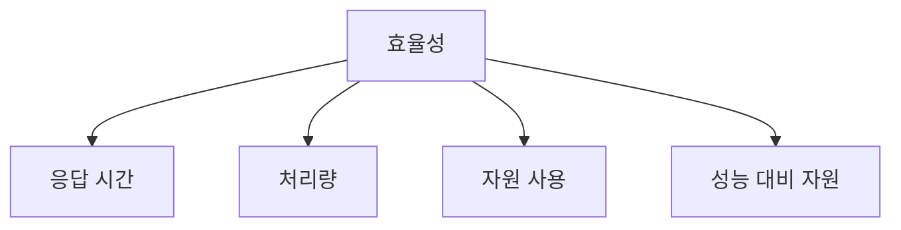

- 정의:
  - 효율성은 소프트웨어가 제공하는 성능과 사용하는 자원량의 관계가 적절한 정도이다.
  - 성능과 자원 사용을 함께 본다.

- 대표 하위 특성:
  - 시간 효율성
  - 자원 효율성
  - 효율성 준수성

- 예:
  - 검색 결과가 빠르게 표시된다.
  - 많은 요청을 짧은 시간에 처리한다.
  - CPU, 메모리, 네트워크 자원을 과도하게 쓰지 않는다.
  - 같은 기능을 더 적은 자원으로 처리한다.

- 시험 포인트:
  - `응답 시간`, `처리 시간`, `처리량`, `자원 사용`, `성능`이 나오면 효율성이다.

---

## 9. 유지보수성(Maintainability)

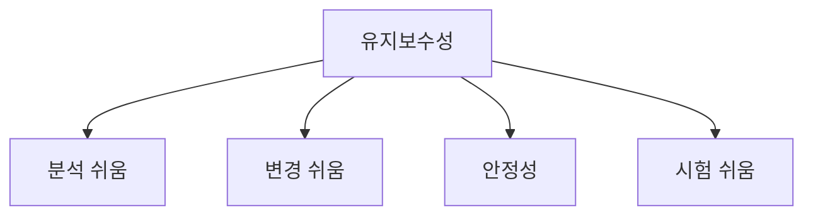

- 정의:
  - 유지보수성은 소프트웨어를 수정, 개선, 적응시키는 데 필요한 노력이 적은 정도이다.

- 대표 하위 특성:
  - 분석성
  - 변경성
  - 안정성
  - 시험성
  - 유지보수성 준수성

- 예:
  - 오류 원인을 빠르게 분석할 수 있다.
  - 요구사항 변경에 따라 코드를 쉽게 수정할 수 있다.
  - 한 부분을 수정해도 다른 부분에 영향이 적다.
  - 자동 테스트가 잘 갖추어져 있다.

- 시험 포인트:
  - `수정`, `변경`, `분석`, `테스트`, `유지보수`가 나오면 유지보수성이다.

---

## 10. 이식성(Portability)

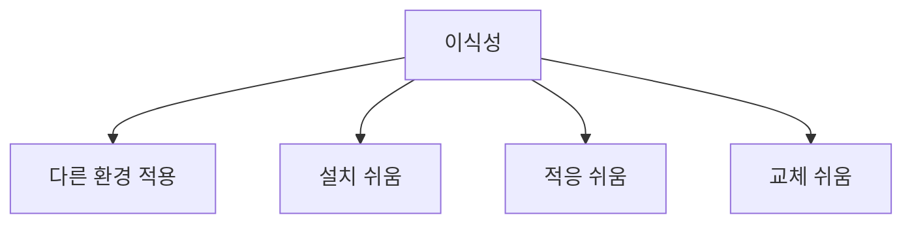

- 정의:
  - 이식성은 소프트웨어를 한 환경에서 다른 환경으로 쉽게 이전하거나 적용할 수 있는 정도이다.
  - PDF에서는 `다른 환경에서도 얼마나 쉽게 적용할 수 있는지 정도`라고 정리한다.

- 대표 하위 특성:
  - 적응성
  - 설치성
  - 공존성
  - 대체성
  - 이식성 준수성

- 예:
  - Windows에서 동작하던 프로그램을 Linux에서도 쉽게 실행한다.
  - 다른 DBMS로 전환하기 쉽다.
  - 클라우드 환경으로 이전하기 쉽다.
  - 설치와 배포가 간단하다.

- 시험 포인트:
  - `다른 환경`, `이전`, `설치`, `적용`, `플랫폼 변경`이 나오면 이식성이다.

---

## 11. PDF 직접 항목 4개 집중 비교

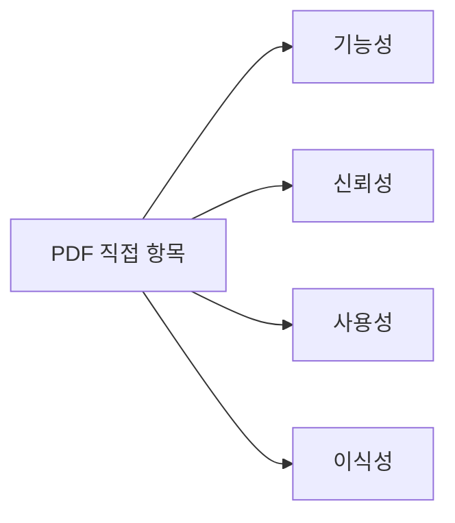

| 구분 | PDF 핵심 | 단서 |
|---|---|---|
| `기능성` | 요구사항을 정확하게 만족하는 기능 제공 | 요구사항, 기능 |
| `신뢰성` | 요구된 기능을 오류 없이 수행 | 오류 없음, 안정 |
| `사용성` | 사용자가 쉽게 배우고 사용 | 쉬움, 학습, 사용 |
| `이식성` | 다른 환경에서도 쉽게 적용 | 다른 환경, 이전 |

- 시험에서 PDF 문장을 그대로 바꾸어 낼 수 있다.
- 4개만 묻는 문제라면 위 표를 우선 적용한다.
- 전체 ISO/IEC 9126을 묻는 문제라면 효율성과 유지보수성도 포함한다.

---

## 12. ISO/IEC 9126과 ISO/IEC 25010

- ISO/IEC 9126은 과거 소프트웨어 제품 품질 모델로 널리 사용되었다.
- 이후 ISO/IEC 25010 등 SQuaRE 계열 표준으로 발전했다.
- ISO/IEC 25010은 기능 적합성, 성능 효율성, 호환성, 사용성, 신뢰성, 보안성, 유지보수성, 이식성 등 더 확장된 품질 모델을 제공한다.

- 시험 대비:
  - 정보처리기사에서 `ISO/IEC 9126`이라고 나오면 9126의 6대 특성을 기준으로 푼다.
  - `ISO/IEC 25010`이라고 나오면 최신 SQuaRE 품질 모델과 연결해 판단한다.
  - 두 표준이 완전히 같은 목록은 아니므로 문제의 표준명을 확인한다.

---

## 13. 품질 특성과 비기능 요구사항

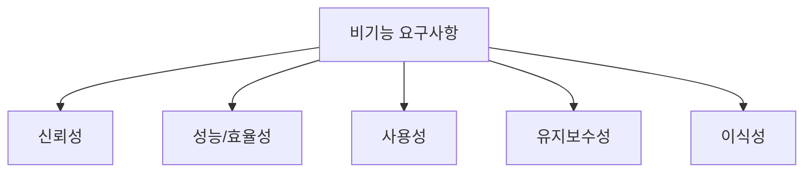

- ISO/IEC 9126 품질 특성은 비기능 요구사항과 직접 연결된다.
- 기능성은 기능 요구사항과도 연결되지만, 품질 평가 모델에서는 기능이 요구를 만족하는 정도로 다룬다.

- 예:
  - `로그인은 2초 이내 응답해야 한다` = 효율성/성능
  - `장애 발생 후 5분 이내 복구해야 한다` = 신뢰성
  - `초보자도 10분 안에 기본 기능을 익혀야 한다` = 사용성
  - `Linux와 Windows 모두에서 실행되어야 한다` = 이식성
  - `요구사항 변경 시 영향 범위가 작아야 한다` = 유지보수성

- 시험 포인트:
  - 품질 특성은 요구사항 분석의 비기능 요구사항과 함께 출제될 수 있다.

---

## 14. 보기 판별 예시

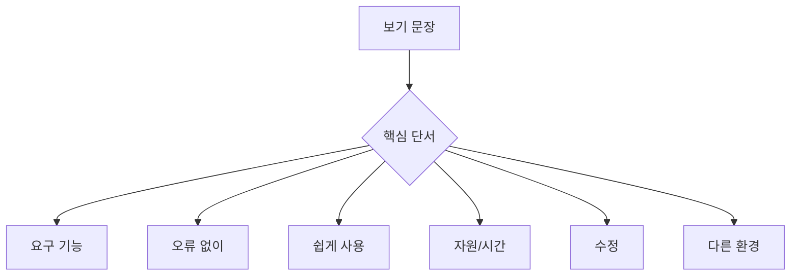

- 보기: `요구사항을 정확하게 만족하는 기능을 제공하는지 여부이다.`
  - 정답: `기능성`

- 보기: `요구된 기능을 오류 없이 수행할 수 있는 정도이다.`
  - 정답: `신뢰성`

- 보기: `사용자가 쉽게 배우고 사용할 수 있는 정도이다.`
  - 정답: `사용성`

- 보기: `정해진 조건에서 응답 시간과 자원 사용이 적절한 정도이다.`
  - 정답: `효율성`

- 보기: `소프트웨어를 수정하거나 개선하기 쉬운 정도이다.`
  - 정답: `유지보수성`

- 보기: `다른 운영체제나 환경으로 옮기기 쉬운 정도이다.`
  - 정답: `이식성`

---

## 15. 자주 나오는 함정

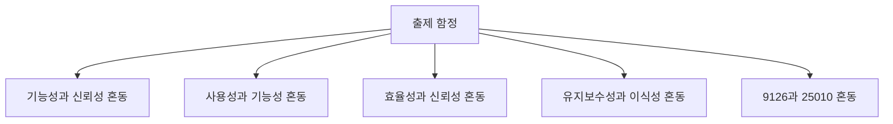

- 함정 1: 기능성과 신뢰성 혼동
  - 기능성은 필요한 기능을 제공하는가이다.
  - 신뢰성은 그 기능을 오류 없이 안정적으로 수행하는가이다.

- 함정 2: 사용성과 기능성 혼동
  - 기능성은 기능 자체의 제공 여부이다.
  - 사용성은 사용자가 쉽게 배우고 사용하는 정도이다.

- 함정 3: 효율성과 신뢰성 혼동
  - 효율성은 성능과 자원 사용이다.
  - 신뢰성은 오류 없이 안정적으로 수행하는 정도이다.

- 함정 4: 유지보수성과 이식성 혼동
  - 유지보수성은 수정과 개선의 쉬움이다.
  - 이식성은 다른 환경으로 옮기는 쉬움이다.

- 함정 5: ISO/IEC 9126과 ISO/IEC 25010 혼동
  - 9126은 `기-신-사-효-유-이`로 우선 암기한다.
  - 25010은 더 현대적인 SQuaRE 품질 모델이다.

---

## 16. 암기 포인트

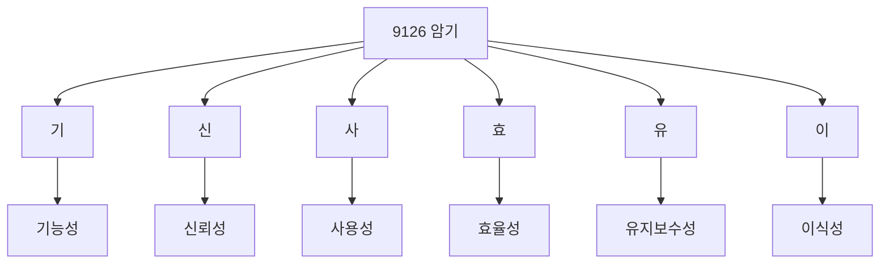

- 핵심 암기:
  - `기-신-사-효-유-이`

- 의미 암기:
  - 기능성 = 필요한 기능 제공
  - 신뢰성 = 오류 없이 안정 수행
  - 사용성 = 쉽게 배우고 사용
  - 효율성 = 성능과 자원
  - 유지보수성 = 수정 쉬움
  - 이식성 = 환경 이전 쉬움

- 최종 암기 문장:
  - `ISO/IEC 9126은 소프트웨어 품질을 기능성·신뢰성·사용성·효율성·유지보수성·이식성으로 평가하는 품질 모델이다.`

---

## 17. 빠른 복습

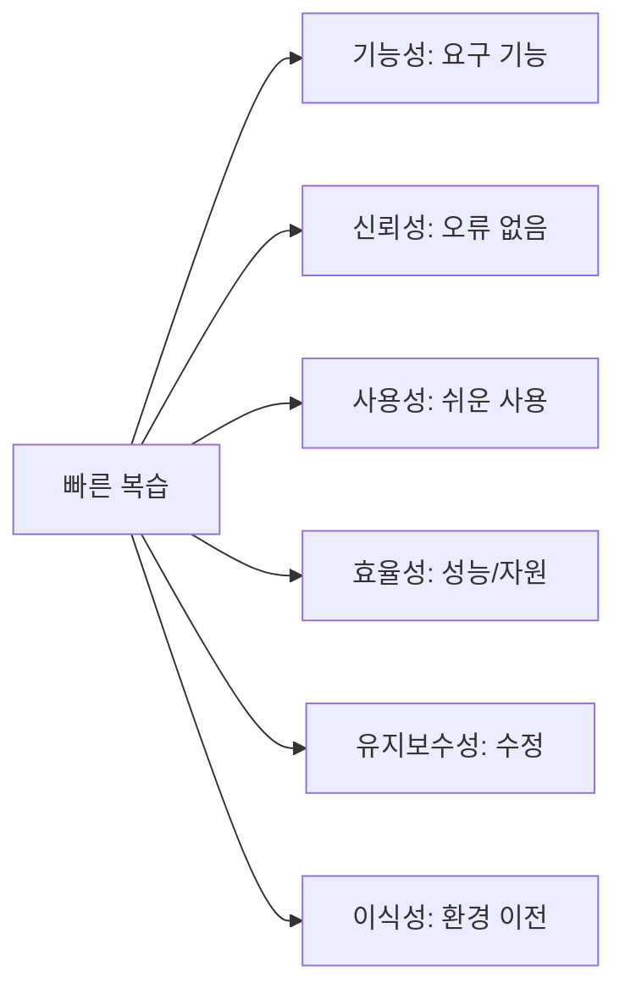

- 챕터명:
  - `024 ISO/IEC 9126의 품질 특성`

- 소속 영역:
  - `품질`

- PDF 핵심 키워드:
  - `기능성`
  - `신뢰성`
  - `사용성`
  - `이식성`

- 시험 확장 암기:
  - `기능성`, `신뢰성`, `사용성`, `효율성`, `유지보수성`, `이식성`

- 문제 풀이 순서:
  - 지문에서 핵심 단서어를 찾는다.
  - 기능, 오류, 사용, 성능/자원, 수정, 환경 이전 중 어디에 해당하는지 매칭한다.

---

## 18. 참고 링크

- 기준 PDF: `/Users/nes0903/Documents/study/정보처리기사/핵심요약집_2026_정보처리기사필기핵심요약.pdf`
- [Q-Net 정보처리기사 종목 페이지](https://www.q-net.or.kr/crf005.do?id=crf00503s02&jmCd=1320&jmInfoDivCcd=B0)
- [ISO/IEC 9126-1:2001 - Software engineering Product quality Quality model](https://standards.iteh.ai/catalog/standards/iso/d4ab62c2-7a1f-4586-b33d-25bcf8cf19c1/iso-iec-9126-1-2001)
- [ANSI - ISO/IEC 9126-1:2001](https://webstore.ansi.org/standards/iso/isoiec91262001)
- [ISO 25000 - ISO/IEC 25010](https://iso25000.com/index.php/en/iso-25000-standards/iso-25010)
- [SEI - Quality Attributes](https://www.sei.cmu.edu/library/quality-attributes/)

<!-- study-links:start -->
## 관련 문서

- `요구사항 분석`: [[정보처리기사/1과목 소프트웨어 설계/009 요구사항 분석/009 요구사항 분석|009 요구사항 분석]]
- `iec`: [[정보처리기사/5과목 정보시스템 구축 관리/242 ISO IEC 12207/242 ISO IEC 12207|242 ISO/IEC 12207]]
<!-- study-links:end -->
