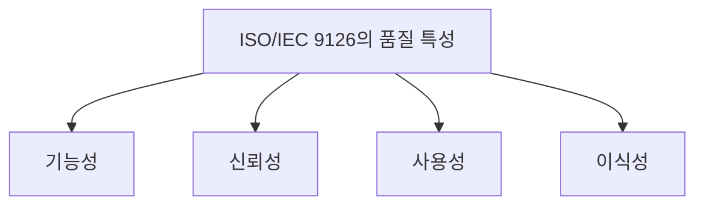

# 024 ISO/IEC 9126의 품질 특성

작성 기준일: 2026-05-02  
과목: `1과목 소프트웨어 설계`  
기준 PDF: `/Users/nes0903/Documents/study/정보처리기사/핵심요약집_2026_정보처리기사필기핵심요약.pdf`  
PDF 확인 위치: `4페이지`  
검색 보강: 공식/표준/고품질 참고 자료를 함께 확인하여 시험 중심으로 확장 정리

---

## 1. 한 줄 요약

- ISO/IEC 9126은 소프트웨어 품질을 기능성, 신뢰성, 사용성, 효율성, 유지보수성, 이식성 같은 특성으로 평가하는 품질 모델이다.
- 이 챕터는 `품질` 영역에 속한다.
- 시험에서는 정의, 핵심 키워드, 비슷한 개념과의 구분을 함께 묻는 경우가 많다.

---

## 2. PDF 기준 핵심

- 기능성: 요구사항을 정확하게 만족하는 기능을 제공하는지 여부
- 신뢰성: 요구된 기능을 오류 없이 수행할 수 있는 정도
- 사용성: 사용자가 쉽게 배우고 사용할 수 있는 정도
- 이식성: 다른 환경에서도 쉽게 적용할 수 있는 정도

- 위 항목은 PDF에서 직접 확인한 최소 암기 골격이다.
- 세부 설명은 이 골격을 기준으로 확장해서 이해하면 된다.

---

## 3. 개념 설명

- ISO/IEC 9126은 현재 ISO/IEC 25010 계열로 발전했지만 정보처리기사에서는 9126 용어가 자주 나온다.
- 기능성은 필요한 기능을 제공하는지, 신뢰성은 오류 없이 수행하는지, 사용성은 배우고 쓰기 쉬운지, 이식성은 다른 환경에 옮기기 쉬운지를 본다.
- 효율성은 성능과 자원 사용, 유지보수성은 수정과 분석의 쉬움으로 함께 기억한다.
- 품질 특성은 비기능 요구사항과 직접 연결된다.
- 시험에서는 각 품질 용어가 무엇을 평가하는지 사례로 구분해야 한다.

---

## 4. 핵심 포인트

- 문제를 풀 때는 먼저 지문 속 단서어를 찾고, 그 단서어가 어떤 개념을 가리키는지 연결한다.
- 정의형 문제는 표현이 조금 바뀌어도 핵심 의미가 같으면 같은 개념으로 판단한다.
- 옳고 그름 문제에서는 `항상`, `반드시`, `전혀`, `모두` 같은 극단 표현을 특히 조심한다.
- 이 챕터는 단독 암기보다 인접 챕터와 비교해 기억하면 정답률이 올라간다.

---

## 5. 시험에서 헷갈리는 비교

| 구분 | 핵심 |
|---|---|
| `기능성` | 필요 기능 제공 |
| `신뢰성` | 오류 없이 지속 수행 |
| `사용성` | 배우고 쓰기 쉬움 |
| `효율성` | 성능/자원 효율 |
| `유지보수성` | 수정 쉬움 |
| `이식성` | 환경 이전 쉬움 |

- 비교 문제는 이름보다 `역할`, `목적`, `사용 시점`, `장점/단점`을 기준으로 구분하면 안정적이다.

---

## 6. 예시 또는 암기 포인트

- 9126 대표 품질 특성은 `기-신-사-효-유-이`로 외운다.

- 암기는 단어만 외우기보다 `정의 -> 특징 -> 예시 -> 반대 개념` 순서로 묶는 것이 좋다.

---

## 7. 빠른 복습

- 챕터명: `024 ISO/IEC 9126의 품질 특성`
- 소속 영역: `품질`
- 자주 나오는 문제 유형:
  - 정의를 주고 개념명을 고르는 문제
  - 특징을 섞어 놓고 옳은/틀린 설명을 고르는 문제
  - 유사 개념과 비교하여 다른 하나를 찾는 문제

---

## 8. 참고 링크

- 기준 PDF: `/Users/nes0903/Documents/study/정보처리기사/핵심요약집_2026_정보처리기사필기핵심요약.pdf`
- [Q-Net 정보처리기사 종목 페이지](https://www.q-net.or.kr/crf005.do?id=crf00503s02&jmCd=1320&jmInfoDivCcd=B0)
- [ISO/IEC 25010 quality model summary](https://www.iso25000.com/index.php/en/iso-25000-standards/iso-25010/45-iso-iec-25010)
- [SEI - Quality Attribute Design Primitives](https://www.sei.cmu.edu/library/quality-attribute-design-primitives-and-the-attribute-driven-design-method/)
