# 025 소프트웨어 아키텍처의 설계 과정

작성 기준일: 2026-05-03  
과목: `1과목 소프트웨어 설계`  
기준 PDF: `/Users/nes0903/Documents/study/정보처리기사/핵심요약집_2026_정보처리기사필기핵심요약.pdf`  
PDF 확인 위치: `4페이지`  
검색 보강: SEI Attribute-Driven Design, SEI 품질 속성 자료, Microsoft 아키텍처 패턴 자료, Martin Fowler GUI Architecture 자료를 함께 확인하여 시험 중심으로 확장 정리

---

## 1. 한 줄 요약

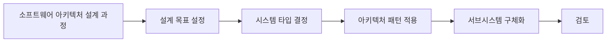

- 소프트웨어 아키텍처 설계는 시스템 전체 구조를 정하는 활동이며, PDF 기준 과정은 `설계 목표 설정 -> 시스템 타입 결정 -> 아키텍처 패턴 적용 -> 서브시스템 구체화 -> 검토`이다.
- 시험에서는 순서와 각 단계의 의미를 함께 묻는다.
- 암기어는 `목-타-패-서-검`이다.

---

## 2. PDF 기준 핵심

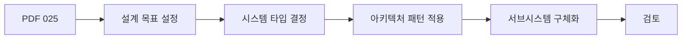

- PDF에서 직접 확인한 과정:
  - `설계 목표 설정`
  - `시스템 타입 결정`
  - `아키텍처 패턴 적용`
  - `서브시스템 구체화`
  - `검토`

- 이 챕터의 최소 암기 골격:
  - 먼저 목표를 정한다.
  - 그다음 시스템 타입을 결정한다.
  - 적절한 아키텍처 패턴을 적용한다.
  - 시스템을 서브시스템으로 나누고 구체화한다.
  - 마지막으로 설계 결과를 검토한다.

- 시험 단서:
  - 순서 문제는 `목-타-패-서-검`으로 푼다.
  - 아키텍처 설계는 코드 수준 구현보다 더 큰 구조 수준의 설계이다.

---

## 3. 소프트웨어 아키텍처의 의미

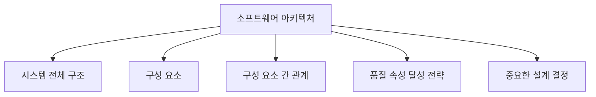

- 소프트웨어 아키텍처는 시스템을 구성하는 주요 요소와 그 관계, 그리고 중요한 설계 결정을 표현한다.
- 아키텍처는 시스템의 품질 속성에 큰 영향을 준다.
  - 성능
  - 보안
  - 신뢰성
  - 확장성
  - 유지보수성
  - 이식성

- SEI의 아키텍처 설계 관점에서는 품질 속성 요구사항이 아키텍처 결정에 큰 영향을 준다.
- 즉, 아키텍처는 단순한 모듈 배치도가 아니라 시스템이 요구 품질을 만족하도록 만드는 구조적 전략이다.

- 시험 포인트:
  - 아키텍처는 시스템 전체 구조 수준이다.
  - 클래스 하나나 함수 하나의 세부 구현보다 큰 설계 단위이다.

---

## 4. 전체 설계 과정 한눈에 보기

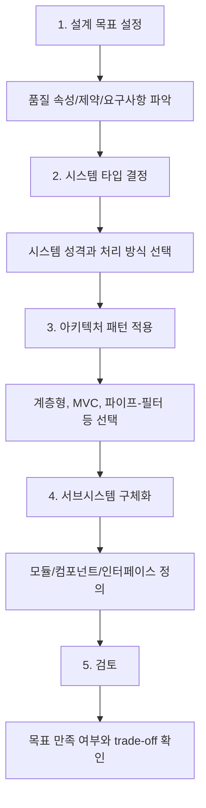

- 설계 과정은 선형으로 외우지만 실제 설계에서는 반복될 수 있다.
- 검토 단계에서 문제가 발견되면 앞 단계로 돌아가 목표, 타입, 패턴, 서브시스템을 조정할 수 있다.

- 핵심 흐름:
  - 목표를 알아야 적절한 시스템 타입을 정할 수 있다.
  - 시스템 타입을 알아야 적절한 아키텍처 패턴을 선택할 수 있다.
  - 패턴을 적용한 뒤 실제 서브시스템을 나누고 책임을 부여한다.
  - 검토를 통해 품질 목표와 요구사항 충족 여부를 확인한다.

- 시험 포인트:
  - 순서가 바뀌면 틀릴 수 있다.
  - 특히 `설계 목표 설정`이 먼저, `검토`가 마지막이다.

---

## 5. 1단계: 설계 목표 설정

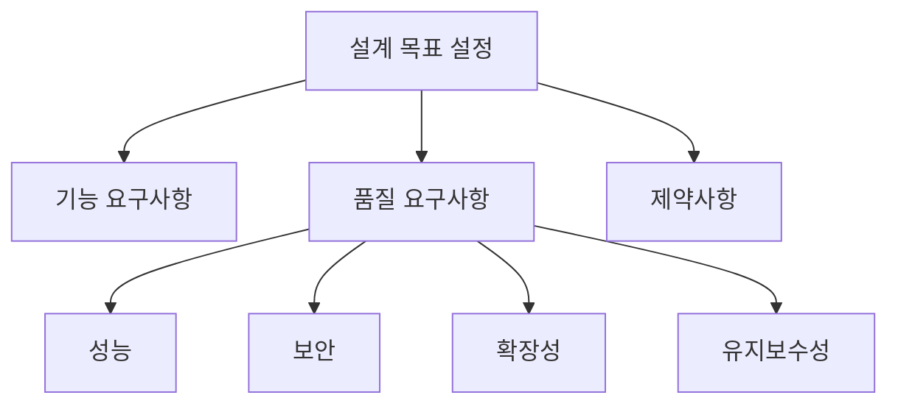

- 설계 목표 설정은 아키텍처가 달성해야 할 목표를 정하는 단계이다.
- 기능 요구사항뿐 아니라 품질 요구사항과 제약사항을 함께 고려한다.

- 설계 목표 예:
  - 동시에 10만 명이 접속해도 응답해야 한다.
  - 장애 발생 시 5분 안에 복구해야 한다.
  - 개인정보를 안전하게 보호해야 한다.
  - 기능을 쉽게 추가할 수 있어야 한다.
  - 모바일과 웹에서 모두 사용할 수 있어야 한다.

- 고려할 품질 속성:
  - 성능
  - 신뢰성
  - 가용성
  - 보안성
  - 유지보수성
  - 확장성
  - 이식성
  - 사용성

- 시험 포인트:
  - 아키텍처 설계는 설계 목표 설정에서 시작한다.
  - 설계 목표에는 품질 속성이 포함된다.

---

## 6. 2단계: 시스템 타입 결정

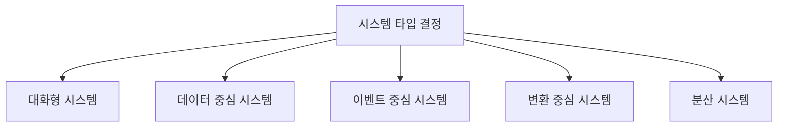

- 시스템 타입 결정은 시스템의 성격과 주요 처리 방식을 정하는 단계이다.
- 어떤 종류의 시스템인지에 따라 적합한 아키텍처 패턴과 설계 전략이 달라진다.

- 시스템 타입 예:
  - 대화형 시스템:
    - 사용자의 입력과 응답이 중심이다.
    - 예: 웹 서비스, 모바일 앱, 관리자 화면
  - 데이터 중심 시스템:
    - 데이터 저장, 조회, 관리가 중심이다.
    - 예: 업무 관리 시스템, 데이터 웨어하우스
  - 이벤트 중심 시스템:
    - 이벤트 발생과 처리가 중심이다.
    - 예: 알림 시스템, IoT 센서 처리
  - 변환 중심 시스템:
    - 입력 데이터를 여러 단계로 변환한다.
    - 예: 컴파일러, ETL 처리
  - 분산 시스템:
    - 여러 노드나 서비스가 협력한다.
    - 예: 마이크로서비스, 클라우드 시스템

- 시험 포인트:
  - 시스템 타입은 아키텍처 패턴 선택 전에 결정한다.
  - 시스템 타입은 구현 언어 선택보다 더 큰 구조적 판단이다.

---

## 7. 3단계: 아키텍처 패턴 적용

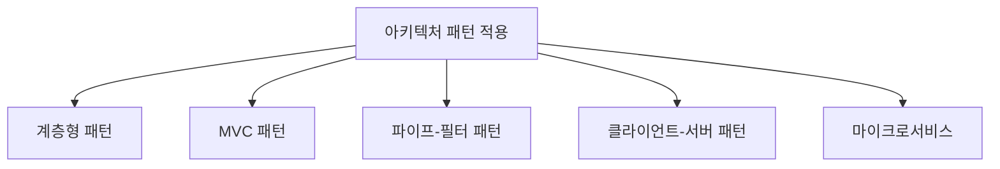

- 아키텍처 패턴은 반복적으로 나타나는 시스템 구조 문제에 대한 검증된 해결 방식이다.
- 시스템 타입과 설계 목표에 맞는 패턴을 선택해 전체 구조를 정한다.

- 대표 패턴:
  - 계층형 패턴:
    - 시스템을 표현 계층, 비즈니스 계층, 데이터 계층 등으로 분리한다.
  - MVC 패턴:
    - Model, View, Controller로 관심사를 분리한다.
  - 파이프-필터 패턴:
    - 데이터를 여러 필터가 단계적으로 처리하고 파이프로 전달한다.
  - 클라이언트-서버 패턴:
    - 클라이언트가 요청하고 서버가 서비스를 제공한다.
  - 이벤트 기반 패턴:
    - 이벤트를 발행하고 구독자가 처리한다.

- 패턴 적용의 효과:
  - 구조를 이해하기 쉬워진다.
  - 품질 속성을 달성하기 위한 기반을 제공한다.
  - 설계 경험을 재사용할 수 있다.
  - 유지보수와 확장 방향을 정하기 쉬워진다.

- 시험 포인트:
  - 아키텍처 패턴은 시스템 전체 구조 수준이다.
  - 디자인 패턴보다 큰 구조적 해결책이다.

---

## 8. 4단계: 서브시스템 구체화

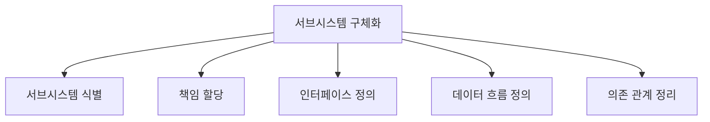

- 서브시스템 구체화는 아키텍처 패턴을 실제 시스템 구조로 나누고 세부 책임을 정하는 단계이다.

- 주요 활동:
  - 서브시스템을 식별한다.
  - 각 서브시스템의 책임을 정의한다.
  - 서브시스템 사이의 인터페이스를 정의한다.
  - 데이터 흐름과 제어 흐름을 정리한다.
  - 의존 관계를 정리한다.
  - 필요한 컴포넌트와 모듈을 나눈다.

- 예:
  - 쇼핑몰 시스템:
    - 회원 서브시스템
    - 상품 서브시스템
    - 주문 서브시스템
    - 결제 서브시스템
    - 배송 서브시스템

- 시험 포인트:
  - 서브시스템 구체화는 패턴을 적용한 뒤 실제 구성 요소와 책임을 자세히 나누는 단계이다.

---

## 9. 5단계: 검토

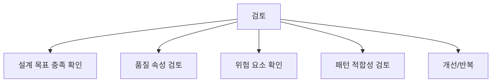

- 검토는 설계된 아키텍처가 목표와 요구사항을 만족하는지 확인하는 단계이다.

- 검토 항목:
  - 설계 목표를 충족하는가?
  - 기능 요구사항을 지원하는가?
  - 성능, 보안, 신뢰성, 유지보수성 요구를 만족하는가?
  - 선택한 아키텍처 패턴이 적절한가?
  - 서브시스템 간 의존성이 과도하지 않은가?
  - 확장과 변경이 쉬운가?
  - 위험 요소와 trade-off가 식별되었는가?

- SEI의 ATAM 같은 아키텍처 평가 방법은 품질 속성 간 trade-off를 검토하는 데 초점을 둔다.

- 시험 포인트:
  - 검토는 아키텍처 설계 과정의 마지막 단계이다.
  - 검토 결과에 따라 앞 단계로 돌아가 설계를 수정할 수 있다.

---

## 10. 설계 목표와 품질 속성

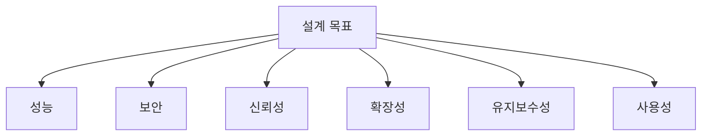

- 아키텍처 설계 목표는 품질 속성과 밀접하다.
- SEI 자료에서도 품질 속성 요구사항은 아키텍처 설계의 주요 동인으로 설명된다.

- 품질 속성 예:
  - 성능:
    - 응답 시간, 처리량
  - 보안:
    - 인증, 권한, 암호화
  - 신뢰성:
    - 장애 허용, 복구
  - 확장성:
    - 사용자 증가, 데이터 증가 대응
  - 유지보수성:
    - 변경 용이성, 모듈 분리
  - 사용성:
    - 사용자 목표 달성, 학습성

- 시험 포인트:
  - 설계 목표는 단순 기능 목록이 아니다.
  - 품질 목표가 아키텍처 패턴과 구조 결정에 영향을 준다.

---

## 11. 아키텍처 패턴과 디자인 패턴 비교

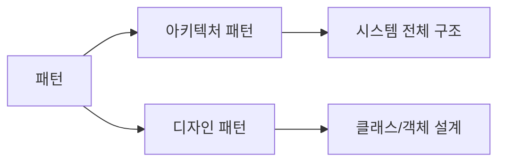

| 구분 | 아키텍처 패턴 | 디자인 패턴 |
|---|---|---|
| 적용 범위 | 시스템 전체 구조 | 클래스/객체 설계 수준 |
| 관심사 | 서브시스템, 계층, 컴포넌트, 통신 구조 | 객체 생성, 구조, 행위 |
| 예 | 계층형, MVC, 파이프-필터, 클라이언트-서버 | Singleton, Factory, Observer |
| 영향 | 품질 속성과 전체 구조에 큰 영향 | 세부 설계 유연성에 영향 |

- 시험 포인트:
  - 아키텍처 패턴은 더 큰 구조 수준이다.
  - 디자인 패턴은 더 세부적인 객체 설계 수준이다.

---

## 12. 과정별 산출물

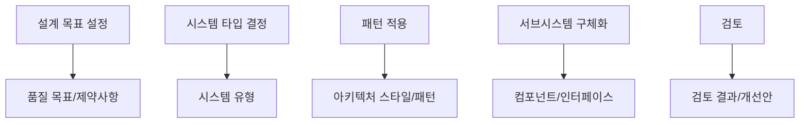

| 단계 | 주요 산출물 |
|---|---|
| 설계 목표 설정 | 품질 목표, 핵심 요구사항, 제약사항 |
| 시스템 타입 결정 | 시스템 유형, 처리 방식, 구조 방향 |
| 아키텍처 패턴 적용 | 선택한 패턴, 상위 구조 |
| 서브시스템 구체화 | 서브시스템 목록, 책임, 인터페이스 |
| 검토 | 검토 결과, 위험, trade-off, 수정 사항 |

- 시험 포인트:
  - 각 단계가 무엇을 만들어내는지 연결해서 외우면 순서 문제가 쉬워진다.

---

## 13. 예시: 쇼핑몰 아키텍처 설계

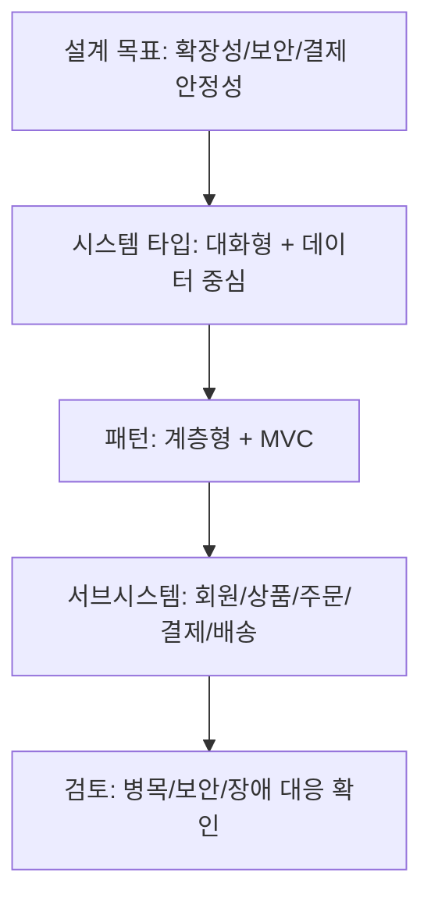

- 설계 목표 설정:
  - 많은 사용자가 동시에 접속해야 한다.
  - 결제 정보는 안전해야 한다.
  - 주문과 배송 상태를 안정적으로 처리해야 한다.

- 시스템 타입 결정:
  - 사용자가 화면을 통해 상호작용하는 대화형 시스템이다.
  - 상품, 주문, 결제 데이터를 많이 다루는 데이터 중심 시스템이다.

- 아키텍처 패턴 적용:
  - MVC로 화면, 입력 처리, 데이터 모델을 분리한다.
  - 계층형 구조로 표현 계층, 서비스 계층, 데이터 접근 계층을 나눈다.

- 서브시스템 구체화:
  - 회원, 상품, 주문, 결제, 배송 서브시스템으로 분리한다.

- 검토:
  - 주문 폭주 시 성능 병목이 있는지 확인한다.
  - 결제 장애 시 복구 전략이 있는지 확인한다.
  - 개인정보 접근 제어가 적절한지 확인한다.

---

## 14. 예시: 데이터 처리 시스템

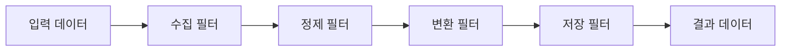

- 설계 목표 설정:
  - 대량 데이터를 안정적으로 처리한다.
  - 각 처리 단계를 독립적으로 수정할 수 있어야 한다.

- 시스템 타입 결정:
  - 변환 중심 또는 데이터 처리 중심 시스템이다.

- 아키텍처 패턴 적용:
  - 파이프-필터 패턴을 적용할 수 있다.

- 서브시스템 구체화:
  - 수집, 정제, 변환, 저장 필터로 나눈다.

- 검토:
  - 데이터 변환 오버헤드가 과도하지 않은지 확인한다.
  - 필터 간 인터페이스가 명확한지 확인한다.

- 시험 포인트:
  - 파이프-필터 패턴은 인접 029 챕터와 연결된다.

---

## 15. 순서 문제 판별

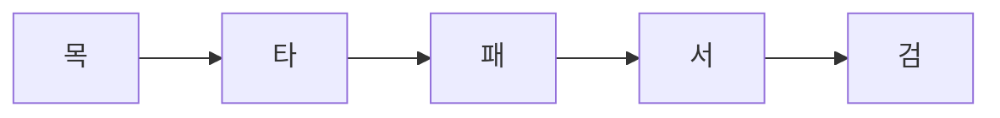

- 암기:
  - `목-타-패-서-검`
  - 목표, 타입, 패턴, 서브시스템, 검토

- 순서 논리:
  - 목표가 없으면 타입 선택 기준이 없다.
  - 타입을 알아야 적합한 패턴을 고를 수 있다.
  - 패턴이 있어야 서브시스템 구조를 구체화할 수 있다.
  - 구체화한 뒤 검토할 수 있다.

- 시험 포인트:
  - `검토`가 중간에 나오면 의심한다.
  - `아키텍처 패턴 적용`은 시스템 타입 결정 후이다.
  - `서브시스템 구체화`는 패턴 적용 후이다.

---

## 16. 보기 판별 예시

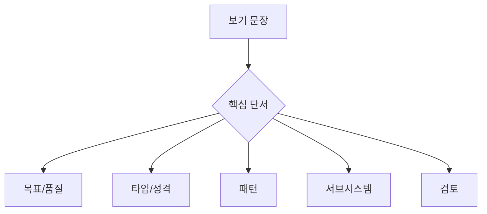

- 보기: `성능, 보안, 유지보수성 등 아키텍처가 달성해야 할 목표를 정한다.`
  - 정답: `설계 목표 설정`

- 보기: `시스템이 대화형인지 데이터 중심인지와 같은 큰 성격을 결정한다.`
  - 정답: `시스템 타입 결정`

- 보기: `계층형, MVC, 파이프-필터와 같은 검증된 구조를 선택한다.`
  - 정답: `아키텍처 패턴 적용`

- 보기: `시스템을 여러 구성 요소로 나누고 각 책임과 인터페이스를 정의한다.`
  - 정답: `서브시스템 구체화`

- 보기: `설계가 목표와 품질 요구사항을 만족하는지 확인한다.`
  - 정답: `검토`

---

## 17. 자주 나오는 함정

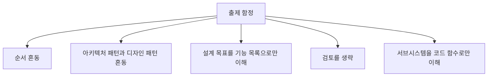

- 함정 1: 순서 혼동
  - 정답 순서는 `설계 목표 설정 -> 시스템 타입 결정 -> 아키텍처 패턴 적용 -> 서브시스템 구체화 -> 검토`이다.

- 함정 2: 아키텍처 패턴과 디자인 패턴 혼동
  - 아키텍처 패턴은 시스템 전체 구조 수준이다.
  - 디자인 패턴은 클래스와 객체 설계 수준이다.

- 함정 3: 설계 목표를 기능 목록으로만 이해
  - 설계 목표에는 성능, 보안, 확장성, 신뢰성 같은 품질 목표도 포함된다.

- 함정 4: 검토를 단순 문서 확인으로만 이해
  - 검토는 품질 목표 충족, trade-off, 위험 요소를 확인하는 활동이다.

- 함정 5: 서브시스템을 함수 수준으로만 이해
  - 서브시스템은 기능적으로 독립된 큰 구성 단위이다.

---

## 18. 암기 포인트

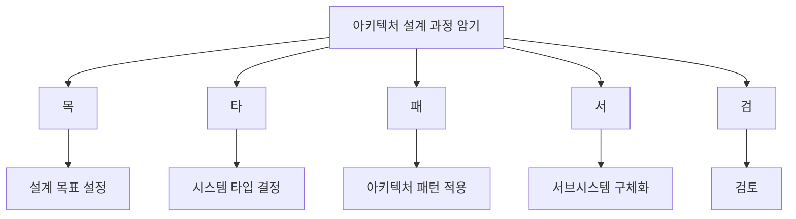

- 핵심 암기:
  - `목-타-패-서-검`

- 의미 암기:
  - 목표:
    - 무엇을 달성할 것인가
  - 타입:
    - 어떤 성격의 시스템인가
  - 패턴:
    - 어떤 구조를 적용할 것인가
  - 서브시스템:
    - 어떻게 나누고 연결할 것인가
  - 검토:
    - 목표를 만족하는가

- 최종 암기 문장:
  - `소프트웨어 아키텍처 설계 과정은 설계 목표 설정, 시스템 타입 결정, 아키텍처 패턴 적용, 서브시스템 구체화, 검토 순서로 진행된다.`

---

## 19. 빠른 복습

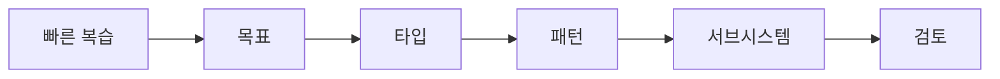

- 챕터명:
  - `025 소프트웨어 아키텍처의 설계 과정`

- 소속 영역:
  - `아키텍처`

- PDF 핵심 키워드:
  - `설계 목표 설정`
  - `시스템 타입 결정`
  - `아키텍처 패턴 적용`
  - `서브시스템 구체화`
  - `검토`

- 문제 풀이 순서:
  - 보기에서 단계 이름을 찾는다.
  - 순서를 `목-타-패-서-검`으로 정렬한다.
  - 패턴과 디자인 패턴을 구분한다.
  - 검토가 마지막임을 확인한다.

---

## 20. 참고 링크

- 기준 PDF: `/Users/nes0903/Documents/study/정보처리기사/핵심요약집_2026_정보처리기사필기핵심요약.pdf`
- [Q-Net 정보처리기사 종목 페이지](https://www.q-net.or.kr/crf005.do?id=crf00503s02&jmCd=1320&jmInfoDivCcd=B0)
- [SEI - Attribute-Driven Design Method Collection](https://www.sei.cmu.edu/library/attribute-driven-design-method-collection/)
- [SEI - Attribute-Driven Design ADD Version 2.0](https://www.sei.cmu.edu/library/attribute-driven-design-add-version-20/)
- [SEI - Quality Attributes](https://www.sei.cmu.edu/library/quality-attributes/)
- [SEI - Steps in an Architecture Tradeoff Analysis Method](https://sei.cmu.edu/library/steps-in-an-architecture-tradeoff-analysis-method-quality-attribute-models-and-analysis/)
- [Microsoft - Pipes and Filters pattern](https://learn.microsoft.com/en-us/azure/architecture/patterns/pipes-and-filters)
- [Microsoft - ASP.NET Core MVC overview](https://learn.microsoft.com/en-us/aspnet/core/mvc/overview)
- [Martin Fowler - GUI Architectures](https://martinfowler.com/eaaDev/uiArchs.html)
