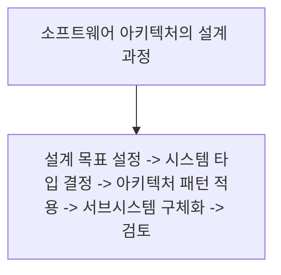

# 025 소프트웨어 아키텍처의 설계 과정

작성 기준일: 2026-05-02  
과목: `1과목 소프트웨어 설계`  
기준 PDF: `/Users/nes0903/Documents/study/정보처리기사/핵심요약집_2026_정보처리기사필기핵심요약.pdf`  
PDF 확인 위치: `4페이지`  
검색 보강: 공식/표준/고품질 참고 자료를 함께 확인하여 시험 중심으로 확장 정리

---

## 1. 한 줄 요약

- 소프트웨어 아키텍처 설계는 설계 목표를 정하고 시스템 타입과 아키텍처 패턴을 선택한 뒤 서브시스템을 구체화하고 검토하는 과정이다.
- 이 챕터는 `아키텍처` 영역에 속한다.
- 시험에서는 정의, 핵심 키워드, 비슷한 개념과의 구분을 함께 묻는 경우가 많다.

---

## 2. PDF 기준 핵심

- 설계 목표 설정 -> 시스템 타입 결정 -> 아키텍처 패턴 적용 -> 서브시스템 구체화 -> 검토

- 위 항목은 PDF에서 직접 확인한 최소 암기 골격이다.
- 세부 설명은 이 골격을 기준으로 확장해서 이해하면 된다.

---

## 3. 개념 설명

- 설계 목표는 성능, 보안, 확장성, 유지보수성 같은 품질 목표를 포함한다.
- 시스템 타입 결정은 대화형, 데이터 중심, 이벤트 중심 등 큰 구조 방향을 고르는 활동이다.
- 아키텍처 패턴 적용은 MVC, 계층형, 파이프-필터처럼 검증된 구조를 선택하는 활동이다.
- 서브시스템 구체화는 큰 구조를 모듈, 컴포넌트, 인터페이스로 나누는 단계다.
- 아키텍처는 시스템 전체 구조와 품질 속성을 좌우하는 큰 설계 결정이다.
- 아키텍처 패턴은 디자인 패턴보다 더 큰 구조 수준의 해결책이다.

---

## 4. 핵심 포인트

- 문제를 풀 때는 먼저 지문 속 단서어를 찾고, 그 단서어가 어떤 개념을 가리키는지 연결한다.
- 정의형 문제는 표현이 조금 바뀌어도 핵심 의미가 같으면 같은 개념으로 판단한다.
- 옳고 그름 문제에서는 `항상`, `반드시`, `전혀`, `모두` 같은 극단 표현을 특히 조심한다.
- 이 챕터는 단독 암기보다 인접 챕터와 비교해 기억하면 정답률이 올라간다.

---

## 5. 시험에서 헷갈리는 비교

| 구분 | 핵심 |
|---|---|
| `아키텍처 패턴` | 시스템 전체 구조 수준 |
| `디자인 패턴` | 클래스/객체 설계 문제 해결 수준 |

- 비교 문제는 이름보다 `역할`, `목적`, `사용 시점`, `장점/단점`을 기준으로 구분하면 안정적이다.

---

## 6. 예시 또는 암기 포인트

- 아키텍처 설계 과정은 `목-타-패-서-검`으로 외운다.

- 암기는 단어만 외우기보다 `정의 -> 특징 -> 예시 -> 반대 개념` 순서로 묶는 것이 좋다.

---

## 7. 빠른 복습

- 챕터명: `025 소프트웨어 아키텍처의 설계 과정`
- 소속 영역: `아키텍처`
- 자주 나오는 문제 유형:
  - 정의를 주고 개념명을 고르는 문제
  - 특징을 섞어 놓고 옳은/틀린 설명을 고르는 문제
  - 유사 개념과 비교하여 다른 하나를 찾는 문제

---

## 8. 참고 링크

- 기준 PDF: `/Users/nes0903/Documents/study/정보처리기사/핵심요약집_2026_정보처리기사필기핵심요약.pdf`
- [Q-Net 정보처리기사 종목 페이지](https://www.q-net.or.kr/crf005.do?id=crf00503s02&jmCd=1320&jmInfoDivCcd=B0)
- [SEI - Quality Attribute Design Primitives](https://www.sei.cmu.edu/library/quality-attribute-design-primitives-and-the-attribute-driven-design-method/)
- [Microsoft - Pipes and Filters pattern](https://learn.microsoft.com/en-us/azure/architecture/patterns/pipes-and-filters)
- [Microsoft - ASP.NET Core MVC overview](https://learn.microsoft.com/en-us/aspnet/core/mvc/overview)
- [Martin Fowler - GUI Architectures](https://martinfowler.com/eaaDev/uiArchs.html)
