# 026 모듈화

작성 기준일: 2026-05-02  
검색/보강일: 2026-05-09  
과목: `1과목 소프트웨어 설계`  
기준 PDF: `/Users/nes0903/Documents/study/정보처리기사/핵심요약집_2026_정보처리기사필기핵심요약.pdf`  
PDF 확인 위치: `4페이지`  
검색 보강: Q-Net, ISO/IEC 25010, IEEE SWEBOK, Parnas 모듈 분해 기준, SEI 유지보수성 자료, 응집도/결합도 참고 자료를 함께 확인하여 시험 중심으로 확장 정리

---

## 1. 한 줄 요약

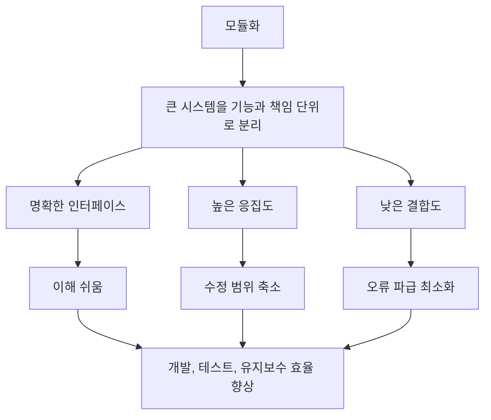

- 모듈화는 복잡한 소프트웨어를 독립성이 높은 기능/책임 단위로 나누고, 각 단위를 명확한 인터페이스로 연결하여 이해, 개발, 테스트, 유지보수, 재사용을 쉽게 만드는 설계 기법이다.
- 정보처리기사에서는 모듈화를 `인터페이스 단순화`, `효율적 관리`, `오류 파급 최소화`, `적절한 모듈 크기`, `높은 응집도`, `낮은 결합도`와 묶어서 이해해야 한다.
- ISO/IEC 25010 관점에서는 모듈성이 유지보수성의 하위 특성으로 다뤄지며, 한 컴포넌트 변경이 다른 컴포넌트에 미치는 영향을 작게 하는 구조가 핵심이다.
- Parnas의 정보 은닉 관점에서는 단순히 처리 순서대로 나누는 것이 아니라, 변경 가능성이 높은 설계 결정을 모듈 내부에 숨기도록 나누는 것이 더 좋은 모듈화 기준이다.

---

## 2. PDF 기준 핵심

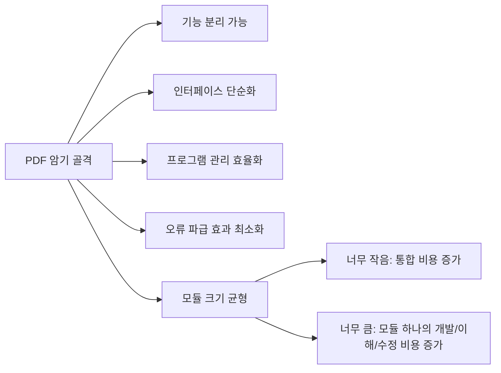

- PDF 직접 확인 핵심:
  - 기능의 분리가 가능하여 인터페이스가 단순해진다.
  - 프로그램의 효율적인 관리가 가능하다.
  - 오류의 파급 효과를 최소화할 수 있다.
  - 모듈 크기가 너무 작으면 통합 비용이 커진다.
  - 모듈 크기가 너무 크면 모듈 하나의 개발 비용이 커진다.

- 이 문장은 시험에서 그대로 또는 유사 표현으로 출제될 수 있다.
- `기능 분리`, `인터페이스 단순`, `관리 효율`, `오류 파급 최소`, `크기 균형`이 1차 암기 키워드다.
- 모듈화의 장점만 묻는 문제라면 `이해 용이`, `개발 분담`, `독립 테스트`, `재사용`, `유지보수 용이`도 함께 연결한다.
- 모듈화의 단점/주의점을 묻는 문제라면 `모듈 과다 분할`, `인터페이스 증가`, `통합 비용 증가`, `호출 관계 복잡화`를 떠올린다.

---

## 3. 왜 중요한가

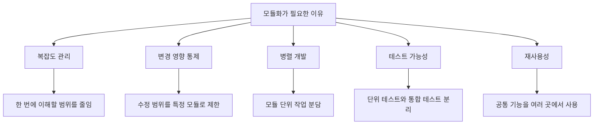

- 소프트웨어는 규모가 커질수록 전체를 한 번에 이해하기 어렵기 때문에, 이해 가능한 단위로 분해해야 한다.
- 모듈화는 변경이 발생했을 때 영향 범위를 좁힌다.
  - 예: `결제 수단 추가`가 결제 모듈 내부 변경으로 끝나면 좋은 모듈화다.
  - 반대로 주문, 회원, 쿠폰, 정산 코드 전체를 수정해야 하면 결합도가 높은 구조다.
- 모듈화는 개발 조직 관점에서도 중요하다.
  - 모듈별 담당자를 나누기 쉽다.
  - 모듈 단위로 코드 리뷰, 테스트, 배포 위험 분석을 할 수 있다.
  - 장애 발생 시 원인 후보를 좁히기 쉽다.
- 모듈화는 품질 속성과 직접 연결된다.
  - 유지보수성: 수정하기 쉽다.
  - 시험성: 모듈 단위 검증이 쉽다.
  - 재사용성: 독립 기능을 다른 시스템에서도 쓸 수 있다.
  - 이해성: 설계 구조를 파악하기 쉽다.

---

## 4. 핵심 개념 구조

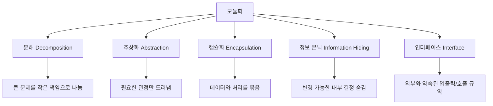

- 모듈화와 함께 이해해야 하는 개념:

| 개념 | 의미 | 모듈화와의 관계 | 시험 포인트 |
|---|---|---|---|
| `분해` | 큰 시스템을 작은 단위로 나눔 | 모듈화의 출발점 | 기능/책임 단위 분리 |
| `추상화` | 복잡한 내부를 감추고 핵심만 표현 | 모듈의 외부 사용 방식을 단순화 | 불필요한 세부사항 제거 |
| `캡슐화` | 데이터와 관련 연산을 하나로 묶음 | 내부 상태를 보호 | 객체지향과 자주 연결 |
| `정보 은닉` | 변경 가능성이 높은 내부 결정을 숨김 | 외부 영향 없이 내부 변경 가능 | Parnas의 핵심 기준 |
| `인터페이스` | 모듈 간 상호작용 규약 | 결합도를 낮추는 경계 | 입력, 출력, 호출 규약 |

- 좋은 모듈은 내부 구현은 숨기고 외부에는 필요한 사용 방법만 제공한다.
- 인터페이스가 단순할수록 다른 모듈은 내부 구현을 몰라도 사용할 수 있다.
- 정보 은닉이 잘되면 내부 자료구조, 알고리즘, 저장 방식이 바뀌어도 외부 모듈 수정이 줄어든다.

- 여기서 말하는 `인터페이스`는 화면 UI가 아니라, 모듈과 모듈이 서로 상호작용하기 위해 정한 약속이다.
- 모듈의 인터페이스에 포함되는 대표 요소:
  - 어떤 값을 입력으로 받아야 하는가
  - 어떤 결과를 출력하거나 반환하는가
  - 어떤 함수, 메서드, API를 호출해야 하는가
  - 오류나 예외는 어떻게 표현되는가
  - 반환값의 형식과 의미는 무엇인가
- 예를 들어 `결제 모듈`의 인터페이스는 다음처럼 생각할 수 있다.

```text
결제요청(주문번호, 금액, 결제수단) -> 결제결과
```

- `주문 모듈`은 위와 같은 `결제 요청` 인터페이스만 알면 된다.
- `주문 모듈`은 결제 모듈 내부에서 PG사 API를 어떻게 호출하는지, 인증키를 어떻게 붙이는지, 응답을 어떻게 파싱하는지는 몰라도 된다.
- 따라서 `인터페이스가 단순해진다`는 말은 모듈끼리 필요한 정보만 명확하게 주고받게 된다는 뜻이다.
- 시험식으로 정리하면 `인터페이스 = 모듈 간 상호작용 규약`이고, `단순한 인터페이스 = 필요한 입력/출력만 주고받는 구조`다.

---

## 5. 좋은 모듈의 판단 기준

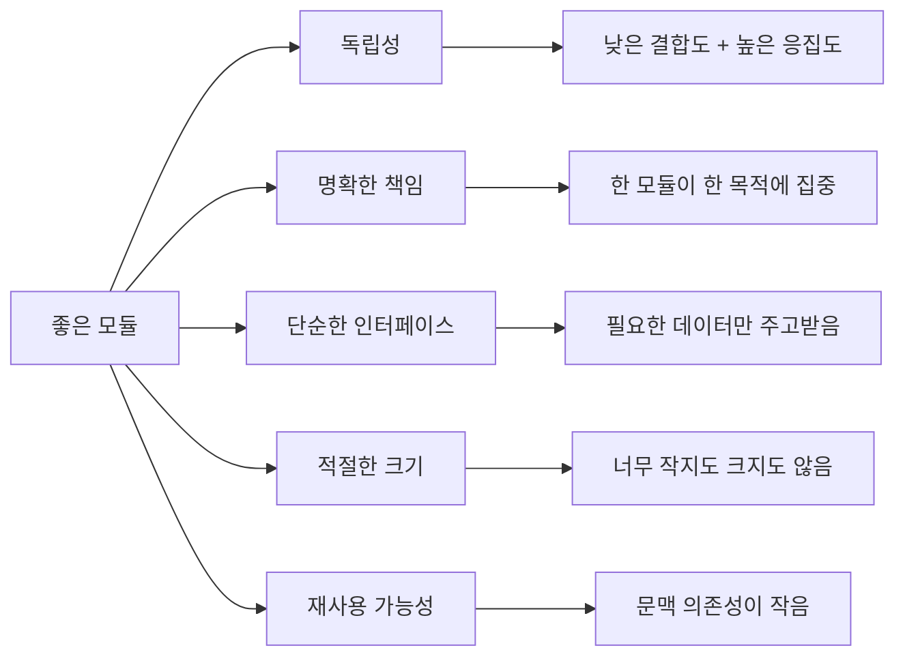

- 좋은 모듈의 핵심은 `독립성`이다.
- 독립성이 높은 모듈:
  - 내부 기능들이 하나의 목적에 잘 모여 있다.
  - 다른 모듈의 내부 구현에 의존하지 않는다.
  - 입력과 출력이 명확하다.
  - 변경 시 영향 범위가 작다.
  - 단독 컴파일, 단독 테스트, 재사용이 쉽다.

- 독립성은 보통 두 축으로 판단한다.

| 판단 축 | 좋은 방향 | 나쁜 방향 | 의미 |
|---|---|---|---|
| `응집도` | 높을수록 좋음 | 낮을수록 나쁨 | 모듈 내부 요소들이 하나의 목적에 얼마나 관련되는가 |
| `결합도` | 낮을수록 좋음 | 높을수록 나쁨 | 모듈 간 의존성이 얼마나 강한가 |

- 시험에서 가장 중요한 문장:
  - 좋은 모듈 설계는 `응집도는 높이고 결합도는 낮추는 것`이다.
  - 모듈화는 `복잡도를 낮추지만`, 너무 잘게 나누면 `통합 비용`이 증가한다.
  - 모듈의 독립성이 높으면 `오류 파급`, `수정 영향`, `테스트 범위`가 줄어든다.

---

## 6. 응집도 Cohesion

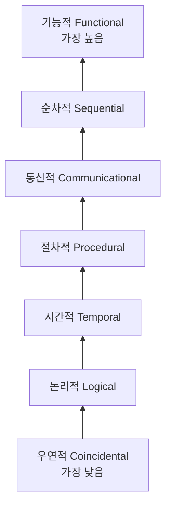

- 응집도는 모듈 내부 구성 요소들이 얼마나 밀접하게 관련되어 있는지를 나타낸다.
- 응집도는 `높을수록 좋다`.
- 정보처리기사에서 자주 쓰는 강도 순서:
  - 낮음 -> 높음: `우연적 < 논리적 < 시간적 < 절차적 < 통신적 < 순차적 < 기능적`
  - 높음 -> 낮음: `기능적 > 순차적 > 통신적 > 절차적 > 시간적 > 논리적 > 우연적`

| 응집도 | 강도 | 설명 | 예시 | 시험 판단 |
|---|---:|---|---|---|
| `기능적 응집도` | 최고 | 모듈 내부 모든 요소가 하나의 명확한 기능 수행에 필요 | `세금 계산`, `비밀번호 해시 생성` | 가장 좋은 응집도 |
| `순차적 응집도` | 높음 | 한 작업의 출력이 다음 작업의 입력이 됨 | `파일 읽기 -> 파싱 -> 검증` | 데이터 흐름이 단서 |
| `통신적 응집도` | 중상 | 같은 입력 자료나 같은 출력 자료를 다룸 | `회원 정보 조회 후 회원 정보 출력` | 같은 데이터가 단서 |
| `절차적 응집도` | 중간 | 정해진 순서대로 수행되어야 해서 묶임 | `권한 확인 후 파일 열기` | 순서가 단서 |
| `시간적 응집도` | 낮음 | 특정 시점에 함께 수행됨 | `초기화`, `종료 처리` | 시작/종료/동시 실행이 단서 |
| `논리적 응집도` | 낮음 | 논리적으로 비슷한 종류라 묶였지만 기능은 다름 | `입력 처리 모듈이 키보드/파일/네트워크 입력을 모두 처리` | 선택 플래그가 단서 |
| `우연적 응집도` | 최저 | 관련 없는 기능이 우연히 한 모듈에 있음 | `출력, 문자열 뒤집기, 이메일 확인이 한 모듈` | 가장 나쁜 응집도 |

- 응집도 암기법:
  - `우논시절통순기`
  - 낮은 것부터 외우면 `우연히 논 시간에 절차 통과 순기능`.
  - 시험에서는 보통 `기능적 응집도`가 가장 좋고 `우연적 응집도`가 가장 나쁘다는 판단이 먼저다.

- 응집도 판단 요령:
  - 모듈 이름이 한 문장으로 명확하면 응집도가 높을 가능성이 크다.
  - `관리`, `처리`, `유틸`, `공통`처럼 범위가 넓은 이름은 응집도가 낮을 가능성이 있다.
  - 같은 데이터만 다룬다고 항상 기능적 응집도는 아니다. 같은 데이터면 보통 통신적 응집도 단서다.
  - 순서만 같다고 기능적 응집도는 아니다. 순서가 핵심이면 절차적 응집도 단서다.

---

## 7. 결합도 Coupling

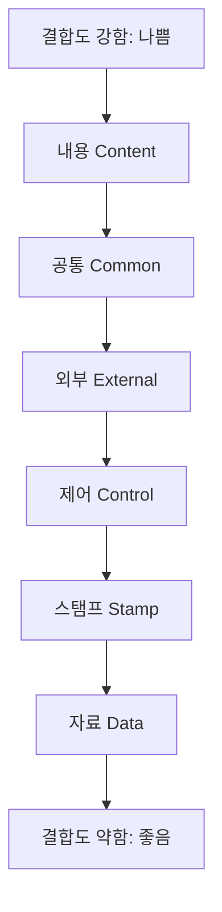

- 결합도는 모듈과 모듈 사이의 의존성 정도를 나타낸다.
- 결합도는 `낮을수록 좋다`.
- 정보처리기사에서 자주 쓰는 강도 순서:
  - 강함 -> 약함: `내용 > 공통 > 외부 > 제어 > 스탬프 > 자료`
  - 약함 -> 강함: `자료 < 스탬프 < 제어 < 외부 < 공통 < 내용`

| 결합도 | 강도 | 설명 | 예시 | 시험 판단 |
|---|---:|---|---|---|
| `내용 결합도` | 최악 | 한 모듈이 다른 모듈의 내부 내용, 코드, 데이터를 직접 참조/수정 | 다른 모듈 내부 변수 직접 변경 | 가장 나쁜 결합도 |
| `공통 결합도` | 매우 강함 | 여러 모듈이 전역 데이터, 공통 데이터 영역을 공유 | global 변수, shared memory 남용 | 변경 영향 추적 어려움 |
| `외부 결합도` | 강함 | 외부 장치, 파일 형식, 프로토콜, 외부 인터페이스에 함께 의존 | 특정 파일 포맷에 여러 모듈이 의존 | 외부 형식 변경에 취약 |
| `제어 결합도` | 중간 | 제어 플래그나 명령 값을 넘겨 다른 모듈의 흐름을 결정 | `mode=PRINT`에 따라 내부 분기 | 호출자가 내부 로직을 앎 |
| `스탬프 결합도` | 약함 | 필요한 일부 데이터만 쓰는데 전체 자료구조를 전달 | 회원 객체 전체 전달 후 이름만 사용 | 불필요 정보 노출 |
| `자료 결합도` | 최선 | 필요한 데이터만 매개변수로 전달 | `calculate(price, rate)` | 가장 좋은 결합도 |

- 결합도 암기법:
  - `내공외제스자`
  - 강한 것부터 외우면 `내용-공통-외부-제어-스탬프-자료`.
  - 시험에서는 `자료 결합도`가 가장 좋고 `내용 결합도`가 가장 나쁘다.

- 결합도 판단 요령:
  - 다른 모듈의 내부를 알수록 결합도가 높다.
  - 전역 데이터나 공통 저장소를 직접 공유할수록 결합도가 높다.
  - 필요한 값만 매개변수로 주고받으면 결합도가 낮다.
  - 전체 구조체/객체를 넘겨 놓고 일부 필드만 쓰면 스탬프 결합도 단서다.
  - 플래그로 호출 대상 모듈의 동작을 바꾸면 제어 결합도 단서다.

---

## 8. Fan-in과 Fan-out

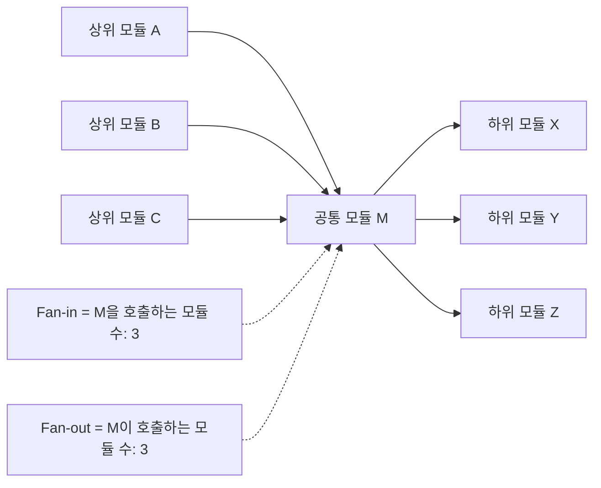

- Fan-in:
  - 어떤 모듈을 호출하거나 제어하는 상위 모듈의 수다.
  - `나를 부르는 모듈 수`로 기억한다.
  - Fan-in이 높으면 재사용성이 높거나 공통 모듈일 가능성이 있다.
  - 단, 너무 높으면 해당 모듈 장애가 여러 기능에 영향을 주는 집중 지점이 될 수 있다.

- Fan-out:
  - 어떤 모듈이 호출하거나 제어하는 하위 모듈의 수다.
  - `내가 부르는 모듈 수`로 기억한다.
  - Fan-out이 높으면 한 모듈이 너무 많은 일을 조정하거나 많은 의존성을 가질 수 있다.
  - 일반적으로 불필요한 Fan-out은 낮추는 것이 좋다.

- 시험용 판단:

| 지표 | 의미 | 일반적으로 좋은 방향 | 주의점 |
|---|---|---|---|
| `Fan-in` | 자신을 호출하는 모듈 수 | 적절히 높으면 재사용성 좋음 | 너무 높으면 장애 파급 지점 |
| `Fan-out` | 자신이 호출하는 모듈 수 | 낮을수록 복잡도 감소 | 너무 낮으면 필요한 분해가 안 되었을 수도 있음 |

- 단순 암기:
  - `Fan-in = 들어오는 화살표 수`
  - `Fan-out = 나가는 화살표 수`
  - 독립성 높은 구조는 보통 `Fan-in은 높이고 Fan-out은 낮춘다`고 표현한다.
  - 다만 실제 설계에서는 숫자 하나만 보지 않고, 모듈 책임과 호출 이유를 함께 봐야 한다.

---

## 9. 모듈 크기와 트레이드오프

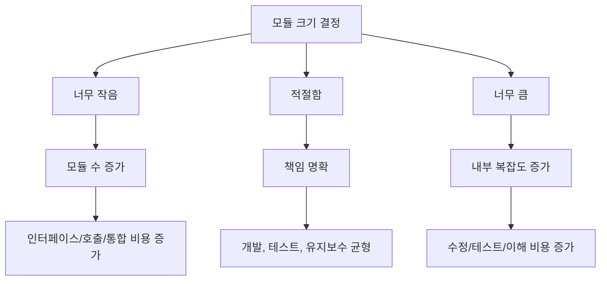

- 모듈화는 무조건 작게 나누는 것이 아니다.
- 모듈이 너무 작을 때:
  - 모듈 수가 과도하게 증가한다.
  - 모듈 간 인터페이스가 많아진다.
  - 호출 관계와 통합 테스트가 복잡해진다.
  - 단순 기능도 여러 파일/함수를 따라가야 해서 이해 비용이 커질 수 있다.

- 모듈이 너무 클 때:
  - 한 모듈이 여러 책임을 갖는다.
  - 내부 조건문과 상태가 복잡해진다.
  - 수정 시 사이드 이펙트가 커진다.
  - 단위 테스트가 어려워진다.
  - 재사용성이 낮아진다.

- 적절한 모듈 크기 판단 기준:
  - 모듈 이름이 책임을 정확히 설명하는가?
  - 외부 인터페이스가 단순한가?
  - 변경 이유가 하나 또는 소수로 제한되는가?
  - 내부 요소들이 같은 목적을 향하는가?
  - 다른 모듈 내부 구현을 몰라도 사용할 수 있는가?

- 시험 표현으로 정리:
  - `너무 작다` -> 통합 비용 증가
  - `너무 크다` -> 모듈 자체의 개발/수정/이해 비용 증가
  - `적절하다` -> 독립성, 재사용성, 유지보수성 향상

---

## 10. 모듈 분해 기준

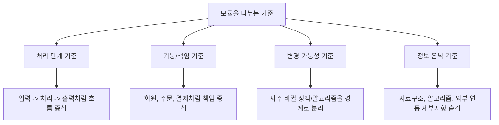

- 단순한 프로그램은 처리 순서대로 모듈을 나눠도 충분할 수 있다.
- 규모가 커질수록 처리 순서 중심 분해는 변경에 취약해질 수 있다.
  - 예: `입력 -> 처리 -> 출력` 기준으로만 나누면 자료구조 변경이 여러 단계에 퍼질 수 있다.
- Parnas의 관점에서 좋은 모듈 분해는 `변경될 가능성이 높은 설계 결정`을 모듈 내부에 숨기는 것이다.
  - 자료 저장 방식
  - 정렬 알고리즘
  - 외부 API 호출 방식
  - 파일 포맷
  - 계산 정책
  - 권한 판단 규칙

- 실무형 예시:

| 변경 가능 설계 결정 | 좋지 않은 분해 | 더 나은 분해 |
|---|---|---|
| 정렬 알고리즘 | 여러 화면에서 직접 정렬 구현 | `SortPolicy` 또는 정렬 모듈로 숨김 |
| 결제 API | 주문 모듈이 PG사 API 직접 호출 | 결제 모듈/인터페이스로 감춤 |
| 저장 구조 | 여러 모듈이 DB 테이블 구조 직접 참조 | Repository/DAO 등 접근 모듈로 캡슐화 |
| 할인 정책 | 주문, 쿠폰, 결제에 정책 중복 | 할인 정책 모듈로 분리 |

- 시험에서는 깊은 설계 이론보다 다음 문장을 기억하면 충분하다.
  - `처리 순서만으로 나누는 것보다, 변경 가능성이 높은 내부 결정을 숨기도록 나누는 것이 더 안정적이다.`

---

## 11. 모듈화 설계 절차

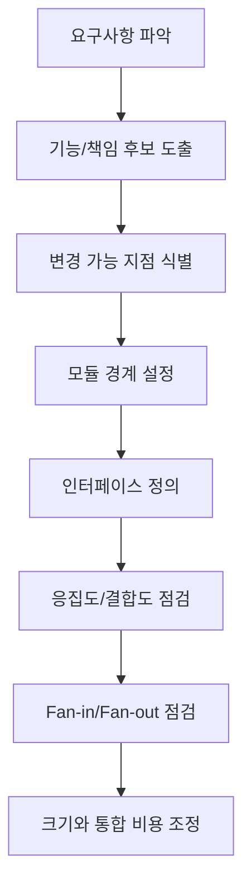

- 모듈화 설계는 보통 다음 순서로 생각한다.

1. 요구사항 파악
   - 어떤 기능이 필요한지 확인한다.
   - 어떤 품질 속성이 중요한지 확인한다.
   - 예: 유지보수성, 성능, 보안, 재사용성, 테스트 용이성.

2. 기능/책임 후보 도출
   - 비슷한 책임을 가진 기능을 묶는다.
   - 서로 다른 변경 이유를 가진 기능은 분리 후보로 본다.

3. 변경 가능 지점 식별
   - 자주 바뀔 정책, 알고리즘, 외부 연동, 데이터 형식을 찾는다.
   - 변경 가능성이 높은 지점은 모듈 내부로 숨기는 방향을 검토한다.

4. 모듈 경계 설정
   - 각 모듈의 책임을 정한다.
   - 모듈 간 소유 데이터와 호출 방향을 정한다.

5. 인터페이스 정의
   - 입력, 출력, 예외, 반환값, 호출 규약을 정한다.
   - 외부에 불필요한 내부 구조를 노출하지 않는다.

6. 응집도/결합도 점검
   - 모듈 내부 요소가 하나의 목적에 모여 있는지 본다.
   - 다른 모듈 내부 구현에 의존하지 않는지 본다.

7. Fan-in/Fan-out 점검
   - 공통 모듈의 Fan-in이 적절한지 확인한다.
   - 특정 모듈의 Fan-out이 과도하게 크지 않은지 확인한다.

8. 크기와 통합 비용 조정
   - 너무 작은 모듈은 합친다.
   - 너무 큰 모듈은 책임 기준으로 나눈다.

---

## 12. 예시로 이해하기

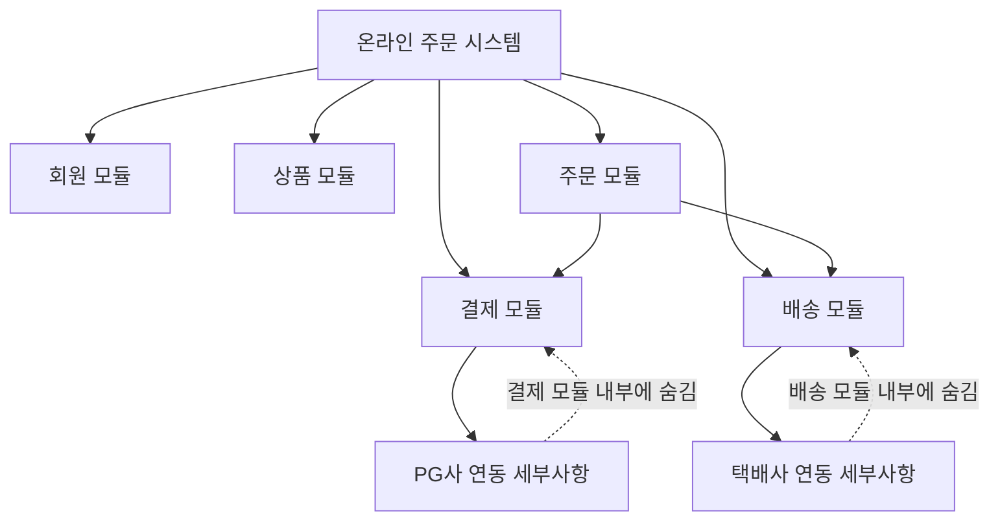

- 온라인 주문 시스템을 모듈화한다고 가정한다.

| 모듈 | 책임 | 외부에 공개할 인터페이스 | 숨겨야 할 내부 결정 |
|---|---|---|---|
| `회원 모듈` | 회원 정보, 인증 상태 관리 | 회원 조회, 권한 확인 | 비밀번호 저장 방식, 인증 토큰 구조 |
| `상품 모듈` | 상품 정보, 재고 조회 | 상품 조회, 재고 확인 | 재고 계산 방식, 캐시 구조 |
| `주문 모듈` | 주문 생성, 주문 상태 관리 | 주문 생성, 주문 취소 | 주문 상태 전이 규칙 |
| `결제 모듈` | 결제 승인, 취소, 환불 | 결제 요청, 환불 요청 | PG사 API 세부 호출 방식 |
| `배송 모듈` | 배송 요청, 배송 상태 조회 | 배송 생성, 배송 조회 | 택배사 API 포맷 |

- 좋은 모듈화 예:
  - 주문 모듈은 결제 모듈의 `결제 요청` 인터페이스만 호출한다.
  - 주문 모듈은 PG사 API URL, 인증키 형식, 응답 파싱 방식을 모른다.
  - PG사가 바뀌어도 결제 모듈 내부 수정으로 끝난다.

- 나쁜 모듈화 예:
  - 주문 모듈이 PG사 API를 직접 호출한다.
  - 결제 응답 구조를 주문, 정산, 알림 모듈이 모두 알고 있다.
  - PG사 응답 형식 변경 시 여러 모듈을 수정해야 한다.

- 시험식 결론:
  - 좋은 예는 `낮은 결합도`, `높은 응집도`, `정보 은닉`, `단순한 인터페이스`에 해당한다.
  - 나쁜 예는 `외부 결합도`, `공통 결합도`, `스탬프 결합도`, `제어 결합도` 같은 문제가 생기기 쉽다.

---

## 13. 시험에서 헷갈리는 비교

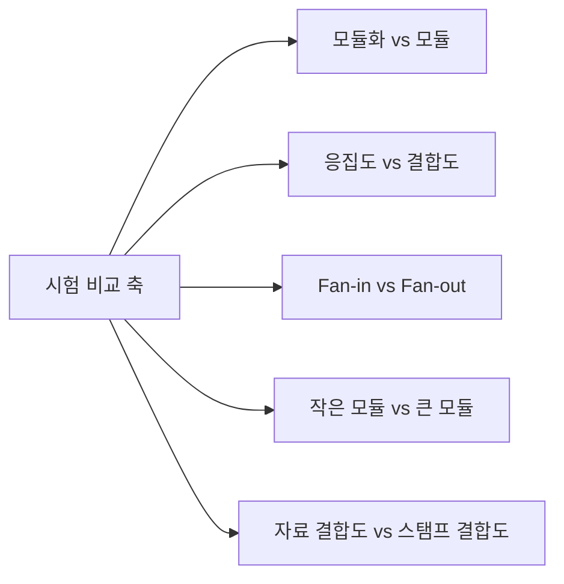

| 구분 | 헷갈리는 지점 | 정확한 구분 |
|---|---|---|
| `모듈화` vs `모듈` | 과정과 결과를 혼동 | 모듈화는 나누는 활동/기법, 모듈은 나뉜 기능 단위 |
| `응집도` vs `결합도` | 높고 낮음의 좋은 방향 혼동 | 응집도는 높을수록 좋고, 결합도는 낮을수록 좋음 |
| `Fan-in` vs `Fan-out` | 화살표 방향 혼동 | Fan-in은 들어오는 호출 수, Fan-out은 나가는 호출 수 |
| `작은 모듈` vs `큰 모듈` | 작으면 항상 좋다고 오해 | 너무 작으면 통합 비용 증가, 너무 크면 내부 개발 비용 증가 |
| `자료 결합도` vs `스탬프 결합도` | 데이터 전달이라 둘 다 같다고 오해 | 필요한 값만 전달하면 자료, 전체 구조를 전달하면 스탬프 |
| `통신적 응집도` vs `순차적 응집도` | 관련 데이터와 데이터 흐름 혼동 | 같은 데이터를 다루면 통신적, 출력이 다음 입력이면 순차적 |
| `절차적 응집도` vs `시간적 응집도` | 순서와 시점 혼동 | 실행 순서가 핵심이면 절차적, 같은 시점 실행이면 시간적 |

- 정답 판단 공식:
  - `내부끼리 관련 깊음` -> 응집도
  - `외부 모듈과 의존 많음` -> 결합도
  - `필요한 데이터만 전달` -> 자료 결합도
  - `전체 자료구조 전달` -> 스탬프 결합도
  - `제어 플래그 전달` -> 제어 결합도
  - `전역 데이터 공유` -> 공통 결합도
  - `다른 모듈 내부 직접 수정` -> 내용 결합도

---

## 14. 기출형 단서어 정리

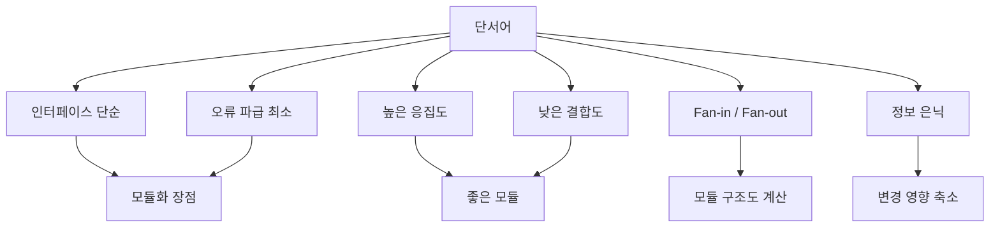

- `인터페이스가 단순해진다`
  - 모듈화의 장점이다.
  - 외부와 주고받는 정보가 명확해진다는 뜻이다.

- `오류의 파급 효과를 최소화한다`
  - 모듈 독립성이 높을 때 가능한 장점이다.
  - 결합도가 낮을수록 오류 영향 범위가 줄어든다.

- `효율적인 관리`
  - 모듈 단위 개발, 테스트, 유지보수, 담당자 배정이 쉬워진다는 뜻이다.

- `모듈 크기가 너무 작다`
  - 통합 비용 증가, 인터페이스 증가, 호출 관계 증가가 핵심이다.

- `모듈 크기가 너무 크다`
  - 모듈 자체 개발 비용 증가, 내부 복잡도 증가, 수정 어려움이 핵심이다.

- `독립성이 높다`
  - 높은 응집도와 낮은 결합도를 동시에 만족한다는 뜻이다.

- `다른 모듈의 내부 자료를 직접 참조`
  - 내용 결합도 단서다.

- `공통 데이터 영역`
  - 공통 결합도 단서다.

- `제어 신호, 플래그`
  - 제어 결합도 단서다.

- `전체 레코드, 구조체 전달`
  - 스탬프 결합도 단서다.

- `필요한 자료만 전달`
  - 자료 결합도 단서다.

---

## 15. 빠른 복습

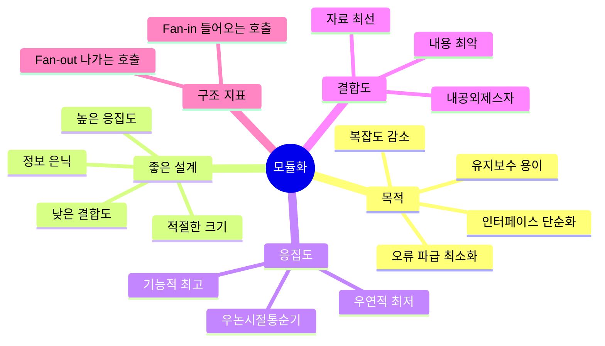

- 10초 암기:
  - 모듈화 = `나누기 + 숨기기 + 단순 인터페이스`.
  - 좋은 모듈 = `높은 응집도 + 낮은 결합도`.
  - 모듈이 너무 작으면 `통합 비용 증가`.
  - 모듈이 너무 크면 `모듈 자체 개발/수정 비용 증가`.
  - Fan-in = `들어오는 화살표`.
  - Fan-out = `나가는 화살표`.

- 응집도 순서:
  - 낮음 -> 높음: `우연적 < 논리적 < 시간적 < 절차적 < 통신적 < 순차적 < 기능적`
  - 암기: `우논시절통순기`

- 결합도 순서:
  - 강함 -> 약함: `내용 > 공통 > 외부 > 제어 > 스탬프 > 자료`
  - 암기: `내공외제스자`

- 최종 문장:
  - 모듈화는 시스템을 작게 쪼개는 행위가 아니라, 변경과 오류가 퍼지지 않도록 책임과 정보를 적절한 경계 안에 배치하는 설계 활동이다.

---

## 16. 참고 링크

- 기준 PDF: `/Users/nes0903/Documents/study/정보처리기사/핵심요약집_2026_정보처리기사필기핵심요약.pdf`
- [Q-Net 정보처리기사 종목 페이지](https://www.q-net.or.kr/crf005.do?id=crf00503s02&jmCd=1320&jmInfoDivCcd=B0)
- [Q-Net 출제기준 자료실](https://www.q-net.or.kr/cst006.do?code=1202&gId=04&gSite=Q&id=cst00601)
- [ISO/IEC 25010:2023 - Product quality model](https://www.iso.org/standard/78176.html)
- [ISO 25000 - ISO/IEC 25010 Maintainability and Modularity](https://iso25000.com/index.php/en/iso-25000-standards/iso-25010)
- [IEEE Computer Society - SWEBOK Guide V4 PDF](https://ieeecs-media.computer.org/media/education/swebok/swebok-v4.pdf)
- [D. L. Parnas - On the Criteria To Be Used in Decomposing Systems into Modules](https://sunnyday.mit.edu/16.355/parnas-criteria.html)
- [SEI - Maintainability](https://www.sei.cmu.edu/library/maintainability/)
- [INFLIBNET - Cohesion and Coupling](https://ebooks.inflibnet.ac.in/csp9/chapter/cohesion-and-coupling/)

<!-- study-links:start -->
## 관련 문서

- `단위 테스트`: [[정보처리기사/2과목 소프트웨어 개발/084 단위 테스트(Unit Test)/084 단위 테스트(Unit Test)|084 단위 테스트(Unit Test)]]
- `통합 테스트`: [[정보처리기사/2과목 소프트웨어 개발/087 통합 테스트(Integration Test)/087 통합 테스트(Integration Test)|087 통합 테스트(Integration Test)]]
- `정보 은닉`: [[정보처리기사/1과목 소프트웨어 설계/028 정보 은닉/028 정보 은닉|028 정보 은닉]]
- `상태 전이`: [[정보처리기사/4과목 프로그래밍 언어 활용/203 프로세스 상태 및 상태 전이/203 프로세스 상태 및 상태 전이|203 프로세스 상태 및 상태 전이]]
- `iec`: [[정보처리기사/1과목 소프트웨어 설계/024 ISO IEC 9126의 품질 특성/024 ISO IEC 9126의 품질 특성|024 ISO/IEC 9126의 품질 특성]]
- `캡슐화`: [[정보처리기사/1과목 소프트웨어 설계/033 캡슐화(Encapsulation)/033 캡슐화(Encapsulation)|033 캡슐화(Encapsulation)]]
- `해시`: [[정보처리기사/5과목 정보시스템 구축 관리/304 해시(Hash)/304 해시(Hash)|304 해시(Hash)]]
<!-- study-links:end -->
