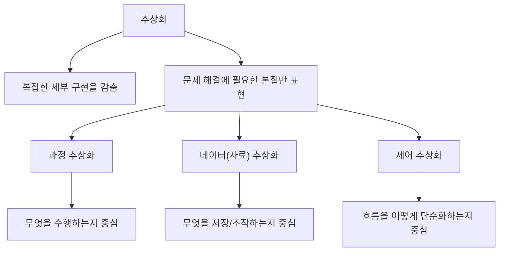
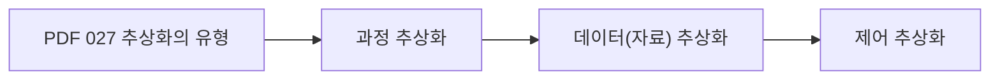
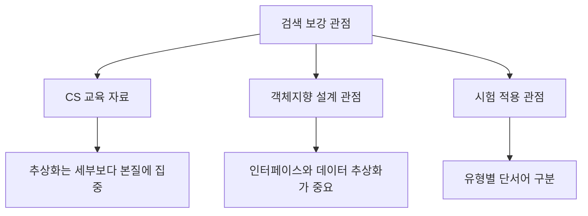
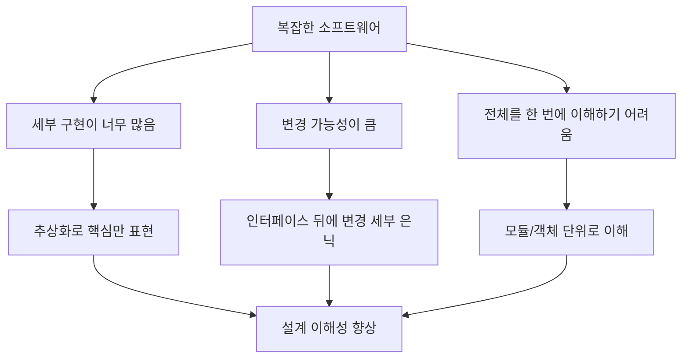
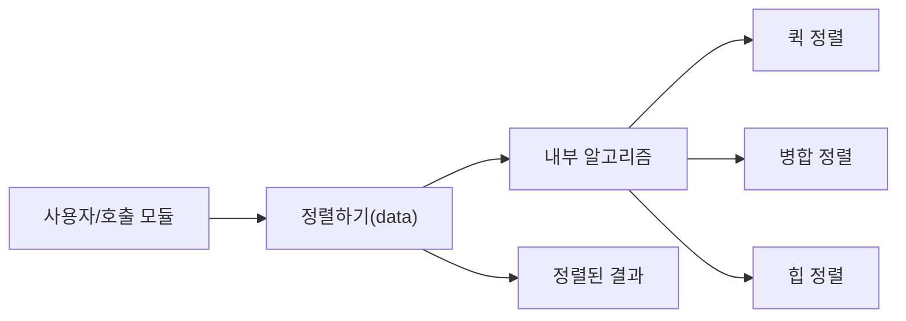
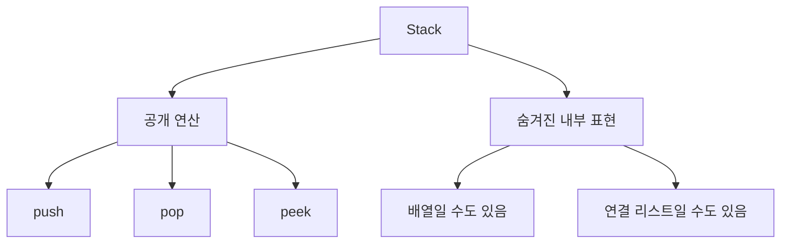
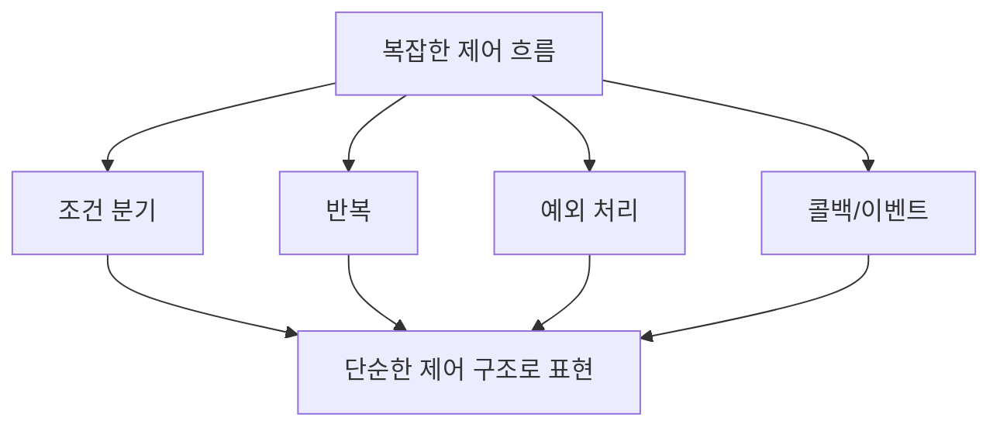
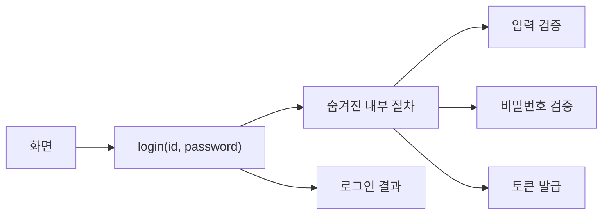
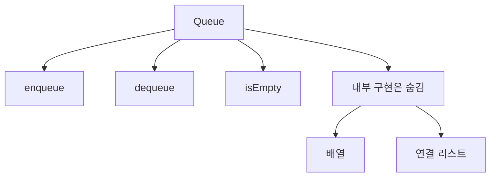
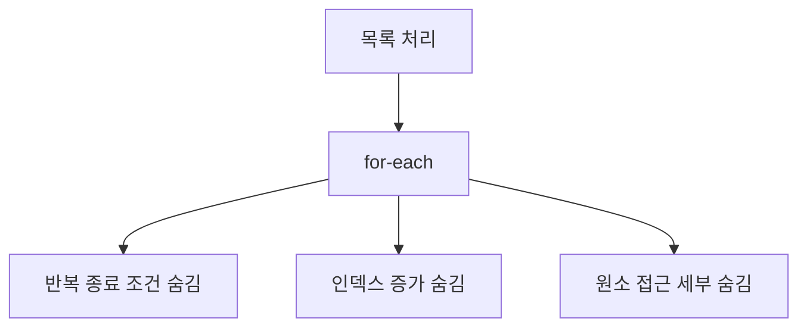

# 027 추상화의 유형

작성 기준일: 2026-05-02
검색/보강일: 2026-06-01
과목: `1과목 소프트웨어 설계`
기준 PDF: `/Users/nes0903/Documents/study/정보처리기사/핵심요약집_2026_정보처리기사필기핵심요약.pdf`
PDF 확인 위치: `4페이지`
주제별 검색 키워드:
- `software engineering abstraction process abstraction data abstraction control abstraction`
- `software design abstraction data abstraction control abstraction`
- `object oriented abstraction data abstraction encapsulation`

---

## 1. 한 줄 요약

- 추상화는 복잡한 세부 구현을 모두 드러내지 않고, 현재 설계나 문제 해결에 필요한 핵심 특징만 골라 표현하는 기법이다.
- 정보처리기사 PDF 기준 추상화의 유형은 `과정 추상화`, `데이터(자료) 추상화`, `제어 추상화` 3가지이다.
- 시험에서는 세 유형의 이름만 묻기보다, 설명 문장 속 단서가 어느 유형에 해당하는지 고르게 하는 방식으로 자주 변형된다.
- 추상화는 모듈화, 정보 은닉, 캡슐화, 인터페이스 설계와 이어지는 기반 개념이다.

---

## 2. PDF 기준 핵심

- PDF에서 직접 확인한 항목:
  - `과정 추상화`
  - `데이터(자료) 추상화`
  - `제어 추상화`

- 이 챕터의 1차 암기 골격은 위 3개 이름이다.
- PDF에는 각 유형의 긴 설명이 나오지 않으므로, 실제 문제 풀이를 위해서는 각 유형이 무엇을 감추고 무엇을 드러내는지까지 이해해야 한다.
- 가장 안전한 암기 방식:
  - `과정` = 처리 절차를 감추고 기능을 드러냄
  - `데이터` = 자료 표현을 감추고 자료의 의미/연산을 드러냄
  - `제어` = 제어 흐름의 복잡한 세부를 감추고 구조를 단순화함

---

## 3. 검색으로 보강한 관점

- 소프트웨어 공학과 프로그래밍 교육 자료에서 추상화는 공통적으로 `불필요한 세부 사항을 숨기고 핵심 개념을 다루는 방법`으로 설명된다.
- 객체지향 설계 관점에서는 추상화가 클래스, 인터페이스, 추상 자료형과 연결된다.
- 시험 관점에서는 철학적인 정의보다 `무엇을 감추는가`와 `외부에 무엇을 제공하는가`가 더 중요하다.
- 즉, 정보처리기사 문제에서는 다음처럼 판단한다.
  - 처리 알고리즘, 함수 내부 절차를 숨긴다 -> 과정 추상화
  - 자료구조, 저장 방식, 내부 표현을 숨긴다 -> 데이터 추상화
  - 반복, 조건, 분기, 예외 흐름을 단순한 구조로 만든다 -> 제어 추상화

---

## 4. 추상화가 필요한 이유

- 실제 소프트웨어는 너무 많은 세부 구현을 포함한다.
  - 어떤 알고리즘을 쓰는가
  - 어떤 자료구조에 저장하는가
  - 어떤 순서로 조건과 반복을 수행하는가
  - 오류 상황을 어떻게 처리하는가
  - 외부 시스템과 어떻게 통신하는가

- 추상화는 이 모든 세부를 항상 드러내지 않는다.
- 현재 설계 단계나 사용자 관점에서 필요한 핵심만 표현한다.
- 이렇게 하면 시스템을 더 작은 개념 단위로 이해할 수 있다.
- 추상화가 잘된 설계는 내부 구현을 바꾸더라도 외부 사용 방식이 크게 흔들리지 않는다.
- 이 때문에 추상화는 유지보수성, 재사용성, 모듈 독립성과도 연결된다.

---

## 5. 과정 추상화

- 과정 추상화는 어떤 일을 수행하는 절차나 알고리즘의 세부를 감추고, 외부에는 `기능 이름`, `입력`, `출력`, `결과`만 드러내는 방식이다.
- 핵심 질문:
  - 이 기능은 `무엇을 수행하는가?`
  - 외부 사용자는 어떤 입력을 주고 어떤 결과를 받는가?
  - 내부 절차를 몰라도 사용할 수 있는가?

- 예:
  - `sort(list)`라는 함수는 리스트를 정렬한다는 기능만 드러낸다.
  - 호출자는 내부가 퀵 정렬인지 병합 정렬인지 몰라도 된다.
  - 내부 알고리즘을 바꾸어도 함수 이름, 입력, 출력이 유지되면 호출 코드는 그대로 둘 수 있다.

- 시험 단서:
  - `절차`, `과정`, `알고리즘`, `처리 방법`, `기능 수행`, `내부 로직`
  - `어떻게 처리하는지 숨김`
  - `함수 또는 프로시저로 표현`

- 과정 추상화와 모듈화의 관계:
  - 모듈은 외부에 기능 인터페이스를 제공한다.
  - 내부 처리 절차는 모듈 안에 숨긴다.
  - 외부 모듈은 공개된 기능만 호출한다.

---

## 6. 데이터(자료) 추상화

- 데이터 추상화는 데이터의 내부 표현 방식을 감추고, 외부에는 데이터가 의미하는 개념과 사용할 수 있는 연산을 제공하는 방식이다.
- 핵심 질문:
  - 이 데이터는 어떤 개념을 표현하는가?
  - 외부에서 어떤 연산을 통해 사용할 수 있는가?
  - 내부 저장 방식이 바뀌어도 외부 사용 방식이 유지되는가?

- 예:
  - `Stack`은 후입선출(LIFO) 구조라는 개념과 `push`, `pop`, `peek` 연산을 제공한다.
  - 내부 구현은 배열일 수도 있고 연결 리스트일 수도 있다.
  - 사용자는 내부 구현보다 `스택으로서 어떻게 쓰는가`를 알면 된다.

- 객체지향에서 데이터 추상화:
  - 클래스는 데이터와 연산을 함께 정의한다.
  - 외부에는 공개 메서드와 속성 일부만 보인다.
  - 내부 필드, 자료구조, 저장 방식은 감출 수 있다.

- 시험 단서:
  - `자료`, `데이터`, `자료구조`, `내부 표현`, `추상 자료형`
  - `데이터 타입과 연산`
  - `클래스`, `객체`, `스택`, `큐`

- 데이터 추상화와 캡슐화의 관계:
  - 데이터 추상화는 어떤 데이터 개념을 어떤 연산으로 제공할지 정하는 관점이다.
  - 캡슐화는 데이터와 그 데이터를 처리하는 함수를 하나로 묶는 구현/설계 방식이다.
  - 정보 은닉은 내부 표현을 외부에서 직접 접근하지 못하게 숨기는 원리이다.

---

## 7. 제어 추상화

- 제어 추상화는 프로그램의 실행 순서, 반복, 조건, 분기, 예외 처리 같은 제어 흐름의 복잡성을 숨기거나 단순한 구조로 표현하는 방식이다.
- 핵심 질문:
  - 복잡한 흐름을 더 단순한 제어 구조로 표현했는가?
  - 반복과 조건의 세부를 외부에서 몰라도 사용할 수 있는가?
  - 호출자는 제어 흐름의 세부보다 결과나 의미에 집중할 수 있는가?

- 예:
  - `for each item in list`는 내부 인덱스 증가, 반복 종료 조건, 원소 접근 절차를 단순화한다.
  - `map`, `filter`, `reduce` 같은 고차 함수는 반복 제어를 감추고 데이터 변환 의미를 드러낸다.
  - 예외 처리 프레임워크는 오류 발생 시 흐름 전환의 세부를 일정한 구조로 제공한다.

- 시험 단서:
  - `제어`, `흐름`, `조건`, `반복`, `분기`, `제어 구조`
  - `제어 흐름의 복잡성 은닉`
  - `반복문이나 조건문을 단순화`

- 제어 추상화와 구조적 프로그래밍:
  - 구조적 프로그래밍은 순차, 선택, 반복 구조로 프로그램 흐름을 표현한다.
  - NS 차트도 연속, 선택, 반복 제어 구조를 명확하게 표현하는 도구이다.
  - 따라서 제어 추상화는 뒤의 `NS 차트`와도 연결해서 이해할 수 있다.

---

## 8. 세 유형 비교

| 구분 | 무엇을 감추는가 | 외부에 무엇을 드러내는가 | 대표 예 | 시험 단서 |
|---|---|---|---|---|
| `과정 추상화` | 처리 절차, 알고리즘, 내부 로직 | 기능 이름, 입력, 출력, 결과 | 함수, 프로시저, 서비스 API | 과정, 절차, 처리 방법 |
| `데이터 추상화` | 자료의 내부 표현, 저장 방식 | 자료 개념, 연산, 인터페이스 | 추상 자료형, 클래스, Stack, Queue | 자료, 데이터, 연산 |
| `제어 추상화` | 조건, 반복, 분기, 흐름 제어 세부 | 단순한 제어 구조, 흐름 의미 | 반복자, for-each, map/filter | 제어, 반복, 조건, 흐름 |

- 과정 추상화는 `기능을 어떻게 수행하는지`의 세부를 숨긴다.
- 데이터 추상화는 `자료를 어떻게 저장하는지`의 세부를 숨긴다.
- 제어 추상화는 `흐름을 어떻게 제어하는지`의 세부를 숨긴다.
- 세 유형 모두 복잡도를 낮추기 위한 기법이지만 초점이 다르다.
- 문제에서 `함수 내부 알고리즘`이 나오면 과정 추상화가 가장 가깝다.
- 문제에서 `자료구조 내부 표현`이 나오면 데이터 추상화가 가장 가깝다.
- 문제에서 `반복/조건 흐름`이 나오면 제어 추상화가 가장 가깝다.

---

## 9. 추상화와 주변 개념 비교

| 개념 | 핵심 의미 | 추상화와의 관계 | 헷갈리는 포인트 |
|---|---|---|---|
| `추상화` | 핵심만 드러내고 세부를 감춤 | 설계와 모델링의 기본 원리 | 무엇을 본질로 볼지 선택 |
| `정보 은닉` | 내부 자료와 절차를 외부에서 접근하지 못하게 함 | 추상화된 인터페이스 뒤에 내부 결정을 숨김 | 숨김 자체에 초점 |
| `캡슐화` | 데이터와 처리 함수를 하나로 묶음 | 데이터 추상화와 정보 은닉을 구현하는 방법 | 묶는 구조에 초점 |
| `모듈화` | 시스템을 기능 단위로 분리 | 모듈 경계를 정할 때 추상화가 필요 | 분해 단위에 초점 |
| `인터페이스` | 외부와 상호작용하는 약속 | 추상화된 사용 방법을 제공 | 내부 구현이 아니라 사용 규약 |

- 추상화와 정보 은닉은 함께 쓰이지만 같은 말은 아니다.
- 추상화는 `중요한 것만 표현하는 사고 방식`이다.
- 정보 은닉은 `외부에서 내부 세부를 보거나 바꾸지 못하게 막는 설계 원리`이다.
- 캡슐화는 `데이터와 연산을 하나로 묶는 구조화 방식`이다.
- 모듈화는 `시스템을 나누는 활동`이고, 추상화는 각 모듈이 외부에 무엇을 보여줄지 결정하는 데 도움을 준다.

---

## 10. 시험 포인트 - 시험에서 나오는 함정

- `추상화는 세부 구현을 완전히 없애는 것이다`는 틀린 설명이다.
  - 세부 구현은 존재하지만 외부 관점에서 감추거나 나중에 다룬다.

- `데이터 추상화는 데이터를 삭제하는 것이다`는 틀린 설명이다.
  - 데이터의 내부 표현을 감추고 의미와 연산을 제공하는 것이다.

- `과정 추상화는 자료구조 내부 표현을 숨기는 것이다`는 부정확하다.
  - 자료구조 내부 표현은 데이터 추상화에 더 가깝다.

- `제어 추상화는 데이터 값을 감추는 것이다`는 부정확하다.
  - 제어 추상화는 흐름, 반복, 조건, 분기를 단순화하는 관점이다.

- `추상화는 정보 은닉과 완전히 동일하다`는 틀린 설명으로 볼 수 있다.
  - 두 개념은 밀접하지만 초점이 다르다.

- `추상화 수준이 높을수록 항상 좋은 설계이다`도 조심해야 한다.
  - 너무 높은 추상화는 실제 제약과 성능 문제를 숨겨 오히려 이해를 어렵게 할 수 있다.

---

## 11. 예시로 이해하기

### 예시 1: 로그인 기능

- `login(id, password)`라는 기능만 외부에 제공한다.
- 입력 검증, 비밀번호 해시 비교, 세션 생성, 토큰 발급 세부는 내부에 숨긴다.
- 이 예시는 과정 추상화에 해당한다.

### 예시 2: Queue 자료형

- 외부 사용자는 `enqueue`, `dequeue`, `isEmpty`만 알면 된다.
- 내부 구현이 배열인지 연결 리스트인지는 중요하지 않다.
- 이 예시는 데이터 추상화에 해당한다.

### 예시 3: 반복 처리

- `for-each`는 인덱스 초기화, 증가, 종료 조건 같은 세부 제어를 감춘다.
- 사용자는 각 원소에 대해 무엇을 할지만 작성하면 된다.
- 이 예시는 제어 추상화에 해당한다.

---

## 12. 암기 포인트

- 기본 암기:
  - `과-데-제`
  - 과정 추상화
  - 데이터(자료) 추상화
  - 제어 추상화

- 단서어 암기:
  - 과정 = `절차`, `알고리즘`, `함수 내부`
  - 데이터 = `자료`, `자료구조`, `연산`, `추상 자료형`
  - 제어 = `조건`, `반복`, `흐름`, `분기`

- 문장형 암기:
  - 과정 추상화는 `처리 절차를 감추고 기능을 제공한다`.
  - 데이터 추상화는 `자료 표현을 감추고 연산을 제공한다`.
  - 제어 추상화는 `제어 흐름을 감추고 구조를 단순화한다`.

- 비교형 문제 접근:
  - 먼저 지문에서 감추는 대상이 무엇인지 찾는다.
  - 감추는 대상이 알고리즘이면 과정, 자료 표현이면 데이터, 흐름이면 제어로 판단한다.

---

## 13. 빠른 복습

- 챕터명: `027 추상화의 유형`
- PDF 위치: `4페이지`
- PDF 최소 암기:
  - 과정 추상화
  - 데이터(자료) 추상화
  - 제어 추상화

- 가장 자주 헷갈리는 구분:
  - 과정 추상화 vs 데이터 추상화
    - 과정은 처리 절차
    - 데이터는 자료 표현
  - 데이터 추상화 vs 정보 은닉
    - 데이터 추상화는 자료 개념과 연산을 모델링
    - 정보 은닉은 내부 자료와 절차에 대한 외부 접근 제한
  - 제어 추상화 vs 과정 추상화
    - 과정은 기능 수행 절차
    - 제어는 조건/반복/흐름 제어

- 문제 풀이 체크:
  - `무엇을 감추는가?`
  - `외부에 무엇을 제공하는가?`
  - `알고리즘/자료/흐름 중 어디에 가까운가?`

---

## 14. 참고 링크

- 기준 PDF: `/Users/nes0903/Documents/study/정보처리기사/핵심요약집_2026_정보처리기사필기핵심요약.pdf`
- [Q-Net - 정보처리기사 종목 정보](https://www.q-net.or.kr/crf005.do?id=crf00503&jmCd=1320)
- [Cornell CS211 - Abstraction](https://www.cs.cornell.edu/courses/cs211/2006sp/Lectures/L08-Abstraction/08_abstraction.html)
- [Oracle Java Tutorials - Abstract Methods and Classes](https://docs.oracle.com/javase/tutorial/java/IandI/abstract.html)
- [Oracle Java Tutorials - Interfaces](https://docs.oracle.com/javase/tutorial/java/IandI/createinterface.html)

<!-- study-links:start -->
## 관련 문서

- `정보 은닉`: [[정보처리기사/1과목 소프트웨어 설계/028 정보 은닉/028 정보 은닉|028 정보 은닉]]
- `ns 차트`: [[정보처리기사/1과목 소프트웨어 설계/045 NS 차트/045 NS 차트|045 NS 차트]]
- `흐름 제어`: [[정보처리기사/5과목 정보시스템 구축 관리/267 흐름 제어 - 정지-대기(Stop-and-Wait)/267 흐름 제어 - 정지-대기(Stop-and-Wait)|267 흐름 제어 - 정지-대기(Stop-and-Wait)]]
- `모듈화`: [[정보처리기사/1과목 소프트웨어 설계/026 모듈화/026 모듈화|026 모듈화]]
- `캡슐화`: [[정보처리기사/1과목 소프트웨어 설계/033 캡슐화(Encapsulation)/033 캡슐화(Encapsulation)|033 캡슐화(Encapsulation)]]
- `스택`: [[정보처리기사/2과목 소프트웨어 개발/057 스택(Stack)/057 스택(Stack)|057 스택(Stack)]]
- `해시`: [[정보처리기사/5과목 정보시스템 구축 관리/304 해시(Hash)/304 해시(Hash)|304 해시(Hash)]]
<!-- study-links:end -->
