# 028 정보 은닉

작성 기준일: 2026-05-02
검색/보강일: 2026-06-01
과목: `1과목 소프트웨어 설계`
기준 PDF: `/Users/nes0903/Documents/study/정보처리기사/핵심요약집_2026_정보처리기사필기핵심요약.pdf`
PDF 확인 위치: `4페이지`
주제별 검색 키워드:
- `Parnas information hiding module decomposition software engineering`
- `On the Criteria to be Used in Decomposing Systems into Modules information hiding`
- `Java access control private public protected Oracle`
- `C# access modifiers private public protected Microsoft`

---

## 1. 한 줄 요약

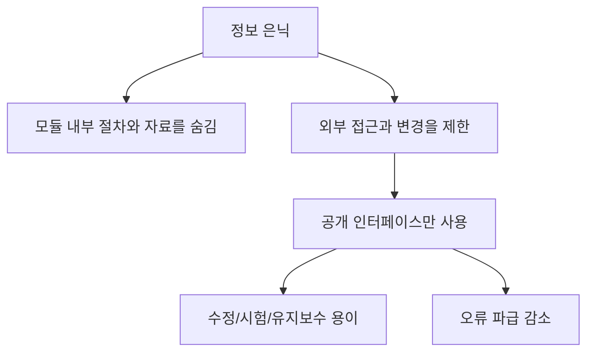

- 정보 은닉은 모듈 내부의 절차, 자료, 알고리즘, 설계 결정을 외부 모듈이 직접 접근하거나 변경하지 못하도록 숨기는 설계 기법이다.
- 외부에는 꼭 필요한 인터페이스만 제공하고, 변경 가능성이 높은 내부 구현은 모듈 안에 가둔다.
- PDF 기준 핵심은 `내부 절차와 자료 은닉`, `다른 모듈의 접근/변경 제한`, `독립 수행`, `수정/시험/유지보수 용이`, `private = 은닉`이다.
- 시험에서는 `정보 은닉`, `캡슐화`, `추상화`, `private`의 차이를 비교하는 문제가 특히 중요하다.

---

## 2. PDF 기준 핵심

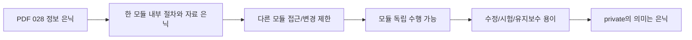

- PDF에서 직접 확인한 내용:
  - 한 모듈 내부에 포함된 절차와 자료들의 정보가 감추어져 다른 모듈이 접근하거나 변경하지 못하도록 하는 기법이다.
  - 모듈을 독립적으로 수행할 수 있다.
  - 수정, 시험, 유지보수가 용이하다.
  - 정보 은닉을 표기할 때 `private`의 의미는 은닉이다.

- 1차 암기 키워드:
  - `내부 절차`
  - `내부 자료`
  - `접근 제한`
  - `변경 제한`
  - `독립 수행`
  - `수정/시험/유지보수`
  - `private`

- 시험에서 PDF 문장을 조금 바꾸어 다음처럼 출제할 수 있다.
  - `모듈 내부 자료구조를 외부에서 직접 알 수 없게 한다`
  - `외부 모듈은 공개된 인터페이스를 통해서만 접근한다`
  - `내부 구현 변경이 외부 모듈에 미치는 영향을 줄인다`
  - `객체의 속성을 private으로 선언한다`

---

## 3. 검색으로 보강한 관점

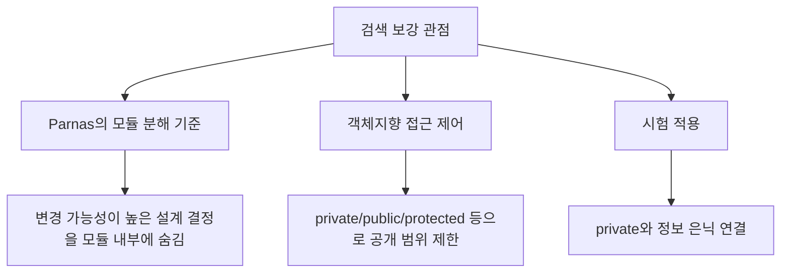

- Parnas의 모듈화 기준은 정보 은닉을 설명할 때 자주 언급되는 고전적 근거이다.
- 핵심 관점은 `처리 순서대로 모듈을 나누는 것`보다 `변경될 가능성이 높은 설계 결정을 숨기는 방향으로 모듈을 나누는 것`이 더 좋은 모듈화를 만든다는 점이다.
- Oracle Java 접근 제어 문서는 클래스 멤버의 공개 범위를 `public`, `protected`, package-private, `private` 등으로 제한하는 관점을 설명한다.
- Microsoft C# 접근 제한자 문서도 `public`, `private`, `protected`, `internal` 같은 접근 수준으로 외부 코드가 타입이나 멤버에 접근할 수 있는 범위를 제한한다는 관점을 제공한다.
- 정보처리기사에서는 언어별 세부 문법보다 `private = 외부 접근 제한 = 은닉`으로 연결하는 것이 중요하다.

---

## 4. 정보 은닉이 숨기는 것

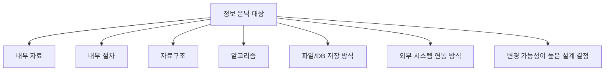

- 정보 은닉에서 숨기는 정보는 단순히 `변수 값`만이 아니다.
- 숨겨야 할 대표 대상:
  - 모듈 내부 변수
  - 객체의 내부 상태
  - 자료구조의 실제 형태
  - 알고리즘 선택
  - 파일 저장 형식
  - 데이터베이스 테이블 구조와 접근 방식
  - 캐시 사용 여부
  - 외부 API 호출 방식
  - 예외 처리 세부 방식
  - 성능 최적화 전략

- 좋은 정보 은닉은 외부 사용자가 몰라도 되는 것을 숨긴다.
- 외부 사용자는 공개된 인터페이스를 통해 필요한 기능만 사용한다.
- 내부 구현은 바뀔 수 있지만, 외부 인터페이스가 유지되면 다른 모듈의 수정 범위는 줄어든다.

---

## 5. 정보 은닉의 핵심 구조

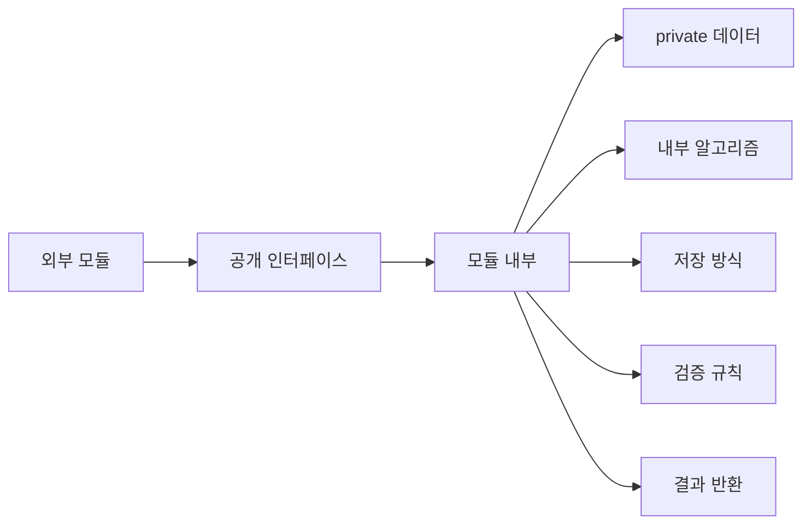

- 정보 은닉 구조는 `외부 모듈 -> 공개 인터페이스 -> 내부 구현`으로 이해하면 쉽다.
- 외부 모듈은 내부 자료를 직접 조작하지 않는다.
- 외부 모듈은 공개된 함수, 메서드, API, 메시지를 통해 요청한다.
- 모듈 내부는 요청을 처리하기 위해 자신의 자료와 절차를 사용한다.
- 내부 자료구조나 알고리즘은 외부에서 직접 볼 수 없거나 변경할 수 없도록 제한한다.

- 이 구조의 효과:
  - 내부 구현 변경 시 외부 수정이 줄어든다.
  - 잘못된 외부 접근으로 인한 데이터 훼손을 줄인다.
  - 모듈 단위 테스트가 쉬워진다.
  - 모듈의 책임과 경계가 명확해진다.
  - 유지보수자가 변경 범위를 좁혀 파악할 수 있다.

---

## 6. `private`의 의미

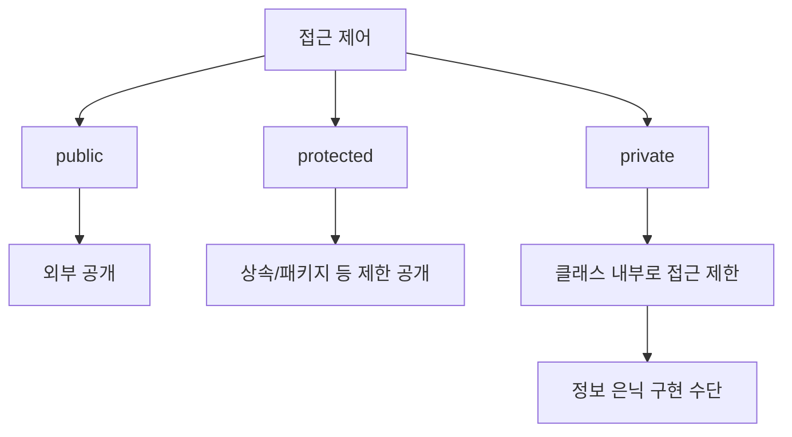

- PDF에서는 정보 은닉을 표기할 때 `private`의 의미가 `은닉`이라고 명시한다.
- 객체지향 언어에서 `private`은 보통 해당 클래스 내부에서만 직접 접근할 수 있도록 제한하는 접근 제어자이다.
- 시험에서는 언어별 예외보다 다음 연결이 중요하다.
  - `private` -> 외부 접근 제한
  - 외부 접근 제한 -> 내부 정보 은닉
  - 내부 정보 은닉 -> 수정/시험/유지보수 용이

- `private`이 중요한 이유:
  - 객체의 상태를 외부에서 임의로 바꾸지 못하게 한다.
  - 객체 내부 불변식이나 검증 규칙을 유지할 수 있다.
  - 내부 표현이 바뀌어도 공개 메서드가 유지되면 외부 코드는 덜 바뀐다.

- 주의:
  - `private`은 정보 은닉을 구현하는 대표 수단이지, 정보 은닉 전체와 완전히 같은 말은 아니다.
  - 정보 은닉은 설계 원리이고, `private`은 특정 언어에서 그 원리를 구현하는 문법적 수단이다.

---

## 7. 왜 수정, 시험, 유지보수가 쉬워지는가

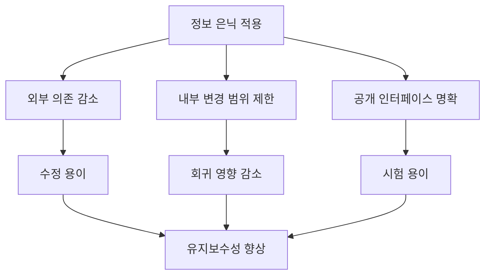

- 수정이 쉬워지는 이유:
  - 내부 자료구조를 바꿔도 외부 인터페이스가 같으면 외부 코드를 고칠 필요가 줄어든다.
  - 변경될 가능성이 높은 설계 결정이 모듈 내부에 모여 있다.

- 시험이 쉬워지는 이유:
  - 공개 인터페이스를 기준으로 입력과 출력을 검증할 수 있다.
  - 내부 구현 세부를 모두 몰라도 모듈의 외부 동작을 테스트할 수 있다.

- 유지보수가 쉬워지는 이유:
  - 모듈의 책임과 경계가 명확하다.
  - 오류가 발생했을 때 내부 구현과 외부 사용 부분을 나누어 원인을 찾을 수 있다.
  - 외부에서 내부 상태를 임의로 깨뜨릴 가능성이 줄어든다.

- PDF의 `모듈을 독립적으로 수행할 수 있다`는 문장은 다음과 연결된다.
  - 모듈이 외부 내부 구현에 덜 의존한다.
  - 공개 인터페이스를 중심으로 독립 검증이 가능하다.
  - 다른 모듈과의 결합도가 낮아진다.

---

## 8. 예시로 이해하기

### 예시 1: 은행 계좌

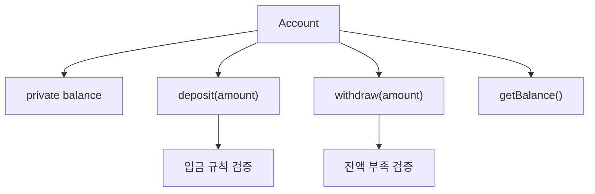

- `balance`를 외부에서 직접 수정할 수 있게 하면 다음 문제가 생긴다.
  - 잔액이 음수가 될 수 있다.
  - 입금/출금 기록이 누락될 수 있다.
  - 검증 규칙을 우회할 수 있다.

- `balance`를 `private`으로 숨기고 `deposit`, `withdraw`를 통해서만 변경하게 하면 정보 은닉이 적용된다.
- 외부는 `입금한다`, `출금한다`, `잔액을 조회한다`는 인터페이스만 사용한다.
- 내부 검증 규칙과 저장 방식은 객체 내부에 숨긴다.

### 예시 2: DB 접근 모듈

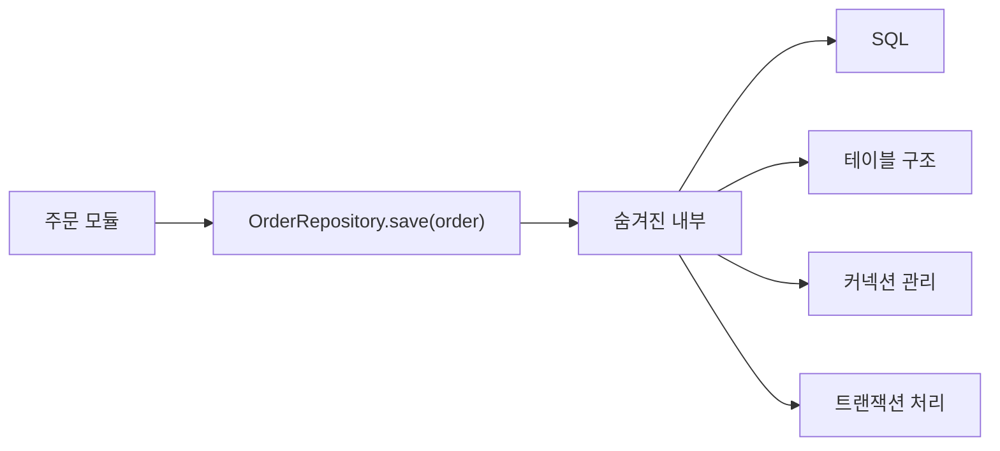

- 주문 모듈은 `OrderRepository.save(order)`만 호출한다.
- 내부에서 어떤 SQL을 쓰는지, 어떤 테이블에 저장하는지, 트랜잭션을 어떻게 처리하는지는 숨겨져 있다.
- 나중에 DB 테이블이 바뀌어도 `save(order)` 인터페이스를 유지하면 주문 모듈 수정은 줄어든다.

### 예시 3: 정렬 모듈

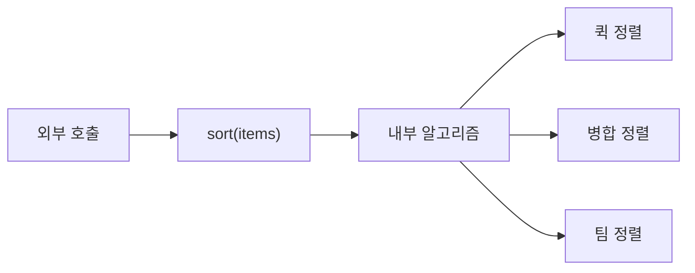

- 외부에서는 `sort(items)`만 사용한다.
- 내부 알고리즘은 성능 요구에 따라 바뀔 수 있다.
- 내부 알고리즘을 숨기면 변경 영향이 줄어든다.

---

## 9. 정보 은닉과 주변 개념 비교

| 구분 | 핵심 의미 | 초점 | 시험 단서 |
|---|---|---|---|
| `정보 은닉` | 내부 절차와 자료를 외부에서 접근/변경하지 못하게 숨김 | 숨김, 접근 제한, 변경 영향 축소 | private, 내부 자료, 독립 수행 |
| `캡슐화` | 데이터와 데이터를 처리하는 함수를 하나로 묶음 | 묶음, 객체 구성 | 데이터+함수, 속성+메서드 |
| `추상화` | 불필요한 세부를 제거하고 핵심만 표현 | 본질 표현, 복잡도 감소 | 핵심 개념, 과정/데이터/제어 |
| `모듈화` | 시스템을 기능 단위로 분리 | 분해, 구조화 | 기능 분리, 인터페이스 단순화 |
| `접근 제어` | 언어 문법으로 공개 범위를 제한 | 구현 수단 | public, protected, private |

- 정보 은닉과 캡슐화:
  - 캡슐화는 데이터와 함수를 묶는 구조이다.
  - 정보 은닉은 외부에 드러내지 말아야 할 내부 정보를 숨기는 원리이다.
  - 캡슐화가 정보 은닉을 돕지만, 모든 캡슐화가 정보 은닉을 잘하는 것은 아니다.
  - 예를 들어 모든 필드를 `public`으로 열어두면 클래스 안에 데이터와 함수가 함께 있어도 정보 은닉 효과는 약하다.

- 정보 은닉과 추상화:
  - 추상화는 필요한 핵심만 표현한다.
  - 정보 은닉은 내부 세부에 대한 접근을 제한한다.
  - 추상화된 인터페이스 뒤에 정보 은닉을 적용하면 외부 사용 방식은 단순하고 내부 변경은 자유로워진다.

- 정보 은닉과 모듈화:
  - 모듈화는 시스템을 나누는 활동이다.
  - 정보 은닉은 어떤 기준으로 모듈을 나눌지 결정하는 중요한 원리이다.
  - 변경될 가능성이 높은 설계 결정을 모듈 내부에 숨기도록 나누면 유지보수성이 좋아진다.

---

## 10. 좋은 정보 은닉과 나쁜 정보 은닉

| 상황 | 좋은 정보 은닉 | 나쁜 정보 은닉 |
|---|---|---|
| 내부 데이터 | `private` 필드와 검증 메서드로 보호 | 전역 변수나 public 필드로 직접 수정 |
| DB 접근 | Repository/API 뒤에 SQL과 테이블 구조 은닉 | 여러 모듈이 SQL과 테이블 구조를 직접 참조 |
| 알고리즘 | 공개 함수 뒤에 알고리즘 선택 은닉 | 외부가 특정 알고리즘 세부에 의존 |
| 설정 | 설정 모듈을 통해 읽고 검증 | 여러 곳에서 설정 파일 경로와 형식을 직접 사용 |
| 외부 API | Adapter/Client 모듈로 API 호출 은닉 | 업무 코드 전체에 외부 API 형식이 퍼짐 |

- 좋은 정보 은닉은 외부 모듈이 내부 구현 세부를 몰라도 기능을 사용할 수 있게 한다.
- 나쁜 정보 은닉은 외부 모듈이 내부 자료구조, 파일 형식, DB 테이블, 외부 API 형식에 직접 의존하게 만든다.
- 나쁜 정보 은닉 구조에서는 내부 변경이 곧 여러 모듈의 수정으로 이어진다.

---

## 11. 시험 포인트 - 시험에서 나오는 함정

- `정보 은닉은 데이터를 암호화하는 보안 기술이다`는 이 챕터 관점에서는 부정확하다.
  - 정보 은닉은 보안 암호화가 아니라 소프트웨어 설계에서 내부 구현을 숨기는 원리이다.

- `private은 공개를 의미한다`는 틀린 설명이다.
  - PDF 기준 `private = 은닉`이다.

- `정보 은닉을 하면 모듈을 사용할 수 없다`는 틀린 설명이다.
  - 내부는 숨기지만 공개 인터페이스는 제공한다.

- `정보 은닉은 유지보수를 어렵게 한다`는 틀린 설명이다.
  - PDF 기준 수정, 시험, 유지보수가 용이해진다.

- `정보 은닉은 다른 모듈이 내부 자료를 직접 수정할 수 있게 하는 기법이다`는 반대로 틀린 설명이다.
  - 다른 모듈의 접근이나 변경을 제한한다.

- `캡슐화와 정보 은닉은 항상 완전히 같은 뜻이다`도 조심한다.
  - 시험에서는 캡슐화는 `데이터와 함수의 묶음`, 정보 은닉은 `내부 정보 접근 제한`으로 구분하는 것이 안전하다.

---

## 12. 결합도/응집도와의 연결

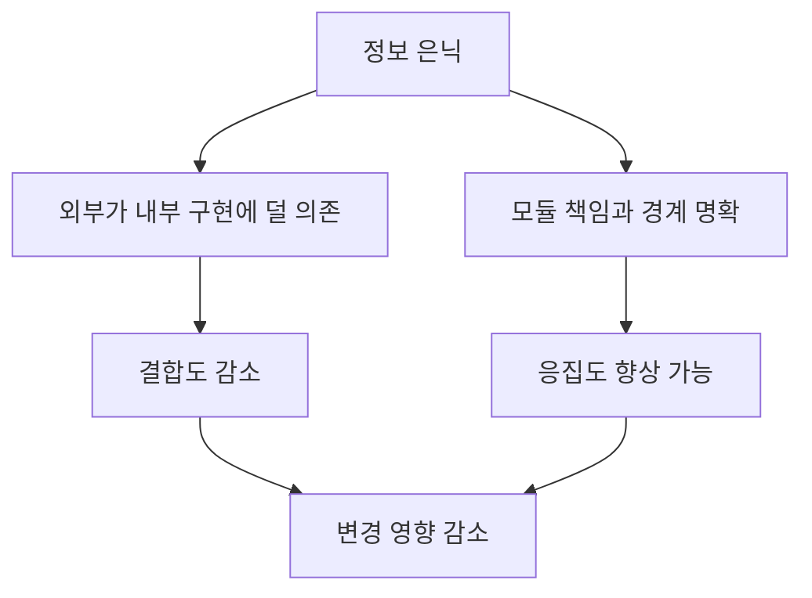

- 정보 은닉은 결합도를 낮추는 데 직접적으로 기여한다.
- 외부 모듈이 내부 자료구조나 알고리즘을 직접 알수록 결합도는 강해진다.
- 공개 인터페이스만 사용하면 외부 모듈은 내부 구현 변화에 덜 영향을 받는다.
- 정보 은닉은 응집도를 자동으로 높여주지는 않지만, 모듈의 책임을 명확히 나누는 데 도움을 준다.
- 따라서 좋은 모듈 설계의 핵심 문장인 `결합도는 낮게, 응집도는 높게`와 함께 암기한다.

---

## 13. 암기 포인트

- 기본 암기:
  - 정보 은닉 = `내부 절차와 자료를 숨김`
  - 다른 모듈 = `접근/변경 제한`
  - 효과 = `수정, 시험, 유지보수 용이`
  - 표기 = `private`

- 단서어 암기:
  - `private`
  - `내부 자료`
  - `내부 절차`
  - `접근 제한`
  - `변경 제한`
  - `독립 수행`
  - `인터페이스`
  - `유지보수`

- 문장형 암기:
  - 정보 은닉은 `모듈 내부의 절차와 자료를 감추어 다른 모듈이 직접 접근하거나 변경하지 못하게 하는 기법`이다.
  - 정보 은닉을 적용하면 `모듈을 독립적으로 수행할 수 있고 수정, 시험, 유지보수가 용이`하다.
  - `private`은 정보 은닉을 나타내는 대표 접근 제어 표현이다.

---

## 14. 빠른 복습

- 챕터명: `028 정보 은닉`
- PDF 위치: `4페이지`
- PDF 최소 암기:
  - 내부 절차와 자료 은닉
  - 다른 모듈 접근/변경 제한
  - 모듈 독립 수행
  - 수정/시험/유지보수 용이
  - `private = 은닉`

- 비교 포인트:
  - 정보 은닉 = 숨김
  - 캡슐화 = 데이터와 함수 묶음
  - 추상화 = 핵심만 표현
  - 모듈화 = 기능 단위 분리
  - 접근 제어 = 정보 은닉 구현 수단

- 문제 풀이 체크:
  - 지문에 `private`이 있는가?
  - 내부 자료나 절차를 외부에서 직접 못 보게 하는가?
  - 변경 파급을 줄이고 유지보수를 쉽게 하는가?
  - 그렇다면 정보 은닉을 우선 의심한다.

---

## 15. 참고 링크

- 기준 PDF: `/Users/nes0903/Documents/study/정보처리기사/핵심요약집_2026_정보처리기사필기핵심요약.pdf`
- [Q-Net - 정보처리기사 종목 정보](https://www.q-net.or.kr/crf005.do?id=crf00503&jmCd=1320)
- [Communications of the ACM - On the criteria to be used in decomposing systems into modules](https://cacm.acm.org/research/on-the-criteria-to-be-used-in-decomposing-systems-into-modules/)
- [Oracle Java Tutorials - Controlling Access to Members of a Class](https://docs.oracle.com/javase/tutorial/java/javaOO/accesscontrol.html)
- [Microsoft Learn - C# Access Modifiers](https://learn.microsoft.com/en-us/dotnet/csharp/language-reference/keywords/access-modifiers)
