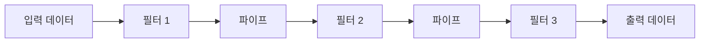
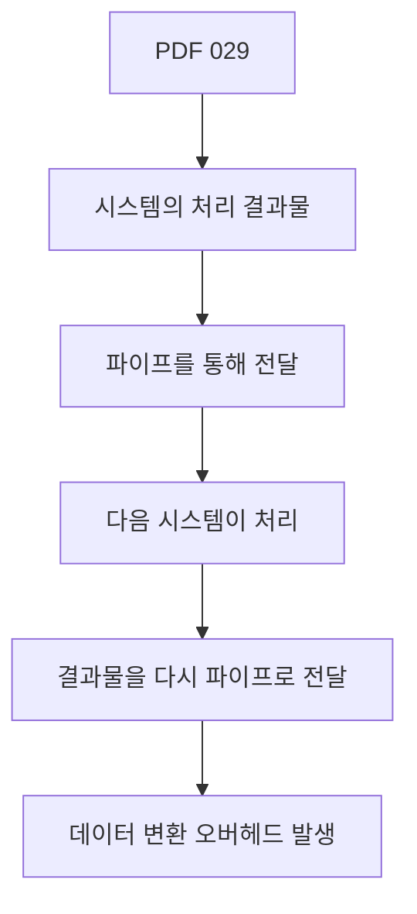
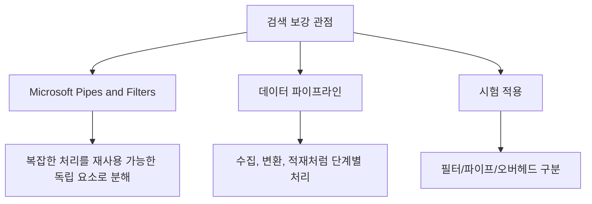
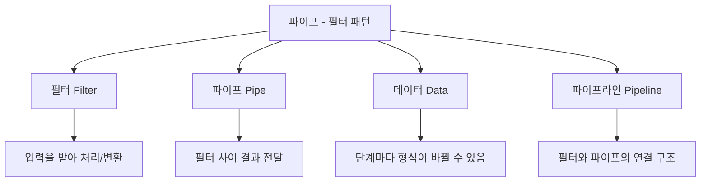
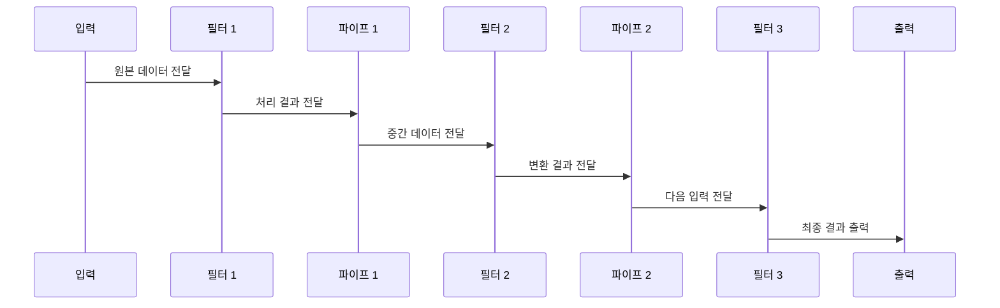
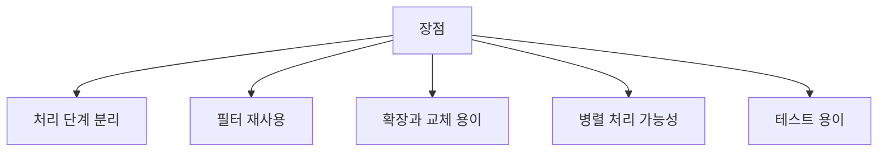
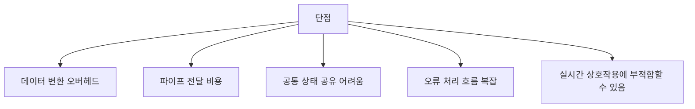
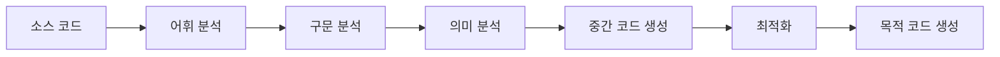

# 029 파이프 - 필터 패턴

작성 기준일: 2026-05-02
검색/보강일: 2026-06-01
과목: `1과목 소프트웨어 설계`
기준 PDF: `/Users/nes0903/Documents/study/정보처리기사/핵심요약집_2026_정보처리기사필기핵심요약.pdf`
PDF 확인 위치: `4페이지`
주제별 검색 키워드:
- `Microsoft Azure Architecture Center Pipes and Filters pattern`
- `pipes and filters architectural pattern software engineering`
- `pipe and filter architecture data transformation overhead`
- `data pipeline transform filter aggregation IBM`

---

## 1. 한 줄 요약

- 파이프-필터 패턴은 데이터를 여러 처리 단계인 `필터(Filter)`에 통과시키고, 각 필터의 처리 결과를 `파이프(Pipe)`를 통해 다음 필터로 전달하는 아키텍처 패턴이다.
- PDF 기준 핵심은 `처리 결과물을 파이프로 전달받아 처리한 뒤 다시 파이프로 다음 시스템에 넘김`과 `데이터 변환 오버헤드 발생`이다.
- 시험에서는 `필터 = 처리/변환`, `파이프 = 전달 통로`, `오버헤드 = 데이터 변환 비용`으로 구분하면 안정적이다.

---

## 2. PDF 기준 핵심

- PDF에서 직접 확인한 내용:
  - 시스템의 처리 결과물을 파이프를 통해 전달받아 처리한 후 그 결과물을 다시 파이프를 통해 다음 시스템으로 넘겨주는 패턴이다.
  - 데이터 변환으로 인한 오버헤드가 발생한다.

- 1차 암기 키워드:
  - `처리 결과물`
  - `파이프`
  - `필터`
  - `다음 시스템`
  - `데이터 변환`
  - `오버헤드`

- PDF 표현을 시험식으로 바꾸면 다음과 같다.
  - 앞 단계의 출력이 다음 단계의 입력이 된다.
  - 각 단계는 독립적인 처리 단위이다.
  - 단계 사이의 연결 통로가 파이프이다.
  - 단계별 데이터 형식 변환이나 전달 비용이 생길 수 있다.

---

## 3. 검색으로 보강한 관점

- Microsoft Azure Architecture Center의 Pipes and Filters 패턴 설명은 복잡한 처리를 독립적인 처리 요소로 나누고, 각 요소를 연결하여 파이프라인을 구성하는 관점을 제공한다.
- 데이터 파이프라인 관점에서는 원천 데이터가 수집, 정제, 변환, 집계, 저장 같은 여러 단계를 거친다.
- 정보처리기사에서는 클라우드 구현 세부보다 `처리 단계 분리`, `데이터 흐름`, `필터 재사용`, `데이터 변환 오버헤드`가 중요하다.
- 이 패턴은 시스템 전체를 입력부터 출력까지 흐르는 데이터 처리 흐름으로 이해할 때 가장 쉽다.

---

## 4. 구성 요소

- 필터(Filter):
  - 입력 데이터를 받아 특정 처리를 수행한다.
  - 처리 결과를 출력한다.
  - 가능한 한 독립적인 처리 단위로 설계한다.
  - 앞뒤 필터의 내부 구현을 몰라도 동작하는 것이 좋다.

- 파이프(Pipe):
  - 필터와 필터 사이에서 데이터를 전달하는 연결 통로이다.
  - 구현 방식은 파일, 스트림, 큐, 메모리 버퍼, 네트워크 등 다양할 수 있다.
  - 시험에서는 구현 방식보다 `전달 통로`라는 의미가 중요하다.

- 데이터(Data):
  - 각 필터가 처리하는 대상이다.
  - 한 필터의 출력이 다음 필터의 입력이 된다.
  - 단계마다 데이터 형식이 달라질 수 있다.

- 파이프라인(Pipeline):
  - 여러 필터와 파이프가 연결된 전체 처리 흐름이다.
  - 입력에서 시작해 여러 변환 단계를 거쳐 출력에 도달한다.

---

## 5. 동작 흐름

- 1단계: 입력 데이터가 첫 번째 필터로 들어간다.
- 2단계: 첫 번째 필터가 데이터를 처리하거나 변환한다.
- 3단계: 처리 결과가 파이프를 통해 다음 필터로 전달된다.
- 4단계: 다음 필터가 전달받은 데이터를 다시 처리한다.
- 5단계: 이 흐름을 반복하여 최종 출력이 만들어진다.

- 핵심:
  - 각 필터는 한 가지 처리 책임에 집중한다.
  - 파이프는 필터 사이의 직접적인 연결을 담당한다.
  - 처리 결과가 다음 단계로 계속 전달된다.

---

## 6. 장점

- 처리 단계 분리:
  - 전체 처리를 작은 단계로 나누므로 이해하기 쉽다.
  - 각 필터가 맡은 책임이 명확해진다.

- 필터 재사용:
  - 잘 만든 필터는 다른 파이프라인에서도 사용할 수 있다.
  - 예를 들어 `로그 파싱 필터`, `민감정보 마스킹 필터`, `중복 제거 필터`는 여러 데이터 처리 흐름에서 재사용될 수 있다.

- 확장과 교체 용이:
  - 새로운 처리 단계가 필요하면 필터를 추가할 수 있다.
  - 기존 처리 방식을 바꾸려면 특정 필터를 교체할 수 있다.

- 병렬 처리 가능성:
  - 필터들이 독립적이고 데이터 흐름이 분리되어 있으면 단계별 병렬 처리나 스트리밍 처리를 고려할 수 있다.
  - 단, 시험에서는 병렬 처리보다 `단계 분리`와 `재사용`을 우선한다.

- 테스트 용이:
  - 각 필터를 입력/출력 기준으로 개별 테스트할 수 있다.
  - 특정 단계에서 오류가 발생했을 때 원인을 좁히기 쉽다.

---

## 7. 단점과 오버헤드

- PDF에서 직접 언급한 단점은 `데이터 변환으로 인한 오버헤드`이다.
- 오버헤드가 생기는 이유:
  - 필터마다 요구하는 입력 형식이 다를 수 있다.
  - 앞 단계의 출력 형식을 다음 단계 입력 형식으로 맞춰야 한다.
  - 중간 데이터를 직렬화/역직렬화할 수 있다.
  - 큐, 파일, 네트워크를 거치면 전달 비용이 생긴다.
  - 각 단계의 중간 결과를 저장하거나 복사할 수 있다.

- 공통 상태 공유 어려움:
  - 필터가 독립적일수록 전역 상태를 공유하기 어렵다.
  - 전역 상태에 의존하면 필터 독립성과 재사용성이 약해진다.

- 오류 처리 흐름 복잡:
  - 중간 단계에서 실패했을 때 어디까지 재처리할지 결정해야 한다.
  - 앞 단계 성공, 뒤 단계 실패 같은 부분 실패 상황을 처리해야 한다.

- 실시간 상호작용 문제:
  - 사용자의 즉각적인 입력과 응답이 중요한 UI 중심 시스템에는 항상 적합하지 않을 수 있다.
  - 데이터 변환과 단계 전달이 많으면 응답 시간이 길어질 수 있다.

---

## 8. 적합한 상황과 부적합한 상황

| 구분 | 적합한 상황 | 이유 |
|---|---|---|
| 데이터 변환 | 원본 데이터를 여러 단계로 정제/가공 | 단계별 필터로 나누기 쉬움 |
| 컴파일러 | 어휘 분석, 구문 분석, 의미 분석, 코드 생성 | 앞 단계 출력이 뒤 단계 입력 |
| 로그 처리 | 수집, 파싱, 필터링, 집계, 저장 | 스트림/배치 처리에 적합 |
| 이미지 처리 | 크기 조정, 필터 적용, 압축, 저장 | 변환 단계가 명확 |
| ETL | 추출, 변환, 적재 | 데이터 파이프라인 구조와 맞음 |

| 구분 | 부적합할 수 있는 상황 | 이유 |
|---|---|---|
| 복잡한 양방향 상호작용 | 사용자 입력에 따라 단계가 계속 바뀜 | 단순 선형 흐름으로 표현하기 어려움 |
| 강한 전역 상태 의존 | 여러 단계가 같은 내부 상태를 계속 공유 | 필터 독립성이 약해짐 |
| 극단적 저지연 요구 | 단계 전달/변환 시간이 민감 | 오버헤드가 문제 |
| 데이터 형식이 계속 불안정 | 필터 사이 계약이 자주 바뀜 | 파이프 인터페이스 유지가 어려움 |

---

## 9. 다른 패턴과 비교

| 구분 | 핵심 구조 | 주 용도 | 시험 단서 |
|---|---|---|---|
| `파이프-필터` | 필터들이 파이프로 연결되어 데이터 처리 | 데이터 흐름, 변환, 단계 처리 | 파이프, 필터, 오버헤드 |
| `MVC` | Model, View, Controller 분리 | UI와 비즈니스 로직 분리 | 모델, 뷰, 컨트롤러 |
| `계층형 패턴` | 상위 계층이 하위 계층 서비스 사용 | 관심사와 책임 계층화 | 프레젠테이션/비즈니스/데이터 |
| `이벤트 기반` | 이벤트 발생에 따라 처리 실행 | 비동기 반응, 느슨한 연결 | 이벤트, 리스너, 핸들러 |
| `배치 처리` | 데이터를 모아 일정 시점에 처리 | 대량 일괄 처리 | 일괄, 주기, 대량 |

- 파이프-필터와 MVC의 차이:
  - 파이프-필터는 데이터가 여러 처리 단계를 따라 흐르는 구조이다.
  - MVC는 화면 표시, 사용자 입력, 핵심 데이터를 분리하는 구조이다.

- 파이프-필터와 계층형 패턴의 차이:
  - 파이프-필터는 앞 단계 출력이 다음 단계 입력이 되는 흐름이 중요하다.
  - 계층형 패턴은 상위 계층과 하위 계층의 역할 분리가 중요하다.

- 파이프-필터와 이벤트 기반의 차이:
  - 파이프-필터는 데이터 흐름이 비교적 명확한 처리 체인을 이룬다.
  - 이벤트 기반은 특정 이벤트 발생에 따라 여러 반응이 분산될 수 있다.

---

## 10. 시험 포인트 - 시험에서 나오는 함정

- `파이프는 데이터를 처리하는 요소이다`는 부정확하다.
  - 데이터를 처리하는 요소는 필터이고, 파이프는 전달 통로이다.

- `필터는 단순 전달만 담당한다`는 부정확하다.
  - 단순 전달은 파이프의 역할이고, 필터는 처리/변환을 수행한다.

- `파이프-필터 패턴은 데이터 변환 오버헤드가 전혀 없다`는 틀린 설명이다.
  - PDF에서 데이터 변환으로 인한 오버헤드를 직접 언급한다.

- `파이프-필터 패턴은 항상 사용자 인터페이스 분리에 사용된다`는 부정확하다.
  - 사용자 인터페이스 분리의 대표 패턴은 MVC이다.

- `모든 필터가 하나의 전역 상태를 직접 공유해야 한다`는 좋지 않은 설명이다.
  - 필터 독립성과 재사용성이 약해질 수 있다.

- `앞 단계 출력이 다음 단계 입력이 되는 구조`라는 단서가 있으면 파이프-필터를 먼저 의심한다.

---

## 11. 구체 예시

### 예시 1: 로그 처리 파이프라인

- 원본 로그를 읽는다.
- 파싱 필터가 로그 문자열을 구조화한다.
- 민감정보 제거 필터가 개인정보나 토큰을 제거한다.
- 오류 로그 추출 필터가 필요한 항목만 남긴다.
- 집계 필터가 통계 값을 계산한다.
- 최종 결과를 저장한다.

- 이 예시에서:
  - 각 처리 단계는 필터이다.
  - 필터 사이의 전달 흐름은 파이프이다.
  - 문자열, JSON, 집계 객체 등으로 데이터 형식이 바뀌면 변환 오버헤드가 생길 수 있다.

### 예시 2: 컴파일러 처리 흐름

- 컴파일러는 파이프-필터 패턴을 이해하기 좋은 예이다.
- 어휘 분석 결과가 구문 분석의 입력이 되고, 구문 분석 결과가 의미 분석의 입력이 된다.
- 각 단계는 독립적인 처리 책임을 가진다.

### 예시 3: 이미지 처리

- 이미지 처리도 단계가 명확하다.
- 각 필터는 이미지를 받아 변환하고 다음 단계로 넘긴다.
- 이미지 인코딩과 디코딩이 반복되면 오버헤드가 커질 수 있다.

---

## 12. 암기 포인트

- 기본 암기:
  - `필터 = 처리`
  - `파이프 = 전달`
  - `패턴 = 앞 단계 출력이 다음 단계 입력`
  - `단점 = 데이터 변환 오버헤드`

- 문장형 암기:
  - 파이프-필터 패턴은 `처리 결과물을 파이프를 통해 다음 시스템으로 넘겨주는 패턴`이다.
  - 필터는 `입력을 처리하여 출력을 만드는 독립 처리 단위`이다.
  - 파이프는 `필터 사이에서 데이터를 전달하는 통로`이다.
  - 데이터 형식 변환이 반복되면 `오버헤드`가 발생한다.

- 단서어 암기:
  - `처리 결과물`
  - `파이프`
  - `필터`
  - `다음 시스템`
  - `데이터 변환`
  - `오버헤드`
  - `파이프라인`
  - `스트림`

---

## 13. 빠른 복습

- 챕터명: `029 파이프 - 필터 패턴`
- PDF 위치: `4페이지`
- PDF 최소 암기:
  - 처리 결과물을 파이프를 통해 전달받아 처리한다.
  - 결과물을 다시 파이프를 통해 다음 시스템으로 넘긴다.
  - 데이터 변환으로 인한 오버헤드가 발생한다.

- 가장 중요한 구분:
  - 필터는 처리한다.
  - 파이프는 전달한다.
  - 오버헤드는 주로 데이터 변환과 전달 과정에서 생긴다.

- 문제 풀이 체크:
  - 여러 처리 단계가 나열되어 있는가?
  - 앞 단계 출력이 다음 단계 입력인가?
  - 파이프나 필터라는 단어가 직접 나오거나 데이터 흐름이 강조되는가?
  - 데이터 변환 오버헤드가 언급되는가?

---

## 14. 참고 링크

- 기준 PDF: `/Users/nes0903/Documents/study/정보처리기사/핵심요약집_2026_정보처리기사필기핵심요약.pdf`
- [Q-Net - 정보처리기사 종목 정보](https://www.q-net.or.kr/crf005.do?id=crf00503&jmCd=1320)
- [Microsoft Learn - Pipes and Filters pattern](https://learn.microsoft.com/en-us/azure/architecture/patterns/pipes-and-filters)
- [IBM - What is a data pipeline?](https://www.ibm.com/think/topics/data-pipeline)

<!-- study-links:start -->
## 관련 문서

- `mvc`: [[정보처리기사/1과목 소프트웨어 설계/030 MVC(Model-View-Controller) 패턴/030 MVC(Model-View-Controller) 패턴|030 MVC(Model-View-Controller) 패턴]]
<!-- study-links:end -->
