# 030 MVC(Model-View-Controller) 패턴

작성 기준일: 2026-05-02
검색/보강일: 2026-06-01
과목: `1과목 소프트웨어 설계`
기준 PDF: `/Users/nes0903/Documents/study/정보처리기사/핵심요약집_2026_정보처리기사필기핵심요약.pdf`
PDF 확인 위치: `4페이지`
주제별 검색 키워드:
- `Microsoft ASP.NET MVC pattern model view controller separation of concerns`
- `MDN MVC Model View Controller glossary`
- `Martin Fowler GUI Architectures MVC`
- `Oracle Java SE Application Design With MVC`

---

## 1. 한 줄 요약

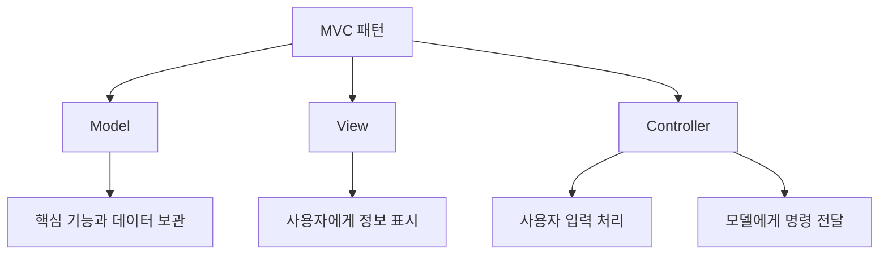

- MVC는 애플리케이션을 `Model`, `View`, `Controller`로 나누어 핵심 데이터/기능, 화면 표시, 사용자 입력 처리를 분리하는 패턴이다.
- PDF 기준 Model은 서브시스템의 핵심 기능과 데이터를 보관하고, View는 사용자에게 정보를 표시하며, Controller는 사용자 입력에 따른 변경 요청을 처리하기 위해 Model에게 명령을 보낸다.
- 시험에서는 MVC의 장점보다 먼저 `M/V/C 각각의 역할`을 정확히 구분하는 것이 중요하다.

---

## 2. PDF 기준 핵심

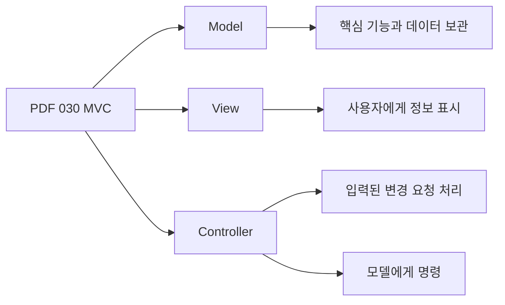

- PDF에서 직접 확인한 내용:
  - `모델(Model)`: 서브시스템의 핵심 기능과 데이터를 보관한다.
  - `뷰(View)`: 사용자에게 정보를 표시한다.
  - `컨트롤러(Controller)`: 사용자로부터 입력된 변경 요청을 처리하기 위해 모델에게 명령을 보낸다.

- 1차 암기 키워드:
  - Model = `핵심 기능`, `데이터`
  - View = `사용자에게 정보 표시`
  - Controller = `사용자 입력`, `변경 요청`, `모델에게 명령`

- 시험에서 가장 흔한 변형:
  - `사용자의 입력을 받아 모델을 갱신한다` -> Controller
  - `화면에 데이터를 표현한다` -> View
  - `업무 규칙과 상태를 가진다` -> Model

---

## 3. 검색으로 보강한 관점

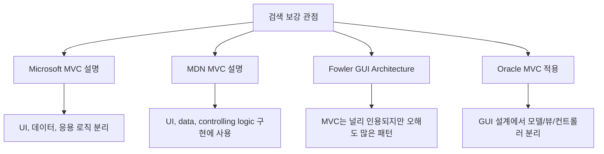

- Microsoft의 MVC 설명은 MVC를 사용자 인터페이스, 데이터, 애플리케이션 로직을 분리하는 패턴으로 설명한다.
- MDN은 MVC가 사용자 인터페이스, 데이터, 제어 로직을 구현할 때 많이 사용되는 설계 패턴이라고 설명한다.
- Martin Fowler는 MVC가 널리 인용되지만 실제 구현에서는 여러 변형이 있어 역할을 정확히 이해해야 한다는 관점을 제공한다.
- Oracle Java MVC 자료는 GUI 애플리케이션 설계에서도 Model, View, Controller 분리가 중요하다는 점을 보여준다.
- 정보처리기사에서는 프레임워크별 변형보다 PDF의 역할 정의를 우선한다.

---

## 4. MVC가 해결하려는 문제

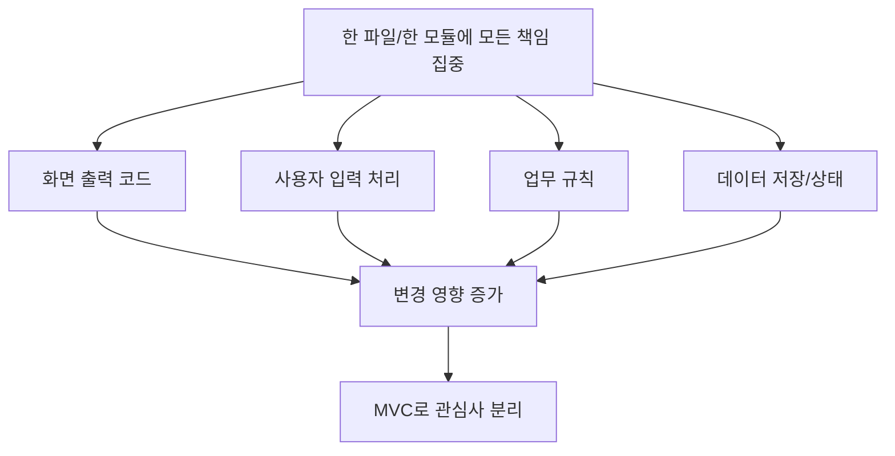

- MVC가 없는 구조에서는 다음 코드가 한 곳에 뒤섞이기 쉽다.
  - 화면을 그리는 코드
  - 버튼 클릭이나 폼 입력을 처리하는 코드
  - 업무 규칙을 수행하는 코드
  - 데이터 상태를 저장하거나 변경하는 코드

- 이런 구조의 문제:
  - 화면만 바꾸고 싶어도 업무 로직을 건드릴 수 있다.
  - 데이터 구조가 바뀌면 화면 코드와 입력 처리 코드가 함께 깨질 수 있다.
  - 테스트하기 어렵다.
  - 같은 데이터를 다른 화면으로 보여주기 어렵다.

- MVC는 이 책임들을 세 부분으로 나누어 변경 영향을 줄인다.
- 핵심 방향:
  - 데이터와 업무 규칙은 Model에 둔다.
  - 사용자에게 보이는 표현은 View에 둔다.
  - 입력 해석과 흐름 제어는 Controller에 둔다.

---

## 5. Model

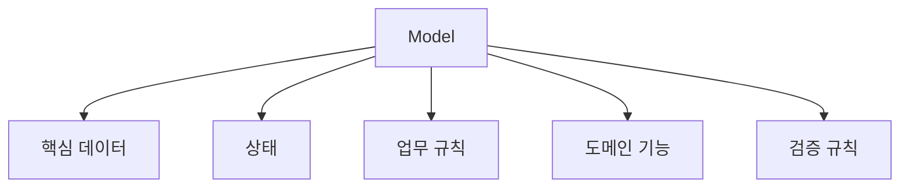

- Model은 서브시스템의 핵심 기능과 데이터를 보관한다.
- Model이 담당하는 것:
  - 애플리케이션의 핵심 데이터
  - 도메인 상태
  - 업무 규칙
  - 계산, 검증, 상태 변경
  - 데이터 저장소와의 연동을 직접 또는 간접적으로 수행하는 기능

- 예:
  - 게시판 시스템의 게시글, 댓글, 작성자 정보
  - 주문 시스템의 주문 상태, 주문 금액 계산, 할인 규칙
  - 은행 시스템의 계좌 잔액, 입금/출금 규칙

- Model이 담당하지 않는 것:
  - HTML이나 화면 레이아웃을 직접 그리는 일
  - 버튼 클릭 이벤트를 직접 해석하는 일
  - 사용자에게 어떤 색으로 보여줄지 결정하는 일

- 시험 단서:
  - `핵심 기능`
  - `데이터`
  - `상태`
  - `업무 규칙`
  - `도메인 로직`

---

## 6. View

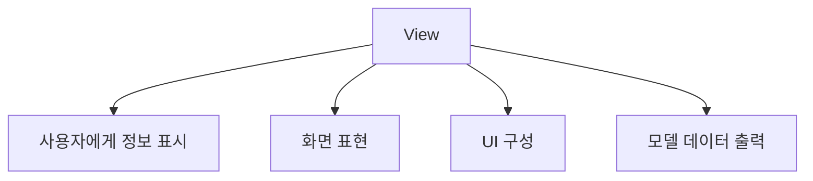

- View는 사용자에게 정보를 표시한다.
- View가 담당하는 것:
  - 화면 표시
  - UI 레이아웃
  - 모델 데이터를 사용자에게 보여주는 형식
  - 표, 목록, 그래프, 폼, 메시지 등 표현 요소

- 예:
  - 게시글 목록 화면
  - 주문 상세 화면
  - 통계 그래프
  - 로그인 폼

- View가 담당하지 않는 것:
  - 주문 금액 계산 같은 핵심 업무 규칙
  - DB 저장 방식 결정
  - 사용자의 변경 요청을 최종적으로 모델에 반영하는 흐름 제어

- 시험 단서:
  - `사용자에게 정보 표시`
  - `화면`
  - `출력`
  - `표현`
  - `UI`

---

## 7. Controller

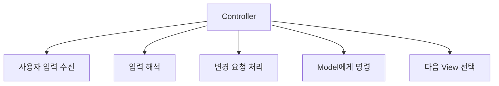

- Controller는 사용자로부터 입력된 변경 요청을 처리하기 위해 Model에게 명령을 보낸다.
- Controller가 담당하는 것:
  - 사용자 입력 수신
  - 요청 파라미터 해석
  - 어떤 Model 기능을 호출할지 결정
  - 처리 결과에 따라 어떤 View를 보여줄지 결정
  - 애플리케이션 흐름 제어

- 예:
  - 사용자가 `저장` 버튼을 누르면 Controller가 입력값을 받아 Model의 저장 기능을 호출한다.
  - 사용자가 `/orders/10` URL을 요청하면 Controller가 주문 조회 Model을 호출하고 주문 상세 View로 전달한다.

- Controller가 담당하지 않는 것:
  - 핵심 업무 규칙을 모두 직접 구현하는 일
  - 화면의 세부 표현을 직접 담당하는 일
  - 모든 데이터를 직접 보관하는 일

- 시험 단서:
  - `사용자 입력`
  - `변경 요청`
  - `모델에게 명령`
  - `요청 처리`
  - `흐름 제어`

---

## 8. MVC 동작 흐름

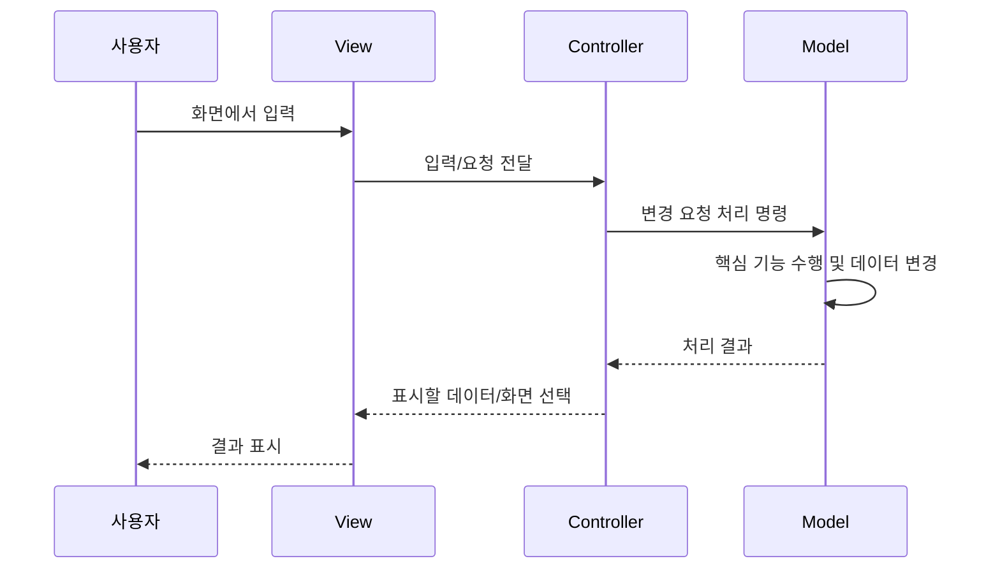

- 일반적인 흐름:
  - 사용자가 View를 통해 입력한다.
  - Controller가 입력을 해석한다.
  - Controller가 Model에게 필요한 명령을 보낸다.
  - Model이 핵심 기능을 수행하고 데이터를 변경하거나 조회한다.
  - View가 결과를 사용자에게 표시한다.

- 구현 방식은 프레임워크마다 다를 수 있다.
- 어떤 구현에서는 View가 Model을 직접 관찰하거나, Controller가 View를 선택하거나, 라우터가 Controller 앞에 존재할 수 있다.
- 하지만 정보처리기사 시험에서는 PDF의 역할 구분을 기준으로 푸는 것이 가장 안전하다.

---

## 9. 장점

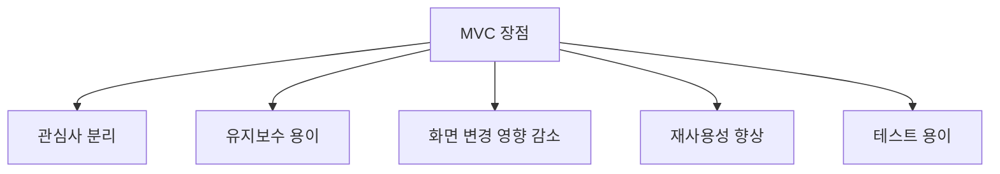

- 관심사 분리:
  - 데이터/업무 규칙, 화면 표현, 입력 처리를 분리한다.

- 유지보수 용이:
  - 화면 변경이 Model의 핵심 로직에 미치는 영향을 줄일 수 있다.
  - 업무 규칙 변경이 View 전체 수정으로 번지는 것을 줄일 수 있다.

- 재사용성 향상:
  - 같은 Model을 여러 View에서 사용할 수 있다.
  - 예를 들어 같은 주문 데이터를 웹 화면, 모바일 화면, 관리자 화면에서 다르게 보여줄 수 있다.

- 테스트 용이:
  - Model은 UI 없이도 업무 규칙 중심으로 테스트할 수 있다.
  - Controller는 요청/응답 흐름을 중심으로 테스트할 수 있다.

- 협업 용이:
  - UI 담당자, 백엔드 로직 담당자, 흐름 제어 담당자의 작업 경계를 나누기 쉽다.

---

## 10. 단점과 주의점

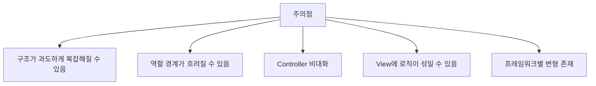

- 작은 프로그램에서는 MVC를 엄격히 나누는 것이 오히려 복잡하게 느껴질 수 있다.
- Controller가 모든 업무 로직을 떠안으면 `Fat Controller` 문제가 생긴다.
- View에 조건문과 계산 로직이 지나치게 많아지면 View가 복잡해지고 Model의 책임이 흐려진다.
- Model이 화면 표현 방식을 지나치게 알면 View와 결합도가 높아진다.
- 프레임워크마다 MVC 구현 방식이 다르므로, 시험에서는 특정 프레임워크 세부보다 역할 정의에 집중한다.

---

## 11. MVC와 다른 패턴 비교

| 구분 | 핵심 구조 | 주 용도 | 시험 단서 |
|---|---|---|---|
| `MVC` | Model, View, Controller 분리 | UI, 데이터, 입력 처리 분리 | 모델/뷰/컨트롤러 |
| `파이프-필터` | 필터들이 파이프로 연결 | 데이터 흐름 처리 | 파이프, 필터, 오버헤드 |
| `계층형 패턴` | 계층별 책임 분리 | 시스템 기능 계층화 | 상위/하위 계층 |
| `클라이언트-서버` | 요청자와 제공자 분리 | 네트워크 서비스 | 클라이언트, 서버 |
| `옵서버` | 상태 변화 통지 | 객체 간 알림 | 변화 통지, 구독 |

- MVC와 파이프-필터:
  - MVC는 사용자 인터페이스와 데이터/제어 로직 분리가 핵심이다.
  - 파이프-필터는 데이터가 여러 처리 단계를 따라 흐르는 것이 핵심이다.

- MVC와 계층형 패턴:
  - MVC는 UI 구성 요소의 역할 분리에 초점이 있다.
  - 계층형 패턴은 시스템을 프레젠테이션, 비즈니스, 데이터 접근 같은 계층으로 나누는 데 초점이 있다.

- MVC와 옵서버:
  - 일부 MVC 구현에서는 Model 변경을 View에 알리는 데 옵서버 개념을 사용할 수 있다.
  - 하지만 옵서버 자체는 상태 변화 통지에 초점을 둔 행위 패턴이다.

---

## 12. 시험 포인트 - 시험에서 나오는 함정

- `Model은 사용자에게 정보를 표시한다`는 틀린 설명이다.
  - 사용자에게 정보를 표시하는 것은 View이다.

- `View는 핵심 기능과 데이터를 보관한다`는 틀린 설명이다.
  - 핵심 기능과 데이터는 Model이다.

- `Controller는 사용자의 입력된 변경 요청을 처리하기 위해 모델에게 명령을 보낸다`는 맞는 설명이다.

- `Controller가 모든 데이터를 영구적으로 보관한다`는 부정확하다.
  - 데이터와 상태의 중심은 Model이다.

- `MVC는 파이프를 통해 처리 결과물을 다음 시스템으로 넘기는 패턴이다`는 틀린 설명이다.
  - 그 설명은 파이프-필터 패턴이다.

- `MVC는 UI와 업무 로직을 분리하는 데 도움을 준다`는 맞는 설명이다.

---

## 13. 예시로 이해하기

### 예시 1: 게시판 글 작성

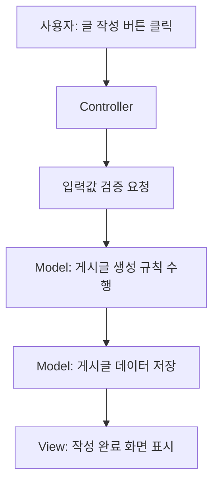

- Model:
  - 게시글 데이터
  - 제목/본문 검증 규칙
  - 작성자 정보 연결
  - 저장 처리

- View:
  - 글 작성 폼
  - 작성 완료 화면
  - 오류 메시지 표시

- Controller:
  - 사용자의 저장 요청 수신
  - 입력값을 Model에 전달
  - 처리 결과에 따라 완료 화면 또는 오류 화면 선택

### 예시 2: 쇼핑몰 주문 상세

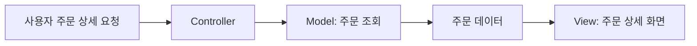

- Model은 주문 데이터와 주문 상태 계산을 담당한다.
- View는 주문자, 상품, 금액, 배송 상태를 화면에 표시한다.
- Controller는 어떤 주문을 조회할지 요청을 해석하고 Model을 호출한다.

### 예시 3: 같은 Model, 여러 View

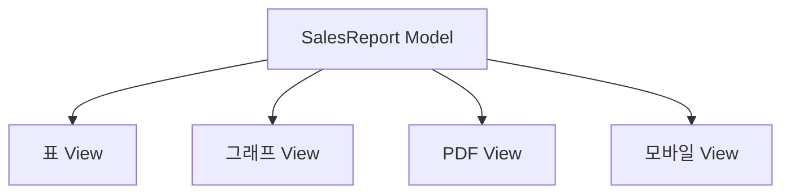

- 같은 매출 데이터라도 표, 그래프, PDF, 모바일 화면으로 다르게 보여줄 수 있다.
- 이때 Model을 재사용하고 View만 바꾸는 것이 MVC의 장점이다.

---

## 14. 암기 포인트

- 기본 암기:
  - `M = Model = 핵심 기능 + 데이터`
  - `V = View = 사용자에게 정보 표시`
  - `C = Controller = 사용자 입력 처리 + Model에게 명령`

- 단서어 암기:
  - Model: `데이터`, `상태`, `업무 규칙`, `핵심 기능`
  - View: `화면`, `표시`, `출력`, `UI`
  - Controller: `입력`, `요청`, `변경`, `명령`, `흐름 제어`

- 문장형 암기:
  - Model은 서브시스템의 핵심 기능과 데이터를 보관한다.
  - View는 사용자에게 정보를 표시한다.
  - Controller는 사용자 입력에 따른 변경 요청을 처리하기 위해 Model에게 명령을 보낸다.

- 비교형 문제 접근:
  - 지문이 화면 표시인지 본다 -> View
  - 지문이 데이터와 업무 규칙인지 본다 -> Model
  - 지문이 사용자 입력과 요청 처리인지 본다 -> Controller

---

## 15. 빠른 복습

- 챕터명: `030 MVC(Model-View-Controller) 패턴`
- PDF 위치: `4페이지`
- PDF 최소 암기:
  - Model = 핵심 기능과 데이터 보관
  - View = 사용자에게 정보 표시
  - Controller = 입력된 변경 요청 처리, Model에게 명령

- 가장 중요한 구분:
  - Model은 `무엇을 알고 처리하는가`
  - View는 `무엇을 보여주는가`
  - Controller는 `입력을 어떻게 Model 요청으로 바꾸는가`

- 문제 풀이 체크:
  - 지문에 사용자 입력이 있으면 Controller를 먼저 본다.
  - 지문에 화면 표시가 있으면 View를 먼저 본다.
  - 지문에 핵심 데이터와 기능이 있으면 Model을 먼저 본다.

---

## 16. 참고 링크

- 기준 PDF: `/Users/nes0903/Documents/study/정보처리기사/핵심요약집_2026_정보처리기사필기핵심요약.pdf`
- [Q-Net - 정보처리기사 종목 정보](https://www.q-net.or.kr/crf005.do?id=crf00503&jmCd=1320)
- [Microsoft .NET - ASP.NET MVC Pattern](https://dotnet.microsoft.com/en-us/apps/aspnet/mvc)
- [MDN Web Docs - MVC](https://developer.mozilla.org/en-US/docs/Glossary/MVC)
- [Martin Fowler - GUI Architectures](https://martinfowler.com/eaaDev/uiArchs.html)
- [Oracle - Java SE Application Design With MVC](https://www.oracle.com/technical-resources/articles/javase/application-design-with-mvc.html)
