# 031 메시지(Message)

작성 기준일: 2026-05-02
검색/보강일: 2026-06-01
과목: `1과목 소프트웨어 설계`
기준 PDF: `/Users/nes0903/Documents/study/정보처리기사/핵심요약집_2026_정보처리기사필기핵심요약.pdf`
PDF 확인 위치: `4페이지`
주제별 검색 키워드:
- `OMG UML message interaction sequence diagram`
- `object oriented programming message passing objects communicate`
- `Oracle Java object oriented message passing method invocation`
- `UML message communication between lifelines`

---

## 1. 한 줄 요약

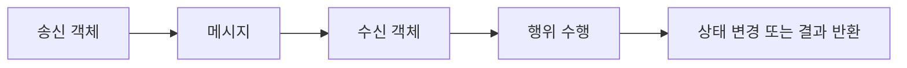

- 메시지는 객체에게 어떤 행위를 수행하도록 지시하는 명령 또는 요구사항이다.
- 객체지향 시스템에서 객체들은 메시지를 주고받으며 서로 상호작용한다.
- 시험에서는 `객체에게 행위 지시`, `명령 또는 요구사항`, `객체 간 상호작용 수단`이라는 PDF 표현을 그대로 연결해야 한다.

---

## 2. PDF 기준 핵심

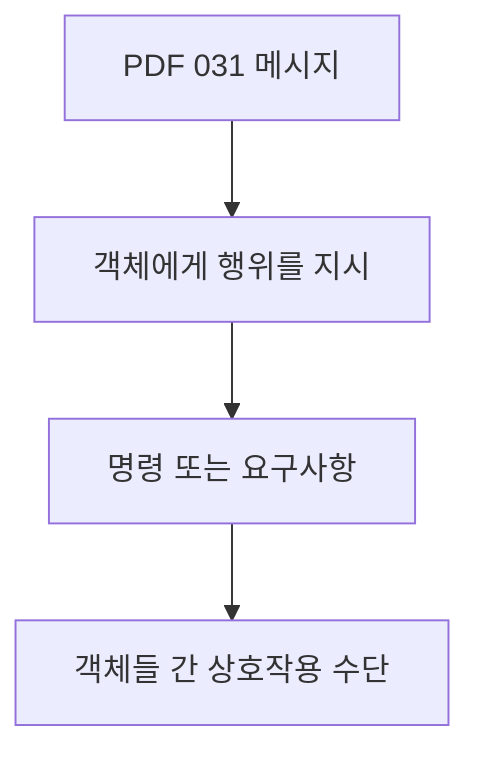

- PDF에서 직접 확인한 내용:
  - 객체에게 어떤 행위를 하도록 지시하는 명령 또는 요구사항이다.
  - 객체들 간에 상호 작용을 하는 데 사용되는 수단이다.

- 1차 암기 키워드:
  - `객체`
  - `행위`
  - `지시`
  - `명령`
  - `요구사항`
  - `상호작용`
  - `수단`

- 시험식 표현:
  - 객체가 다른 객체에게 일을 요청한다.
  - 객체 간 통신은 메시지를 통해 이루어진다.
  - 메시지를 받은 객체는 자신의 연산 또는 메서드를 수행한다.

---

## 3. 검색으로 보강한 관점

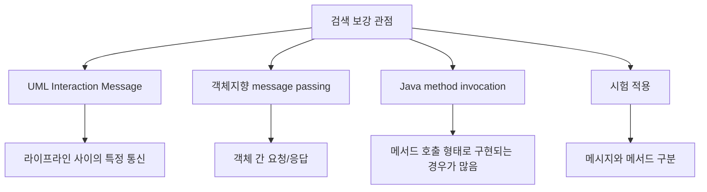

- UML 상호작용 다이어그램에서 메시지는 객체 또는 라이프라인 사이의 통신을 표현한다.
- 객체지향 프로그래밍에서 메시지 전달은 객체가 다른 객체에게 어떤 동작을 요청하는 방식으로 이해된다.
- Java 같은 언어에서는 메시지 전달이 보통 메서드 호출 형태로 구현된다.
- 시험에서는 UML 세부 표기보다 `객체에게 행위를 요청한다`는 의미가 더 중요하다.

---

## 4. 메시지의 구성 요소

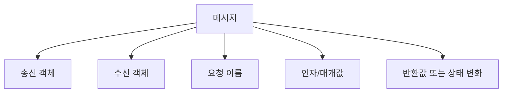

- 송신 객체:
  - 메시지를 보내는 객체이다.
  - 다른 객체에게 어떤 행위를 요청한다.

- 수신 객체:
  - 메시지를 받는 객체이다.
  - 자신이 가진 연산이나 메서드로 요청을 처리한다.

- 요청 이름:
  - 어떤 행위를 원하는지 나타낸다.
  - 예: `withdraw`, `save`, `calculateTotal`, `sendEmail`

- 인자/매개값:
  - 행위를 수행하는 데 필요한 값이다.
  - 예: 출금 금액, 저장할 주문 정보, 이메일 주소

- 반환값 또는 상태 변화:
  - 메시지 처리 결과가 값으로 돌아올 수 있다.
  - 또는 객체 내부 상태가 바뀔 수 있다.

---

## 5. 메시지와 메서드의 관계

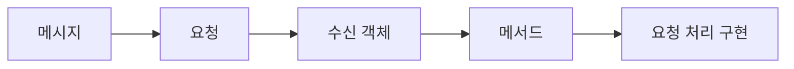

- 메시지는 `요청`이다.
- 메서드는 그 요청을 실제로 처리하는 `구현`이다.
- 객체지향 언어에서는 메시지를 보내는 행위가 코드상으로 메서드 호출처럼 보이는 경우가 많다.

- 예:
  - 코드: `account.withdraw(10000)`
  - 메시지 관점: `account` 객체에게 `10000원 출금하라`는 메시지를 보낸다.
  - 메서드 관점: `Account` 클래스의 `withdraw` 메서드가 실행된다.

- 시험에서 안전한 구분:
  - 메시지 = 객체에게 전달되는 명령/요구
  - 메서드 = 그 명령/요구를 수행하는 연산 또는 코드

- 이 구분은 다형성과도 연결된다.
  - 같은 메시지를 보내도 수신 객체의 실제 타입에 따라 다른 메서드가 실행될 수 있다.

---

## 6. 메시지 전달 흐름

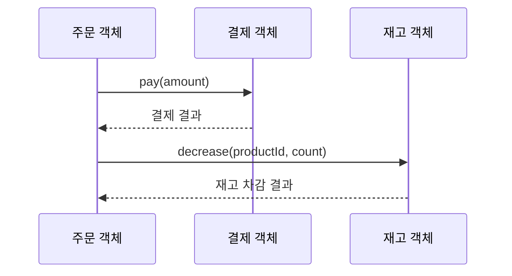

- 주문 객체는 결제 객체에게 결제 메시지를 보낸다.
- 결제 객체는 자신의 책임에 따라 결제를 처리하고 결과를 반환한다.
- 주문 객체는 재고 객체에게 재고 차감 메시지를 보낸다.
- 재고 객체는 자신의 내부 상태와 규칙에 따라 재고를 차감한다.

- 이 흐름에서 중요한 점:
  - 주문 객체가 결제 객체의 내부 결제 알고리즘을 직접 수행하지 않는다.
  - 결제 객체에게 메시지를 보내 책임을 위임한다.
  - 객체들은 메시지를 통해 협력한다.

---

## 7. 메시지가 객체지향에서 중요한 이유

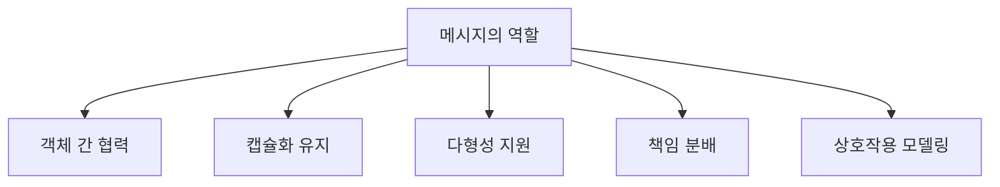

- 객체 간 협력:
  - 객체는 혼자 모든 일을 하지 않는다.
  - 필요한 책임을 가진 다른 객체에게 메시지를 보낸다.

- 캡슐화 유지:
  - 외부 객체가 수신 객체의 내부 데이터를 직접 조작하지 않는다.
  - 공개된 메시지/메서드를 통해 요청한다.

- 다형성 지원:
  - 같은 메시지를 여러 객체에게 보낼 수 있다.
  - 실제 객체 타입에 따라 다른 동작이 수행될 수 있다.

- 책임 분배:
  - 메시지를 받는 객체가 그 행위의 책임을 가진다.
  - 설계할 때 `누가 이 메시지를 받아 처리해야 하는가?`를 고민한다.

- 상호작용 모델링:
  - 순차 다이어그램에서 객체 사이의 메시지 흐름을 시간 순서로 표현한다.
  - 통신 다이어그램에서도 객체 간 메시지 교환을 표현한다.

---

## 8. UML에서의 메시지

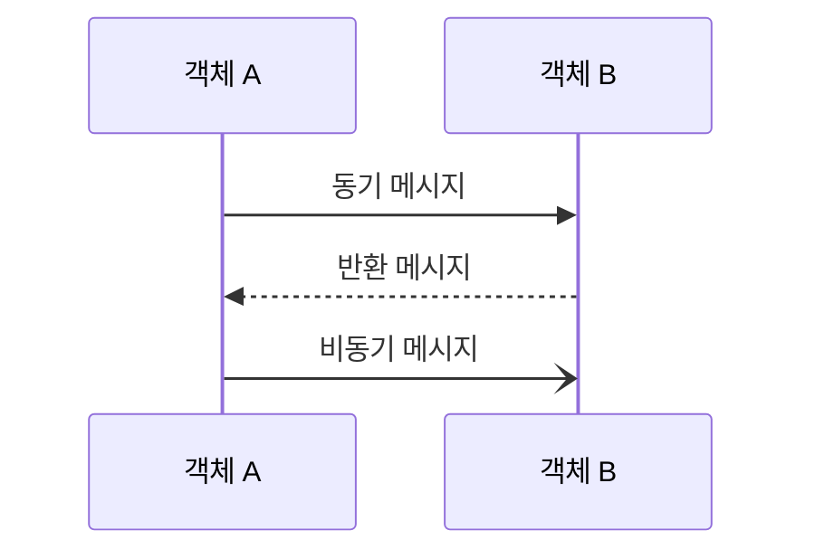

- UML 순차 다이어그램에서는 객체 또는 라이프라인 사이의 상호작용을 메시지 화살표로 나타낸다.
- 대표 메시지 형태:
  - 동기 메시지: 송신자가 수신자의 처리를 기다린다.
  - 비동기 메시지: 송신자가 수신자의 완료를 기다리지 않고 흐름을 계속할 수 있다.
  - 반환 메시지: 처리 결과가 송신자에게 돌아온다.
  - 생성 메시지: 객체 생성을 나타낼 수 있다.
  - 소멸 메시지: 객체 소멸을 나타낼 수 있다.

- 정보처리기사 031 챕터에서는 UML 표기 세부보다 메시지의 기본 의미가 중요하다.
- 다만 앞 챕터의 순차 다이어그램과 연결하면 메시지를 더 쉽게 이해할 수 있다.

---

## 9. 메시지와 주변 개념 비교

| 구분 | 핵심 의미 | 시험 단서 | 예 |
|---|---|---|---|
| `메시지` | 객체에게 행위를 요청하는 명령/요구 | 행위 지시, 상호작용 수단 | `withdraw(10000)` 요청 |
| `메서드` | 메시지를 처리하는 구체적 연산 | 실행 코드, 함수 | `withdraw` 구현 |
| `객체` | 상태와 행위를 가진 독립 단위 | 속성, 연산, 식별성 | `account` |
| `클래스` | 객체의 공통 속성과 연산을 정의 | 객체의 집합/틀 | `Account` |
| `인터페이스` | 외부와 상호작용하는 약속 | 공개 연산, 호출 규약 | `PaymentService` |

- 메시지와 메서드는 특히 헷갈리기 쉽다.
- 메시지는 `무엇을 해달라는 요청`이고, 메서드는 `그 요청을 처리하는 코드`이다.
- 객체는 메시지를 받을 수 있는 대상이다.
- 클래스는 메시지를 처리할 메서드의 구조를 정의할 수 있다.
- 인터페이스는 어떤 메시지를 받을 수 있는지 외부에 약속한다.

---

## 10. 다형성과 메시지

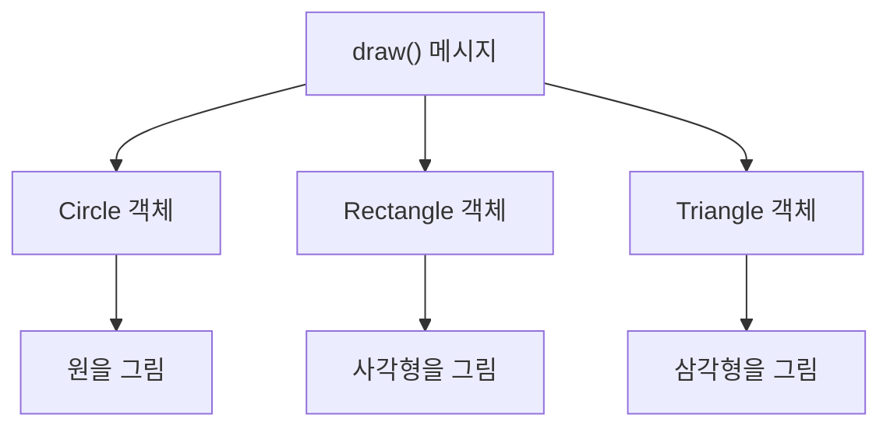

- 다형성에서는 같은 메시지를 여러 객체에게 보낼 수 있다.
- 각 객체는 자신의 타입과 책임에 맞게 메시지를 다르게 처리한다.
- 예:
  - `draw()` 메시지를 `Circle`, `Rectangle`, `Triangle` 객체에게 보낸다.
  - 메시지 이름은 같지만 실제 실행 결과는 객체마다 다르다.

- 시험 연결:
  - 메시지는 객체 간 상호작용 수단이다.
  - 다형성은 같은 메시지가 여러 형태로 동작할 수 있음을 보여준다.
  - 뒤의 `035 다형성`과 연결해서 이해하면 좋다.

---

## 11. 시험 포인트 - 시험에서 나오는 함정

- `메시지는 객체의 속성을 저장하는 공간이다`는 틀린 설명이다.
  - 속성을 저장하는 것은 객체의 상태 또는 필드에 가깝다.

- `메시지는 객체에게 행위를 하도록 지시하는 명령 또는 요구사항이다`는 맞는 설명이다.

- `객체 간 상호작용에는 메시지가 사용되지 않는다`는 틀린 설명이다.
  - PDF에서 객체 간 상호작용 수단이라고 직접 제시한다.

- `메시지는 반드시 네트워크 메시지만 의미한다`는 부정확하다.
  - 이 챕터에서는 객체지향에서 객체 간 행위 요청을 의미한다.

- `메시지와 메서드는 항상 완전히 같은 말이다`는 조심해야 한다.
  - 코드에서는 메서드 호출처럼 나타날 수 있지만, 개념적으로 메시지는 요청이고 메서드는 처리 구현이다.

- `같은 메시지에 대해 객체마다 다르게 반응할 수 있다`는 다형성과 연결되는 맞는 설명이다.

---

## 12. 예시로 이해하기

### 예시 1: 계좌 출금

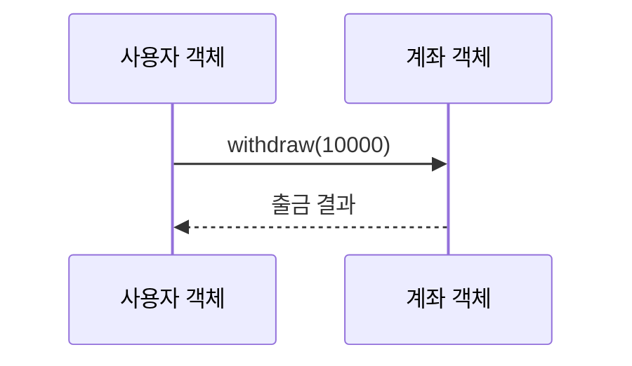

- 사용자 객체가 계좌 객체에게 `withdraw(10000)` 메시지를 보낸다.
- 계좌 객체는 잔액 확인, 한도 확인, 기록 저장 등을 수행한다.
- 사용자 객체는 계좌 내부 필드를 직접 수정하지 않는다.

### 예시 2: 주문 생성

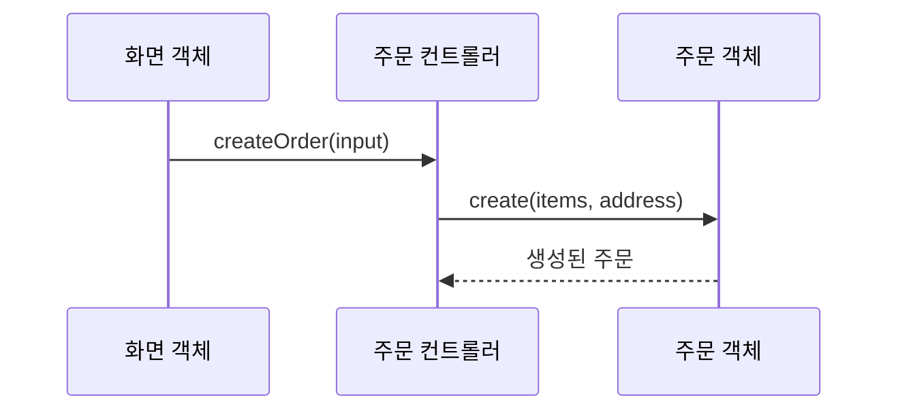

- 화면 객체는 컨트롤러에게 주문 생성 메시지를 보낸다.
- 컨트롤러는 주문 객체에게 실제 주문 생성 메시지를 보낸다.
- 각 객체는 자신이 맡은 책임에 따라 메시지를 처리한다.

### 예시 3: 알림 발송

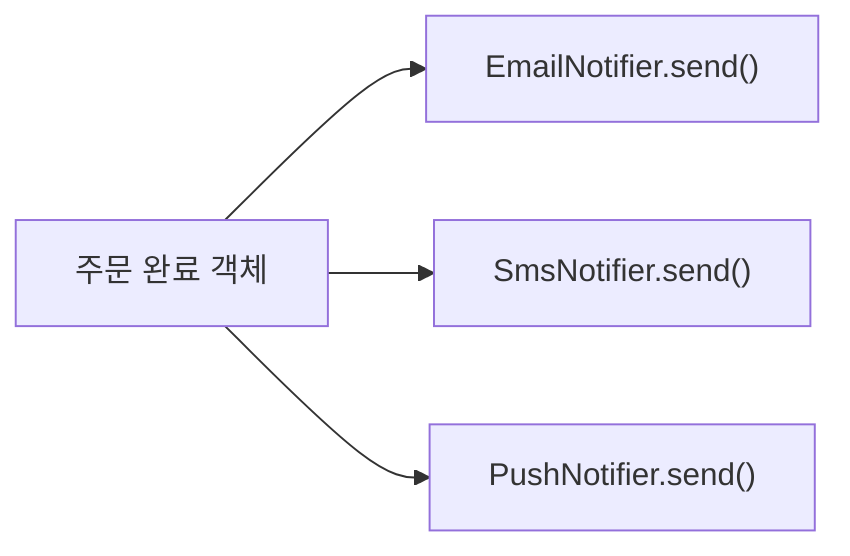

- 같은 `send()` 메시지를 이메일, 문자, 푸시 알림 객체에 보낼 수 있다.
- 각 객체는 자신의 방식으로 알림을 보낸다.
- 이는 메시지와 다형성을 함께 이해하기 좋은 예이다.

---

## 13. 암기 포인트

- 기본 암기:
  - 메시지 = `객체에게 행위 지시`
  - 메시지 = `명령 또는 요구사항`
  - 메시지 = `객체 간 상호작용 수단`

- 단서어 암기:
  - `객체`
  - `행위`
  - `지시`
  - `명령`
  - `요구사항`
  - `상호작용`
  - `메서드 호출`

- 문장형 암기:
  - 메시지는 객체에게 어떤 행위를 하도록 지시하는 명령 또는 요구사항이다.
  - 객체들은 메시지를 통해 상호작용한다.
  - 메시지를 받은 객체는 자신의 책임에 따라 연산을 수행한다.

- 비교형 문제 접근:
  - 요청 자체를 말하면 메시지이다.
  - 요청을 처리하는 코드를 말하면 메서드이다.
  - 요청을 받는 실체를 말하면 객체이다.

---

## 14. 빠른 복습

- 챕터명: `031 메시지(Message)`
- PDF 위치: `4페이지`
- PDF 최소 암기:
  - 객체에게 어떤 행위를 하도록 지시하는 명령 또는 요구사항
  - 객체들 간 상호작용에 사용되는 수단

- 가장 중요한 구분:
  - 메시지 = 요청
  - 메서드 = 요청 처리 구현
  - 객체 = 메시지를 보내거나 받는 대상

- 문제 풀이 체크:
  - 지문에 객체가 다른 객체에게 행위를 요청하는가?
  - 명령 또는 요구사항이라는 표현이 있는가?
  - 객체 간 상호작용 수단을 묻는가?
  - 그렇다면 메시지를 우선 의심한다.

---

## 15. 참고 링크

- 기준 PDF: `/Users/nes0903/Documents/study/정보처리기사/핵심요약집_2026_정보처리기사필기핵심요약.pdf`
- [Q-Net - 정보처리기사 종목 정보](https://www.q-net.or.kr/crf005.do?id=crf00503&jmCd=1320)
- [OMG - UML Specification](https://www.omg.org/spec/UML/)
- [UML Diagrams - Interaction Message](https://www.uml-diagrams.org/interaction-message.html?context=interaction-overview)
- [Oracle - The Java Language Environment](https://www.oracle.com/java/technologies/object-oriented.html)

<!-- study-links:start -->
## 관련 문서

- `uml`: [[정보처리기사/1과목 소프트웨어 설계/013 UML/013 UML|013 UML]]
- `캡슐화`: [[정보처리기사/1과목 소프트웨어 설계/033 캡슐화(Encapsulation)/033 캡슐화(Encapsulation)|033 캡슐화(Encapsulation)]]
- `다형성`: [[정보처리기사/1과목 소프트웨어 설계/035 다형성(Polymorphism)/035 다형성(Polymorphism)|035 다형성(Polymorphism)]]
<!-- study-links:end -->
