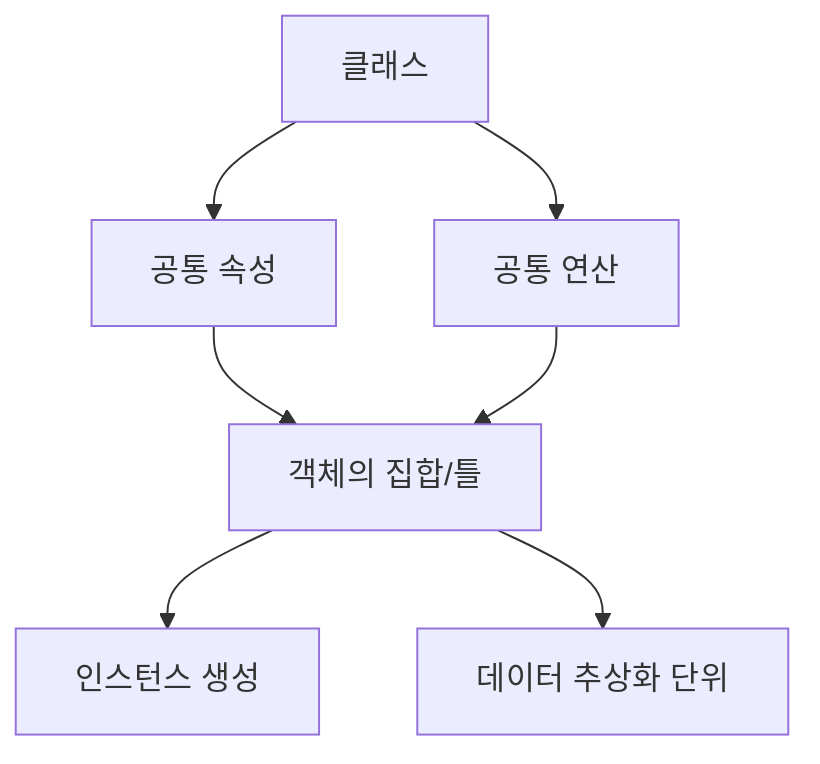
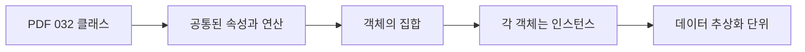
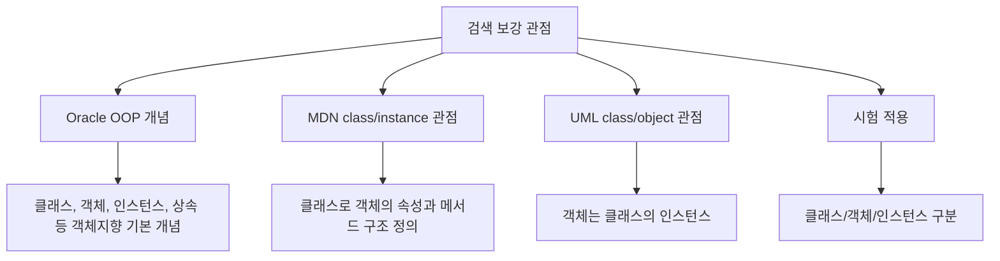
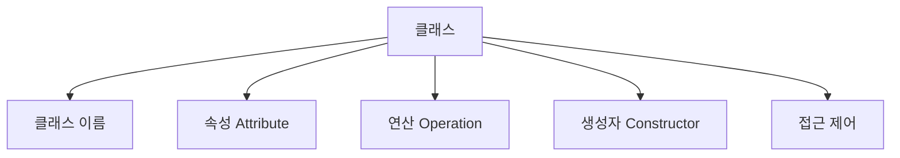
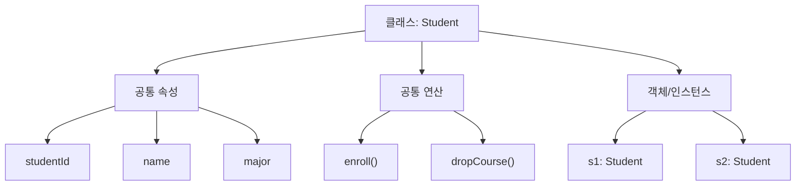
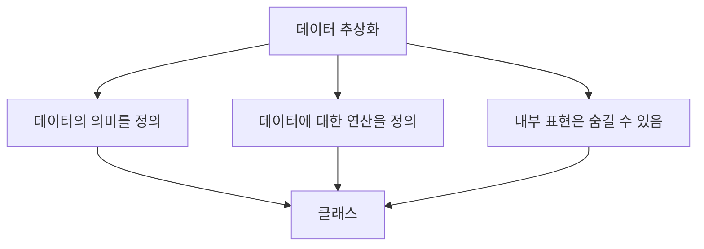
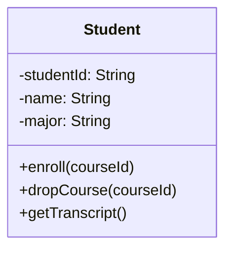
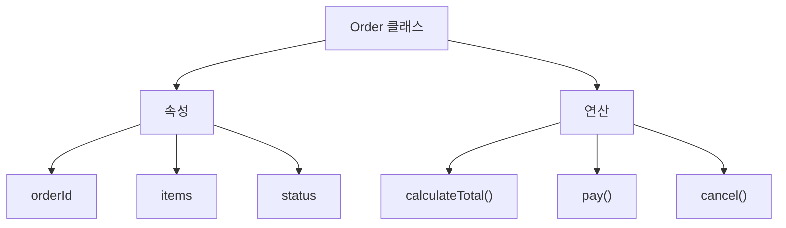

# 032 클래스(Class)

작성 기준일: 2026-05-02
검색/보강일: 2026-06-01
과목: `1과목 소프트웨어 설계`
기준 PDF: `/Users/nes0903/Documents/study/정보처리기사/핵심요약집_2026_정보처리기사필기핵심요약.pdf`
PDF 확인 위치: `5페이지`
주제별 검색 키워드:
- `Oracle Java object oriented programming class object instance`
- `Oracle Java tutorials object class inheritance concepts`
- `MDN classes object instance properties methods`
- `UML class attributes operations instance object`

---

## 1. 한 줄 요약

- 클래스는 공통된 속성과 연산을 갖는 객체들의 집합이며, 객체를 만들기 위한 데이터 추상화 단위이다.
- 클래스에 속한 각각의 객체를 인스턴스라고 한다.
- 시험에서는 `공통된 속성과 연산`, `객체의 집합`, `인스턴스`, `데이터 추상화 단위`라는 PDF 표현을 정확히 외워야 한다.

---

## 2. PDF 기준 핵심

- PDF에서 직접 확인한 내용:
  - 공통된 속성과 연산(행위)을 갖는 객체의 집합이다.
  - 클래스에 속한 각각의 객체를 인스턴스(Instance)라 한다.
  - 객체지향 프로그램에서 데이터를 추상화하는 단위이다.

- 1차 암기 키워드:
  - `속성`
  - `연산`
  - `객체의 집합`
  - `인스턴스`
  - `데이터 추상화`

- 시험식 표현:
  - 객체를 만들기 위한 틀 또는 설계도이다.
  - 객체들이 공통으로 갖는 데이터와 행위를 정의한다.
  - 실제 생성된 개별 객체는 인스턴스라고 부른다.

---

## 3. 검색으로 보강한 관점

- Oracle의 객체지향 개념 자료는 클래스, 객체, 인스턴스, 상속 같은 기본 개념을 함께 다룬다.
- MDN의 클래스 자료는 클래스가 객체의 속성, 메서드, 초기화 방식을 정의하는 문법적 구조로 사용될 수 있음을 보여준다.
- UML 관점에서는 객체가 클래스의 인스턴스로 표현되며, 클래스는 속성과 연산을 가진 구조로 모델링된다.
- 정보처리기사에서는 언어별 문법보다 `클래스 = 공통 속성과 연산을 갖는 객체의 집합`이라는 정의가 우선이다.

---

## 4. 클래스의 구성 요소

- 클래스 이름:
  - 객체 종류나 개념을 나타내는 이름이다.
  - 예: `Student`, `Order`, `Account`, `Product`

- 속성(Attribute):
  - 객체가 가지는 데이터 또는 상태이다.
  - 예: 학생의 학번, 이름, 학과
  - 예: 주문의 주문번호, 주문일자, 총금액

- 연산(Operation):
  - 객체가 수행할 수 있는 행위이다.
  - 구현 언어에서는 메서드(Method)로 나타나는 경우가 많다.
  - 예: `calculateTotal()`, `withdraw()`, `changeAddress()`

- 생성자(Constructor):
  - 객체가 만들어질 때 초기 상태를 설정하는 특별한 연산이다.
  - 정보처리기사 기본 정의에서는 핵심 항목은 아니지만 객체 생성과 연결해 이해하면 좋다.

- 접근 제어:
  - 속성과 연산을 외부에 얼마나 공개할지 정한다.
  - `public`, `private`, `protected` 같은 접근 제어는 정보 은닉과 연결된다.

---

## 5. 클래스, 객체, 인스턴스의 관계

- 클래스:
  - 객체들이 공통으로 가질 속성과 연산을 정의한다.
  - 일종의 설계도 또는 틀로 이해할 수 있다.

- 객체:
  - 클래스를 바탕으로 실제 생성된 독립적인 실체이다.
  - 객체는 자신의 상태와 행위를 가진다.

- 인스턴스:
  - 특정 클래스에 속한 개별 객체를 말한다.
  - `s1`이 `Student` 클래스로 만들어졌다면 `s1`은 `Student`의 인스턴스이다.

- 시험에서 안전한 표현:
  - 클래스는 `객체의 집합` 또는 `객체를 만들기 위한 틀`이다.
  - 인스턴스는 `클래스에 속한 각각의 객체`이다.

---

## 6. 클래스가 데이터 추상화 단위인 이유

- PDF는 클래스를 객체지향 프로그램에서 데이터를 추상화하는 단위라고 설명한다.
- 그 이유:
  - 클래스는 데이터의 구조를 속성으로 표현한다.
  - 클래스는 그 데이터에 대해 수행할 수 있는 행위를 연산으로 표현한다.
  - 외부에서는 공개된 연산을 통해 객체를 다룰 수 있다.
  - 내부 속성의 실제 표현은 숨길 수 있다.

- 예:
  - `Account` 클래스는 계좌번호, 잔액, 소유자 정보를 속성으로 가질 수 있다.
  - `deposit`, `withdraw`, `getBalance` 연산을 제공할 수 있다.
  - 외부는 잔액 필드를 직접 바꾸기보다 `deposit`과 `withdraw`를 통해 계좌를 사용한다.

- 이처럼 클래스는 데이터와 그 데이터에 대한 의미 있는 연산을 함께 정의하므로 데이터 추상화 단위가 된다.

---

## 7. UML 클래스 표기

- UML 클래스 다이어그램에서는 보통 다음 구획으로 클래스를 표현한다.
  - 클래스 이름
  - 속성
  - 연산

- 접근 제어 표기:
  - `+`는 public을 의미한다.
  - `-`는 private을 의미한다.
  - `#`는 protected를 의미한다.

- 정보처리기사에서 클래스 자체를 묻는 문제는 UML 표기보다 정의가 중요하다.
- 하지만 UML 클래스 다이어그램과 연결하면 속성과 연산을 더 쉽게 이해할 수 있다.

---

## 8. 예시로 이해하기

### 예시 1: 학생 클래스

| 구성 요소 | 예 | 의미 |
|---|---|---|
| 클래스 이름 | `Student` | 학생 객체들의 공통 구조 |
| 속성 | `studentId`, `name`, `major` | 학생 객체가 가지는 데이터 |
| 연산 | `enroll()`, `dropCourse()` | 학생 객체가 수행할 수 있는 행위 |
| 인스턴스 | `kim: Student`, `lee: Student` | Student 클래스에 속한 개별 객체 |

- `Student` 클래스는 학생이라는 개념을 소프트웨어 구조로 표현한다.
- `kim`과 `lee`는 서로 다른 상태를 가진 개별 객체이다.
- 둘 다 `Student` 클래스의 인스턴스이다.

### 예시 2: 주문 클래스

- 주문 클래스는 주문 데이터를 추상화한다.
- 주문 상태, 주문 상품, 총금액 같은 속성을 가진다.
- 결제, 취소, 총액 계산 같은 연산을 가진다.

---

## 9. 클래스와 주변 개념 비교

| 구분 | 핵심 의미 | 시험 단서 | 예 |
|---|---|---|---|
| `클래스` | 공통 속성과 연산을 갖는 객체의 집합 | 객체의 틀, 데이터 추상화 단위 | `Student` |
| `객체` | 상태와 행위를 가진 실제 실체 | 속성값 보유, 메시지 수신 | `kimStudent` |
| `인스턴스` | 특정 클래스에 속한 개별 객체 | 클래스에 속한 각각의 객체 | `kimStudent: Student` |
| `속성` | 객체가 가지는 데이터 | 상태, 필드, 변수 | `name`, `balance` |
| `연산` | 객체가 수행할 수 있는 행위 | 메서드, 기능 | `withdraw()` |

- 클래스와 객체:
  - 클래스는 구조를 정의한다.
  - 객체는 그 구조를 바탕으로 생성된 실제 대상이다.

- 객체와 인스턴스:
  - 객체는 실제 실체라는 관점의 표현이다.
  - 인스턴스는 특정 클래스와의 관계를 강조하는 표현이다.

- 속성과 연산:
  - 속성은 객체가 `무엇을 가지고 있는가`이다.
  - 연산은 객체가 `무엇을 할 수 있는가`이다.

---

## 10. 시험 포인트 - 시험에서 나오는 함정

- `클래스는 공통된 속성과 연산을 갖는 객체의 집합이다`는 맞는 설명이다.

- `클래스에 속한 각각의 객체를 인스턴스라고 한다`는 맞는 설명이다.

- `클래스는 객체지향 프로그램에서 데이터를 추상화하는 단위이다`는 맞는 설명이다.

- `인스턴스는 클래스의 공통 속성과 연산을 정의하는 틀이다`는 틀린 설명이다.
  - 그 설명은 클래스에 가깝다.

- `속성은 객체가 수행하는 행위이다`는 틀린 설명이다.
  - 속성은 데이터이고, 행위는 연산이다.

- `연산은 객체의 상태를 나타내는 데이터이다`는 틀린 설명이다.
  - 연산은 행위 또는 메서드이다.

- `클래스와 객체는 어떤 상황에서도 완전히 같은 말이다`는 부정확하다.
  - 클래스는 정의/틀이고, 객체는 실제 생성된 실체이다.

---

## 11. 암기 포인트

- 기본 암기:
  - 클래스 = `공통 속성과 연산을 갖는 객체의 집합`
  - 인스턴스 = `클래스에 속한 각각의 객체`
  - 클래스 = `데이터 추상화 단위`

- 단서어 암기:
  - `속성`
  - `연산`
  - `객체의 집합`
  - `인스턴스`
  - `데이터 추상화`
  - `클래스에 속한 각각의 객체`

- 문장형 암기:
  - 클래스는 공통된 속성과 연산을 갖는 객체의 집합이다.
  - 클래스에 속한 각각의 객체를 인스턴스라 한다.
  - 클래스는 객체지향 프로그램에서 데이터를 추상화하는 단위이다.

- 비교형 문제 접근:
  - 틀 또는 정의를 말하면 클래스이다.
  - 실제 생성된 개별 대상을 말하면 객체 또는 인스턴스이다.
  - 상태 데이터를 말하면 속성이다.
  - 행위를 말하면 연산이다.

---

## 12. 빠른 복습

- 챕터명: `032 클래스(Class)`
- PDF 위치: `5페이지`
- PDF 최소 암기:
  - 공통된 속성과 연산을 갖는 객체의 집합
  - 클래스에 속한 각각의 객체는 인스턴스
  - 객체지향 프로그램에서 데이터를 추상화하는 단위

- 가장 중요한 구분:
  - 클래스 = 틀
  - 객체 = 실제 실체
  - 인스턴스 = 특정 클래스에 속한 객체
  - 속성 = 데이터
  - 연산 = 행위

- 문제 풀이 체크:
  - `공통 속성과 연산`이 보이는가?
  - `객체의 집합`이라는 표현이 있는가?
  - `인스턴스`의 정의를 묻는가?
  - `데이터 추상화 단위`라는 표현이 있는가?

---

## 13. 참고 링크

- 기준 PDF: `/Users/nes0903/Documents/study/정보처리기사/핵심요약집_2026_정보처리기사필기핵심요약.pdf`
- [Q-Net - 정보처리기사 종목 정보](https://www.q-net.or.kr/crf005.do?id=crf00503&jmCd=1320)
- [Oracle Java Tutorials - Object-Oriented Programming Concepts](https://docs.oracle.com/javase/tutorial/java/concepts/)
- [Oracle - The Java Language Environment](https://www.oracle.com/java/technologies/object-oriented.html)
- [MDN Web Docs - Classes](https://developer.mozilla.org/docs/Web/JavaScript/Reference/Classes)
- [UML Diagrams - Object](https://www.uml-diagrams.org/object.html)
