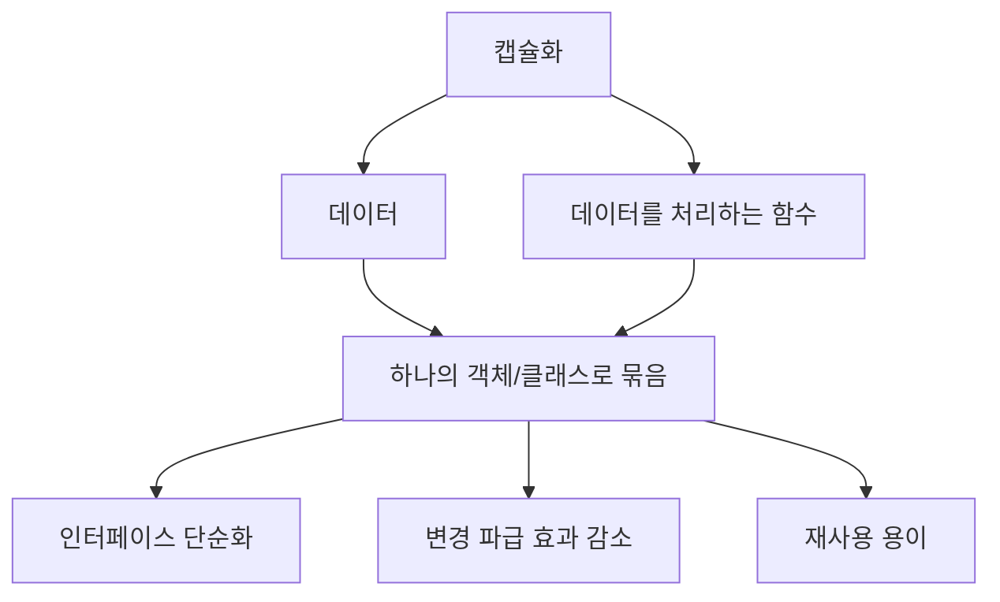
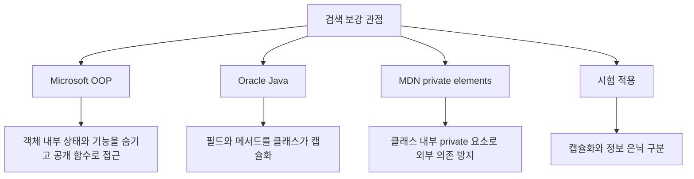
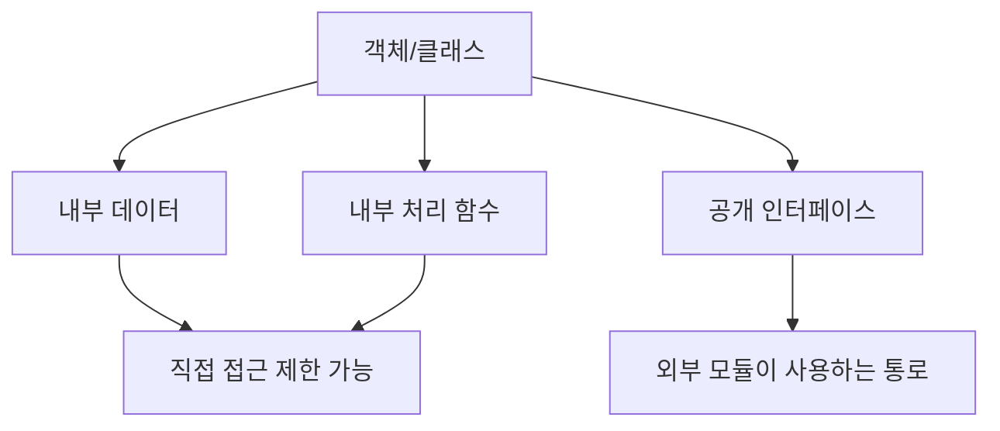
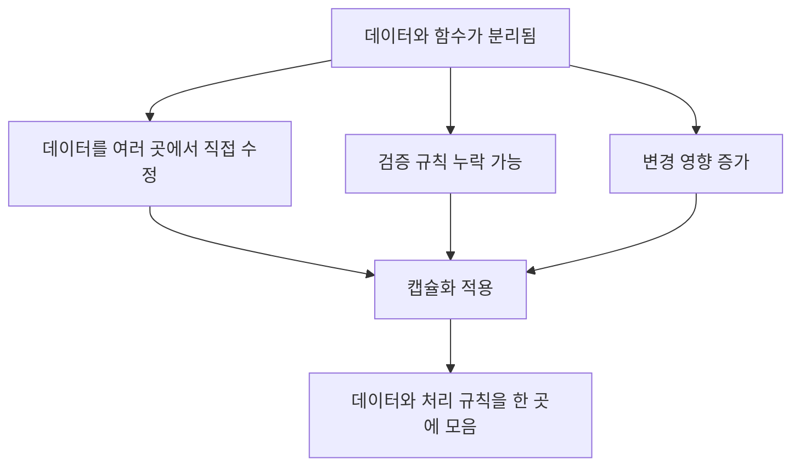
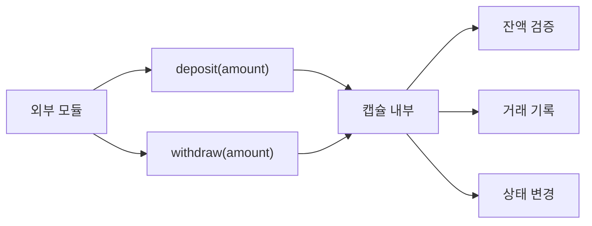
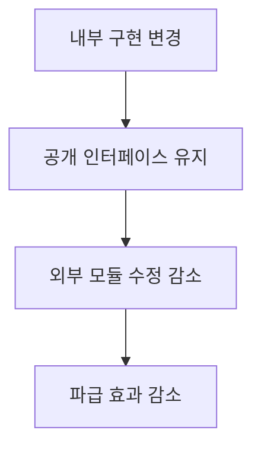
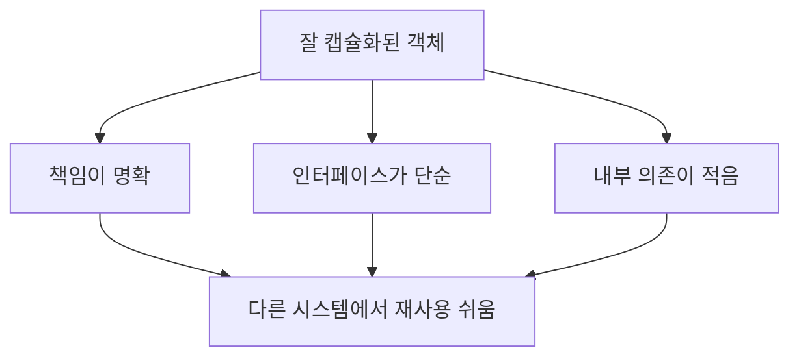
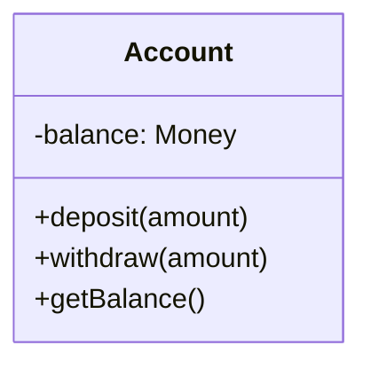
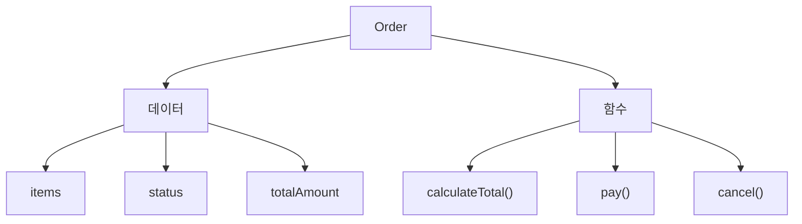
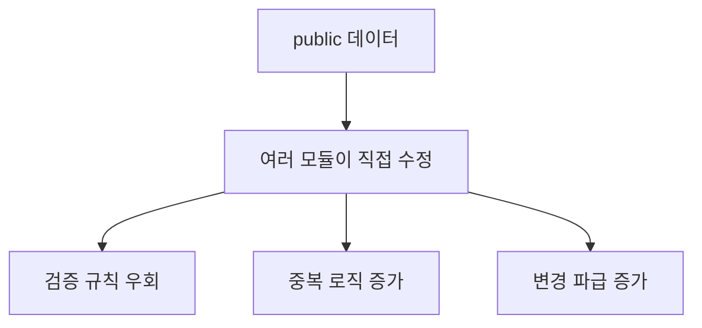

# 033 캡슐화(Encapsulation)

작성 기준일: 2026-05-02
검색/보강일: 2026-06-01
과목: `1과목 소프트웨어 설계`
기준 PDF: `/Users/nes0903/Documents/study/정보처리기사/핵심요약집_2026_정보처리기사필기핵심요약.pdf`
PDF 확인 위치: `5페이지`
주제별 검색 키워드:
- `Microsoft C# object oriented programming encapsulation internal state public functions`
- `Oracle Java encapsulation fields methods private public access`
- `MDN JavaScript private elements encapsulation class`
- `object oriented encapsulation data methods bundled`

---

## 1. 한 줄 요약

- 캡슐화는 데이터와 그 데이터를 처리하는 함수를 하나로 묶는 객체지향 기법이다.
- 외부에서는 공개된 인터페이스를 통해 객체를 사용하고, 내부 데이터와 처리 방식은 객체 안에 모아 관리한다.
- PDF 기준 핵심은 `데이터와 함수 묶음`, `외부 모듈 변경 파급 효과 감소`, `인터페이스 단순화`, `재사용 용이`이다.

---

## 2. PDF 기준 핵심

- PDF에서 직접 확인한 내용:
  - 데이터와 데이터를 처리하는 함수를 하나로 묶는 것을 의미한다.
  - 외부 모듈의 변경으로 인한 파급 효과가 적다.
  - 인터페이스가 단순화된다.
  - 재사용이 용이하다.

- 1차 암기 키워드:
  - `데이터`
  - `함수`
  - `하나로 묶음`
  - `파급 효과 감소`
  - `인터페이스 단순화`
  - `재사용 용이`

- 시험식 표현:
  - 관련 데이터와 기능을 하나의 단위로 묶는다.
  - 외부에 필요한 기능만 제공해 사용법을 단순화한다.
  - 내부 변경이 외부로 번지는 것을 줄인다.

---

## 3. 검색으로 보강한 관점

- Microsoft C# 객체지향 자료는 캡슐화를 객체 내부 상태와 기능을 숨기고 공개 함수로 접근하게 하는 원칙으로 설명한다.
- Oracle Java 자료는 클래스가 객체의 상태를 담는 필드와 행위를 정의하는 메서드를 함께 캡슐화한다고 설명한다.
- MDN의 private elements 자료는 클래스 내부 요소를 외부에서 직접 접근하지 못하게 하는 언어적 캡슐화 수단을 보여준다.
- 정보처리기사에서는 캡슐화를 먼저 `데이터와 함수의 묶음`으로 암기하고, 정보 은닉과의 차이를 추가로 구분한다.

---

## 4. 캡슐화의 기본 구조

- 캡슐화는 관련된 데이터와 함수를 하나의 단위 안에 모은다.
- 객체지향에서는 보통 클래스가 이 캡슐의 역할을 한다.
- 내부 데이터는 속성, 필드, 멤버 변수 등으로 나타난다.
- 내부 처리 함수는 메서드 또는 연산으로 나타난다.
- 외부 모듈은 공개된 메서드나 인터페이스를 통해 객체를 사용한다.

- 중요한 점:
  - 캡슐화는 단순히 `숨기는 것`만 의미하지 않는다.
  - 기본 정의는 `데이터와 데이터를 처리하는 함수를 하나로 묶는 것`이다.
  - 다만 캡슐화를 잘 적용하려면 정보 은닉과 접근 제어를 함께 사용하는 경우가 많다.

---

## 5. 왜 데이터와 함수를 함께 묶는가

- 데이터와 처리 함수가 흩어져 있으면 같은 데이터에 대한 규칙이 여러 곳에 퍼진다.
- 예를 들어 `잔액` 데이터가 여러 모듈에서 직접 수정되면 다음 문제가 생긴다.
  - 출금 시 잔액 부족 검사를 누락할 수 있다.
  - 잔액 변경 기록이 빠질 수 있다.
  - 잘못된 값이 저장될 수 있다.

- 캡슐화는 데이터와 그 데이터를 다루는 함수를 한 객체 안에 둔다.
- 이렇게 하면 데이터 변경 규칙을 객체 내부에 모을 수 있다.
- 외부는 객체가 제공하는 기능을 호출하면 된다.

---

## 6. 인터페이스 단순화

- PDF는 캡슐화의 효과로 `인터페이스가 단순화된다`고 제시한다.
- 이유:
  - 외부 모듈은 내부 데이터 구조를 모두 알 필요가 없다.
  - 외부 모듈은 공개된 메서드만 알면 된다.
  - 내부 처리 순서와 검증 규칙은 객체 안에 숨길 수 있다.

- 예:
  - 외부 모듈은 `withdraw(amount)`만 호출한다.
  - 내부에서는 잔액 확인, 한도 확인, 거래 기록 저장, 상태 변경을 처리한다.
  - 외부 입장에서는 사용해야 할 인터페이스가 단순해진다.

- 시험 단서:
  - `사용 방법이 단순해진다`
  - `외부에는 필요한 기능만 제공한다`
  - `내부 구현을 몰라도 사용할 수 있다`

---

## 7. 파급 효과 감소

- PDF는 캡슐화가 외부 모듈 변경으로 인한 파급 효과를 줄인다고 제시한다.
- 파급 효과가 줄어드는 이유:
  - 외부 모듈이 내부 데이터에 직접 의존하지 않는다.
  - 외부 모듈은 공개 인터페이스만 사용한다.
  - 내부 구현을 바꾸더라도 공개 인터페이스가 유지되면 외부 수정이 줄어든다.

- 예:
  - `Account` 내부 잔액 저장 방식을 `int`에서 `Money` 객체로 바꾼다.
  - 외부가 `deposit`, `withdraw`, `getBalance`만 사용했다면 외부 수정이 적다.
  - 외부가 `balance` 필드를 직접 사용했다면 많은 코드가 수정될 수 있다.

---

## 8. 재사용 용이

- 캡슐화가 잘된 객체는 자신이 맡은 책임과 사용 방법이 명확하다.
- 외부 사용자는 내부 구현을 몰라도 공개 메서드를 통해 기능을 사용할 수 있다.
- 따라서 다른 시스템이나 다른 기능에서도 재사용하기 쉽다.

- 재사용에 유리한 캡슐화:
  - 객체의 책임이 하나의 목적에 집중되어 있다.
  - 공개 인터페이스가 명확하다.
  - 내부 구현이 외부 환경에 과도하게 의존하지 않는다.
  - 데이터 검증과 처리 규칙이 객체 내부에 모여 있다.

- 재사용에 불리한 캡슐화:
  - 객체가 너무 많은 책임을 가진다.
  - 공개 메서드가 너무 많고 복잡하다.
  - 내부 데이터가 public으로 노출되어 외부 코드와 강하게 얽힌다.

---

## 9. 캡슐화와 정보 은닉의 차이

| 구분 | 캡슐화 | 정보 은닉 |
|---|---|---|
| 핵심 | 데이터와 데이터를 처리하는 함수를 하나로 묶음 | 내부 절차와 자료를 외부에서 접근/변경하지 못하게 숨김 |
| 초점 | 관련 요소를 하나의 단위로 구성 | 외부 의존과 접근을 제한 |
| 대표 표현 | 클래스, 객체, 속성+메서드 | private, 공개 인터페이스, 내부 구현 은닉 |
| 시험 단서 | 데이터+함수, 묶음, 재사용 | private, 은닉, 접근 제한 |
| 관계 | 정보 은닉을 구현하기 쉬운 구조를 제공 | 캡슐화된 내부를 외부에서 보호 |

- 캡슐화와 정보 은닉은 함께 쓰이는 경우가 많다.
- 하지만 시험에서는 둘을 구분해야 한다.
- `데이터와 함수를 하나로 묶음`이라는 설명은 캡슐화이다.
- `다른 모듈이 내부 자료에 접근하거나 변경하지 못함`이라는 설명은 정보 은닉이다.

---

## 10. 캡슐화와 추상화의 차이

| 구분 | 캡슐화 | 추상화 |
|---|---|---|
| 핵심 | 데이터와 함수를 묶는다 | 핵심만 드러내고 세부를 감춘다 |
| 목적 | 관련 데이터와 기능을 한 단위로 관리 | 복잡도를 줄이고 본질을 표현 |
| 대표 예 | `Account` 클래스에 `balance`와 `withdraw()`를 함께 둠 | `withdraw(amount)`라는 기능만 외부에 보여줌 |
| 시험 단서 | 묶음, 인터페이스 단순화, 재사용 | 과정/데이터/제어 추상화 |

- 추상화는 `무엇을 보여줄지`를 정하는 관점이다.
- 캡슐화는 `관련 데이터와 기능을 어디에 묶을지`를 정하는 관점이다.
- 캡슐화를 통해 추상화된 인터페이스를 제공할 수 있다.

---

## 11. 예시로 이해하기

### 예시 1: 계좌 클래스

- `balance`는 데이터이다.
- `deposit`, `withdraw`, `getBalance`는 데이터를 처리하거나 조회하는 함수이다.
- 이들을 `Account` 클래스 안에 함께 두는 것이 캡슐화이다.
- `balance`를 private으로 숨기면 정보 은닉도 함께 적용된다.

### 예시 2: 주문 클래스

- 주문 데이터와 주문 처리 함수를 함께 묶으면 주문 관련 책임이 한 곳에 모인다.
- 외부 모듈은 주문 총액 계산 로직을 직접 구현하지 않고 `calculateTotal()`을 사용할 수 있다.
- 주문 금액 계산 규칙이 바뀌어도 `Order` 내부를 중심으로 수정할 수 있다.

### 예시 3: 나쁜 캡슐화

- 데이터와 함수가 같은 클래스에 있어도 모든 데이터가 외부에 열려 있으면 캡슐화 효과가 약하다.
- 외부 모듈이 객체 내부 상태를 마음대로 바꾸면 검증 규칙이 깨질 수 있다.
- 캡슐화는 보통 정보 은닉과 함께 적용해야 효과가 크다.

---

## 12. 시험 포인트 - 시험에서 나오는 함정

- `캡슐화는 데이터와 데이터를 처리하는 함수를 하나로 묶는 것이다`는 맞는 설명이다.

- `캡슐화는 외부 모듈 변경으로 인한 파급 효과를 줄일 수 있다`는 맞는 설명이다.

- `캡슐화는 인터페이스를 복잡하게 만드는 것이 목적이다`는 틀린 설명이다.
  - PDF 기준 인터페이스가 단순화된다.

- `캡슐화는 재사용을 어렵게 한다`는 틀린 설명이다.
  - PDF 기준 재사용이 용이하다.

- `캡슐화는 데이터와 함수를 완전히 분리하는 것이다`는 틀린 설명이다.
  - 오히려 데이터와 함수를 하나로 묶는다.

- `캡슐화와 정보 은닉은 관련이 없으므로 함께 사용할 수 없다`는 틀린 설명이다.
  - 둘은 자주 함께 사용된다. 다만 정의의 초점이 다르다.

---

## 13. 암기 포인트

- 기본 암기:
  - 캡슐화 = `데이터 + 데이터 처리 함수`
  - 효과 = `파급 효과 감소`, `인터페이스 단순화`, `재사용 용이`

- 단서어 암기:
  - `데이터`
  - `함수`
  - `하나로 묶음`
  - `외부 모듈 변경`
  - `파급 효과`
  - `인터페이스`
  - `재사용`

- 문장형 암기:
  - 캡슐화는 데이터와 데이터를 처리하는 함수를 하나로 묶는 것이다.
  - 캡슐화는 외부 모듈의 변경으로 인한 파급 효과를 줄인다.
  - 캡슐화는 인터페이스를 단순화하고 재사용을 쉽게 한다.

- 비교형 문제 접근:
  - `묶는다`가 보이면 캡슐화이다.
  - `숨긴다/private`가 보이면 정보 은닉이다.
  - `핵심만 표현`이 보이면 추상화이다.

---

## 14. 빠른 복습

- 챕터명: `033 캡슐화(Encapsulation)`
- PDF 위치: `5페이지`
- PDF 최소 암기:
  - 데이터와 데이터를 처리하는 함수를 하나로 묶음
  - 외부 모듈 변경 파급 효과가 적음
  - 인터페이스 단순화
  - 재사용 용이

- 가장 중요한 구분:
  - 캡슐화 = 묶음
  - 정보 은닉 = 숨김
  - 추상화 = 핵심 표현

- 문제 풀이 체크:
  - 데이터와 함수가 함께 언급되는가?
  - 파급 효과 감소가 언급되는가?
  - 인터페이스 단순화와 재사용이 언급되는가?
  - 그렇다면 캡슐화를 우선 의심한다.

---

## 15. 참고 링크

- 기준 PDF: `/Users/nes0903/Documents/study/정보처리기사/핵심요약집_2026_정보처리기사필기핵심요약.pdf`
- [Q-Net - 정보처리기사 종목 정보](https://www.q-net.or.kr/crf005.do?id=crf00503&jmCd=1320)
- [Microsoft Learn - Object-Oriented Programming in C#](https://learn.microsoft.com/en-us/dotnet/csharp/fundamentals/tutorials/oop)
- [Oracle - The Java Language Environment](https://www.oracle.com/java/technologies/object-oriented.html)
- [MDN Web Docs - Private elements](https://developer.mozilla.org/docs/Web/JavaScript/Reference/Classes/Private_elements)
