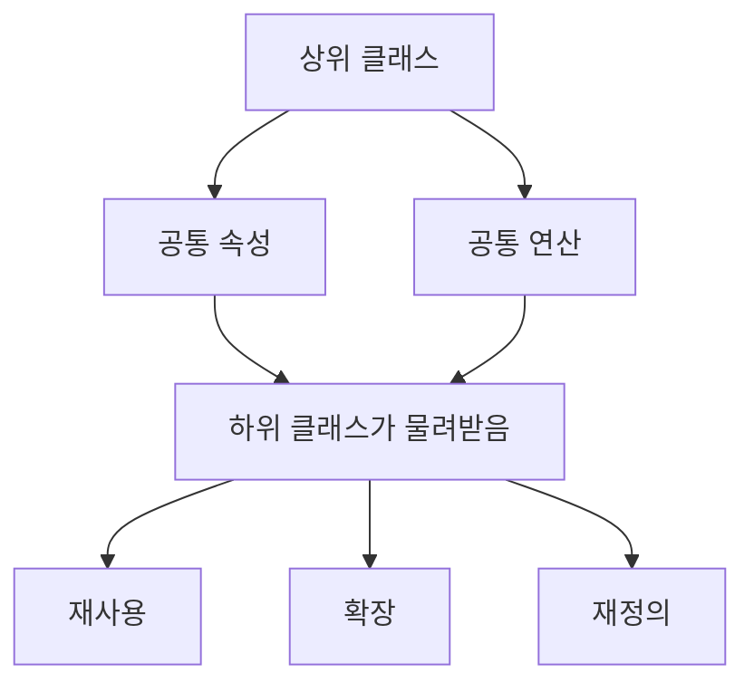
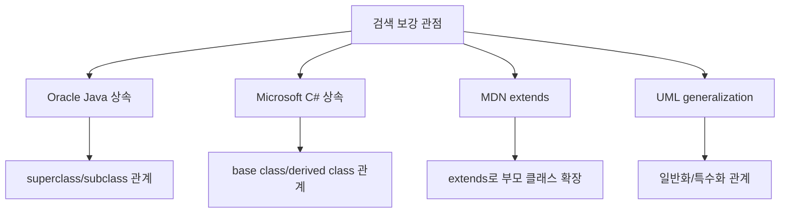
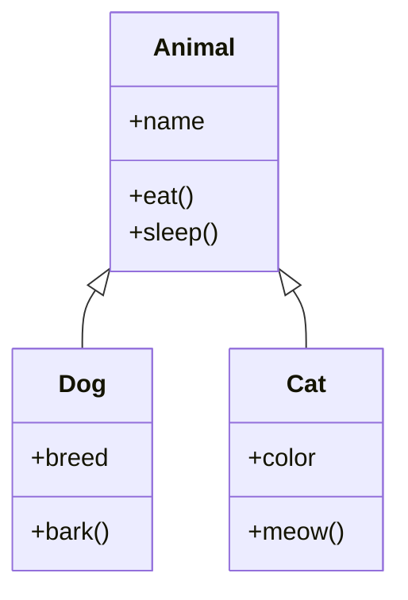
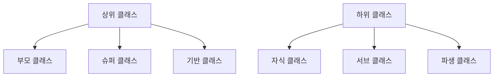
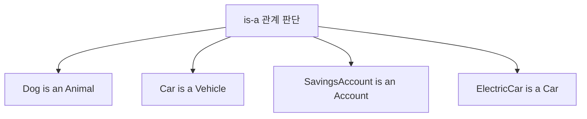
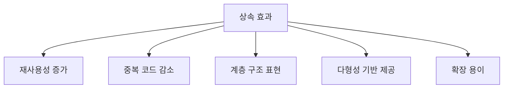
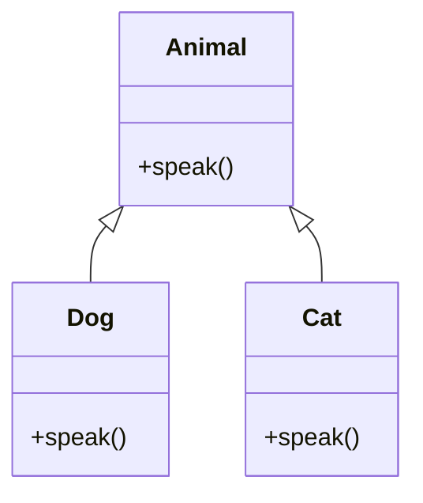
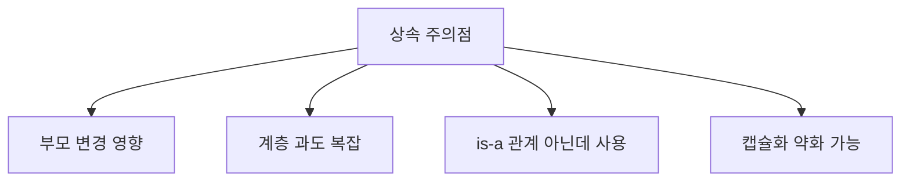
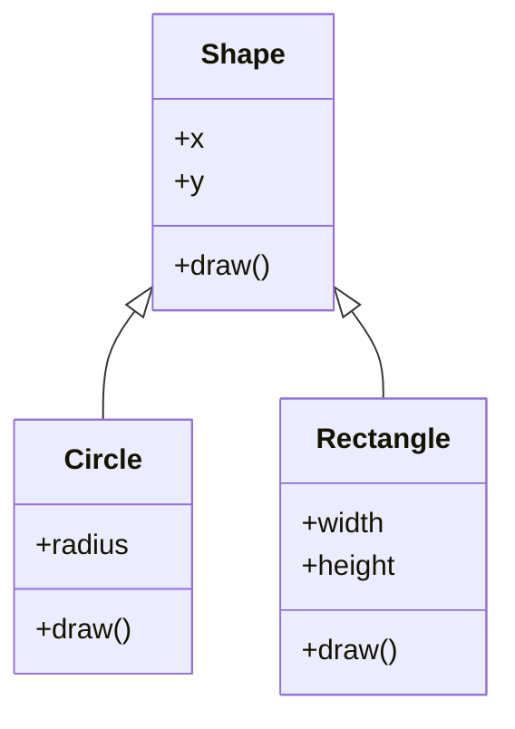
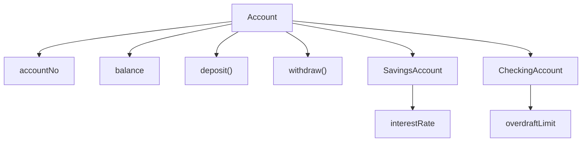

# 034 상속(Inheritance)

작성 기준일: 2026-05-02
검색/보강일: 2026-06-01
과목: `1과목 소프트웨어 설계`
기준 PDF: `/Users/nes0903/Documents/study/정보처리기사/핵심요약집_2026_정보처리기사필기핵심요약.pdf`
PDF 확인 위치: `5페이지`
주제별 검색 키워드:
- `Oracle Java inheritance superclass subclass tutorial`
- `Microsoft C# inheritance base class derived class`
- `MDN JavaScript classes extends inheritance`
- `UML generalization superclass subclass inheritance`

---

## 1. 한 줄 요약

- 상속은 상위 클래스(부모 클래스)의 속성과 연산을 하위 클래스(자식 클래스)가 물려받는 객체지향 기법이다.
- 공통 기능은 상위 클래스에 두고, 하위 클래스는 이를 재사용하면서 자신만의 속성이나 연산을 추가하거나 재정의할 수 있다.
- 시험에서는 `상위/부모 클래스`, `하위/자식 클래스`, `속성과 연산`, `물려받음`을 정확히 연결해야 한다.

---

## 2. PDF 기준 핵심

- PDF에서 직접 확인한 내용:
  - 상위 클래스(부모 클래스)의 모든 속성과 연산을 하위 클래스(자식 클래스)가 물려받는 것이다.

- 1차 암기 키워드:
  - `상위 클래스`
  - `부모 클래스`
  - `하위 클래스`
  - `자식 클래스`
  - `속성`
  - `연산`
  - `물려받음`

- 시험식 표현:
  - 부모 클래스의 데이터와 행위를 자식 클래스가 이어받는다.
  - 공통 속성과 기능을 상위 클래스에 정의한다.
  - 하위 클래스는 상위 클래스의 특성을 재사용하거나 확장한다.

---

## 3. 검색으로 보강한 관점

- Oracle Java 자료는 상속을 superclass와 subclass 관계로 설명한다.
- Microsoft C# 자료는 base class가 데이터와 동작을 제공하고 derived class가 이를 상속하거나 재정의할 수 있다고 설명한다.
- MDN의 `extends` 자료는 하위 클래스가 상위 클래스를 확장한다는 구현 관점을 보여준다.
- UML에서는 상속을 일반화(Generalization) 관계로 표현하며, 하위 분류자가 상위 분류자의 특성을 이어받는 것으로 이해한다.
- 정보처리기사에서는 언어별 세부 제약보다 PDF의 부모/자식, 속성/연산, 물려받음이라는 정의가 우선이다.

---

## 4. 상속의 기본 구조

- `Animal`은 상위 클래스이다.
- `Dog`와 `Cat`은 하위 클래스이다.
- `Dog`와 `Cat`은 `Animal`의 `name`, `eat()`, `sleep()`을 물려받을 수 있다.
- `Dog`는 `breed`, `bark()`처럼 자신만의 속성과 연산을 추가할 수 있다.
- `Cat`은 `color`, `meow()`처럼 자신만의 속성과 연산을 추가할 수 있다.

- 상속의 핵심:
  - 공통 특성은 상위 클래스에 둔다.
  - 특수한 특성은 하위 클래스에 둔다.
  - 하위 클래스는 상위 클래스의 속성과 연산을 재사용한다.

---

## 5. 상위 클래스와 하위 클래스

- 상위 클래스:
  - 부모 클래스라고도 한다.
  - 슈퍼 클래스, 기반 클래스라고도 부른다.
  - 공통 속성과 연산을 정의한다.

- 하위 클래스:
  - 자식 클래스라고도 한다.
  - 서브 클래스, 파생 클래스라고도 부른다.
  - 상위 클래스의 속성과 연산을 물려받는다.
  - 필요한 속성과 연산을 추가하거나 기존 연산을 재정의할 수 있다.

- 시험에서는 용어가 바뀌어도 같은 관계로 이해해야 한다.
  - 상위 = 부모 = 슈퍼 = 기반
  - 하위 = 자식 = 서브 = 파생

---

## 6. 상속과 is-a 관계

- 상속은 보통 `is-a` 관계일 때 자연스럽다.
- 하위 클래스는 상위 클래스의 한 종류여야 한다.
- 예:
  - 강아지는 동물이다.
  - 자동차는 탈것이다.
  - 저축계좌는 계좌이다.
  - 전기차는 자동차이다.

- is-a 관계가 아닌데 상속을 쓰면 설계가 어색해질 수 있다.
- 예:
  - 자동차는 엔진이다 -> 부정확
  - 자동차는 엔진을 가진다 -> has-a 관계
  - 이 경우 상속보다 포함/합성 관계가 더 자연스럽다.

- 시험에서는 보통 상속 정의를 묻지만, 객체지향 설계 원칙 문제에서는 상속 남용도 주의할 수 있다.

---

## 7. 상속의 효과

- 재사용성 증가:
  - 공통 속성과 연산을 상위 클래스에 두면 하위 클래스가 재사용할 수 있다.

- 중복 코드 감소:
  - 여러 클래스에 반복되는 공통 기능을 상위 클래스로 올릴 수 있다.

- 계층 구조 표현:
  - 일반적인 개념과 구체적인 개념의 관계를 표현할 수 있다.

- 다형성 기반 제공:
  - 상위 타입으로 하위 객체를 다룰 수 있다.
  - 같은 메시지에 대해 하위 클래스마다 다른 동작을 제공할 수 있다.

- 확장 용이:
  - 기존 상위 클래스를 바탕으로 새로운 하위 클래스를 만들 수 있다.

---

## 8. 상속과 오버라이딩

- 하위 클래스는 상위 클래스의 연산을 그대로 사용할 수 있다.
- 필요하면 하위 클래스에서 상위 클래스의 연산을 재정의할 수 있다.
- 이 재정의를 오버라이딩이라고 한다.

- 예:
  - `Animal.speak()`는 일반적인 소리를 낸다.
  - `Dog.speak()`는 `멍멍`으로 재정의한다.
  - `Cat.speak()`는 `야옹`으로 재정의한다.

- 시험 연결:
  - 상속은 034 챕터이다.
  - 오버라이딩은 035 다형성 챕터에서 나온다.
  - 상속과 오버라이딩은 함께 출제될 수 있다.

---

## 9. 상속과 주변 개념 비교

| 구분 | 핵심 의미 | 시험 단서 | 예 |
|---|---|---|---|
| `상속` | 상위 클래스의 속성과 연산을 하위 클래스가 물려받음 | 부모/자식, 물려받음 | `Dog extends Animal` |
| `캡슐화` | 데이터와 함수를 하나로 묶음 | 데이터+함수 | `Account` 내부에 balance와 withdraw |
| `다형성` | 같은 메시지가 여러 형태로 동작 | 오버로딩, 오버라이딩 | `draw()`가 도형별로 다르게 동작 |
| `정보 은닉` | 내부 자료와 절차 접근 제한 | private, 은닉 | `balance` private |
| `일반화` | 여러 하위 개념의 공통점을 상위 개념으로 추출 | UML generalization | `Dog`, `Cat` -> `Animal` |

- 상속과 다형성:
  - 상속은 부모의 속성과 연산을 물려받는 구조이다.
  - 다형성은 같은 메시지나 이름이 여러 형태로 동작하는 특성이다.
  - 다형성의 오버라이딩은 상속 관계와 함께 자주 나타난다.

- 상속과 캡슐화:
  - 상속은 클래스 간 관계이다.
  - 캡슐화는 클래스 내부 구성 방식이다.

- 상속과 일반화:
  - UML에서는 상속 관계를 일반화 관계로 표현할 수 있다.
  - 상위 클래스는 더 일반적인 개념이고, 하위 클래스는 더 구체적인 개념이다.

---

## 10. 상속 사용 시 주의점

- 부모 변경 영향:
  - 상위 클래스의 변경이 여러 하위 클래스에 영향을 줄 수 있다.
  - 상속 계층이 깊으면 영향 범위를 파악하기 어렵다.

- 계층 과도 복잡:
  - 상속 단계가 너무 많으면 구조를 이해하기 어렵다.
  - 하위 클래스가 실제로 어떤 속성과 연산을 가지는지 추적하기 어렵다.

- is-a 관계가 아닌데 사용:
  - 단순히 코드를 재사용하고 싶다는 이유만으로 상속을 쓰면 설계가 어색해질 수 있다.
  - has-a 관계라면 포함이나 합성을 고려해야 한다.

- 캡슐화 약화:
  - 하위 클래스가 상위 클래스 내부 구현에 지나치게 의존하면 캡슐화가 약해질 수 있다.

- 시험에서는 단점보다 정의가 중요하지만, 설계 원칙 문제에서는 무분별한 상속이 나쁜 설계로 설명될 수 있다.

---

## 11. 예시로 이해하기

### 예시 1: 도형 상속

- `Shape`는 상위 클래스이다.
- `Circle`과 `Rectangle`은 하위 클래스이다.
- 하위 클래스는 `x`, `y`, `draw()`를 물려받을 수 있다.
- 각 하위 클래스는 자신만의 속성을 추가하고 `draw()`를 재정의할 수 있다.

### 예시 2: 계좌 상속

- `Account`는 공통 계좌 속성과 연산을 가진다.
- `SavingsAccount`는 이자율 속성을 추가할 수 있다.
- `CheckingAccount`는 마이너스 한도 속성을 추가할 수 있다.
- 둘 다 계좌의 한 종류이므로 상속 관계가 자연스럽다.

---

## 12. 시험 포인트 - 시험에서 나오는 함정

- `상속은 상위 클래스의 모든 속성과 연산을 하위 클래스가 물려받는 것이다`는 PDF 기준 맞는 설명이다.

- `상속은 데이터와 함수를 하나로 묶는 것이다`는 틀린 설명이다.
  - 그 설명은 캡슐화이다.

- `상속은 객체에게 행위를 지시하는 명령이다`는 틀린 설명이다.
  - 그 설명은 메시지이다.

- `상속은 같은 이름의 메서드를 인수의 개수나 자료형을 달리하여 여러 개 정의하는 것이다`는 틀린 설명이다.
  - 그 설명은 오버로딩이다.

- `하위 클래스는 상위 클래스의 속성과 연산을 물려받을 수 있다`는 맞는 설명이다.

- `부모 클래스와 자식 클래스는 서로 아무 관계가 없다`는 틀린 설명이다.

---

## 13. 암기 포인트

- 기본 암기:
  - 상속 = `부모의 속성과 연산을 자식이 물려받음`
  - 상위 클래스 = 부모 클래스
  - 하위 클래스 = 자식 클래스

- 단서어 암기:
  - `상위`
  - `하위`
  - `부모`
  - `자식`
  - `슈퍼`
  - `서브`
  - `속성`
  - `연산`
  - `물려받음`

- 문장형 암기:
  - 상속은 상위 클래스의 모든 속성과 연산을 하위 클래스가 물려받는 것이다.
  - 하위 클래스는 상위 클래스의 공통 기능을 재사용하고 필요한 기능을 추가할 수 있다.
  - 오버라이딩은 상속받은 연산을 하위 클래스에서 재정의하는 것이다.

- 비교형 문제 접근:
  - 부모/자식 관계가 보이면 상속이다.
  - 같은 이름이지만 인수 차이가 보이면 오버로딩이다.
  - 자식 클래스에서 재정의가 보이면 오버라이딩이다.

---

## 14. 빠른 복습

- 챕터명: `034 상속(Inheritance)`
- PDF 위치: `5페이지`
- PDF 최소 암기:
  - 상위 클래스(부모 클래스)의 모든 속성과 연산을 하위 클래스(자식 클래스)가 물려받는다.

- 가장 중요한 구분:
  - 상속 = 부모/자식 관계
  - 캡슐화 = 데이터와 함수 묶음
  - 메시지 = 객체에게 행위 지시
  - 다형성 = 같은 메시지가 여러 형태로 동작

- 문제 풀이 체크:
  - 상위 클래스와 하위 클래스가 언급되는가?
  - 부모 클래스와 자식 클래스가 언급되는가?
  - 속성과 연산을 물려받는다고 하는가?
  - 그렇다면 상속이다.

---

## 15. 참고 링크

- 기준 PDF: `/Users/nes0903/Documents/study/정보처리기사/핵심요약집_2026_정보처리기사필기핵심요약.pdf`
- [Q-Net - 정보처리기사 종목 정보](https://www.q-net.or.kr/crf005.do?id=crf00503&jmCd=1320)
- [Oracle Java Tutorials - What Is Inheritance?](https://docs.oracle.com/javase/tutorial/java/concepts/inheritance.html)
- [Oracle Java Tutorials - Inheritance](https://docs.oracle.com/javase/tutorial/java/IandI/subclasses.html)
- [Microsoft Learn - Introduction to inheritance](https://learn.microsoft.com/en-us/dotnet/csharp/fundamentals/tutorials/inheritance)
- [MDN Web Docs - extends](https://developer.mozilla.org/en-US/docs/Web/JavaScript/Reference/Classes/extends)
