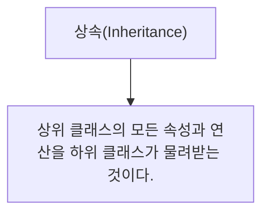

# 034 상속(Inheritance)

작성 기준일: 2026-05-02  
과목: `1과목 소프트웨어 설계`  
기준 PDF: `/Users/nes0903/Documents/study/정보처리기사/핵심요약집_2026_정보처리기사필기핵심요약.pdf`  
PDF 확인 위치: `5페이지`  
검색 보강: 공식/표준/고품질 참고 자료를 함께 확인하여 시험 중심으로 확장 정리

---

## 1. 한 줄 요약

- 상속은 상위 클래스의 속성과 연산을 하위 클래스가 물려받아 재사용하고 확장하는 객체지향 원리다.
- 이 챕터는 `객체지향` 영역에 속한다.
- 시험에서는 정의, 핵심 키워드, 비슷한 개념과의 구분을 함께 묻는 경우가 많다.

---

## 2. PDF 기준 핵심

- 상위 클래스의 모든 속성과 연산을 하위 클래스가 물려받는 것이다.

- 위 항목은 PDF에서 직접 확인한 최소 암기 골격이다.
- 세부 설명은 이 골격을 기준으로 확장해서 이해하면 된다.

---

## 3. 개념 설명

- 상속은 is-a 관계를 표현한다.
- 부모 클래스의 공통 기능을 자식 클래스가 재사용한다.
- 자식 클래스는 새로운 속성/연산을 추가하거나 기존 연산을 재정의할 수 있다.
- UML에서는 일반화 관계와 연결된다.
- 객체지향 문제는 클래스, 객체, 인스턴스, 메시지, 캡슐화, 상속, 다형성의 용어 구분에서 자주 나온다.
- 객체지향 설계 원칙은 변경 영향 축소와 재사용성 향상이라는 목적과 연결된다.

---

## 4. 핵심 포인트

- 문제를 풀 때는 먼저 지문 속 단서어를 찾고, 그 단서어가 어떤 개념을 가리키는지 연결한다.
- 정의형 문제는 표현이 조금 바뀌어도 핵심 의미가 같으면 같은 개념으로 판단한다.
- 옳고 그름 문제에서는 `항상`, `반드시`, `전혀`, `모두` 같은 극단 표현을 특히 조심한다.
- 이 챕터는 단독 암기보다 인접 챕터와 비교해 기억하면 정답률이 올라간다.

---

## 5. 시험에서 헷갈리는 비교

| 구분 | 핵심 |
|---|---|
| `상속` | 부모 기능을 자식이 물려받음 |
| `캡슐화` | 데이터와 함수를 묶음 |
| `다형성` | 같은 이름이 상황에 따라 다르게 동작 |

- 비교 문제는 이름보다 `역할`, `목적`, `사용 시점`, `장점/단점`을 기준으로 구분하면 안정적이다.

---

## 6. 예시 또는 암기 포인트

- 상속 = `부모 클래스의 속성과 연산을 자식이 물려받음`.

- 암기는 단어만 외우기보다 `정의 -> 특징 -> 예시 -> 반대 개념` 순서로 묶는 것이 좋다.

---

## 7. 빠른 복습

- 챕터명: `034 상속(Inheritance)`
- 소속 영역: `객체지향`
- 자주 나오는 문제 유형:
  - 정의를 주고 개념명을 고르는 문제
  - 특징을 섞어 놓고 옳은/틀린 설명을 고르는 문제
  - 유사 개념과 비교하여 다른 하나를 찾는 문제

---

## 8. 참고 링크

- 기준 PDF: `/Users/nes0903/Documents/study/정보처리기사/핵심요약집_2026_정보처리기사필기핵심요약.pdf`
- [Q-Net 정보처리기사 종목 페이지](https://www.q-net.or.kr/crf005.do?id=crf00503s02&jmCd=1320&jmInfoDivCcd=B0)
- [OMG - Unified Modeling Language](https://www.omg.org/spec/UML/)
- [OMG - What is UML?](https://www.omg.org/uml/what-is-uml.htm)
- [Microsoft - SOLID principles and Dependency Injection](https://learn.microsoft.com/en-us/dotnet/architecture/microservices/microservice-ddd-cqrs-patterns/microservice-application-layer-web-api-design)
