# 035 다형성(Polymorphism)

작성 기준일: 2026-05-02
검색/보강일: 2026-06-01
과목: `1과목 소프트웨어 설계`
기준 PDF: `/Users/nes0903/Documents/study/정보처리기사/핵심요약집_2026_정보처리기사필기핵심요약.pdf`
PDF 확인 위치: `5페이지`
주제별 검색 키워드:
- `Microsoft C# polymorphism object oriented programming override`
- `Oracle Java overriding hiding methods tutorial`
- `Java method overloading overriding polymorphism`
- `MDN polymorphism object oriented programming glossary`

---

## 1. 한 줄 요약

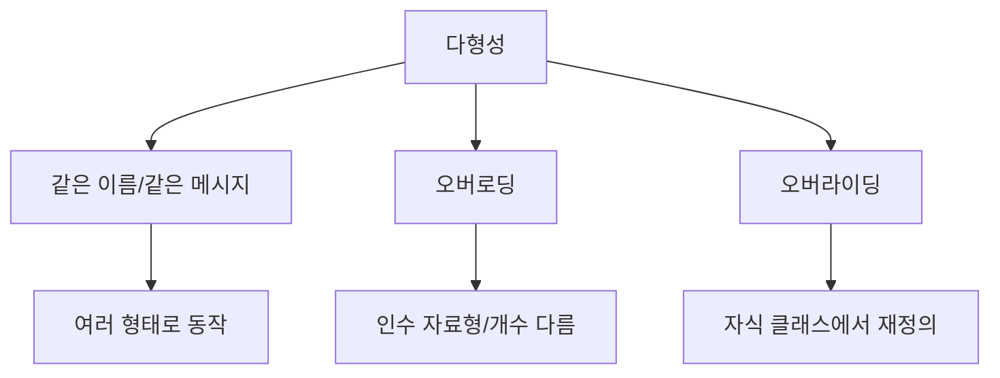

- 다형성은 같은 이름의 연산이나 같은 메시지가 상황에 따라 여러 형태로 동작할 수 있는 객체지향 특성이다.
- PDF 기준 다형성의 핵심 예는 `오버로딩`과 `오버라이딩`이다.
- 시험에서는 오버로딩과 오버라이딩을 거의 항상 비교하므로, `인수 차이`와 `자식 클래스 재정의`를 즉시 구분해야 한다.

---

## 2. PDF 기준 핵심

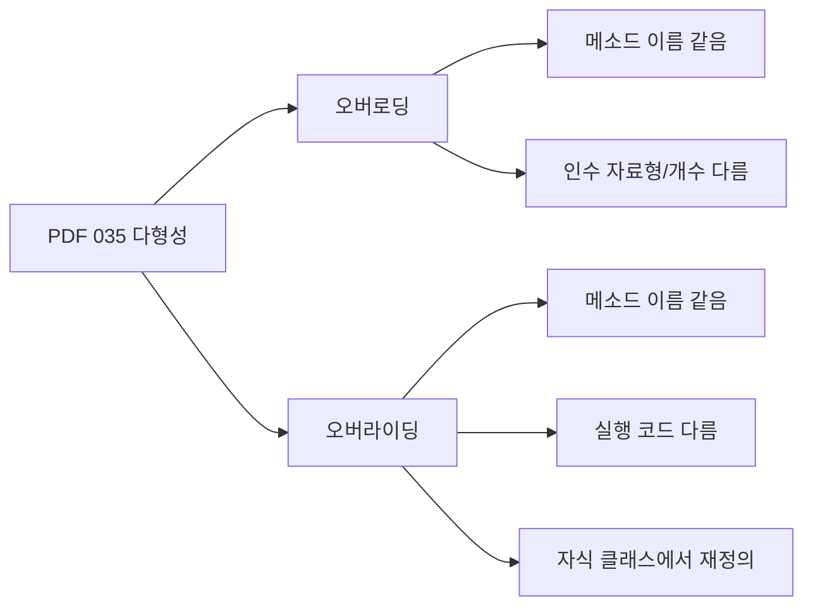

- PDF에서 직접 확인한 내용:
  - `오버로딩(Overloading)`: 메소드의 이름은 같지만 인수를 받는 자료형과 개수를 달리하여 여러 기능을 정의할 수 있다.
  - `오버라이딩(Overriding)`: 메소드의 이름은 같지만 메소드 안의 실행 코드를 달리하여 자식 클래스에서 재정의해서 사용할 수 있다.

- 1차 암기 키워드:
  - 오버로딩 = `이름 같음`, `인수 자료형 다름`, `인수 개수 다름`
  - 오버라이딩 = `이름 같음`, `실행 코드 다름`, `자식 클래스`, `재정의`

- 시험식 표현:
  - 같은 이름의 메서드를 매개변수 차이로 여러 개 정의한다 -> 오버로딩
  - 부모 클래스 메서드를 자식 클래스에서 다시 정의한다 -> 오버라이딩

---

## 3. 검색으로 보강한 관점

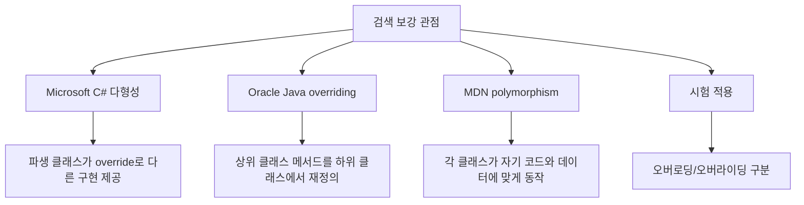

- Microsoft C# 객체지향 자료는 다형성을 상속받은 속성이나 메서드를 서로 다른 방식으로 구현하는 능력과 연결해 설명한다.
- Oracle Java 자료는 overriding을 상위 클래스 메서드를 하위 클래스에서 다시 정의하는 관점으로 설명한다.
- MDN은 객체지향에서 각 클래스가 자신의 데이터와 코드에 맞게 적절히 동작할 수 있다는 관점으로 다형성을 설명한다.
- 정보처리기사에서는 이론적 분류보다 PDF에 나온 오버로딩/오버라이딩 구분이 가장 중요하다.

---

## 4. 다형성의 의미

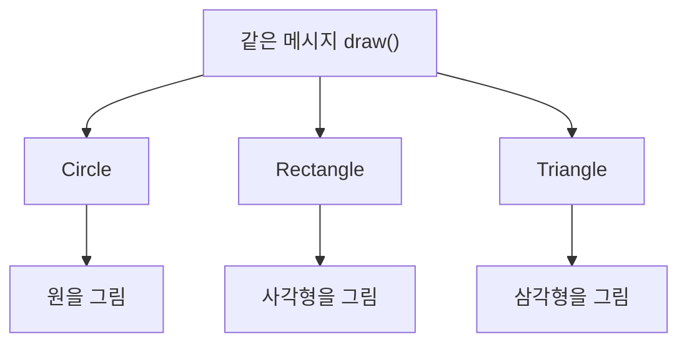

- 다형성은 `많은 형태`라는 뜻으로 이해하면 쉽다.
- 객체지향에서는 같은 메시지나 같은 이름의 연산이 여러 객체 또는 여러 상황에서 다르게 동작하는 성질을 말한다.
- 예:
  - `draw()`라는 메시지는 모든 도형에게 보낼 수 있다.
  - 원 객체는 원을 그리고, 사각형 객체는 사각형을 그리고, 삼각형 객체는 삼각형을 그린다.
  - 호출자는 `draw()`라는 공통 인터페이스만 알면 된다.

- 다형성의 효과:
  - 코드 확장성이 좋아진다.
  - 구체 클래스에 대한 의존이 줄어든다.
  - 같은 인터페이스로 여러 구현을 다룰 수 있다.
  - 상속과 인터페이스 설계의 활용도가 높아진다.

---

## 5. 오버로딩

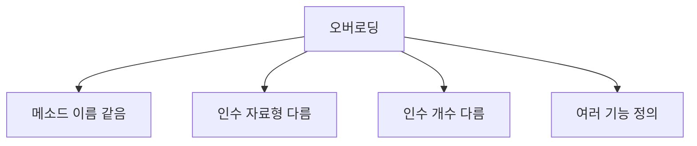

- 오버로딩은 같은 이름의 메서드를 여러 개 정의하되, 인수의 자료형이나 개수를 다르게 하는 것이다.
- PDF 표현:
  - 메소드의 이름은 같다.
  - 인수를 받는 자료형과 개수를 달리한다.
  - 여러 기능을 정의할 수 있다.

- 예:

```text
print(String text)
print(int number)
print(String text, int count)
```

- 위 세 메서드는 모두 이름이 `print`로 같다.
- 하지만 매개변수의 자료형이나 개수가 다르다.
- 따라서 오버로딩으로 볼 수 있다.

- 시험 단서:
  - `인수`
  - `매개변수`
  - `자료형`
  - `개수`
  - `같은 이름의 여러 메서드`

- 주의:
  - 반환형만 다르게 하는 것은 일반적인 오버로딩 구분 기준으로 보기 어렵다.
  - 정보처리기사에서는 PDF 표현대로 `인수의 자료형과 개수`를 기준으로 암기한다.

---

## 6. 오버라이딩

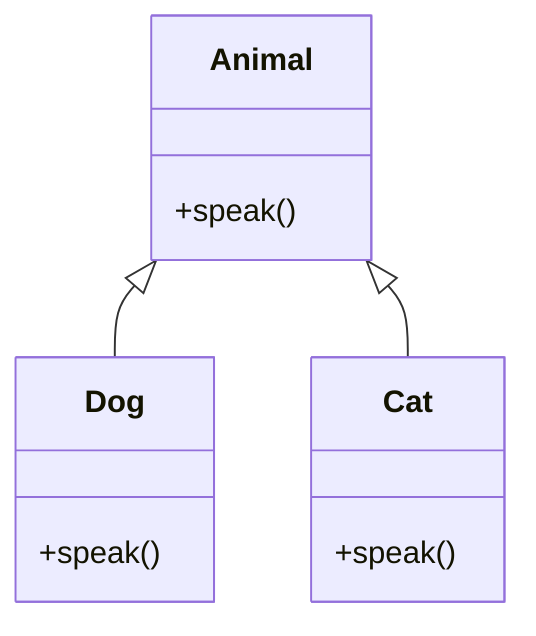

- 오버라이딩은 상위 클래스에 정의된 메서드를 하위 클래스에서 같은 이름으로 다시 정의하는 것이다.
- PDF 표현:
  - 메소드의 이름은 같다.
  - 메소드 안의 실행 코드를 달리한다.
  - 자식 클래스에서 재정의해서 사용할 수 있다.

- 예:
  - `Animal.speak()`가 있다.
  - `Dog.speak()`는 `멍멍`으로 재정의한다.
  - `Cat.speak()`는 `야옹`으로 재정의한다.

- 시험 단서:
  - `자식 클래스`
  - `재정의`
  - `상속`
  - `실행 코드 다름`
  - `부모 메서드`

- 주의:
  - 오버라이딩은 상속 관계와 함께 이해한다.
  - 하위 클래스가 부모의 메서드를 그대로 쓰는 것이 아니라, 같은 메서드 이름으로 자신에게 맞게 다시 구현한다.

---

## 7. 오버로딩과 오버라이딩 비교

| 구분 | 오버로딩 | 오버라이딩 |
|---|---|---|
| 메서드 이름 | 같음 | 같음 |
| 구분 기준 | 인수의 자료형 또는 개수 | 상속 관계에서 자식 클래스 재정의 |
| 상속 필요성 | 반드시 필요하지 않음 | 보통 상속 관계 필요 |
| 실행 코드 | 매개변수에 따라 여러 기능 | 자식 클래스에서 실행 코드 변경 |
| 시험 단서 | 인수, 자료형, 개수 | 자식, 재정의, 부모 메서드 |
| 예 | `add(int, int)`, `add(double, double)` | `Dog.speak()`가 `Animal.speak()` 재정의 |

- 둘 다 메서드 이름이 같을 수 있다.
- 오버로딩은 `인수 차이`가 핵심이다.
- 오버라이딩은 `자식 클래스에서 재정의`가 핵심이다.
- 지문에 `자료형/개수`가 나오면 오버로딩을 먼저 본다.
- 지문에 `자식 클래스/재정의`가 나오면 오버라이딩을 먼저 본다.

---

## 8. 정적/동적 다형성 관점

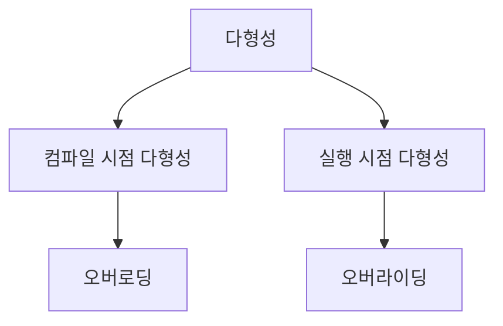

- 많은 객체지향 설명에서는 오버로딩을 컴파일 시점 다형성, 오버라이딩을 실행 시점 다형성과 연결한다.
- 정보처리기사 기본 문제에서는 이 분류보다 PDF 정의가 더 중요하다.
- 그래도 이해해 두면 도움이 된다.
  - 오버로딩: 컴파일러가 전달 인수의 자료형과 개수에 따라 호출할 메서드를 고른다.
  - 오버라이딩: 실제 객체 타입에 따라 하위 클래스의 재정의된 메서드가 실행될 수 있다.

- 시험에서는 다음 정도로만 연결하면 충분하다.
  - 오버로딩 = 인수 차이에 따른 여러 메서드
  - 오버라이딩 = 상속받은 메서드의 재정의

---

## 9. 다형성과 상속/인터페이스

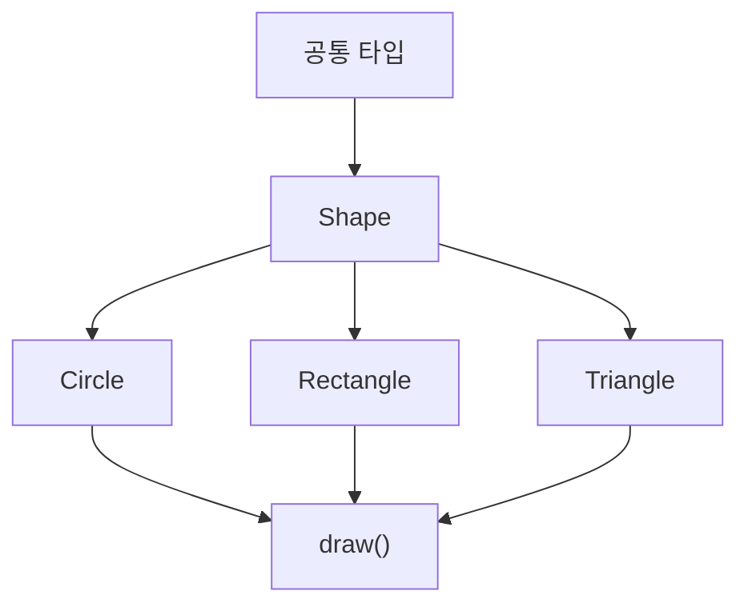

- 다형성은 상속과 함께 자주 사용된다.
- 상위 클래스나 인터페이스가 공통 메시지를 정의한다.
- 하위 클래스들은 같은 메시지에 대해 각자 다른 구현을 제공한다.

- 예:
  - `Shape`는 `draw()` 연산을 가진다.
  - `Circle`, `Rectangle`, `Triangle`은 `draw()`를 각각 다르게 구현한다.
  - 호출자는 모든 객체를 `Shape` 타입으로 다루면서 `draw()`만 호출할 수 있다.

- 이 구조의 장점:
  - 새로운 도형을 추가해도 기존 호출 코드를 크게 바꾸지 않을 수 있다.
  - 공통 인터페이스를 유지하면서 구현을 확장할 수 있다.

---

## 10. 시험 포인트 - 시험에서 나오는 함정

- `오버로딩은 메소드 이름은 같지만 인수의 자료형과 개수를 달리하는 것이다`는 맞는 설명이다.

- `오버라이딩은 자식 클래스에서 메서드를 재정의하는 것이다`는 맞는 설명이다.

- `오버로딩은 자식 클래스에서 부모 클래스 메서드를 재정의하는 것이다`는 틀린 설명이다.
  - 그 설명은 오버라이딩이다.

- `오버라이딩은 인수의 자료형과 개수를 달리하여 여러 기능을 정의하는 것이다`는 틀린 설명이다.
  - 그 설명은 오버로딩이다.

- `오버로딩과 오버라이딩은 모두 이름이 같을 수 있으므로 이름만으로는 구분할 수 없다`는 중요한 포인트이다.

- `반환형만 다르게 하면 오버로딩이다`라는 보기는 조심한다.
  - 시험에서는 인수의 자료형과 개수를 기준으로 판단한다.

---

## 11. 예시로 이해하기

### 예시 1: 오버로딩

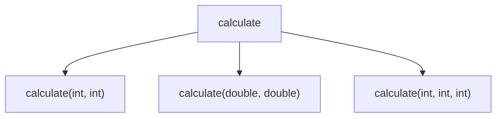

- 메서드 이름은 모두 `calculate`이다.
- 인수의 자료형이나 개수가 다르다.
- 따라서 오버로딩이다.

### 예시 2: 오버라이딩

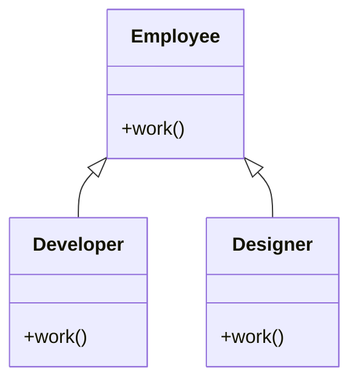

- `Employee`는 `work()` 메서드를 가진다.
- `Developer`는 개발 업무에 맞게 `work()`를 재정의한다.
- `Designer`는 디자인 업무에 맞게 `work()`를 재정의한다.
- 따라서 오버라이딩이다.

### 예시 3: 같은 메시지, 다른 동작

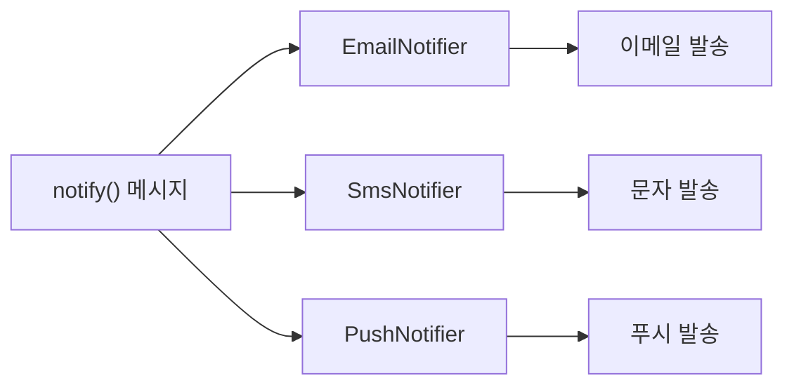

- 같은 `notify()` 메시지를 보내도 객체마다 다른 방식으로 알림을 보낸다.
- 이것이 다형성을 이해하기 좋은 예이다.

---

## 12. 암기 포인트

- 기본 암기:
  - 다형성 = `여러 형태로 동작`
  - 오버로딩 = `이름 같고 인수 자료형/개수 다름`
  - 오버라이딩 = `자식 클래스에서 재정의`

- 단서어 암기:
  - 오버로딩: `인수`, `자료형`, `개수`, `여러 기능`
  - 오버라이딩: `자식`, `부모`, `상속`, `재정의`, `실행 코드`

- 문장형 암기:
  - 오버로딩은 메서드 이름은 같지만 인수의 자료형과 개수를 달리하여 여러 기능을 정의하는 것이다.
  - 오버라이딩은 메서드 이름은 같지만 실행 코드를 달리하여 자식 클래스에서 재정의하는 것이다.

- 비교형 문제 접근:
  - `인수`가 보이면 오버로딩이다.
  - `자식 클래스`가 보이면 오버라이딩이다.
  - 둘 다 이름은 같을 수 있으므로 이름만 보고 판단하지 않는다.

---

## 13. 빠른 복습

- 챕터명: `035 다형성(Polymorphism)`
- PDF 위치: `5페이지`
- PDF 최소 암기:
  - 오버로딩: 이름은 같지만 인수 자료형과 개수를 달리한다.
  - 오버라이딩: 이름은 같지만 실행 코드를 달리하여 자식 클래스에서 재정의한다.

- 가장 중요한 구분:
  - 오버로딩 = 인수 차이
  - 오버라이딩 = 자식 재정의

- 문제 풀이 체크:
  - 인수의 자료형이나 개수가 언급되는가?
  - 자식 클래스에서 재정의한다고 하는가?
  - 상속 관계가 언급되는가?
  - 같은 메시지에 대해 여러 형태로 동작하는가?

---

## 14. 참고 링크

- 기준 PDF: `/Users/nes0903/Documents/study/정보처리기사/핵심요약집_2026_정보처리기사필기핵심요약.pdf`
- [Q-Net - 정보처리기사 종목 정보](https://www.q-net.or.kr/crf005.do?id=crf00503&jmCd=1320)
- [Microsoft Learn - Object-Oriented Programming in C#](https://learn.microsoft.com/en-us/dotnet/csharp/fundamentals/tutorials/oop)
- [Oracle Java Tutorials - Overriding and Hiding Methods](https://docs.oracle.com/javase/tutorial/java/IandI/override.html)
- [MDN Web Docs - Polymorphism](https://developer.mozilla.org/en-US/docs/Glossary/Polymorphism)
