# 036 객체지향 분석 방법론 - Coad와 Yourdon 방법

작성 기준일: 2026-05-02
검색/보강일: 2026-06-01
과목: `1과목 소프트웨어 설계`
기준 PDF: `/Users/nes0903/Documents/study/정보처리기사/핵심요약집_2026_정보처리기사필기핵심요약.pdf`
PDF 확인 위치: `5페이지`
주제별 검색 키워드:
- `Coad Yourdon object oriented analysis method object identification structure subject attributes services`
- `Coad and Yourdon object oriented analysis process object identification structure identification`
- `Coad Yourdon object oriented analysis ER diagram object behavior`
- `Peter Coad Edward Yourdon Object-Oriented Analysis`

---

## 1. 한 줄 요약

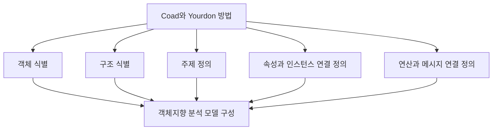

- Coad와 Yourdon 방법은 문제 영역을 객체, 구조, 주제, 속성, 인스턴스, 연산, 메시지 중심으로 분석하는 객체지향 분석 방법론이다.
- PDF 기준 핵심은 `E-R 다이어그램을 사용한 객체 행위 모델링`과 `객체 식별 -> 구조 식별 -> 주제 정의 -> 속성과 인스턴스 연결 정의 -> 연산과 메시지 연결 정의`이다.
- 시험에서는 방법론 이름보다 `과정 항목`과 `Coad와 Yourdon`을 정확히 매칭하는 것이 중요하다.

---

## 2. PDF 기준 핵심

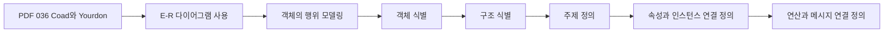

- PDF에서 직접 확인한 내용:
  - E-R 다이어그램을 사용하여 객체의 행위를 모델링한다.
  - 객체 식별, 구조 식별, 주제 정의, 속성과 인스턴스 연결 정의, 연산과 메시지 연결 정의 등의 과정으로 구성하는 기법이다.

- 1차 암기 키워드:
  - `Coad와 Yourdon`
  - `E-R 다이어그램`
  - `객체의 행위 모델링`
  - `객체 식별`
  - `구조 식별`
  - `주제 정의`
  - `속성과 인스턴스 연결`
  - `연산과 메시지 연결`

- 시험식 표현:
  - 객체 후보를 찾는다.
  - 객체 사이 구조를 식별한다.
  - 분석 범위를 주제로 나눈다.
  - 객체의 속성과 실제 인스턴스를 연결한다.
  - 객체가 수행할 연산과 객체 간 메시지를 연결한다.

---

## 3. 검색으로 보강한 관점

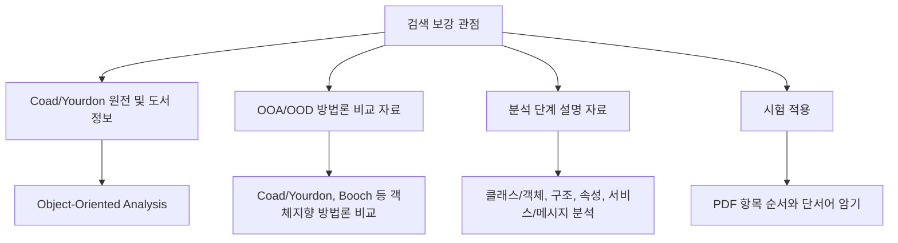

- 검색 자료에서는 Coad와 Yourdon 방법이 객체지향 분석(Object-Oriented Analysis) 방법론의 하나로 다뤄진다.
- Coad와 Yourdon의 객체지향 분석은 문제 영역의 객체와 객체 관계, 속성, 서비스, 메시지 연결을 분석하는 데 초점을 둔다.
- 일부 자료에서는 Class-&-Object layer, Structure layer, Subject layer, Attribute layer, Service layer처럼 계층적 분석 관점으로 설명한다.
- 정보처리기사 PDF는 이를 `객체 식별`, `구조 식별`, `주제 정의`, `속성/인스턴스`, `연산/메시지`라는 시험용 표현으로 압축한다.
- 따라서 실제 시험에서는 원전의 세부 용어보다 PDF의 과정명을 우선한다.

---

## 4. 객체지향 분석 방법론에서의 위치

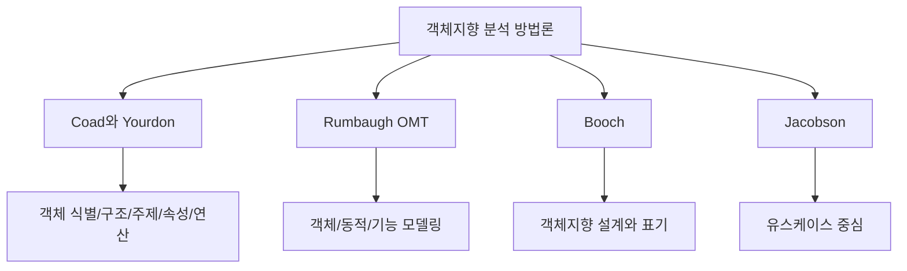

- 객체지향 분석은 요구사항을 객체, 클래스, 속성, 연산, 관계 중심으로 해석하는 활동이다.
- Coad와 Yourdon 방법은 객체지향 분석 방법론 중 하나이다.
- Rumbaugh 방법은 다음 챕터에서 나오며, `객체 모델링`, `동적 모델링`, `기능 모델링`의 3개 모델이 핵심이다.
- Coad와 Yourdon 방법은 `객체 식별`과 `구조 식별`, `속성/인스턴스`, `연산/메시지` 연결이 핵심이다.
- 시험에서는 객체지향 분석 방법론끼리 특징을 섞어 놓는 보기가 자주 나올 수 있다.

---

## 5. 1단계: 객체 식별

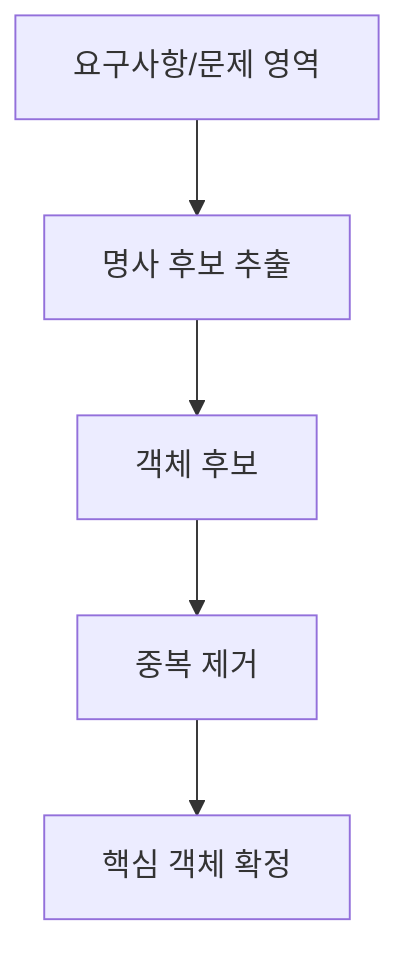

- 객체 식별은 시스템이 다루어야 할 주요 객체 후보를 찾는 단계이다.
- 요구사항 문장, 업무 문서, 사용자 인터뷰에서 명사나 개념을 찾아 객체 후보로 삼을 수 있다.
- 예:
  - 도서관 시스템: 회원, 도서, 대출, 반납, 예약
  - 쇼핑몰 시스템: 고객, 상품, 주문, 결제, 배송
  - 학사 시스템: 학생, 과목, 수강신청, 성적

- 객체 후보를 모두 그대로 쓰는 것은 아니다.
- 중복되거나 너무 모호한 개념은 정리한다.
- 시스템 책임과 관련 없는 개념은 제외한다.

- 시험 단서:
  - `객체 식별`
  - `객체 후보`
  - `문제 영역의 주요 대상`

---

## 6. 2단계: 구조 식별

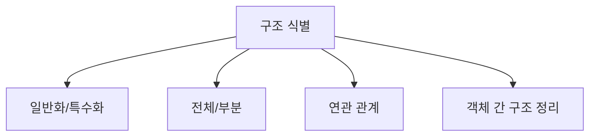

- 구조 식별은 객체들 사이의 관계와 구조를 찾는 단계이다.
- 대표 구조:
  - 일반화/특수화 관계
  - 전체/부분 관계
  - 연관 관계
  - 포함 관계

- 예:
  - `도서`는 `전자책`, `종이책`으로 특수화될 수 있다.
  - `주문`은 여러 `주문항목`으로 구성될 수 있다.
  - `회원`은 여러 `대출`과 관련될 수 있다.

- 구조 식별의 목적:
  - 객체가 단순히 나열되는 것을 넘어서 서로 어떻게 연결되는지 이해한다.
  - 상속, 포함, 연관 같은 설계 후보를 파악한다.
  - 객체 간 책임 분배의 기초를 마련한다.

- 시험 단서:
  - `구조 식별`
  - `객체 관계`
  - `일반화`, `특수화`, `전체-부분`, `연관`

---

## 7. 3단계: 주제 정의

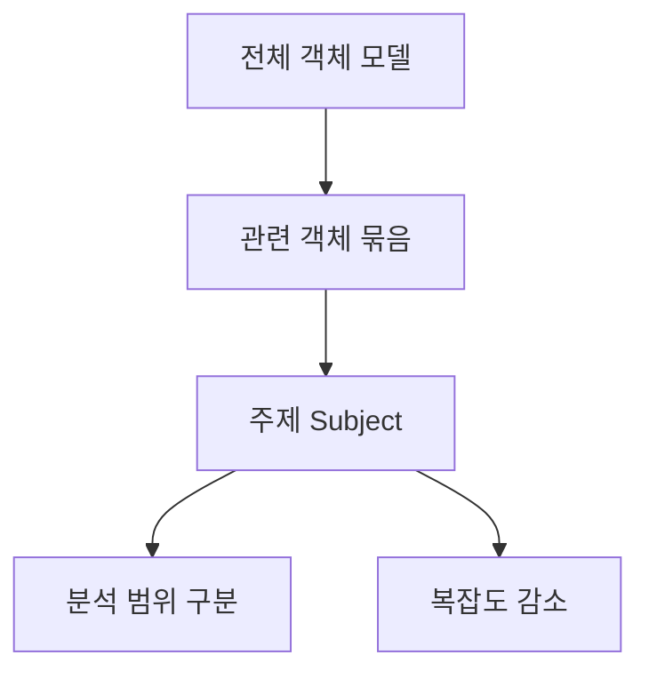

- 주제 정의는 관련 객체들을 큰 관심 영역이나 주제 단위로 묶는 단계이다.
- 객체가 많아지면 전체 모델을 한 번에 이해하기 어렵다.
- 주제를 나누면 모델을 더 작은 범위로 이해할 수 있다.

- 예:
  - 쇼핑몰 시스템:
    - 회원 주제: 고객, 등급, 주소
    - 상품 주제: 상품, 카테고리, 재고
    - 주문 주제: 주문, 주문항목, 결제, 배송

- 주제 정의의 효과:
  - 복잡한 객체 모델을 영역별로 나눌 수 있다.
  - 분석 범위와 책임을 구분하기 쉽다.
  - 이후 설계에서 패키지나 서브시스템 분리 후보가 될 수 있다.

- 시험 단서:
  - `주제 정의`
  - `관련 객체 묶음`
  - `복잡한 모델을 영역별로 분리`

---

## 8. 4단계: 속성과 인스턴스 연결 정의

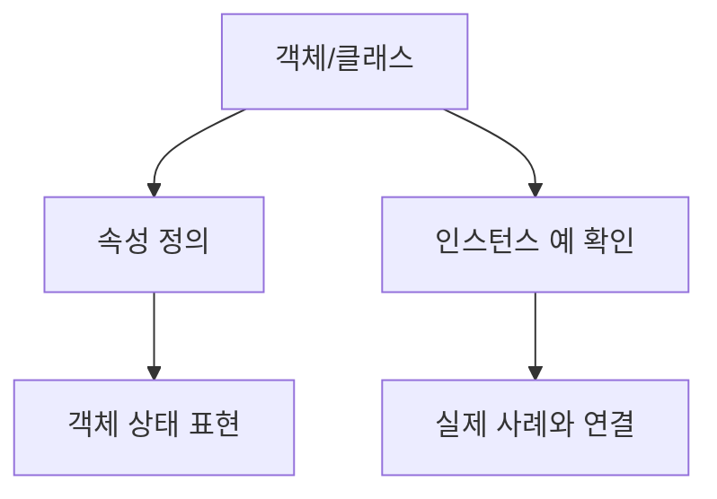

- 속성은 객체가 가져야 하는 데이터이다.
- 인스턴스는 특정 클래스에 속한 개별 객체이다.
- 이 단계에서는 객체가 어떤 속성을 가져야 하는지, 실제 사례와 어떻게 연결되는지를 정리한다.

- 예:
  - `회원` 객체의 속성:
    - 회원번호
    - 이름
    - 연락처
    - 가입일
  - `회원` 인스턴스:
    - `회원번호=1001, 이름=김민수`
    - `회원번호=1002, 이름=이서연`

- 속성과 인스턴스를 연결하면 추상적인 객체 정의가 실제 업무 사례와 맞는지 확인할 수 있다.
- 속성이 너무 많거나 불필요하면 객체 책임이 흐려질 수 있다.

- 시험 단서:
  - `속성`
  - `인스턴스`
  - `속성과 인스턴스 연결`
  - `객체의 데이터`

---

## 9. 5단계: 연산과 메시지 연결 정의

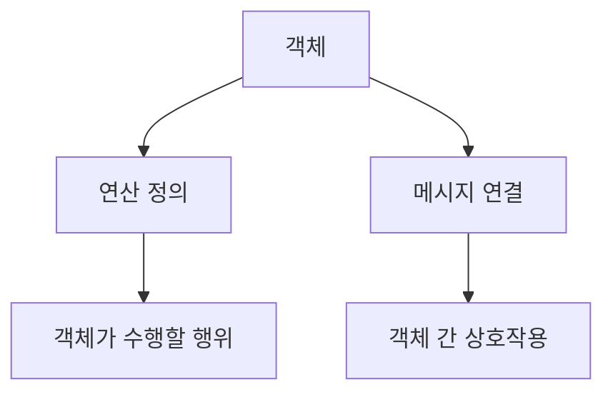

- 연산은 객체가 수행할 수 있는 행위이다.
- 메시지는 객체에게 어떤 행위를 하도록 지시하는 명령 또는 요구사항이다.
- 이 단계에서는 객체가 어떤 연산을 가져야 하고, 객체들 사이에 어떤 메시지가 오가는지 정리한다.

- 예:
  - `주문` 객체의 연산:
    - 주문 생성
    - 주문 취소
    - 총액 계산
  - 메시지 연결:
    - 주문 객체가 결제 객체에게 `결제 요청` 메시지를 보낸다.
    - 주문 객체가 재고 객체에게 `재고 차감` 메시지를 보낸다.
    - 배송 객체가 주문 객체에게 `배송 상태 변경` 메시지를 보낸다.

- 연산과 메시지를 연결하면 객체가 단순 데이터 묶음이 아니라 행위와 협력을 가진 단위로 모델링된다.

- 시험 단서:
  - `연산`
  - `메시지`
  - `연산과 메시지 연결`
  - `객체의 행위`
  - `상호작용`

---

## 10. E-R 다이어그램과 객체 행위 모델링

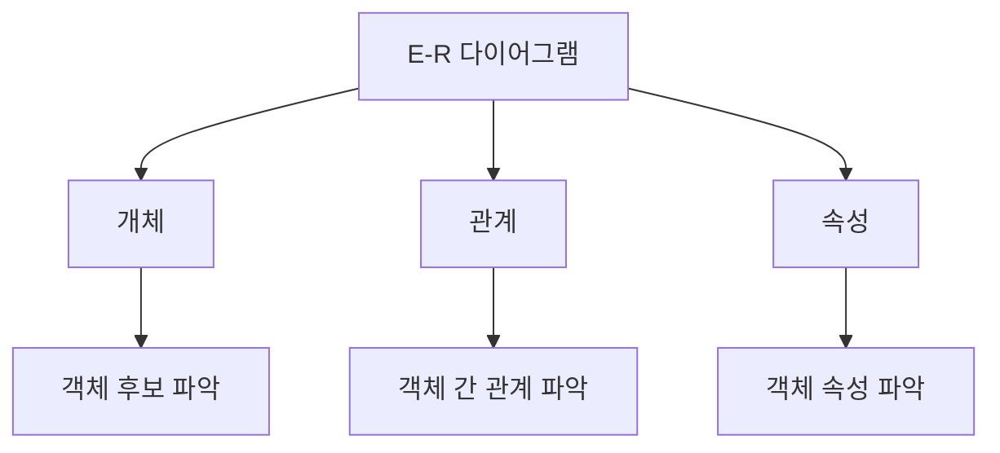

- PDF는 Coad와 Yourdon 방법에서 E-R 다이어그램을 사용하여 객체의 행위를 모델링한다고 제시한다.
- E-R 다이어그램은 원래 데이터 모델링에서 개체, 관계, 속성을 표현하는 도구이다.
- 객체지향 분석에서는 E-R 관점을 활용해 다음을 파악할 수 있다.
  - 어떤 개체가 객체 후보가 되는가
  - 객체 사이에 어떤 관계가 있는가
  - 객체가 어떤 속성을 가져야 하는가

- 시험에서는 `E-R 다이어그램`과 `Coad와 Yourdon`의 연결을 기억한다.
- 단, Rumbaugh의 기능 모델링에서 쓰는 자료 흐름도(DFD)와 혼동하지 않는다.

---

## 11. Coad와 Yourdon vs Rumbaugh

| 구분 | Coad와 Yourdon 방법 | Rumbaugh 분석 기법 |
|---|---|---|
| 핵심 관점 | 객체 식별, 구조 식별, 주제 정의, 속성/연산 연결 | 객체 모델링, 동적 모델링, 기능 모델링 |
| PDF 단서 | E-R 다이어그램, 객체 행위 모델링 | 객체 다이어그램, 상태 다이어그램, 자료 흐름도 |
| 분석 요소 | 객체, 구조, 주제, 속성, 인스턴스, 연산, 메시지 | 객체, 상태 변화, 자료 흐름 |
| 암기 포인트 | `객-구-주-속인-연메` | `객-동-기` |

- Coad와 Yourdon:
  - 객체를 찾고, 구조를 찾고, 주제를 정의한다.
  - 속성과 인스턴스, 연산과 메시지를 연결한다.

- Rumbaugh:
  - 객체 모델링은 객체 관계를 본다.
  - 동적 모델링은 상태 변화를 본다.
  - 기능 모델링은 자료 흐름을 본다.

- 시험에서는 두 방법론의 항목을 섞어 놓은 보기를 조심한다.

---

## 12. 시험 포인트 - 시험에서 나오는 함정

- `Coad와 Yourdon 방법은 E-R 다이어그램을 사용하여 객체의 행위를 모델링한다`는 PDF 기준 맞는 설명이다.

- `Coad와 Yourdon 방법은 객체 식별, 구조 식별, 주제 정의 등을 포함한다`는 맞는 설명이다.

- `Coad와 Yourdon 방법은 객체 모델링, 동적 모델링, 기능 모델링의 세 모델로 구성된다`는 부정확하다.
  - 이 설명은 Rumbaugh 분석 기법에 가깝다.

- `Rumbaugh의 기능 모델링은 자료 흐름도를 사용한다`는 맞는 설명이지만, 036 Coad와 Yourdon의 핵심 항목은 아니다.

- `연산과 메시지 연결 정의`를 빼고 암기하면 보기에서 헷갈릴 수 있다.

- `주제 정의`는 단순한 제목 작성이 아니라 관련 객체들을 관심 영역으로 묶어 복잡도를 줄이는 활동으로 이해한다.

---

## 13. 예시로 이해하기: 도서관 시스템

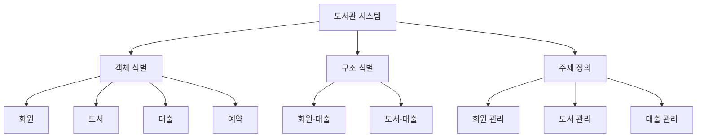

- 객체 식별:
  - 회원, 도서, 대출, 예약을 객체 후보로 찾는다.

- 구조 식별:
  - 회원은 여러 대출과 관계가 있다.
  - 도서는 여러 대출 이력을 가질 수 있다.
  - 예약은 회원과 도서 사이의 관계로 볼 수 있다.

- 주제 정의:
  - 회원 관리
  - 도서 관리
  - 대출 관리

- 속성과 인스턴스 연결:
  - 회원 속성: 회원번호, 이름, 연락처
  - 도서 속성: ISBN, 제목, 저자
  - 인스턴스 예: `회원번호=1001`, `ISBN=978...`

- 연산과 메시지 연결:
  - 회원 객체가 대출 요청 메시지를 보낸다.
  - 대출 객체가 도서 객체에게 대출 가능 여부 확인 메시지를 보낸다.
  - 도서 객체는 상태 변경 연산을 수행한다.

---

## 14. 암기 포인트

- 기본 암기:
  - `객체 식별`
  - `구조 식별`
  - `주제 정의`
  - `속성과 인스턴스 연결 정의`
  - `연산과 메시지 연결 정의`

- 암기어:
  - `객-구-주-속인-연메`
  - 객체
  - 구조
  - 주제
  - 속성/인스턴스
  - 연산/메시지

- 문장형 암기:
  - Coad와 Yourdon 방법은 E-R 다이어그램을 사용하여 객체의 행위를 모델링한다.
  - Coad와 Yourdon 방법은 객체 식별, 구조 식별, 주제 정의, 속성과 인스턴스 연결 정의, 연산과 메시지 연결 정의로 구성된다.

- 비교형 문제 접근:
  - `객체/구조/주제/속성/연산/메시지`가 보이면 Coad와 Yourdon을 의심한다.
  - `객체/동적/기능 모델링`이 보이면 Rumbaugh를 의심한다.
  - `상태 다이어그램`이 보이면 Rumbaugh의 동적 모델링 쪽이다.

---

## 15. 빠른 복습

- 챕터명: `036 객체지향 분석 방법론 - Coad와 Yourdon 방법`
- PDF 위치: `5페이지`
- PDF 최소 암기:
  - E-R 다이어그램 사용
  - 객체의 행위 모델링
  - 객체 식별
  - 구조 식별
  - 주제 정의
  - 속성과 인스턴스 연결 정의
  - 연산과 메시지 연결 정의

- 가장 중요한 구분:
  - Coad와 Yourdon = `객-구-주-속인-연메`
  - Rumbaugh = `객체/동적/기능 모델링`

- 문제 풀이 체크:
  - Coad와 Yourdon이라는 이름이 있는가?
  - E-R 다이어그램이 단서로 제시되는가?
  - 객체 식별, 구조 식별, 주제 정의가 함께 나오는가?
  - 속성/인스턴스, 연산/메시지 연결이 나오는가?

---

## 16. 참고 링크

- 기준 PDF: `/Users/nes0903/Documents/study/정보처리기사/핵심요약집_2026_정보처리기사필기핵심요약.pdf`
- [Q-Net - 정보처리기사 종목 정보](https://www.q-net.or.kr/crf005.do?id=crf00503&jmCd=1320)
- [Google Books - Object-oriented Analysis, Peter Coad and Edward Yourdon](https://books.google.com/books/about/Object_oriented_analysis.html?id=M8S9-gGxk1AC)
- [Research Profiles - Experience of using Coad and Yourdon object-oriented analysis and design](https://researchprofiles.herts.ac.uk/en/publications/experience-of-using-coad-and-yourdon-object-oriented-analysis-and)
- [NTHU - Object Oriented Analysis orientation using Coad/Yourdon OOA method](https://www.cs.nthu.edu.tw/~tanghome/SDTDoc/sdl92des.html)
