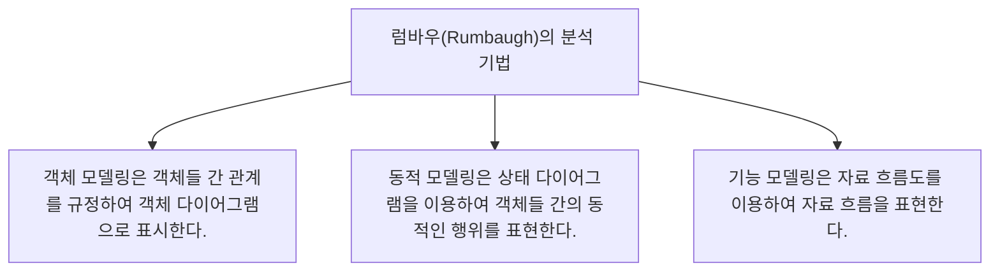

# 037 럼바우(Rumbaugh)의 분석 기법

작성 기준일: 2026-05-02  
과목: `1과목 소프트웨어 설계`  
기준 PDF: `/Users/nes0903/Documents/study/정보처리기사/핵심요약집_2026_정보처리기사필기핵심요약.pdf`  
PDF 확인 위치: `5페이지`  
검색 보강: 공식/표준/고품질 참고 자료를 함께 확인하여 시험 중심으로 확장 정리

---

## 1. 한 줄 요약

- 럼바우 분석 기법은 객체 모델링, 동적 모델링, 기능 모델링의 세 관점으로 시스템을 분석하는 객체지향 분석 방법이다.
- 이 챕터는 `객체지향` 영역에 속한다.
- 시험에서는 정의, 핵심 키워드, 비슷한 개념과의 구분을 함께 묻는 경우가 많다.

---

## 2. PDF 기준 핵심

- 객체 모델링은 객체들 간 관계를 규정하여 객체 다이어그램으로 표시한다.
- 동적 모델링은 상태 다이어그램을 이용하여 객체들 간의 동적인 행위를 표현한다.
- 기능 모델링은 자료 흐름도를 이용하여 자료 흐름을 표현한다.

- 위 항목은 PDF에서 직접 확인한 최소 암기 골격이다.
- 세부 설명은 이 골격을 기준으로 확장해서 이해하면 된다.

---

## 3. 개념 설명

- 객체 모델링은 시스템에 어떤 객체가 있고 서로 어떤 관계인지 본다.
- 동적 모델링은 시간이 지나며 객체 상태가 어떻게 변하는지 본다.
- 기능 모델링은 입력이 어떻게 처리되어 출력으로 변하는지 본다.
- 객체지향 문제는 클래스, 객체, 인스턴스, 메시지, 캡슐화, 상속, 다형성의 용어 구분에서 자주 나온다.
- 객체지향 설계 원칙은 변경 영향 축소와 재사용성 향상이라는 목적과 연결된다.

---

## 4. 핵심 포인트

- 문제를 풀 때는 먼저 지문 속 단서어를 찾고, 그 단서어가 어떤 개념을 가리키는지 연결한다.
- 정의형 문제는 표현이 조금 바뀌어도 핵심 의미가 같으면 같은 개념으로 판단한다.
- 옳고 그름 문제에서는 `항상`, `반드시`, `전혀`, `모두` 같은 극단 표현을 특히 조심한다.
- 이 챕터는 단독 암기보다 인접 챕터와 비교해 기억하면 정답률이 올라간다.

---

## 5. 시험에서 헷갈리는 비교

| 구분 | 핵심 |
|---|---|
| `객체 모델링` | 객체 다이어그램, 정적 구조 |
| `동적 모델링` | 상태 다이어그램, 상태 변화 |
| `기능 모델링` | 자료 흐름도, 자료 흐름 |

- 비교 문제는 이름보다 `역할`, `목적`, `사용 시점`, `장점/단점`을 기준으로 구분하면 안정적이다.

---

## 6. 예시 또는 암기 포인트

- 럼바우 = `객동기`, 도구 = `객체도-상태도-DFD`.

- 암기는 단어만 외우기보다 `정의 -> 특징 -> 예시 -> 반대 개념` 순서로 묶는 것이 좋다.

---

## 7. 빠른 복습

- 챕터명: `037 럼바우(Rumbaugh)의 분석 기법`
- 소속 영역: `객체지향`
- 자주 나오는 문제 유형:
  - 정의를 주고 개념명을 고르는 문제
  - 특징을 섞어 놓고 옳은/틀린 설명을 고르는 문제
  - 유사 개념과 비교하여 다른 하나를 찾는 문제

---

## 8. 참고 링크

- 기준 PDF: `/Users/nes0903/Documents/study/정보처리기사/핵심요약집_2026_정보처리기사필기핵심요약.pdf`
- [Q-Net 정보처리기사 종목 페이지](https://www.q-net.or.kr/crf005.do?id=crf00503s02&jmCd=1320&jmInfoDivCcd=B0)
- [OMG - Unified Modeling Language](https://www.omg.org/spec/UML/)
- [OMG - What is UML?](https://www.omg.org/uml/what-is-uml.htm)
- [Microsoft - SOLID principles and Dependency Injection](https://learn.microsoft.com/en-us/dotnet/architecture/microservices/microservice-ddd-cqrs-patterns/microservice-application-layer-web-api-design)
