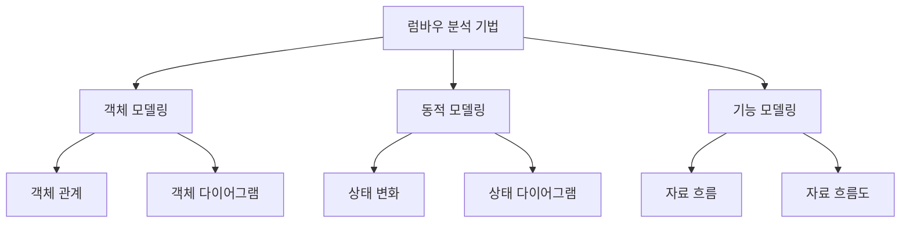
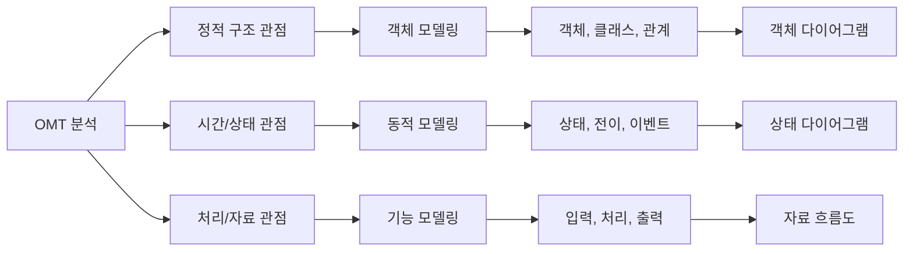
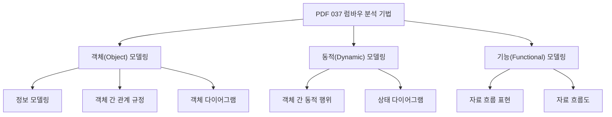
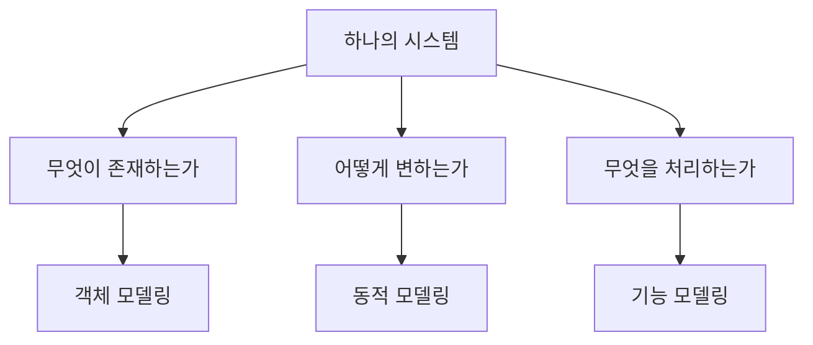
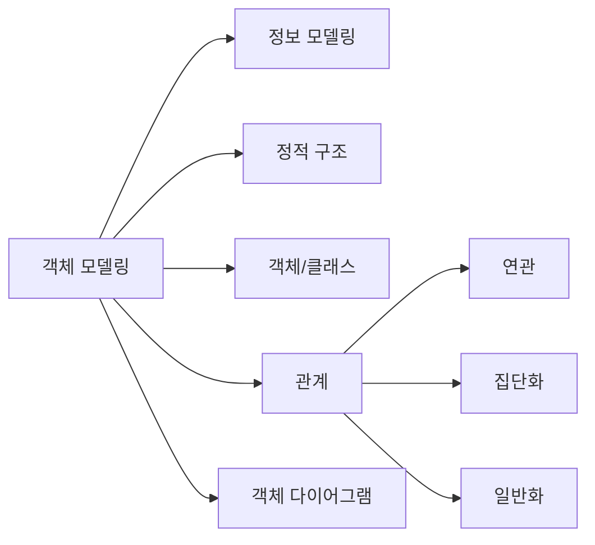
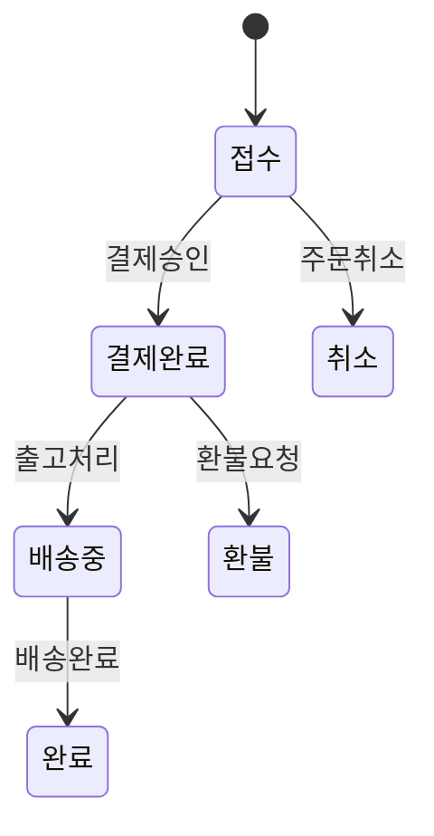
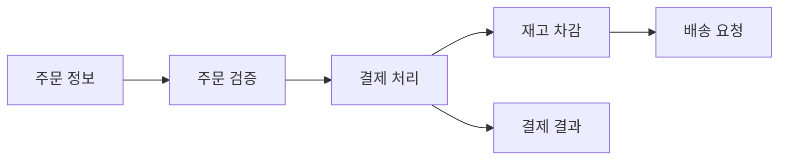
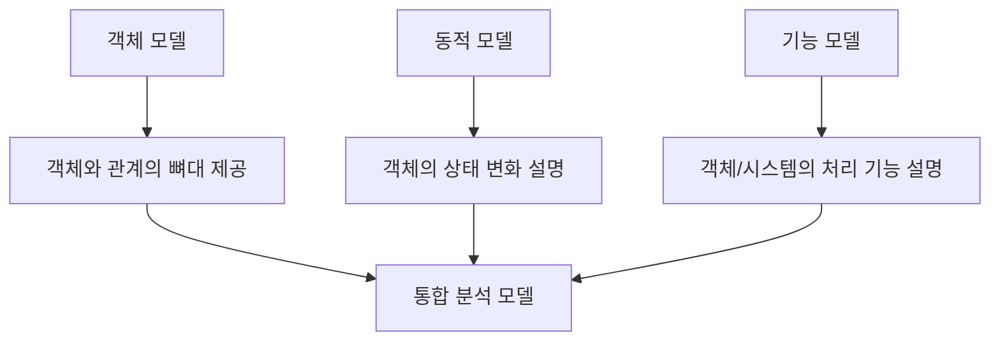
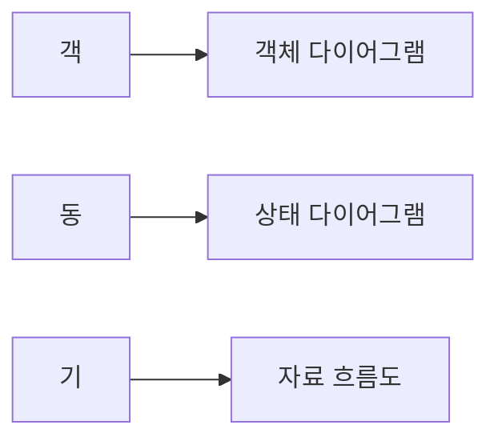

# 037 럼바우(Rumbaugh)의 분석 기법

작성 기준일: 2026-05-02
검색/보강일: 2026-06-01
과목: `1과목 소프트웨어 설계`
기준 PDF: `/Users/nes0903/Documents/study/정보처리기사/핵심요약집_2026_정보처리기사필기핵심요약.pdf`
PDF 확인 위치: `5페이지`
주제별 검색 키워드: `Rumbaugh Object Modeling Technique`, `OMT object dynamic functional model`, `state diagram data flow diagram OMT`

---

## 1. 한 줄 요약

- 럼바우의 분석 기법은 OMT(Object Modeling Technique)를 기반으로 시스템을 `객체 모델`, `동적 모델`, `기능 모델`의 세 관점에서 분석하는 객체지향 분석 방법이다.
- PDF 기준 핵심은 `객체 모델링=객체 다이어그램`, `동적 모델링=상태 다이어그램`, `기능 모델링=자료 흐름도(DFD)`이다.
- 시험에서는 세 모델의 이름보다 `무엇을 표현하는지`와 `어떤 다이어그램으로 표현하는지`를 섞어 출제하는 경우가 많다.

---

## 2. 한눈에 보는 구조

- 럼바우 방법은 시스템을 한 장의 그림으로 끝내지 않고, 서로 다른 세 관점으로 나누어 모델링한다.
- `객체 모델링`은 시스템에 어떤 객체가 있고 그 객체들이 어떤 관계를 갖는지 보는 관점이다.
- `동적 모델링`은 이벤트가 발생할 때 객체의 상태가 어떻게 바뀌는지 보는 관점이다.
- `기능 모델링`은 입력 데이터가 어떤 처리 과정을 거쳐 출력 데이터가 되는지 보는 관점이다.
- 세 모델은 서로 경쟁하는 개념이 아니라, 같은 시스템을 구조, 행위, 기능으로 나누어 설명하는 보완 관계이다.

---

## 3. PDF 기준 핵심

- `객체(Object) 모델링`
  - 정보 모델링이라고도 한다.
  - 객체들 간의 관계를 규정한다.
  - 객체 다이어그램으로 표시한다.
- `동적(Dynamic) 모델링`
  - 상태 다이어그램을 이용한다.
  - 객체들 간의 동적인 행위를 표현한다.
- `기능(Functional) 모델링`
  - 자료 흐름도를 이용한다.
  - 자료 흐름을 표현한다.

- 위 세 줄이 기준 PDF에서 직접 확인해야 하는 최소 암기 골격이다.
- PDF 표현 중 `정보 모델링`은 반드시 `객체 모델링`의 별칭으로 연결한다.
- `동적`이라는 단어가 나오면 단순히 기능이 많다는 뜻이 아니라 `상태 변화`, `전이`, `행위`와 연결한다.
- `기능`이라는 단어가 나오면 객체의 메서드 목록이 아니라 `자료 흐름도`, `입력-처리-출력`과 연결한다.

---

## 4. 검색으로 보강한 관점

- OMT는 James Rumbaugh, Michael Blaha, William Premerlani, Frederick Eddy, William Lorensen 등이 정리한 객체지향 모델링 기법으로 알려져 있다.
- 여러 OMT 설명 자료는 공통적으로 세 모델을 다음처럼 구분한다.
  - Object model: 시스템의 정적 구조, 객체 또는 클래스, 관계를 표현한다.
  - Dynamic model: 시간에 따른 상태, 전이, 이벤트를 표현한다.
  - Functional model: 데이터 변환, 처리, 자료 흐름을 표현한다.
- OMT는 이후 UML 형성에도 영향을 준 객체지향 분석/설계 계열 방법론으로 다뤄진다.
- 시험 학습에서는 OMT의 역사보다 `세 모델과 표현 도구의 연결`이 훨씬 중요하다.
- 웹 자료가 `object model`, `dynamic model`, `functional model`이라고 표현하더라도, 정보처리기사 PDF 표현인 `객체 모델링`, `동적 모델링`, `기능 모델링`으로 다시 바꾸어 암기한다.

---

## 5. 개념 설명

### 5.1 럼바우 분석 기법의 위치

- 럼바우의 분석 기법은 객체지향 분석 방법론 중 하나이다.
- 객체지향 분석은 현실 세계의 문제 영역을 객체, 속성, 연산, 관계 중심으로 파악한다.
- 럼바우 방법의 특징은 한 시스템을 세 가지 모델로 나누어 본다는 점이다.
- 구조적 분석이 자료 흐름도 중심으로 기능을 분석하는 성격이 강하다면, 럼바우 방법은 객체의 구조와 행위까지 함께 분석한다.
- 다만 럼바우의 `기능 모델링`에서는 자료 흐름도(DFD)를 사용하므로, 구조적 분석에서 쓰는 도구가 객체지향 분석 안에서도 일부 활용된다고 이해하면 된다.

### 5.2 왜 세 모델로 나누는가

- 시스템은 객체 목록만으로는 충분히 설명되지 않는다.
- 예를 들어 주문 시스템에는 `고객`, `주문`, `상품`, `결제` 같은 객체가 존재한다.
- 하지만 객체가 존재한다는 사실만으로는 주문이 `접수`, `결제 완료`, `배송 중`, `완료` 상태로 바뀌는 흐름을 알 수 없다.
- 또한 주문 정보가 입력되어 결제 승인, 재고 차감, 배송 요청으로 흘러가는 데이터 처리 과정도 별도로 설명해야 한다.
- 그래서 럼바우 방법은 객체의 정적 구조, 시간에 따른 동작, 데이터 처리 기능을 나누어 표현한다.

---

## 6. 객체 모델링

- 객체 모델링은 시스템의 정적 구조를 분석하는 모델링이다.
- PDF에서는 `정보 모델링이라고도 하며 객체들 간의 관계를 규정한다`고 정리한다.
- 여기서 정적 구조란 시간이 흘러도 비교적 안정적으로 유지되는 객체, 클래스, 속성, 관계를 뜻한다.
- 객체 모델링에서 주로 보는 내용은 다음과 같다.
  - 시스템에 어떤 객체가 존재하는가
  - 객체가 어떤 속성을 갖는가
  - 객체가 어떤 연산 또는 책임을 갖는가
  - 객체 사이에 어떤 관계가 있는가
  - 한 객체가 다른 객체의 부분인지, 일반화/특수화 관계인지
- 객체 모델링 결과는 객체 다이어그램으로 표현한다.
- 시험에서는 `정보 모델링`, `객체 관계`, `객체 다이어그램`이 보이면 객체 모델링을 고른다.

### 객체 모델링 예시

- 온라인 쇼핑몰을 분석할 때 객체 모델링 대상은 다음처럼 잡을 수 있다.
  - `회원`
  - `상품`
  - `장바구니`
  - `주문`
  - `결제`
  - `배송`
- 이때 `회원은 주문을 생성한다`, `주문은 여러 주문 항목을 포함한다`, `상품은 카테고리에 속한다` 같은 관계를 표현하면 객체 모델링이다.
- 아직 주문 상태 변화나 결제 데이터 흐름을 설명하는 단계가 아니라, 객체와 관계를 중심으로 분석하는 단계이다.

---

## 7. 동적 모델링

- 동적 모델링은 객체의 상태 변화와 시간에 따른 동작을 분석하는 모델링이다.
- PDF에서는 `상태 다이어그램을 이용하여 객체들 간의 동적인 행위를 표현한다`고 정리한다.
- 동적 모델링에서 중요한 단어는 다음과 같다.
  - `상태`: 객체가 특정 시점에 놓인 조건이나 단계
  - `이벤트`: 상태 변화를 유발하는 사건
  - `전이`: 한 상태에서 다른 상태로 이동하는 변화
  - `행위`: 상태 변화 과정에서 수행되는 동작
- 예를 들어 주문 객체는 `접수`, `결제 완료`, `배송 중`, `완료`, `취소` 같은 상태를 가질 수 있다.
- `결제 승인`, `출고 처리`, `배송 완료`, `주문 취소` 같은 이벤트가 발생하면 상태가 바뀐다.
- 이런 흐름을 상태 다이어그램으로 표현하면 동적 모델링이다.

### 동적 모델링에서 자주 나오는 함정

- `동적`이라는 단어 때문에 자료가 흘러가는 그림을 떠올리면 안 된다.
- 자료 흐름은 기능 모델링이고, 상태 변화는 동적 모델링이다.
- `상태`, `전이`, `이벤트`, `행위`, `state diagram`이 단서이면 동적 모델링이다.
- 객체 모델링이 객체 간 관계를 보여 주더라도, 객체가 시간에 따라 어떤 상태로 변하는지는 별도의 동적 모델링에서 표현한다.

---

## 8. 기능 모델링

- 기능 모델링은 데이터가 어떤 처리 과정을 거쳐 변환되는지 분석하는 모델링이다.
- PDF에서는 `자료 흐름도를 이용하여 자료 흐름을 표현한다`고 정리한다.
- 기능 모델링의 핵심 질문은 다음과 같다.
  - 어떤 입력 자료가 들어오는가
  - 자료가 어떤 처리 기능을 통과하는가
  - 중간 데이터는 어디에 저장되는가
  - 어떤 출력 자료가 생성되는가
  - 외부 주체와 어떤 자료를 주고받는가
- 기능 모델링 결과는 자료 흐름도(DFD)로 표현한다.
- DFD는 구조적 분석에서도 중요한 도구이지만, 럼바우 방법에서는 `기능 모델링`의 표현 도구로 시험에 나온다.

### 기능 모델링 예시

- 주문 시스템에서 기능 모델링은 다음 흐름을 표현할 수 있다.
  - 고객이 주문 정보를 입력한다.
  - 주문 검증 기능이 상품, 수량, 주소를 확인한다.
  - 결제 처리 기능이 결제 정보를 승인 요청으로 변환한다.
  - 재고 처리 기능이 재고 데이터를 갱신한다.
  - 배송 요청 데이터가 물류 시스템으로 전달된다.
- 여기서 관심사는 `주문 객체가 어떤 클래스인가`가 아니라 `자료가 어떤 처리 과정을 거쳐 흐르는가`이다.

---

## 9. 세 모델의 관계

- 객체 모델은 시스템의 뼈대 역할을 한다.
- 동적 모델은 그 객체들이 시간에 따라 어떻게 움직이는지 설명한다.
- 기능 모델은 시스템이 어떤 데이터 변환과 처리를 수행하는지 설명한다.
- 세 모델은 서로 독립적으로 외우기보다, 한 시스템을 나누어 보는 관점으로 연결해야 한다.
- 객체 모델 없이 기능만 보면 절차 중심 분석에 가까워질 수 있고, 기능 모델 없이 객체만 보면 시스템이 실제로 어떤 일을 처리하는지 약해진다.
- 동적 모델 없이 객체와 기능만 보면 이벤트와 상태 전이를 놓치기 쉽다.

---

## 10. 시험 포인트

- `객체 모델링 = 정보 모델링 = 객체 간 관계 = 객체 다이어그램`으로 암기한다.
- `동적 모델링 = 상태 변화 = 동적 행위 = 상태 다이어그램`으로 암기한다.
- `기능 모델링 = 자료 흐름 = 처리 기능 = 자료 흐름도(DFD)`로 암기한다.
- `정보 모델링`이라는 말은 `기능 모델링`이 아니라 `객체 모델링`의 별칭이다.
- `DFD`가 나오면 럼바우에서는 `기능 모델링`과 연결한다.
- `상태 다이어그램`이 나오면 `동적 모델링`과 연결한다.
- `객체 다이어그램`이 나오면 `객체 모델링`과 연결한다.
- Coad와 Yourdon 방법은 `객체 식별`, `구조 식별`, `주제 정의`, `속성/인스턴스 연결`, `연산/메시지 연결` 같은 절차가 단서이다.
- Rumbaugh 방법은 `객체/동적/기능`의 세 모델 구분이 단서이다.
- 문제에서 `객체지향 분석 방법 중 세 가지 모델로 나누는 방법`이라고 하면 럼바우를 먼저 떠올린다.

---

## 11. 헷갈리는 비교

| 구분 | 핵심 표현 | 산출물/도구 | 시험 단서 |
|---|---|---|---|
| 객체 모델링 | 객체와 객체 간 관계를 규정 | 객체 다이어그램 | 정보 모델링, 정적 구조, 객체 관계 |
| 동적 모델링 | 객체의 동적인 행위와 상태 변화를 표현 | 상태 다이어그램 | 상태, 전이, 이벤트, 동적 행위 |
| 기능 모델링 | 자료 흐름과 처리 기능을 표현 | 자료 흐름도 | DFD, 입력-처리-출력, 데이터 변환 |
| Coad와 Yourdon | 객체 식별 후 구조, 주제, 속성, 연산을 정리 | E-R 다이어그램 등 | 객체 식별, 주제 정의, 연산/메시지 연결 |
| 구조적 분석 | 기능 분해와 데이터 흐름 중심 | DFD, 자료 사전, 소단위 명세서 | 자료 흐름 중심, 프로세스 중심 |

- `객체 모델링`과 `기능 모델링`의 차이는 `객체 관계`인지 `자료 흐름`인지로 구분한다.
- `동적 모델링`과 `기능 모델링`의 차이는 `상태 변화`인지 `데이터 변환`인지로 구분한다.
- `객체 다이어그램`과 `상태 다이어그램`은 이름이 비슷하지 않지만, 보기에서 `동적 행위`와 `객체 관계`를 바꿔 놓을 수 있다.
- `정보 모델링`이라는 단어를 보고 데이터베이스의 정보 흐름으로 착각하면 안 된다. 이 챕터에서는 객체 모델링의 별칭이다.

---

## 12. 예시로 구분하기

### 12.1 도서 대출 시스템

| 분석 내용 | 해당 모델링 | 이유 |
|---|---|---|
| 회원, 도서, 대출, 반납 객체와 관계를 정의 | 객체 모델링 | 객체와 관계를 규정하기 때문 |
| 대출 객체가 신청, 승인, 대출 중, 반납 완료, 연체 상태로 변함 | 동적 모델링 | 상태 변화와 이벤트를 표현하기 때문 |
| 대출 신청 데이터가 검증, 승인, 대출 기록 생성 과정을 거침 | 기능 모델링 | 자료 흐름과 처리 기능을 표현하기 때문 |

### 12.2 은행 계좌 시스템

- 객체 모델링
  - `고객`, `계좌`, `거래`, `카드` 객체를 식별한다.
  - `고객은 여러 계좌를 보유한다`, `계좌는 여러 거래를 가진다` 같은 관계를 정의한다.
- 동적 모델링
  - 계좌 상태가 `정상`, `거래 정지`, `해지`로 변하는 조건을 표현한다.
  - 카드 상태가 `발급`, `사용 가능`, `분실 신고`, `정지`로 전이되는 흐름을 표현한다.
- 기능 모델링
  - 출금 요청이 잔액 조회, 한도 확인, 출금 처리, 거래 내역 저장으로 이어지는 자료 흐름을 표현한다.

---

## 13. 암기 포인트

- 암기 문장: `객체는 객체 관계, 동적은 상태 변화, 기능은 자료 흐름`
- 압축 암기: `객-동-기 = 객체도, 상태도, 자료흐름도`
- 단서어 암기:
  - `정보 모델링` -> 객체 모델링
  - `상태 다이어그램` -> 동적 모델링
  - `자료 흐름도` -> 기능 모델링
- 실수 방지:
  - `기능 모델링`을 클래스의 기능 목록으로 해석하지 않는다.
  - `동적 모델링`을 자료 흐름으로 해석하지 않는다.
  - `객체 모델링`을 객체의 상태 변화로 해석하지 않는다.

---

## 14. 빠른 복습

- 럼바우의 분석 기법은 OMT 기반 객체지향 분석 방법이다.
- 세 모델은 `객체 모델링`, `동적 모델링`, `기능 모델링`이다.
- 객체 모델링은 정보 모델링이라고도 하며 객체 간 관계를 객체 다이어그램으로 표현한다.
- 동적 모델링은 객체의 동적 행위를 상태 다이어그램으로 표현한다.
- 기능 모델링은 자료 흐름을 자료 흐름도(DFD)로 표현한다.
- 시험 최우선 암기식은 `객체=객체 다이어그램`, `동적=상태 다이어그램`, `기능=자료 흐름도`이다.

---

## 15. 참고 링크

- 기준 PDF: `/Users/nes0903/Documents/study/정보처리기사/핵심요약집_2026_정보처리기사필기핵심요약.pdf`
- [Q-Net - 정보처리기사 종목 정보](https://www.q-net.or.kr/crf005.do?id=crf00503&jmCd=1320)
- [Open Library - Object-oriented modeling and design by James Rumbaugh](https://openlibrary.org/books/OL19605501M)
- [Vrije Universiteit Amsterdam - Object Modeling Technique](https://www.cs.vu.nl/~jfmburg/omt.html)
- [ConceptDraw - OMT Method](https://www.conceptdraw.com/How-To-Guide/omt-method)
- [OMG - UML Specification](https://www.omg.org/spec/UML/)

<!-- study-links:start -->
## 관련 문서

- `coad와 yourdon 방법`: [[정보처리기사/1과목 소프트웨어 설계/036 객체지향 분석 방법론 - Coad와 Yourdon 방법/036 객체지향 분석 방법론 - Coad와 Yourdon 방법|036 객체지향 분석 방법론 - Coad와 Yourdon 방법]]
- `e r 다이어그램`: [[정보처리기사/3과목 데이터베이스 구축/105 E-R 다이어그램/105 E-R 다이어그램|105 E-R 다이어그램]]
- `상태 전이`: [[정보처리기사/4과목 프로그래밍 언어 활용/203 프로세스 상태 및 상태 전이/203 프로세스 상태 및 상태 전이|203 프로세스 상태 및 상태 전이]]
- `uml`: [[정보처리기사/1과목 소프트웨어 설계/013 UML/013 UML|013 UML]]
<!-- study-links:end -->
