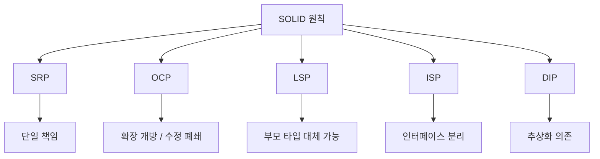
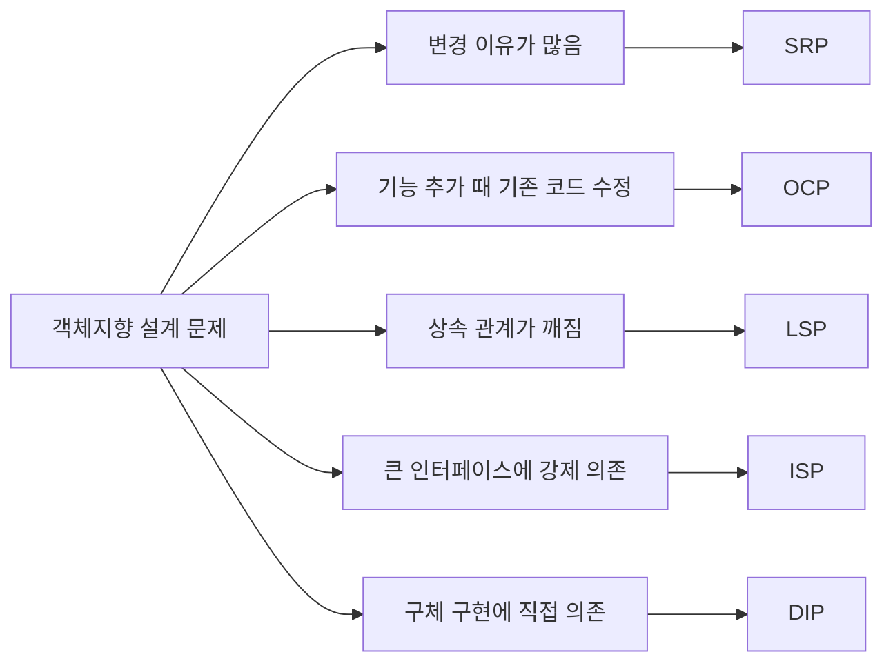
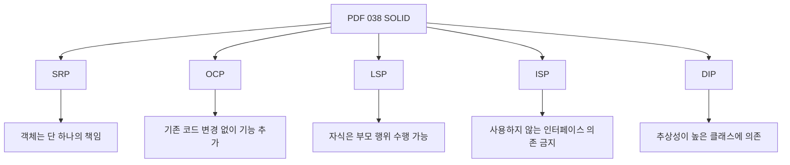
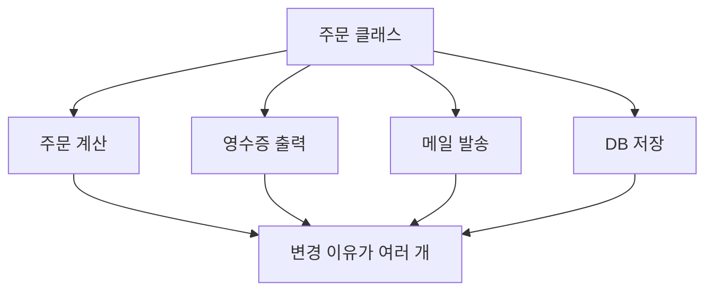
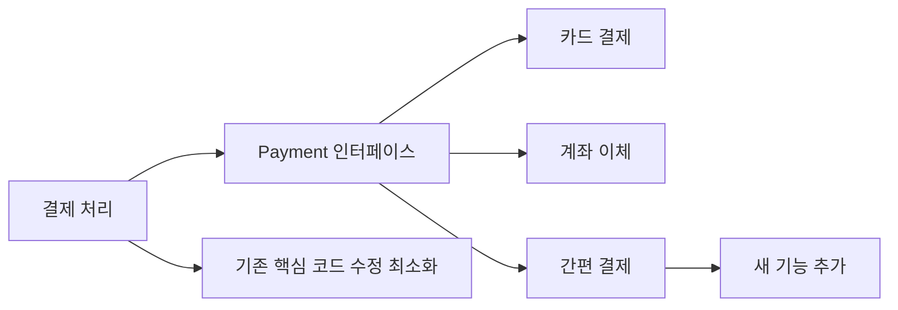
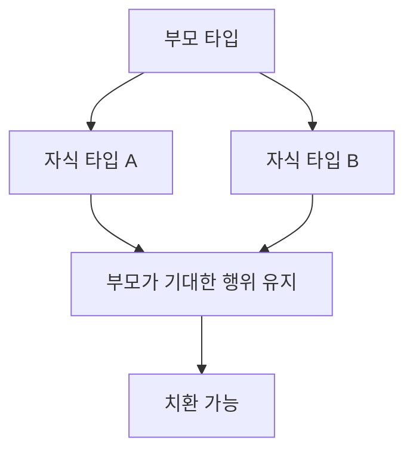
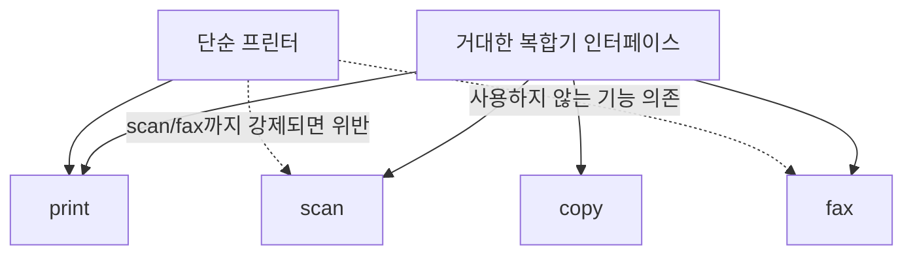
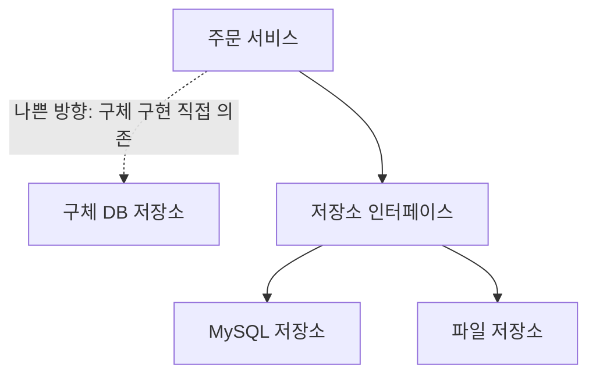
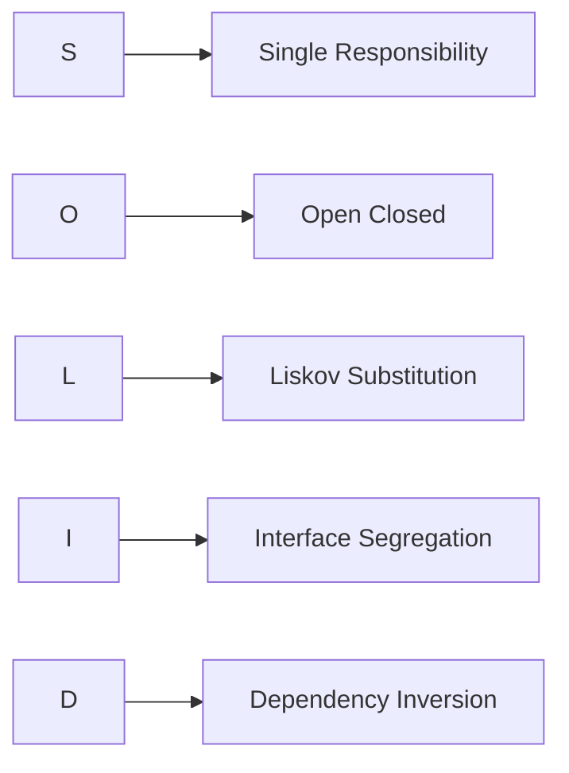

# 038 객체지향 설계 원칙(SOLID 원칙)

작성 기준일: 2026-05-02
검색/보강일: 2026-06-01
과목: `1과목 소프트웨어 설계`
기준 PDF: `/Users/nes0903/Documents/study/정보처리기사/핵심요약집_2026_정보처리기사필기핵심요약.pdf`
PDF 확인 위치: `5페이지`
주제별 검색 키워드: `SOLID principles Robert C. Martin`, `SRP OCP LSP ISP DIP`, `Microsoft SOLID principles dependency inversion`

---

## 1. 한 줄 요약

- SOLID는 객체지향 설계를 유지보수와 확장에 강하게 만들기 위한 다섯 가지 설계 원칙이다.
- PDF 기준 핵심은 `SRP 단일 책임`, `OCP 개방-폐쇄`, `LSP 리스코프 치환`, `ISP 인터페이스 분리`, `DIP 의존 역전`이다.
- 시험에서는 약어, 한글명, 핵심 정의를 서로 바꿔 놓고 틀린 짝을 고르게 하는 문제가 자주 나온다.

---

## 2. 한눈에 보는 구조

- SOLID는 단순 암기어가 아니라 `변경이 어려운 설계`를 줄이기 위한 기준이다.
- `SRP`는 책임을 하나로 모아 변경 이유를 줄인다.
- `OCP`는 새로운 기능을 추가해도 기존 코드를 덜 고치게 만든다.
- `LSP`는 상속과 다형성이 안전하게 작동하도록 한다.
- `ISP`는 클라이언트가 쓰지 않는 기능에 의존하지 않게 한다.
- `DIP`는 고수준 정책이 저수준 구현에 끌려가지 않도록 의존 방향을 추상화 쪽으로 돌린다.

---

## 3. PDF 기준 핵심

- `단일 책임 원칙(SRP, Single Responsibility Principle)`
  - 객체는 단 하나의 책임만 가져야 한다.
- `개방-폐쇄 원칙(OCP, Open Closed Principle)`
  - 기존 코드를 변경하지 않고 기능을 추가할 수 있도록 설계해야 한다.
- `리스코프 치환 원칙(LSP, Liskov Substitution Principle)`
  - 자식 클래스는 최소한 부모 클래스에서 가능한 행위는 수행할 수 있어야 한다.
- `인터페이스 분리 원칙(ISP, Interface Segregation Principle)`
  - 자신이 사용하지 않는 인터페이스와 의존 관계를 맺거나 영향을 받지 않아야 한다.
- `의존 역전 원칙(DIP, Dependency Inversion Principle)`
  - 추상성이 낮은 클래스보다 추상성이 높은 클래스와 의존 관계를 맺어야 한다.

- 위 문장은 기준 PDF에서 확인한 시험용 최소 골격이다.
- 실무 자료에서는 표현이 조금 다르더라도, 정보처리기사 답안 판단은 PDF 표현을 우선한다.
- 특히 `DIP`는 `Dependency Injection` 자체가 아니라 `추상화에 의존하도록 의존 방향을 뒤집는 원칙`으로 이해해야 한다.

---

## 4. 검색으로 보강한 관점

- Robert C. Martin의 객체지향 설계 원칙 정리에서는 SRP, OCP, LSP, ISP, DIP가 클래스 설계 원칙으로 묶여 설명된다.
- Microsoft 문서에서도 SOLID 원칙은 애플리케이션 계층 설계, 의존성 주입, 추상화 기반 설계와 함께 다뤄진다.
- 일반적인 SOLID 설명에서 공통으로 강조하는 목적은 다음과 같다.
  - 변경 영향 감소
  - 결합도 감소
  - 응집도 증가
  - 테스트 용이성 향상
  - 확장 가능한 구조
- 시험에서는 SOLID의 역사보다 `각 원칙이 어떤 나쁜 설계를 막는가`를 연결하면 보기를 더 빠르게 구분할 수 있다.

---

## 5. SOLID 전체 비교

| 약어 | 한글명 | 핵심 문장 | 대표 단서 | 주로 막는 문제 |
|---|---|---|---|---|
| SRP | 단일 책임 원칙 | 객체는 단 하나의 책임만 가져야 함 | 책임, 변경 이유 하나 | 한 클래스가 너무 많은 일을 함 |
| OCP | 개방-폐쇄 원칙 | 확장에는 열려 있고 수정에는 닫혀야 함 | 기존 코드 변경 없이 기능 추가 | 새 기능마다 기존 코드 수정 |
| LSP | 리스코프 치환 원칙 | 자식은 부모를 대체할 수 있어야 함 | 부모 타입, 하위 타입, 치환 | 상속 후 부모 계약 위반 |
| ISP | 인터페이스 분리 원칙 | 쓰지 않는 인터페이스에 의존하지 않아야 함 | 작은 인터페이스, 클라이언트별 인터페이스 | 거대한 인터페이스 강제 구현 |
| DIP | 의존 역전 원칙 | 구체 구현보다 추상화에 의존해야 함 | 추상화, 의존 방향, 고수준/저수준 | 고수준 정책이 세부 구현에 직접 의존 |

- `SRP`와 `ISP`는 둘 다 작게 나누는 느낌이 있지만 대상이 다르다.
- `SRP`는 객체나 클래스의 책임을 다루고, `ISP`는 인터페이스의 의존 범위를 다룬다.
- `OCP`와 `DIP`는 추상화를 함께 활용하는 경우가 많지만 초점이 다르다.
- `OCP`는 기능 확장 시 기존 코드 수정을 줄이는 원칙이고, `DIP`는 의존 방향을 추상화 쪽으로 바꾸는 원칙이다.
- `LSP`는 상속과 다형성에서 하위 타입이 상위 타입의 기대 동작을 깨지 않아야 한다는 원칙이다.

---

## 6. SRP - 단일 책임 원칙

- SRP는 객체가 단 하나의 책임만 가져야 한다는 원칙이다.
- `책임`은 단순히 메서드 개수 하나를 뜻하지 않는다.
- 시험에서는 PDF 표현처럼 `객체는 단 하나의 책임만 가져야 한다`로 먼저 외운다.
- 확장해서 이해하면 `변경 이유가 하나가 되도록 설계한다`는 뜻이다.
- 한 클래스가 주문 계산, 영수증 출력, 이메일 발송, DB 저장을 모두 맡으면 변경 이유가 여러 개가 된다.
- 책임이 여러 개이면 다음 문제가 생긴다.
  - 한 기능 수정이 다른 기능에 영향을 줄 수 있다.
  - 테스트 범위가 커진다.
  - 클래스 이름과 역할이 불명확해진다.
  - 재사용이 어려워진다.
- SRP를 적용하면 주문 계산은 `OrderCalculator`, 영수증 출력은 `ReceiptPrinter`, 메일 발송은 `NotificationService`처럼 책임별로 분리할 수 있다.

### SRP 시험 단서

- `단 하나의 책임`
- `변경 이유가 하나`
- `하나의 객체가 여러 기능을 동시에 담당하지 않음`
- `응집도 향상`

---

## 7. OCP - 개방-폐쇄 원칙

- OCP는 기존 코드를 변경하지 않고 기능을 추가할 수 있도록 설계해야 한다는 원칙이다.
- `개방`은 새로운 기능 추가나 확장이 가능해야 한다는 뜻이다.
- `폐쇄`는 이미 검증된 기존 코드를 불필요하게 수정하지 않아야 한다는 뜻이다.
- 결제 수단을 추가할 때 `if 카드`, `if 계좌`, `if 간편결제`가 계속 늘어나며 기존 결제 코드를 수정해야 한다면 OCP가 약한 구조이다.
- 추상화와 다형성을 활용해 `Payment` 인터페이스를 만들고 결제 수단별 구현체를 추가하면, 기존 결제 흐름 수정 없이 새 결제 방식을 붙일 수 있다.
- 시험에서는 `기존 코드 변경 없이 기능 추가`라는 문장이 나오면 OCP로 연결한다.

### OCP 시험 단서

- `확장에는 열려 있음`
- `수정에는 닫혀 있음`
- `기존 코드 변경 없이 기능 추가`
- `다형성`, `추상화`, `전략 교체`

---

## 8. LSP - 리스코프 치환 원칙

- LSP는 자식 클래스가 부모 클래스를 대체하더라도 프로그램의 올바른 동작이 깨지지 않아야 한다는 원칙이다.
- PDF 표현은 `자식 클래스는 최소한 부모 클래스에서 가능한 행위는 수행할 수 있어야 한다`이다.
- 상속 관계에서 부모 타입으로 호출하는 코드가 자식 객체를 받아도 정상적으로 동작해야 한다.
- 예를 들어 `새는 날 수 있다`라는 부모 클래스 계약을 만들고, 날 수 없는 펭귄을 자식 클래스로 넣으면 문제가 된다.
- 이 경우 펭귄은 부모가 약속한 `fly()` 행위를 수행하지 못하므로 LSP 위반 예시로 자주 설명된다.
- 더 나은 설계는 `Bird`와 `Flyable`을 분리하여, 날 수 있는 새만 `Flyable`을 구현하게 하는 것이다.

### LSP 시험 단서

- `자식 클래스`
- `부모 클래스`
- `대체 가능`
- `치환 가능`
- `상속 관계에서 부모의 행위를 보장`
- `다형성의 안전성`

---

## 9. ISP - 인터페이스 분리 원칙

- ISP는 자신이 사용하지 않는 인터페이스와 의존 관계를 맺거나 영향을 받지 않아야 한다는 원칙이다.
- 큰 인터페이스 하나에 모든 기능을 몰아넣으면, 어떤 클래스는 사용하지 않는 메서드까지 강제로 구현해야 한다.
- 예를 들어 단순 프린터가 `print`, `scan`, `fax`, `copy`를 모두 가진 인터페이스를 구현해야 한다면 ISP 위반 가능성이 높다.
- 이 경우 `Printable`, `Scannable`, `Faxable`, `Copyable`처럼 역할별 인터페이스로 나누면 클라이언트가 필요한 기능에만 의존할 수 있다.
- 시험에서는 `자신이 사용하지 않는 인터페이스에 의존하지 않음`이라는 표현이 핵심이다.

### ISP 시험 단서

- `인터페이스 분리`
- `사용하지 않는 인터페이스`
- `클라이언트별 인터페이스`
- `큰 인터페이스보다 작은 인터페이스`
- `불필요한 메서드 강제 구현 방지`

---

## 10. DIP - 의존 역전 원칙

- DIP는 추상성이 낮은 클래스보다 추상성이 높은 클래스와 의존 관계를 맺어야 한다는 원칙이다.
- 고수준 모듈은 업무 규칙이나 핵심 정책을 담는 모듈이다.
- 저수준 모듈은 DB, 파일, 네트워크, 외부 API처럼 세부 구현을 담당하는 모듈이다.
- DIP는 고수준 모듈이 저수준 구현체에 직접 의존하지 말고, 인터페이스나 추상 클래스 같은 추상화에 의존하게 만든다.
- 예를 들어 `OrderService`가 `MySqlOrderRepository`를 직접 생성하고 호출하면 DB 구현 변경이 주문 서비스에 영향을 준다.
- `OrderRepository` 인터페이스에 의존하고 실제 구현체를 외부에서 주입하면 구현 교체가 쉬워진다.
- 의존성 주입(DI)은 DIP를 구현하는 대표적인 방법 중 하나이지만, DIP와 DI는 같은 뜻이 아니다.

### DIP 시험 단서

- `의존 역전`
- `추상화에 의존`
- `추상성이 높은 클래스`
- `구체 클래스 의존 감소`
- `고수준 모듈과 저수준 모듈`
- `인터페이스에 의존`

---

## 11. 시험 포인트 - 헷갈리는 비교

| 헷갈리는 쌍 | 구분 기준 |
|---|---|
| SRP vs ISP | SRP는 객체/클래스의 책임, ISP는 인터페이스 의존 범위 |
| OCP vs DIP | OCP는 확장 방식, DIP는 의존 방향 |
| LSP vs OCP | LSP는 상속 치환 가능성, OCP는 기존 코드 수정 없이 확장 |
| DIP vs DI | DIP는 설계 원칙, DI는 의존 객체를 외부에서 주입하는 구현 방법 |
| SRP vs 응집도 | SRP를 지키면 보통 응집도가 높아지지만, 두 용어가 완전히 같은 뜻은 아님 |

- `자식 클래스`, `부모 클래스`, `행위 수행 가능`이 나오면 LSP이다.
- `사용하지 않는 인터페이스`, `영향을 받지 않아야 한다`가 나오면 ISP이다.
- `기존 코드 변경 없이 기능 추가`가 나오면 OCP이다.
- `추상성이 높은 클래스와 의존 관계`가 나오면 DIP이다.
- `단 하나의 책임`이 나오면 SRP이다.

---

## 12. 예시로 묶어 보기

### 12.1 주문 시스템

- SRP 적용
  - 주문 계산, 할인 정책, 영수증 출력, 알림 발송을 하나의 클래스에 넣지 않는다.
- OCP 적용
  - 할인 정책을 추가할 때 기존 주문 계산 코드를 직접 수정하지 않고 새 할인 정책 구현체를 추가한다.
- LSP 적용
  - `DiscountPolicy`의 하위 정책은 부모 정책이 약속한 계산 계약을 깨지 않는다.
- ISP 적용
  - 알림 발송 인터페이스를 이메일, SMS, 푸시 등 필요한 기능 단위로 나누어 불필요한 기능 의존을 줄인다.
- DIP 적용
  - 주문 서비스는 구체 결제 API가 아니라 `PaymentGateway` 같은 추상화에 의존한다.

### 12.2 파일 저장 시스템

| 상황 | 관련 원칙 | 판단 |
|---|---|---|
| 파일 저장 클래스가 압축, 암호화, 업로드, 로그를 모두 처리 | SRP | 책임이 너무 많음 |
| 새 저장소를 추가할 때마다 기존 저장 로직의 조건문을 수정 | OCP | 확장 때 기존 코드 수정 발생 |
| 부모 저장소 타입을 자식 저장소로 바꾸면 예외 처리 계약이 깨짐 | LSP | 치환 가능성 위반 |
| 읽기 전용 저장소가 쓰기 메서드까지 구현해야 함 | ISP | 사용하지 않는 인터페이스 의존 |
| 업무 서비스가 특정 클라우드 SDK에 직접 의존 | DIP | 구체 구현 의존 |

---

## 13. 암기 포인트

- 암기 문장: `단개리인의`
  - `단`: 단일 책임 원칙
  - `개`: 개방-폐쇄 원칙
  - `리`: 리스코프 치환 원칙
  - `인`: 인터페이스 분리 원칙
  - `의`: 의존 역전 원칙
- 핵심 연결:
  - `S` -> 책임 하나
  - `O` -> 확장 열림, 수정 닫힘
  - `L` -> 부모를 자식으로 바꿔도 됨
  - `I` -> 쓰지 않는 인터페이스에 의존하지 않음
  - `D` -> 구체보다 추상에 의존
- PDF 표현 우선 암기:
  - `객체는 단 하나의 책임`
  - `기존 코드를 변경하지 않고 기능 추가`
  - `자식 클래스는 부모 클래스에서 가능한 행위 수행`
  - `사용하지 않는 인터페이스와 의존 관계 금지`
  - `추상성이 높은 클래스와 의존`

---

## 14. 빠른 복습

- SOLID는 객체지향 설계의 다섯 원칙이다.
- SRP는 단일 책임 원칙이다.
- OCP는 개방-폐쇄 원칙이며, 기존 코드 변경 없이 기능을 추가할 수 있게 설계한다.
- LSP는 리스코프 치환 원칙이며, 자식 클래스가 부모 클래스의 행위를 수행할 수 있어야 한다.
- ISP는 인터페이스 분리 원칙이며, 사용하지 않는 인터페이스에 의존하지 않게 한다.
- DIP는 의존 역전 원칙이며, 추상성이 낮은 클래스보다 추상성이 높은 클래스에 의존한다.
- 시험에서는 약어와 설명의 짝을 바꿔 놓은 보기를 특히 조심한다.

---

## 15. 참고 링크

- 기준 PDF: `/Users/nes0903/Documents/study/정보처리기사/핵심요약집_2026_정보처리기사필기핵심요약.pdf`
- [Q-Net - 정보처리기사 종목 정보](https://www.q-net.or.kr/crf005.do?id=crf00503&jmCd=1320)
- [Robert C. Martin - The Principles of Object Oriented Design](https://butunclebob.com/ArticleS.UncleBob.PrinciplesOfOod)
- [Microsoft Learn - Use SOLID principles and Dependency Injection](https://learn.microsoft.com/en-us/dotnet/architecture/microservices/microservice-ddd-cqrs-patterns/microservice-application-layer-web-api-design)
- [DigitalOcean - SOLID: The First Five Principles of Object-Oriented Design](https://www.digitalocean.com/community/tutorials/s-o-l-i-d-the-first-five-principles-of-object-oriented-design)

<!-- study-links:start -->
## 관련 문서

- `dependency injection`: [[dependency-injection/dependency-injection|Dependency Injection]]
- `다형성`: [[정보처리기사/1과목 소프트웨어 설계/035 다형성(Polymorphism)/035 다형성(Polymorphism)|035 다형성(Polymorphism)]]
- `상속`: [[정보처리기사/1과목 소프트웨어 설계/034 상속(Inheritance)/034 상속(Inheritance)|034 상속(Inheritance)]]
<!-- study-links:end -->
