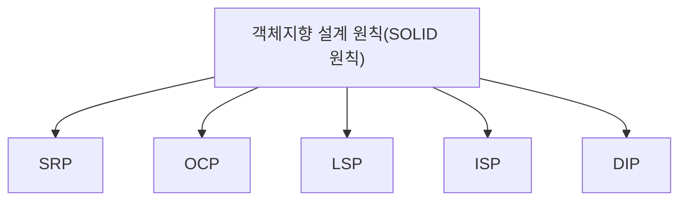

# 038 객체지향 설계 원칙(SOLID 원칙)

작성 기준일: 2026-05-02  
과목: `1과목 소프트웨어 설계`  
기준 PDF: `/Users/nes0903/Documents/study/정보처리기사/핵심요약집_2026_정보처리기사필기핵심요약.pdf`  
PDF 확인 위치: `5페이지`  
검색 보강: 공식/표준/고품질 참고 자료를 함께 확인하여 시험 중심으로 확장 정리

---

## 1. 한 줄 요약

- SOLID는 단일 책임, 개방-폐쇄, 리스코프 치환, 인터페이스 분리, 의존 역전 원칙으로 객체지향 설계를 유연하고 유지보수하기 쉽게 만드는 5대 원칙이다.
- 이 챕터는 `객체지향` 영역에 속한다.
- 시험에서는 정의, 핵심 키워드, 비슷한 개념과의 구분을 함께 묻는 경우가 많다.

---

## 2. PDF 기준 핵심

- SRP: 객체는 단 하나의 책임만 가져야 한다.
- OCP: 기존 코드를 변경하지 않고 기능을 추가할 수 있도록 설계해야 한다.
- LSP: 자식 클래스는 최소한 부모 클래스에서 가능한 행위는 수행할 수 있어야 한다.
- ISP: 자신이 사용하지 않는 인터페이스와 의존 관계를 맺지 않아야 한다.
- DIP: 추상성이 낮은 클래스보다 추상성이 높은 클래스와 의존 관계를 맺어야 한다.

- 위 항목은 PDF에서 직접 확인한 최소 암기 골격이다.
- 세부 설명은 이 골격을 기준으로 확장해서 이해하면 된다.

---

## 3. 개념 설명

- SRP는 변경 이유를 하나로 줄여 응집도를 높인다.
- OCP는 확장에는 열려 있고 수정에는 닫혀 있게 설계한다.
- LSP는 하위 타입이 상위 타입을 대체해도 프로그램이 깨지지 않아야 한다.
- ISP는 큰 인터페이스 하나보다 역할별 작은 인터페이스를 선호한다.
- DIP는 구체 구현보다 추상화에 의존하게 하여 결합도를 낮춘다.
- 객체지향 문제는 클래스, 객체, 인스턴스, 메시지, 캡슐화, 상속, 다형성의 용어 구분에서 자주 나온다.
- 객체지향 설계 원칙은 변경 영향 축소와 재사용성 향상이라는 목적과 연결된다.

---

## 4. 핵심 포인트

- 문제를 풀 때는 먼저 지문 속 단서어를 찾고, 그 단서어가 어떤 개념을 가리키는지 연결한다.
- 정의형 문제는 표현이 조금 바뀌어도 핵심 의미가 같으면 같은 개념으로 판단한다.
- 옳고 그름 문제에서는 `항상`, `반드시`, `전혀`, `모두` 같은 극단 표현을 특히 조심한다.
- 이 챕터는 단독 암기보다 인접 챕터와 비교해 기억하면 정답률이 올라간다.

---

## 5. 시험에서 헷갈리는 비교

| 구분 | 핵심 |
|---|---|
| `SRP` | 하나의 책임 |
| `OCP` | 확장 열림, 수정 닫힘 |
| `LSP` | 부모 자리에 자식 대체 가능 |
| `ISP` | 인터페이스를 작게 분리 |
| `DIP` | 구체보다 추상에 의존 |

- 비교 문제는 이름보다 `역할`, `목적`, `사용 시점`, `장점/단점`을 기준으로 구분하면 안정적이다.

---

## 6. 예시 또는 암기 포인트

- SOLID = `단-개-리-인-의`.

- 암기는 단어만 외우기보다 `정의 -> 특징 -> 예시 -> 반대 개념` 순서로 묶는 것이 좋다.

---

## 7. 빠른 복습

- 챕터명: `038 객체지향 설계 원칙(SOLID 원칙)`
- 소속 영역: `객체지향`
- 자주 나오는 문제 유형:
  - 정의를 주고 개념명을 고르는 문제
  - 특징을 섞어 놓고 옳은/틀린 설명을 고르는 문제
  - 유사 개념과 비교하여 다른 하나를 찾는 문제

---

## 8. 참고 링크

- 기준 PDF: `/Users/nes0903/Documents/study/정보처리기사/핵심요약집_2026_정보처리기사필기핵심요약.pdf`
- [Q-Net 정보처리기사 종목 페이지](https://www.q-net.or.kr/crf005.do?id=crf00503s02&jmCd=1320&jmInfoDivCcd=B0)
- [OMG - Unified Modeling Language](https://www.omg.org/spec/UML/)
- [OMG - What is UML?](https://www.omg.org/uml/what-is-uml.htm)
- [Microsoft - SOLID principles and Dependency Injection](https://learn.microsoft.com/en-us/dotnet/architecture/microservices/microservice-ddd-cqrs-patterns/microservice-application-layer-web-api-design)
