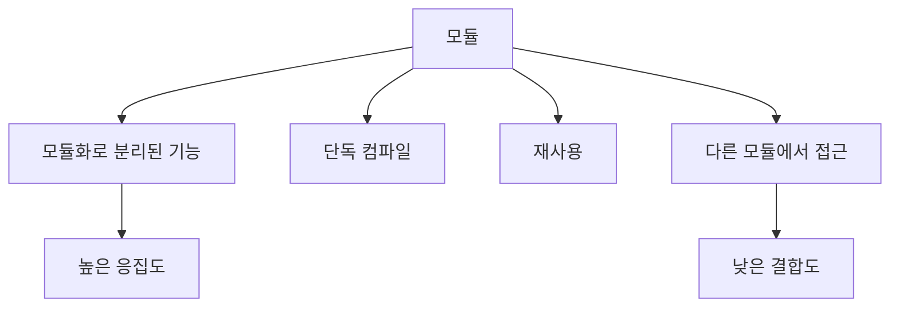
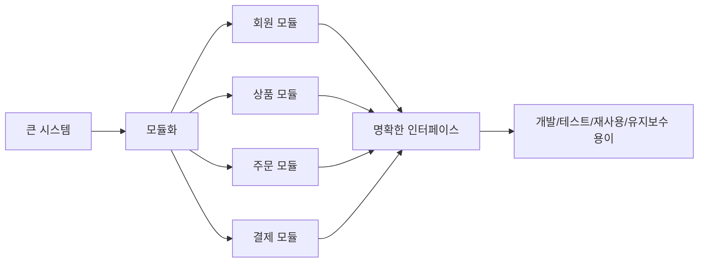
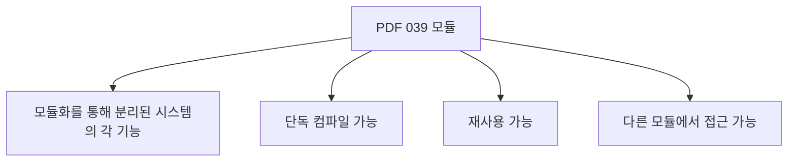
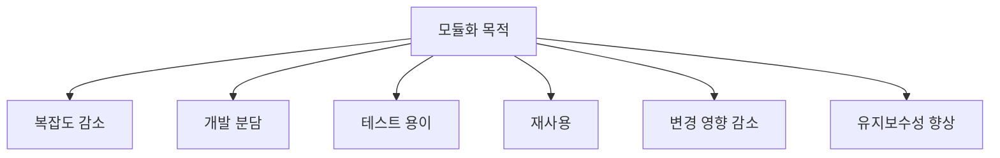
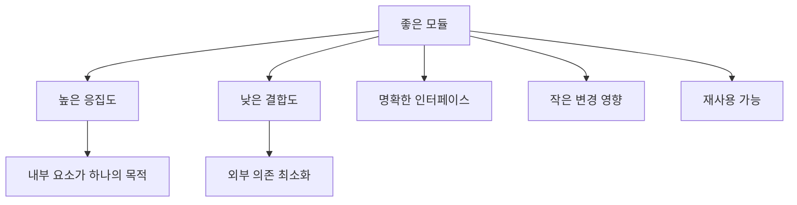
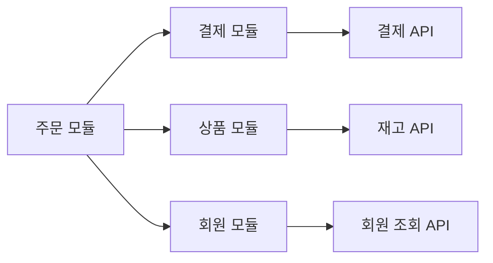
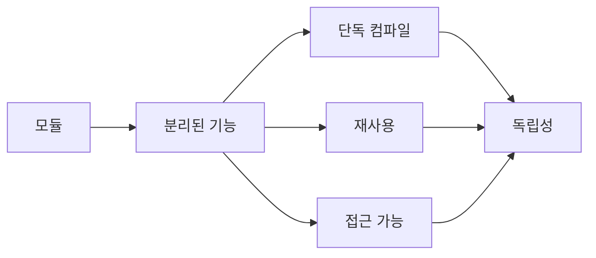

# 039 모듈(Module)

작성 기준일: 2026-05-02
검색/보강일: 2026-06-01
과목: `1과목 소프트웨어 설계`
기준 PDF: `/Users/nes0903/Documents/study/정보처리기사/핵심요약집_2026_정보처리기사필기핵심요약.pdf`
PDF 확인 위치: `6페이지`
주제별 검색 키워드: `software module definition`, `software modularity maintainability ISO 25010`, `independently compiled module reusable software`

---

## 1. 한 줄 요약

- 모듈은 모듈화를 통해 분리된 시스템의 기능 단위이다.
- PDF 기준 핵심 특징은 `단독 컴파일 가능`, `재사용 가능`, `다른 모듈에서 접근 가능`이다.
- 좋은 모듈은 내부 응집도가 높고 외부 결합도가 낮아 변경, 테스트, 유지보수가 쉬운 단위가 된다.

---

## 2. 한눈에 보는 구조

- 모듈은 큰 시스템을 이해 가능한 기능 단위로 나눈 결과이다.
- 모듈 내부는 하나의 목적에 집중해야 하며, 모듈 외부와는 명확한 인터페이스를 통해 연결되어야 한다.
- 모듈의 독립성이 높을수록 변경 영향이 줄고 재사용 가능성이 커진다.
- 모듈을 잘 나누는 기준은 이후 챕터의 `결합도`, `응집도`, `Fan-In/Fan-Out`, `효과적인 모듈 설계 방안`과 직접 연결된다.

---

## 3. PDF 기준 핵심

- 모듈은 `모듈화를 통해 분리된 시스템의 각 기능`이다.
- 모듈은 `단독으로 컴파일`이 가능하다.
- 모듈은 `재사용`할 수 있다.
- 모듈은 `다른 모듈에서의 접근`이 가능하다.

- 위 네 문장이 기준 PDF의 최소 암기 골격이다.
- 특히 `단독 컴파일`, `재사용`, `다른 모듈 접근 가능`은 특징형 보기로 자주 출제될 수 있다.
- 단, `다른 모듈에서 접근 가능`은 내부 구현을 직접 건드린다는 뜻이 아니라, 공개된 인터페이스를 통해 사용할 수 있다는 뜻으로 이해해야 한다.

---

## 4. 검색으로 보강한 관점

- 소프트웨어 공학 자료에서 모듈은 프로그램을 구성하는 독립적인 단위 또는 컴포넌트로 설명된다.
- ISO/IEC 25010 품질 모델의 유지보수성 하위 특성에는 `modularity`가 포함되며, 이는 한 구성요소의 변경이 다른 구성요소에 미치는 영향을 최소화하는 성질과 연결된다.
- Microsoft의 프로그래밍 언어 자료에서도 모듈은 인터페이스와 구현을 나누고, 독립적으로 컴파일될 수 있는 단위로 설명된다.
- 시험 관점에서는 실무 언어의 모듈 시스템 세부 문법보다 다음 연결이 중요하다.
  - 모듈화 -> 시스템 분할
  - 모듈 -> 분리된 기능 단위
  - 좋은 모듈 -> 높은 응집도, 낮은 결합도
  - 인터페이스 -> 모듈 간 접근 경로
  - 정보 은닉 -> 내부 구현 변경 영향 감소

---

## 5. 개념 설명

### 5.1 모듈이란 무엇인가

- 모듈은 시스템을 기능이나 책임 단위로 분해한 구성 요소이다.
- 구현 형태는 언어와 아키텍처에 따라 달라질 수 있다.
  - 함수
  - 클래스
  - 파일
  - 패키지
  - 라이브러리
  - 컴포넌트
  - 서비스
- 정보처리기사 PDF에서는 구현 형태보다 `모듈화를 통해 분리된 시스템의 각 기능`이라는 정의가 우선이다.
- 예를 들어 쇼핑몰 시스템을 `회원 관리`, `상품 관리`, `주문 처리`, `결제 처리`, `배송 관리`로 나누면 각각을 모듈로 볼 수 있다.
- 모듈은 작게 나누는 것이 목적이 아니라, 시스템을 이해하고 변경하고 검증하기 쉬운 단위로 나누는 것이 목적이다.

### 5.2 모듈화의 목적

- 모듈화는 큰 시스템을 여러 작은 기능 단위로 분할하는 활동이다.
- 모듈화를 하면 개발자가 한 번에 이해해야 하는 범위가 줄어든다.
- 기능별로 개발을 나눌 수 있어 병렬 개발이 쉬워진다.
- 모듈 단위 테스트가 가능해져 오류 위치를 찾기 쉬워진다.
- 잘 설계된 모듈은 다른 시스템이나 다른 기능에서도 재사용할 수 있다.
- 특정 모듈 내부가 바뀌어도 외부 인터페이스가 유지되면 다른 모듈의 수정이 줄어든다.

---

## 6. PDF 특징 상세 해설

### 6.1 단독 컴파일 가능

- 단독 컴파일 가능하다는 말은 모듈 단위로 소스 코드를 컴파일하거나 검증할 수 있다는 의미이다.
- 전체 시스템을 매번 모두 컴파일하지 않고도 특정 기능 단위의 오류를 확인할 수 있다.
- 단독 컴파일은 모듈이 외부와 명확한 의존 관계를 갖고 있음을 전제로 한다.
- 단독 컴파일이 가능하면 다음 장점이 있다.
  - 빌드 범위 축소
  - 오류 추적 용이
  - 팀별 개발 분리
  - 변경 영향 분석 용이
- 시험에서는 `단독 컴파일 가능`을 모듈의 대표 특징으로 그대로 외운다.

### 6.2 재사용 가능

- 재사용 가능하다는 말은 기존 모듈을 다른 기능이나 다른 시스템에서 다시 사용할 수 있다는 뜻이다.
- 재사용 가능한 모듈은 보통 다음 특성을 가진다.
  - 기능이 명확하다.
  - 입력과 출력이 분명하다.
  - 특정 화면이나 특정 데이터베이스 구현에 과도하게 묶이지 않는다.
  - 내부 구현을 숨기고 인터페이스를 제공한다.
  - 테스트가 가능하다.
- 예를 들어 인증 모듈, 결제 모듈, 파일 업로드 모듈, 로그 모듈은 여러 시스템에서 재사용될 수 있다.
- 재사용성은 이후 `046 재사용(Reuse)` 챕터와 이어진다.

### 6.3 다른 모듈에서 접근 가능

- 다른 모듈에서 접근 가능하다는 것은 모듈이 외부 사용 지점을 제공한다는 의미이다.
- 이 접근은 일반적으로 공개 함수, 공개 메서드, API, 인터페이스 같은 형태로 제공된다.
- 내부 변수나 내부 자료구조를 마음대로 직접 수정해도 된다는 뜻이 아니다.
- 내부 구현을 직접 열어 두면 결합도가 높아지고 정보 은닉이 깨진다.
- 좋은 접근 방식은 다음과 같다.
  - 외부에는 필요한 기능만 공개한다.
  - 내부 자료구조는 숨긴다.
  - 입력값과 반환값을 명확히 정의한다.
  - 오류 처리 규칙을 문서화한다.
- 시험에서 `다른 모듈에서 접근 가능`과 `정보 은닉`이 같이 나오면, 공개 인터페이스와 내부 구현 은닉을 함께 떠올린다.

---

## 7. 모듈 품질 기준

- 좋은 모듈은 내부 기능들이 하나의 목적을 향해 모여 있어야 한다.
- 이를 `응집도가 높다`고 한다.
- 좋은 모듈은 다른 모듈의 내부 구현에 덜 의존해야 한다.
- 이를 `결합도가 낮다`고 한다.
- 응집도가 낮으면 모듈 안에 관련 없는 기능이 섞여 변경 이유가 많아진다.
- 결합도가 높으면 한 모듈 변경이 다른 모듈까지 연쇄적으로 영향을 준다.
- 따라서 모듈 설계의 기본 방향은 `응집도는 높게`, `결합도는 낮게`이다.

---

## 8. 모듈과 관련 개념 비교

| 구분 | 의미 | 시험 단서 | 모듈과의 관계 |
|---|---|---|---|
| 모듈 | 시스템을 기능 단위로 분리한 구성 요소 | 단독 컴파일, 재사용, 접근 가능 | 기본 개념 |
| 모듈화 | 시스템을 모듈로 나누는 활동 | 분할, 분해, 독립성 | 모듈을 만드는 과정 |
| 인터페이스 | 모듈 외부에 공개되는 사용 방법 | API, 호출 규약, 입출력 | 모듈 간 접근 통로 |
| 정보 은닉 | 내부 절차와 자료를 숨김 | 내부 구현 감춤, 변경 영향 감소 | 모듈 경계를 안정화 |
| 결합도 | 모듈 간 의존 정도 | 낮을수록 좋음 | 외부 연결 품질 |
| 응집도 | 모듈 내부 요소 관련 정도 | 높을수록 좋음 | 내부 구성 품질 |
| 컴포넌트 | 명확한 인터페이스를 가진 재사용/조립 단위 | 배포, 교체, 조립 | 모듈보다 배포 단위 성격이 강할 수 있음 |

- 모듈은 `기능 단위`이고, 인터페이스는 그 기능을 외부에서 사용하는 `접점`이다.
- 정보 은닉은 모듈 내부를 감추어 모듈 경계를 안정적으로 만든다.
- 결합도와 응집도는 모듈 설계 품질을 판단하는 대표 기준이다.

---

## 9. 시험 포인트

- `모듈화를 통해 분리된 시스템의 각 기능`이라는 정의를 그대로 암기한다.
- PDF의 특징 3개를 반드시 연결한다.
  - 단독 컴파일 가능
  - 재사용 가능
  - 다른 모듈에서 접근 가능
- 좋은 모듈 설계 방향은 `결합도 낮게`, `응집도 높게`이다.
- 다른 모듈에서 접근 가능하다는 말은 내부 구현을 직접 공개한다는 뜻이 아니다.
- 모듈은 정보 은닉, 추상화, 캡슐화와 함께 사용될 때 변경에 강해진다.
- 모듈 수가 많다고 항상 좋은 설계는 아니다. 너무 잘게 나누면 모듈 간 호출과 관리 비용이 커질 수 있다.
- 한 모듈이 여러 책임을 가지면 SRP 위반과 낮은 응집도 문제로 이어질 수 있다.

---

## 10. 헷갈리는 비교

| 문제 상황 | 더 가까운 개념 | 이유 |
|---|---|---|
| 시스템을 회원/주문/결제 기능으로 나눔 | 모듈화 | 기능 단위로 분할하는 활동 |
| 결제 기능을 담당하는 독립 단위 | 모듈 | 분리된 시스템 기능 |
| 결제 모듈의 `pay(amount)` 호출 규약 | 인터페이스 | 외부에서 접근하는 방법 |
| 결제 모듈 내부 PG 연동 코드를 숨김 | 정보 은닉 | 내부 자료와 절차를 감춤 |
| 주문 모듈이 결제 모듈 내부 변수까지 직접 수정 | 높은 결합도 | 외부 모듈 내부에 의존 |
| 결제 모듈이 결제 외에 이메일, 통계까지 처리 | 낮은 응집도 | 관련 없는 책임이 섞임 |

- `단독 컴파일`, `재사용`, `접근 가능`이 보이면 모듈의 특징이다.
- `내부 절차와 자료를 숨김`이 보이면 정보 은닉이다.
- `모듈 간 의존 정도`가 보이면 결합도이다.
- `모듈 내부 요소의 관련 정도`가 보이면 응집도이다.

---

## 11. 예시

### 11.1 쇼핑몰 모듈 설계

- `회원 모듈`
  - 회원 가입, 로그인, 회원 정보 조회를 담당한다.
- `상품 모듈`
  - 상품 등록, 상품 조회, 재고 관리를 담당한다.
- `주문 모듈`
  - 주문 생성, 주문 취소, 주문 상태 조회를 담당한다.
- `결제 모듈`
  - 결제 승인, 결제 취소, 결제 결과 조회를 담당한다.
- 주문 모듈이 결제 모듈을 사용할 때는 결제 모듈의 공개 API를 호출해야 한다.
- 주문 모듈이 결제 모듈 내부 테이블 구조나 내부 변수에 직접 의존하면 결합도가 높아진다.

### 11.2 나쁜 모듈 예시

- `CommonUtil`이라는 모듈에 날짜 처리, 결제 처리, 파일 업로드, 메일 발송, 암호화가 모두 들어 있다.
- 이 모듈은 이름만 공통이고 실제 책임이 여러 개라 응집도가 낮다.
- 여러 기능이 이 모듈을 동시에 참조하면 변경 영향이 커지고 테스트도 어려워진다.
- 이런 경우 기능별 모듈로 분리하고 필요한 인터페이스만 공개하는 것이 좋다.

---

## 12. 암기 포인트

- 암기 문장: `모듈은 분리된 기능이고, 단독 컴파일되고, 재사용되며, 다른 모듈에서 접근 가능하다.`
- 품질 암기: `좋은 모듈 = 응집도 높고 결합도 낮다.`
- 함정 방지:
  - 모듈 접근 가능 = 내부 공개가 아니다.
  - 모듈이 작다 = 항상 좋다가 아니다.
  - 재사용 가능 = 아무 문맥에나 무조건 사용 가능하다는 뜻이 아니다.

---

## 13. 빠른 복습

- 모듈은 모듈화를 통해 분리된 시스템의 각 기능이다.
- 모듈은 단독으로 컴파일 가능하다.
- 모듈은 재사용 가능하다.
- 모듈은 다른 모듈에서 접근 가능하다.
- 좋은 모듈은 높은 응집도와 낮은 결합도를 가진다.
- 모듈의 외부 접근은 공개 인터페이스를 통해 이루어져야 한다.
- 모듈은 정보 은닉을 통해 내부 변경의 파급을 줄인다.

---

## 14. 참고 링크

- 기준 PDF: `/Users/nes0903/Documents/study/정보처리기사/핵심요약집_2026_정보처리기사필기핵심요약.pdf`
- [Q-Net - 정보처리기사 종목 정보](https://www.q-net.or.kr/crf005.do?id=crf00503&jmCd=1320)
- [ISO/IEC 25010 품질 모델 - ISO 25000](https://iso25000.com/index.php/en/iso-25000-standards/iso-25010)
- [Microsoft Learn - Overview of modules in C++](https://learn.microsoft.com/en-us/cpp/cpp/modules-cpp)
- [NIST - Dictionary of Algorithms and Data Structures: module](https://xlinux.nist.gov/dads/HTML/module.html)

<!-- study-links:start -->
## 관련 문서

- `효과적인 모듈 설계 방안`: [[정보처리기사/1과목 소프트웨어 설계/047 효과적인 모듈 설계 방안/047 효과적인 모듈 설계 방안|047 효과적인 모듈 설계 방안]]
- `단위 테스트`: [[정보처리기사/2과목 소프트웨어 개발/084 단위 테스트(Unit Test)/084 단위 테스트(Unit Test)|084 단위 테스트(Unit Test)]]
- `정보 은닉`: [[정보처리기사/1과목 소프트웨어 설계/028 정보 은닉/028 정보 은닉|028 정보 은닉]]
- `iec`: [[정보처리기사/1과목 소프트웨어 설계/024 ISO IEC 9126의 품질 특성/024 ISO IEC 9126의 품질 특성|024 ISO/IEC 9126의 품질 특성]]
- `모듈화`: [[정보처리기사/1과목 소프트웨어 설계/026 모듈화/026 모듈화|026 모듈화]]
- `캡슐화`: [[정보처리기사/1과목 소프트웨어 설계/033 캡슐화(Encapsulation)/033 캡슐화(Encapsulation)|033 캡슐화(Encapsulation)]]
<!-- study-links:end -->
