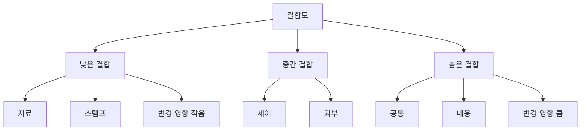
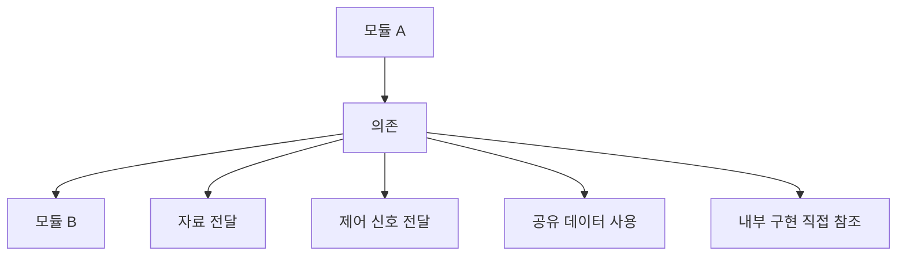
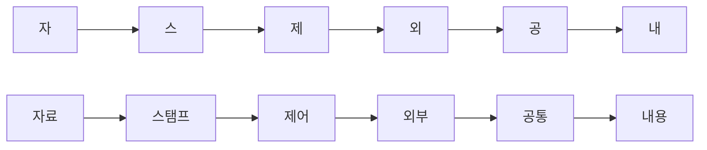

# 040 결합도의 정도(약함 → 강함)

작성 기준일: 2026-05-02
검색/보강일: 2026-06-01
과목: `1과목 소프트웨어 설계`
기준 PDF: `/Users/nes0903/Documents/study/정보처리기사/핵심요약집_2026_정보처리기사필기핵심요약.pdf`
PDF 확인 위치: `6페이지`
주제별 검색 키워드: `module coupling types data stamp control external common content`, `software engineering coupling low high`, `low coupling high cohesion`

---

## 1. 한 줄 요약

- 결합도는 모듈과 모듈 사이의 의존 정도이며, 일반적으로 낮을수록 좋은 설계이다.
- PDF 기준 `약함 -> 강함` 순서는 `자료 -> 스탬프 -> 제어 -> 외부 -> 공통 -> 내용`이다.
- 시험에서는 `가장 약한 결합도`, `가장 강한 결합도`, `순서상 앞/뒤`를 묻는 문제가 특히 중요하다.

---

## 2. 한눈에 보는 구조

- 결합도는 모듈 간 연결의 강도를 나타낸다.
- 낮은 결합도는 모듈이 서로 필요한 정보만 주고받는 상태에 가깝다.
- 높은 결합도는 모듈이 공통 데이터, 외부 형식, 내부 구현에 깊게 의존하는 상태에 가깝다.
- 좋은 모듈 설계의 방향은 `낮은 결합도`와 `높은 응집도`이다.
- 이 챕터는 결합도 유형별 상세 정의보다 `약함에서 강함으로의 순서`가 핵심이다.

---

## 3. PDF 기준 핵심

- 결합도의 정도는 약한 것부터 강한 것까지 다음 순서이다.
  - `자료 결합도`
  - `스탬프 결합도`
  - `제어 결합도`
  - `외부 결합도`
  - `공통 결합도`
  - `내용 결합도`
- 기준 PDF에서는 이 순서를 `약함 -> 강함`으로 제시한다.
- 따라서 시험에서 `결합도가 낮은 순서`, `결합도가 강한 순서`, `가장 바람직한 결합`, `가장 나쁜 결합`을 묻는 문제에 바로 적용한다.

---

## 4. 검색으로 보강한 관점

- 소프트웨어 공학 자료에서 결합도는 모듈 간 상호 의존성의 정도로 설명된다.
- Microsoft 코드 메트릭 문서에서도 좋은 설계는 높은 응집도와 낮은 결합도를 지향한다고 설명한다.
- SEI의 소프트웨어 설계 자료에서도 모듈성, 응집도, 결합도는 설계 품질을 설명하는 핵심 축으로 다뤄진다.
- 전통적인 구조적 설계 관점에서 결합도 유형은 대체로 `data`, `stamp`, `control`, `external`, `common`, `content`로 설명된다.
- 정보처리기사에서는 영어 이름보다 한국어 순서인 `자료-스탬프-제어-외부-공통-내용`을 우선 암기한다.

---

## 5. 결합도란 무엇인가

- 결합도는 한 모듈이 다른 모듈에 얼마나 의존하는지를 나타내는 척도이다.
- 결합도가 낮으면 모듈 하나를 수정해도 다른 모듈에 미치는 영향이 작다.
- 결합도가 높으면 모듈 하나의 내부 변경이 다른 모듈 오류로 이어질 가능성이 커진다.
- 결합도는 모듈 간 호출 자체를 나쁘다고 말하는 개념이 아니다.
- 시스템은 모듈끼리 협력해야 하므로 연결은 필요하다.
- 중요한 것은 `어떤 방식으로 연결되는가`이다.
- 필요한 자료만 명확히 주고받으면 낮은 결합이고, 내부 구현이나 전역 데이터에 기대면 높은 결합이다.

---

## 6. 약함에서 강함까지 전체 순서

| 순서 | 결합도 | 영어 표현 | 강도 | 핵심 단서 | 시험 판단 |
|---:|---|---|---|---|---|
| 1 | 자료 결합도 | Data Coupling | 가장 약함 | 필요한 자료만 매개변수로 전달 | 가장 바람직 |
| 2 | 스탬프 결합도 | Stamp Coupling | 약함 | 레코드, 배열, 객체 등 자료구조 전달 | 자료보다 강함 |
| 3 | 제어 결합도 | Control Coupling | 중간 | 플래그, 제어 신호, 처리 방향 지시 | 상대 모듈 흐름 제어 |
| 4 | 외부 결합도 | External Coupling | 중간~강함 | 외부 형식, 프로토콜, 장치, 파일 형식 공유 | 외부 요인에 함께 의존 |
| 5 | 공통 결합도 | Common Coupling | 강함 | 전역 변수, 공통 데이터 영역 공유 | 공유 데이터 변경 파급 |
| 6 | 내용 결합도 | Content Coupling | 가장 강함 | 다른 모듈 내부 자료/코드 직접 참조 | 가장 나쁨 |

- 순서 암기는 반드시 `약함 -> 강함`으로 한다.
- 강한 결합일수록 모듈 독립성이 낮아지고 변경 파급이 커진다.
- 자료 결합도는 필요한 값만 전달하기 때문에 가장 약하다.
- 내용 결합도는 다른 모듈의 내부를 직접 건드리기 때문에 가장 강하다.
- 공통 결합도와 내용 결합도는 강한 결합으로 묶어 기억한다.

---

## 7. 각 결합도의 직관적 이해

### 7.1 자료 결합도

- 모듈 사이에 필요한 자료 요소만 전달한다.
- 예를 들어 `calculateTotal(price, quantity)`처럼 가격과 수량만 넘긴다.
- 상대 모듈의 내부 구조나 제어 흐름을 알 필요가 적다.
- 가장 약하고 바람직한 결합도로 시험에서 자주 언급된다.

### 7.2 스탬프 결합도

- 모듈 사이에 자료구조 전체를 전달한다.
- 예를 들어 총액 계산에 필요한 값은 가격과 수량뿐인데 `Order` 객체 전체를 넘기는 경우이다.
- 호출받는 모듈이 자료구조의 일부만 사용하더라도 전체 구조에 의존하게 된다.
- 자료 결합도보다 더 강하다.

### 7.3 제어 결합도

- 한 모듈이 다른 모듈의 처리 흐름을 제어하는 값을 전달한다.
- 예를 들어 `process(order, true)`에서 `true`가 환불 처리인지 결제 처리인지 결정한다면 제어 결합도에 가깝다.
- `플래그`, `제어 신호`, `처리 방향 결정`이 핵심 단서이다.
- 단순 데이터 전달보다 상대 모듈의 내부 분기와 결합되므로 결합도가 더 강하다.

### 7.4 외부 결합도

- 여러 모듈이 외부에서 정해진 데이터 형식, 통신 프로토콜, 장치 인터페이스 등에 함께 의존한다.
- 예를 들어 두 모듈이 같은 외부 파일 형식이나 통신 메시지 형식에 의존하면 외부 결합도가 생긴다.
- 외부 형식이 바뀌면 관련 모듈이 함께 영향을 받을 수 있다.
- `외부 변수`, `외부 장치`, `외부 포맷`, `프로토콜`이 단서이다.

### 7.5 공통 결합도

- 여러 모듈이 공통 데이터 영역을 공유한다.
- 대표 예시는 전역 변수, 공용 테이블, 공유 메모리이다.
- 한 모듈이 공통 데이터를 변경하면 다른 모듈이 예상하지 못한 영향을 받을 수 있다.
- `공통 데이터`, `전역 변수`, `공유 영역`이 나오면 공통 결합도이다.

### 7.6 내용 결합도

- 한 모듈이 다른 모듈의 내부 자료나 내부 코드를 직접 참조하거나 수정한다.
- 다른 모듈의 내부 로직으로 직접 분기하거나, 내부 변수에 직접 접근하는 경우가 해당된다.
- 내부 구현이 바뀌면 의존한 모듈이 바로 깨질 가능성이 크다.
- 가장 강하고 가장 피해야 하는 결합도이다.

---

## 8. 순서 암기

- 암기어: `자스제외공내`
- 풀어 쓰기:
  - `자`: 자료 결합도
  - `스`: 스탬프 결합도
  - `제`: 제어 결합도
  - `외`: 외부 결합도
  - `공`: 공통 결합도
  - `내`: 내용 결합도
- 의미 암기:
  - 처음은 `필요한 자료만 전달`
  - 중간은 `구조나 제어, 외부 조건 공유`
  - 끝은 `공유 데이터와 내부 구현 직접 의존`
- 역순으로 물으면 `내용 -> 공통 -> 외부 -> 제어 -> 스탬프 -> 자료`가 강함에서 약함이다.

---

## 9. 시험 포인트

- 결합도는 낮을수록 좋다.
- 순서 암기: `자료 -> 스탬프 -> 제어 -> 외부 -> 공통 -> 내용`.
- 가장 약한 결합도는 `자료 결합도`이다.
- 가장 강한 결합도는 `내용 결합도`이다.
- `공통 결합도`는 전역 데이터나 공통 데이터 영역 공유가 단서이다.
- `제어 결합도`는 플래그나 제어 신호로 상대 모듈의 동작을 결정하는 것이 단서이다.
- `스탬프 결합도`는 자료구조 전체 전달이 단서이다.
- `외부 결합도`는 외부 형식, 프로토콜, 장치 등 외부 요소 공유가 단서이다.
- `응집도`는 높을수록 좋고, `결합도`는 낮을수록 좋다는 방향을 반드시 구분한다.

---

## 10. 헷갈리는 비교

| 헷갈리는 쌍 | 구분 기준 |
|---|---|
| 자료 vs 스탬프 | 자료는 필요한 값만 전달, 스탬프는 자료구조 전체 전달 |
| 스탬프 vs 공통 | 스탬프는 자료구조를 인수로 전달, 공통은 공통 데이터 영역을 공유 |
| 제어 vs 자료 | 제어는 상대 모듈의 흐름을 결정하는 값, 자료는 계산에 필요한 값 |
| 외부 vs 공통 | 외부는 외부 형식/장치/프로토콜 의존, 공통은 내부 공통 데이터 영역 공유 |
| 공통 vs 내용 | 공통은 공유 데이터 영역 사용, 내용은 다른 모듈 내부 자체를 직접 참조 |

- `객체 전체를 넘김`은 스탬프 결합도에 가깝다.
- `전역 변수 공유`는 공통 결합도에 가깝다.
- `다른 모듈 내부 변수 직접 수정`은 내용 결합도에 가깝다.
- `파일 포맷이나 통신 프로토콜을 함께 맞춰야 함`은 외부 결합도에 가깝다.
- `옵션 플래그로 상대 모듈 분기 결정`은 제어 결합도에 가깝다.

---

## 11. 예시로 판단하기

| 예시 | 결합도 | 이유 |
|---|---|---|
| `sum(price, count)`처럼 필요한 값만 전달 | 자료 결합도 | 단순 자료 요소만 전달 |
| `calculate(order)`처럼 주문 객체 전체를 넘기고 일부 필드만 사용 | 스탬프 결합도 | 자료구조 전체 전달 |
| `printReport(data, mode)`에서 `mode`가 출력 방식 결정 | 제어 결합도 | 제어 정보 전달 |
| 여러 모듈이 특정 카드사 전문 형식에 의존 | 외부 결합도 | 외부 형식 공유 |
| 여러 모듈이 `globalConfig`를 직접 읽고 씀 | 공통 결합도 | 공통 데이터 공유 |
| A 모듈이 B 모듈 내부 배열 인덱스를 직접 수정 | 내용 결합도 | 다른 모듈 내부 참조 |

---

## 12. 암기 포인트

- `자스제외공내`를 먼저 외운다.
- `자`가 가장 좋고 `내`가 가장 나쁘다.
- 결합도는 낮을수록 좋다.
- 응집도는 높을수록 좋다.
- 결합도와 응집도를 같이 묻는 문제에서는 방향을 바꾸어 출제하는 함정을 조심한다.
- `강한 결합도 순서`를 물으면 암기어를 거꾸로 읽는다.
- `가장 바람직한 결합도`는 자료 결합도이다.
- `가장 피해야 할 결합도`는 내용 결합도이다.

---

## 13. 빠른 복습

- 결합도는 모듈 간 의존 정도이다.
- 결합도는 낮을수록 좋다.
- PDF 기준 약함에서 강함 순서는 `자료 -> 스탬프 -> 제어 -> 외부 -> 공통 -> 내용`이다.
- 자료 결합도는 필요한 자료만 전달하므로 가장 약하다.
- 내용 결합도는 다른 모듈 내부를 직접 참조하므로 가장 강하다.
- `자스제외공내`를 순서 문제의 기본 암기어로 사용한다.

---

## 14. 참고 링크

- 기준 PDF: `/Users/nes0903/Documents/study/정보처리기사/핵심요약집_2026_정보처리기사필기핵심요약.pdf`
- [Q-Net - 정보처리기사 종목 정보](https://www.q-net.or.kr/crf005.do?id=crf00503&jmCd=1320)
- [Microsoft Learn - Code metrics: Class coupling](https://learn.microsoft.com/en-us/visualstudio/code-quality/code-metrics-class-coupling)
- [Microsoft Learn - Design for evolution](https://learn.microsoft.com/en-us/azure/architecture/guide/design-principles/design-for-evolution)
- [SEI - Introduction to Software Design](https://www.sei.cmu.edu/documents/1539/1989_007_001_15689.pdf)
- [Coupling.dev - Module Coupling](https://coupling.dev/posts/related-topics/module-coupling/)

<!-- study-links:start -->
## 관련 문서

- `흐름 제어`: [[정보처리기사/5과목 정보시스템 구축 관리/267 흐름 제어 - 정지-대기(Stop-and-Wait)/267 흐름 제어 - 정지-대기(Stop-and-Wait)|267 흐름 제어 - 정지-대기(Stop-and-Wait)]]
<!-- study-links:end -->
