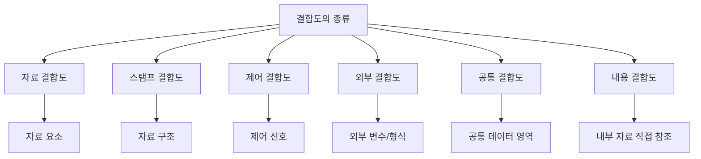
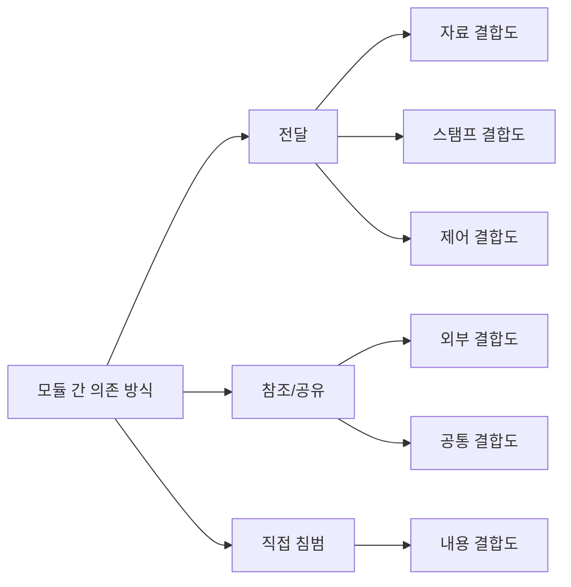
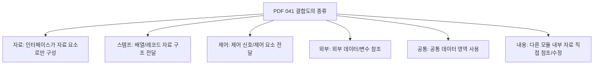
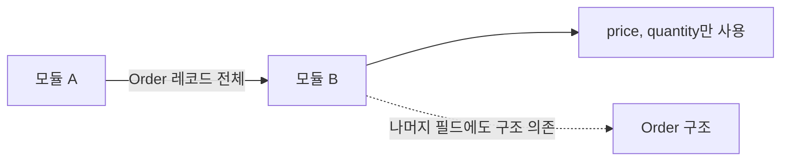
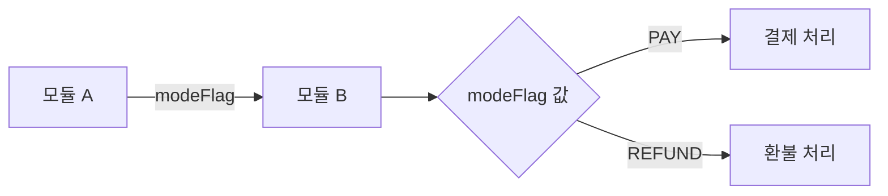
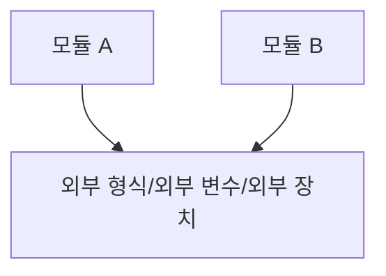
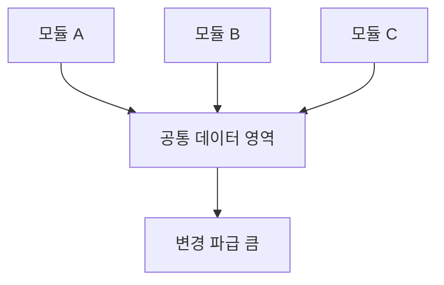
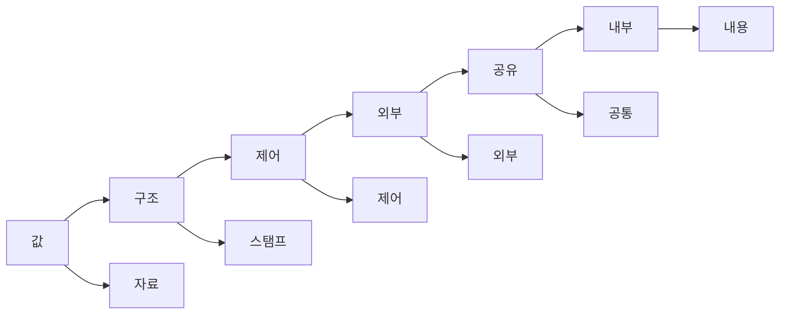

# 041 결합도의 종류

작성 기준일: 2026-05-02
검색/보강일: 2026-06-01
과목: `1과목 소프트웨어 설계`
기준 PDF: `/Users/nes0903/Documents/study/정보처리기사/핵심요약집_2026_정보처리기사필기핵심요약.pdf`
PDF 확인 위치: `6페이지`
주제별 검색 키워드: `data stamp control external common content coupling`, `module coupling types definitions`, `software engineering coupling examples`

---

## 1. 한 줄 요약

- 결합도의 종류는 모듈이 서로 의존하는 방식에 따라 `자료`, `스탬프`, `제어`, `외부`, `공통`, `내용`으로 구분한다.
- PDF 기준 정의는 각 결합도의 단서어를 정확히 잡는 것이 핵심이다.
- 시험에서는 `배열/레코드`, `제어 신호`, `외부 변수`, `공통 데이터 영역`, `내부 자료 직접 참조` 같은 단서어로 결합도를 고르게 한다.

---

## 2. 한눈에 보는 구조

- `자료`, `스탬프`, `제어`는 주로 모듈 간에 무엇을 전달하느냐로 구분한다.
- `외부`, `공통`은 여러 모듈이 어떤 외부/공유 대상을 함께 참조하느냐로 구분한다.
- `내용`은 다른 모듈의 내부 구현을 직접 참조하거나 수정하므로 가장 위험한 결합이다.
- 040에서 외운 순서와 연결하면 `자료 -> 스탬프 -> 제어 -> 외부 -> 공통 -> 내용` 순으로 결합도가 강해진다.

---

## 3. PDF 기준 핵심

- `자료(Data) 결합도`
  - 모듈 간의 인터페이스가 자료 요소로만 구성될 때의 결합도이다.
- `스탬프(Stamp) 결합도`
  - 배열이나 레코드 등의 자료 구조가 전달될 때의 결합도이다.
- `제어(Control) 결합도`
  - 제어 신호를 이용하여 통신하거나 제어 요소를 전달하는 결합도이다.
- `외부(External) 결합도`
  - 데이터(변수)를 외부의 다른 모듈에서 참조할 때의 결합도이다.
- `공통(Common) 결합도`
  - 공유되는 공통 데이터 영역을 여러 모듈이 사용할 때의 결합도이다.
- `내용(Content) 결합도`
  - 다른 모듈의 내부 자료를 직접 참조하거나 수정할 때의 결합도이다.

- 위 정의가 기준 PDF에서 확인해야 하는 원문 골격이다.
- 041은 040보다 정의형 문제가 더 중요하다.
- 보기에서 정의의 단서어만 바꿔 놓아도 정답이 달라지므로 단서어를 함께 암기해야 한다.

---

## 4. 검색으로 보강한 관점

- 소프트웨어 공학 자료에서는 결합도를 모듈 간 상호 의존성의 강도로 설명한다.
- 전통적인 모듈 결합도 분류에서는 데이터 전달 방식, 자료구조 전달, 제어 정보 전달, 외부 형식 의존, 공통 데이터 공유, 내부 구현 참조가 강도 차이를 만든다.
- Microsoft의 코드 결합도 설명은 클래스가 매개변수, 반환 타입, 메서드 호출, 상속, 필드 등 여러 경로로 외부 타입에 의존할 수 있음을 보여 준다.
- 시험에서는 현대 언어의 클래스 결합도 세부 지표보다 PDF의 여섯 결합도 이름과 정의를 우선한다.

---

## 5. 결합도 종류 전체 표

| 결합도 | PDF 단서 | 직관적 의미 | 위험 포인트 | 강도 |
|---|---|---|---|---|
| 자료 결합도 | 자료 요소로만 인터페이스 구성 | 필요한 값만 전달 | 비교적 안전하지만 매개변수 의미는 명확해야 함 | 가장 약함 |
| 스탬프 결합도 | 배열/레코드 등 자료 구조 전달 | 구조체, 객체, 레코드를 통째로 전달 | 필요한 것보다 많은 구조에 의존 | 약함 |
| 제어 결합도 | 제어 신호, 제어 요소 전달 | 플래그로 상대 모듈 동작 지시 | 호출자가 피호출자의 내부 흐름을 알아야 함 | 중간 |
| 외부 결합도 | 외부 데이터/변수 참조 | 외부 형식, 장치, 프로토콜 의존 | 외부 조건 변경 시 관련 모듈 영향 | 중간~강함 |
| 공통 결합도 | 공통 데이터 영역 사용 | 전역 변수, 공유 메모리 사용 | 한 모듈 변경이 여러 모듈에 전파 | 강함 |
| 내용 결합도 | 내부 자료 직접 참조/수정 | 다른 모듈 내부 구현 침범 | 내부 구현 변경 시 즉시 깨짐 | 가장 강함 |

- 이 표에서 시험 단서는 PDF 단서를 우선한다.
- `외부 결합도`는 교재마다 외부 장치, 외부 형식, 외부 프로토콜까지 넓게 설명될 수 있지만, PDF에서는 `데이터(변수)를 외부의 다른 모듈에서 참조`로 제시한다.
- 따라서 정보처리기사 답안 판단에서는 PDF의 `외부 변수 참조` 표현을 특히 기억한다.

---

## 6. 자료 결합도

- 자료 결합도는 모듈 간 인터페이스가 자료 요소로만 구성되는 경우이다.
- 필요한 값만 매개변수로 전달하고, 상대 모듈의 내부 구조를 알 필요가 적다.
- 예시는 다음과 같다.
  - `calculateTotal(price, quantity)`
  - `findUser(userId)`
  - `sendEmail(address, subject, body)`
- 자료 결합도는 여섯 결합도 중 가장 약하고 바람직한 결합도이다.
- 단, 매개변수가 너무 많거나 의미가 불명확하면 설계가 복잡해질 수 있으므로 실제 설계에서는 명확한 인터페이스가 함께 필요하다.

### 시험 단서

- 자료 요소
- 필요한 값
- 단순 매개변수
- 인터페이스가 자료로만 구성
- 가장 약한 결합도

---

## 7. 스탬프 결합도

- 스탬프 결합도는 배열이나 레코드 같은 자료 구조가 모듈 간에 전달될 때의 결합도이다.
- 전달받은 모듈이 자료구조 전체 중 일부만 사용하더라도 전체 구조를 알아야 한다.
- 예시는 다음과 같다.
  - 주문 총액 계산에 `Order` 전체 객체를 전달하지만 실제로는 `price`, `quantity`만 사용한다.
  - 이름 출력 기능에 `UserRecord` 전체를 전달하지만 실제로는 `name`만 사용한다.
  - 특정 필드만 필요한데 배열 전체를 전달한다.
- 자료 결합도보다 결합도가 강한 이유는, 전달되는 구조가 바뀌면 일부 필드만 쓰는 모듈도 영향을 받을 수 있기 때문이다.

### 시험 단서

- 배열
- 레코드
- 자료 구조
- 구조체 전체 전달
- 일부만 사용하지만 전체를 넘김

---

## 8. 제어 결합도

- 제어 결합도는 제어 신호나 제어 요소를 전달하여 상대 모듈의 처리 흐름을 결정하게 하는 결합도이다.
- 대표 단서는 `플래그`, `모드 값`, `제어 신호`, `명령값`이다.
- 예시는 다음과 같다.
  - `processOrder(order, "PAY")`
  - `printReport(data, summaryFlag)`
  - `handleRequest(request, mode)`
- 제어 결합도가 문제가 되는 이유는 호출하는 모듈이 호출받는 모듈의 내부 분기 구조를 알아야 하기 때문이다.
- 플래그 값이 추가되거나 의미가 바뀌면 호출하는 쪽도 함께 수정될 가능성이 커진다.

### 시험 단서

- 제어 신호
- 제어 요소
- 플래그
- 처리 방향 지시
- 상대 모듈의 흐름 결정

---

## 9. 외부 결합도

- 외부 결합도는 데이터나 변수를 외부의 다른 모듈에서 참조할 때의 결합도이다.
- 넓게는 여러 모듈이 외부 파일 형식, 통신 프로토콜, 장치 인터페이스, 외부 데이터 포맷에 함께 의존하는 경우도 외부 결합으로 설명된다.
- 예시는 다음과 같다.
  - 여러 모듈이 외부 시스템의 특정 전문 형식에 맞춰 데이터를 읽고 쓴다.
  - 여러 모듈이 같은 외부 장치 제어 규약에 의존한다.
  - 외부에 선언된 데이터 형식을 여러 모듈이 동시에 참조한다.
- 외부 대상이 바뀌면 해당 외부 대상에 의존하는 모듈이 함께 수정되어야 할 수 있다.

### 시험 단서

- 외부 변수
- 외부 데이터
- 외부 장치
- 외부 형식
- 프로토콜
- 외부의 다른 모듈에서 참조

---

## 10. 공통 결합도

- 공통 결합도는 공유되는 공통 데이터 영역을 여러 모듈이 사용할 때의 결합도이다.
- 대표 예시는 전역 변수, 공유 메모리, 공용 테이블, 공통 데이터 블록이다.
- 예시는 다음과 같다.
  - 여러 모듈이 `globalUserState`를 직접 읽고 쓴다.
  - 여러 기능이 같은 공유 메모리 영역을 직접 수정한다.
  - 공통 설정 객체를 여러 모듈이 제한 없이 변경한다.
- 한 모듈이 공통 데이터를 수정하면 다른 모듈이 예상하지 못한 영향을 받을 수 있다.
- 공통 결합도는 내용 결합도 다음으로 강한 결합에 속한다.

### 시험 단서

- 공통 데이터 영역
- 공유 데이터
- 전역 변수
- 공유 메모리
- 여러 모듈이 함께 사용

---

## 11. 내용 결합도

- 내용 결합도는 다른 모듈의 내부 자료를 직접 참조하거나 수정할 때의 결합도이다.
- 모듈의 공개 인터페이스를 통하지 않고 내부 구현에 직접 접근한다.
- 예시는 다음과 같다.
  - A 모듈이 B 모듈의 내부 배열을 직접 수정한다.
  - A 모듈이 B 모듈의 내부 변수 이름을 알고 직접 접근한다.
  - A 모듈이 B 모듈의 특정 코드 위치나 내부 분기 구조에 의존한다.
- 내용 결합도는 여섯 결합도 중 가장 강하고 가장 나쁜 결합도이다.
- 내용 결합도가 있으면 B 모듈 내부 구현을 조금만 바꿔도 A 모듈이 깨질 수 있다.

### 시험 단서

- 내부 자료 직접 참조
- 내부 자료 직접 수정
- 내부 코드 참조
- 공개 인터페이스 우회
- 가장 강한 결합도

---

## 12. 시험 포인트 - 헷갈리는 비교

| 헷갈리는 항목 | 오답을 가르는 질문 | 정답 판단 |
|---|---|---|
| 자료 vs 스탬프 | 필요한 값만 넘겼는가, 자료구조 전체를 넘겼는가 | 값만 넘기면 자료, 구조 전체면 스탬프 |
| 스탬프 vs 공통 | 자료구조를 인수로 전달했는가, 공통 영역을 공유했는가 | 인수 전달이면 스탬프, 공유 영역이면 공통 |
| 자료 vs 제어 | 전달 값이 계산 자료인가, 처리 방향을 결정하는가 | 계산 자료면 자료, 흐름 결정이면 제어 |
| 외부 vs 공통 | 외부 대상에 의존하는가, 시스템 내부 공통 영역을 공유하는가 | 외부 형식/변수면 외부, 공통 데이터 영역이면 공통 |
| 공통 vs 내용 | 공유 데이터를 같이 쓰는가, 다른 모듈 내부를 직접 건드리는가 | 공유 영역이면 공통, 내부 침범이면 내용 |

- `자료구조`라는 말만 보고 공통 결합도로 가지 않는다. 인수로 자료구조를 전달하면 스탬프 결합도이다.
- `공유`라는 말이 나오면 무엇을 공유하는지 확인한다. 공통 데이터 영역이면 공통 결합도이다.
- `외부`라는 말이 나오면 외부 변수, 외부 형식, 외부 장치, 외부 프로토콜 같은 단서를 본다.
- `내부 자료 직접 참조/수정`은 거의 항상 내용 결합도 단서이다.

---

## 13. 문제 풀이용 단서표

| 단서어 | 결합도 |
|---|---|
| 자료 요소, 필요한 값, 매개변수 | 자료 결합도 |
| 배열, 레코드, 자료 구조, 구조체 | 스탬프 결합도 |
| 제어 신호, 제어 요소, 플래그, 모드 | 제어 결합도 |
| 외부 변수, 외부 데이터, 외부 장치, 외부 형식 | 외부 결합도 |
| 공통 데이터 영역, 전역 변수, 공유 메모리 | 공통 결합도 |
| 내부 자료 직접 참조, 내부 자료 수정, 내부 코드 침범 | 내용 결합도 |

- 이 표는 객관식 문제에서 가장 빠르게 적용하는 표이다.
- 정의를 모두 읽기 전에 단서어를 먼저 잡으면 선택지를 줄일 수 있다.

---

## 14. 암기 포인트

- 암기어: `자스제외공내`
- 의미 암기:
  - `자`: 자료 요소
  - `스`: 자료 구조
  - `제`: 제어 신호
  - `외`: 외부 변수
  - `공`: 공통 데이터 영역
  - `내`: 내부 자료 직접 참조
- 좋은 설계 방향:
  - 자료 결합도에 가깝게
  - 내용 결합도는 피하기
  - 공통 데이터 공유를 줄이기
  - 인터페이스를 명확하게 만들기

---

## 15. 빠른 복습

- 결합도 종류는 `자료`, `스탬프`, `제어`, `외부`, `공통`, `내용`이다.
- 자료 결합도는 자료 요소로만 인터페이스가 구성된다.
- 스탬프 결합도는 배열이나 레코드 같은 자료 구조가 전달된다.
- 제어 결합도는 제어 신호나 제어 요소가 전달된다.
- 외부 결합도는 외부 데이터나 변수를 다른 모듈에서 참조한다.
- 공통 결합도는 공통 데이터 영역을 여러 모듈이 사용한다.
- 내용 결합도는 다른 모듈 내부 자료를 직접 참조하거나 수정한다.
- 약함에서 강함 순서는 `자료 -> 스탬프 -> 제어 -> 외부 -> 공통 -> 내용`이다.

---

## 16. 참고 링크

- 기준 PDF: `/Users/nes0903/Documents/study/정보처리기사/핵심요약집_2026_정보처리기사필기핵심요약.pdf`
- [Q-Net - 정보처리기사 종목 정보](https://www.q-net.or.kr/crf005.do?id=crf00503&jmCd=1320)
- [Microsoft Learn - Code metrics: Class coupling](https://learn.microsoft.com/en-us/visualstudio/code-quality/code-metrics-class-coupling)
- [SEI - Introduction to Software Design](https://www.sei.cmu.edu/documents/1539/1989_007_001_15689.pdf)
- [Coupling.dev - Module Coupling](https://coupling.dev/posts/related-topics/module-coupling/)
- [GeeksforGeeks - Module Coupling and its Types](https://www.geeksforgeeks.org/software-engineering/module-coupling-and-its-types/)

<!-- study-links:start -->
## 관련 문서

- `상속`: [[정보처리기사/1과목 소프트웨어 설계/034 상속(Inheritance)/034 상속(Inheritance)|034 상속(Inheritance)]]
<!-- study-links:end -->
