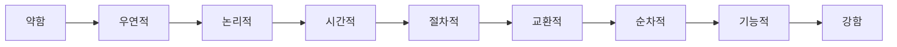
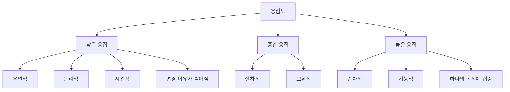
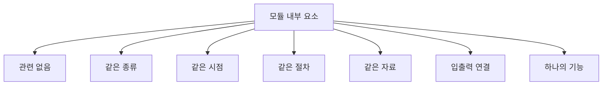
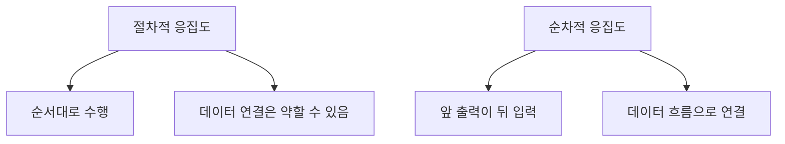
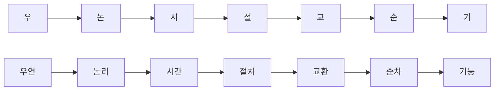

# 042 응집도의 정도(약함 → 강함)

작성 기준일: 2026-05-02
검색/보강일: 2026-06-01
과목: `1과목 소프트웨어 설계`
기준 PDF: `/Users/nes0903/Documents/study/정보처리기사/핵심요약집_2026_정보처리기사필기핵심요약.pdf`
PDF 확인 위치: `6페이지`
주제별 검색 키워드: `cohesion types coincidental logical temporal procedural communicational sequential functional`, `module cohesion weak strong`, `software engineering cohesion examples`

---

## 1. 한 줄 요약

- 응집도는 한 모듈 내부 요소들이 하나의 목적에 얼마나 밀접하게 관련되는지를 나타내며, 높을수록 좋은 설계이다.
- PDF 기준 `약함 -> 강함` 순서는 `우연적 -> 논리적 -> 시간적 -> 절차적 -> 교환적 -> 순차적 -> 기능적`이다.
- 시험에서는 결합도와 반대로 `응집도는 강할수록 좋다`는 방향을 반드시 구분해야 한다.

---

## 2. 한눈에 보는 구조

- 응집도는 모듈 내부의 관련성을 보는 척도이다.
- 응집도가 낮으면 관련 없는 기능이 한 모듈에 섞여 변경 이유가 많아진다.
- 응집도가 높으면 모듈이 하나의 목적에 집중하여 이해, 수정, 테스트, 재사용이 쉬워진다.
- 좋은 모듈 설계는 `높은 응집도`와 `낮은 결합도`를 동시에 지향한다.

---

## 3. PDF 기준 핵심

- 응집도의 정도는 약한 것부터 강한 것까지 다음 순서이다.
  - `우연적 응집도`
  - `논리적 응집도`
  - `시간적 응집도`
  - `절차적 응집도`
  - `교환적 응집도`
  - `순차적 응집도`
  - `기능적 응집도`
- 기준 PDF에서는 이 순서를 `약함 -> 강함`으로 제시한다.
- 시험에서는 `가장 낮은 응집도`, `가장 높은 응집도`, `응집도 순서`, `바람직한 응집도`를 이 순서로 판단한다.

---

## 4. 검색으로 보강한 관점

- 소프트웨어 공학 자료에서 응집도는 모듈 내부 요소들이 서로 얼마나 관련되어 있는지를 나타내는 개념으로 설명된다.
- 전통적인 응집도 분류는 `coincidental`, `logical`, `temporal`, `procedural`, `communicational`, `sequential`, `functional` 순서로 강해지는 구조를 가진다.
- Microsoft의 코드 품질 자료에서도 좋은 설계의 일반 원칙으로 높은 응집도와 낮은 결합도를 함께 강조한다.
- 여러 자료에서는 `communicational cohesion`이라고 표현하지만, 정보처리기사 PDF에서는 `교환적 응집도`로 제시하므로 시험에서는 `교환적` 표현을 우선한다.

---

## 5. 응집도란 무엇인가

- 응집도는 모듈 내부에 들어 있는 함수, 데이터, 처리 절차가 얼마나 같은 목적을 향해 모여 있는지 나타낸다.
- 응집도가 높은 모듈은 이름만 봐도 역할이 분명하다.
- 응집도가 낮은 모듈은 여러 이유로 변경되어야 해서 유지보수가 어렵다.
- 예를 들어 `OrderTotalCalculator`가 주문 총액 계산만 담당하면 응집도가 높다.
- 반대로 `CommonUtility`가 날짜 처리, 파일 처리, 주문 계산, 이메일 발송을 모두 처리하면 응집도가 낮다.
- 응집도는 결합도와 함께 모듈 설계 품질을 판단하는 핵심 기준이다.

---

## 6. 약함에서 강함까지 전체 순서

| 순서 | 응집도 | 영어 표현 | 강도 | 핵심 단서 | 설계 평가 |
|---:|---|---|---|---|---|
| 1 | 우연적 응집도 | Coincidental | 가장 약함 | 관련 없는 요소가 우연히 모임 | 가장 나쁨 |
| 2 | 논리적 응집도 | Logical | 약함 | 비슷한 성격이나 분류로 묶음 | 목적이 흐릴 수 있음 |
| 3 | 시간적 응집도 | Temporal | 약함 | 같은 시점에 수행 | 시간 기준 묶음 |
| 4 | 절차적 응집도 | Procedural | 중간 | 정해진 순서대로 수행 | 순서는 있으나 데이터 연결은 약함 |
| 5 | 교환적 응집도 | Communicational | 중간~강함 | 같은 입력/출력 자료 사용 | 자료 중심 관련성 |
| 6 | 순차적 응집도 | Sequential | 강함 | 앞 출력이 다음 입력 | 처리 간 데이터 흐름 연결 |
| 7 | 기능적 응집도 | Functional | 가장 강함 | 하나의 기능 수행에 모두 기여 | 가장 좋음 |

- 순서 암기는 `우논시절교순기`로 한다.
- `우연적`이 가장 약하고 `기능적`이 가장 강하다.
- 실제 설계에서는 기능적 응집도에 가까울수록 바람직하다.
- 결합도는 낮을수록 좋지만, 응집도는 높을수록 좋다.

---

## 7. 각 응집도의 직관적 이해

### 7.1 우연적 응집도

- 관련 없는 기능들이 우연히 하나의 모듈에 모인 경우이다.
- 예를 들어 한 파일에 `날짜 포맷`, `메일 발송`, `주문 계산`, `이미지 리사이즈`가 특별한 이유 없이 함께 들어 있는 경우이다.
- 모듈 이름이 `misc`, `common`, `util`처럼 너무 넓고 실제 역할이 불명확하면 우연적 응집도를 의심할 수 있다.
- 가장 약하고 좋지 않은 응집도이다.

### 7.2 논리적 응집도

- 기능들이 논리적으로 비슷한 범주라서 묶인 경우이다.
- 예를 들어 `입력 처리 모듈` 안에 키보드 입력, 마우스 입력, 파일 입력, 네트워크 입력 처리가 모두 들어 있는 경우이다.
- 겉보기에는 같은 입력 처리라서 관련 있어 보이지만, 실제 처리 목적과 흐름은 다를 수 있다.
- 우연적 응집도보다는 낫지만, 하나의 구체적 기능에 집중한다고 보기는 어렵다.

### 7.3 시간적 응집도

- 특정 시점에 함께 수행되는 기능들이 모인 경우이다.
- 예를 들어 프로그램 시작 시 초기화 작업을 한 모듈에 모으는 경우이다.
  - 로그 파일 열기
  - 설정 로딩
  - 작업용 파일 정리
  - 카운터 초기화
- 기능들이 같은 시간에 수행된다는 공통점은 있지만, 기능 자체의 목적이 하나라고 보기는 어렵다.

### 7.4 절차적 응집도

- 모듈 내 요소들이 특정 절차나 순서에 따라 수행되는 경우이다.
- 예를 들어 파일 권한 확인 후 파일 열기, 헤더 확인 후 본문 처리처럼 순서가 존재한다.
- 하지만 각 단계의 결과가 다음 단계의 직접 입력으로 강하게 연결되지 않을 수도 있다.
- 단순히 순서대로 실행된다는 점이 핵심이다.

### 7.5 교환적 응집도

- 같은 입력 자료나 같은 출력 자료를 사용하는 기능들이 모인 경우이다.
- 예를 들어 같은 고객 레코드를 읽고 고객 주소 수정, 고객 등급 계산, 고객 연락처 검증을 수행하는 경우이다.
- 기능들이 같은 자료를 중심으로 묶여 있으므로 절차적 응집도보다 관련성이 강하다.
- 교재나 자료에 따라 `통신적 응집도`, `교환적 응집도`, `communicational cohesion`으로 표현될 수 있다.

### 7.6 순차적 응집도

- 한 처리의 출력이 다음 처리의 입력이 되는 경우이다.
- 예를 들어 파일 읽기 결과가 파싱 입력이 되고, 파싱 결과가 검증 입력이 되고, 검증 결과가 저장 입력이 되는 흐름이다.
- 단순히 순서만 있는 절차적 응집도보다 결합이 더 자연스럽다.
- `앞 단계 출력 -> 다음 단계 입력`이 핵심 단서이다.

### 7.7 기능적 응집도

- 모듈 내 모든 요소가 하나의 기능 수행에 직접 필요할 때의 응집도이다.
- 예를 들어 `주문 총액 계산 모듈`의 모든 코드가 주문 총액 계산에만 기여하는 경우이다.
- 기능적 응집도는 가장 강하고 가장 바람직한 응집도이다.
- 모듈 이름이 명확하고 테스트 범위도 분명해지는 장점이 있다.

---

## 8. 절차적 vs 순차적 구분

- 절차적 응집도는 `정해진 순서`가 핵심이다.
- 순차적 응집도는 `앞 처리 결과가 다음 처리 입력`이 핵심이다.
- 예를 들어 `권한 확인 -> 파일 열기 -> 로그 남기기`는 절차적 응집도에 가깝다.
- `파일 읽기 -> 파싱 -> 검증 -> 저장`처럼 앞 단계의 결과가 다음 단계의 입력으로 이어지면 순차적 응집도에 가깝다.
- 시험에서 `순서대로 수행`만 나오면 절차적, `출력이 다음 입력`까지 나오면 순차적으로 판단한다.

---

## 9. 시험 포인트

- 순서 암기: `우연 -> 논리 -> 시간 -> 절차 -> 교환 -> 순차 -> 기능`.
- 암기어: `우논시절교순기`.
- 응집도는 높을수록 좋다.
- 가장 낮은 응집도는 `우연적 응집도`이다.
- 가장 높은 응집도는 `기능적 응집도`이다.
- `같은 시점`은 시간적 응집도이다.
- `정해진 순서`는 절차적 응집도이다.
- `같은 입력/출력 자료`는 교환적 응집도이다.
- `앞 출력이 다음 입력`은 순차적 응집도이다.
- `하나의 기능 수행에 모두 기여`는 기능적 응집도이다.

---

## 10. 헷갈리는 비교

| 헷갈리는 쌍 | 구분 기준 |
|---|---|
| 우연적 vs 논리적 | 관련이 아예 없으면 우연적, 비슷한 종류로 묶이면 논리적 |
| 논리적 vs 시간적 | 같은 분류 기준이면 논리적, 같은 수행 시점이면 시간적 |
| 시간적 vs 절차적 | 같은 시점에 함께 수행이면 시간적, 정해진 순서가 있으면 절차적 |
| 절차적 vs 순차적 | 순서만 있으면 절차적, 앞 출력이 뒤 입력이면 순차적 |
| 교환적 vs 순차적 | 같은 자료를 사용하면 교환적, 데이터가 단계별로 흘러가면 순차적 |
| 순차적 vs 기능적 | 처리 흐름 연결이면 순차적, 하나의 기능 수행에 모두 필요하면 기능적 |

- `초기화`, `종료`, `시작 시 수행` 같은 말은 시간적 응집도 단서가 될 수 있다.
- `같은 데이터`, `같은 입력`, `같은 출력`은 교환적 응집도 단서이다.
- `하나의 기능`, `단일 기능`, `모든 요소가 하나의 기능에 기여`는 기능적 응집도 단서이다.

---

## 11. 예시로 판단하기

| 예시 | 응집도 | 이유 |
|---|---|---|
| 관련 없는 유틸 함수가 한 모듈에 모임 | 우연적 | 요소 간 의미 관계가 거의 없음 |
| 모든 입력 처리 루틴을 한 모듈에 모음 | 논리적 | 같은 분류이지만 실제 목적은 다를 수 있음 |
| 프로그램 시작 시 필요한 초기화 작업을 한 모듈에 모음 | 시간적 | 같은 시점에 수행됨 |
| 파일 권한 확인 후 파일을 열고 로그를 남김 | 절차적 | 정해진 순서로 수행됨 |
| 같은 고객 데이터를 읽고 검증/수정/출력 수행 | 교환적 | 같은 자료를 중심으로 처리 |
| 파일 읽기 결과를 파싱하고 파싱 결과를 검증 | 순차적 | 앞 출력이 다음 입력 |
| 주문 총액 계산에 필요한 모든 요소만 모음 | 기능적 | 하나의 기능에 집중 |

---

## 12. 암기 포인트

- 암기어: `우논시절교순기`
- 의미 암기:
  - `우`: 우연히 모임
  - `논`: 논리적으로 비슷한 종류
  - `시`: 같은 시간에 수행
  - `절`: 절차상 순서
  - `교`: 같은 자료를 교환/사용
  - `순`: 출력이 입력으로 순차 연결
  - `기`: 하나의 기능
- 방향 암기:
  - 결합도: 낮을수록 좋음
  - 응집도: 높을수록 좋음
  - 좋은 모듈: 낮은 결합도 + 높은 응집도

---

## 13. 빠른 복습

- 응집도는 모듈 내부 요소의 관련 정도이다.
- 응집도는 높을수록 좋다.
- PDF 기준 약함에서 강함 순서는 `우연적 -> 논리적 -> 시간적 -> 절차적 -> 교환적 -> 순차적 -> 기능적`이다.
- 우연적 응집도는 가장 약하고 좋지 않다.
- 기능적 응집도는 가장 강하고 좋다.
- 절차적은 순서, 순차적은 앞 출력이 다음 입력이다.
- 결합도와 응집도의 좋고 나쁨 방향을 반대로 외우지 않는다.

---

## 14. 참고 링크

- 기준 PDF: `/Users/nes0903/Documents/study/정보처리기사/핵심요약집_2026_정보처리기사필기핵심요약.pdf`
- [Q-Net - 정보처리기사 종목 정보](https://www.q-net.or.kr/crf005.do?id=crf00503&jmCd=1320)
- [Microsoft Learn - Code metrics: Class coupling](https://learn.microsoft.com/en-us/visualstudio/code-quality/code-metrics-class-coupling)
- [SEI - Introduction to Software Design](https://www.sei.cmu.edu/documents/1539/1989_007_001_15689.pdf)
- [UMBC - Cohesion](https://courses.cs.umbc.edu/undergraduate/CMSC201/fall01/lectures/lec13/cohesion.shtml)
- [GeeksforGeeks - Coupling and Cohesion](https://www.geeksforgeeks.org/software-engineering/software-engineering-coupling-and-cohesion/)
