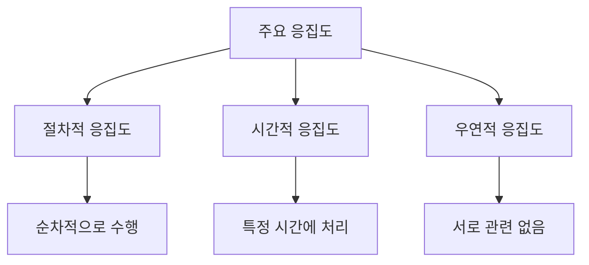
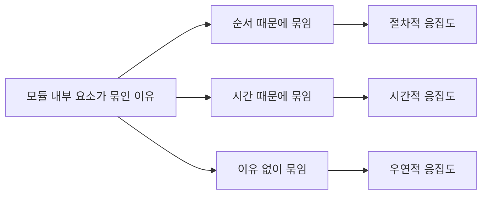
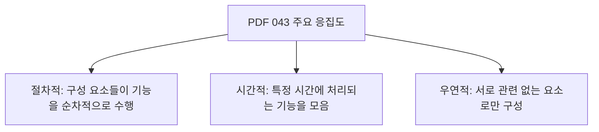
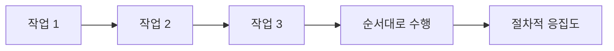
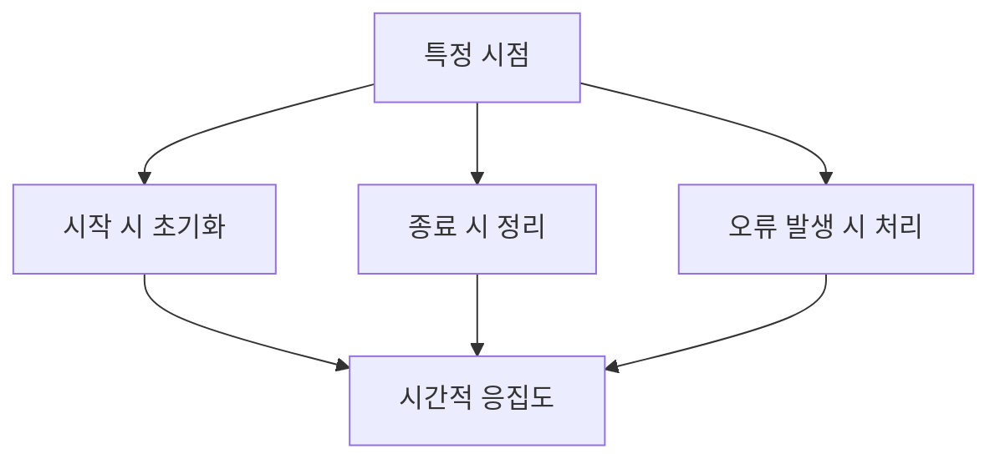
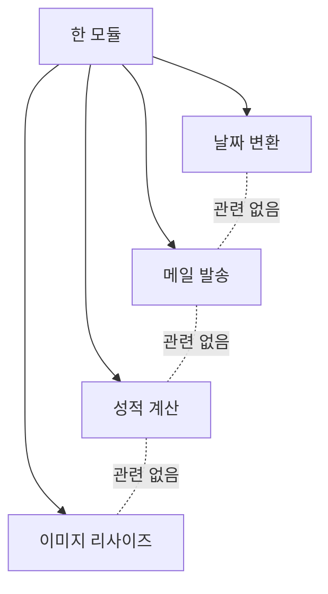
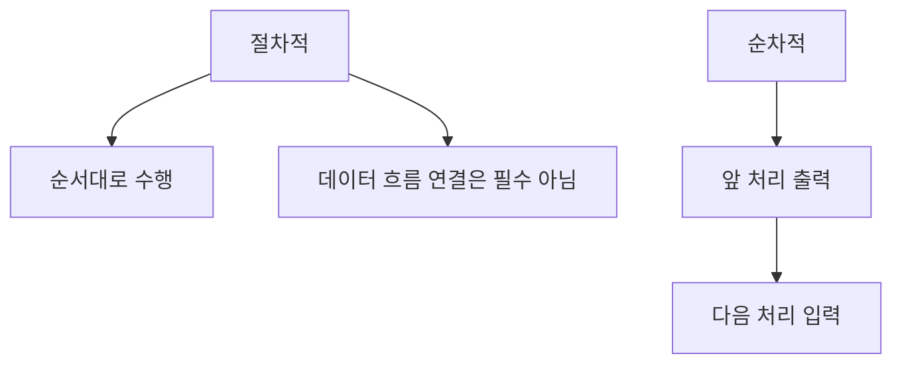
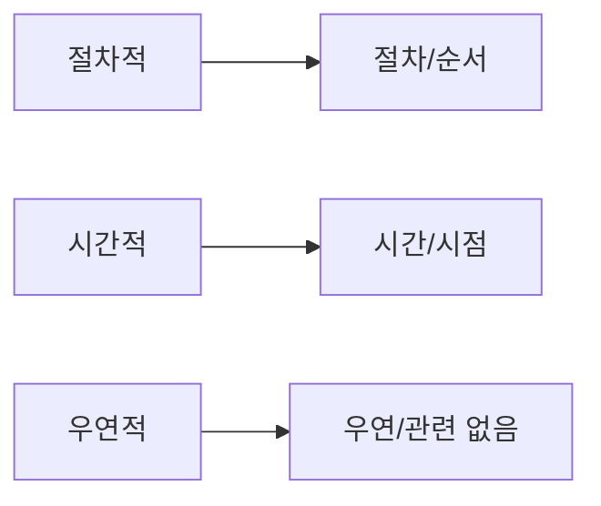

# 043 주요 응집도

작성 기준일: 2026-05-02
검색/보강일: 2026-06-01
과목: `1과목 소프트웨어 설계`
기준 PDF: `/Users/nes0903/Documents/study/정보처리기사/핵심요약집_2026_정보처리기사필기핵심요약.pdf`
PDF 확인 위치: `6페이지`
주제별 검색 키워드: `procedural temporal coincidental cohesion`, `cohesion types software engineering`, `procedural vs sequential cohesion`

---

## 1. 한 줄 요약

- PDF 043은 응집도 중 `절차적`, `시간적`, `우연적` 응집도를 직접 제시한다.
- 절차적은 `순차적으로 수행`, 시간적은 `특정 시간에 처리`, 우연적은 `서로 관련 없는 요소`가 핵심이다.
- 시험에서는 이 세 정의를 단서어로 빠르게 구분하고, 전체 응집도 순서 `우논시절교순기`와 함께 연결해야 한다.

---

## 2. 한눈에 보는 구조

- 절차적 응집도는 작업들이 정해진 절차에 따라 수행된다는 점에 관련성이 있다.
- 시간적 응집도는 작업들이 같은 시점에 수행된다는 점에 관련성이 있다.
- 우연적 응집도는 작업들 사이의 의미 있는 관련성이 거의 없다.
- 세 응집도 모두 기능적 응집도보다는 약하며, 우연적 응집도는 전체 응집도 중 가장 약하다.

---

## 3. PDF 기준 핵심

- `절차적(Procedural) 응집도`
  - 모듈 안의 구성 요소들이 그 기능을 순차적으로 수행할 경우의 응집도이다.
- `시간적(Temporal) 응집도`
  - 특정 시간에 처리되는 몇 개의 기능을 모아 하나의 모듈로 작성할 경우의 응집도이다.
- `우연적(Coincidental) 응집도`
  - 각 구성 요소들이 서로 관련 없는 요소로만 구성된 경우의 응집도이다.

- 위 세 정의가 기준 PDF에서 직접 확인되는 시험용 핵심이다.
- PDF에 적힌 `순차적으로 수행`이라는 문장 때문에 절차적 응집도와 순차적 응집도를 혼동하기 쉽다.
- 절차적 응집도는 단순히 순서가 있다는 뜻이고, 순차적 응집도는 앞 처리의 출력이 다음 처리의 입력이 되는 데이터 흐름까지 포함한다.

---

## 4. 검색으로 보강한 관점

- 소프트웨어 공학 자료에서는 응집도를 모듈 내부 요소들의 관련성 강도로 설명한다.
- `procedural cohesion`은 요소들이 특정 실행 순서나 절차로 묶인 경우로 설명된다.
- `temporal cohesion`은 초기화, 종료 처리처럼 같은 시점에 실행되는 작업이 묶인 경우로 설명된다.
- `coincidental cohesion`은 관련 없는 기능들이 한 모듈에 임의로 들어간 경우로 설명되며, 가장 낮은 응집도로 다뤄진다.
- 여러 자료에서 전체 응집도 순서는 대체로 `coincidental -> logical -> temporal -> procedural -> communicational -> sequential -> functional`로 제시된다.
- 정보처리기사에서는 `communicational`을 `교환적`으로 외우고, 이 파일에서는 PDF가 직접 다룬 세 항목을 우선한다.

---

## 5. 절차적 응집도

- 절차적 응집도는 모듈 안의 구성 요소들이 어떤 절차나 순서에 따라 수행될 때의 응집도이다.
- PDF 표현은 `모듈 안의 구성 요소들이 그 기능을 순차적으로 수행할 경우`이다.
- 여기서 중요한 단어는 `절차`, `순서`, `순차적으로 수행`이다.
- 예시는 다음과 같다.
  - 권한 확인 후 파일을 연다.
  - 파일을 연 뒤 로그를 남긴다.
  - 로그를 남긴 뒤 다음 화면으로 이동한다.
- 이런 작업들은 정해진 순서로 묶여 있으므로 관련성이 생긴다.
- 하지만 각 단계의 출력이 반드시 다음 단계의 입력으로 쓰이는 것은 아닐 수 있다.
- 그래서 절차적 응집도는 순차적 응집도보다 약하다.

### 절차적 응집도 단서

- 절차
- 순서
- 순차적으로 수행
- 정해진 실행 흐름
- 단계별 실행

---

## 6. 시간적 응집도

- 시간적 응집도는 특정 시간에 처리되는 몇 개의 기능을 하나의 모듈로 묶은 경우이다.
- 기능들이 같은 목적을 수행한다기보다, 같은 시점에 실행된다는 이유로 모인다.
- 대표 예시는 다음과 같다.
  - 프로그램 시작 시 설정 파일 읽기, 로그 파일 열기, 캐시 초기화
  - 프로그램 종료 시 작업용 파일 삭제, 연결 종료, 로그 저장
  - 오류 발생 시 알림 전송, 롤백, 오류 로그 기록
- 같은 시점에 처리된다는 점은 관련성이 있지만, 하나의 기능을 수행한다고 보기에는 약하다.
- 따라서 시간적 응집도는 기능적 응집도보다 훨씬 약하고, 절차적 응집도보다도 약한 위치에 있다.

### 시간적 응집도 단서

- 특정 시간
- 특정 시점
- 초기화
- 종료 처리
- 오류 발생 시 처리
- 시작할 때 또는 끝날 때 함께 수행

---

## 7. 우연적 응집도

- 우연적 응집도는 각 구성 요소들이 서로 관련 없는 요소로만 구성된 경우의 응집도이다.
- 특별한 설계 이유 없이 여러 기능이 한 모듈에 들어간 상태이다.
- 대표 예시는 다음과 같다.
  - `Utility` 모듈에 날짜 처리, 결제 계산, 이메일 발송, 파일 압축이 함께 들어 있다.
  - `Common` 모듈에 서로 다른 업무 기능이 계속 추가된다.
  - 개발 중 즉석으로 만든 함수들이 정리되지 않고 한 파일에 남아 있다.
- 우연적 응집도는 전체 응집도 중 가장 약하고 좋지 않다.
- 변경 이유가 다양해져 유지보수가 어려워지고, 모듈 이름만으로 역할을 파악하기 어렵다.

### 우연적 응집도 단서

- 서로 관련 없음
- 임의로 묶임
- 우연히 같은 모듈에 존재
- 기능 간 연관성 없음
- 가장 약한 응집도

---

## 8. 세 응집도 비교

| 구분 | 묶인 기준 | 핵심 단서 | 예시 | 전체 순서상 위치 |
|---|---|---|---|---|
| 우연적 응집도 | 기준 없음 | 관련 없는 요소 | 날짜 처리와 메일 발송이 한 모듈에 섞임 | 가장 약함 |
| 시간적 응집도 | 실행 시점 | 특정 시간, 초기화, 종료 | 시작 시 설정 로딩과 캐시 초기화 | 약함 |
| 절차적 응집도 | 실행 순서 | 절차, 순서대로 수행 | 권한 확인 후 파일 열기 | 중간 |

- PDF가 제시한 순서가 아니라, 전체 응집도 강도 순서로 보면 `우연적 -> 시간적 -> 절차적` 순으로 강해진다.
- 단, 042의 전체 순서를 함께 넣으면 `우연적 -> 논리적 -> 시간적 -> 절차적 -> 교환적 -> 순차적 -> 기능적`이다.
- PDF 043은 세 항목의 정의를 강조하므로, 세 항목의 단서어를 정확히 구분해야 한다.

---

## 9. 절차적 vs 순차적 응집도

- 절차적 응집도는 작업들이 특정 순서로 실행되는 경우이다.
- 순차적 응집도는 한 작업의 출력이 다음 작업의 입력으로 사용되는 경우이다.
- 예를 들어 `권한 확인 -> 파일 열기 -> 로그 기록`은 절차적 응집도에 가깝다.
- `파일 읽기 -> 파싱 -> 검증 -> 저장`은 앞 단계 결과가 다음 단계 입력이 되므로 순차적 응집도에 가깝다.
- PDF 043의 `순차적으로 수행`이라는 표현은 절차적 응집도의 정의 안에 들어 있으므로, `순차적 응집도`라는 이름과 혼동하지 않는다.

---

## 10. 시험 포인트

- `모듈 안의 구성 요소들이 그 기능을 순차적으로 수행`하면 절차적 응집도이다.
- `특정 시간에 처리되는 몇 개의 기능을 모아 작성`하면 시간적 응집도이다.
- `서로 관련 없는 요소로만 구성`되면 우연적 응집도이다.
- 우연적 응집도는 가장 약하고 가장 좋지 않은 응집도이다.
- 절차적 응집도는 순서가 단서이고, 순차적 응집도는 출력과 입력의 연결이 단서이다.
- 시간적 응집도는 초기화, 종료, 특정 이벤트 시점 같은 표현과 자주 연결된다.
- 응집도는 높을수록 좋고, 기능적 응집도가 가장 바람직하다.

---

## 11. 헷갈리는 비교

| 단서 | 판단 |
|---|---|
| `순서대로 수행`, `절차에 따라 수행` | 절차적 응집도 |
| `앞 단계 결과가 다음 단계 입력` | 순차적 응집도 |
| `시작 시`, `종료 시`, `초기화`, `같은 시점` | 시간적 응집도 |
| `관련 없는 기능`, `임의로 묶음` | 우연적 응집도 |
| `같은 자료를 사용` | 교환적 응집도 |
| `하나의 기능 수행` | 기능적 응집도 |

- `순차적으로 수행`이라는 문장만 보면 절차적 응집도일 수 있다.
- `순차적 응집도`는 반드시 데이터 흐름, 즉 출력과 입력의 연결을 확인한다.
- `시간적 응집도`는 기능 목적이 아니라 실행 시점이 묶는 기준이다.
- `우연적 응집도`는 관련성 자체가 없거나 매우 약한 경우이다.

---

## 12. 예시 문제 감각

| 보기 문장 | 정답 | 이유 |
|---|---|---|
| 모듈 내 요소들이 정해진 순서에 따라 수행된다 | 절차적 응집도 | 절차/순서가 핵심 |
| 시스템 시작 시 수행되는 초기화 기능을 한 모듈에 모았다 | 시간적 응집도 | 같은 시점에 수행 |
| 서로 관계없는 여러 기능이 한 모듈에 들어 있다 | 우연적 응집도 | 관련성 없음 |
| 한 단계의 출력이 다음 단계 입력으로 사용된다 | 순차적 응집도 | 출력->입력 연결 |
| 모든 요소가 하나의 기능 수행에 필요하다 | 기능적 응집도 | 단일 기능 집중 |

---

## 13. 암기 포인트

- PDF 직접 항목 암기: `절차적`, `시간적`, `우연적`.
- 세 항목 단서 암기:
  - `절차적`: 순차적으로 수행
  - `시간적`: 특정 시간에 처리
  - `우연적`: 관련 없는 요소
- 전체 응집도 암기:
  - `우논시절교순기`
  - 우연적이 가장 약하고 기능적이 가장 강하다.
- 실수 방지:
  - 절차적의 `순차적으로 수행`과 순차적 응집도의 이름을 섞지 않는다.
  - 시간적을 절차적과 구분할 때는 `시점`을 먼저 본다.

---

## 14. 빠른 복습

- 절차적 응집도는 모듈 안 구성 요소들이 그 기능을 순차적으로 수행할 경우이다.
- 시간적 응집도는 특정 시간에 처리되는 몇 개의 기능을 하나의 모듈로 작성할 경우이다.
- 우연적 응집도는 구성 요소들이 서로 관련 없는 요소로만 구성된 경우이다.
- 우연적 응집도는 가장 약하고 좋지 않다.
- 절차적과 순차적은 다르다. 절차적은 순서, 순차적은 앞 출력이 뒤 입력이다.
- 전체 순서는 `우연적 -> 논리적 -> 시간적 -> 절차적 -> 교환적 -> 순차적 -> 기능적`이다.

---

## 15. 참고 링크

- 기준 PDF: `/Users/nes0903/Documents/study/정보처리기사/핵심요약집_2026_정보처리기사필기핵심요약.pdf`
- [Q-Net - 정보처리기사 종목 정보](https://www.q-net.or.kr/crf005.do?id=crf00503&jmCd=1320)
- [SEI - Introduction to Software Design](https://www.sei.cmu.edu/documents/1539/1989_007_001_15689.pdf)
- [UMBC - Cohesion](https://courses.cs.umbc.edu/undergraduate/CMSC201/fall01/lectures/lec13/cohesion.shtml)
- [GeeksforGeeks - Coupling and Cohesion](https://www.geeksforgeeks.org/software-engineering/software-engineering-coupling-and-cohesion/)
