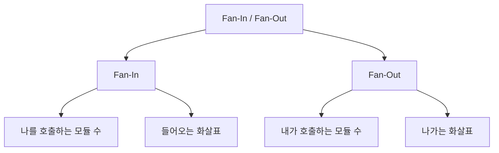
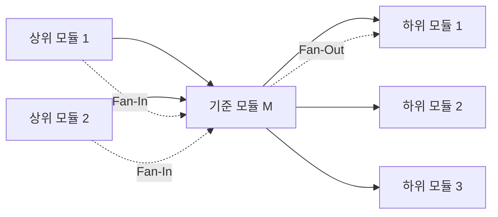
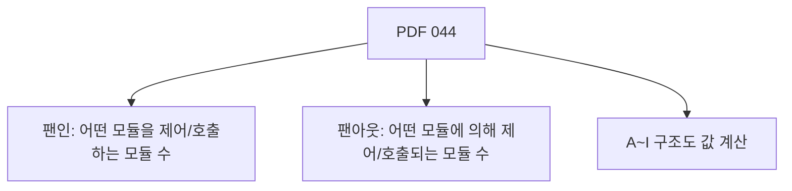
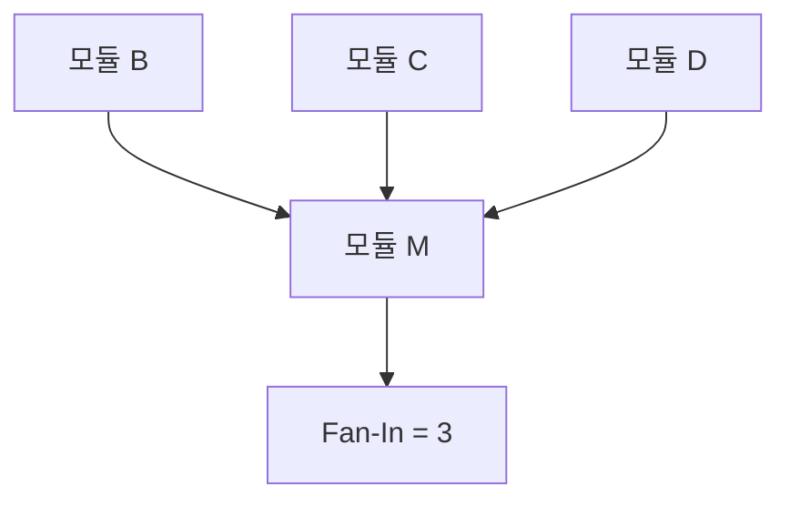
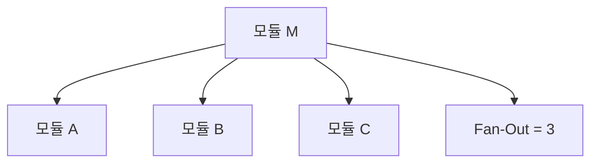
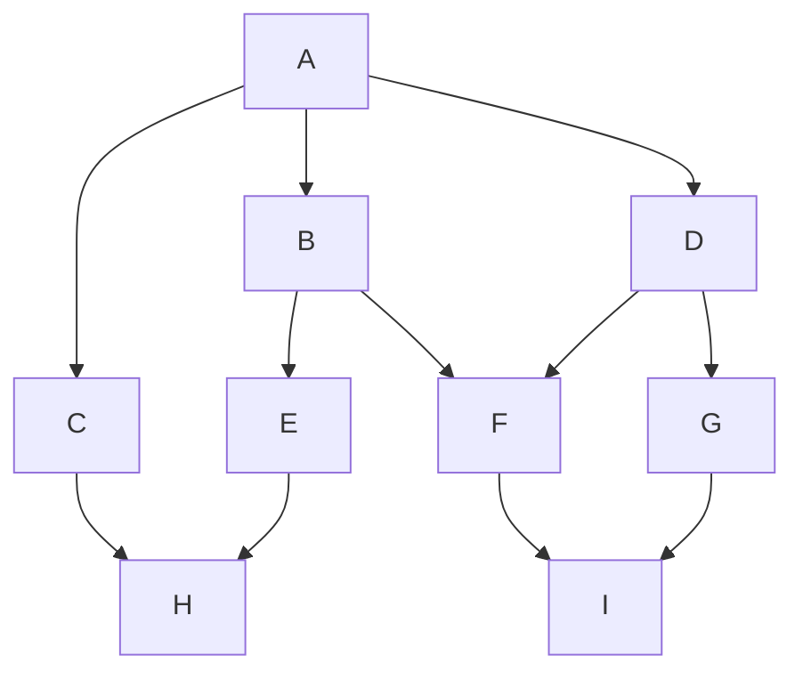
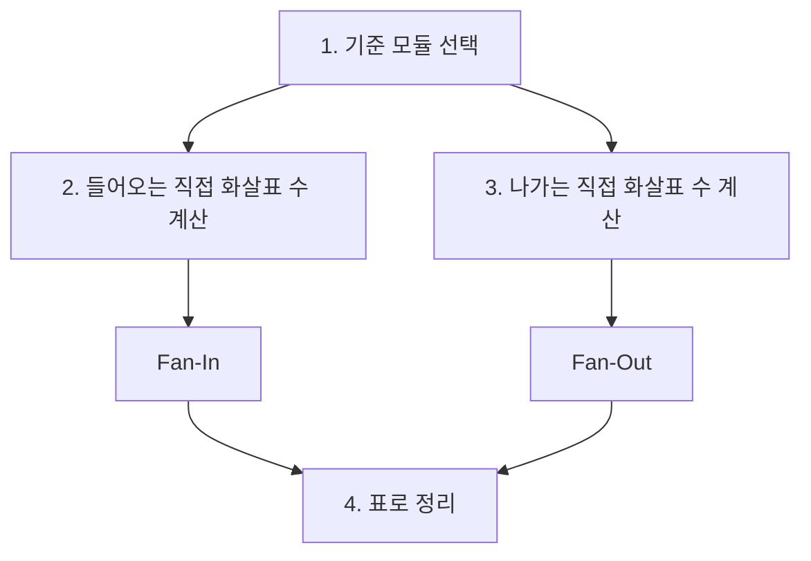
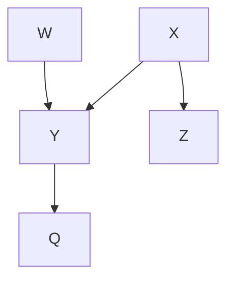
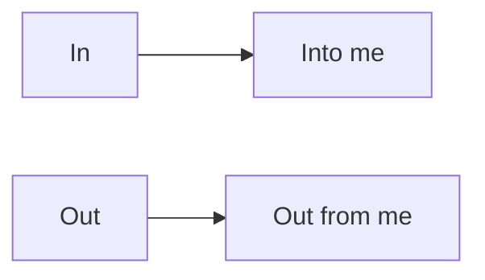

# 044 팬인(Fan-In) 팬아웃(Fan-Out)

작성 기준일: 2026-05-02
검색/보강일: 2026-06-01
과목: `1과목 소프트웨어 설계`
기준 PDF: `/Users/nes0903/Documents/study/정보처리기사/핵심요약집_2026_정보처리기사필기핵심요약.pdf`
PDF 확인 위치: `6페이지`
주제별 검색 키워드: `fan-in fan-out software engineering module design`, `structural fan-in fan-out metrics`, `module call graph fan-in fan-out`

---

## 1. 한 줄 요약

- 팬인(Fan-In)은 어떤 모듈을 제어하거나 호출하는 모듈의 수이다.
- 팬아웃(Fan-Out)은 어떤 모듈에 의해 제어되거나 호출되는 모듈의 수, 즉 해당 모듈이 직접 호출하는 하위 모듈의 수이다.
- 구조도 문제에서는 기준 모듈을 하나 정하고 `들어오는 선=팬인`, `나가는 선=팬아웃`으로 직접 연결만 센다.

---

## 2. 한눈에 보는 구조

- 기준 모듈을 먼저 잡는다.
- 기준 모듈로 들어오는 직접 호출 수를 세면 팬인이다.
- 기준 모듈에서 나가는 직접 호출 수를 세면 팬아웃이다.
- 간접 호출은 일반적인 구조도 계산 문제에서 포함하지 않는다.
- 팬인은 재사용 정도나 호출 집중도를 볼 때 사용되고, 팬아웃은 제어 복잡도나 의존 범위를 볼 때 사용된다.

---

## 3. PDF 기준 핵심

- `팬인`
  - 어떤 모듈을 제어(호출)하는 모듈의 수이다.
- `팬아웃`
  - 어떤 모듈에 의해 제어(호출)되는 모듈의 수이다.
- PDF 예제의 팬인 값은 다음과 같다.
  - `A = 0`
  - `B, C, D, E, G = 1`
  - `F, H, I = 2`
- PDF 예제의 팬아웃 값은 다음과 같다.
  - `H, I = 0`
  - `C, E, F, G = 1`
  - `B, D = 2`
  - `A = 3`

- 위 값은 기준 PDF의 구조도 계산 결과로 그대로 외워 두면 방향 감각을 잡기 좋다.
- 팬인/팬아웃은 정의 문제보다 구조도에서 직접 값을 세는 문제가 중요하다.

---

## 4. 검색으로 보강한 관점

- 소프트웨어 설계와 품질 지표 자료에서 Fan-In/Fan-Out은 호출 그래프 또는 의존 그래프의 구조적 복잡도를 측정하는 지표로 설명된다.
- 구조적 Fan-In은 특정 절차나 파일을 호출하거나 의존하는 다른 절차/파일의 수를 나타낸다.
- 구조적 Fan-Out은 특정 절차나 파일이 호출하거나 의존하는 다른 절차/파일의 수를 나타낸다.
- Fan-Out이 너무 높으면 한 모듈이 너무 많은 세부 모듈에 의존하여 이해와 테스트가 어려워질 수 있다.
- Fan-In이 높으면 여러 곳에서 재사용되는 공통 기능일 수 있지만, 변경 시 영향 범위가 커질 수 있다.
- 시험에서는 현대 코드 메트릭의 세부 계산법보다 PDF의 `호출하는 수`, `호출되는 수`를 기준으로 판단한다.

---

## 5. 개념 설명

### 5.1 Fan-In

- Fan-In은 특정 모듈을 호출하는 모듈 수이다.
- 기준 모듈을 향해 들어오는 화살표 수라고 생각하면 쉽다.
- Fan-In이 높다는 것은 여러 모듈이 해당 모듈을 사용한다는 뜻이다.
- Fan-In이 높은 모듈은 공통 기능, 재사용 기능, 핵심 서비스일 가능성이 있다.
- 하지만 Fan-In이 높은 모듈을 수정하면 호출하는 여러 모듈에 영향을 줄 수 있으므로 변경 시 주의가 필요하다.

### 5.2 Fan-Out

- Fan-Out은 특정 모듈이 직접 호출하는 하위 모듈 수이다.
- 기준 모듈에서 밖으로 나가는 화살표 수라고 생각하면 쉽다.
- Fan-Out이 높다는 것은 한 모듈이 여러 모듈을 직접 제어하거나 사용한다는 뜻이다.
- Fan-Out이 너무 높으면 해당 모듈의 제어 복잡도가 커지고, 테스트해야 할 조합도 늘어난다.
- Fan-Out이 높은 모듈은 조정자, 컨트롤러, 상위 업무 흐름 모듈일 수 있지만, 지나치면 책임이 과도할 수 있다.

---

## 6. PDF 예제 구조 재현

- 위 구조는 PDF 예제의 팬인/팬아웃 결과와 맞는 호출 관계이다.
- 화살표는 상위 모듈이 하위 모듈을 직접 호출하거나 제어하는 관계로 본다.
- 각 모듈의 팬인과 팬아웃은 직접 연결된 화살표만 센다.

### 6.1 팬인 계산

| 모듈 | 들어오는 직접 호출 | Fan-In |
|---|---|---:|
| A | 없음 | 0 |
| B | A | 1 |
| C | A | 1 |
| D | A | 1 |
| E | B | 1 |
| F | B, D | 2 |
| G | D | 1 |
| H | C, E | 2 |
| I | F, G | 2 |

- A는 최상위 모듈이므로 들어오는 호출이 없다.
- F는 B와 D가 호출하므로 팬인이 2이다.
- H는 C와 E가 호출하므로 팬인이 2이다.
- I는 F와 G가 호출하므로 팬인이 2이다.

### 6.2 팬아웃 계산

| 모듈 | 나가는 직접 호출 | Fan-Out |
|---|---|---:|
| A | B, C, D | 3 |
| B | E, F | 2 |
| C | H | 1 |
| D | F, G | 2 |
| E | H | 1 |
| F | I | 1 |
| G | I | 1 |
| H | 없음 | 0 |
| I | 없음 | 0 |

- A는 B, C, D를 호출하므로 팬아웃이 3이다.
- B와 D는 각각 두 모듈을 호출하므로 팬아웃이 2이다.
- H와 I는 더 이상 하위 모듈을 호출하지 않으므로 팬아웃이 0이다.

---

## 7. 계산 절차

- 1단계: 계산할 기준 모듈을 하나 선택한다.
- 2단계: 기준 모듈로 들어오는 직접 호출선을 센다.
- 3단계: 그 수를 Fan-In으로 적는다.
- 4단계: 기준 모듈에서 나가는 직접 호출선을 센다.
- 5단계: 그 수를 Fan-Out으로 적는다.
- 6단계: 모든 모듈에 대해 반복한다.
- 간접 호출은 계산하지 않는다.
  - 예를 들어 A가 B를 호출하고 B가 E를 호출하더라도, A의 팬아웃에 E를 포함하지 않는다.
  - A의 직접 팬아웃은 B, C, D만이다.

---

## 8. 품질 관점

| 지표 | 값이 높을 때 의미 | 장점 가능성 | 위험 가능성 |
|---|---|---|---|
| Fan-In | 여러 모듈이 해당 모듈을 호출 | 재사용성, 공통 기능 | 변경 영향 범위 증가 |
| Fan-Out | 해당 모듈이 여러 모듈을 호출 | 상위 제어/조정 역할 | 제어 복잡도 증가, 테스트 어려움 |

- Fan-In이 높다고 무조건 나쁜 것은 아니다.
- 공통 유틸리티, 검증 함수, 핵심 도메인 서비스는 Fan-In이 높을 수 있다.
- 그러나 Fan-In이 높은 모듈은 변경 시 호출자 전체를 고려해야 한다.
- Fan-Out이 높다고 무조건 나쁜 것은 아니지만, 지나치게 높으면 한 모듈이 너무 많은 책임을 지고 있을 수 있다.
- 좋은 설계에서는 상위 모듈이 지나치게 많은 하위 모듈을 직접 제어하지 않도록 계층과 책임을 조정한다.

---

## 9. 시험 포인트

- Fan-In은 `나를 호출하는 모듈 수`이다.
- Fan-Out은 `내가 호출하는 모듈 수`이다.
- 들어오는 화살표는 Fan-In이다.
- 나가는 화살표는 Fan-Out이다.
- 직접 호출만 계산한다.
- 최상위 모듈은 보통 Fan-In이 0일 수 있다.
- 최하위 모듈은 보통 Fan-Out이 0일 수 있다.
- PDF 예제에서 A는 Fan-In 0, Fan-Out 3이다.
- PDF 예제에서 H와 I는 Fan-Out 0이다.
- Fan-Out이 너무 높으면 제어 복잡도가 높아질 수 있다.

---

## 10. 헷갈리는 비교

| 구분 | 의미 | 계산 방향 | 대표 실수 |
|---|---|---|---|
| Fan-In | 기준 모듈을 호출하는 모듈 수 | 들어오는 선 | 내가 호출하는 수로 착각 |
| Fan-Out | 기준 모듈이 호출하는 모듈 수 | 나가는 선 | 나를 호출하는 수로 착각 |
| 결합도 | 모듈 간 의존 강도 | 의존 방식 분석 | 호출 수와 같은 개념으로 착각 |
| 응집도 | 모듈 내부 요소 관련성 | 내부 구성 분석 | 모듈 간 호출 관계로 착각 |
| 호출 깊이 | 계층의 깊이 | 경로 길이 | 호출 개수와 혼동 |

- Fan-In/Fan-Out은 호출 관계의 개수이고, 결합도는 의존 방식의 강도이다.
- Fan-Out이 높다고 자동으로 내용 결합도라는 뜻은 아니다.
- Fan-In이 높다고 자동으로 나쁜 설계라는 뜻도 아니다.
- 시험에서는 보통 구조도에서 정량 값을 묻기 때문에 방향을 먼저 확인한다.

---

## 11. 예시로 계산하기

- `X`
  - Fan-In: X를 호출하는 모듈이 없으므로 0
  - Fan-Out: Y와 Z를 호출하므로 2
- `Y`
  - Fan-In: X와 W가 호출하므로 2
  - Fan-Out: Q를 호출하므로 1
- `Z`
  - Fan-In: X가 호출하므로 1
  - Fan-Out: 호출하는 모듈이 없으므로 0
- `Q`
  - Fan-In: Y가 호출하므로 1
  - Fan-Out: 호출하는 모듈이 없으므로 0

---

## 12. 암기 포인트

- `Fan-In`: 내 안으로 들어오는 호출
- `Fan-Out`: 내 밖으로 나가는 호출
- 한국어 암기:
  - `인`: 나에게 들어온다.
  - `아웃`: 내가 밖으로 보낸다.
- 계산 암기:
  - 기준 모듈을 동그라미 친다.
  - 들어오는 선을 센다.
  - 나가는 선을 센다.
  - 간접 경로는 제외한다.

---

## 13. 빠른 복습

- 팬인은 어떤 모듈을 제어하거나 호출하는 모듈의 수이다.
- 팬아웃은 어떤 모듈에 의해 제어되거나 호출되는 모듈의 수, 즉 기준 모듈이 호출하는 하위 모듈 수이다.
- Fan-In은 들어오는 화살표 수이다.
- Fan-Out은 나가는 화살표 수이다.
- PDF 예제의 팬인은 `A=0`, `B/C/D/E/G=1`, `F/H/I=2`이다.
- PDF 예제의 팬아웃은 `H/I=0`, `C/E/F/G=1`, `B/D=2`, `A=3`이다.
- 구조도 계산에서는 직접 호출 관계만 센다.

---

## 14. 참고 링크

- 기준 PDF: `/Users/nes0903/Documents/study/정보처리기사/핵심요약집_2026_정보처리기사필기핵심요약.pdf`
- [Q-Net - 정보처리기사 종목 정보](https://www.q-net.or.kr/crf005.do?id=crf00503&jmCd=1320)
- [University of Padova - Structural Fan-In and Fan-Out metrics](https://www.math.unipd.it/~tullio/IS-1/2004/Approfondimenti/Fan-in_Fan-out.html)
- [TIOBE - Metrics Explained](https://portal.tiobe.com/latest/docs/metrics/index.html)
- [Schneider Electric - Fan Out metric](https://product-help.schneider-electric.com/Machine%20Expert/V2.2/en/CodeAnly/CodeAnly/D-SE-0096001.html)

<!-- study-links:start -->
## 관련 문서

- `fan in fan out`: [[fan-in-fan-out/fan-in-fan-out|fan-in / fan-out 상세 정리]]
<!-- study-links:end -->
