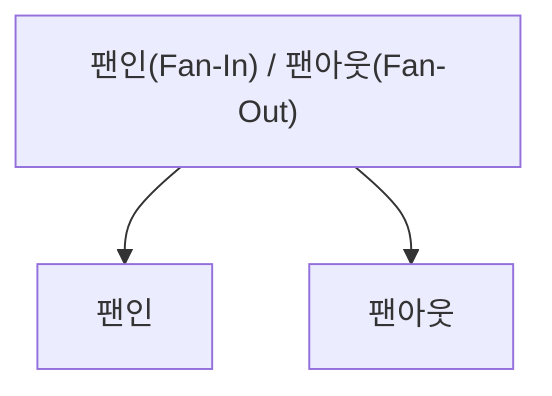

# 044 팬인(Fan-In) / 팬아웃(Fan-Out)

작성 기준일: 2026-05-02  
과목: `1과목 소프트웨어 설계`  
기준 PDF: `/Users/nes0903/Documents/study/정보처리기사/핵심요약집_2026_정보처리기사필기핵심요약.pdf`  
PDF 확인 위치: `6페이지`  
검색 보강: 공식/표준/고품질 참고 자료를 함께 확인하여 시험 중심으로 확장 정리

---

## 1. 한 줄 요약

- 팬인은 어떤 모듈을 호출하는 상위 모듈의 수이고, 팬아웃은 어떤 모듈이 호출하는 하위 모듈의 수다.
- 이 챕터는 `모듈` 영역에 속한다.
- 시험에서는 정의, 핵심 키워드, 비슷한 개념과의 구분을 함께 묻는 경우가 많다.

---

## 2. PDF 기준 핵심

- 팬인: 어떤 모듈을 제어(호출)하는 모듈의 수
- 팬아웃: 어떤 모듈에 의해 제어(호출)되는 모듈의 수

- 위 항목은 PDF에서 직접 확인한 최소 암기 골격이다.
- 세부 설명은 이 골격을 기준으로 확장해서 이해하면 된다.

---

## 3. 개념 설명

- 팬인은 모듈로 들어오는 호출 수다.
- 팬아웃은 모듈에서 나가는 호출 수다.
- 팬인이 높으면 여러 곳에서 재사용되는 공통 모듈일 수 있다.
- 팬아웃이 지나치게 높으면 해당 모듈이 너무 많은 일을 조정하고 있어 복잡할 수 있다.
- 모듈 설계는 낮은 결합도, 높은 응집도, 명확한 인터페이스, 적절한 크기가 핵심이다.
- 결합도와 응집도는 순서 암기가 중요하다.

---

## 4. 핵심 포인트

- 문제를 풀 때는 먼저 지문 속 단서어를 찾고, 그 단서어가 어떤 개념을 가리키는지 연결한다.
- 정의형 문제는 표현이 조금 바뀌어도 핵심 의미가 같으면 같은 개념으로 판단한다.
- 옳고 그름 문제에서는 `항상`, `반드시`, `전혀`, `모두` 같은 극단 표현을 특히 조심한다.
- 이 챕터는 단독 암기보다 인접 챕터와 비교해 기억하면 정답률이 올라간다.

---

## 5. 시험에서 헷갈리는 비교

| 구분 | 핵심 |
|---|---|
| `Fan-In` | 나를 호출하는 모듈 수 |
| `Fan-Out` | 내가 호출하는 모듈 수 |

- 비교 문제는 이름보다 `역할`, `목적`, `사용 시점`, `장점/단점`을 기준으로 구분하면 안정적이다.

---

## 6. 예시 또는 암기 포인트

- 팬인 = in = 들어옴, 팬아웃 = out = 나감.

- 암기는 단어만 외우기보다 `정의 -> 특징 -> 예시 -> 반대 개념` 순서로 묶는 것이 좋다.

---

## 7. 빠른 복습

- 챕터명: `044 팬인(Fan-In) / 팬아웃(Fan-Out)`
- 소속 영역: `모듈`
- 자주 나오는 문제 유형:
  - 정의를 주고 개념명을 고르는 문제
  - 특징을 섞어 놓고 옳은/틀린 설명을 고르는 문제
  - 유사 개념과 비교하여 다른 하나를 찾는 문제

---

## 8. 참고 링크

- 기준 PDF: `/Users/nes0903/Documents/study/정보처리기사/핵심요약집_2026_정보처리기사필기핵심요약.pdf`
- [Q-Net 정보처리기사 종목 페이지](https://www.q-net.or.kr/crf005.do?id=crf00503s02&jmCd=1320&jmInfoDivCcd=B0)
- [GeeksforGeeks - Coupling and Cohesion](https://www.geeksforgeeks.org/software-engineering-coupling-and-cohesion/)
- [SEI - Quality Attribute Design Primitives](https://www.sei.cmu.edu/library/quality-attribute-design-primitives-and-the-attribute-driven-design-method/)
