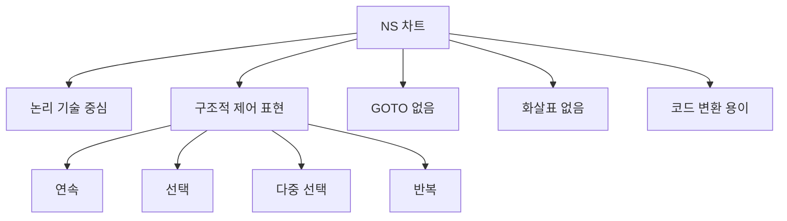
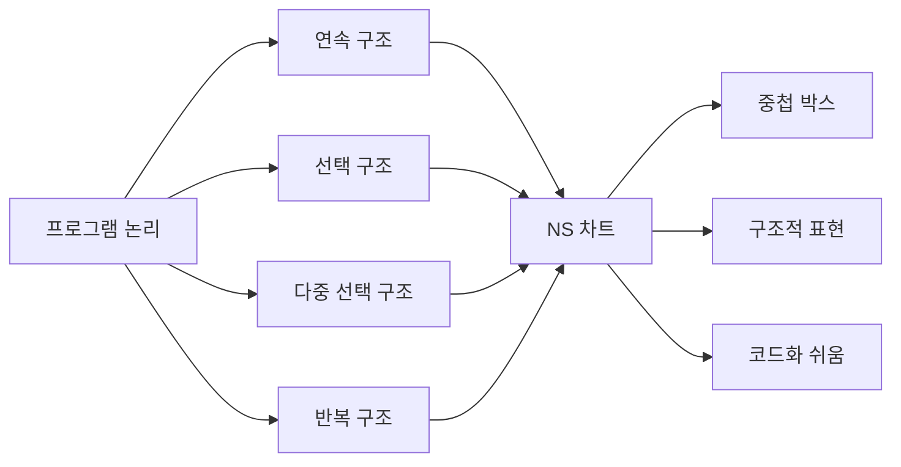
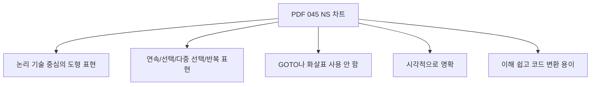
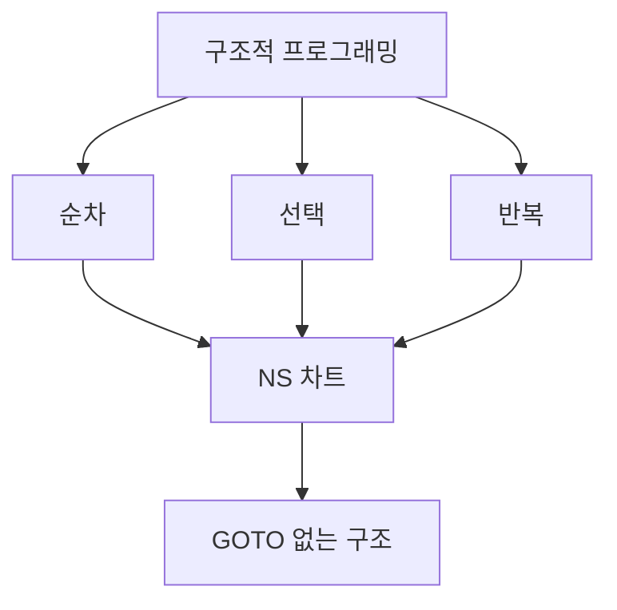
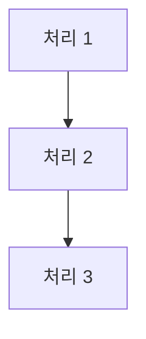
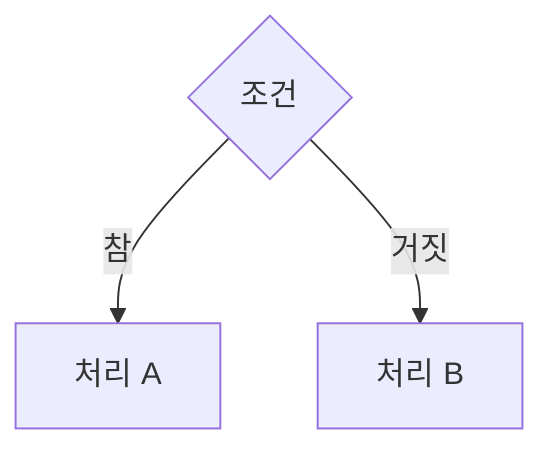
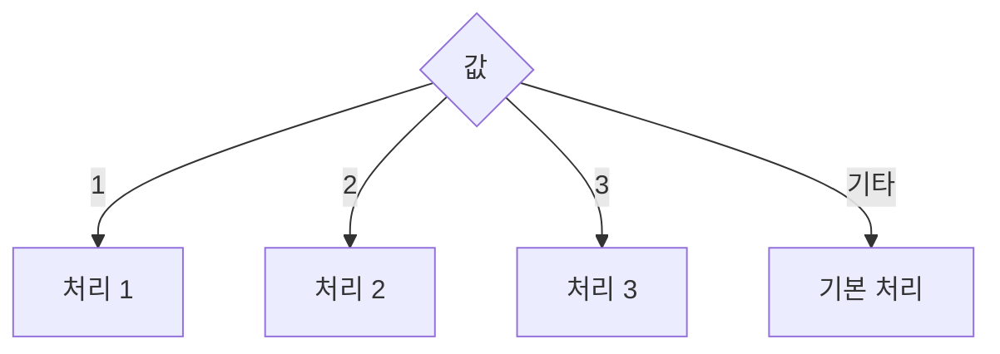
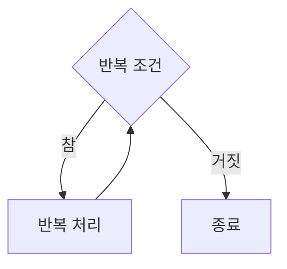
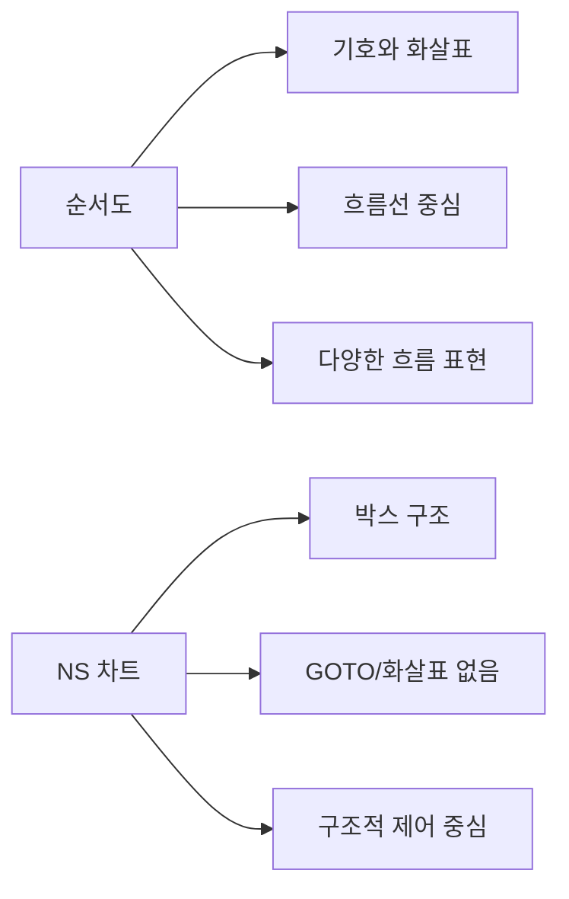
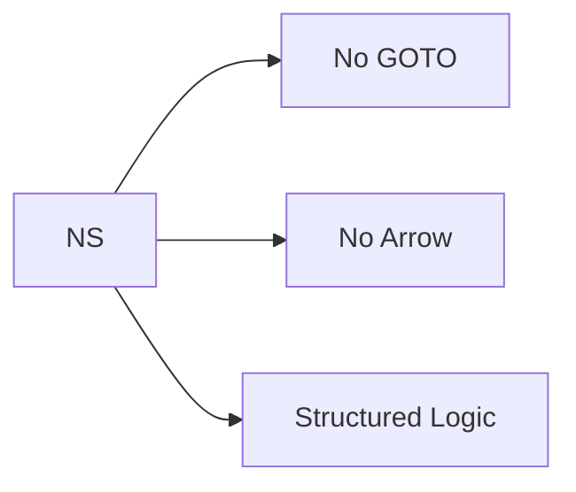

# 045 NS 차트

작성 기준일: 2026-05-02
검색/보강일: 2026-06-01
과목: `1과목 소프트웨어 설계`
기준 PDF: `/Users/nes0903/Documents/study/정보처리기사/핵심요약집_2026_정보처리기사필기핵심요약.pdf`
PDF 확인 위치: `6페이지`
주제별 검색 키워드: `Nassi Shneiderman chart structured programming`, `NS chart no GOTO arrows`, `sequence selection iteration Nassi Shneiderman diagram`

---

## 1. 한 줄 요약



- NS 차트는 논리의 기술에 중점을 둔 도형 기반 표현 방법으로, 구조적 프로그램의 제어 논리를 나타낸다.
- PDF 기준 핵심은 `연속`, `선택`, `다중 선택`, `반복`을 표현하고 `GOTO나 화살표를 사용하지 않는다`는 점이다.
- 시험에서는 순서도와 비교하여 `화살표 없음`, `GOTO 없음`, `시각적 명확성`, `코드 변환 용이`를 단서로 잡는다.

---

## 2. 한눈에 보는 구조



- NS 차트는 Nassi-Shneiderman chart 또는 Nassi-Shneiderman diagram이라고 부른다.
- 구조적 프로그래밍에서 사용하는 기본 제어 구조를 도형으로 나타낸다.
- 순서도처럼 화살표로 흐름을 이어 붙이는 방식이 아니라, 박스의 중첩과 분할로 논리 구조를 보여 준다.
- 그래서 비구조적인 GOTO 흐름을 표현하지 않는다는 특징이 있다.

---

## 3. PDF 기준 핵심



- 논리의 기술에 중점을 둔 도형을 이용한 표현 방법이다.
- 연속, 선택 및 다중 선택, 반복 등의 제어 논리 구조를 표현한다.
- GOTO나 화살표를 사용하지 않는다.
- 시각적으로 명확히 식별하는 데 적합하다.
- 이해하기 쉽고, 코드 변환이 용이하다.

- 위 다섯 항목은 기준 PDF에서 직접 확인되는 핵심이다.
- 특히 `GOTO나 화살표를 사용하지 않는다`는 문장은 순서도와 구분하는 대표 단서이다.
- `도형`이라는 단어가 있다고 해서 무조건 순서도가 아니다. NS 차트도 도형을 사용하지만 화살표를 사용하지 않는다.

---

## 4. 검색으로 보강한 관점

- Nassi-Shneiderman diagram은 구조적 프로그래밍을 위한 그래픽 설계 표현으로 알려져 있다.
- 원 논문 성격의 자료에서는 기존 순서도보다 구조적 프로그래밍 언어의 제어 구조에 더 가까운 표현을 제안한다.
- 일반 설명 자료에서는 NS 차트를 `structogram`이라고도 부르며, 중첩된 박스로 프로그램 구조를 표현한다고 설명한다.
- 구조적 프로그래밍의 기본 제어 구조는 보통 `순차`, `선택`, `반복`이다.
- PDF는 여기에 `다중 선택`까지 명시하므로 시험에서는 `연속/선택/다중 선택/반복`을 그대로 외운다.

---

## 5. 개념 설명

### 5.1 NS 차트의 목적

- NS 차트는 프로그램의 제어 논리를 명확하게 표현하기 위한 설계 도구이다.
- 알고리즘이나 처리 흐름을 코드로 작성하기 전에 구조적으로 검토할 수 있게 한다.
- 복잡한 흐름을 화살표로 연결하는 대신, 구조화된 블록으로 표현한다.
- 다음과 같은 상황에서 의미가 있다.
  - 알고리즘의 제어 구조를 설계할 때
  - 조건과 반복이 있는 처리 흐름을 설명할 때
  - 순서도보다 구조적 코드에 가깝게 표현하고 싶을 때
  - 구현 전에 논리 오류를 검토할 때
- 정보처리기사에서는 실무 사용 빈도보다 구조적 설계 도구로서의 특징을 묻는다.

### 5.2 구조적 프로그래밍과의 관계



- 구조적 프로그래밍은 프로그램 흐름을 순차, 선택, 반복 같은 제한된 제어 구조로 표현하려는 접근이다.
- GOTO를 남용하면 프로그램 흐름이 복잡해지고 이해하기 어려워진다.
- NS 차트는 이런 비구조적인 흐름을 줄이고, 구조적 제어 논리를 박스 구조로 보여 주는 도구이다.
- 그래서 NS 차트에는 GOTO를 나타내는 표현이 없다는 설명이 자주 나온다.

---

## 6. NS 차트가 표현하는 제어 구조

### 6.1 연속 구조



- 연속 구조는 여러 처리가 위에서 아래로 차례대로 실행되는 구조이다.
- 일반 코드에서는 다음과 같은 형태이다.

```text
처리 1
처리 2
처리 3
```

- PDF에서는 `연속`을 NS 차트가 표현하는 제어 논리 구조 중 하나로 제시한다.

### 6.2 선택 구조



- 선택 구조는 조건에 따라 실행 경로가 나뉘는 구조이다.
- 일반 코드에서는 `if`, `if-else`와 대응된다.

```text
if 조건:
    처리 A
else:
    처리 B
```

- NS 차트에서는 박스를 조건 영역과 처리 영역으로 나누어 표현한다.

### 6.3 다중 선택 구조



- 다중 선택 구조는 하나의 조건 또는 값에 따라 여러 처리 중 하나를 선택하는 구조이다.
- 일반 코드에서는 `switch`, `case`, 다중 `if-else`와 대응된다.
- PDF가 `선택 및 다중 선택`을 함께 언급하므로, 단순 if뿐 아니라 여러 갈래 분기도 표현 가능하다고 이해한다.

### 6.4 반복 구조



- 반복 구조는 조건이 만족되는 동안 또는 특정 횟수 동안 같은 처리를 반복하는 구조이다.
- 일반 코드에서는 `while`, `for`, `repeat-until`과 대응된다.
- NS 차트는 반복 구조도 박스 구조로 표현하여 코드 구조와 대응시키기 쉽다.

---

## 7. NS 차트의 특징

| 특징 | 설명 | 시험 단서 |
|---|---|---|
| 논리 중심 | 처리 흐름의 논리 구조를 표현 | 논리의 기술 |
| 도형 기반 | 박스와 구획을 이용해 구조 표현 | 도형 |
| 구조적 제어 | 연속, 선택, 다중 선택, 반복 표현 | 제어 논리 구조 |
| GOTO 없음 | 비구조적 분기 표현을 배제 | GOTO 사용 안 함 |
| 화살표 없음 | 흐름선을 사용하지 않음 | 화살표 사용 안 함 |
| 시각적 명확성 | 구조를 한눈에 식별하기 쉬움 | 명확히 식별 |
| 코드 변환 용이 | 코드의 제어 구조와 대응됨 | 코드 변환 용이 |

- NS 차트는 프로그램 로직을 시각적으로 보여 주면서도 구조적 코드와 대응되는 장점이 있다.
- 화살표가 없기 때문에 순서도처럼 흐름선이 복잡하게 얽히는 문제를 줄인다.
- 단, 로직이 매우 복잡하면 중첩 박스가 깊어져 읽기 어려울 수 있으므로 모듈을 분리하는 것이 좋다.

---

## 8. 순서도와 비교



| 구분 | 순서도 | NS 차트 |
|---|---|---|
| 표현 방식 | 기호와 화살표 | 중첩 박스와 구획 |
| 흐름 표시 | 화살표 사용 | 화살표 사용 안 함 |
| GOTO 표현 | 표현 가능 | 사용하지 않음 |
| 강조점 | 처리 흐름 | 구조적 제어 논리 |
| 코드 대응 | 경우에 따라 복잡 | 구조적 코드로 변환 용이 |
| 시험 단서 | 흐름선, 화살표 | GOTO 없음, 화살표 없음 |

- 순서도는 화살표로 흐름을 추적한다.
- NS 차트는 블록 구조 자체가 흐름을 나타낸다.
- 시험에서 `화살표를 사용하지 않는다`가 나오면 NS 차트를 먼저 생각한다.
- `GOTO를 사용하지 않는다` 역시 NS 차트의 강한 단서이다.

---

## 9. 시험 포인트

- NS 차트는 논리의 기술에 중점을 둔 도형 표현 방법이다.
- NS 차트는 연속, 선택, 다중 선택, 반복을 표현한다.
- NS 차트는 GOTO를 사용하지 않는다.
- NS 차트는 화살표를 사용하지 않는다.
- NS 차트는 시각적으로 명확히 식별하기 좋다.
- NS 차트는 이해하기 쉽고 코드 변환이 용이하다.
- 순서도와 비교하면 화살표 사용 여부가 핵심 구분점이다.
- 구조적 프로그래밍의 제어 구조와 연결해서 이해한다.

---

## 10. 헷갈리는 비교

| 도구 | 핵심 | 시험 단서 |
|---|---|---|
| NS 차트 | 구조적 제어 논리를 박스 형태로 표현 | GOTO 없음, 화살표 없음 |
| 순서도 | 처리 흐름을 기호와 화살표로 표현 | 흐름선, 화살표 |
| 의사코드 | 알고리즘을 자연어와 코드에 가까운 문장으로 표현 | 텍스트, 코드 유사 |
| 결정표 | 조건 조합과 행위를 표로 정리 | 조건, 행위, 규칙 |
| HIPO | 입력-처리-출력과 계층 구조를 표현 | 하향식, IPO |
| 구조도 | 모듈 간 계층과 호출 관계 표현 | 모듈 구조, Fan-In/Fan-Out |

- 도형을 사용한다고 해서 모두 순서도는 아니다.
- 화살표가 없고 GOTO가 없으며 구조적 제어 논리를 표현하면 NS 차트이다.
- 조건 조합이 많아 표로 정리하면 결정표에 가깝다.
- 모듈 계층을 나타내면 구조도에 가깝다.

---

## 11. 예시로 이해하기

### 11.1 주문 금액 할인 로직

```text
주문 금액 입력
if 회원 등급이 VIP:
    할인율 10%
else:
    할인율 3%
최종 금액 계산
```

- 위 로직은 연속 구조와 선택 구조가 결합된 예이다.
- NS 차트로 표현하면 `주문 금액 입력`, `회원 등급 조건`, `최종 금액 계산`이 박스 구조로 배치된다.
- 순서도라면 각 처리와 조건을 화살표로 연결하겠지만, NS 차트는 화살표 없이 구조를 표현한다.

### 11.2 반복 검증 로직

```text
while 입력값이 올바르지 않음:
    오류 메시지 표시
    다시 입력받기
처리 진행
```

- 위 로직은 반복 구조를 포함한다.
- NS 차트에서는 반복 조건과 반복 본문을 박스 안에 배치한다.
- 반복문이 코드 구조와 대응되므로 코드 변환이 쉽다.

---

## 12. 암기 포인트



- 암기 문장: `NS 차트는 No GOTO, No Arrow`
- 표현 구조 암기:
  - 연속
  - 선택
  - 다중 선택
  - 반복
- 장점 암기:
  - 시각적으로 명확
  - 이해하기 쉬움
  - 코드 변환 용이
- 함정 방지:
  - 도형을 쓴다고 무조건 순서도라고 판단하지 않는다.
  - NS 차트는 화살표를 사용하지 않는다.
  - NS 차트는 GOTO를 사용하지 않는다.

---

## 13. 빠른 복습

- NS 차트는 논리 기술 중심의 도형 표현 방법이다.
- NS 차트는 연속, 선택, 다중 선택, 반복 등의 제어 논리 구조를 표현한다.
- NS 차트는 GOTO나 화살표를 사용하지 않는다.
- NS 차트는 시각적으로 명확히 식별하기 좋다.
- NS 차트는 이해하기 쉽고 코드 변환이 용이하다.
- 순서도와의 핵심 차이는 화살표 사용 여부이다.

---

## 14. 참고 링크

- 기준 PDF: `/Users/nes0903/Documents/study/정보처리기사/핵심요약집_2026_정보처리기사필기핵심요약.pdf`
- [Q-Net - 정보처리기사 종목 정보](https://www.q-net.or.kr/crf005.do?id=crf00503&jmCd=1320)
- [Nassi-Shneiderman Diagrams PDF](https://www.nassi.com/nassi-shneiderman%20diagrams.pdf)
- [Encyclopedia.com - Nassi-Shneiderman chart](https://www.encyclopedia.com/computing/dictionaries-thesauruses-pictures-and-press-releases/nassi-shneiderman-chart)
- [IBM - An overview of structured forms](https://www.ibm.com/docs/en/ztpf/2024?topic=introduction-overview-structured-forms)
- [Eagereyes - Nassi-Shneiderman Diagrams](https://eagereyes.org/blog/2016/nassi-shneiderman-diagrams)
