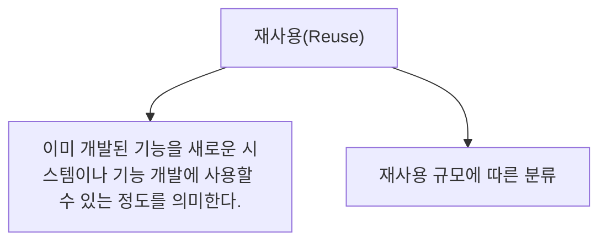

# 046 재사용(Reuse)

작성 기준일: 2026-05-02  
과목: `1과목 소프트웨어 설계`  
기준 PDF: `/Users/nes0903/Documents/study/정보처리기사/핵심요약집_2026_정보처리기사필기핵심요약.pdf`  
PDF 확인 위치: `7페이지`  
검색 보강: 공식/표준/고품질 참고 자료를 함께 확인하여 시험 중심으로 확장 정리

---

## 1. 한 줄 요약

- 재사용은 이미 개발된 기능이나 구성요소를 새로운 시스템 개발에 다시 활용할 수 있는 정도이며 함수/객체, 컴포넌트, 애플리케이션 규모로 나눌 수 있다.
- 이 챕터는 `모듈` 영역에 속한다.
- 시험에서는 정의, 핵심 키워드, 비슷한 개념과의 구분을 함께 묻는 경우가 많다.

---

## 2. PDF 기준 핵심

- 이미 개발된 기능을 새로운 시스템이나 기능 개발에 사용할 수 있는 정도를 의미한다.
- 재사용 규모에 따른 분류: 함수와 객체, 컴포넌트, 애플리케이션

- 위 항목은 PDF에서 직접 확인한 최소 암기 골격이다.
- 세부 설명은 이 골격을 기준으로 확장해서 이해하면 된다.

---

## 3. 개념 설명

- 재사용은 개발 비용과 시간을 줄이고 검증된 코드를 활용해 품질을 높일 수 있다.
- 함수/객체 재사용은 가장 작은 코드 단위의 재사용이다.
- 컴포넌트 재사용은 독립 배포/조립 가능한 기능 단위 재사용이다.
- 애플리케이션 재사용은 전체 시스템 또는 큰 응용 프로그램 단위의 재사용이다.
- 모듈 설계는 낮은 결합도, 높은 응집도, 명확한 인터페이스, 적절한 크기가 핵심이다.
- 결합도와 응집도는 순서 암기가 중요하다.

---

## 4. 핵심 포인트

- 문제를 풀 때는 먼저 지문 속 단서어를 찾고, 그 단서어가 어떤 개념을 가리키는지 연결한다.
- 정의형 문제는 표현이 조금 바뀌어도 핵심 의미가 같으면 같은 개념으로 판단한다.
- 옳고 그름 문제에서는 `항상`, `반드시`, `전혀`, `모두` 같은 극단 표현을 특히 조심한다.
- 이 챕터는 단독 암기보다 인접 챕터와 비교해 기억하면 정답률이 올라간다.

---

## 5. 시험에서 헷갈리는 비교

| 구분 | 핵심 |
|---|---|
| `함수/객체` | 작은 코드 단위 |
| `컴포넌트` | 조립 가능한 기능 단위 |
| `애플리케이션` | 전체 응용 시스템 단위 |

- 비교 문제는 이름보다 `역할`, `목적`, `사용 시점`, `장점/단점`을 기준으로 구분하면 안정적이다.

---

## 6. 예시 또는 암기 포인트

- 재사용 규모 = `함객-컴-앱`.

- 암기는 단어만 외우기보다 `정의 -> 특징 -> 예시 -> 반대 개념` 순서로 묶는 것이 좋다.

---

## 7. 빠른 복습

- 챕터명: `046 재사용(Reuse)`
- 소속 영역: `모듈`
- 자주 나오는 문제 유형:
  - 정의를 주고 개념명을 고르는 문제
  - 특징을 섞어 놓고 옳은/틀린 설명을 고르는 문제
  - 유사 개념과 비교하여 다른 하나를 찾는 문제

---

## 8. 참고 링크

- 기준 PDF: `/Users/nes0903/Documents/study/정보처리기사/핵심요약집_2026_정보처리기사필기핵심요약.pdf`
- [Q-Net 정보처리기사 종목 페이지](https://www.q-net.or.kr/crf005.do?id=crf00503s02&jmCd=1320&jmInfoDivCcd=B0)
- [GeeksforGeeks - Coupling and Cohesion](https://www.geeksforgeeks.org/software-engineering-coupling-and-cohesion/)
- [SEI - Quality Attribute Design Primitives](https://www.sei.cmu.edu/library/quality-attribute-design-primitives-and-the-attribute-driven-design-method/)
