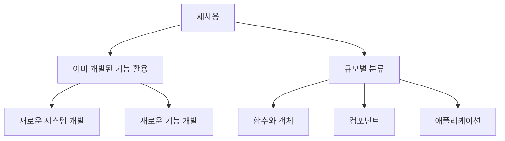
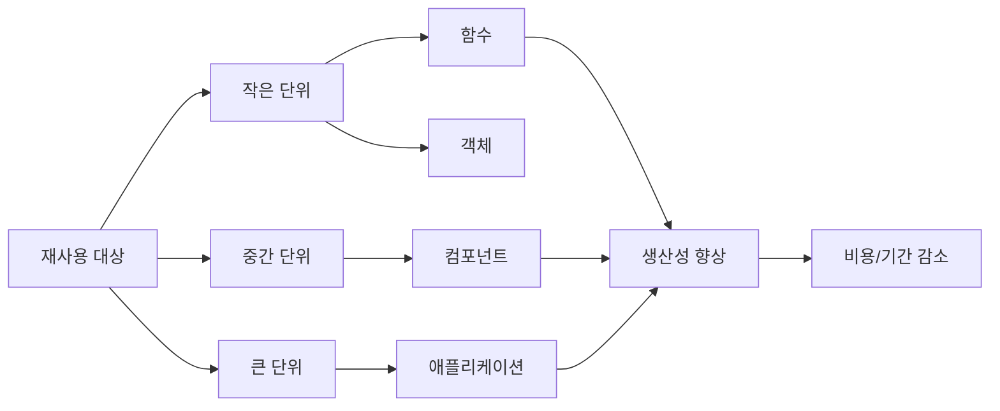
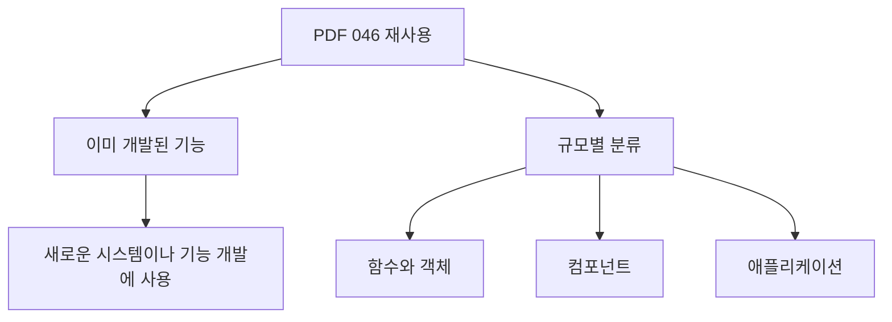
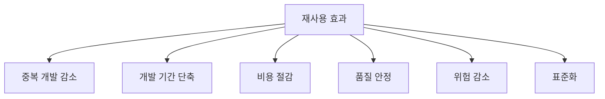
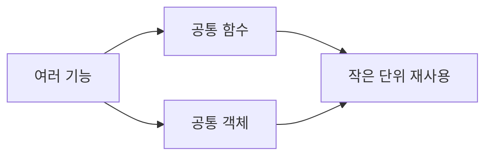
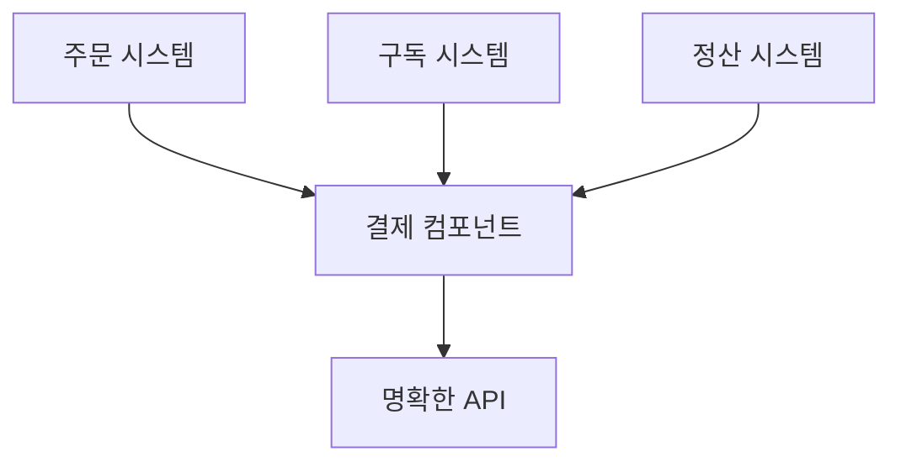
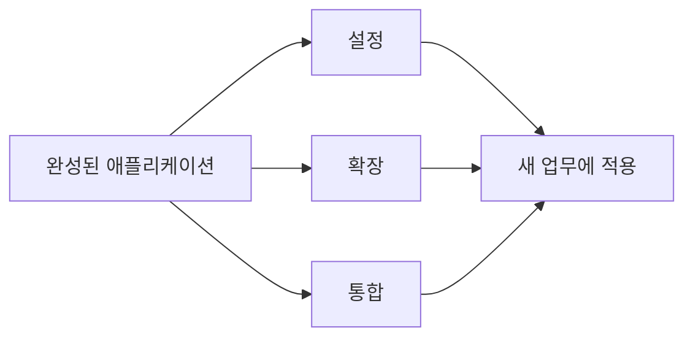
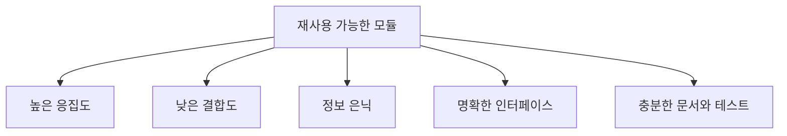
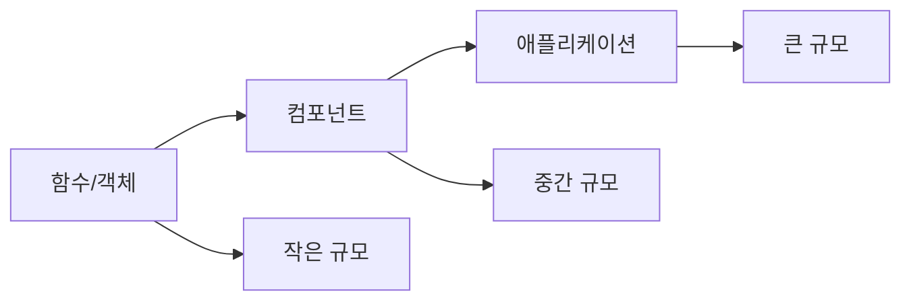

# 046 재사용(Reuse)

작성 기준일: 2026-05-02
검색/보강일: 2026-06-01
과목: `1과목 소프트웨어 설계`
기준 PDF: `/Users/nes0903/Documents/study/정보처리기사/핵심요약집_2026_정보처리기사필기핵심요약.pdf`
PDF 확인 위치: `7페이지`
주제별 검색 키워드: `software reuse function object component application`, `software reuse levels component reuse application reuse`, `component based software engineering reuse`

---

## 1. 한 줄 요약

- 재사용은 이미 개발된 기능을 새로운 시스템이나 기능 개발에 사용할 수 있는 정도를 의미한다.
- PDF 기준 재사용 규모는 `함수와 객체`, `컴포넌트`, `애플리케이션`으로 분류한다.
- 시험에서는 재사용의 정의, 규모별 분류, 재사용의 장점과 주의점을 함께 이해해야 한다.

---

## 2. 한눈에 보는 구조

- 재사용은 새로 만들지 않고 기존 산출물을 활용하여 개발 효율을 높이는 활동이다.
- 재사용 대상은 코드뿐 아니라 설계, 테스트, 문서, 아키텍처, 패턴, 데이터 모델까지 넓게 볼 수 있다.
- 정보처리기사 PDF에서는 재사용 규모 분류를 `함수와 객체`, `컴포넌트`, `애플리케이션`으로 제시한다.
- 규모가 커질수록 재사용 효과가 커질 수 있지만, 요구사항 적합성 검토도 더 중요해진다.

---

## 3. PDF 기준 핵심

- 재사용은 이미 개발된 기능을 새로운 시스템이나 기능 개발에 사용할 수 있는 정도를 의미한다.
- 재사용 규모에 따른 분류는 다음과 같다.
  - `함수와 객체`
  - `컴포넌트`
  - `애플리케이션`

- 위 문장은 기준 PDF에서 직접 확인해야 하는 최소 암기 골격이다.
- 시험에서는 `이미 개발된 기능`, `새로운 시스템`, `새로운 기능 개발`, `규모별 분류`가 핵심 단서이다.
- 분류 순서는 작은 단위에서 큰 단위로 `함수/객체 -> 컴포넌트 -> 애플리케이션`으로 외운다.

---

## 4. 검색으로 보강한 관점

- 소프트웨어 공학 자료에서는 재사용을 기존 소프트웨어 산출물을 새 개발에 활용하는 전략으로 설명한다.
- Ian Sommerville 계열의 소프트웨어 재사용 설명에서는 객체/함수 재사용, 컴포넌트 재사용, 애플리케이션 시스템 재사용 같은 수준을 구분한다.
- 컴포넌트 기반 소프트웨어 공학(CBSE)은 재사용 가능한 컴포넌트를 조립하여 시스템을 만드는 접근으로 설명된다.
- 재사용의 목적은 개발 기간 단축, 비용 절감, 품질 향상, 위험 감소이다.
- 다만 재사용 대상이 요구사항과 맞지 않거나, 문서와 인터페이스가 부족하거나, 의존성이 너무 크면 오히려 비용이 증가할 수 있다.

---

## 5. 개념 설명

### 5.1 재사용의 의미

- 재사용은 이미 만들어진 것을 다시 사용하는 것이다.
- 소프트웨어 개발에서는 기존 기능, 코드, 설계, 컴포넌트, 애플리케이션을 새 시스템에 활용하는 것을 말한다.
- 단순 복사와 재사용은 다르다.
- 단순 복사는 같은 코드를 붙여 넣어 중복을 만드는 행위일 수 있다.
- 재사용은 검증된 기능을 명확한 인터페이스와 관리 체계 안에서 다시 쓰는 활동이다.
- 좋은 재사용은 다음 조건을 만족한다.
  - 기능이 명확하다.
  - 인터페이스가 안정적이다.
  - 문서가 있다.
  - 테스트되어 있다.
  - 변경 이력이 관리된다.
  - 새 요구사항과 적합하다.

### 5.2 재사용이 필요한 이유

- 이미 검증된 기능을 사용하면 새로 개발하면서 발생할 수 있는 오류를 줄일 수 있다.
- 같은 기능을 여러 팀이 각각 만들지 않으므로 중복 개발을 줄인다.
- 개발 기간과 비용을 줄일 수 있다.
- 재사용 대상이 충분히 테스트되어 있다면 품질이 안정될 수 있다.
- 공통 컴포넌트를 사용하면 시스템 간 인터페이스와 동작을 표준화하기 쉽다.
- 조직 차원에서는 재사용 자산을 관리하는 저장소, 문서, 버전 관리가 필요하다.

---

## 6. 규모별 재사용 분류

| 규모 | 재사용 단위 | 예시 | 장점 | 주의점 |
|---|---|---|---|---|
| 함수와 객체 | 작은 기능 또는 객체 | 날짜 계산 함수, 문자열 유틸, `User` 객체 | 적용이 쉽고 세밀함 | 너무 작은 단위는 관리 비용 증가 |
| 컴포넌트 | 명확한 인터페이스를 가진 기능 단위 | 인증 컴포넌트, 결제 컴포넌트, 파일 업로드 모듈 | 조립/교체가 쉬움 | 인터페이스와 버전 관리 필요 |
| 애플리케이션 | 완성된 응용 시스템 또는 패키지 | ERP, CRM, 그룹웨어, 쇼핑몰 패키지 | 큰 범위의 기능을 빠르게 확보 | 요구사항 맞춤 설정과 통합 비용 발생 |

- `함수와 객체`는 가장 작은 규모의 재사용이다.
- `컴포넌트`는 독립적인 기능과 명확한 인터페이스를 갖는 재사용 단위이다.
- `애플리케이션`은 완성된 시스템을 설정, 확장, 통합하여 사용하는 큰 규모의 재사용이다.
- 시험에서는 규모 이름을 그대로 묻는 경우가 많으므로 세 용어를 정확히 외운다.

---

## 7. 함수와 객체 재사용

- 함수와 객체 재사용은 가장 세밀한 수준의 재사용이다.
- 예시는 다음과 같다.
  - 날짜 차이를 계산하는 함수
  - 이메일 형식을 검증하는 함수
  - 금액을 통화 형식으로 변환하는 함수
  - 사용자 정보를 표현하는 객체
  - 좌표나 기간을 표현하는 값 객체
- 작은 단위라 적용이 쉽고 범용성이 높을 수 있다.
- 하지만 함수와 객체가 너무 많고 관리가 되지 않으면 찾기 어렵고 중복이 생긴다.
- 재사용성을 높이려면 함수명, 매개변수, 반환값, 예외 규칙이 명확해야 한다.

---

## 8. 컴포넌트 재사용

- 컴포넌트 재사용은 명확한 인터페이스를 가진 기능 단위를 여러 시스템에서 사용하는 방식이다.
- 컴포넌트는 내부 구현을 숨기고 외부에는 필요한 기능만 제공해야 한다.
- 예시는 다음과 같다.
  - 인증 컴포넌트
  - 결제 컴포넌트
  - 알림 컴포넌트
  - 파일 업로드 컴포넌트
  - 리포트 생성 컴포넌트
- 컴포넌트 재사용은 함수 재사용보다 큰 기능을 한 번에 활용할 수 있다.
- 인터페이스가 안정적이면 내부 구현을 바꿔도 사용하는 쪽의 변경을 줄일 수 있다.
- 반대로 인터페이스가 자주 바뀌거나 문서가 부족하면 재사용 비용이 커진다.

---

## 9. 애플리케이션 재사용

- 애플리케이션 재사용은 이미 완성된 응용 시스템을 새 업무나 조직에 맞게 활용하는 방식이다.
- 예시는 다음과 같다.
  - ERP 패키지 도입
  - CRM 시스템 도입
  - 그룹웨어 도입
  - 쇼핑몰 솔루션 도입
  - 오픈소스 CMS를 설정하여 서비스 구축
- 애플리케이션 재사용은 큰 기능 범위를 빠르게 확보할 수 있다.
- 하지만 업무 요구사항과 애플리케이션 기능이 맞지 않으면 커스터마이징 비용이 커진다.
- 기존 시스템과 데이터 연동, 권한, 보안, 운영 방식도 함께 검토해야 한다.

---

## 10. 재사용성과 모듈 설계

- 재사용은 모듈 설계 품질과 직접 연결된다.
- 높은 응집도는 모듈이 하나의 목적에 집중하게 하므로 재사용하기 쉽다.
- 낮은 결합도는 특정 환경이나 다른 모듈에 과도하게 의존하지 않게 한다.
- 정보 은닉은 내부 구현 변경이 사용자에게 전파되는 것을 줄인다.
- 명확한 인터페이스는 재사용자가 어떻게 호출해야 하는지 쉽게 알게 한다.
- 테스트와 문서는 재사용 대상의 신뢰도를 높인다.

---

## 11. 재사용의 장점과 한계

| 구분 | 내용 |
|---|---|
| 장점 | 개발 기간 단축, 비용 절감, 품질 향상, 위험 감소, 표준화, 생산성 향상 |
| 한계 | 요구사항 불일치, 과도한 일반화, 버전 충돌, 라이선스 문제, 보안 취약점 전파, 문서 부족 |

- 재사용은 무조건 좋은 것이 아니다.
- 재사용하려는 기능이 현재 요구사항과 맞는지 먼저 확인해야 한다.
- 재사용을 위해 기존 컴포넌트를 과도하게 수정해야 한다면 새로 만드는 것보다 비용이 클 수 있다.
- 외부 라이브러리나 애플리케이션을 재사용할 때는 라이선스, 보안 업데이트, 유지보수 상태를 확인해야 한다.
- 내부 재사용 자산도 버전 관리와 변경 영향 분석이 필요하다.

---

## 12. 시험 포인트

- 재사용은 이미 개발된 기능을 새로운 시스템이나 기능 개발에 사용하는 정도이다.
- PDF 기준 규모별 분류는 `함수와 객체`, `컴포넌트`, `애플리케이션`이다.
- 작은 단위는 함수와 객체이다.
- 중간 단위는 컴포넌트이다.
- 큰 단위는 애플리케이션이다.
- 재사용의 장점은 개발 기간 단축, 비용 절감, 품질 향상, 생산성 향상이다.
- 재사용 가능한 구조를 만들려면 높은 응집도, 낮은 결합도, 명확한 인터페이스가 중요하다.
- 무조건 재사용이 좋은 것은 아니며, 적합성 검토가 필요하다.

---

## 13. 헷갈리는 비교

| 구분 | 핵심 | 시험 단서 |
|---|---|---|
| 함수와 객체 재사용 | 작은 단위의 코드/객체 재사용 | 함수, 객체, 클래스, 메서드 |
| 컴포넌트 재사용 | 명확한 인터페이스를 가진 기능 단위 재사용 | 조립, 교체, API |
| 애플리케이션 재사용 | 완성된 시스템이나 패키지 재사용 | ERP, CRM, 패키지, 제품 |
| 모듈화 | 시스템을 기능 단위로 나눔 | 분리, 독립 기능 |
| 라이브러리 | 재사용 가능한 함수/클래스 묶음 | API 호출, 공통 기능 |
| 프레임워크 | 재사용 가능한 구조와 제어 흐름 제공 | 확장 지점, 골격 코드 |

- `재사용 규모`를 묻는 문제는 PDF의 세 항목을 먼저 본다.
- `컴포넌트`는 단순 함수보다 크고, 애플리케이션보다 작다.
- `애플리케이션 재사용`은 소스 일부가 아니라 완성된 시스템 단위에 가깝다.

---

## 14. 예시

### 14.1 쇼핑몰 개발에서의 재사용

| 재사용 대상 | 규모 | 설명 |
|---|---|---|
| 이메일 형식 검증 함수 | 함수와 객체 | 여러 입력 화면에서 같은 검증 함수 사용 |
| 주소 값 객체 | 함수와 객체 | 배송지, 청구지 등에서 같은 객체 사용 |
| 결제 컴포넌트 | 컴포넌트 | 주문, 구독, 정산 기능에서 공통 결제 API 사용 |
| 알림 컴포넌트 | 컴포넌트 | 이메일, SMS, 푸시 발송 기능 재사용 |
| 쇼핑몰 패키지 | 애플리케이션 | 완성된 쇼핑몰 솔루션을 설정해 사용 |

### 14.2 재사용 판단 질문

- 이 기능은 현재 요구사항과 맞는가?
- 인터페이스가 명확한가?
- 테스트가 되어 있는가?
- 문서가 있는가?
- 버전과 변경 이력이 관리되는가?
- 외부 의존성이나 라이선스 문제가 없는가?
- 재사용을 위한 수정 비용이 새 개발보다 작은가?

---

## 15. 암기 포인트

- 암기 문장: `재사용 규모는 함수와 객체, 컴포넌트, 애플리케이션`
- 재사용 정의 암기: `이미 개발된 기능을 새로운 시스템이나 기능 개발에 사용`
- 장점 암기: `기간 단축, 비용 절감, 품질 향상, 생산성 향상`
- 설계 조건 암기: `높은 응집도, 낮은 결합도, 명확한 인터페이스`

---

## 16. 빠른 복습

- 재사용은 이미 개발된 기능을 새로운 시스템이나 기능 개발에 사용할 수 있는 정도이다.
- PDF 기준 재사용 규모는 `함수와 객체`, `컴포넌트`, `애플리케이션`이다.
- 함수와 객체는 작은 단위 재사용이다.
- 컴포넌트는 명확한 인터페이스를 가진 기능 단위 재사용이다.
- 애플리케이션은 완성된 시스템 단위 재사용이다.
- 재사용은 개발 기간과 비용을 줄이고 품질을 높일 수 있지만, 요구사항 적합성과 버전 관리를 확인해야 한다.

---

## 17. 참고 링크

- 기준 PDF: `/Users/nes0903/Documents/study/정보처리기사/핵심요약집_2026_정보처리기사필기핵심요약.pdf`
- [Q-Net - 정보처리기사 종목 정보](https://www.q-net.or.kr/crf005.do?id=crf00503&jmCd=1320)
- [CS 530 Software Engineering Notes - Software Reuse](https://cs.ccsu.edu/~stan/classes/CS530/Notes18/15-SoftwareReuse.html)
- [Johannes Kepler University - Software Engineering with Reusable Components](https://se.jku.at/software-engineering-with-reusable-components/)
- [Communications of the ACM - Software Reuse Strategies and Component Markets](https://cacm.acm.org/research/software-reuse-strategies-and-component-markets/)
- [ISO/IEC 25010 품질 모델 - ISO 25000](https://iso25000.com/index.php/en/iso-25000-standards/iso-25010)
