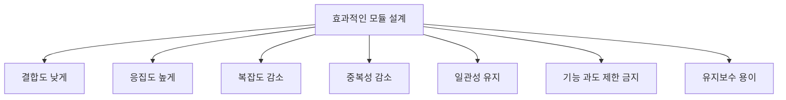
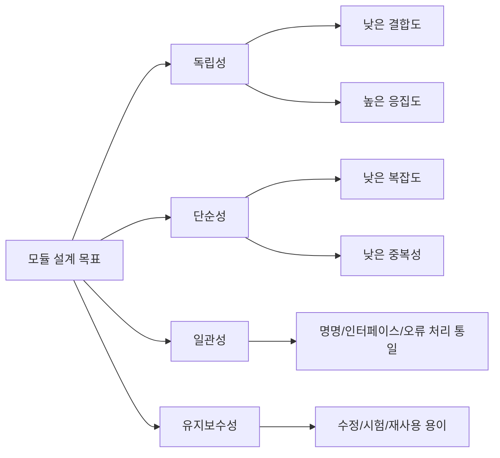
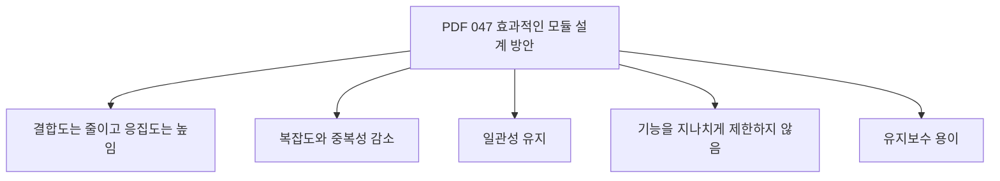
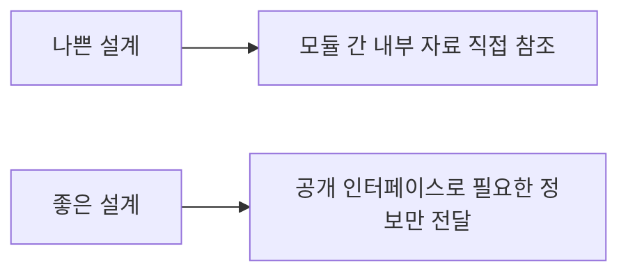
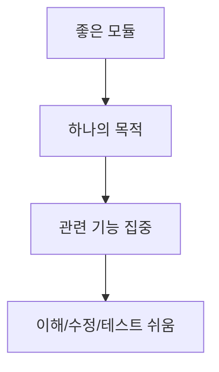
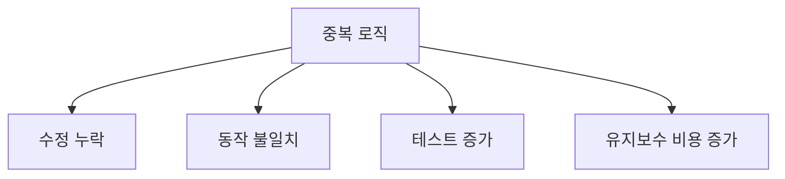
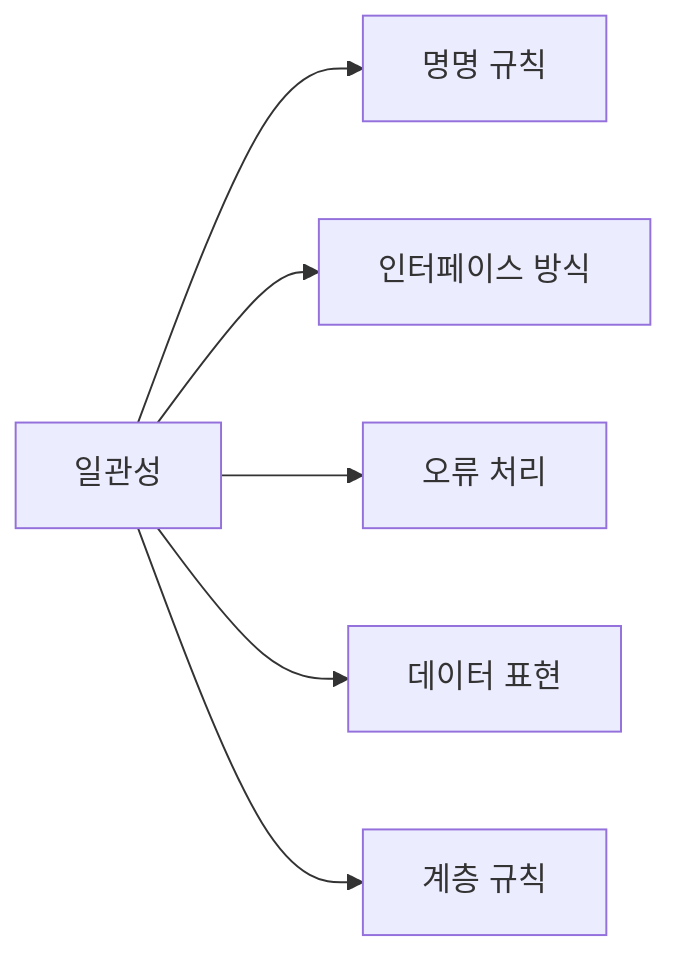
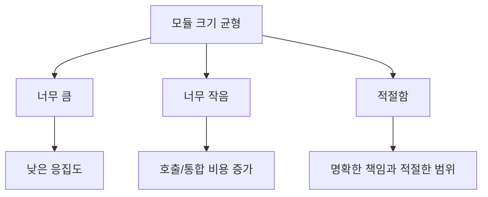
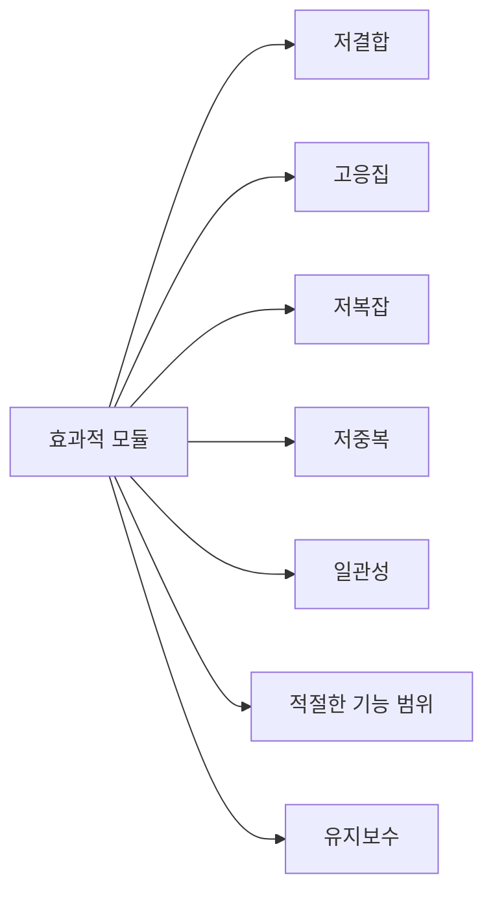

# 047 효과적인 모듈 설계 방안

작성 기준일: 2026-05-02
검색/보강일: 2026-06-01
과목: `1과목 소프트웨어 설계`
기준 PDF: `/Users/nes0903/Documents/study/정보처리기사/핵심요약집_2026_정보처리기사필기핵심요약.pdf`
PDF 확인 위치: `7페이지`
주제별 검색 키워드: `effective modular design low coupling high cohesion`, `module design guidelines maintainability`, `software detailed design minimal coupling maximum cohesion`

---

## 1. 한 줄 요약

- 효과적인 모듈 설계는 `결합도는 낮추고 응집도는 높이며`, 복잡도와 중복성을 줄이고 일관성을 유지하는 방향이다.
- PDF 기준 핵심에는 `모듈 기능이 지나치게 제한적이어서는 안 된다`는 함정성 문장도 포함된다.
- 시험에서는 좋은 설계 방향과 나쁜 설계 방향을 반대로 제시하는 보기를 구분해야 한다.

---

## 2. 한눈에 보는 구조

- 효과적인 모듈 설계의 핵심은 모듈 독립성을 높이는 것이다.
- 모듈 독립성은 결합도와 응집도로 판단한다.
- 복잡도와 중복성이 낮으면 코드를 이해하고 수정하기 쉽다.
- 일관성이 있으면 여러 모듈을 예측 가능한 방식으로 사용할 수 있다.
- 유지보수가 쉬운 모듈은 변경 영향이 작고 테스트하기 쉽다.

---

## 3. PDF 기준 핵심

- 결합도는 줄이고 응집도는 높인다.
- 복잡도와 중복성을 줄인다.
- 일관성을 유지시킨다.
- 모듈의 기능은 지나치게 제한적이어서는 안 된다.
- 유지보수가 용이해야 한다.

- 위 다섯 문장이 기준 PDF에서 직접 확인해야 하는 최소 암기 골격이다.
- 특히 `기능은 지나치게 제한적이어서는 안 된다`는 표현은 자주 놓치기 쉽다.
- 좋은 모듈은 무조건 작게 나눈 모듈이 아니라, 책임이 명확하고 적절한 크기를 가진 모듈이다.

---

## 4. 검색으로 보강한 관점

- NASA 소프트웨어 공학 핸드북의 상세 설계 항목은 모듈화, 최소 결합, 최대 응집이 이해성, 적응성, 유지보수성을 높인다고 설명한다.
- SEI의 소프트웨어 설계 자료에서도 모듈성, 응집도, 결합도는 설계 품질 판단의 핵심 요소로 다뤄진다.
- Microsoft와 여러 아키텍처 자료에서도 좋은 설계는 high cohesion과 loose coupling을 지향한다고 설명한다.
- 시험에서는 이러한 원리를 PDF 표현인 `결합도 감소`, `응집도 증가`, `복잡도/중복성 감소`, `일관성`, `유지보수 용이`로 환원해서 판단한다.

---

## 5. 효과적인 모듈 설계의 핵심

### 5.1 결합도는 줄인다

- 결합도는 모듈 간 의존 정도이다.
- 결합도가 높으면 한 모듈의 변경이 다른 모듈로 쉽게 전파된다.
- 효과적인 모듈 설계는 모듈 간 직접 의존을 줄이고 명확한 인터페이스로 연결한다.
- 다음 설계는 결합도를 높인다.
  - 다른 모듈의 내부 변수 직접 수정
  - 전역 데이터 공유
  - 제어 플래그로 상대 모듈 내부 흐름 지시
  - 외부 형식에 여러 모듈이 강하게 묶임
- 다음 설계는 결합도를 낮춘다.
  - 필요한 자료만 전달
  - 내부 구현 은닉
  - 인터페이스 안정화
  - 의존 방향 정리

### 5.2 응집도는 높인다

- 응집도는 모듈 내부 요소들이 얼마나 관련되어 있는지를 나타낸다.
- 응집도가 낮으면 하나의 모듈이 여러 책임을 가지며 변경 이유가 많아진다.
- 응집도가 높으면 모듈 이름과 역할이 분명해지고 테스트 범위도 명확해진다.
- 효과적인 모듈은 기능적 응집도에 가까워야 한다.
- 예를 들어 `OrderTotalCalculator`가 주문 총액 계산만 담당하면 응집도가 높다.
- 반대로 `CommonUtil`이 결제, 메일, 파일, 날짜, 통계까지 모두 처리하면 응집도가 낮다.

---

## 6. 복잡도와 중복성 감소

### 6.1 복잡도 감소

- 복잡도는 모듈을 이해하고 수정하는 데 필요한 정신적 부담이다.
- 복잡도는 다음 요인으로 증가한다.
  - 과도한 조건 분기
  - 깊은 중첩
  - 많은 예외 흐름
  - 많은 하위 모듈 직접 호출
  - 불명확한 데이터 흐름
  - 모듈 간 순환 의존
- 복잡도를 줄이는 방법은 다음과 같다.
  - 책임을 분리한다.
  - 조건 분기를 단순화한다.
  - 중복 로직을 제거한다.
  - 인터페이스를 명확히 한다.
  - 의미 있는 이름을 사용한다.
  - 테스트 가능한 단위로 나눈다.

### 6.2 중복성 감소

- 중복성은 같은 로직이나 데이터 정의가 여러 곳에 반복되는 정도이다.
- 중복이 많으면 하나를 수정할 때 다른 위치를 놓치기 쉽다.
- 같은 규칙을 여러 모듈이 각각 구현하면 시간이 지나면서 동작이 달라질 수 있다.
- 예를 들어 할인 계산 로직이 주문 화면, 관리자 화면, 배치 프로그램에 각각 복사되어 있으면 중복성이 높다.
- 공통 규칙은 적절한 모듈로 분리하고, 공개 인터페이스를 통해 사용하게 하는 것이 좋다.
- 다만 무리한 공통화는 오히려 결합도와 복잡도를 높일 수 있으므로 요구 변화 방향을 고려해야 한다.

---

## 7. 일관성 유지

- 일관성은 모듈들이 비슷한 문제를 비슷한 방식으로 해결하도록 하는 성질이다.
- 일관성이 있으면 새로운 모듈을 읽을 때 예측 가능성이 높아진다.
- 일관성을 유지해야 하는 영역은 다음과 같다.
  - 모듈 이름
  - 함수 이름
  - 매개변수 순서
  - 반환값 형태
  - 오류 처리 방식
  - 로그 형식
  - 계층 간 호출 방향
  - 데이터 모델 표현
- 예를 들어 어떤 모듈은 오류를 예외로 던지고, 어떤 모듈은 `null`을 반환하고, 어떤 모듈은 숫자 코드를 반환하면 사용자가 혼란스러워진다.
- 일관성은 유지보수성과 재사용성을 높이는 기반이다.

---

## 8. 기능을 지나치게 제한하지 않기

- PDF의 `모듈의 기능은 지나치게 제한적이어서는 안 된다`는 문장은 중요하다.
- 좋은 모듈은 무조건 작아야 한다는 뜻이 아니다.
- 모듈이 너무 크면 여러 책임이 섞여 응집도가 낮아진다.
- 반대로 모듈이 너무 작으면 다음 문제가 생길 수 있다.
  - 호출 관계가 과도하게 늘어난다.
  - Fan-Out이 커질 수 있다.
  - 단순 기능 하나를 이해하려고 여러 파일을 이동해야 한다.
  - 인터페이스 관리 비용이 커진다.
  - 성능이나 트랜잭션 관리가 복잡해질 수 있다.
- 따라서 모듈은 하나의 명확한 목적을 가지되, 실제로 의미 있는 기능 단위를 담아야 한다.

---

## 9. 유지보수 용이성

- 유지보수가 용이하다는 것은 요구사항 변경, 오류 수정, 기능 추가가 쉬운 상태를 말한다.
- 유지보수하기 좋은 모듈은 다음 특징을 가진다.
  - 역할이 명확하다.
  - 내부 구현이 숨겨져 있다.
  - 외부 인터페이스가 안정적이다.
  - 테스트가 가능하다.
  - 변경 영향 범위가 작다.
  - 중복 로직이 적다.
  - 문서와 이름만으로 사용법을 파악하기 쉽다.
- 유지보수성이 낮은 모듈은 작은 변경에도 여러 모듈을 연쇄적으로 수정해야 한다.
- 효과적인 모듈 설계의 최종 목적은 결국 개발 이후의 변경 비용을 낮추는 것이다.

---

## 10. PDF 항목별 오답 방향

| PDF 기준 | 좋은 방향 | 나쁜 보기 예 |
|---|---|---|
| 결합도는 줄임 | 모듈 간 의존 최소화 | 결합도를 높인다 |
| 응집도는 높임 | 모듈 내부 관련성 강화 | 응집도를 낮춘다 |
| 복잡도 감소 | 제어 흐름과 호출 관계 단순화 | 복잡한 분기를 그대로 둔다 |
| 중복성 감소 | 반복 로직 제거 | 같은 로직을 여러 모듈에 복사한다 |
| 일관성 유지 | 규칙과 인터페이스 통일 | 모듈마다 다른 규칙 사용 |
| 기능 과도 제한 금지 | 적절한 기능 범위 | 모듈을 무조건 작게 쪼갠다 |
| 유지보수 용이 | 변경 영향 감소 | 수정과 테스트가 어렵다 |

- 시험에서는 좋은 설계 방안을 물으면서 나쁜 방향을 섞어 놓을 수 있다.
- `결합도 증가`, `응집도 감소`, `중복성 증가`, `복잡도 증가`는 대체로 틀린 방향이다.
- `기능을 극단적으로 제한한다`는 보기 역시 PDF 표현과 어긋날 수 있다.

---

## 11. 시험 포인트

- 가장 중요한 문장: `결합도는 줄이고 응집도는 높인다`.
- 복잡도와 중복성은 줄인다.
- 일관성은 유지한다.
- 모듈의 기능은 지나치게 제한적이면 안 된다.
- 유지보수가 용이해야 한다.
- 좋은 모듈은 내부 책임이 명확하고 외부 의존이 적다.
- 모듈을 무조건 많이 나누는 것이 좋은 설계는 아니다.
- 결합도와 응집도의 좋고 나쁨 방향을 반대로 외우지 않는다.

---

## 12. 헷갈리는 비교

| 구분 | 의미 | 좋은 방향 |
|---|---|---|
| 결합도 | 모듈 간 의존 정도 | 낮게 |
| 응집도 | 모듈 내부 관련 정도 | 높게 |
| 복잡도 | 이해와 수정의 어려움 | 낮게 |
| 중복성 | 같은 로직이나 데이터의 반복 | 낮게 |
| 일관성 | 규칙과 방식의 통일성 | 높게 |
| 모듈 기능 범위 | 모듈이 담당하는 기능의 크기 | 지나치게 제한하지 않음 |
| 유지보수성 | 변경과 수정의 쉬움 | 높게 |

- 결합도와 응집도는 모두 `높게`가 아니다.
- 결합도는 낮게, 응집도는 높게가 정답 방향이다.
- 모듈 기능 범위는 `작을수록 무조건 좋다`가 아니다.
- 중복 제거도 과도하면 불필요한 공통 모듈이 생겨 결합도가 올라갈 수 있다.

---

## 13. 예시

### 13.1 나쁜 설계

- 주문 모듈이 결제 모듈의 내부 변수에 직접 접근한다.
- 할인 계산 로직이 화면, API, 배치에 각각 복사되어 있다.
- 오류 처리 방식이 모듈마다 다르다.
- `CommonService` 하나가 주문, 결제, 배송, 알림을 모두 처리한다.
- 작은 기능 하나를 수행하기 위해 15개의 작은 모듈을 순서대로 호출해야 한다.

### 13.2 개선 방향

- 결제 모듈은 공개 API를 통해서만 사용한다.
- 할인 계산 로직은 하나의 정책 모듈로 모은다.
- 오류 처리 형식을 통일한다.
- 주문, 결제, 배송, 알림 책임을 분리한다.
- 너무 작은 모듈은 의미 있는 책임 단위로 묶어 호출 관계를 단순화한다.

---

## 14. 암기 포인트

- 암기 문장: `저결합, 고응집, 저복잡, 저중복, 일관성, 적절한 기능, 유지보수`
- PDF 직접 표현:
  - 결합도는 줄이고 응집도는 높인다.
  - 복잡도와 중복성을 줄인다.
  - 일관성을 유지시킨다.
  - 모듈의 기능은 지나치게 제한적이어서는 안 된다.
  - 유지보수가 용이해야 한다.

---

## 15. 빠른 복습

- 효과적인 모듈 설계는 결합도를 낮추고 응집도를 높인다.
- 복잡도와 중복성은 낮춘다.
- 일관성은 유지한다.
- 모듈의 기능은 지나치게 제한하지 않는다.
- 유지보수가 쉬워야 한다.
- 좋은 모듈은 내부는 하나의 목적에 집중하고, 외부와는 명확한 인터페이스로 연결된다.

---

## 16. 참고 링크

- 기준 PDF: `/Users/nes0903/Documents/study/정보처리기사/핵심요약집_2026_정보처리기사필기핵심요약.pdf`
- [Q-Net - 정보처리기사 종목 정보](https://www.q-net.or.kr/crf005.do?id=crf00503&jmCd=1320)
- [NASA Software Engineering Handbook - Detailed Design](https://swehb.nasa.gov/x/KwT7)
- [SEI - Introduction to Software Design](https://www.sei.cmu.edu/documents/1539/1989_007_001_15689.pdf)
- [Microsoft Learn - Design for evolution](https://learn.microsoft.com/en-us/azure/architecture/guide/design-principles/design-for-evolution)
- [TechTarget - High cohesion and low coupling](https://www.techtarget.com/searchapparchitecture/tip/The-fundamentals-of-achieving-high-cohesion-and-low-coupling)

<!-- study-links:start -->
## 관련 문서

- `트랜잭션`: [[ACID-트랜잭션/ACID-트랜잭션|ACID 트랜잭션 상세 정리]]
- `모듈화`: [[정보처리기사/1과목 소프트웨어 설계/026 모듈화/026 모듈화|026 모듈화]]
<!-- study-links:end -->
