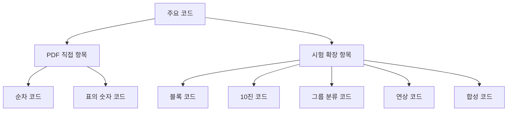
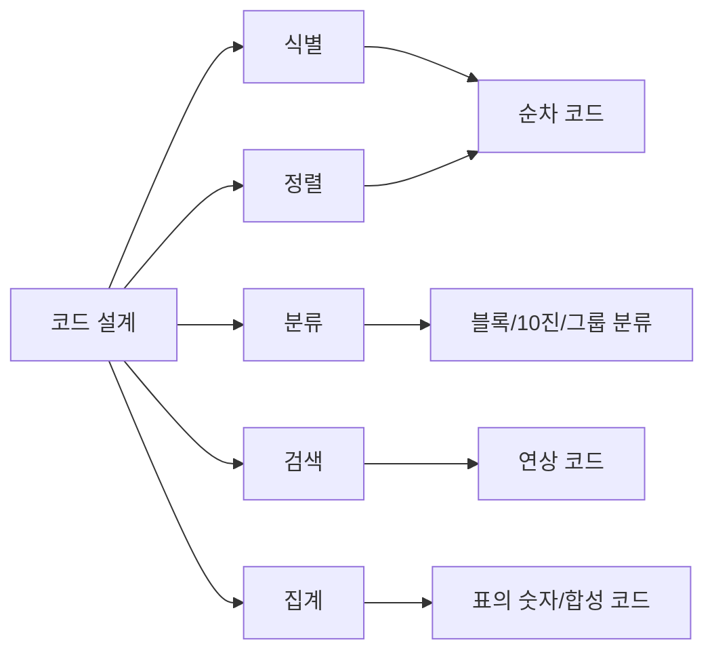
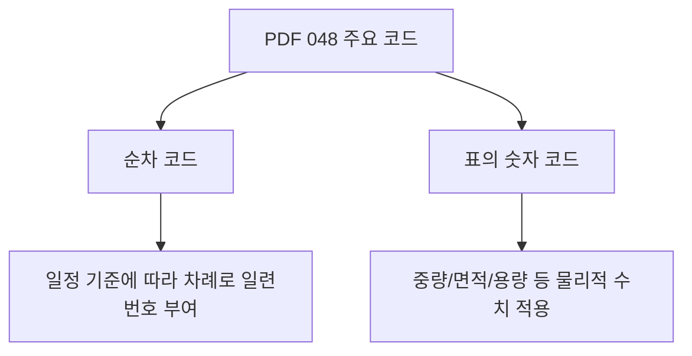
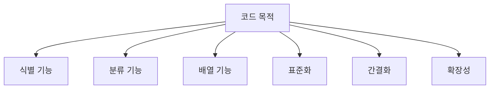
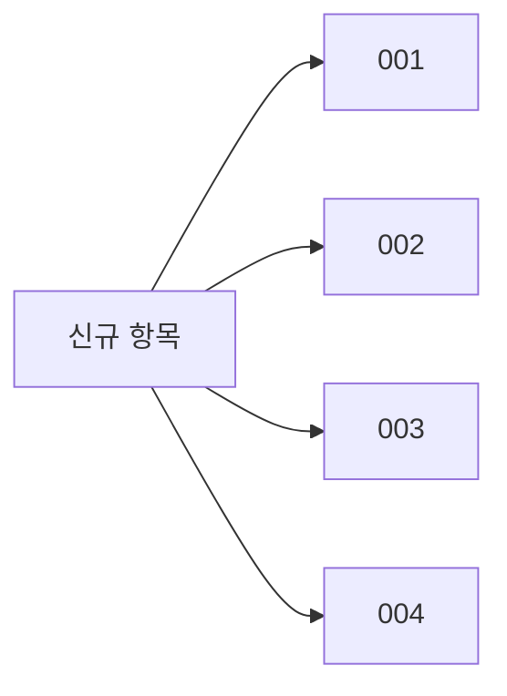
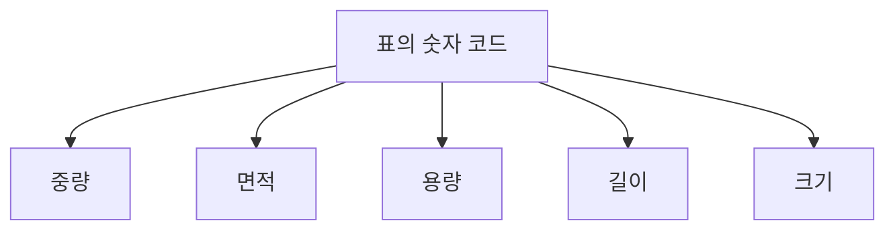
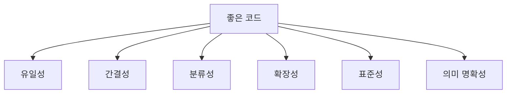
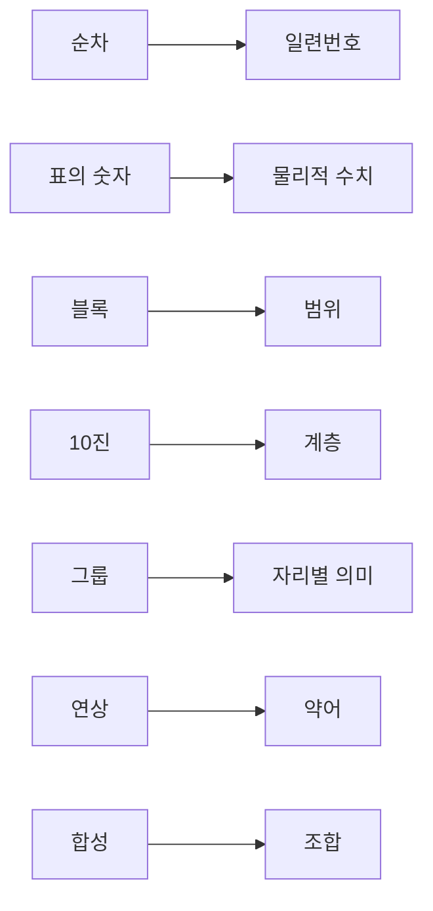

# 048 주요 코드

작성 기준일: 2026-05-02
검색/보강일: 2026-06-01
과목: `1과목 소프트웨어 설계`
기준 PDF: `/Users/nes0903/Documents/study/정보처리기사/핵심요약집_2026_정보처리기사필기핵심요약.pdf`
PDF 확인 위치: `7페이지`
주제별 검색 키워드: `정보처리기사 주요 코드 순차 코드 표의 숫자 코드`, `sequence code significant digit code mnemonic code block code`, `data element coding standard mnemonic significant code`

---

## 1. 한 줄 요약

- 코드는 자료를 식별, 분류, 배열, 집계, 검색하기 쉽게 일정한 규칙에 따라 부여한 기호 체계이다.
- PDF 기준 직접 핵심은 `순차 코드=차례로 일련번호 부여`, `표의 숫자 코드=중량/면적/용량 등 물리적 수치 적용`이다.
- 시험 대비로 블록 코드, 10진 코드, 그룹 분류 코드, 연상 코드, 합성 코드까지 단서어 중심으로 함께 정리한다.

---

## 2. 한눈에 보는 구조

- 코드는 데이터를 사람과 시스템이 다루기 쉽게 짧은 문자, 숫자, 기호로 표현하는 방식이다.
- 좋은 코드는 대상이 유일하게 식별되고, 분류와 정렬이 쉬우며, 확장 가능해야 한다.
- 코드의 종류는 `어떤 규칙으로 코드를 부여하는가`에 따라 구분한다.
- 정보처리기사에서는 각 코드의 장단점보다 `단서어와 코드 종류의 연결`이 중요하다.

---

## 3. PDF 기준 핵심

- `순차 코드`
  - 일정 기준에 따라서 차례로 일련번호를 부여하는 방법이다.
- `표의 숫자 코드`
  - 코드화 대상 항목의 중량, 면적, 용량 등의 물리적 수치를 적용시키는 방법이다.

- 위 두 항목이 기준 PDF에서 직접 확인되는 최소 암기 골격이다.
- PDF에 직접 나온 항목은 시험 판단에서 최우선으로 둔다.
- 다른 코드 종류는 시험 이해를 돕기 위한 확장 정리이며, PDF 직접 항목과 충돌하면 PDF 표현을 우선한다.

---

## 4. 검색으로 보강한 관점

- 정보처리기사 코드 설계 자료에서는 순차 코드, 블록 코드, 10진 코드, 그룹 분류 코드, 연상 코드, 표의 숫자 코드, 합성 코드가 함께 정리되는 경우가 많다.
- 데이터 표준화 자료에서는 코드가 데이터 요소 값을 표준화하고 표현하는 데 사용된다고 설명한다.
- `mnemonic code`는 코드 자체가 의미를 연상시키는 약어나 문자 조합을 사용하는 방식으로 설명된다.
- `significant digit code`는 코드 안에 물리적 수치나 의미 있는 숫자를 반영하는 방식으로 설명된다.
- 시험에서는 이론적 배경보다 `차례`, `범위`, `계층`, `자리별 의미`, `약어`, `물리적 수치`, `조합` 같은 단서어가 중요하다.

---

## 5. 코드 설계의 목적

- 코드는 데이터를 짧고 일정한 형태로 표현하기 위해 사용한다.
- 예를 들어 상품명을 매번 긴 문자열로 저장하는 대신 `PRD-0001` 같은 코드를 부여하면 검색과 정렬이 쉬워진다.
- 코드의 주요 목적은 다음과 같다.
  - 대상 식별
  - 항목 분류
  - 정렬과 배열
  - 집계와 통계 처리
  - 입력 오류 감소
  - 표준화
  - 시스템 간 데이터 교환
- 코드 설계가 나쁘면 코드가 중복되거나 의미가 모호해져 데이터 품질 문제가 생긴다.

---

## 6. PDF 직접 항목 상세

### 6.1 순차 코드

- 순차 코드는 일정 기준에 따라 차례로 일련번호를 부여하는 방법이다.
- 예시는 다음과 같다.
  - 고객 코드: `C0001`, `C0002`, `C0003`
  - 주문 번호: `ORD-000001`, `ORD-000002`
  - 사원 번호: `EMP-1001`, `EMP-1002`
- 장점은 단순하고 부여하기 쉽다는 점이다.
- 단점은 코드 자체만 보고 대상의 분류나 속성을 알기 어렵다는 점이다.
- 시험 단서는 다음과 같다.
  - 차례
  - 일련번호
  - 순서대로 부여
  - 일정 기준
  - 001, 002, 003

### 6.2 표의 숫자 코드

- 표의 숫자 코드는 코드화 대상 항목의 물리적 수치를 코드에 적용하는 방법이다.
- PDF는 물리적 수치의 예로 `중량`, `면적`, `용량`을 제시한다.
- 예시는 다음과 같다.
  - 용량 500ml 상품에 `500`을 포함
  - 10kg 포장 단위에 `10K`를 포함
  - 30cm 길이 제품에 `030`을 포함
  - 면적 20㎡ 단위에 `020`을 포함
- 장점은 코드만 보고 물리적 특성을 어느 정도 알 수 있다는 점이다.
- 단점은 물리적 수치가 바뀌거나 여러 속성을 함께 표현해야 할 때 코드가 복잡해질 수 있다는 점이다.
- 시험 단서는 다음과 같다.
  - 중량
  - 면적
  - 용량
  - 길이
  - 물리적 수치
  - 수치를 코드에 적용

---

## 7. 시험 확장 코드 종류

| 코드 종류 | 핵심 정의 | 예시 | 시험 단서 |
|---|---|---|---|
| 순차 코드 | 차례로 일련번호 부여 | `001`, `002`, `003` | 일련번호, 순서 |
| 블록 코드 | 공통성 있는 항목별로 코드 범위를 할당 | `1000~1999=식품` | 블록, 범위, 구간 |
| 10진 코드 | 10진 분할 방식으로 대/중/소분류 | `1=총류`, `11=하위분류` | 대분류, 중분류, 소분류 |
| 그룹 분류 코드 | 코드 자리나 구역마다 의미 부여 | `SEO-HR-001` | 자리별 의미, 지역+부서 |
| 연상 코드 | 대상이 연상되도록 문자나 약어 사용 | `HR`, `ACC`, `SALES` | 약어, 기억 쉬움 |
| 표의 숫자 코드 | 물리적 수치를 코드에 반영 | `500ML`, `10KG` | 중량, 면적, 용량 |
| 합성 코드 | 두 가지 이상 코드 방식을 조합 | `A-2026-0001` | 조합, 복합 |

- PDF 직접 항목은 순차 코드와 표의 숫자 코드이다.
- 나머지 항목은 정보처리기사 코드 설계 문맥에서 함께 출제될 수 있어 단서어 중심으로 알아둔다.
- `합성 코드`는 이름 그대로 여러 코드 방식을 합친 코드이다.

---

## 8. 주요 코드별 상세

### 8.1 블록 코드

- 블록 코드는 항목의 공통성에 따라 일정한 코드 범위를 할당하고, 그 범위 안에서 번호를 부여하는 방식이다.
- 예시는 다음과 같다.
  - `1000~1999`: 식품
  - `2000~2999`: 의류
  - `3000~3999`: 전자제품
- 범위가 미리 나뉘므로 분류가 쉽다.
- 다만 특정 블록의 항목이 예상보다 많아지면 코드 공간이 부족할 수 있다.

### 8.2 10진 코드

- 10진 코드는 10진 분류 체계를 사용하여 항목을 계층적으로 분류하는 방식이다.
- 예시는 다음과 같다.
  - `1`: 대분류
  - `12`: 중분류
  - `123`: 소분류
- 도서 분류나 자료 분류처럼 계층 구조가 중요한 경우에 적합하다.
- 단서는 `대분류`, `중분류`, `소분류`, `10진 분류`이다.

### 8.3 그룹 분류 코드

- 그룹 분류 코드는 코드의 각 자리 또는 구역에 의미를 부여하는 방식이다.
- 예시는 다음과 같다.
  - `SEO-HR-001`
    - `SEO`: 서울
    - `HR`: 인사부
    - `001`: 일련번호
  - `2026-CS-015`
    - `2026`: 연도
    - `CS`: 고객지원
    - `015`: 순번
- 코드만 보고 여러 속성을 파악할 수 있다.
- 다만 속성 구조가 바뀌면 코드 체계도 함께 바뀔 수 있다.

### 8.4 연상 코드

- 연상 코드는 코드만 보고 대상을 쉽게 떠올릴 수 있도록 문자나 약어를 사용하는 방식이다.
- 예시는 다음과 같다.
  - `HR`: Human Resources
  - `ACC`: Accounting
  - `PAY`: Payment
  - `INV`: Inventory
- 사람이 기억하기 쉽고 의미 파악이 빠르다.
- 하지만 약어가 중복되거나 조직마다 의미가 다르면 혼동이 생길 수 있다.

### 8.5 합성 코드

- 합성 코드는 둘 이상의 코드 방식을 조합하여 만든 코드이다.
- 예시는 다음과 같다.
  - `FOOD-2026-0001`
    - 연상 코드 + 연도 + 순차 코드
  - `SEO-HR-001`
    - 그룹 분류 코드 + 순차 코드
  - `A-500ML-002`
    - 블록/분류 + 표의 숫자 + 순차
- 실제 시스템에서는 한 가지 코드 방식만 쓰기보다 여러 방식을 조합하는 경우가 많다.
- 시험 단서는 `조합`, `두 가지 이상`, `복합`이다.

---

## 9. 좋은 코드 설계 조건

- 코드가 중복되면 식별 기능이 깨진다.
- 코드가 너무 길면 입력과 관리가 어려워진다.
- 코드가 분류 기준을 반영하면 검색과 집계가 쉬워진다.
- 미래 항목 증가를 고려해 확장 공간을 남겨야 한다.
- 조직과 시스템 간 표준을 맞추면 데이터 교환이 쉬워진다.
- 코드에 의미를 넣을 때는 너무 많은 의미를 넣어 변경에 취약해지지 않도록 해야 한다.

---

## 10. 시험 포인트

- PDF 직접 항목은 `순차 코드`와 `표의 숫자 코드`이다.
- `일정 기준에 따라 차례로 일련번호`는 순차 코드이다.
- `중량`, `면적`, `용량`, `물리적 수치`는 표의 숫자 코드이다.
- `분류별 코드 범위`는 블록 코드이다.
- `대분류-중분류-소분류`는 10진 코드 계열 단서이다.
- `자리별 의미`는 그룹 분류 코드이다.
- `약어`, `기억하기 쉬운 문자`, `대상 연상`은 연상 코드이다.
- `둘 이상의 코드 방식 조합`은 합성 코드이다.
- 코드 설계 목적은 식별, 분류, 배열, 검색, 집계를 쉽게 하는 것이다.

---

## 11. 헷갈리는 비교

| 헷갈리는 쌍 | 구분 기준 |
|---|---|
| 순차 코드 vs 블록 코드 | 순차는 전체에 일련번호, 블록은 범위를 먼저 나눔 |
| 블록 코드 vs 10진 코드 | 블록은 범위 할당, 10진은 계층적 분류 |
| 10진 코드 vs 그룹 분류 코드 | 10진은 숫자 계층 분류, 그룹 분류는 자리별 속성 의미 |
| 연상 코드 vs 표의 숫자 코드 | 연상은 문자/약어 의미, 표의 숫자는 물리적 수치 |
| 그룹 분류 코드 vs 합성 코드 | 그룹은 자리별 의미, 합성은 여러 코드 방식 조합 |
| 순차 코드 vs 표의 숫자 코드 | 순차는 일련번호, 표의 숫자는 중량/면적/용량 반영 |

- 코드 예시만 보고 판단할 때는 `숫자가 있다`는 사실만으로 순차 코드라고 판단하지 않는다.
- 숫자가 물리적 수치를 나타내면 표의 숫자 코드이다.
- 숫자가 분류 계층을 나타내면 10진 코드일 수 있다.
- 숫자가 단순 순번이면 순차 코드이다.

---

## 12. 예시 문제 감각

| 보기 문장 | 정답 | 이유 |
|---|---|---|
| 일정한 기준에 따라 001, 002, 003처럼 번호를 부여한다 | 순차 코드 | 차례로 일련번호 |
| 제품의 중량이나 용량을 코드에 반영한다 | 표의 숫자 코드 | 물리적 수치 적용 |
| 1000번대는 식품, 2000번대는 의류로 배정한다 | 블록 코드 | 범위 할당 |
| 대분류, 중분류, 소분류 체계로 숫자를 확장한다 | 10진 코드 | 계층 분류 |
| 지역, 부서, 순번을 코드 자리별로 표시한다 | 그룹 분류 코드 | 자리별 의미 |
| `HR`, `PAY`, `INV`처럼 의미가 떠오르는 약어를 쓴다 | 연상 코드 | 대상 연상 |
| 분류 코드와 순차 코드를 결합한다 | 합성 코드 | 코드 방식 조합 |

---

## 13. 암기 포인트

- PDF 암기:
  - 순차 코드 = 차례로 일련번호
  - 표의 숫자 코드 = 중량, 면적, 용량 등 물리적 수치
- 확장 암기:
  - 블록 = 범위
  - 10진 = 대/중/소분류
  - 그룹 = 자리별 의미
  - 연상 = 약어
  - 합성 = 조합
- 함정 방지:
  - 숫자라고 모두 순차 코드가 아니다.
  - 의미 있는 문자라고 모두 연상 코드만은 아니다. 여러 방식이 섞이면 합성 코드일 수 있다.

---

## 14. 빠른 복습

- 코드는 자료를 식별, 분류, 배열, 검색하기 쉽게 부여한 기호 체계이다.
- 순차 코드는 일정 기준에 따라 차례로 일련번호를 부여한다.
- 표의 숫자 코드는 중량, 면적, 용량 등 물리적 수치를 코드에 반영한다.
- 블록 코드는 분류별 범위를 할당한다.
- 10진 코드는 계층 분류에 10진 체계를 사용한다.
- 그룹 분류 코드는 자리별로 의미를 부여한다.
- 연상 코드는 대상이 떠오르는 약어를 사용한다.
- 합성 코드는 둘 이상의 코드 방식을 조합한다.

---

## 15. 참고 링크

- 기준 PDF: `/Users/nes0903/Documents/study/정보처리기사/핵심요약집_2026_정보처리기사필기핵심요약.pdf`
- [Q-Net - 정보처리기사 종목 정보](https://www.q-net.or.kr/crf005.do?id=crf00503&jmCd=1320)
- [길벗 시나공 - 정보처리기사 필기 핵심요약 자료](https://www.sinagong.co.kr/pds/001001001/books/1041/download-data/270)
- [GovInfo - Guide for standards for representation of computer processed data elements](https://www.govinfo.gov/content/pkg/GOVPUB-C13-94615700fab4eb48cd4ef70134b637be/pdf/GOVPUB-C13-94615700fab4eb48cd4ef70134b637be.pdf)
