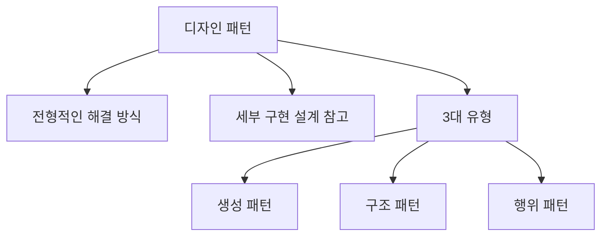
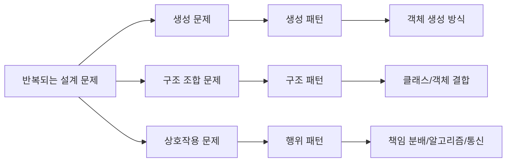
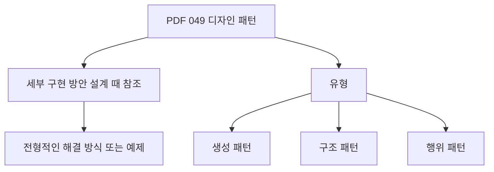
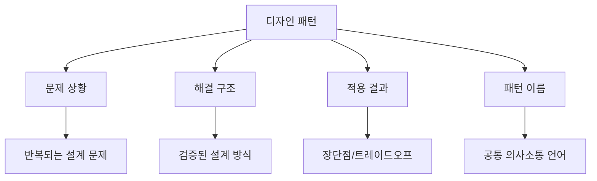
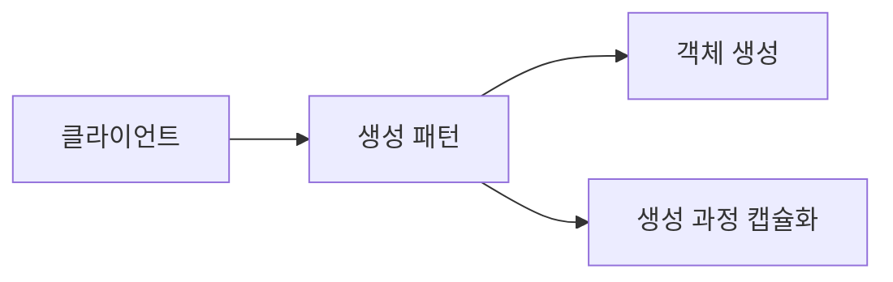
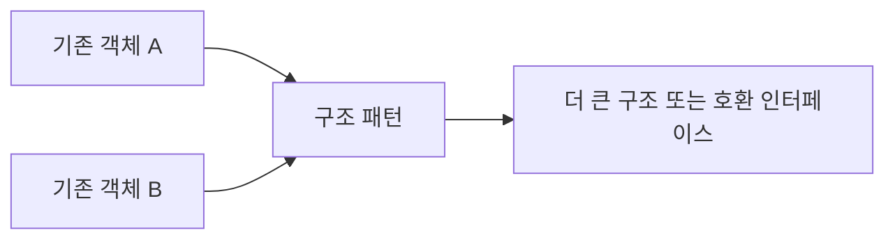
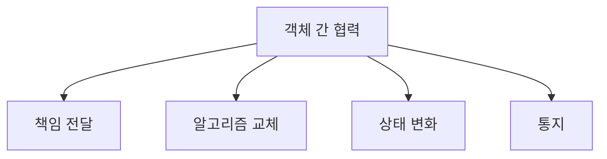
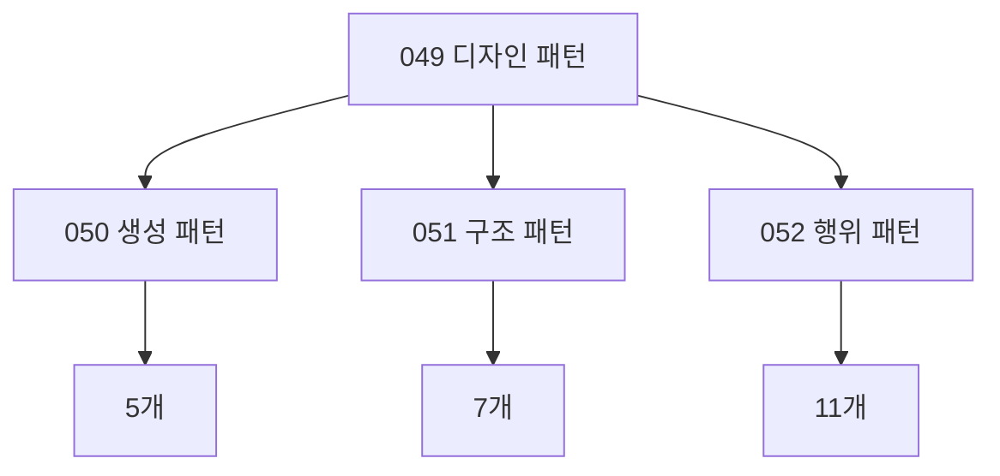
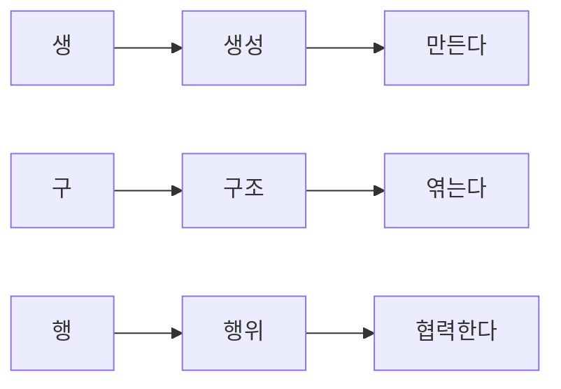

# 049 디자인 패턴(Design Pattern)

작성 기준일: 2026-05-02
검색/보강일: 2026-06-01
과목: `1과목 소프트웨어 설계`
기준 PDF: `/Users/nes0903/Documents/study/정보처리기사/핵심요약집_2026_정보처리기사필기핵심요약.pdf`
PDF 확인 위치: `7페이지`
주제별 검색 키워드: `Design Patterns Elements of Reusable Object-Oriented Software`, `GoF design patterns creational structural behavioral`, `design pattern catalog creational structural behavioral`

---

## 1. 한 줄 요약

- 디자인 패턴은 세부적인 구현 방안을 설계할 때 참조할 수 있는 전형적인 해결 방식 또는 예제이다.
- PDF 기준 유형은 `생성 패턴`, `구조 패턴`, `행위 패턴` 세 가지이다.
- 시험에서는 디자인 패턴의 정의보다 `패턴 이름이 어느 유형에 속하는지`, `무엇을 해결하는지`를 구분하는 문제가 중요하다.

---

## 2. 한눈에 보는 구조

- 생성 패턴은 객체를 `어떻게 만들 것인가`에 집중한다.
- 구조 패턴은 클래스와 객체를 `어떻게 조합할 것인가`에 집중한다.
- 행위 패턴은 객체들이 `어떻게 역할을 나누고 상호작용할 것인가`에 집중한다.
- 디자인 패턴은 완성된 라이브러리나 프레임워크가 아니라, 반복되는 설계 문제에 대한 재사용 가능한 해결 구조이다.

---

## 3. PDF 기준 핵심

- 디자인 패턴은 세부적인 구현 방안을 설계할 때 참조할 수 있는 전형적인 해결 방식 또는 예제를 의미한다.
- 디자인 패턴 유형은 다음과 같다.
  - `생성 패턴`
  - `구조 패턴`
  - `행위 패턴`

- 위 두 문장이 기준 PDF에서 직접 확인되는 최소 암기 골격이다.
- `전형적인 해결 방식 또는 예제`라는 표현을 그대로 기억한다.
- `생성`, `구조`, `행위`는 050~052에서 각각 상세 패턴 목록으로 이어진다.

---

## 4. 검색으로 보강한 관점

- GoF의 `Design Patterns: Elements of Reusable Object-Oriented Software`는 23개 객체지향 디자인 패턴을 정리한 대표적인 원전이다.
- GoF 패턴은 크게 `Creational`, `Structural`, `Behavioral` 패턴으로 나뉜다.
- O'Reilly의 도서 정보도 목차상 생성 패턴, 구조 패턴, 행위 패턴 장으로 카탈로그가 구성됨을 보여 준다.
- Refactoring.Guru와 여러 패턴 카탈로그도 동일하게 생성, 구조, 행위 세 범주로 디자인 패턴을 분류한다.
- 시험에서는 원전의 상세 UML보다, 각 패턴이 어떤 범주에 속하고 어떤 문제를 해결하는지 아는 것이 중요하다.

---

## 5. 디자인 패턴의 의미

- 디자인 패턴은 코드 조각을 그대로 복사해서 붙이는 것이 아니다.
- 디자인 패턴은 특정 설계 문제를 해결하기 위한 구조와 의도를 설명한다.
- 패턴은 보통 다음 정보를 포함한다.
  - 어떤 문제가 반복적으로 발생하는가
  - 어떤 상황에서 적용하는가
  - 어떤 클래스와 객체가 참여하는가
  - 객체들이 어떤 관계를 갖는가
  - 적용했을 때 장점과 단점은 무엇인가
- 예를 들어 `Observer`라는 이름을 쓰면 `상태 변화가 발생하면 여러 관찰자에게 통지하는 구조`라는 의미를 빠르게 전달할 수 있다.
- 이런 점에서 디자인 패턴은 개발자 간 의사소통을 돕는 공통 언어 역할도 한다.

---

## 6. 디자인 패턴의 장점과 주의점

### 6.1 장점

- 반복되는 설계 문제에 대해 검증된 해결 방식을 제공한다.
- 설계 의도를 패턴 이름으로 빠르게 전달할 수 있다.
- 객체 간 결합도를 낮추고 변경에 유연한 구조를 만들 수 있다.
- 재사용 가능한 설계 경험을 공유할 수 있다.
- 유지보수와 확장에 유리한 구조를 만들 수 있다.

### 6.2 주의점

- 패턴은 모든 문제에 적용해야 하는 규칙이 아니다.
- 단순한 문제에 패턴을 억지로 적용하면 구조가 불필요하게 복잡해질 수 있다.
- 패턴 이름만 알고 의도를 모르면 오히려 잘못된 추상화가 생긴다.
- 언어와 프레임워크가 이미 제공하는 기능을 패턴으로 과도하게 감쌀 필요는 없다.
- 시험에서는 패턴의 남용 문제보다 패턴 유형과 목적을 묻는 경우가 많다.

---

## 7. 3대 유형 비교

| 유형 | 초점 | 대표 질문 | 대표 패턴 예 | 시험 단서 |
|---|---|---|---|---|
| 생성 패턴 | 객체 생성 | 객체를 누가, 언제, 어떻게 만들 것인가 | Abstract Factory, Builder, Factory Method, Prototype, Singleton | 생성, 인스턴스, 객체 생성 책임 |
| 구조 패턴 | 객체/클래스 조합 | 기존 객체를 어떻게 연결하고 감쌀 것인가 | Adapter, Bridge, Composite, Decorator, Facade, Flyweight, Proxy | 구조, 조합, 인터페이스, 대리, 장식 |
| 행위 패턴 | 객체 간 상호작용 | 책임과 알고리즘을 어떻게 분배할 것인가 | Command, Observer, Strategy, State, Visitor 등 | 행위, 책임, 알고리즘, 통신, 상태 |

- 생성 패턴은 객체를 만드는 방식에 관심이 있다.
- 구조 패턴은 객체와 객체를 연결하거나 감싸는 방식에 관심이 있다.
- 행위 패턴은 객체들이 메시지를 주고받고 책임을 나누는 방식에 관심이 있다.
- 패턴 이름을 외울 때는 유형과 함께 `핵심 단서`를 붙여 외워야 한다.

---

## 8. 유형별 직관

### 8.1 생성 패턴

- 생성 패턴은 객체 생성 과정을 직접 노출하지 않고 유연하게 만들기 위한 패턴이다.
- 객체 생성 코드가 여러 곳에 흩어져 있거나 생성 과정이 복잡하면 생성 패턴을 고려한다.
- 예를 들어 결제 수단 객체를 직접 `new`로 만들기보다 Factory Method로 생성 책임을 분리할 수 있다.

### 8.2 구조 패턴

- 구조 패턴은 클래스나 객체를 조합하여 더 큰 구조를 만드는 패턴이다.
- 기존 인터페이스가 맞지 않거나, 기능을 감싸고 확장하거나, 대리 객체가 필요한 경우에 등장한다.
- 예를 들어 Adapter는 맞지 않는 인터페이스를 변환하고, Decorator는 객체에 기능을 덧붙인다.

### 8.3 행위 패턴

- 행위 패턴은 객체들이 어떻게 협력하고 책임을 나누는지를 다룬다.
- 알고리즘을 교체하거나, 요청을 객체로 캡슐화하거나, 상태 변화에 따라 행동을 바꾸는 경우에 사용된다.
- 예를 들어 Strategy는 알고리즘을 교체하고, Observer는 상태 변화를 구독자에게 통지한다.

---

## 9. 디자인 패턴과 다른 패턴의 구분

| 구분 | 범위 | 예시 | 시험 구분 |
|---|---|---|---|
| 디자인 패턴 | 세부 설계 수준 | Factory Method, Adapter, Observer | 클래스/객체 설계 해결 방식 |
| 아키텍처 패턴 | 시스템 구조 수준 | MVC, 계층형, 파이프-필터 | 시스템 전체 구조 |
| 분석 패턴 | 도메인 분석 수준 | 계정, 재고, 계약 모델 | 요구/분석 모델 |
| 프레임워크 | 코드로 구현된 재사용 기반 | Spring, Django, React | 제어 흐름과 코드 제공 |
| 라이브러리 | 호출해서 쓰는 기능 묶음 | 날짜 라이브러리, HTTP 클라이언트 | 구현 기능 제공 |

- 디자인 패턴은 구현 세부 설계에 가까운 패턴이다.
- MVC나 파이프-필터는 앞 챕터에서 다룬 아키텍처 패턴 성격이 강하다.
- 프레임워크는 패턴을 포함할 수 있지만, 패턴 자체와는 다르다.
- 디자인 패턴은 설계 아이디어이고, 프레임워크는 실행 가능한 코드 기반이다.

---

## 10. 시험 포인트

- 디자인 패턴은 세부 구현 방안 설계 때 참조할 수 있는 전형적인 해결 방식 또는 예제이다.
- 디자인 패턴 유형은 생성, 구조, 행위이다.
- 생성 패턴은 객체 생성 방식과 관련된다.
- 구조 패턴은 클래스와 객체의 조합 구조와 관련된다.
- 행위 패턴은 객체 간 책임 분배와 상호작용과 관련된다.
- 패턴은 코드 복사본이 아니라 설계 문제에 대한 재사용 가능한 해결 구조이다.
- 패턴 이름과 유형을 바꿔 놓은 보기에 주의한다.
- 디자인 패턴과 아키텍처 패턴, 프레임워크를 구분한다.

---

## 11. 헷갈리는 비교

| 헷갈리는 쌍 | 구분 기준 |
|---|---|
| 생성 vs 구조 | 생성은 객체를 만드는 문제, 구조는 객체를 조합하는 문제 |
| 구조 vs 행위 | 구조는 구성 관계, 행위는 상호작용과 책임 분배 |
| 생성 vs 행위 | 생성은 인스턴스 생성, 행위는 알고리즘/요청/상태/통지 |
| 디자인 패턴 vs 아키텍처 패턴 | 디자인 패턴은 세부 설계, 아키텍처 패턴은 시스템 구조 |
| 디자인 패턴 vs 프레임워크 | 패턴은 설계 아이디어, 프레임워크는 구현된 기반 코드 |
| 패턴 사용 vs 재사용 | 패턴은 설계 구조 재사용, 재사용은 코드/컴포넌트/애플리케이션 활용 |

- `객체 생성`이라는 말이 보이면 생성 패턴을 먼저 의심한다.
- `인터페이스 변환`, `객체 감싸기`, `구조 조합`이 보이면 구조 패턴을 먼저 의심한다.
- `알고리즘 교체`, `상태 변화`, `요청 캡슐화`, `통지`가 보이면 행위 패턴을 먼저 의심한다.

---

## 12. 050~052로 이어지는 지도

- 050 생성 패턴은 5개를 다룬다.
  - Abstract Factory
  - Builder
  - Factory Method
  - Prototype
  - Singleton
- 051 구조 패턴은 7개를 다룬다.
  - Adapter
  - Bridge
  - Composite
  - Decorator
  - Facade
  - Flyweight
  - Proxy
- 052 행위 패턴은 11개를 다룬다.
  - Chain of Responsibility
  - Command
  - Interpreter
  - Iterator
  - Mediator
  - Memento
  - Observer
  - State
  - Strategy
  - Template Method
  - Visitor

---

## 13. 예시로 이해하기

| 상황 | 고려할 유형 | 이유 |
|---|---|---|
| 객체 생성 로직이 복잡하고 여러 곳에 흩어짐 | 생성 패턴 | 생성 책임을 분리해야 함 |
| 서로 맞지 않는 인터페이스를 가진 기존 클래스를 재사용해야 함 | 구조 패턴 | 인터페이스 변환이나 객체 조합이 필요 |
| 객체 상태 변경 시 여러 화면에 자동 통지해야 함 | 행위 패턴 | 객체 간 통신과 통지 방식이 핵심 |
| 알고리즘을 실행 중 바꾸고 싶음 | 행위 패턴 | 알고리즘 교체와 책임 분리가 핵심 |
| 단일 객체만 존재해야 함 | 생성 패턴 | 인스턴스 생성 개수 제어가 핵심 |

---

## 14. 암기 포인트

- 암기어: `생구행`
- 의미 암기:
  - 생성: 객체를 만든다.
  - 구조: 객체를 엮는다.
  - 행위: 객체가 협력한다.
- PDF 정의 암기:
  - 세부적인 구현 방안을 설계할 때 참조할 수 있는 전형적인 해결 방식 또는 예제
- 시험 대비:
  - 유형 이름
  - 대표 패턴
  - 패턴의 의도
  - 패턴을 고르는 단서어

---

## 15. 빠른 복습

- 디자인 패턴은 세부 구현 설계에서 참조할 수 있는 전형적인 해결 방식 또는 예제이다.
- 디자인 패턴 유형은 생성, 구조, 행위이다.
- 생성 패턴은 객체 생성과 관련된다.
- 구조 패턴은 클래스나 객체 조합과 관련된다.
- 행위 패턴은 객체 간 상호작용과 책임 분배와 관련된다.
- 050~052에서는 각 유형의 GoF 패턴 목록과 구분 포인트를 외운다.

---

## 16. 참고 링크

- 기준 PDF: `/Users/nes0903/Documents/study/정보처리기사/핵심요약집_2026_정보처리기사필기핵심요약.pdf`
- [Q-Net - 정보처리기사 종목 정보](https://www.q-net.or.kr/crf005.do?id=crf00503&jmCd=1320)
- [O'Reilly - Design Patterns: Elements of Reusable Object-Oriented Software](https://www.oreilly.com/library/view/design-patterns-elements/0201633612/)
- [Refactoring.Guru - Design Patterns Catalog](https://refactoring.guru/design-patterns/catalog)
- [DigitalOcean - Gang of Four Design Patterns](https://www.digitalocean.com/community/tutorials/gangs-of-four-gof-design-patterns)

<!-- study-links:start -->
## 관련 문서

- `react`: [[react/react|React 상세 정리]]
- `생성 패턴`: [[정보처리기사/1과목 소프트웨어 설계/050 생성 패턴(Creational Pattern)/050 생성 패턴(Creational Pattern)|050 생성 패턴(Creational Pattern)]]
- `구조 패턴`: [[정보처리기사/1과목 소프트웨어 설계/051 구조 패턴(Structural Pattern)/051 구조 패턴(Structural Pattern)|051 구조 패턴(Structural Pattern)]]
- `행위 패턴`: [[정보처리기사/1과목 소프트웨어 설계/052 행위 패턴(Behavioral Pattern)/052 행위 패턴(Behavioral Pattern)|052 행위 패턴(Behavioral Pattern)]]
- `uml`: [[정보처리기사/1과목 소프트웨어 설계/013 UML/013 UML|013 UML]]
- `파이프`: [[정보처리기사/1과목 소프트웨어 설계/029 파이프 - 필터 패턴/029 파이프 - 필터 패턴|029 파이프 - 필터 패턴]]
- `mvc`: [[정보처리기사/1과목 소프트웨어 설계/030 MVC(Model-View-Controller) 패턴/030 MVC(Model-View-Controller) 패턴|030 MVC(Model-View-Controller) 패턴]]
- `캡슐화`: [[정보처리기사/1과목 소프트웨어 설계/033 캡슐화(Encapsulation)/033 캡슐화(Encapsulation)|033 캡슐화(Encapsulation)]]
<!-- study-links:end -->
