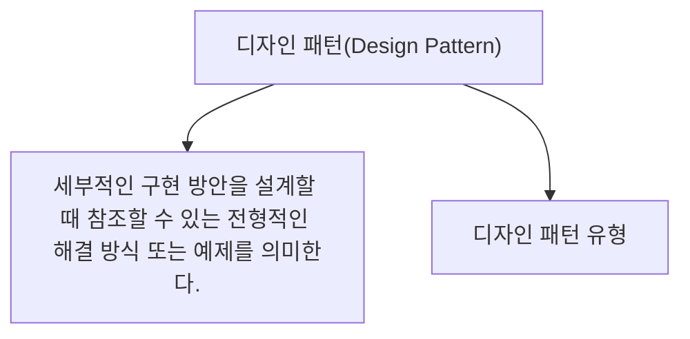

# 049 디자인 패턴(Design Pattern)

작성 기준일: 2026-05-02  
과목: `1과목 소프트웨어 설계`  
기준 PDF: `/Users/nes0903/Documents/study/정보처리기사/핵심요약집_2026_정보처리기사필기핵심요약.pdf`  
PDF 확인 위치: `7페이지`  
검색 보강: 공식/표준/고품질 참고 자료를 함께 확인하여 시험 중심으로 확장 정리

---

## 1. 한 줄 요약

- 디자인 패턴은 자주 반복되는 설계 문제에 대해 검증된 해결 구조를 이름 붙여 재사용할 수 있게 한 설계 지식이며 생성, 구조, 행위 패턴으로 나뉜다.
- 이 챕터는 `디자인 패턴` 영역에 속한다.
- 시험에서는 정의, 핵심 키워드, 비슷한 개념과의 구분을 함께 묻는 경우가 많다.

---

## 2. PDF 기준 핵심

- 세부적인 구현 방안을 설계할 때 참조할 수 있는 전형적인 해결 방식 또는 예제를 의미한다.
- 디자인 패턴 유형: 생성 패턴, 구조 패턴, 행위 패턴

- 위 항목은 PDF에서 직접 확인한 최소 암기 골격이다.
- 세부 설명은 이 골격을 기준으로 확장해서 이해하면 된다.

---

## 3. 개념 설명

- 디자인 패턴은 코드 조각 자체가 아니라 설계 문제를 해결하는 구조와 의도다.
- 생성 패턴은 객체 생성 방식을 다룬다.
- 구조 패턴은 클래스/객체를 조합해 더 큰 구조를 만드는 방식을 다룬다.
- 행위 패턴은 객체 간 책임 분배와 상호작용 방식을 다룬다.
- 디자인 패턴은 이름보다 어떤 문제를 어떤 방식으로 해결하는지 단서어로 구분한다.
- 생성/구조/행위 3분류와 각 패턴의 대표 단어를 연결해 외운다.

---

## 4. 핵심 포인트

- 문제를 풀 때는 먼저 지문 속 단서어를 찾고, 그 단서어가 어떤 개념을 가리키는지 연결한다.
- 정의형 문제는 표현이 조금 바뀌어도 핵심 의미가 같으면 같은 개념으로 판단한다.
- 옳고 그름 문제에서는 `항상`, `반드시`, `전혀`, `모두` 같은 극단 표현을 특히 조심한다.
- 이 챕터는 단독 암기보다 인접 챕터와 비교해 기억하면 정답률이 올라간다.

---

## 5. 시험에서 헷갈리는 비교

| 구분 | 핵심 |
|---|---|
| `생성 패턴` | 객체 생성 문제 |
| `구조 패턴` | 객체/클래스 조합 구조 |
| `행위 패턴` | 객체 간 역할과 상호작용 |

- 비교 문제는 이름보다 `역할`, `목적`, `사용 시점`, `장점/단점`을 기준으로 구분하면 안정적이다.

---

## 6. 예시 또는 암기 포인트

- 디자인 패턴 유형 = `생-구-행`.

- 암기는 단어만 외우기보다 `정의 -> 특징 -> 예시 -> 반대 개념` 순서로 묶는 것이 좋다.

---

## 7. 빠른 복습

- 챕터명: `049 디자인 패턴(Design Pattern)`
- 소속 영역: `디자인 패턴`
- 자주 나오는 문제 유형:
  - 정의를 주고 개념명을 고르는 문제
  - 특징을 섞어 놓고 옳은/틀린 설명을 고르는 문제
  - 유사 개념과 비교하여 다른 하나를 찾는 문제

---

## 8. 참고 링크

- 기준 PDF: `/Users/nes0903/Documents/study/정보처리기사/핵심요약집_2026_정보처리기사필기핵심요약.pdf`
- [Q-Net 정보처리기사 종목 페이지](https://www.q-net.or.kr/crf005.do?id=crf00503s02&jmCd=1320&jmInfoDivCcd=B0)
- [Refactoring.Guru - Design Patterns Catalog](https://refactoring.guru/design-patterns/catalog)
- [Microsoft - SOLID principles and Dependency Injection](https://learn.microsoft.com/en-us/dotnet/architecture/microservices/microservice-ddd-cqrs-patterns/microservice-application-layer-web-api-design)
