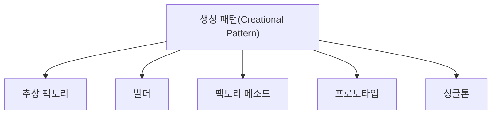

# 050 생성 패턴(Creational Pattern)

작성 기준일: 2026-05-02  
과목: `1과목 소프트웨어 설계`  
기준 PDF: `/Users/nes0903/Documents/study/정보처리기사/핵심요약집_2026_정보처리기사필기핵심요약.pdf`  
PDF 확인 위치: `7페이지`  
검색 보강: 공식/표준/고품질 참고 자료를 함께 확인하여 시험 중심으로 확장 정리

---

## 1. 한 줄 요약

- 생성 패턴은 객체 생성 과정을 캡슐화하거나 유연하게 만들어 객체 생성 방식이 코드에 강하게 묶이지 않도록 하는 디자인 패턴이다.
- 이 챕터는 `디자인 패턴` 영역에 속한다.
- 시험에서는 정의, 핵심 키워드, 비슷한 개념과의 구분을 함께 묻는 경우가 많다.

---

## 2. PDF 기준 핵심

- 추상 팩토리: 서로 연관·의존하는 객체들의 그룹으로 생성하여 추상적으로 표현한다.
- 빌더: 작게 분리된 인스턴스를 건축하듯이 조합하여 객체를 생성한다.
- 팩토리 메소드: 객체 생성을 서브 클래스에서 처리하도록 분리하여 캡슐화한 패턴이다.
- 프로토타입: 원본 객체를 복제하는 방법으로 객체를 생성한다.
- 싱글톤: 생성된 객체를 여러 프로세스가 동시에 참조할 수는 없음

- 위 항목은 PDF에서 직접 확인한 최소 암기 골격이다.
- 세부 설명은 이 골격을 기준으로 확장해서 이해하면 된다.

---

## 3. 개념 설명

- 생성 패턴은 new 호출이나 구체 클래스 의존을 줄이는 데 유용하다.
- 추상 팩토리는 관련 객체군을 일관되게 생성한다.
- 빌더는 복잡한 객체를 단계별로 조립한다.
- 팩토리 메소드는 어떤 구체 객체를 만들지 하위 클래스나 팩토리 메서드에 위임한다.
- 프로토타입은 기존 객체 복제를 통해 생성 비용이나 초기화 복잡성을 줄인다.
- 싱글톤은 인스턴스를 하나만 두고 접근점을 제공하는 패턴이다.
- 디자인 패턴은 이름보다 어떤 문제를 어떤 방식으로 해결하는지 단서어로 구분한다.
- 생성/구조/행위 3분류와 각 패턴의 대표 단어를 연결해 외운다.

---

## 4. 핵심 포인트

- 문제를 풀 때는 먼저 지문 속 단서어를 찾고, 그 단서어가 어떤 개념을 가리키는지 연결한다.
- 정의형 문제는 표현이 조금 바뀌어도 핵심 의미가 같으면 같은 개념으로 판단한다.
- 옳고 그름 문제에서는 `항상`, `반드시`, `전혀`, `모두` 같은 극단 표현을 특히 조심한다.
- 이 챕터는 단독 암기보다 인접 챕터와 비교해 기억하면 정답률이 올라간다.

---

## 5. 시험에서 헷갈리는 비교

| 구분 | 핵심 |
|---|---|
| `추상 팩토리` | 관련 객체군 생성 |
| `빌더` | 복잡한 객체 단계별 조립 |
| `팩토리 메소드` | 생성을 서브클래스에 위임 |
| `프로토타입` | 복제 생성 |
| `싱글톤` | 하나의 인스턴스 |

- 비교 문제는 이름보다 `역할`, `목적`, `사용 시점`, `장점/단점`을 기준으로 구분하면 안정적이다.

---

## 6. 예시 또는 암기 포인트

- 생성 패턴 = `추-빌-팩-프-싱`.

- 암기는 단어만 외우기보다 `정의 -> 특징 -> 예시 -> 반대 개념` 순서로 묶는 것이 좋다.

---

## 7. 빠른 복습

- 챕터명: `050 생성 패턴(Creational Pattern)`
- 소속 영역: `디자인 패턴`
- 자주 나오는 문제 유형:
  - 정의를 주고 개념명을 고르는 문제
  - 특징을 섞어 놓고 옳은/틀린 설명을 고르는 문제
  - 유사 개념과 비교하여 다른 하나를 찾는 문제

---

## 8. 참고 링크

- 기준 PDF: `/Users/nes0903/Documents/study/정보처리기사/핵심요약집_2026_정보처리기사필기핵심요약.pdf`
- [Q-Net 정보처리기사 종목 페이지](https://www.q-net.or.kr/crf005.do?id=crf00503s02&jmCd=1320&jmInfoDivCcd=B0)
- [Refactoring.Guru - Design Patterns Catalog](https://refactoring.guru/design-patterns/catalog)
- [Microsoft - SOLID principles and Dependency Injection](https://learn.microsoft.com/en-us/dotnet/architecture/microservices/microservice-ddd-cqrs-patterns/microservice-application-layer-web-api-design)
