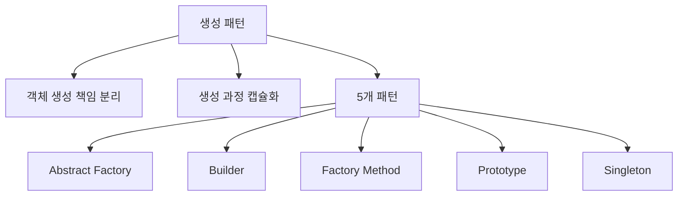
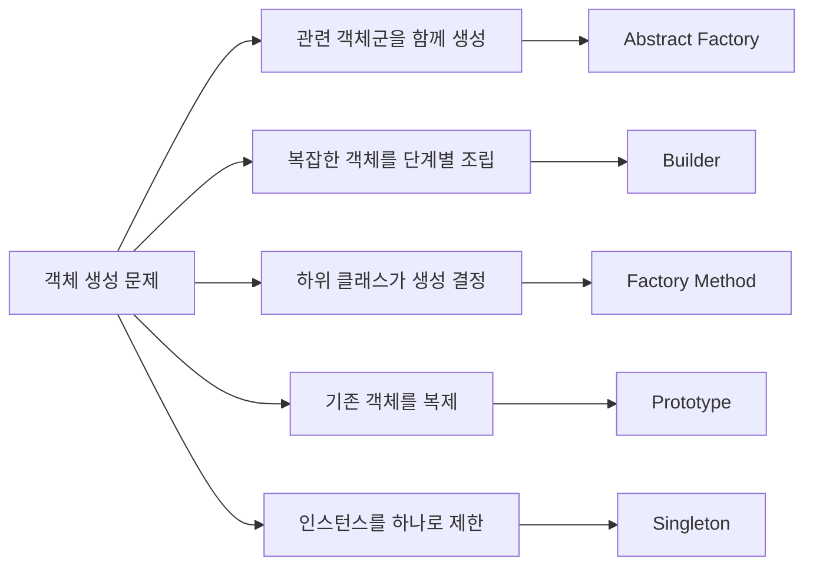
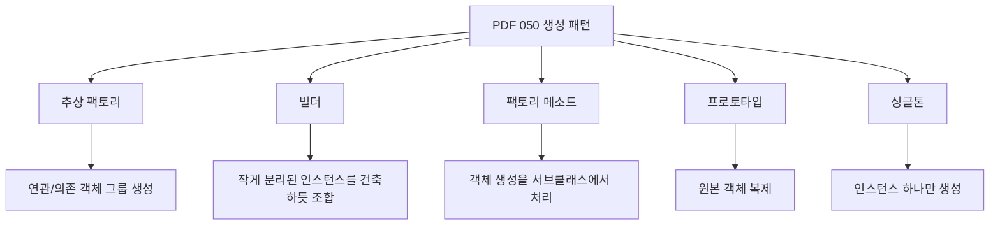
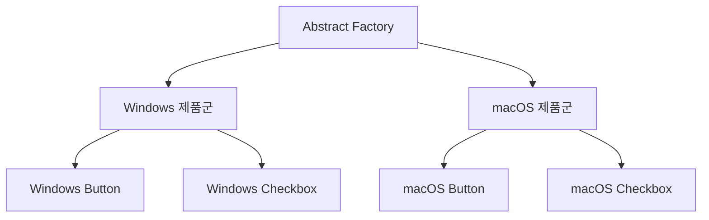
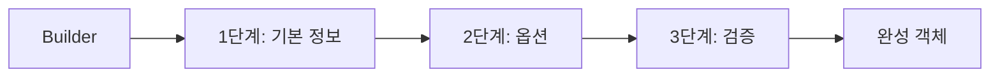
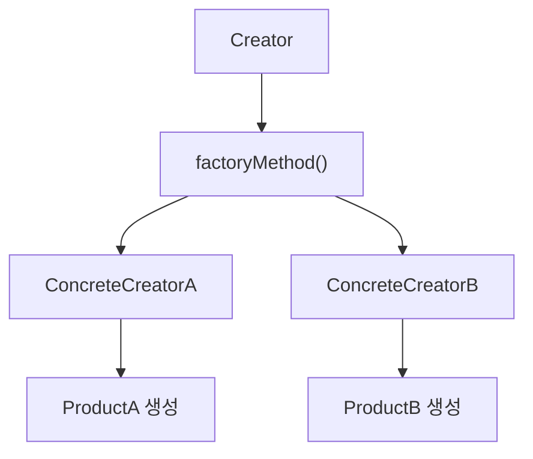
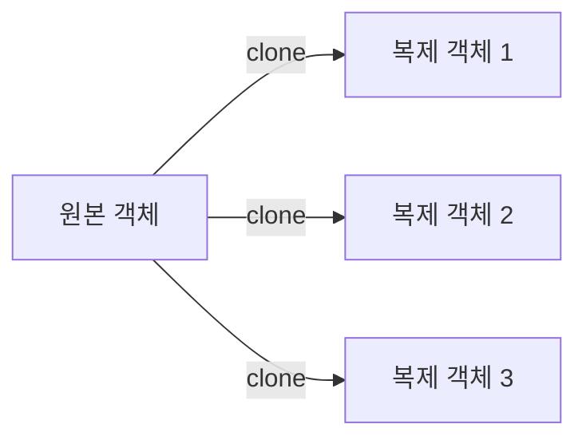
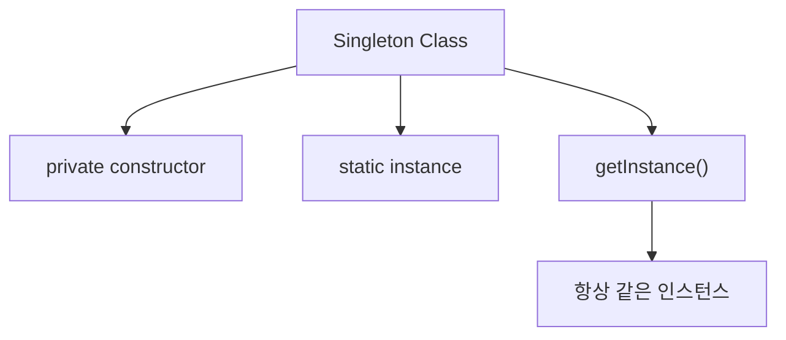
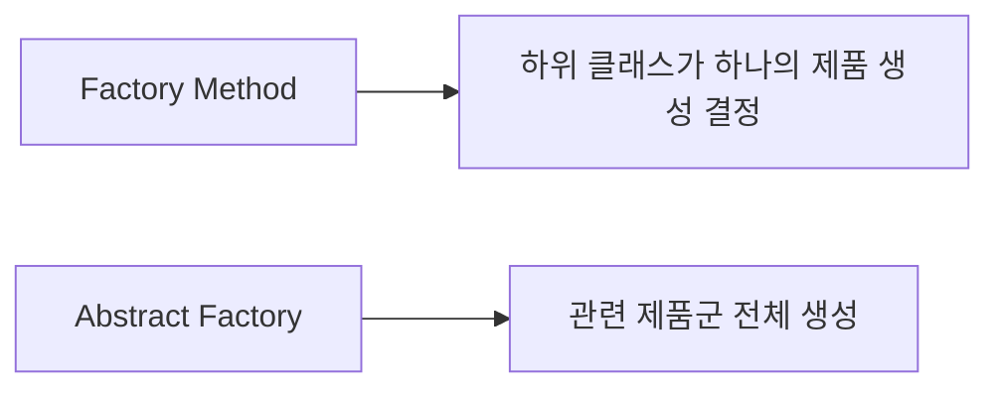
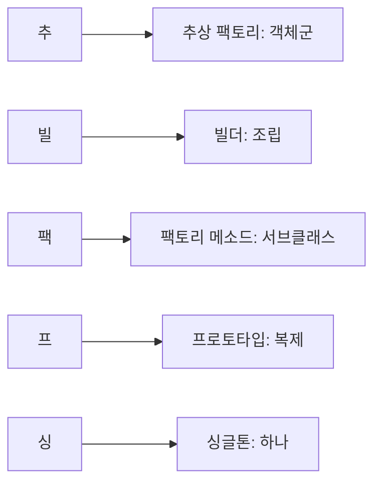

# 050 생성 패턴(Creational Pattern)

작성 기준일: 2026-05-02
검색/보강일: 2026-06-01
과목: `1과목 소프트웨어 설계`
기준 PDF: `/Users/nes0903/Documents/study/정보처리기사/핵심요약집_2026_정보처리기사필기핵심요약.pdf`
PDF 확인 위치: `7페이지`
주제별 검색 키워드: `GoF creational patterns Abstract Factory Builder Factory Method Prototype Singleton`, `creational design patterns intent`, `Factory Method Abstract Factory Builder Prototype Singleton`

---

## 1. 한 줄 요약

- 생성 패턴은 객체 생성 과정과 생성 책임을 분리하거나 캡슐화하여 객체 생성의 유연성을 높이는 디자인 패턴 유형이다.
- PDF 기준 생성 패턴은 `추상 팩토리`, `빌더`, `팩토리 메소드`, `프로토타입`, `싱글톤` 5개이다.
- 시험에서는 각 패턴의 이름보다 `객체군`, `단계적 조립`, `서브클래스 생성`, `복제`, `단일 인스턴스` 단서를 빠르게 매칭해야 한다.

---

## 2. 한눈에 보는 구조

- 생성 패턴은 `new` 또는 생성자 호출을 어디에서 어떻게 처리할지 다룬다.
- 객체 생성 코드가 여러 곳에 흩어져 있으면 구체 클래스에 대한 의존이 커진다.
- 생성 패턴을 사용하면 생성 로직을 한곳에 모으거나, 생성 책임을 다른 객체나 하위 클래스에 맡길 수 있다.
- 생성 패턴은 객체를 만드는 방식의 문제를 해결하며, 구조 패턴이나 행위 패턴과 구분된다.

---

## 3. PDF 기준 핵심

- `추상 팩토리(Abstract Factory)`
  - 서로 연관·의존하는 객체들의 그룹으로 생성하여 추상적으로 표현한다.
- `빌더(Builder)`
  - 작게 분리된 인스턴스를 건축하듯이 조합하여 객체를 생성한다.
- `팩토리 메소드(Factory Method)`
  - 객체 생성을 서브 클래스에서 처리하도록 분리하여 캡슐화한 패턴이다.
  - 가상 생성자(Virtual Constructor) 패턴이라고도 한다.
- `프로토타입(Prototype)`
  - 원본 객체를 복제하는 방법으로 객체를 생성한다.
- `싱글톤(Singleton)`
  - 특정 클래스의 인스턴스가 하나만 생성되도록 제한하고 그 인스턴스에 접근하게 하는 패턴이다.

- 위 다섯 항목이 기준 PDF에서 직접 확인되는 시험용 골격이다.
- 시험에서는 PDF 문장을 약간 바꾸어 패턴 이름을 고르게 하는 문제가 많다.
- 특히 `추상 팩토리`와 `팩토리 메소드`, `빌더`와 `프로토타입`을 혼동하지 않도록 단서어를 분리한다.

---

## 4. 검색으로 보강한 관점

- Refactoring.Guru는 생성 패턴을 객체 생성 메커니즘을 제공하여 코드 유연성과 재사용성을 높이는 패턴으로 설명한다.
- GoF 분류에서 생성 패턴은 객체 생성 과정을 추상화하거나 캡슐화하는 패턴군이다.
- Factory Method는 상위 클래스에 생성 인터페이스를 두고 하위 클래스가 실제 생성 타입을 바꿀 수 있게 한다.
- Abstract Factory는 구체 클래스를 지정하지 않고 관련 객체들의 제품군을 만들게 한다.
- Builder는 복잡한 객체를 단계적으로 구성한다.
- Prototype은 기존 객체를 복제하여 새 객체를 만든다.
- Singleton은 한 클래스의 인스턴스가 하나만 존재하도록 보장하고 접근점을 제공한다.

---

## 5. 생성 패턴 전체 비교

| 패턴 | 의도 | 핵심 단서 | 시험 구분 포인트 |
|---|---|---|---|
| 추상 팩토리 | 관련 있거나 의존적인 객체군을 구체 클래스 지정 없이 생성 | 객체군, 제품군, 관련 객체, 의존 객체 | `하나의 객체`보다 `서로 관련된 객체들의 그룹`에 초점 |
| 빌더 | 복잡한 객체를 단계별로 조립하여 생성 | 건축하듯, 단계별, 조립, 복잡한 객체 | `복제`가 아니라 `단계적 구성`이 핵심 |
| 팩토리 메소드 | 객체 생성 인터페이스를 두고 실제 생성은 서브클래스가 결정 | 서브클래스, 가상 생성자, 생성 캡슐화 | `객체군`이 아니라 `하위 클래스가 생성 타입 결정` |
| 프로토타입 | 기존 원본 객체를 복제하여 새 객체 생성 | 원본, 복제, clone, 복사 | `조립`이 아니라 `복제`가 핵심 |
| 싱글톤 | 특정 클래스의 인스턴스를 하나로 제한하고 접근점 제공 | 하나만, 단일 인스턴스, 전역 접근점 | `생성 수 제한`이 핵심 |

- 이 표가 050의 핵심이다.
- 문제에서 `관련된 제품군`이 나오면 추상 팩토리이다.
- `건축하듯 조합` 또는 `단계적으로 구성`이 나오면 빌더이다.
- `가상 생성자`, `서브클래스가 생성`이 나오면 팩토리 메소드이다.
- `원본 객체 복제`가 나오면 프로토타입이다.
- `인스턴스가 하나`가 나오면 싱글톤이다.

---

## 6. 추상 팩토리(Abstract Factory)

- 추상 팩토리는 서로 관련되거나 의존적인 객체들의 집합을 생성하는 패턴이다.
- 클라이언트는 구체 클래스를 직접 지정하지 않고 팩토리를 통해 관련 객체군을 얻는다.
- 예를 들어 운영체제별 UI 컴포넌트를 만들 때 `WindowsButton`, `WindowsCheckbox`를 한 제품군으로, `MacButton`, `MacCheckbox`를 다른 제품군으로 묶을 수 있다.
- 제품군 전체를 일관성 있게 생성해야 할 때 적합하다.
- 새로운 제품군을 추가하기는 비교적 쉽지만, 제품 종류 자체를 추가할 때는 팩토리 인터페이스가 바뀔 수 있다.

### 시험 단서

- 서로 연관된 객체
- 서로 의존하는 객체
- 객체들의 그룹
- 제품군
- 구체 클래스 지정 없이 생성

---

## 7. 빌더(Builder)

- 빌더는 복잡한 객체를 여러 단계로 나누어 조립하는 패턴이다.
- PDF 표현처럼 작게 분리된 인스턴스를 건축하듯 조합하여 객체를 생성한다.
- 예를 들어 문서 생성, 주문 생성, 피자 주문, HTTP 요청 생성처럼 선택 옵션이 많고 구성 단계가 복잡한 객체에 적합하다.
- 같은 생성 절차로 서로 다른 표현의 객체를 만들 수 있다.
- 생성자 매개변수가 지나치게 많거나, 객체 생성 순서를 명확히 하고 싶을 때 자주 설명된다.

### 시험 단서

- 건축하듯 조합
- 단계별 생성
- 복잡한 객체
- 부분 객체 조립
- 동일 생성 과정으로 다른 표현 생성

---

## 8. 팩토리 메소드(Factory Method)

- 팩토리 메소드는 객체 생성을 서브클래스에서 처리하도록 분리하여 캡슐화한 패턴이다.
- 상위 클래스는 객체 생성 메서드의 틀을 제공하고, 하위 클래스가 실제로 어떤 객체를 만들지 결정한다.
- 가상 생성자(Virtual Constructor)라고도 한다.
- 예를 들어 물류 시스템에서 `Transport` 생성 인터페이스는 상위 클래스가 제공하고, 하위 클래스가 `Truck` 또는 `Ship`을 생성하도록 할 수 있다.
- 클라이언트 코드가 구체 클래스 생성에 덜 의존하게 된다.

### 시험 단서

- 서브클래스에서 객체 생성
- 생성 책임 위임
- 생성 캡슐화
- 가상 생성자
- 하위 클래스가 생성 타입 결정

---

## 9. 프로토타입(Prototype)

- 프로토타입은 원본 객체를 복제하여 새 객체를 만드는 패턴이다.
- 클래스 정보를 직접 알아서 생성하기보다, 이미 존재하는 객체를 복사한다.
- 객체 생성 비용이 크거나, 객체 초기 상태를 매번 새로 구성하기 어려울 때 사용할 수 있다.
- 예를 들어 문서 템플릿, 그래픽 객체, 게임 캐릭터 기본 상태를 복제하여 새 객체를 만들 수 있다.
- 복제 방식이 얕은 복사인지 깊은 복사인지에 따라 주의가 필요하다.

### 시험 단서

- 원본 객체
- 복제
- clone
- 복사하여 생성
- 기존 객체를 기반으로 새 객체 생성

---

## 10. 싱글톤(Singleton)

- 싱글톤은 특정 클래스의 인스턴스가 하나만 생성되도록 제한하는 패턴이다.
- 동시에 그 하나의 인스턴스에 접근할 수 있는 전역 접근점을 제공한다.
- 예를 들어 설정 관리자, 로그 관리자, 애플리케이션 전역 상태 관리자 예시로 설명된다.
- 다만 전역 상태처럼 사용되면 테스트가 어려워지고 결합도가 높아질 수 있다.
- 시험에서는 이런 실무 논쟁보다 `인스턴스 하나`와 `접근점 제공`이 핵심이다.

### 시험 단서

- 하나의 인스턴스
- 단일 객체
- 전역 접근점
- 생성 제한
- 같은 객체 반환

---

## 11. 팩토리 계열 구분

| 구분 | 팩토리 메소드 | 추상 팩토리 |
|---|---|---|
| 초점 | 객체 하나의 생성 책임 위임 | 관련 객체군 생성 |
| 핵심 단서 | 서브클래스, 가상 생성자 | 객체 그룹, 제품군 |
| 생성 방식 | 하위 클래스가 생성할 구체 타입 결정 | 팩토리 객체가 관련 제품들을 생성 |
| 시험 문장 | 객체 생성을 서브클래스에서 처리 | 연관·의존 객체들의 그룹 생성 |

- `Factory`라는 단어만 보고 정답을 고르면 위험하다.
- `서브클래스`가 나오면 팩토리 메소드이다.
- `관련 객체들의 그룹`이 나오면 추상 팩토리이다.

---

## 12. 빌더 vs 프로토타입 구분

| 구분 | 빌더 | 프로토타입 |
|---|---|---|
| 생성 방식 | 단계적으로 조립 | 기존 객체를 복제 |
| 핵심 단서 | 건축, 조립, 단계 | 원본, clone, 복사 |
| 사용 상황 | 생성 과정이 복잡함 | 비슷한 객체를 빠르게 생성 |
| 시험 문장 | 작게 분리된 인스턴스를 조합 | 원본 객체를 복제 |

- 빌더는 만들 객체를 단계적으로 구성한다.
- 프로토타입은 이미 있는 객체를 복사한다.
- `건축하듯`이라는 말은 빌더의 강한 단서이다.
- `복제`라는 말은 프로토타입의 강한 단서이다.

---

## 13. 시험 포인트

- 생성 패턴은 객체 생성 방식을 다룬다.
- PDF의 생성 패턴 5개는 `추상 팩토리`, `빌더`, `팩토리 메소드`, `프로토타입`, `싱글톤`이다.
- 추상 팩토리는 연관·의존 객체들의 그룹을 생성한다.
- 빌더는 작게 분리된 인스턴스를 건축하듯 조합한다.
- 팩토리 메소드는 객체 생성을 서브클래스에서 처리하도록 분리하고 캡슐화한다.
- 팩토리 메소드는 가상 생성자라고도 한다.
- 프로토타입은 원본 객체를 복제하여 생성한다.
- 싱글톤은 인스턴스가 하나만 생성되도록 제한한다.
- 팩토리 메소드와 추상 팩토리의 차이를 반드시 구분한다.

---

## 14. 예시로 판단하기

| 상황 | 패턴 | 이유 |
|---|---|---|
| 운영체제별 버튼, 체크박스, 메뉴를 같은 제품군으로 생성 | 추상 팩토리 | 관련 객체군 생성 |
| 복잡한 주문 객체를 필수값, 옵션, 할인, 배송 정보 순서로 구성 | 빌더 | 단계별 조립 |
| 문서 편집기에서 하위 클래스가 생성할 문서 타입을 결정 | 팩토리 메소드 | 서브클래스가 객체 생성 |
| 기존 문서 템플릿을 복사해 새 문서를 생성 | 프로토타입 | 원본 복제 |
| 설정 관리자 객체가 프로그램 전체에서 하나만 존재 | 싱글톤 | 단일 인스턴스 |

---

## 15. 암기 포인트

- 암기어: `추빌팩프싱`
- 의미 암기:
  - `추`: 추상 팩토리 = 객체군
  - `빌`: 빌더 = 건축하듯 조립
  - `팩`: 팩토리 메소드 = 서브클래스 생성
  - `프`: 프로토타입 = 복제
  - `싱`: 싱글톤 = 하나
- 오답 방지:
  - 객체군이면 추상 팩토리
  - 가상 생성자이면 팩토리 메소드
  - 복제이면 프로토타입
  - 조립이면 빌더

---

## 16. 빠른 복습

- 생성 패턴은 객체 생성 과정과 생성 책임을 다룬다.
- 추상 팩토리는 연관·의존 객체들의 그룹을 생성한다.
- 빌더는 작게 분리된 인스턴스를 건축하듯 조합한다.
- 팩토리 메소드는 객체 생성을 서브클래스에서 처리하도록 분리한다.
- 프로토타입은 원본 객체를 복제하여 생성한다.
- 싱글톤은 특정 클래스의 인스턴스가 하나만 생성되도록 제한한다.
- 생성 패턴 암기어는 `추빌팩프싱`이다.

---

## 17. 참고 링크

- 기준 PDF: `/Users/nes0903/Documents/study/정보처리기사/핵심요약집_2026_정보처리기사필기핵심요약.pdf`
- [Q-Net - 정보처리기사 종목 정보](https://www.q-net.or.kr/crf005.do?id=crf00503&jmCd=1320)
- [Refactoring.Guru - Creational Design Patterns](https://refactoring.guru/design-patterns/creational-patterns)
- [Refactoring.Guru - Factory Method](https://refactoring.guru/design-patterns/factory-method)
- [Refactoring.Guru - Builder](https://refactoring.guru/design-patterns/builder)
- [Refactoring.Guru - Singleton](https://refactoring.guru/design-patterns/singleton)
- [O'Reilly - Design Patterns: Elements of Reusable Object-Oriented Software](https://www.oreilly.com/library/view/design-patterns-elements/0201633612/)

<!-- study-links:start -->
## 관련 문서

- `디자인 패턴`: [[정보처리기사/1과목 소프트웨어 설계/049 디자인 패턴(Design Pattern)/049 디자인 패턴(Design Pattern)|049 디자인 패턴(Design Pattern)]]
- `구조 패턴`: [[정보처리기사/1과목 소프트웨어 설계/051 구조 패턴(Structural Pattern)/051 구조 패턴(Structural Pattern)|051 구조 패턴(Structural Pattern)]]
- `행위 패턴`: [[정보처리기사/1과목 소프트웨어 설계/052 행위 패턴(Behavioral Pattern)/052 행위 패턴(Behavioral Pattern)|052 행위 패턴(Behavioral Pattern)]]
- `캡슐화`: [[정보처리기사/1과목 소프트웨어 설계/033 캡슐화(Encapsulation)/033 캡슐화(Encapsulation)|033 캡슐화(Encapsulation)]]
<!-- study-links:end -->
