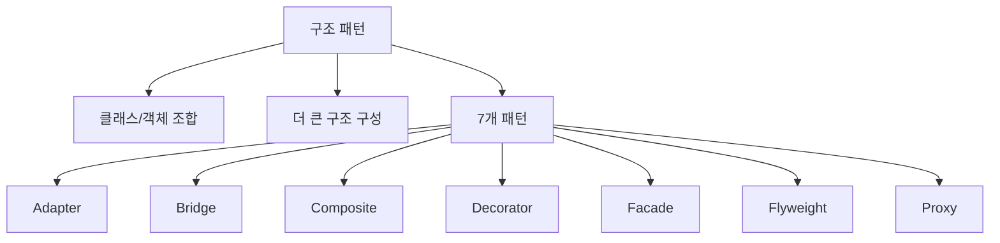
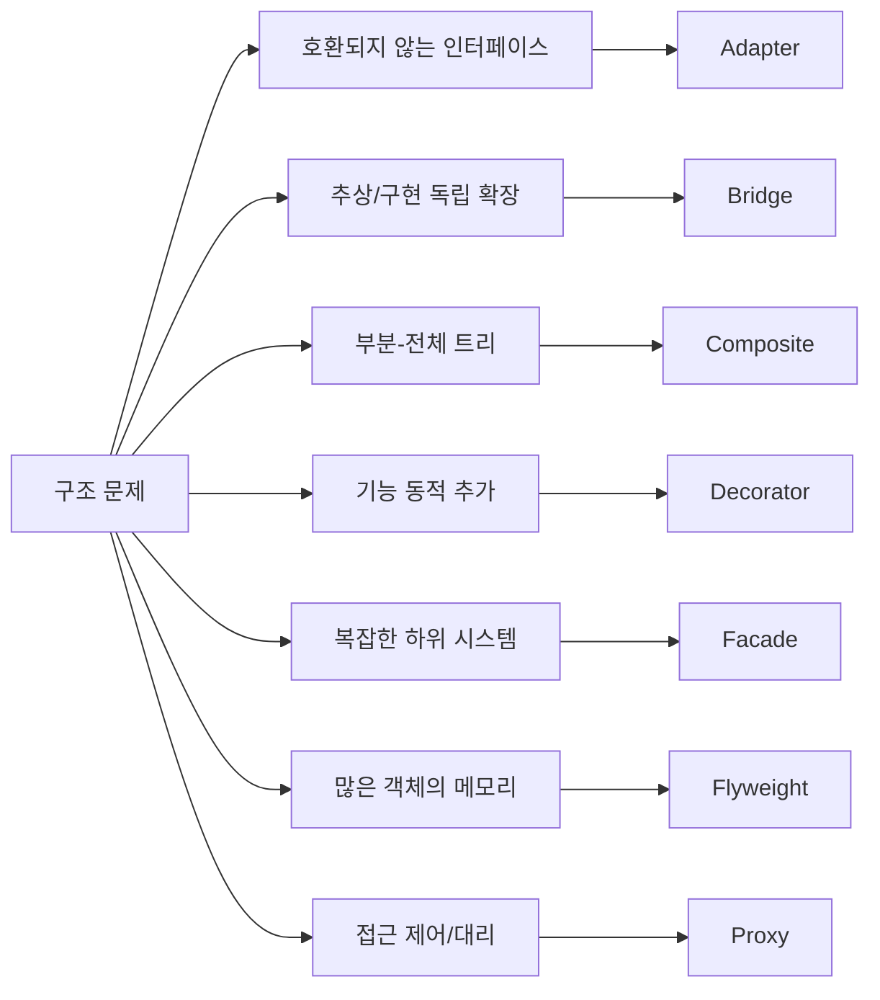
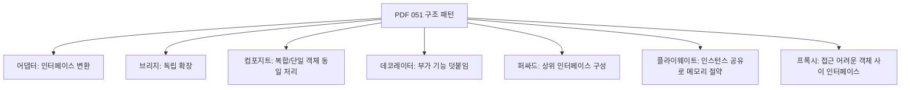
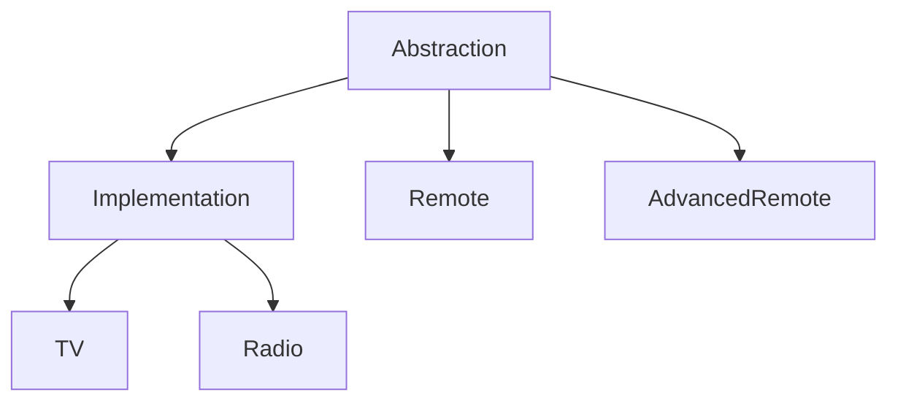
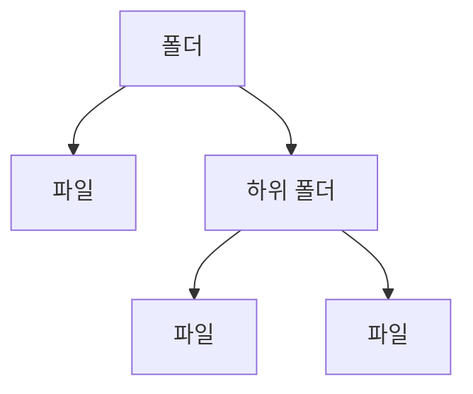
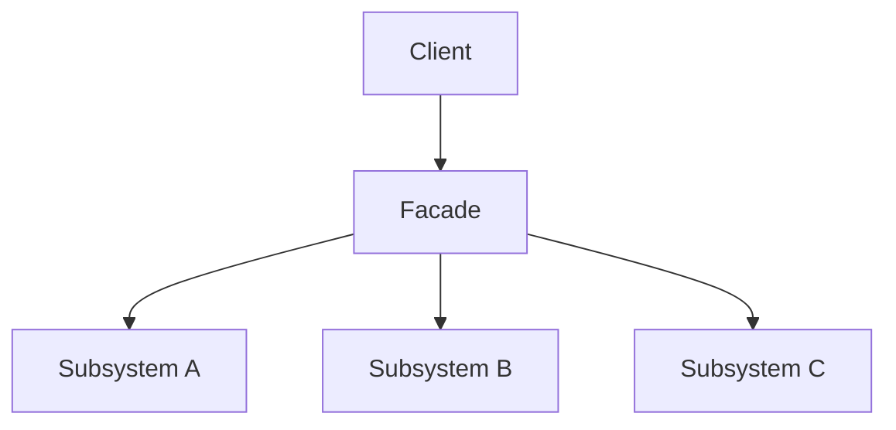
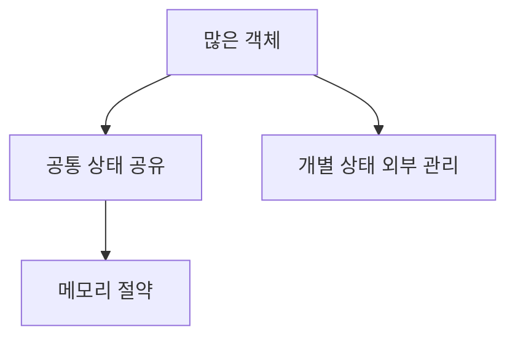
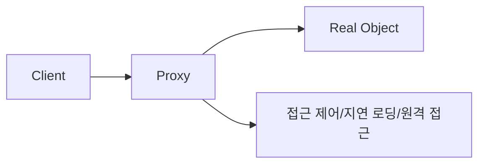
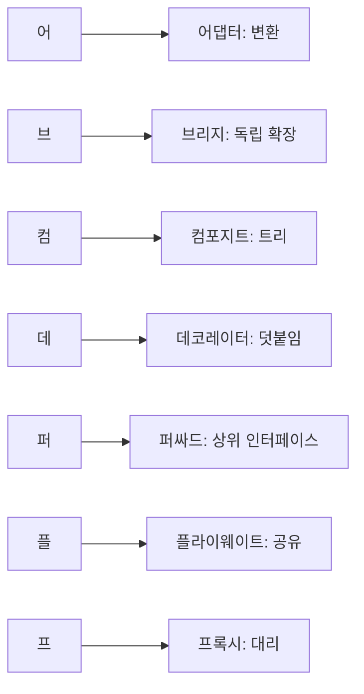

# 051 구조 패턴(Structural Pattern)

작성 기준일: 2026-05-02
검색/보강일: 2026-06-01
과목: `1과목 소프트웨어 설계`
기준 PDF: `/Users/nes0903/Documents/study/정보처리기사/핵심요약집_2026_정보처리기사필기핵심요약.pdf`
PDF 확인 위치: `7페이지`
주제별 검색 키워드: `GoF structural patterns Adapter Bridge Composite Decorator Facade Flyweight Proxy`, `structural design patterns intent`, `Adapter Bridge Composite Decorator Facade Flyweight Proxy`

---

## 1. 한 줄 요약

- 구조 패턴은 클래스와 객체를 조합하여 더 큰 구조를 만들고, 인터페이스 불일치나 기능 확장, 접근 제어 같은 구조 문제를 해결하는 패턴이다.
- PDF 기준 구조 패턴은 `어댑터`, `브리지`, `컴포지트`, `데코레이터`, `퍼싸드`, `플라이웨이트`, `프록시` 7개이다.
- 시험에서는 `인터페이스 변환`, `독립 확장`, `단일/복합 동일 처리`, `기능 덧붙임`, `상위 인터페이스`, `인스턴스 공유`, `대리 접근` 단서가 핵심이다.

---

## 2. 한눈에 보는 구조

- 구조 패턴은 객체를 새로 만드는 문제보다, 이미 존재하는 객체와 클래스를 어떻게 연결하고 감쌀지에 초점을 둔다.
- 어댑터는 인터페이스를 변환한다.
- 브리지는 추상부와 구현부를 분리한다.
- 컴포지트는 트리 구조에서 단일 객체와 복합 객체를 같은 방식으로 다룬다.
- 데코레이터는 객체를 감싸서 기능을 추가한다.
- 퍼싸드는 복잡한 하위 시스템을 단순한 상위 인터페이스로 감춘다.
- 플라이웨이트는 공유로 메모리를 아낀다.
- 프록시는 실제 객체에 대한 접근을 대신하거나 제어한다.

---

## 3. PDF 기준 핵심

- `어댑터(Adapter)`
  - 인터페이스를 다른 클래스가 재사용할 수 있도록 변환한다.
- `브리지(Bridge)`
  - 서로가 독립적으로 확장할 수 있도록 구성한다.
- `컴포지트(Composite)`
  - 복합 객체와 단일 객체를 구분 없이 다루고자 할 때 사용한다.
- `데코레이터(Decorator)`
  - 부가적인 기능을 추가하기 위해 다른 객체들을 덧붙이는 방식으로 구현한다.
- `퍼싸드(Facade)`
  - 복잡한 서브 클래스들을 피해 더 상위에 인터페이스를 구성한다.
- `플라이웨이트(Flyweight)`
  - 가능한 한 인스턴스를 공유해서 사용함으로써 메모리를 절약한다.
- `프록시(Proxy)`
  - 접근이 어려운 객체와 여기에 연결하려는 객체 사이에서 인터페이스 역할을 수행한다.

- 위 일곱 항목이 기준 PDF에서 직접 확인되는 시험용 골격이다.
- 시험에서는 구조 패턴 이름과 의도를 바꾸어 놓은 보기가 자주 나온다.

---

## 4. 검색으로 보강한 관점

- Refactoring.Guru는 구조 패턴을 객체와 클래스를 더 큰 구조로 조립하면서도 유연하고 효율적으로 유지하는 패턴으로 설명한다.
- GoF 구조 패턴은 클래스/객체의 구성 관계를 다루는 패턴군이다.
- Adapter는 호환되지 않는 인터페이스를 가진 객체들이 협력할 수 있게 한다.
- Bridge는 추상과 구현을 분리하여 두 계층이 독립적으로 변하게 한다.
- Composite는 트리 구조를 만들고 단일 객체와 복합 객체를 동일하게 다룬다.
- Decorator는 래퍼 객체로 기능을 추가한다.
- Facade는 복잡한 시스템에 단순한 인터페이스를 제공한다.
- Flyweight는 공유 가능한 상태를 나누어 메모리를 절약한다.
- Proxy는 원본 객체 접근을 제어하거나 대신한다.

---

## 5. 구조 패턴 전체 비교

| 패턴 | 의도 | 핵심 단서 | 시험 구분 포인트 |
|---|---|---|---|
| 어댑터 | 호환되지 않는 인터페이스를 변환해 재사용 가능하게 함 | 인터페이스 변환, 호환, 재사용 | `복잡함 단순화`가 아니라 `맞지 않는 인터페이스 변환` |
| 브리지 | 추상부와 구현부를 분리해 독립적으로 확장 | 독립 확장, 추상/구현 분리 | 두 축이 따로 변하면 브리지 |
| 컴포지트 | 단일 객체와 복합 객체를 같은 방식으로 다룸 | 트리, 부분-전체, 복합/단일 동일 | 파일/폴더처럼 계층 구조 |
| 데코레이터 | 객체에 부가 기능을 동적으로 덧붙임 | 장식, 래퍼, 기능 추가, 덧붙임 | 접근 제어가 아니라 기능 추가 |
| 퍼싸드 | 복잡한 하위 시스템 앞에 단순한 상위 인터페이스 제공 | 상위 인터페이스, 단순화, 서브시스템 | 인터페이스 변환보다 사용 단순화 |
| 플라이웨이트 | 공유 가능한 인스턴스를 재사용해 메모리 절약 | 인스턴스 공유, 메모리 절약 | 많은 유사 객체의 공통 상태 공유 |
| 프록시 | 실제 객체 접근을 대신하거나 제어 | 대리자, 접근 제어, 원격/가상/보호 | 기능 추가보다 접근 대리가 핵심 |

- 이 표가 051의 핵심이다.
- `어댑터`, `퍼싸드`, `프록시`는 모두 중간 객체가 등장할 수 있지만 목적이 다르다.
- 어댑터는 인터페이스를 맞추고, 퍼싸드는 복잡함을 단순화하고, 프록시는 접근을 대신하거나 제어한다.

---

## 6. 어댑터(Adapter)

- 어댑터는 기존 클래스의 인터페이스를 클라이언트가 기대하는 인터페이스로 변환한다.
- 이미 있는 클래스를 수정하지 않고 새 시스템에서 재사용하고 싶을 때 사용한다.
- 예를 들어 새 결제 시스템은 `pay(amount)`를 기대하지만, 기존 모듈은 `requestPayment(value)`를 제공할 수 있다.
- 이때 Adapter가 중간에서 호출 규약을 맞춰 준다.

### 시험 단서

- 인터페이스 변환
- 호환되지 않는 인터페이스
- 기존 클래스 재사용
- 어댑터, 변환기, wrapper

---

## 7. 브리지(Bridge)

- 브리지는 추상부와 구현부를 분리하여 서로 독립적으로 확장할 수 있게 한다.
- 하나의 클래스 계층에서 기능 축과 구현 축이 동시에 늘어날 때 복잡도가 커지는 문제를 줄인다.
- 예를 들어 리모컨 종류와 장치 종류가 각각 늘어날 수 있다면, 리모컨 계층과 장치 계층을 분리하고 연결한다.
- PDF의 핵심 표현은 `서로가 독립적으로 확장할 수 있도록 구성`이다.

### 시험 단서

- 독립적으로 확장
- 추상부와 구현부 분리
- 두 계층 분리
- 구현과 인터페이스 분리

---

## 8. 컴포지트(Composite)

- 컴포지트는 복합 객체와 단일 객체를 구분 없이 다루고자 할 때 사용한다.
- 트리 구조에서 전체와 부분을 같은 인터페이스로 다룬다.
- 대표 예시는 파일과 폴더이다.
  - 파일은 단일 객체이다.
  - 폴더는 파일과 다른 폴더를 포함하는 복합 객체이다.
  - 사용자는 파일과 폴더를 모두 `display()` 같은 방식으로 다룰 수 있다.
- 조직도, 메뉴 트리, 그래픽 객체 그룹도 자주 설명되는 예시이다.

### 시험 단서

- 복합 객체와 단일 객체
- 구분 없이 다룸
- 부분-전체
- 트리 구조
- 계층 구조

---

## 9. 데코레이터(Decorator)

- 데코레이터는 부가적인 기능을 추가하기 위해 객체를 감싸는 방식으로 구현한다.
- 상속으로 기능 조합을 늘리는 대신, 런타임에 필요한 기능을 덧붙일 수 있다.
- 예를 들어 기본 알림 객체에 SMS 알림, 이메일 알림, 푸시 알림 기능을 감싸서 추가할 수 있다.
- 핵심은 원본 객체의 인터페이스는 유지하면서 기능을 동적으로 추가하는 것이다.

### 시험 단서

- 부가 기능
- 덧붙임
- 장식
- wrapper
- 기능 동적 추가

---

## 10. 퍼싸드(Facade)

- 퍼싸드는 복잡한 서브 클래스나 하위 시스템을 직접 다루지 않도록 상위에 단순한 인터페이스를 제공한다.
- 클라이언트는 여러 하위 객체를 직접 호출하지 않고 Facade 하나를 통해 필요한 기능을 사용한다.
- 예를 들어 동영상 변환 기능이 코덱, 파일, 압축, 오디오 처리 클래스를 복잡하게 호출해야 한다면, Facade가 `convertVideo()` 같은 단순한 진입점을 제공할 수 있다.
- PDF 표현은 `복잡한 서브 클래스들을 피해 더 상위에 인터페이스를 구성`이다.

### 시험 단서

- 상위 인터페이스
- 복잡한 서브 클래스 회피
- 단순화된 인터페이스
- 하위 시스템 진입점
- Facade

---

## 11. 플라이웨이트(Flyweight)

- 플라이웨이트는 가능한 한 인스턴스를 공유해서 사용함으로써 메모리를 절약하는 패턴이다.
- 많은 수의 유사 객체가 있을 때 공통으로 공유 가능한 상태를 분리하여 재사용한다.
- 예를 들어 문서 편집기의 수많은 글자 객체가 글꼴 정보나 문자 모양 정보를 공유할 수 있다.
- 게임에서 같은 나무나 총알 객체의 공통 데이터를 공유하는 예시도 자주 사용된다.
- 핵심은 `많은 객체`, `공유`, `메모리 절약`이다.

### 시험 단서

- 인스턴스 공유
- 메모리 절약
- 많은 객체
- 공통 상태
- 공유 객체

---

## 12. 프록시(Proxy)

- 프록시는 접근이 어려운 객체와 그 객체에 연결하려는 객체 사이에서 인터페이스 역할을 수행한다.
- 실제 객체를 바로 사용하지 않고 대리 객체를 통해 접근한다.
- 프록시는 다음 목적에 쓰일 수 있다.
  - 접근 권한 검사
  - 실제 객체 생성 지연
  - 원격 객체 접근
  - 요청 전후 부가 처리
  - 캐싱
- 시험에서는 세부 종류보다 `접근 어려운 객체 사이에서 인터페이스 역할`과 `대리자`가 핵심이다.

### 시험 단서

- 대리자
- 접근 제어
- 접근이 어려운 객체
- 실제 객체 대신
- 인터페이스 역할
- 원격/가상/보호 프록시

---

## 13. 헷갈리는 쌍 비교

### 13.1 어댑터 vs 퍼싸드 vs 프록시

| 구분 | 목적 | 핵심 질문 |
|---|---|---|
| 어댑터 | 인터페이스 변환 | 기존 인터페이스가 맞지 않는가 |
| 퍼싸드 | 복잡한 하위 시스템 단순화 | 사용하기 너무 복잡한가 |
| 프록시 | 실제 객체 접근 대리/제어 | 직접 접근하기 어렵거나 통제해야 하는가 |

- 어댑터는 `맞지 않는 인터페이스를 맞춤`이다.
- 퍼싸드는 `복잡한 시스템을 쉽게 씀`이다.
- 프록시는 `실제 객체 대신 접근을 담당`한다.

### 13.2 데코레이터 vs 프록시

| 구분 | 데코레이터 | 프록시 |
|---|---|---|
| 목적 | 부가 기능 추가 | 접근 대리/제어 |
| 단서 | 장식, 덧붙임, 기능 추가 | 대리자, 접근 제어 |
| 원본 객체와 관계 | 원본을 감싸 기능 확장 | 원본 접근을 대신 |

- 둘 다 객체를 감쌀 수 있지만, 데코레이터는 기능 추가가 목적이고 프록시는 접근 통제가 목적이다.

### 13.3 브리지 vs 어댑터

| 구분 | 브리지 | 어댑터 |
|---|---|---|
| 적용 의도 | 설계 단계에서 추상/구현 분리 | 기존 클래스의 인터페이스 변환 |
| 핵심 단서 | 독립 확장 | 호환되지 않는 인터페이스 |
| 변화 축 | 두 계층이 함께 변함 | 기존 인터페이스와 기대 인터페이스가 다름 |

---

## 14. 시험 포인트

- 구조 패턴은 클래스와 객체 조합 구조를 다룬다.
- PDF의 구조 패턴 7개는 `어댑터`, `브리지`, `컴포지트`, `데코레이터`, `퍼싸드`, `플라이웨이트`, `프록시`이다.
- 어댑터는 인터페이스 변환이다.
- 브리지는 독립적 확장이다.
- 컴포지트는 복합 객체와 단일 객체를 구분 없이 다룬다.
- 데코레이터는 부가 기능을 덧붙인다.
- 퍼싸드는 복잡한 서브 클래스 위에 상위 인터페이스를 둔다.
- 플라이웨이트는 인스턴스 공유로 메모리를 절약한다.
- 프록시는 접근이 어려운 객체 사이에서 인터페이스 역할을 한다.

---

## 15. 예시로 판단하기

| 상황 | 패턴 | 이유 |
|---|---|---|
| 기존 결제 API를 새 결제 인터페이스에 맞춰 사용 | 어댑터 | 인터페이스 변환 |
| 리모컨 종류와 장치 종류를 각각 독립적으로 확장 | 브리지 | 추상/구현 독립 확장 |
| 파일과 폴더를 같은 방식으로 다룸 | 컴포지트 | 단일/복합 객체 동일 처리 |
| 기본 알림에 SMS, 이메일 기능을 덧붙임 | 데코레이터 | 부가 기능 추가 |
| 복잡한 동영상 변환 라이브러리에 단순 API 제공 | 퍼싸드 | 상위 인터페이스 |
| 수많은 문자 객체가 글꼴 정보를 공유 | 플라이웨이트 | 메모리 절약 |
| 큰 이미지 객체를 필요할 때 로딩하는 대리 객체 사용 | 프록시 | 접근 대리/지연 로딩 |

---

## 16. 암기 포인트

- 암기어: `어브컴데퍼플프`
- 의미 암기:
  - 어댑터 = 변환
  - 브리지 = 독립 확장
  - 컴포지트 = 트리, 부분-전체
  - 데코레이터 = 기능 덧붙임
  - 퍼싸드 = 단순한 상위 인터페이스
  - 플라이웨이트 = 인스턴스 공유
  - 프록시 = 대리 접근

---

## 17. 빠른 복습

- 구조 패턴은 객체와 클래스를 조합하는 방법을 다룬다.
- 어댑터는 인터페이스를 변환한다.
- 브리지는 서로 독립적으로 확장하게 한다.
- 컴포지트는 복합 객체와 단일 객체를 구분 없이 다룬다.
- 데코레이터는 부가 기능을 덧붙인다.
- 퍼싸드는 복잡한 서브 클래스 위에 상위 인터페이스를 둔다.
- 플라이웨이트는 인스턴스 공유로 메모리를 절약한다.
- 프록시는 접근이 어려운 객체 사이에서 인터페이스 역할을 한다.

---

## 18. 참고 링크

- 기준 PDF: `/Users/nes0903/Documents/study/정보처리기사/핵심요약집_2026_정보처리기사필기핵심요약.pdf`
- [Q-Net - 정보처리기사 종목 정보](https://www.q-net.or.kr/crf005.do?id=crf00503&jmCd=1320)
- [Refactoring.Guru - Structural Design Patterns](https://refactoring.guru/design-patterns/structural-patterns)
- [GoFPattern - Structural Patterns](https://www.gofpattern.com/structural/index.php)
- [Baeldung - Proxy, Decorator, Adapter and Bridge Patterns](https://www.baeldung.com/java-structural-design-patterns)
- [O'Reilly - Design Patterns: Elements of Reusable Object-Oriented Software](https://www.oreilly.com/library/view/design-patterns-elements/0201633612/)

<!-- study-links:start -->
## 관련 문서

- `상속`: [[정보처리기사/1과목 소프트웨어 설계/034 상속(Inheritance)/034 상속(Inheritance)|034 상속(Inheritance)]]
<!-- study-links:end -->
