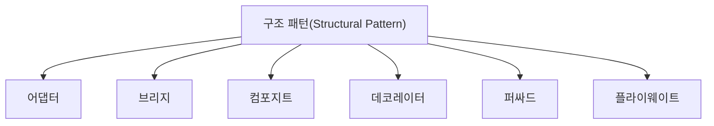

# 051 구조 패턴(Structural Pattern)

작성 기준일: 2026-05-02  
과목: `1과목 소프트웨어 설계`  
기준 PDF: `/Users/nes0903/Documents/study/정보처리기사/핵심요약집_2026_정보처리기사필기핵심요약.pdf`  
PDF 확인 위치: `7페이지`  
검색 보강: 공식/표준/고품질 참고 자료를 함께 확인하여 시험 중심으로 확장 정리

---

## 1. 한 줄 요약

- 구조 패턴은 클래스와 객체를 조합하여 더 큰 구조를 만들고, 인터페이스 변환, 기능 추가, 접근 대리, 공유 등을 해결하는 디자인 패턴이다.
- 이 챕터는 `디자인 패턴` 영역에 속한다.
- 시험에서는 정의, 핵심 키워드, 비슷한 개념과의 구분을 함께 묻는 경우가 많다.

---

## 2. PDF 기준 핵심

- 어댑터: 인터페이스를 다른 클래스가 재사용할 수 있도록 변환한다.
- 브리지: 서로가 독립적으로 확장할 수 있도록 구성한다.
- 컴포지트: 복합 객체와 단일 객체를 구분 없이 다룬다.
- 데코레이터: 부가적인 기능을 추가하기 위해 다른 객체들을 덧붙인다.
- 퍼싸드: 복잡한 서브 클래스들을 피해 더 상위에 인터페이스를 구성한다.
- 플라이웨이트: 가능한 한 인스턴스를 공유해서 메모리를 절약한다.
- 프록시: 접근이 어려운 객체와 연결하려는 객체 사이에서 인터페이스 역할을 수행한다.

- 위 항목은 PDF에서 직접 확인한 최소 암기 골격이다.
- 세부 설명은 이 골격을 기준으로 확장해서 이해하면 된다.

---

## 3. 개념 설명

- 어댑터는 호환되지 않는 인터페이스를 맞춰준다.
- 브리지는 추상과 구현을 분리해 독립 확장을 돕는다.
- 컴포지트는 트리 구조에서 부분과 전체를 동일하게 다룬다.
- 데코레이터는 기존 객체를 감싸 부가 기능을 동적으로 추가한다.
- 퍼싸드는 복잡한 내부 구조를 단순한 진입점으로 숨긴다.
- 플라이웨이트는 공유 가능한 객체를 재사용해 메모리를 아낀다.
- 프록시는 실제 객체 접근을 대신 제어한다.
- 디자인 패턴은 이름보다 어떤 문제를 어떤 방식으로 해결하는지 단서어로 구분한다.
- 생성/구조/행위 3분류와 각 패턴의 대표 단어를 연결해 외운다.

---

## 4. 핵심 포인트

- 문제를 풀 때는 먼저 지문 속 단서어를 찾고, 그 단서어가 어떤 개념을 가리키는지 연결한다.
- 정의형 문제는 표현이 조금 바뀌어도 핵심 의미가 같으면 같은 개념으로 판단한다.
- 옳고 그름 문제에서는 `항상`, `반드시`, `전혀`, `모두` 같은 극단 표현을 특히 조심한다.
- 이 챕터는 단독 암기보다 인접 챕터와 비교해 기억하면 정답률이 올라간다.

---

## 5. 시험에서 헷갈리는 비교

| 구분 | 핵심 |
|---|---|
| `Adapter` | 인터페이스 변환 |
| `Bridge` | 추상/구현 분리 |
| `Composite` | 부분-전체 동일 처리 |
| `Decorator` | 기능 덧붙임 |
| `Facade` | 단순 창구 |
| `Flyweight` | 공유로 메모리 절약 |
| `Proxy` | 대리 접근 |

- 비교 문제는 이름보다 `역할`, `목적`, `사용 시점`, `장점/단점`을 기준으로 구분하면 안정적이다.

---

## 6. 예시 또는 암기 포인트

- 구조 패턴 = `어-브-컴-데-퍼-플-프`.

- 암기는 단어만 외우기보다 `정의 -> 특징 -> 예시 -> 반대 개념` 순서로 묶는 것이 좋다.

---

## 7. 빠른 복습

- 챕터명: `051 구조 패턴(Structural Pattern)`
- 소속 영역: `디자인 패턴`
- 자주 나오는 문제 유형:
  - 정의를 주고 개념명을 고르는 문제
  - 특징을 섞어 놓고 옳은/틀린 설명을 고르는 문제
  - 유사 개념과 비교하여 다른 하나를 찾는 문제

---

## 8. 참고 링크

- 기준 PDF: `/Users/nes0903/Documents/study/정보처리기사/핵심요약집_2026_정보처리기사필기핵심요약.pdf`
- [Q-Net 정보처리기사 종목 페이지](https://www.q-net.or.kr/crf005.do?id=crf00503s02&jmCd=1320&jmInfoDivCcd=B0)
- [Refactoring.Guru - Design Patterns Catalog](https://refactoring.guru/design-patterns/catalog)
- [Microsoft - SOLID principles and Dependency Injection](https://learn.microsoft.com/en-us/dotnet/architecture/microservices/microservice-ddd-cqrs-patterns/microservice-application-layer-web-api-design)
